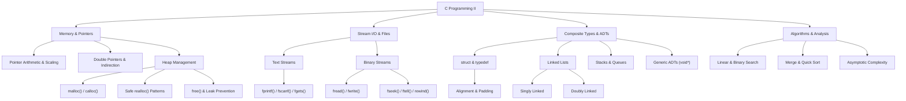

# Mindmap: C Programming II Architecture

## Conceptual Structure Overview

This taxonomy maps the advanced programming concepts, memory models, stream operations, and data structure relationships covered in C Programming II.

## Module Dependency Graph
1. **Pointers & Addressing** $\to$ Required for Dynamic Allocation and Structures.
2. **Dynamic Allocation** $\to$ Required for Dynamic Arrays and Linked Data Structures.
3. **Structures** $\to$ Required for Node Definitions and Binary Record Storage.
4. **File Streams** $\to$ Required for Persistent Storage and Database Projects.

