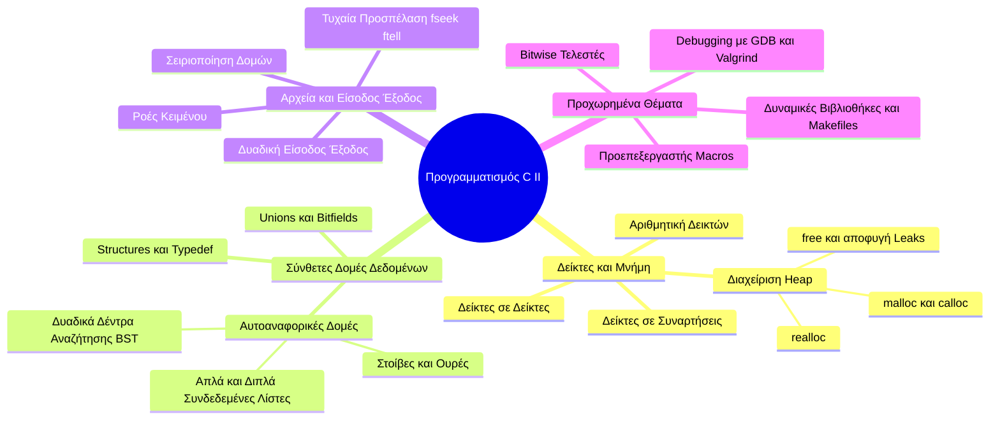

# Εννοιολογικός Χάρτης: Προχωρημένος Προγραμματισμός C

```mermaid
mindmap
  root((Προγραμματισμός C II))
    Δείκτες και Μνήμη
      Αριθμητική Δεικτών
      Δείκτες σε Δείκτες
      Δείκτες σε Συναρτήσεις
      Διαχείριση Heap
        malloc και calloc
        realloc
        free και αποφυγή Leaks
    Σύνθετες Δομές Δεδομένων
      Structures και Typedef
      Unions και Bitfields
      Αυτοαναφορικές Δομές
        Απλά και Διπλά Συνδεδεμένες Λίστες
        Στοίβες και Ουρές
        Δυαδικά Δέντρα Αναζήτησης BST
    Αρχεία και Είσοδος Έξοδος
      Ροές Κειμένου
      Δυαδική Είσοδος Έξοδος
      Τυχαία Προσπέλαση fseek ftell
      Σειριοποίηση Δομών
    Προχωρημένα Θέματα
      Προεπεξεργαστής Macros
      Bitwise Τελεστές
      Δυναμικές Βιβλιοθήκες και Makefiles
      Debugging με GDB και Valgrind
```

