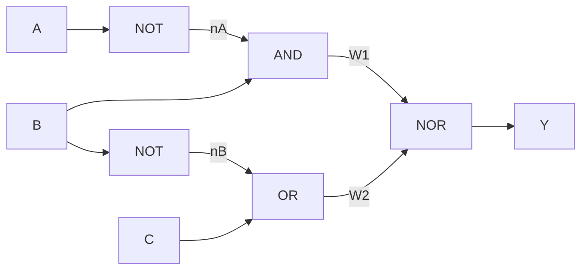

# Ασκήσεις: Θεωρία Λογικών Πυλών, Συνδυαστικά Κυκλώματα & Άλγεβρα Boole

Το παρόν αρχείο περιλαμβάνει αναλυτικά λυμένες ασκήσεις διαβαθμισμένης δυσκολίας για τις θεμελιώδεις λογικές πύλες (AND, OR, NOT, NAND, NOR, XOR, XNOR), τη μετατροπή μεταξύ παραστάσεων Boole και ψηφιακών κυκλωμάτων, την αλγεβρική απλοποίηση κυκλωμάτων, τις καθολικές πύλες (Universal Gates) και βασικά αριθμητικά κυκλώματα (Half Adder, Full Adder, Parity Checkers).

---

## Περιεχόμενα
1. [Άσκηση 1: Αποτίμηση και Πίνακας Αληθείας Σύνθετης Λογικής Έκφρασης](#άσκηση-1-αποτίμηση-και-πίνακας-αληθείας-σύνθετης-λογικής-έκφρασης)
2. [Άσκηση 2: Εξαγωγή Συνάρτησης Boole από Διάγραμμα Κυκλώματος](#άσκηση-2-εξαγωγή-συνάρτησης-boole-από-διάγραμμα-κυκλώματος)
3. [Άσκηση 3: Σύνθεση Κυκλώματος από Κανονική Έκφραση Boole](#άσκηση-3-σύνθεση-κυκλώματος-από-κανονική-έκφραση-boole)
4. [Άσκηση 4: Αλγεβρική Απλοποίηση Κυκλώματος Boole](#άσκηση-4-αλγεβρική-απλοποίηση-κυκλώματος-boole)
5. [Άσκηση 5: Καθολικότητα της Πύλης NAND (Universal Gate)](#άσκηση-5-καθολικότητα-της-πύλης-nand-universal-gate)
6. [Άσκηση 6: Καθολικότητα της Πύλης NOR (Universal Gate)](#άσκηση-6-καθολικότητα-της-πύλης-nor-universal-gate)
7. [Άσκηση 7: Σχεδίαση Ημιαθροιστή και Πλήρους Αθροιστή](#άσκηση-7-σχεδίαση-ημιαθροιστή-και-πλήρους-αθροιστή)
8. [Άσκηση 8: Γεννήτρια και Ελεγκτής Ισοτιμίας με Πύλες XOR](#άσκηση-8-γεννήτρια-και-ελεγκτής-ισοτιμίας-με-πύλες-xor)

---

### Άσκηση 1: Αποτίμηση και Πίνακας Αληθείας Σύνθετης Λογικής Έκφρασης
**Επίπεδο: Βασικό**

#### Εκφώνηση
Δίνεται η συνάρτηση Boole τριών μεταβλητών:
$$F(A, B, C) = \overline{(A \cdot B)} \oplus (B + \overline{C})$$
1. Υπολογίστε την τιμή της εξόδου $F$ για τον συνδυασμό εισόδων $A = 1, \; B = 1, \; C = 0$.
2. Κατασκευάστε τον πλήρη πίνακα αληθείας της συνάρτησης $F(A, B, C)$ αναγράφοντας όλες τις ενδιάμεσες στήλες.

#### Λύση
**1. Αποτίμηση για $A = 1, B = 1, C = 0$:**
- $\overline{C} = \overline{0} = 1$
- $A \cdot B = 1 \cdot 1 = 1$
- $\overline{A \cdot B} = \overline{1} = 0$
- $B + \overline{C} = 1 + 1 = 1$
- $F(1, 1, 0) = \overline{(A \cdot B)} \oplus (B + \overline{C}) = 0 \oplus 1 = 1$

**2. Πλήρης Πίνακας Αληθείας:**
Υπενθυμίζεται ότι η πύλη XOR ($\oplus$) παράγει έξοδο $1$ όταν οι δύο είσοδοι διαφέρουν ($0 \oplus 1 = 1$ και $1 \oplus 0 = 1$), ενώ παράγει $0$ όταν οι είσοδοι είναι ίδιες ($0 \oplus 0 = 0$ και $1 \oplus 1 = 0$).

| $A$ | $B$ | $C$ | $\overline{C}$ | $A \cdot B$ | $X = \overline{A \cdot B}$ | $Y = B + \overline{C}$ | $F = X \oplus Y$ |
|:---:|:---:|:---:|:---:|:---:|:---:|:---:|:---:|
| 0 | 0 | 0 | 1 | 0 | 1 | 1 | **0** |
| 0 | 0 | 1 | 0 | 0 | 1 | 0 | **1** |
| 0 | 1 | 0 | 1 | 0 | 1 | 1 | **0** |
| 0 | 1 | 1 | 0 | 0 | 1 | 1 | **0** |
| 1 | 0 | 0 | 1 | 0 | 1 | 1 | **0** |
| 1 | 0 | 1 | 0 | 0 | 1 | 0 | **1** |
| 1 | 1 | 0 | 1 | 1 | 0 | 1 | **1** |
| 1 | 1 | 1 | 0 | 1 | 0 | 1 | **1** |

Συνεπώς, η συνάρτηση $F$ λαμβάνει την τιμή $1$ στους συνδυασμούς minterms $m_1, m_5, m_6, m_7$, δηλαδή:
$$F(A, B, C) = \sum m(1, 5, 6, 7)$$

---

### Άσκηση 2: Εξαγωγή Συνάρτησης Boole από Διάγραμμα Κυκλώματος
**Επίπεδο: Βασικό προς Ενδιάμεσο**

#### Εκφώνηση
Θεωρούμε το παρακάτω συνδυαστικό κύκλωμα με εισόδους $A, B, C$:



1. Προσδιορίστε τις ενδιάμεσες Boole παραστάσεις στα σημεία $W_1$ και $W_2$.
2. Εξάγετε την τελική συνάρτηση εξόδου $Y(A, B, C)$.
3. Απλοποιήστε τη συνάρτηση εξόδου $Y(A, B, C)$ χρησιμοποιώντας νόμους De Morgan και Boole.

#### Λύση
**1. Ενδιάμεσες παραστάσεις:**
- Η πύλη $G_1$ (NOT) δέχεται το $A$, άρα παράγει $\overline{A}$.
- Η πύλη $G_3$ (AND) δέχεται το $\overline{A}$ και το $B$, συνεπώς:
  $$W_1 = \overline{A} \cdot B$$
- Η πύλη $G_2$ (NOT) δέχεται το $B$, άρα παράγει $\overline{B}$.
- Η πύλη $G_4$ (OR) δέχεται το $\overline{B}$ και το $C$, συνεπώς:
  $$W_2 = \overline{B} + C$$

**2. Τελική συνάρτηση εξόδου $Y(A, B, C)$:**
Η πύλη $G_5$ είναι πύλη NOR, η οποία πραγματοποιεί άθροισμα OR ακολουθούμενο από αντιστροφή NOT:
$$Y = \overline{W_1 + W_2} = \overline{(\overline{A} \cdot B) + (\overline{B} + C)}$$

**3. Απλοποίηση της συνάρτησης εξόδου:**
Εφαρμόζουμε τον πρώτο νόμο De Morgan ($\overline{X + Y} = \overline{X} \cdot \overline{Y}$):
$$Y = \overline{(\overline{A} \cdot B)} \cdot \overline{(\overline{B} + C)}$$
Εφαρμόζουμε ξανά τον νόμο De Morgan σε κάθε επιμέρους όρο:
- $\overline{\overline{A} \cdot B} = \overline{\overline{A}} + \overline{B} = A + \overline{B}$
- $\overline{\overline{B} + C} = \overline{\overline{B}} \cdot \overline{C} = B \cdot \overline{C}$

Συνεπώς:
$$Y = (A + \overline{B}) \cdot (B \cdot \overline{C})$$
Εφαρμόζουμε τον επιμεριστικό νόμο:
$$Y = A \cdot (B \cdot \overline{C}) + \overline{B} \cdot (B \cdot \overline{C})$$
Επειδή $\overline{B} \cdot B = 0$:
$$Y = A \cdot B \cdot \overline{C} + 0 = A B \overline{C}$$
Το αρχικό σύνθετο κύκλωμα 5 πυλών ισοδυναμεί με μία μόνο πύλη AND 3 εισόδων με ανεστραμμένη την είσοδο $C$!

---

### Άσκηση 3: Σύνθεση Κυκλώματος από Κανονική Έκφραση Boole
**Επίπεδο: Ενδιάμεσο**

#### Εκφώνηση
Δίνεται η συνάρτηση:
$$Z(A, B, C) = (A \oplus B) \cdot \overline{(B \cdot C)}$$
1. Περιγράψτε τα απαραίτητα βήματα και σχεδιάστε το λογικό κύκλωμα χρησιμοποιώντας αποκλειστικά βασικές πύλες (XOR, AND, NAND).
2. Υπολογίστε αναλυτικά τις τιμές της εξόδου $Z$ για όλους τους συνδυασμούς όπου $B = 1$.

#### Λύση
**1. Σχεδίαση Κυκλώματος:**
- Βήμα 1: Οι είσοδοι $A$ και $B$ οδηγούνται σε πύλη XOR 2 εισόδων, παράγοντας το σήμα $U_1 = A \oplus B$.
- Βήμα 2: Οι είσοδοι $B$ και $C$ οδηγούνται σε πύλη NAND 2 εισόδων, παράγοντας το σήμα $U_2 = \overline{B \cdot C}$.
- Βήμα 3: Τα σήματα $U_1$ και $U_2$ οδηγούνται σε πύλη AND 2 εισόδων, παράγοντας την τελική έξοδο $Z = U_1 \cdot U_2$.

Διάγραμμα κυκλώματος:
```mermaid
flowchart LR
    A[A] --> G1[XOR]
    B[B] --> G1
    B --> G2[NAND]
    C[C] --> G2
    
    G1 -->|A XOR B| G3[AND]
    G2 -->|NAND(B,C)| G3
    G3 --> Output[Z]
```

**2. Αποτίμηση για $B = 1$:**
Όταν $B = 1$, έχουμε:
- $U_1 = A \oplus 1 = \overline{A}$ (η πύλη XOR με είσοδο 1 λειτουργεί ως inverter NOT)
- $U_2 = \overline{1 \cdot C} = \overline{C}$
- $Z = \overline{A} \cdot \overline{C}$

Εξετάζουμε τους 4 συνδυασμούς όπου $B = 1$:
- Για $(A=0, B=1, C=0)$: $Z = \overline{0} \cdot \overline{0} = 1 \cdot 1 = 1$.
- Για $(A=0, B=1, C=1)$: $Z = \overline{0} \cdot \overline{1} = 1 \cdot 0 = 0$.
- Για $(A=1, B=1, C=0)$: $Z = \overline{1} \cdot \overline{0} = 0 \cdot 1 = 0$.
- Για $(A=1, B=1, C=1)$: $Z = \overline{1} \cdot \overline{1} = 0 \cdot 0 = 0$.

Συνεπώς, για $B=1$, η έξοδος $Z$ είναι $1$ μόνο όταν $A=0$ και $C=0$.

---

### Άσκηση 4: Αλγεβρική Απλοποίηση Κυκλώματος Boole
**Επίπεδο: Ενδιάμεσο προς Προχωρημένο**

#### Εκφώνηση
Δίνεται η παράσταση Boole αθροίσματος γινομένων (SOP):
$$F(A, B, C) = A \overline{B} C + A B C + \overline{A} B C + A \overline{B} \, \overline{C}$$
1. Απλοποιήστε αλγεβρικά την παράσταση $F$ στην ελάχιστη δυνατή μορφή, αναφέροντας ρητά τις ιδιότητες της άλγεβρας Boole που χρησιμοποιούνται σε κάθε βήμα.
2. Συγκρίνετε το κόστος υλοποίησης του αρχικού κυκλώματος έναντι του ελαχιστοποιημένου (σε πλήθος πυλών και εισόδων).

#### Λύση
**1. Βήμα-προς-βήμα αλγεβρική απλοποίηση:**
- **Αρχική παράσταση:**
  $$F = A \overline{B} C + A B C + \overline{A} B C + A \overline{B} \, \overline{C}$$
- **Βήμα 1 (Αναδιάταξη και ομαδοποίηση όρων):**
  Εφαρμόζουμε την αντιμεταθετική ιδιότητα της πρόσθεσης:
  $$F = (A \overline{B} C + A \overline{B} \, \overline{C}) + (A B C + \overline{A} B C)$$
- **Βήμα 2 (Επιμεριστικός νόμος στους δύο πρώτους όρους):**
  Βγάζουμε κοινό παράγοντα το $A \overline{B}$:
  $$A \overline{B} C + A \overline{B} \, \overline{C} = A \overline{B} (C + \overline{C})$$
  Επειδή $C + \overline{C} = 1$ (νόμος συμπληρώματος):
  $$A \overline{B} (1) = A \overline{B}$$
- **Βήμα 3 (Επιμεριστικός νόμος στους δύο επόμενους όρους):**
  Βγάζουμε κοινό παράγοντα το $B C$:
  $$A B C + \overline{A} B C = (A + \overline{A}) B C$$
  Επειδή $A + \overline{A} = 1$:
  $$(1) B C = B C$$
- **Βήμα 4 (Σύνθεση των απλοποιημένων όρων):**
  $$F = A \overline{B} + B C$$
- **Βήμα 5 (Περαιτέρω διερεύνηση/Κανόνας εξάλειψης):**
  Εξετάζουμε αν απλοποιείται περαιτέρω.
  Από τον κανόνα $X + \overline{X} Y = X + Y$, εδώ έχουμε $BC + A\overline{B}$.
  Εφαρμόζουμε επιμεριστικότητα ως προς το $+$:
  $$F = (B C + A)(B C + \overline{B}) = (A + B C)(B + \overline{B})(C + \overline{B}) = (A + B C)(1)(\overline{B} + C) = A \overline{B} + A C + B C \overline{B} + B C C = A \overline{B} + A C + B C$$
  Η μορφή $F = A \overline{B} + B C$ αποτελεί ελάχιστο άθροισμα γινομένων (SOP) με 2 όρους και 4 literals.

**2. Σύγκριση Κόστους Υλοποίησης:**
- **Αρχικό κύκλωμα:**
  - 4 πύλες AND 3 εισόδων
  - 1 πύλη OR 4 εισόδων
  - 3 αντιστροφείς NOT για τα $\overline{A}, \overline{B}, \overline{C}$
  - Σύνολο: 8 πύλες, 19 είσοδοι.
- **Ελαχιστοποιημένο κύκλωμα ($F = A \overline{B} + B C$):**
  - 2 πύλες AND 2 εισόδων
  - 1 πύλη OR 2 εισόδων
  - 1 αντιστροφέας NOT για το $\overline{B}$
  - Σύνολο: 4 πύλες, 7 είσοδοι.
- **Εξοικονόμηση:** Μείωση 50% στις πύλες και πάνω από 63% στις εισόδους κυκλώματος.

---

### Άσκηση 5: Καθολικότητα της Πύλης NAND (Universal Gate)
**Επίπεδο: Προχωρημένο**

#### Εκφώνηση
Η πύλη NAND ονομάζεται «καθολική» (universal gate) διότι κάθε λογική συνάρτηση μπορεί να υλοποιηθεί αποκλειστικά και μόνο με πύλες NAND 2 εισόδων.
Δείξτε πώς κατασκευάζονται οι ακόλουθες πύλες χρησιμοποιώντας αποκλειστικά πύλες NAND 2 εισόδων:
1. Πύλη NOT ($\overline{A}$)
2. Πύλη AND ($A \cdot B$)
3. Πύλη OR ($A + B$)
4. Πύλη XOR ($A \oplus B$)

#### Λύση
Συμβολίζουμε την πράξη NAND ως $\uparrow$, όπου $X \uparrow Y = \overline{X \cdot Y}$.

**1. Υλοποίηση πύλης NOT:**
Συνδέουμε τις δύο εισόδους της πύλης NAND μαζί στην ίδια μεταβλητή $A$:
$$A \uparrow A = \overline{A \cdot A} = \overline{A}$$
Απαιτείται: **1 πύλη NAND**.

**2. Υλοποίηση πύλης AND:**
Γνωρίζουμε ότι $A \cdot B = \overline{\overline{A \cdot B}}$. Συνεπώς, υπολογίζουμε το NAND των $A, B$ και στη συνέχεια αντιστρέφουμε το αποτέλεσμα με μία δεύτερη πύλη NAND (που λειτουργεί ως NOT):
$$\text{AND}(A, B) = (A \uparrow B) \uparrow (A \uparrow B) = \overline{\overline{A \cdot B}} = A \cdot B$$
Απαιτούνται: **2 πύλες NAND**.

**3. Υλοποίηση πύλης OR:**
Από τον νόμο De Morgan, $A + B = \overline{\overline{A} \cdot \overline{B}}$.
Αντιστρέφουμε πρώτα τα $A$ και $B$ με 2 πύλες NAND, και οδηγούμε τις εξόδους σε μία τρίτη πύλη NAND:
$$\overline{A} = A \uparrow A, \quad \overline{B} = B \uparrow B$$
$$(A \uparrow A) \uparrow (B \uparrow B) = \overline{\overline{A} \cdot \overline{B}} = \overline{\overline{A}} + \overline{\overline{B}} = A + B$$
Απαιτούνται: **3 πύλες NAND**.

**4. Υλοποίηση πύλης XOR:**
Η XOR αναλύεται ως:
$$A \oplus B = A \overline{B} + \overline{A} B = A \overline{A B} + B \overline{A B}$$
Μπορεί να υλοποιηθεί με μόλις **4 πύλες NAND**:
- Έστω $N_1 = A \uparrow B = \overline{A \cdot B}$.
- Έστω $N_2 = A \uparrow N_1 = \overline{A \cdot \overline{A \cdot B}} = \overline{A \cdot (\overline{A} + \overline{B})} = \overline{A \overline{B}} = \overline{A} + B$.
- Έστω $N_3 = B \uparrow N_1 = \overline{B \cdot \overline{A \cdot B}} = \overline{B \cdot (\overline{A} + \overline{B})} = \overline{\overline{A} B} = A + \overline{B}$.
- Τελική έξοδος:
  $$N_4 = N_2 \uparrow N_3 = \overline{N_2 \cdot N_3} = \overline{(\overline{A} + B)(A + \overline{B})} = \overline{\overline{A}\,\overline{B} + A B} = A \oplus B$$
Απαιτούνται: **4 πύλες NAND**.

---

### Άσκηση 6: Καθολικότητα της Πύλης NOR (Universal Gate)
**Επίπεδο: Προχωρημένο**

#### Εκφώνηση
Η πύλη NOR είναι επίσης καθολική (universal gate). Συμβολίζουμε τη λειτουργία της ως $\downarrow$, όπου $X \downarrow Y = \overline{X + Y}$.
Δείξτε πώς κατασκευάζονται οι ακόλουθες πύλες χρησιμοποιώντας αποκλειστικά πύλες NOR 2 εισόδων:
1. Πύλη NOT ($\overline{A}$)
2. Πύλη OR ($A + B$)
3. Πύλη AND ($A \cdot B$)

#### Λύση
**1. Υλοποίηση πύλης NOT:**
Συνδέουμε τις δύο εισόδους της πύλης NOR στην είσοδο $A$:
$$A \downarrow A = \overline{A + A} = \overline{A}$$
Απαιτείται: **1 πύλη NOR**.

**2. Υλοποίηση πύλης OR:**
Γνωρίζουμε ότι $A + B = \overline{\overline{A + B}}$. Υπολογίζουμε το $A \downarrow B$ και το αντιστρέφουμε με δεύτερη πύλη NOR:
$$\text{OR}(A, B) = (A \downarrow B) \downarrow (A \downarrow B) = \overline{\overline{A + B}} = A + B$$
Απαιτούνται: **2 πύλες NOR**.

**3. Υλοποίηση πύλης AND:**
Από τον νόμο De Morgan, $A \cdot B = \overline{\overline{A} + \overline{B}}$.
Αντιστρέφουμε τις εισόδους με 2 πύλες NOR και οδηγούμε τα αποτελέσματα σε μία τρίτη πύλη NOR:
$$\overline{A} = A \downarrow A, \quad \overline{B} = B \downarrow B$$
$$\text{AND}(A, B) = (A \downarrow A) \downarrow (B \downarrow B) = \overline{\overline{A} + \overline{B}} = \overline{\overline{A}} \cdot \overline{\overline{B}} = A \cdot B$$
Απαιτούνται: **3 πύλες NOR**.

---

### Άσκηση 7: Σχεδίαση Ημιαθροιστή και Πλήρους Αθροιστή
**Επίπεδο: Προχωρημένο**

#### Εκφώνηση
1. **Ημιαθροιστής (Half Adder):**
   - Κατασκευάστε τον πίνακα αληθείας για την πρόσθεση δύο δυαδικών ψηφίων $A$ και $B$, παράγοντας το άθροισμα $S$ (Sum) και το κρατούμενο $C$ (Carry).
   - Γράψτε τις λογικές συναρτήσεις των $S$ και $C$ και σχεδιάστε το κύκλωμα.
2. **Πλήρης Αθροιστής (Full Adder):**
   - Κατασκευάστε τον πίνακα αληθείας για την πρόσθεση τριών ψηφίων: $A, B$ και κρατούμενου εισόδου $C_{in}$.
   - Αποδείξτε ότι ο Full Adder μπορεί να υλοποιηθεί χρησιμοποιώντας ακριβώς 2 Ημιαθροιστές και 1 πύλη OR.

#### Λύση
**1. Ημιαθροιστής (Half Adder):**
Ο πίνακας αληθείας πρόσθεσης $A + B$:

| $A$ | $B$ | Άθροισμα ($S$) | Κρατούμενο ($C$) |
|:---:|:---:|:---:|:---:|
| 0 | 0 | 0 | 0 |
| 0 | 1 | 1 | 0 |
| 1 | 0 | 1 | 0 |
| 1 | 1 | 0 | 1 |

Από τον πίνακα προκύπτουν άμεσα οι εξισώσεις:
- $S = A \oplus B$ (πύλη XOR)
- $C = A \cdot B$ (πύλη AND)

**2. Πλήρης Αθροιστής (Full Adder):**
Ο πίνακας αληθείας για $A + B + C_{in}$:

| $A$ | $B$ | $C_{in}$ | Άθροισμα ($S$) | Κρατούμενο εξόδου ($C_{out}$) |
|:---:|:---:|:---:|:---:|:---:|
| 0 | 0 | 0 | 0 | 0 |
| 0 | 0 | 1 | 1 | 0 |
| 0 | 1 | 0 | 1 | 0 |
| 0 | 1 | 1 | 0 | 1 |
| 1 | 0 | 0 | 1 | 0 |
| 1 | 0 | 1 | 0 | 1 |
| 1 | 1 | 0 | 0 | 1 |
| 1 | 1 | 1 | 1 | 1 |

- **Ανάλυση του $S$:**
  Το $S$ είναι $1$ όταν το πλήθος των άσσων στις εισόδους είναι περιττό (1 ή 3). Αυτό εκφράζεται άμεσα από τη διαδοχική εφαρμογή XOR:
  $$S = A \oplus B \oplus C_{in}$$
- **Ανάλυση του $C_{out}$:**
  Το $C_{out}$ είναι $1$ αν τουλάχιστον δύο είσοδοι είναι $1$.
  Χρησιμοποιώντας τον πρώτο ημιαθροιστή στα $A, B$:
  $$S_1 = A \oplus B, \quad C_1 = A \cdot B$$
  Χρησιμοποιώντας τον δεύτερο ημιαθροιστή στο $S_1$ και το $C_{in}$:
  $$S = S_1 \oplus C_{in} = (A \oplus B) \oplus C_{in}$$
  $$C_2 = S_1 \cdot C_{in} = (A \oplus B) \cdot C_{in}$$
  Το συνολικό κρατούμενο εξόδου είναι:
  $$C_{out} = C_1 + C_2 = (A \cdot B) + (A \oplus B) \cdot C_{in}$$
  Επαληθεύουμε αλγεβρικά ότι $(A \cdot B) + (A \oplus B) \cdot C_{in} = A B + A C_{in} + B C_{in}$:
  $$(A \cdot B) + (\overline{A} B + A \overline{B}) C_{in} = A B + \overline{A} B C_{in} + A \overline{B} C_{in}$$
  $$= B (A + \overline{A} C_{in}) + A \overline{B} C_{in} = B (A + C_{in}) + A \overline{B} C_{in} = A B + B C_{in} + A \overline{B} C_{in}$$
  $$= A B + C_{in} (B + A \overline{B}) = A B + C_{in} (B + A) = A B + B C_{in} + A C_{in}$$
  Η ισοδυναμία ισχύει πλήρως. Συνεπώς, ένας Full Adder συντίθεται από 2 Half Adders και 1 πύλη OR. $\blacksquare$

---

### Άσκηση 8: Γεννήτρια και Ελεγκτής Ισοτιμίας με Πύλες XOR
**Επίπεδο: Προχωρημένο**

#### Εκφώνηση
Στα συστήματα ψηφιακών τηλεπικοινωνιών, το bit άρτιας ισοτιμίας (even parity bit) $P$ προστίθεται σε μια λέξη δεδομένων $n$ bits ώστε ο συνολικός αριθμός των μονάδων (1) στη μεταδιδόμενη λέξη να είναι πάντα άρτιος.
1. Για λέξη δεδομένων 3 bits $D = (D_2, D_1, D_0)$, γράψτε τη μαθηματική έκφραση του bit άρτιας ισοτιμίας $P$ και σχεδιάστε το κύκλωμα παραγωγής του.
2. Κατά τη λήψη της τετράδας $(D_2, D_1, D_0, P)$, σχεδιάστε το κύκλωμα ελέγχου σφάλματος (Parity Checker) που παράγει έξοδο $E = 1$ εάν έχει συμβεί μονό σφάλμα κατά τη μετάδοση.
3. Αποδείξτε επαγωγικά ότι η έξοδος $X_1 \oplus X_2 \oplus \dots \oplus X_n$ είναι $1$ αν και μόνο αν το πλήθος των μεταβλητών που ισούνται με $1$ είναι περιττός αριθμός.

#### Λύση
**1. Παραγωγή Bit Άρτιας Ισοτιμίας:**
Θέλουμε το συνολικό πλήθος των μονάδων στο $(D_2, D_1, D_0, P)$ να είναι άρτιο.
- Αν το άθροισμα $D_2 + D_1 + D_0$ είναι περιττό, πρέπει $P = 1$.
- Αν το άθροισμα $D_2 + D_1 + D_0$ είναι άρτιο, πρέπει $P = 0$.
Αυτή είναι ακριβώς η λειτουργία της συνάρτησης XOR:
$$P = D_2 \oplus D_1 \oplus D_0$$
Το κύκλωμα παραγωγής υλοποιείται με δύο διαδοχικές πύλες XOR 2 εισόδων.

**2. Ελεγκτής Σφάλματος Ισοτιμίας (Parity Checker):**
Ο δέκτης λαμβάνει 4 bits: $D_2, D_1, D_0, P$.
Υπολογίζει τη συνάρτηση ελέγχου συνδρόμου:
$$E = D_2 \oplus D_1 \oplus D_0 \oplus P$$
- Αν δεν υπήρξε σφάλμα (ή υπήρξε άρτιος αριθμός σφαλμάτων), ο συνολικός αριθμός των μονάδων παραμένει άρτιος, οπότε $E = 0$.
- Αν υπήρξε μονό σφάλμα (ένα bit άλλαξε από 0 σε 1 ή από 1 σε 0), ο συνολικός αριθμός των μονάδων γίνεται περιττός, οπότε $E = 1$, σηματοδοτώντας σφάλμα.

**3. Απόδειξη της Ιδιότητας Ισοτιμίας της XOR:**
Θα αποδείξουμε με μαθηματική επαγωγή στο $n \ge 2$ ότι:
$$f_n(X_1, \dots, X_n) = X_1 \oplus \dots \oplus X_n = 1 \iff \sum_{i=1}^n X_i \equiv 1 \pmod 2$$

- **Βάση Επαγωγής ($n = 2$):**
  Εξ ορισμού της πύλης XOR 2 εισόδων:
  $0 \oplus 0 = 0$ (άθροισμα 0, άρτιο)
  $0 \oplus 1 = 1$ (άθροισμα 1, περιττό)
  $1 \oplus 0 = 1$ (άθροισμα 1, περιττό)
  $1 \oplus 1 = 0$ (άθροισμα 2, άρτιο)
  Η πρόταση ισχύει για $n=2$.

- **Επαγωγική Υπόθεση:**
  Υποθέτουμε ότι η πρόταση ισχύει για $n = k \ge 2$, δηλαδή:
  $$S_k = X_1 \oplus \dots \oplus X_k = \begin{cases} 1, & \text{αν το πλήθος των μονάδων είναι περιττό} \\ 0, & \text{αν το πλήθος των μονάδων είναι άρτιο} \end{cases}$$

- **Επαγωγικό Βήμα:**
  Θεωρούμε $k+1$ μεταβλητές:
  $$S_{k+1} = S_k \oplus X_{k+1}$$
  Διακρίνουμε περιπτώσεις για την τιμή του $X_{k+1}$:
  - **Περίπτωση 1: $X_{k+1} = 0$.**
    Το πλήθος των μονάδων στις $k+1$ μεταβλητές είναι ίδιο με αυτό των $k$ μεταβλητών.
    $$S_{k+1} = S_k \oplus 0 = S_k$$
    Η τιμή παραμένει 1 αν και μόνο αν το αρχικό πλήθος ήταν περιττό.
  - **Περίπτωση 2: $X_{k+1} = 1$.**
    Το πλήθος των μονάδων στις $k+1$ μεταβλητές αυξάνεται κατά 1.
    - Αν στις πρώτες $k$ ήταν άρτιο ($S_k = 0$), τώρα γίνεται περιττό, και $S_{k+1} = 0 \oplus 1 = 1$.
    - Αν στις πρώτες $k$ ήταν περιττό ($S_k = 1$), τώρα γίνεται άρτιο, και $S_{k+1} = 1 \oplus 1 = 0$.

Σε κάθε περίπτωση, $S_{k+1} = 1$ αν και μόνο αν το συνολικό πλήθος των μονάδων είναι περιττό.
Η πρόταση αποδείχθηκε για κάθε $n \ge 2$. $\blacksquare$
