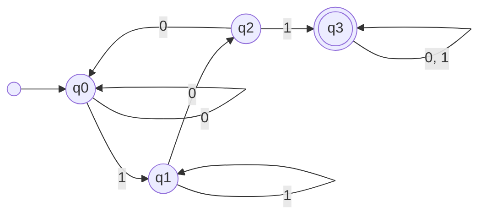
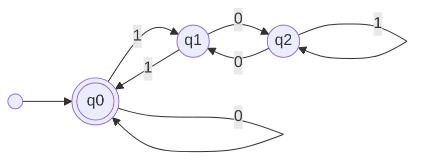

# Ασκήσεις: Τυπικές Γλώσσες, Κανονικές Εκφράσεις, Αυτόματα DFA/NFA & Ελαχιστοποίηση

Το παρόν αρχείο περιλαμβάνει αναλυτικά λυμένες ασκήσεις διαβαθμισμένης δυσκολίας για τη Θεωρία Αυτομάτων και τις Τυπικές Γλώσσες. Καλύπτονται οι πράξεις επί συμβολοσειρών και γλωσσών (παράθεση, αναστροφή, αστέρι Kleene), η σύνθεση κανονικών εκφράσεων (Regex), η σχεδίαση Ντετερμινιστικών Πεπερασμένων Αυτομάτων (DFA) για μοτίβα και αριθμητική υπολοίπων, τα Μη Ντετερμινιστικά Πεπερασμένα Αυτόματα (NFA) και η $\varepsilon$-κλειστότητα, η μετατροπή NFA σε DFA μέσω της κατασκευής υποσυνόλων (subset construction), η ελαχιστοποίηση καταστάσεων DFA (table-filling algorithm), καθώς και η απόδειξη μη κανονικότητας μέσω του Λήμματος Άντλησης (Pumping Lemma).

---

## Περιεχόμενα
1. [Άσκηση 1: Συμβολοσειρές, Πράξεις Γλωσσών και Ιδιότητες Αστεριού Kleene](#άσκηση-1-συμβολοσειρές-πράξεις-γλωσσών-και-ιδιότητες-αστεριού-kleene)
2. [Άσκηση 2: Σχεδίαση Κανονικών Εκφράσεων (Regular Expressions)](#άσκηση-2-σχεδίαση-κανονικών-εκφράσεων-regular-expressions)
3. [Άσκηση 3: Σχεδίαση DFA για Αναγνώριση Υποσυμβολοσειράς](#άσκηση-3-σχεδίαση-dfa-για-αναγνώριση-υποσυμβολοσειράς)
4. [Άσκηση 4: DFA για Διαιρετότητα Δυαδικών Αριθμών (Modulo Αριθμητική)](#άσκηση-4-dfa-για-διαιρετότητα-δυαδικών-αριθμών-modulo-αριθμητική)
5. [Άσκηση 5: Μη Ντετερμινιστικό Αυτόματο με $\varepsilon$-Μεταβάσεις ($\varepsilon$-NFA)](#άσκηση-5-μη-ντετερμινιστικό-αυτόματο-με-varepsilon-μεταβάσεις-varepsilon-nfa)
6. [Άσκηση 6: Μετατροπή NFA σε Ισοδύναμο DFA (Κατασκευή Υποσυνόλων)](#άσκηση-6-μετατροπή-nfa-σε-ισοδύναμο-dfa-κατασκευή-υποσυνόλων)
7. [Άσκηση 7: Ελαχιστοποίηση Καταστάσεων DFA (Αλγόριθμος Table-Filling)](#άσκηση-7-ελαχιστοποίηση-καταστάσεων-dfa-αλγόριθμος-table-filling)
8. [Άσκηση 8: Απόδειξη Μη Κανονικής Γλώσσας με το Λήμμα Άντλησης (Pumping Lemma)](#άσκηση-8-απόδειξη-μη-κανονικής-γλώσσας-με-το-λήμμα-άντλησης-pumping-lemma)

---

### Άσκηση 1: Συμβολοσειρές, Πράξεις Γλωσσών και Ιδιότητες Αστεριού Kleene
**Επίπεδο: Βασικό**

#### Εκφώνηση
Έστω το δυαδικό αλφάβητο $\Sigma = \{0, 1\}$.
1. Για τις συμβολοσειρές $u = 011$ και $v = 10$:
   - Υπολογίστε τα μήκη $|u|$, $|v|$ και την παράθεση $uv$.
   - Υπολογίστε τις αναστροφές $u^R$, $v^R$ και επαληθεύστε ότι $(uv)^R = v^R u^R$.
   - Υπολογίστε τη δύναμη $u^2$.
2. Έστω οι γλώσσες $L_1 = \{0, 01\}$ και $L_2 = \{1, 10\}$.
   - Υπολογίστε τη γλώσσα παράθεσης $L_1 L_2$.
   - Υπολογίστε τη γλώσσα $L_1^2$.
3. Αποδείξτε ότι για οποιαδήποτε γλώσσα $L \subseteq \Sigma^*$, ισχύει:
   $$(L^*)^* = L^*$$
4. Εξηγήστε τη διαφορά μεταξύ της κενής γλώσσας $\emptyset$, της γλώσσας $\{\varepsilon\}$ που περιέχει μόνο την κενή συμβολοσειρά, και του αστέρα της κενής γλώσσας $\emptyset^*$.

#### Λύση
**1. Υπολογισμοί επί των συμβολοσειρών $u = 011$ και $v = 10$:**
- **Μήκη:**
  - $|u| = 3$
  - $|v| = 2$
- **Παράθεση (Concatenation):**
  $$uv = 01110, \quad |uv| = |u| + |v| = 3 + 2 = 5$$
- **Αναστροφή (Reversal):**
  - $u^R = (011)^R = 110$
  - $v^R = (10)^R = 01$
  - $(uv)^R = (01110)^R = 01110 \dots$ από δεξιά προς αριστερά: $01110 \to 01110$? Ας διαβάσουμε το $01110$ αντίστροφα:
    - Τελευταίο σύμβολο: $0$
    - Προτελευταίο: $1$
    - Τρίτο: $1$
    - Δεύτερο: $1$
    - Πρώτο: $0$
    - Άρα $(uv)^R = 01110$.
  - Ελέγχουμε το γινόμενο $v^R u^R$:
    $$v^R u^R = (01)(110) = 01110$$
  - Πράγματι, $(uv)^R = v^R u^R$.
- **Δύναμη $u^2$:**
  $$u^2 = uu = (011)(011) = 011011$$

**2. Υπολογισμοί γλωσσών $L_1 = \{0, 01\}$ και $L_2 = \{1, 10\}$:**
- **Παράθεση $L_1 L_2 = \{xy \mid x \in L_1, \; y \in L_2\}$:**
  - Για $x = 0$: $0 \cdot 1 = 01$, $0 \cdot 10 = 010$.
  - Για $x = 01$: $01 \cdot 1 = 011$, $01 \cdot 10 = 0110$.
  - Άρα:
    $$L_1 L_2 = \{01, 010, 011, 0110\}$$
- **Δύναμη $L_1^2 = L_1 L_1$:**
  - $0 \cdot 0 = 00$
  - $0 \cdot 01 = 001$
  - $01 \cdot 0 = 010$
  - $01 \cdot 01 = 0101$
  - Άρα:
    $$L_1^2 = \{00, 001, 010, 0101\}$$

**3. Απόδειξη της ισότητας $(L^*)^* = L^*$:**
Υπενθυμίζουμε ότι $L^* = \bigcup_{k=0}^{\infty} L^k = L^0 \cup L^1 \cup L^2 \cup \dots$, όπου $L^0 = \{\varepsilon\}$.
- **Κατεύθυνση 1 ($L^* \subseteq (L^*)^*$):**
  Επειδή $L^* = (L^*)^1$ και $(L^*)^1 \subseteq \bigcup_{k=0}^{\infty} (L^*)^k = (L^*)^*$, έπεται άμεσα ότι:
  $$L^* \subseteq (L^*)^*$$
- **Κατεύθυνση 2 ($(L^*)^* \subseteq L^*$):**
  Έστω $w \in (L^*)^*$.
  Αυτό σημαίνει ότι υπάρχει $m \ge 0$ τέτοιο ώστε $w \in (L^*)^m$.
  - Αν $m = 0$, τότε $w = \varepsilon \in L^0 \subseteq L^*$.
  - Αν $m \ge 1$, τότε $w = w_1 w_2 \dots w_m$ όπου κάθε $w_i \in L^*$.
    Για κάθε $i \in \{1, \dots, m\}$, επειδή $w_i \in L^*$, το $w_i$ είναι παράθεση πεπερασμένου πλήθους συμβολοσειρών του $L$:
    $$w_i = x_{i,1} x_{i,2} \dots x_{i, k_i} \quad \text{με } x_{i, j} \in L$$
    Συνεπώς:
    $$w = (x_{1,1} \dots x_{1,k_1})(x_{2,1} \dots x_{2,k_2}) \dots (x_{m,1} \dots x_{m,k_m})$$
    Το $w$ είναι παράθεση πεπερασμένου πλήθους στοιχείων του $L$, πράγμα που σημαίνει εξ ορισμού ότι $w \in L^*$.
    Άρα $(L^*)^* \subseteq L^*$.
Από τις δύο κατευθύνσεις προκύπτει $(L^*)^* = L^*$.

**4. Σύγκριση $\emptyset$, $\{\varepsilon\}$ και $\emptyset^*$:**
- $\emptyset$: Είναι το **κενό σύνολο**, η γλώσσα που δεν περιέχει καμία απολύτως συμβολοσειρά. Έχει πληθικότητα $|\emptyset| = 0$.
- $\{\varepsilon\}$: Είναι η γλώσσα που περιέχει **ακριβώς μία συμβολοσειρά**, την κενή συμβολοσειρά $\varepsilon$ (μήκους 0). Έχει πληθικότητα $|\{\varepsilon\}| = 1$.
- $\emptyset^*$: Εξ ορισμού του αστεριού Kleene, $\emptyset^* = \bigcup_{k=0}^{\infty} \emptyset^k = \emptyset^0 \cup \emptyset^1 \cup \dots$
  Όμως για οποιαδήποτε γλώσσα, η μηδενική δύναμη ορίζεται ως $\emptyset^0 = \{\varepsilon\}$.
  Για $k \ge 1$, $\emptyset^k = \emptyset$.
  Συνεπώς:
  $$\emptyset^* = \{\varepsilon\} \cup \emptyset \cup \emptyset \dots = \{\varepsilon\}$$
  Άρα $\emptyset^* = \{\varepsilon\} \ne \emptyset$.

---

### Άσκηση 2: Σχεδίαση Κανονικών Εκφράσεων (Regular Expressions)
**Επίπεδο: Βασικό προς Ενδιάμεσο**

#### Εκφώνηση
Για το δυαδικό αλφάβητο $\Sigma = \{0, 1\}$, κατασκευάστε μια Κανονική Έκφραση (Regular Expression) για καθεμία από τις παρακάτω γλώσσες:
1. $L_1$: Το σύνολο όλων των συμβολοσειρών που αρχίζουν με $01$ και τελειώνουν με $10$.
2. $L_2$: Το σύνολο όλων των συμβολοσειρών που περιέχουν τουλάχιστον δύο άσσους ($1$).
3. $L_3$: Το σύνολο όλων των συμβολοσειρών που έχουν άρτιο μήκος.
4. $L_4$: Το σύνολο όλων των συμβολοσειρών που ΔΕΝ περιέχουν το υπομοτίβο $11$.
5. $L_5$: Το σύνολο όλων των συμβολοσειρών που έχουν άρτιο αριθμό από μηδενικά ($0$) και οποιοδήποτε πλήθος από άσσους ($1$).

#### Λύση
**1. Γλώσσα $L_1$ (αρχίζει με $01$, τελειώνει με $10$):**
- Μια συμβολοσειρά αυτής της γλώσσας μπορεί να έχει μήκος τουλάχιστον 4 (όπου τα δύο μοτίβα δεν επικαλύπτονται, π.χ. $0110$), ή μήκος 3 αν τα μοτίβα επικαλύπτονται ($010$ - αρχίζει με $01$ και τελειώνει με $10$).
- Η γενική έκφραση καλύπτει και τις δύο περιπτώσεις:
  - Αν υπάρχει ενδιάμεσο τμήμα: $01(0 \mid 1)^*10$.
  - Ελέγχουμε τη συμβολοσειρά $010$:
    Μπορεί να παραχθεί από το $01(0 \mid 1)^*10$; Όχι άμεσα, διότι απαιτεί τουλάχιστον 4 σύμβολα αν γραφεί ως $01 \dots 10$.
    Άρα πρέπει να συμπεριλάβουμε ρητά την επικάλυψη:
    $$R_1 = 010 \mid 01(0 \mid 1)^*10$$

**2. Γλώσσα $L_2$ (τουλάχιστον δύο άσσους):**
- Απαιτείται να υπάρχουν τουλάχιστον δύο $1$, με οποιονδήποτε αριθμό από $0$ ή $1$ πριν, ανάμεσα και μετά:
  $$R_2 = (0 \mid 1)^* 1 (0 \mid 1)^* 1 (0 \mid 1)^*$$
- Εναλλακτικά, επιτρέποντας μόνο μηδενικά ανάμεσα στους δύο απαραίτητους άσσους:
  $$R_2 = 0^* 1 0^* 1 (0 \mid 1)^*$$

**3. Γλώσσα $L_3$ (άρτιο μήκος):**
- Κάθε συμβολοσειρά άρτιου μήκους αποτελείται από ακολουθίες μπλοκ των 2 συμβόλων.
- Ένα ζεύγος συμβόλων εκφράζεται ως $(0 \mid 1)(0 \mid 1)$.
- Επομένως, ο αστέρας Kleene επί αυτών των ζευγών δίνει:
  $$R_3 = ((0 \mid 1)(0 \mid 1))^*$$
  (Περιλαμβάνει και την κενή συμβολοσειρά $\varepsilon$, η οποία έχει μήκος $0$, άρτιο).

**4. Γλώσσα $L_4$ (χωρίς το υπομοτίβο $11$):**
- Σε μια συμβολοσειρά χωρίς $11$, κάθε $1$ πρέπει υποχρεωτικά να ακολουθείται από τουλάχιστον ένα $0$, εκτός ενδεχομένως από το τελευταίο σύμβολο της συμβολοσειράς.
- Τα επιτρεπόμενα βασικά δομικά στοιχεία είναι:
  - Μεμονωμένο $0$
  - Ζεύγος $10$
- Αυτά μπορούν να επαναλαμβάνονται αυθαίρετα: $(0 \mid 10)^*$.
- Στο τέλος μπορεί να υπάρχει ένα προαιρετικό $1$: $(1 \mid \varepsilon)$.
- Συνεπώς:
  $$R_4 = (0 \mid 10)^* (1 \mid \varepsilon)$$

**5. Γλώσσα $L_5$ (άρτιο πλήθος μηδενικών):**
- Το σύμβολο $1$ μπορεί να εμφανίζεται οπουδήποτε, δηλαδή περιγράφεται από $1^*$.
- Τα μηδενικά πρέπει να εμφανίζονται σε ζεύγη. Κάθε ζεύγος μηδενικών έχει τη μορφή:
  $$0 \, 1^* \, 0$$
- Αυτά τα ζεύγη μπορούν να επαναλαμβάνονται μηδέν ή περισσότερες φορές, περιτριγυρισμένα από άσσους:
  $$R_5 = 1^* (0 \, 1^* \, 0 \, 1^*)^*$$

---

### Άσκηση 3: Σχεδίαση DFA για Αναγνώριση Υποσυμβολοσειράς
**Επίπεδο: Ενδιάμεσο**

#### Εκφώνηση
Θεωρούμε το αλφάβητο $\Sigma = \{0, 1\}$. Ζητείται η σχεδίαση ενός Ντετερμινιστικού Πεπερασμένου Αυτομάτου (DFA) που αναγνωρίζει τη γλώσσα:
$$L = \{w \in \Sigma^* \mid \text{το } w \text{ περιέχει την υποσυμβολοσειρά } 101\}$$

1. Ορίστε τυπικά το DFA ως 5-άδα $M = (Q, \Sigma, \delta, q_0, F)$, εξηγώντας τη σημασία κάθε κατάστασης.
2. Κατασκευάστε τον πίνακα συναρτήσεων μετάβασης $\delta$.
3. Σχεδιάστε το διάγραμμα καταστάσεων του DFA.
4. Ιχνηλατήστε την επεξεργασία των συμβολοσειρών $w_1 = 11010$ και $w_2 = 10011$, καταγράφοντας τη διαδοχή των καταστάσεων και αποφανθείτε αν γίνονται δεκτές.

#### Λύση
**1. Τυπικός Ορισμός 5-άδας:**
- **Καταστάσεις ($Q$):**
  - $q_0$: Αρχική κατάσταση (δεν έχει αναγνωριστεί κανένα τμήμα του $101$).
  - $q_1$: Έχει αναγνωριστεί το πρόθεμα "$1$".
  - $q_2$: Έχει αναγνωριστεί το πρόθεμα "$10$".
  - $q_3$: Έχει αναγνωριστεί ολόκληρη η συμβολοσειρά "$101$" (κατάσταση παγίδα αποδοχής).
  Άρα $Q = \{q_0, q_1, q_2, q_3\}$.
- **Αλφάβητο:** $\Sigma = \{0, 1\}$.
- **Αρχική κατάσταση:** $q_0$.
- **Σύνολο καταστάσεων αποδοχής:** $F = \{q_3\}$.

**2. Πίνακας Μεταβάσεων $\delta$:**
- Από την $q_0$:
  - Με $0$: Παραμένουμε στην $q_0$ ($\delta(q_0, 0) = q_0$).
  - Με $1$: Προχωράμε στην $q_1$ ($\delta(q_0, 1) = q_1$).
- Από την $q_1$:
  - Με $0$: Προχωράμε στην $q_2$ ($\delta(q_1, 0) = q_2$).
  - Με $1$: Παραμένουμε στην $q_1$, διότι το τελευταίο σύμβολο είναι ακόμα $1$ ($\delta(q_1, 1) = q_1$).
- Από την $q_2$:
  - Με $0$: Επιστρέφουμε στην $q_0$, αφού διαβάστηκε $100$ και χάθηκε το μοτίβο ($\delta(q_2, 0) = q_0$).
  - Με $1$: Συμπληρώθηκε το $101$, μεταβαίνουμε στην $q_3$ ($\delta(q_2, 1) = q_3$).
- Από την $q_3$:
  - Αφού εντοπιστεί το $101$, οποιοδήποτε επόμενο σύμβολο διατηρεί την αποδοχή:
    $\delta(q_3, 0) = q_3$, $\delta(q_3, 1) = q_3$.

| Κατάσταση | Είσοδος $0$ | Είσοδος $1$ | Αποδοχή ($F$); |
|:---:|:---:|:---:|:---:|
| $\to q_0$ | $q_0$ | $q_1$ | Όχι |
| $q_1$ | $q_2$ | $q_1$ | Όχι |
| $q_2$ | $q_0$ | $q_3$ | Όχι |
| $* q_3$ | $q_3$ | $q_3$ | **Ναι** |

**3. Διάγραμμα Καταστάσεων:**



**4. Ιχνηλάτηση συμβολοσειρών:**
- **Για τη συμβολοσειρά $w_1 = 11010$:**
  $$q_0 \xrightarrow{1} q_1 \xrightarrow{1} q_1 \xrightarrow{0} q_2 \xrightarrow{1} q_3 \xrightarrow{0} q_3$$
  Τελική κατάσταση: $q_3 \in F$.
  Συνεπώς, η $w_1$ **γίνεται δεκτή** (περιέχει πράγματι το $101$).
- **Για τη συμβολοσειρά $w_2 = 10011$:**
  $$q_0 \xrightarrow{1} q_1 \xrightarrow{0} q_2 \xrightarrow{0} q_0 \xrightarrow{1} q_1 \xrightarrow{1} q_1$$
  Τελική κατάσταση: $q_1 \notin F$.
  Συνεπώς, η $w_2$ **απορρίπτεται**.

---

### Άσκηση 4: DFA για Διαιρετότητα Δυαδικών Αριθμών (Modulo Αριθμητική)
**Επίπεδο: Ενδιάμεσο προς Προχωρημένο**

#### Εκφώνηση
Σχεδιάστε ένα Ντετερμινιστικό Πεπερασμένο Αυτόματο (DFA) που δέχεται ως είσοδο μια δυαδική συμβολοσειρά $w \in \{0, 1\}^*$ (διαβάζοντας τα ψηφία από το πιο σημαντικό προς το λιγότερο σημαντικό - MSB first) και την αποδέχεται αν και μόνο αν ο δυαδικός αριθμός που αναπαριστά είναι **διαιρετός με το 3** (δηλαδή $n \equiv 0 \pmod 3$).
1. Εξηγήστε μαθηματικά πώς μεταβάλλεται η τιμή $n \pmod 3$ όταν διαβάζεται ένα νέο ψηφίο $b \in \{0, 1\}$.
2. Ορίστε τις καταστάσεις και κατασκευάστε τον πίνακα μεταβάσεων.
3. Σχεδιάστε το διάγραμμα καταστάσεων του αυτόματου.
4. Ελέγξτε την αποδοχή του αριθμού $12_{10}$, του οποίου η δυαδική αναπαράσταση είναι $w = 1100_2$.

#### Λύση
**1. Μαθηματική τεκμηρίωση μετάβασης:**
Έστω ότι η μέχρι τώρα επεξεργασμένη συμβολοσειρά αντιστοιχεί στον φυσικό αριθμό $n$, με υπόλοιπο $r = n \pmod 3 \in \{0, 1, 2\}$.
Όταν εισάγεται ένα νέο ψηφίο $b \in \{0, 1\}$ στο τέλος της συμβολοσειράς, ο νέος αριθμός γίνεται:
$$n_{\text{new}} = 2n + b$$
Υπολογίζουμε το νέο υπόλοιπο modulo 3:
$$r_{\text{new}} = (2n + b) \pmod 3 = (2(n \pmod 3) + b) \pmod 3 = (2r + b) \pmod 3$$
Η σχέση αυτή αποδεικνύει ότι το νέο υπόλοιπο εξαρτάται **αποκλειστικά** από το προηγούμενο υπόλοιπο $r$ και το νέο bit $b$. Δεν απαιτείται αποθήκευση ολόκληρου του αριθμού, συνεπώς αρκούν 3 καταστάσεις.

**2. Ορισμός Καταστάσεων και Πίνακας Μεταβάσεων:**
Ορίζουμε $Q = \{q_0, q_1, q_2\}$, όπου η κατάσταση $q_r$ σημαίνει ότι το τρέχον υπόλοιπο είναι $r$:
- Για $r = 0$:
  - $b = 0 \implies (2 \times 0 + 0) \pmod 3 = 0 \implies q_0$
  - $b = 1 \implies (2 \times 0 + 1) \pmod 3 = 1 \implies q_1$
- Για $r = 1$:
  - $b = 0 \implies (2 \times 1 + 0) \pmod 3 = 2 \implies q_2$
  - $b = 1 \implies (2 \times 1 + 1) \pmod 3 = 0 \implies q_0$
- Για $r = 2$:
  - $b = 0 \implies (2 \times 2 + 0) \pmod 3 = 4 \pmod 3 = 1 \implies q_1$
  - $b = 1 \implies (2 \times 2 + 1) \pmod 3 = 5 \pmod 3 = 2 \implies q_2$

Η αρχική κατάσταση είναι η $q_0$ (πριν διαβαστεί κανένα ψηφίο, η τιμή είναι 0, και $0 \pmod 3 = 0$).
Η κατάσταση αποδοχής είναι η $F = \{q_0\}$ (υπόλοιπο 0, άρα διαιρετό με το 3).

| Κατάσταση | Είσοδος $0$ | Είσοδος $1$ | Αποδοχή; |
|:---:|:---:|:---:|:---:|
| $\to * q_0$ | $q_0$ | $q_1$ | **Ναι** |
| $q_1$ | $q_2$ | $q_0$ | Όχι |
| $q_2$ | $q_1$ | $q_2$ | Όχι |

**3. Διάγραμμα Καταστάσεων:**



**4. Έλεγχος για το $w = 1100_2 = 12_{10}$:**
- Αρχή στην $q_0$.
- Διαβάζει $1$: $\delta(q_0, 1) = q_1$ (τιμή 1, υπόλοιπο 1)
- Διαβάζει $1$: $\delta(q_1, 1) = q_0$ (τιμή $11_2 = 3$, υπόλοιπο 0)
- Διαβάζει $0$: $\delta(q_0, 0) = q_0$ (τιμή $110_2 = 6$, υπόλοιπο 0)
- Διαβάζει $0$: $\delta(q_0, 0) = q_0$ (τιμή $1100_2 = 12$, υπόλοιπο 0)
Τελική κατάσταση: $q_0 \in F$.
Ο αριθμός $12$ είναι διαιρετός με το 3 ($12 = 3 \times 4$) και το αυτόματο **τον αποδέχεται επιτυχώς**.

---

### Άσκηση 5: Μη Ντετερμινιστικό Αυτόματο με $\varepsilon$-Μεταβάσεις ($\varepsilon$-NFA)
**Επίπεδο: Ενδιάμεσο**

#### Εκφώνηση
Θεωρούμε το παρακάτω Μη Ντετερμινιστικό Πεπερασμένο Αυτόματο με $\varepsilon$-μεταβάσεις ($\varepsilon$-NFA), $M = (Q, \Sigma, \delta, q_0, F)$, με:
- $Q = \{A, B, C, D\}$
- $\Sigma = \{0, 1\}$
- Αρχική κατάσταση: $q_0 = A$
- Καταστάσεις αποδοχής: $F = \{D\}$
- Συναρτήσεις μετάβασης:
  - $\delta(A, \varepsilon) = \{B, C\}$
  - $\delta(B, 0) = \{B\}$
  - $\delta(B, 1) = \{D\}$
  - $\delta(C, 1) = \{C\}$
  - $\delta(C, 0) = \{D\}$
  - $\delta(D, 0) = \emptyset, \; \delta(D, 1) = \emptyset, \; \delta(D, \varepsilon) = \emptyset$

1. Ορίστε την έννοια της $\varepsilon$-κλειστότητας ($\varepsilon\text{-closure}$) μιας κατάστασης.
2. Υπολογίστε την $\varepsilon\text{-closure}(q)$ για κάθε κατάσταση $q \in Q$.
3. Ποια τυπική γλώσσα $L(M)$ αναγνωρίζει το αυτόματο; Εκφράστε την ως Κανονική Έκφραση.

#### Λύση
**1. Ορισμός $\varepsilon$-κλειστότητας:**
Για μια κατάσταση $q \in Q$, η $\varepsilon$-κλειστότητα $\varepsilon\text{-closure}(q)$ είναι το σύνολο όλων των καταστάσεων του $Q$ στις οποίες μπορούμε να φτάσουμε ξεκινώντας από την $q$ ακολουθώντας μηδέν ή περισσότερες μεταβάσεις $\varepsilon$ (χωρίς να καταναλωθεί κανένα σύμβολο εισόδου).
Πάντοτε ισχύει $q \in \varepsilon\text{-closure}(q)$.

**2. Υπολογισμός $\varepsilon\text{-closure}$ για κάθε κατάσταση:**
- **$\varepsilon\text{-closure}(A)$:**
  - Περιέχει την $A$ (μηδέν μεταβάσεις).
  - Υπάρχουν μεταβάσεις $\varepsilon$ προς την $B$ και την $C$.
  - Από τις $B$ και $C$ δεν υπάρχουν περαιτέρω μεταβάσεις $\varepsilon$.
  - Άρα:
    $$\varepsilon\text{-closure}(A) = \{A, B, C\}$$
- **$\varepsilon\text{-closure}(B)$:**
  - Δεν έχει εξερχόμενες μεταβάσεις $\varepsilon$.
    $$\varepsilon\text{-closure}(B) = \{B\}$$
- **$\varepsilon\text{-closure}(C)$:**
  - Δεν έχει εξερχόμενες μεταβάσεις $\varepsilon$.
    $$\varepsilon\text{-closure}(C) = \{C\}$$
- **$\varepsilon\text{-closure}(D)$:**
  - Δεν έχει εξερχόμενες μεταβάσεις $\varepsilon$.
    $$\varepsilon\text{-closure}(D) = \{D\}$$

**3. Γλώσσα $L(M)$ και Κανονική Έκφραση:**
- Το αυτόματο ξεκινά στην $A$ και αμέσως (μέσω $\varepsilon$) μπορεί να επιλέξει να βρεθεί είτε στην κατάσταση $B$ είτε στην κατάσταση $C$.
- **Κλάδος $B$:**
  - Στην κατάσταση $B$, μπορεί να διαβάσει οποιοδήποτε πλήθος από $0$ ($\delta(B, 0) = B$, άρα $0^*$).
  - Στη συνέχεια, διαβάζοντας ακριβώς ένα $1$, μεταβαίνει στην τελική κατάσταση $D$ ($\delta(B, 1) = D$).
  - Άρα ο κλάδος $B$ παράγει/αποδέχεται τη γλώσσα των συμβολοσειρών της μορφής $0^* 1$.
- **Κλάδος $C$:**
  - Στην κατάσταση $C$, μπορεί να διαβάσει οποιοδήποτε πλήθος από $1$ ($\delta(C, 1) = C$, άρα $1^*$).
  - Στη συνέχεια, διαβάζοντας ακριβώς ένα $0$, μεταβαίνει στην τελική κατάσταση $D$ ($\delta(C, 0) = D$).
  - Άρα ο κλάδος $C$ παράγει/αποδέχεται τη γλώσσα των συμβολοσειρών της μορφής $1^* 0$.
- **Συνολική Γλώσσα:**
  Επειδή το αυτόματο μπορεί να ακολουθήσει οποιονδήποτε από τους δύο κλάδους, η αναγνωριζόμενη γλώσσα είναι η ένωση των δύο:
  $$L(M) = \{0^n 1 \mid n \ge 0\} \cup \{1^m 0 \mid m \ge 0\}$$
  Η αντίστοιχη Κανονική Έκφραση είναι:
  $$R = 0^* 1 \mid 1^* 0$$

---

### Άσκηση 6: Μετατροπή NFA σε Ισοδύναμο DFA (Κατασκευή Υποσυνόλων)
**Επίπεδο: Ενδιάμεσο προς Προχωρημένο**

#### Εκφώνηση
Θεωρούμε το NFA $N = (Q_N, \Sigma, \delta_N, q_0, F_N)$ με $\Sigma = \{0, 1\}$, όπου:
- $Q_N = \{1, 2, 3\}$
- Αρχική κατάσταση: $1$
- Καταστάσεις αποδοχής: $F_N = \{3\}$
- Πίνακας μεταβάσεων $\delta_N$:

| Κατάσταση | Είσοδος $0$ | Είσοδος $1$ |
|:---:|:---:|:---:|
| $\to 1$ | $\{1, 2\}$ | $\{1\}$ |
| $2$ | $\emptyset$ | $\{3\}$ |
| $* 3$ | $\emptyset$ | $\emptyset$ |

*(Παρατήρηση: Το NFA αναγνωρίζει συμβολοσειρές που τελειώνουν σε $01$).*

1. Εφαρμόστε τον **Αλγόριθμο Κατασκευής Υποσυνόλων (Powerset / Subset Construction)** για να κατασκευάσετε το ισοδύναμο DFA $D = (Q_D, \Sigma, \delta_D, q_D^0, F_D)$.
2. Προσδιορίστε όλες τις προσβάσιμες καταστάσεις του DFA και κατασκευάστε τον πλήρη πίνακα μεταβάσεων $\delta_D$.
3. Σχεδιάστε το διάγραμμα καταστάσεων του προκύπτοντος DFA.

#### Λύση
**1. Αλγόριθμος Κατασκευής Υποσυνόλων:**
Στο DFA, κάθε κατάσταση αντιστοιχεί σε ένα υποσύνολο καταστάσεων του NFA ($S \subseteq Q_N$).
- **Αρχική κατάσταση του DFA:**
  $$S_0 = \{1\}$$
- Για κάθε κατάσταση $S \subseteq Q_N$ και σύμβολο $a \in \Sigma$:
  $$\delta_D(S, a) = \bigcup_{q \in S} \delta_N(q, a)$$
- Μια κατάσταση $S$ του DFA είναι κατάσταση αποδοχής ($S \in F_D$) αν περιέχει τουλάχιστον μία κατάσταση αποδοχής του NFA, δηλαδή αν $S \cap F_N \ne \emptyset$ (εδώ, αν $3 \in S$).

**2. Υπολογισμός Προσβάσιμων Καταστάσεων:**
- **Αρχίζουμε με το $A = \{1\}$:**
  - Με $0$: $\delta_N(1, 0) = \{1, 2\}$.
    Ονομάζουμε τη νέα κατάσταση **$B = \{1, 2\}$**.
  - Με $1$: $\delta_N(1, 1) = \{1\} = A$.
- **Επεξεργαζόμαστε το $B = \{1, 2\}$:**
  - Με $0$: $\delta_N(1, 0) \cup \delta_N(2, 0) = \{1, 2\} \cup \emptyset = \{1, 2\} = B$.
  - Με $1$: $\delta_N(1, 1) \cup \delta_N(2, 1) = \{1\} \cup \{3\} = \{1, 3\}$.
    Ονομάζουμε τη νέα κατάσταση **$C = \{1, 3\}$**.
- **Επεξεργαζόμαστε το $C = \{1, 3\}$:**
  - Με $0$: $\delta_N(1, 0) \cup \delta_N(3, 0) = \{1, 2\} \cup \emptyset = \{1, 2\} = B$.
  - Με $1$: $\delta_N(1, 1) \cup \delta_N(3, 1) = \{1\} \cup \emptyset = \{1\} = A$.

Δεν παράγονται άλλες νέες καταστάσεις.
Οι προσβάσιμες καταστάσεις του DFA είναι $Q_D = \{A, B, C\}$.
Επειδή $3 \in C$, η μοναδική κατάσταση αποδοχής είναι η $C$ ($F_D = \{C\}$).

**Πίνακας Μεταβάσεων του DFA:**

| Κατάσταση DFA | Αντίστοιχο Υποσύνολο NFA | Είσοδος $0$ | Είσοδος $1$ | Κατάσταση Αποδοχής; |
|:---:|:---:|:---:|:---:|:---:|
| $\to A$ | $\{1\}$ | $B$ | $A$ | Όχι |
| $B$ | $\{1, 2\}$ | $B$ | $C$ | Όχι |
| $* C$ | $\{1, 3\}$ | $B$ | $A$ | **Ναι** |

**3. Διάγραμμα Καταστάσεων DFA:**

```mermaid
graph LR
    start(( )) --> A((A: {1}))
    A -- 1 --> A
    A -- 0 --> B((B: {1,2}))
    B -- 0 --> B
    B -- 1 --> C(((C: {1,3})))
    C -- 0 --> B
    C -- 1 --> A
```

Το προκύπτον DFA έχει ακριβώς 3 καταστάσεις και είναι πλήρες και ντετερμινιστικό.

---

### Άσκηση 7: Ελαχιστοποίηση Καταστάσεων DFA (Αλγόριθμος Table-Filling)
**Επίπεδο: Προχωρημένο**

#### Εκφώνηση
Θεωρούμε το DFA $M = (Q, \Sigma, \delta, q_0, F)$ με $\Sigma = \{0, 1\}$, καταστάσεις $Q = \{A, B, C, D, E, F\}$, αρχική κατάσταση $A$, καταστάσεις αποδοχής $F = \{C, D, E\}$, και πίνακα μεταβάσεων:

| Κατάσταση | Είσοδος $0$ | Είσοδος $1$ | Αποδοχή; |
|:---:|:---:|:---:|:---:|
| $\to A$ | $B$ | $C$ | Όχι |
| $B$ | $A$ | $D$ | Όχι |
| $* C$ | $E$ | $F$ | Ναι |
| $* D$ | $E$ | $F$ | Ναι |
| $* E$ | $E$ | $F$ | Ναι |
| $F$ | $F$ | $F$ | Όχι |

1. Ελέγξτε αν υπάρχουν μη προσβάσιμες καταστάσεις από την αρχική κατάσταση $A$.
2. Εφαρμόστε τον **Αλγόριθμο Πίνακα Ισοδυναμίας (Table-Filling / Myhill-Nerode Algorithm)** για να εντοπίσετε τα ζεύγη ισοδύναμων (μη διαχωρίσιμων) καταστάσεων.
3. Σχεδιάστε το ελαχιστοποιημένο ισοδύναμο DFA.

#### Λύση
**1. Έλεγχος Προσβασιμότητας:**
- Από την $A$: φτάνουμε στις $B$ και $C$.
- Από την $B$: φτάνουμε στην $D$.
- Από την $C$: φτάνουμε στις $E$ και $F$.
Όλες οι καταστάσεις $\{A, B, C, D, E, F\}$ είναι προσβάσιμες από την αρχική κατάσταση $A$.

**2. Εκτέλεση του Αλγορίθμου Table-Filling:**
Κατασκευάζουμε έναν τριγωνικό πίνακα για όλα τα ζεύγη $(p, q)$ με $p \ne q$.
- **Βήμα 1 (Διαχωρισμός Τελικών από Μη Τελικές Καταστάσεις):**
  Οι καταστάσεις αποδοχής είναι $F = \{C, D, E\}$.
  Οι μη τελικές καταστάσεις είναι $Q \setminus F = \{A, B, F\}$.
  Σημειώνουμε με $\times$ κάθε ζεύγος $(p, q)$ όπου η μία είναι τελική και η άλλη μη τελική:
  - Ζεύγη με $C$: $(C, A), (C, B), (C, F)$ $\to \times$.
  - Ζεύγη με $D$: $(D, A), (D, B), (D, F)$ $\to \times$.
  - Ζεύγη με $E$: $(E, A), (E, B), (E, F)$ $\to \times$.

- **Βήμα 2 (Επαναληπτικός Έλεγχος Μεταβάσεων για τα Ασημείωτα Ζεύγη):**
  Τα ασημείωτα ζεύγη προς εξέταση είναι:
  - Εντός του $Q \setminus F$: $(A, B), (A, F), (B, F)$.
  - Εντός του $F$: $(C, D), (C, E), (D, E)$.

  Εξετάζουμε ένα προς ένα:
  - **Ζεύγος $(A, F)$:**
    - Με είσοδο $1$: $\delta(A, 1) = C$ (τελική) και $\delta(F, 1) = F$ (μη τελική).
    - Επειδή το ζεύγος $(C, F)$ είναι σημειωμένο με $\times$, το $(A, F)$ **διαχωρίζεται** $\to \times$.
  - **Ζεύγος $(B, F)$:**
    - Με είσοδο $1$: $\delta(B, 1) = D$ (τελική) και $\delta(F, 1) = F$ (μη τελική).
    - Επειδή το $(D, F)$ είναι σημειωμένο με $\times$, το $(B, F)$ **διαχωρίζεται** $\to \times$.
  - **Ζεύγος $(A, B)$:**
    - Με είσοδο $0$: $\delta(A, 0) = B, \; \delta(B, 0) = A \implies (B, A) = (A, B)$ (δεν διαχωρίζεται).
    - Με είσοδο $1$: $\delta(A, 1) = C, \; \delta(B, 1) = D \implies$ ζεύγος $(C, D)$.
    - Το αν το $(A, B)$ διαχωρίζεται εξαρτάται από το αν διαχωρίζεται το $(C, D)$.
  - **Ζεύγος $(C, D)$:**
    - Με είσοδο $0$: $\delta(C, 0) = E, \; \delta(D, 0) = E \implies (E, E)$ (ίδια κατάσταση).
    - Με είσοδο $1$: $\delta(C, 1) = F, \; \delta(D, 1) = F \implies (F, F)$ (ίδια κατάσταση).
    - Για κάθε είσοδο, οι μεταβάσεις οδηγούν στην ίδια ακριβώς κατάσταση!
    - Συνεπώς, το ζεύγος $(C, D)$ **δεν μπορεί ποτέ να διαχωριστεί**.
    - Άρα $C \equiv D$.
  - **Ζεύγος $(C, E)$:**
    - Με είσοδο $0$: $\delta(C, 0) = E, \; \delta(E, 0) = E \implies (E, E)$.
    - Με είσοδο $1$: $\delta(C, 1) = F, \; \delta(E, 1) = F \implies (F, F)$.
    - Ομοίως, οι μεταβάσεις ταυτίζονται. Άρα $C \equiv E$.
  - **Ζεύγος $(D, E)$:**
    - Λόγω μεταβατικότητας ($C \equiv D$ και $C \equiv E$), προκύπτει $D \equiv E$.
    - Επίσης, άμεσα: $\delta(D, 0) = E = \delta(E, 0)$ και $\delta(D, 1) = F = \delta(E, 1)$.
  - **Επανεξέταση του $(A, B)$:**
    - Με είσοδο $1$, το $(A, B)$ οδηγεί στο $(C, D)$.
    - Αλλά αποδείξαμε ότι $C \equiv D$ (το $(C, D)$ δεν διαχωρίζεται).
    - Συνεπώς, ούτε το $(A, B)$ διαχωρίζεται! Άρα $A \equiv B$.

**3. Κλάσεις Ισοδυναμίας και Ελαχιστοποιημένο Αυτόματο:**
Οι κλάσεις ισοδυναμίας είναι:
- $[A] = \{A, B\}$ (νέα κατάσταση $q_{AB}$ - Αρχική)
- $[C] = \{C, D, E\}$ (νέα κατάσταση $q_{CDE}$ - Τελική)
- $[F] = \{F\}$ (νέα κατάσταση $q_F$)

**Πίνακας Μεταβάσεων Ελαχιστοποιημένου DFA:**

| Κατάσταση | Είσοδος $0$ | Είσοδος $1$ | Τελική; |
|:---:|:---:|:---:|:---:|
| $\to q_{AB}$ | $q_{AB}$ | $q_{CDE}$ | Όχι |
| $* q_{CDE}$ | $q_{CDE}$ | $q_F$ | **Ναι** |
| $q_F$ | $q_F$ | $q_F$ | Όχι |

Το αρχικό αυτόματο των 6 καταστάσεων ελαχιστοποιήθηκε σε ένα πλήρως ισοδύναμο αυτόματο **3 καταστάσεων**.

---

### Άσκηση 8: Απόδειξη Μη Κανονικής Γλώσσας με το Λήμμα Άντλησης (Pumping Lemma)
**Επίπεδο: Προχωρημένο**

#### Εκφώνηση
1. Διατυπώστε με αυστηρό μαθηματικό τρόπο το **Λήμμα Άντλησης (Pumping Lemma)** για τις Κανονικές Γλώσσες.
2. Θεωρούμε τη γλώσσα:
   $$L = \{0^n 1^n \mid n \ge 0\}$$
   δηλαδή τη γλώσσα όλων των συμβολοσειρών που αποτελούνται από έναν αριθμό μηδενικών ακολουθούμενο από τον ίδιο ακριβώς αριθμό άσσων.
   Αποδείξτε με τη μέθοδο της απαγωγής σε άτοπο, χρησιμοποιώντας το Λήμμα Άντλησης, ότι η $L$ **δεν είναι κανονική γλώσσα**.

#### Λύση
**1. Διατύπωση του Λήμματος Άντλησης:**
Έστω $L$ μια κανονική γλώσσα. Τότε υπάρχει ένας θετικός ακέραιος $p \ge 1$ (το **μήκος άντλησης / pumping length**), ο οποίος εξαρτάται μόνο από τη γλώσσα $L$, τέτοιος ώστε:
Για κάθε συμβολοσειρά $s \in L$ με μήκος $|s| \ge p$, η $s$ μπορεί να διασπαστεί σε τρία τμήματα $s = xyz$, τέτοια ώστε να ικανοποιούνται ταυτόχρονα οι ακόλουθες τρεις συνθήκες:
1. $|y| > 0$ (το μεσαίο τμήμα δεν είναι κενό).
2. $|xy| \le p$ (το τμήμα $xy$ περιέχεται στα πρώτα $p$ σύμβολα της συμβολοσειράς).
3. $\forall i \ge 0, \; x y^i z \in L$ (μπορούμε να «αντλήσουμε» το $y$ οποιονδήποτε αριθμό φορών και η παραγόμενη συμβολοσειρά να ανήκει ακόμα στη γλώσσα).

**2. Απόδειξη μη κανονικότητας της $L = \{0^n 1^n \mid n \ge 0\}$:**
- **Υπόθεση (Απαγωγή σε άτοπο):**
  Υποθέτουμε ότι η γλώσσα $L$ είναι κανονική.
- **Εφαρμογή του Λήμματος:**
  Σύμφωνα με το Pumping Lemma, πρέπει να υπάρχει ένα μήκος άντλησης $p \ge 1$.
- **Επιλογή Συμβολοσειράς $s$:**
  Επιλέγουμε τη συμβολοσειρά:
  $$s = 0^p 1^p$$
  Παρατηρούμε ότι:
  - $s \in L$ (καθώς έχει $n = p$ μηδενικά ακολουθούμενα από $p$ άσσους).
  - Το μήκος της είναι $|s| = 2p \ge p$.
  Συνεπώς, η $s$ πληροί όλες τις προϋποθέσεις του λήμματος.
- **Ανάλυση των Πιθανών Διασπάσεων $s = xyz$:**
  Σύμφωνα με τη συνθήκη (2), πρέπει:
  $$|xy| \le p$$
  Επειδή η συμβολοσειρά $s = 0^p 1^p$ ξεκινά με $p$ διαδοχικά μηδενικά, τα πρώτα $p$ σύμβολά της είναι **αποκλειστικά μηδενικά ($0$)**.
  Κατά συνέπεια, τόσο το $x$ όσο και το $y$ αποτελούνται αποκλειστικά από μηδενικά:
  $$x = 0^a, \quad y = 0^b, \quad z = 0^{p - a - b} 1^p$$
  όπου $a \ge 0$, $b > 0$ (λόγω της συνθήκης (1), $|y| = b \ge 1$) και $a + b \le p$.
- **Άντληση (Pumping) και Εξαγωγή Αντίφασης:**
  Σύμφωνα με τη συνθήκη (3), για κάθε $i \ge 0$ πρέπει να ισχύει $x y^i z \in L$.
  Εξετάζουμε την περίπτωση $i = 2$ (άντληση προς τα πάνω) ή $i = 0$ (άντληση προς τα κάτω):
  - Για $i = 2$:
    $$s' = x y^2 z = 0^a (0^b)^2 0^{p - a - b} 1^p = 0^{a + 2b + p - a - b} 1^p = 0^{p + b} 1^p$$
    Επειδή $b \ge 1$, έχουμε:
    $$p + b > p$$
    Η νέα συμβολοσειρά $s'$ περιέχει $p + b$ μηδενικά και $p$ άσσους.
    Επειδή ο αριθμός των μηδενικών ($p + b$) δεν ισούται με τον αριθμό των άσσων ($p$), η συμβολοσειρά $s' \notin L$.
    Αυτό έρχεται σε άμεση αντίφαση με τη συνθήκη (3) του Pumping Lemma, η οποία απαιτεί $x y^2 z \in L$.
- **Τελικό Συμπέρασμα:**
  Η υπόθεση ότι η $L$ είναι κανονική γλώσσα οδήγησε σε μαθηματική αντίφαση.
  Συνεπώς, η γλώσσα $L = \{0^n 1^n \mid n \ge 0\}$ **ΔΕΝ είναι κανονική**.
