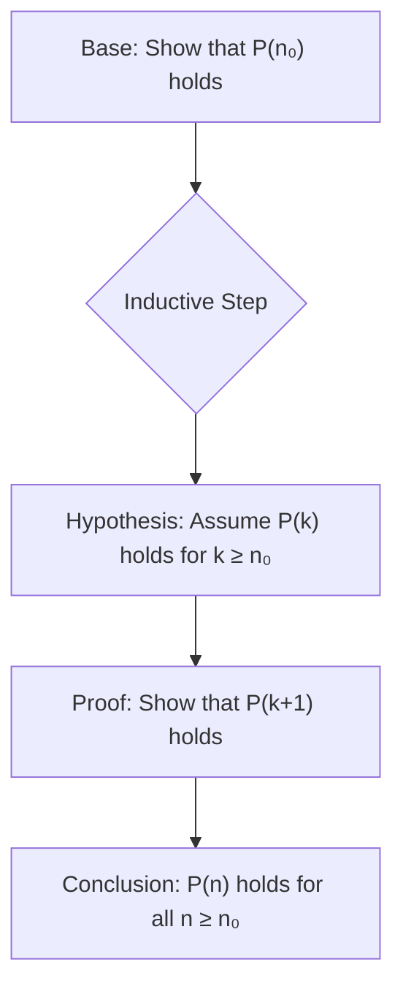
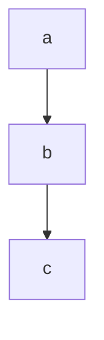
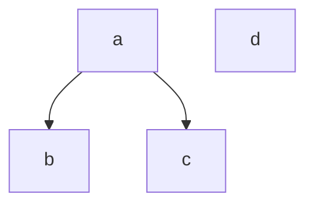

---

## **Chapter 0: Mathematical Induction**

### **Theoretical Background**

The **principle of mathematical induction** is a powerful proof technique used to prove that a statement $P(n)$ holds for all natural numbers $n$ that are greater than or equal to an initial number $n_0$.

A proof by mathematical induction consists of two basic steps:

1.  **Base Case:**
	    We show that the statement $P(n)$ holds for the initial value $n = n_0$. This step is fundamental, as it constitutes the "first domino" that falls.

2.  **Inductive Step:**
    It consists of two parts:
    *   **Inductive Hypothesis:** We assume that the statement $P(k)$ holds for an arbitrary integer $k \ge n_0$.
    *   **Inductive Conclusion:** Using the inductive hypothesis, we prove that the statement also holds for the next integer, that is, that $P(k+1)$ holds.

If both of these steps are completed successfully, then according to the principle of mathematical induction, the statement $P(n)$ holds for every integer $n \ge n_0$.

---

### **Exercise Solutions**

#### **Exercise 0.1**
Show that for every $n \ge 1$ the following equality holds:
$$ 1^2 + 2^2 + 3^2 + \dots + n^2 = \frac{n(n + 1)(2n + 1)}{6} $$

**Solution:**

Let $P(n)$ be the statement: $\sum_{i=1}^{n} i^2 = \frac{n(n + 1)(2n + 1)}{6}$.

1.  **Base Case (for $n=1$):**
    *   Left-hand side: $1^2 = 1$.
    *   Right-hand side: $\frac{1(1 + 1)(2 \cdot 1 + 1)}{6} = \frac{1 \cdot 2 \cdot 3}{6} = \frac{6}{6} = 1$.
    *   Since $1=1$, the statement $P(1)$ holds.

2.  **Inductive Step:**
    *   **Inductive Hypothesis:** We assume that $P(k)$ holds for some integer $k \ge 1$. That is, we assume that:
        $$ 1^2 + 2^2 + \dots + k^2 = \frac{k(k + 1)(2k + 1)}{6} $$
    *   **Inductive Conclusion:** We will show that $P(k+1)$ holds, that is:
        $$ 1^2 + 2^2 + \dots + k^2 + (k+1)^2 = \frac{(k+1)((k+1) + 1)(2(k+1) + 1)}{6} $$
        $$ 1^2 + 2^2 + \dots + k^2 + (k+1)^2 = \frac{(k+1)(k + 2)(2k + 3)}{6} $$

    We start from the left-hand side of $P(k+1)$ and use the inductive hypothesis:
    $$ (1^2 + 2^2 + \dots + k^2) + (k+1)^2 = \left( \frac{k(k + 1)(2k + 1)}{6} \right) + (k+1)^2 $$
    We factor out the common factor $(k+1)$:
    $$ = (k+1) \left[ \frac{k(2k + 1)}{6} + (k+1) \right] $$
    $$ = (k+1) \left[ \frac{2k^2 + k}{6} + \frac{6(k+1)}{6} \right] $$
    $$ = (k+1) \left[ \frac{2k^2 + k + 6k + 6}{6} \right] $$
    $$ = (k+1) \left[ \frac{2k^2 + 7k + 6}{6} \right] $$
    The trinomial $2k^2 + 7k + 6$ has roots $k = \frac{-7 \pm \sqrt{49 - 4 \cdot 2 \cdot 6}}{4} = \frac{-7 \pm 1}{4}$, that is, $k_1 = -2$ and $k_2 = -3/2$. Therefore, it factors as $2(k+2)(k+3/2) = (k+2)(2k+3)$. Substituting:
    $$ = \frac{(k+1)(k + 2)(2k + 3)}{6} $$
    This is exactly the right-hand side of $P(k+1)$.

Since the base case and the inductive step hold, the statement $P(n)$ holds for every $n \ge 1$.

---

#### **Exercise 0.2**
Show that for every $n \ge 3$ the following inequality holds: $2n + 3 \le n^2$.

**Solution:**

Let $P(n)$ be the statement: $2n + 3 \le n^2$.

1.  **Base Case (for $n=3$):**
    *   Left-hand side: $2 \cdot 3 + 3 = 6 + 3 = 9$.
    *   Right-hand side: $3^2 = 9$.
    *   Since $9 \le 9$, the statement $P(3)$ holds.

2.  **Inductive Step:**
    *   **Inductive Hypothesis:** We assume that $P(k)$ holds for some integer $k \ge 3$. That is:
        $$ 2k + 3 \le k^2 $$
    *   **Inductive Conclusion:** We will show that $P(k+1)$ holds, that is:
        $$ 2(k+1) + 3 \le (k+1)^2 $$
        $$ 2k + 2 + 3 \le k^2 + 2k + 1 $$
        $$ 2k + 5 \le k^2 + 2k + 1 $$

    We start from the left-hand side of $P(k+1)$:
    $$ 2(k+1) + 3 = (2k+3) + 2 $$
    From the inductive hypothesis, we know that $2k+3 \le k^2$. Therefore:
    $$ (2k+3) + 2 \le k^2 + 2 $$
    Now, we want to show that $k^2 + 2 \le (k+1)^2$ for $k \ge 3$.
    $$ k^2 + 2 \le k^2 + 2k + 1 $$
    $$ 2 \le 2k + 1 $$
    $$ 1 \le 2k $$
    The inequality $1 \le 2k$ is true for every $k \ge 3$.
    Therefore, we have shown that $2(k+1)+3 \le k^2+2 \le (k+1)^2$, which implies $2(k+1)+3 \le (k+1)^2$.

Since the base case and the inductive step hold, the statement $P(n)$ holds for every $n \ge 3$.

---

## **Chapter 5: Relations**

### **Theoretical Background**

A **binary relation** $R$ on a set $S$ is a subset of the Cartesian product $S \times S$. If $(a, b) \in R$, we say that $a$ is related to $b$.

A relation $R$ on a set $S$ can have the following properties:
*   **Reflexive:** For every element $a \in S$, $(a, a) \in R$ holds.
*   **Symmetric:** If $(a, b) \in R$, then $(b, a) \in R$ also holds.
*   **Antisymmetric:** If $(a, b) \in R$ and $(b, a) \in R$, then $a=b$.
*   **Transitive:** If $(a, b) \in R$ and $(b, c) \in R$, then $(a, c) \in R$ also holds.

A **partially ordered set (poset)** is a pair $(S, R)$ where $S$ is a set and $R$ is a partial order relation, that is, a relation that is reflexive, antisymmetric and transitive.

In a poset $(S, R)$, we define the following elements:
*   **Minimal:** An element $a \in S$ is minimal if there is no other element $x \in S$ such that $(x, a) \in R$ and $x \ne a$.
*   **Maximal:** An element $a \in S$ is maximal if there is no other element $x \in S$ such that $(a, x) \in R$ and $x \ne a$.
*   **Minimum:** An element $a \in S$ is the minimum if for every $x \in S$, $(a, x) \in R$ holds. It is unique, if it exists.
*   **Maximum:** An element $a \in S$ is the maximum if for every $x \in S$, $(x, a) \in R$ holds. It is unique, if it exists.

---

### **Exercise Solutions**

#### **Exercise 5.1**
Let $S = \{1, 2, 3\}$. For each of the relations on $S$, check the properties.

**a. $R = \{(1, 1),(1, 2),(2, 3),(1, 3)\}$**

*   **Reflexive:** No. The pairs $(2, 2)$ and $(3, 3)$ are missing.
*   **Symmetric:** No. We have $(1, 2)$ but not $(2, 1)$.
*   **Antisymmetric:** Yes. There is no pair $(a, b)$ and $(b, a)$ with $a \ne b$.
*   **Transitive:** Yes. We have $(1, 2) \in R$ and $(2, 3) \in R$, and we also have $(1, 3) \in R$. There are no other such cases to check.

**b. $R = \{(1, 1),(1, 2),(2, 3),(3, 1),(1, 3)\}$**

*   **Reflexive:** No. The pairs $(2, 2)$ and $(3, 3)$ are missing.
*   **Symmetric:** No. We have $(1, 2)$ but not $(2, 1)$.
*   **Antisymmetric:** No. We have $(1, 3)$ and $(3, 1)$, but $1 \ne 3$.
*   **Transitive:** No. We have $(3, 1) \in R$ and $(1, 2) \in R$, but $(3, 2)$ is missing.

**c. $R = \{(1, 3),(3, 3),(3, 1),(2, 2),(2, 3),(1, 1),(1, 2)\}$**

*   **Reflexive:** Yes. It contains $(1, 1), (2, 2), (3, 3)$.
*   **Symmetric:** No. We have $(1, 2)$ but not $(2, 1)$. We have $(2, 3)$ but not $(3, 2)$.
*   **Antisymmetric:** No. We have $(1, 3)$ and $(3, 1)$, but $1 \ne 3$.
*   **Transitive:** No. We have $(2, 3) \in R$ and $(3, 1) \in R$, but $(2, 1)$ is missing.

**d. $R = \{(1, 1),(3, 3),(2, 2)\}$ (Identity relation)**

*   **Reflexive:** Yes. It contains $(1, 1), (2, 2), (3, 3)$.
*   **Symmetric:** Yes. For every $(a, a) \in R$, its "reverse" is the pair $(a, a)$ itself, which belongs to $R$.
*   **Antisymmetric:** Yes. If $(a, b) \in R$ and $(b, a) \in R$, then necessarily $a=b$.
*   **Transitive:** Yes. If $(a, a) \in R$ and $(a, a) \in R$, then $(a, a)$ is in $R$.

---

#### **Exercise 5.2**
Determine the minimal, maximal, minimum and maximum elements.

**a. $(S = \{a, b, c\}, R = \{(a, a),(b, b),(c, c),(a, b),(b, c),(a, c)\})$**

The relation $R$ is reflexive, antisymmetric and transitive (since $(a,b)$ and $(b,c)$ imply $(a,c)$), so it is a partial order relation. The Hasse diagram for this relation is a simple chain.

From the Hasse diagram:
*   **Minimal elements:** $\{a\}$ (no element is "smaller" than a).
*   **Maximal elements:** $\{c\}$ (no element is "greater" than c).
*   **Minimum element:** $a$ (because it is the only minimal).
*   **Maximum element:** $c$ (because it is the only maximal).

**b. $(S = \{a, b, c, d\}, R = \{(a, a),(b, b),(c, c),(d, d),(a, b),(a, c)\})$**

The relation is reflexive, antisymmetric and transitive. Its Hasse diagram is:

From the Hasse diagram:
*   **Minimal elements:** $\{a, d\}$ (there is no element "smaller" than $a$ or $d$).
*   **Maximal elements:** $\{b, c, d\}$ (there is no element "greater" than $b, c$ or $d$).
*   **Minimum element:** None. For it to exist, there would need to be one and only one minimal element. Here we have two ($a$ and $d$).
*   **Maximum element:** None. For it to exist, there would need to be one and only one maximal element. Here we have three ($b, c$ and $d$).

---

## **Chapter 6: Graph Theory**

### **Theoretical Background**

*   **Graph Isomorphism:** Two graphs $G_1 = (V_1, E_1)$ and $G_2 = (V_2, E_2)$ are **isomorphic** if there exists a bijective (1-1 and onto) function $f: V_1 \to V_2$ such that for every pair of vertices $u, v \in V_1$, the edge $\{u, v\}$ exists in $E_1$ if and only if the edge $\{f(u), f(v)\}$ exists in $E_2$.
    To show that two graphs are **not** isomorphic, it suffices to find a property (invariant) that differs between them, such as:
    *   Number of vertices ($|V|$)
    *   Number of edges ($|E|$)
    *   Degree sequence (the list of the degrees of all vertices)
    *   Existence of cycles of a specific length

*   **Planar Graph:** A graph is called **planar** if it can be drawn on the plane in such a way that its edges intersect only at the vertices.

*   **Euler's Formula:** For every connected planar graph with $v$ vertices, $e$ edges and $f$ faces (regions, including the outer one), the following relation holds:
    $$ v - e + f = 2 $$

---

### **Exercise Solutions**

#### **Exercise 6.1**
For each pair of the following graphs, show whether they are isomorphic.

*Representation of the Graphs*
![[Pasted image 20250620042020.png]]
**Invariant Analysis:**

| Graph | Vertices (v) | Edges (e) | Degree Sequence |
| :------ | :---------- | :-------- | :--------------------- |
| **G1**  | 5           | 8         | (4, 4, 4, 4, 4)        |
| **G2**  | 5           | 7         | (4, 3, 3, 2, 2)        |
| **G3**  | 6           | 10        | (5, 3, 3, 3, 3, 3)     |

**Comparisons:**

*   **G1 and G2:**
    *   $v_{G1}=5$, $v_{G2}=5$ (Same number of vertices).
    *   $e_{G1}=8$, $e_{G2}=7$ (Different number of edges).
    *   **Conclusion:** G1 and G2 are **not isomorphic** because they have a different number of edges.

*   **G1 and G3:**
    *   $v_{G1}=5$, $v_{G3}=6$ (Different number of vertices).
    *   **Conclusion:** G1 and G3 are **not isomorphic** because they have a different number of vertices.

*   **G2 and G3:**
    *   $v_{G2}=5$, $v_{G3}=6$ (Different number of vertices).
    *   **Conclusion:** G2 and G3 are **not isomorphic** because they have a different number of vertices.
Solution: The two first graphs are isomorphic. An isomorphism is the following:

![[Pasted image 20250620042150.png]]

---

#### **Exercise 6.2**
Show that the following graph is planar.

**Initial Graph:**
![[Pasted image 20250620042253.png]]

---
Solution: An appropriate embedding of the graph on the plane is the following:

![[Pasted image 20250620042453.png]]
#### **Exercise 6.3**
Verify Euler's formula for the following planar graph.
![[Pasted image 20250620042643.png]]
**Solution:** By counting the vertices, edges and regions of the graph, we get v = 13, e = 19 and f = 8. Therefore v − e + f = 13 − 19 + 8 = 2

---

## **Chapter 7: Automata Theory and Formal Languages**

### **Theoretical Background**

**Regular expressions** are a compact way to describe sets of strings (called regular sets or regular languages).

**Basic Operators:**
*   **Concatenation:** The expression `rs` describes the set of strings resulting from concatenating a string from the language of `r` with a string from the language of `s`.
*   **Union/Alternation:** The expression `r|s` (or `r+s` in older notations) describes the set of strings that belong to either the language of `r` or the language of `s`.
*   **Kleene Star:** The expression `r*` describes the set of strings resulting from concatenating zero or more strings from the language of `r`. It includes the empty string `\varepsilon`.
*   **Kleene Plus:** The expression `r+` describes the set of strings resulting from concatenating one or more strings from the language of `r`. It holds that $r^+ = rr^*$.
*   **Empty String:** The symbol `\varepsilon` (epsilon) represents the string of zero length.

---

### **Exercise Solutions**

#### **Exercise 7.1**
Write regular expressions that describe the following regular sets:

**a. The set {101, 1001, 10001, ...}.**
*   **Analysis:** All strings start with '1', are followed by one or more '0's, and end with '1'.
*   **Regular Expression:** `10+1`

**b. The set of strings over the alphabet {0, 1} that start with 0 and end with 1.**
*   **Analysis:** A '0' at the start, a '1' at the end, and anything (any sequence of '0' and '1') in between.
*   **Regular Expression:** `0(0|1)*1`

**c. The set of strings over the alphabet {0, 1} that contain at least one 0.**
*   **Analysis:** There can be anything before the first '0', and anything after.
*   **Regular Expression:** `(0|1)*0(0|1)*`

**d. The set of strings over the alphabet {0, 1} that contain exactly two 0's.**
*   **Analysis:** The strings consist of parts containing only '1's, which are separated by two '0's.
*   **Regular Expression:** `1*01*01*`

**e. The set of strings over the alphabet {0, 1} that contain an odd number of 0's.**
*   **Analysis:** A string with an odd number of zeros can be viewed as a sequence of parts with an even number of zeros, followed by a part with one zero. A part with an even number of zeros is `01*0`.
*   **Regular Expression:** `1*(01*01*)*01*`
    *   `1*`: Any number of 1's at the start.
    *   `(01*01*)*`: A block with an even number (two) of zeros, which can be repeated 0 or more times. This always produces an even count of zeros.
    *   `01*`: The final block that adds one more zero, making the total count odd.

**f. The set of strings over the alphabet {a, b} where every occurrence of a is followed by two occurrences of b.**
*   **Analysis:** The allowed "building blocks" are 'b' and 'abb'. Any string of the language can be built from these two.
*   **Regular Expression:** `(b|abb)*`

---

#### **Exercise 7.2**
State which of the strings `beer`, `beter` and `better` belong to the regular set.

**a. `be(\varepsilon|t)er`**
*   **Analysis:** The expression `(\varepsilon|t)` means "the empty string or the letter t". Therefore, the expression matches `be` + (nothing) + `er` or `be` + `t` + `er`.
*   `beer`: Matches (by choosing `\varepsilon`).
*   `beter`: Matches (by choosing `t`).
*   `better`: Does not match.
*   **Strings that belong:** `{beer, beter}`

**b. `bet*er`**
*   **Analysis:** The expression `t*` means "zero or more repetitions of t".
*   `beer`: Matches (zero `t`).
*   `beter`: Matches (one `t`).
*   `better`: Matches (two `t`).
*   **Strings that belong:** `{beer, beter, better}`

**c. `bet+er`**
*   **Analysis:** The expression `t+` means "one or more repetitions of t".
*   `beer`: Does not match (it has zero `t`).
*   `beter`: Matches (one `t`).
*   `better`: Matches (two `t`).
*   **Strings that belong:** `{beter, better}`