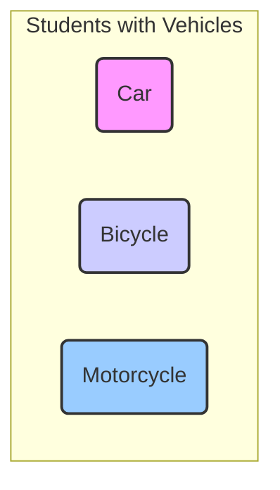
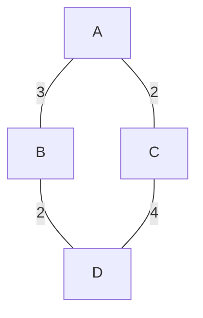
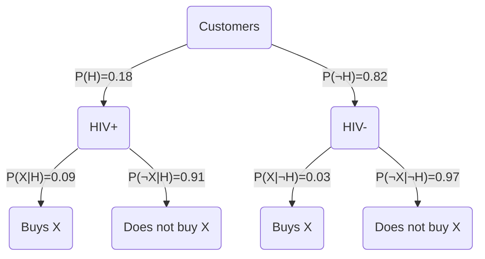

---

# DISCRETE MATHEMATICS: Theory and Exercise Solutions

## Introduction

This document provides the theoretical background and methodologies required for solving the exercises from the given set. Each section begins with an overview of the relevant theory followed by its application to the specific exercises.

---

## 1. Mathematical Logic

Mathematical Logic is the study of formal logic and reasoning. It uses symbols to represent propositions and logical connectives to create compound expressions.

### Theoretical Background

**Propositions:**
A proposition is a declarative statement that is either true (True, T, 1) or false (False, F, 0). Examples: `p`, `q`, `r`.

**Logical Connectives:**
*   **Negation:** `¬p` (not p). It is true when `p` is false.
*   **Conjunction:** `p ∧ q` (p and q). It is true only when both `p` and `q` are true.
*   **Disjunction:** `p ∨ q` (p or q). It is true when at least one of `p` or `q` is true.
*   **Implication:** `p → q` (if p then q). It is false only when `p` is true and `q` is false. It can also be written as `¬p ∨ q`.
*   **Equivalence:** `p ↔ q` (p if and only if q). It is true when `p` and `q` have the same truth value.

**Truth Tables:**
A truth table shows the truth value of a compound proposition for all possible combinations of truth values of its simple propositions. For `n` variables, the table has `2^n` rows.

**Tautology and Contradiction:**
*   A **tautology** is a proposition that is always true, regardless of the truth values of its components.
*   A **contradiction** is a proposition that is always false.

**Laws of Propositional Logic:**
These are rules that allow algebraic simplification and the proof of equivalences. The most important are:
*   **De Morgan's Laws:** `¬(p ∧ q) ≡ ¬p ∨ ¬q` and `¬(p ∨ q) ≡ ¬p ∧ ¬q`
*   **Distributive Laws:** `p ∧ (q ∨ r) ≡ (p ∧ q) ∨ (p ∧ r)` and `p ∨ (q ∧ r) ≡ (p ∨ q) ∧ (p ∨ r)`
*   **Associative Laws:** `(p ∧ q) ∧ r ≡ p ∧ (q ∧ r)` and `(p ∨ q) ∨ r ≡ p ∨ (q ∨ r)`
*   **Commutative Laws:** `p ∧ q ≡ q ∧ p` and `p ∨ q ≡ q ∨ p`
*   **Definition of Implication:** `p → q ≡ ¬p ∨ q`

### Solving Exercises

#### **Exercise 1.1**

**Problem:** Construct the truth table for the formula `(p → q) → ((p ∨ r) → (q ∨ r))` and state whether it is a tautology or a contradiction.

**Method:** We will construct a table with `2^3 = 8` rows for the variables `p, q, r`.

| p | q | r | `p → q` | `p ∨ r` | `q ∨ r` | `(p ∨ r) → (q ∨ r)` | **(p → q) → ((p ∨ r) → (q ∨ r))** |
|:---:|:---:|:---:|:---:|:---:|:---:|:---:|:---:|
| T | T | T | T | T | T | T | **T** |
| T | T | F | T | T | T | T | **T** |
| T | F | T | F | T | T | T | **T** |
| T | F | F | F | T | F | F | **T** |
| F | T | T | T | T | T | T | **T** |
| F | T | F | T | F | T | T | **T** |
| F | F | T | T | T | T | T | **T** |
| F | F | F | T | F | F | T | **T** |

**Conclusion:** The final column of the truth table contains only the value "True" (T). Therefore, the propositional formula is a **tautology**.

---

#### **Exercise 1.2**

**Problem:** Show the tautological equivalence `¬(p ∧ q) ∧ (p ∨ ¬q) ≡ p → ¬q`.

**Note:** There is a possible typo in the exercise as given in the document. The equivalence requested to be proved does not always hold. A more common and valid tautological equivalence with a similar form is `¬p ∨ (p ∧ ¬q) ≡ p → ¬q`. We will prove this equivalence.

**Method:** We will start from the left-hand side (LHS) and transform it into the right-hand side (RHS) using the rules of logic.

We want to prove: `¬p ∨ (p ∧ ¬q) ≡ p → ¬q`

1.  **Left-hand Side (LHS):** `¬p ∨ (p ∧ ¬q)`
2.  We apply the **Distributive Law**: `(¬p ∨ p) ∧ (¬p ∨ ¬q)`
3.  The expression `¬p ∨ p` is always true (Law of Excluded Middle), that is `T`.
    So we have: `T ∧ (¬p ∨ ¬q)`
4.  Anything in conjunction with `T` remains the same (Identity element).
    So: `¬p ∨ ¬q`
5.  **Right-hand Side (RHS):** `p → ¬q`
6.  Using the **Definition of Implication** (`A → B ≡ ¬A ∨ B`), we have:
    `p → ¬q ≡ ¬p ∨ ¬q`

Since the LHS simplifies to `¬p ∨ ¬q` and the RHS is equivalent to `¬p ∨ ¬q`, we proved that **LHS ≡ RHS**.

---

## 2. Set Theory

Set theory is the branch of mathematics that studies sets, that is, collections of objects.

### Theoretical Background

**Basic Set Operations:**
*   **Union:** `A ∪ B`. The set of elements that belong to `A`, or `B`, or both.
*   **Intersection:** `A ∩ B`. The set of elements that belong to both `A` and `B`.
*   **Difference:** `A \ B`. The set of elements that belong to `A` but not to `B`.
*   **Complement:** `A'`. The set of elements that do not belong to `A` (with respect to a universal set `U`).
*   **Cardinality:** `|A|`. The number of elements in a set `A`.

**Properties of Set Operations:**
*   **De Morgan's Laws:** `(A ∪ B)' = A' ∩ B'` and `(A ∩ B)' = A' ∪ B'`
*   **Distributive Laws:** `A ∩ (B ∪ C) = (A ∩ B) ∪ (A ∩ C)`
*   **Definition of Difference:** `A \ B = A ∩ B'`

**Principle of Inclusion-Exclusion:**
For three sets, the cardinality of their union is:
$$|A ∪ B ∪ C| = |A| + |B| + |C| - |A ∩ B| - |A ∩ C| - |B ∩ C| + |A ∩ B ∩ C|$$

### Solving Exercises

#### **Exercise 2.1**

**Problem:** Show the identity: `(A \ B) ∩ (A \ C) = A \ (B ∪ C)`

**Method:** We will use the properties of sets to transform the left-hand side.

1.  **Left-hand Side (LHS):** `(A \ B) ∩ (A \ C)`
2.  We use the definition of difference (`X \ Y = X ∩ Y'`):
    `= (A ∩ B') ∩ (A ∩ C')`
3.  We apply the Commutative and Associative laws for intersection:
    `= (A ∩ A) ∩ (B' ∩ C')`
4.  `A ∩ A = A` (Idempotence):
    `= A ∩ (B' ∩ C')`
5.  We apply De Morgan's Law (`B' ∩ C' = (B ∪ C)'`):
    `= A ∩ (B ∪ C)'`
6.  We use again the definition of difference, this time in reverse (`X ∩ Y' = X \ Y`):
    `= A \ (B ∪ C)`
7.  This is the **Right-hand Side (RHS)**. The identity is proved.

---

#### **Exercise 2.2**

**Problem:** Among 150 students, 83 have a car (C), 97 a bicycle (B), 28 a motorcycle (M). 53 have C and B, 14 have C and M, 7 have B and M, and 2 have all three. How many have nothing?

**Method:** We will use the Principle of Inclusion-Exclusion to find how many students have at least one vehicle.

**Data:**
*   Universal set `|U| = 150`
*   `|C| = 83`
*   `|B| = 97`
*   `|M| = 28`
*   `|C ∩ B| = 53`
*   `|C ∩ M| = 14`
*   `|B ∩ M| = 7`
*   `|C ∩ B ∩ M| = 2`

**Visualization with a Venn Diagram:**

**Calculation:**
1.  We find the number of students who have at least one vehicle, `|C ∪ B ∪ M|`:
    $$|C ∪ B ∪ M| = |C| + |B| + |M| - |C ∩ B| - |C ∩ M| - |B ∩ M| + |C ∩ B ∩ M|$$
    $$|C ∪ B ∪ M| = 83 + 97 + 28 - 53 - 14 - 7 + 2$$
    $$|C ∪ B ∪ M| = 208 - 74 + 2$$
    $$|C ∪ B ∪ M| = 136$$
    So, 136 students have at least one of the three vehicles.

2.  To find how many have none, we subtract this number from the total number of students:
    Number of students without a vehicle = `|U| - |C ∪ B ∪ M|`
    `= 150 - 136`
    `= 14`

**Answer:** **14** students have none of the three.

---

## 3. Combinatorics

Combinatorics deals with the study of methods of enumeration, combination and arrangement of objects.

### Theoretical Background

*   **Product Rule:** If a process consists of `k` steps, and the 1st step can be done in `n₁` ways, the 2nd in `n₂` ways, ..., the k-th step in `nₖ` ways, then the total process can be done in `n₁ × n₂ × ... × nₖ` ways.

*   **Permutations:** Enumeration of the ways of arranging `k` objects from a set of `n` distinct objects, where order matters.
    *   **Without repetition:** `P(n, k) = n! / (n-k)!`
    *   **With repetition:** `n^k`

*   **Combinations:** Enumeration of the ways of choosing `k` objects from a set of `n` objects, where order does NOT matter.
    *   **Without repetition:** `C(n, k) = n! / (k! * (n-k)!)`
    *   **With repetition (Stars and Bars):** Choosing `k` objects from `n` types, where repetition is allowed. `C(n + k - 1, k)`.

*   **Permutations with Repetition:** Arrangement of `n` objects where there are `n₁` identical objects of the 1st type, `n₂` of the 2nd, etc.
    $$ \frac{n!}{n_1! n_2! \dots n_k!} $$

### Solving Exercises

#### **Exercise 3.1**

**Problem:** Enumeration of paths from node A to D in a network, where each node is visited at most once.

**Network Data:**
*   A-C: 2 links
*   B-D: 2 links
*   A-B: 3 links
*   C-D: 4 links
*   A-D: 0 links
*   B-C: 0 links

**Network Visualization:**

**Method:** A path from A to D without repeating nodes can be either `A → B → D` or `A → C → D`.

1.  **Path A → B → D:**
    *   To go from A to B, we have 3 choices (links).
    *   To go from B to D, we have 2 choices.
    *   According to the Product Rule, the total number of paths through B is: `3 × 2 = 6`.

2.  **Path A → C → D:**
    *   To go from A to C, we have 2 choices.
    *   To go from C to D, we have 4 choices.
    *   According to the Product Rule, the total number of paths through C is: `2 × 4 = 8`.

**Total Paths:**
The total number of paths is the sum of the paths of the two routes above (Sum Rule):
`6 (via B) + 8 (via C) = 14`.

**Answer:** There are **14** possible paths.

---

#### **Exercise 3.2**

**Problem:** Stock names of length 3 from the Latin alphabet (26 letters).

**a'. Repetition of symbols is allowed:**
*   For the 1st position, we have 26 choices.
*   For the 2nd position, we have 26 choices.
*   For the 3rd position, we have 26 choices.
Total: `26 × 26 × 26 = 26^3 = 17,576` names.

**b'. No repetition is allowed (each symbol at most once):**
*   For the 1st position, we have 26 choices.
*   For the 2nd position, 25 choices remain.
*   For the 3rd position, 24 choices remain.
Total: `26 × 25 × 24 = P(26, 3) = 15,600` names.

---

#### **Exercise 3.3**

**Problem:** Selection of 5 players (a lineup of 5) from a roster of 15 players.

**Method:** The order of selection of the players does not matter, so this involves **combinations**.

*   `n = 15` (total players)
*   `k = 5` (players to select)

We use the combination formula `C(n, k)`:
$$ C(15, 5) = \frac{15!}{5!(15-5)!} = \frac{15!}{5!10!} = \frac{15 \times 14 \times 13 \times 12 \times 11}{5 \times 4 \times 3 \times 2 \times 1} $$
$$ C(15, 5) = 3 \times 7 \times 13 \times 1 \times 11 = 3003 $$

**Answer:** There are **3,003** possible lineups of 5.

---

#### **Exercise 3.4**

**Problem:** Different arrangements of books on a shelf: 5 identical of the 1st, 4 of the 2nd, 3 of the 3rd.

**Method:** We have a total of `n = 5 + 4 + 3 = 12` positions. However, the books of each type are identical, so we use permutations with repetition.

*   `n = 12` (total books)
*   `n₁ = 5` (identical of type 1)
*   `n₂ = 4` (identical of type 2)
*   `n₃ = 3` (identical of type 3)

$$ \frac{12!}{5!4!3!} = \frac{479,001,600}{(120)(24)(6)} = \frac{479,001,600}{17,280} = 27,720 $$

**Answer:** There are **27,720** different arrangements.

---

#### **Exercise 3.5**

**Problem:** Creating a bouquet of 12 flowers from 4 available types (roses, carnations, lilies, daisies).

**Method:** The order does not matter and we can choose the same type of flower many times. This involves **combinations with repetition** (Stars and Bars).

*   `n = 4` (types of flowers / categories)
*   `k = 12` (flowers to select)

We use the formula `C(n + k - 1, k)`:
$$ C(4 + 12 - 1, 12) = C(15, 12) $$
This is equivalent to `C(15, 15 - 12) = C(15, 3)`:
$$ C(15, 3) = \frac{15!}{3!(15-3)!} = \frac{15 \times 14 \times 13}{3 \times 2 \times 1} = 5 \times 7 \times 13 = 455 $$

**Answer:** **455** different bouquets can be formed.

---

## 4. Probability Theory

Probability Theory studies the mathematical formalization of uncertainty.

### Theoretical Background

*   **Probability:** For an event `E`, the probability `P(E)` is the ratio of favorable outcomes to the total number of possible outcomes (in a sample space with equally likely events).
    `P(E) = (Number of Favorable Outcomes) / (Total Number of Possible Outcomes)`

*   **Conditional Probability:** The probability of event `A` occurring, given that `B` has already occurred.
    $$ P(A|B) = \frac{P(A \cap B)}{P(B)} $$

*   **Law of Total Probability:** If `B₁, B₂, ..., Bₙ` is a partition of the sample space, then for any event `A`:
    $$ P(A) = \sum_{i=1}^{n} P(A|B_i)P(B_i) $$

*   **Bayes' Theorem:**
    $$ P(B_i|A) = \frac{P(A|B_i)P(B_i)}{P(A)} = \frac{P(A|B_i)P(B_i)}{\sum_{j=1}^{n} P(A|B_j)P(B_j)} $$

### Solving Exercises

#### **Exercise 4.1**

**Problem:** Three people in a marathon, with equal probability (0.5) of finishing (F) or dropping out (D).

**Sample Space:** Each person has 2 outcomes. 3 people → `2^3 = 8` total possible outcomes.
{FFF, FFD, FDF, DFF, FDD, DFD, DDF, DDD}
Each outcome has probability `(0.5)^3 = 1/8`.

**a'. No one finishes:**
*   Favorable outcome: {DDD}.
*   There is 1 such outcome.
*   `P(No one) = 1/8`.

**b'. Exactly one finishes:**
*   Favorable outcomes: {FDD, DFD, DDF}.
*   There are 3 such outcomes.
*   `P(Exactly one) = 3/8`.

**c'. At least two finish:**
*   Favorable outcomes: {FFD, FDF, DFF, FFF}.
*   There are 4 such outcomes.
*   `P(At least two) = 4/8 = 1/2`.

---

#### **Exercise 4.2**

**Problem:** Preferences in Asian food.
*   `P(T) = 0.47`, `P(I) = 0.39`, `P(K) = 0.78`
*   `P(T ∩ I) = 0.23`, `P(I ∩ K) = 0.31`, `P(T ∩ K) = 0.29`
*   The survey concerns respondents who like Asian food, so we can assume `P(T ∪ I ∪ K) = 1`.

**a'. Calculate the probability of liking all three types of food `P(T ∩ I ∩ K)`.**
We use the inclusion-exclusion formula for probabilities:
`P(T ∪ I ∪ K) = P(T) + P(I) + P(K) - P(T ∩ I) - P(T ∩ K) - P(I ∩ K) + P(T ∩ I ∩ K)`
`1 = 0.47 + 0.39 + 0.78 - 0.23 - 0.29 - 0.31 + P(T ∩ I ∩ K)`
`1 = 1.64 - 0.83 + P(T ∩ I ∩ K)`
`1 = 0.81 + P(T ∩ I ∩ K)`
`P(T ∩ I ∩ K) = 1 - 0.81 = 0.19`
**Answer:** The probability is **19%**.

**b'. Calculate the probability of liking Chinese food, given that Indian food is liked `P(K|I)`.**
We use the conditional probability formula:
$$ P(K|I) = \frac{P(K \cap I)}{P(I)} $$
$$ P(K|I) = \frac{0.31}{0.39} \approx 0.7949 $$
**Answer:** The probability is approximately **79.5%**.

---

#### **Exercise 4.3**

**Problem:** Drug X and HIV. Find the probability that a customer who buys X is HIV positive.

**Method:** This is a classic problem for **Bayes' Theorem**.

**Definition of Events:**
*   `H`: The customer is HIV positive.
*   `¬H`: The customer is not HIV positive.
*   `X`: The customer buys treatment X.

**Given Probabilities:**
*   `P(H) = 0.18` (18% of customers are positive)
*   `P(¬H) = 1 - 0.18 = 0.82`
*   `P(X|H) = 0.09` (The probability of buying X, given that they are positive)
*   `P(X|¬H) = 0.03` (The probability of buying X, given that they are not positive)

**Required:** `P(H|X)` (The probability of being positive, given that they bought X).

**Visualization with a Tree Diagram (Corrected):**

**Solution:**
1.  **Step 1: Calculation of the total probability of buying X, `P(X)`.**
    We use the Law of Total Probability:
    `P(X) = P(X|H)P(H) + P(X|¬H)P(¬H)`
    `P(X) = (0.09)(0.18) + (0.03)(0.82)`
    `P(X) = 0.0162 + 0.0246`
    `P(X) = 0.0408`
    So, 4.08% of all customers buy treatment X.

2.  **Step 2: Application of Bayes' Theorem.**
    $$ P(H|X) = \frac{P(X|H)P(H)}{P(X)} $$
    $$ P(H|X) = \frac{0.0162}{0.0408} \approx 0.39705 $$

**Answer:** The probability that a customer who buys treatment X is HIV positive is approximately **39.7%**.