# Mindmap: Discrete Mathematics Architecture

## Conceptual Structure Overview

This taxonomy organizes the mathematical structures, proof methods, and discrete algorithms covered in Discrete Mathematics.

```mermaid
graph TD
    Root["Discrete Mathematics"] --> Logic["Logic & Proofs"]
    Root --> Sets["Sets & Relations"]
    Root --> Counting["Combinatorics"]
    Root --> Graphs["Graph Theory & Trees"]

    Logic --> Prop["Propositional Logic"]
    Prop --> Truth["Truth Tables & Equivalence"]
    Logic --> Pred["Predicate Calculus"]
    Pred --> Quant["Quantifiers (Forall, Exists)"]
    Logic --> Proofs["Proof Methods"]
    Proofs --> Direct["Direct Proof"]
    Proofs --> Contra["Contraposition & Contradiction"]
    Proofs --> Induction["Weak & Strong Induction"]

    Sets --> SetOps["Union, Intersection, Diff, Power Set"]
    Sets --> Relations["Binary Relations"]
    Relations --> EqRel["Equivalence Relations & Partitions"]
    Relations --> Poset["Partial Orders & Hasse Diagrams"]
    Sets --> Funcs["Functions (Injection, Surjection, Bijection)"]

    Counting --> Basic["Sum & Product Rules"]
    Counting --> PermComb["Permutations & Combinations"]
    Counting --> PHP["Pigeonhole Principle"]
    Counting --> PIE["Inclusion-Exclusion Principle"]
    Counting --> Recurr["Recurrence Relations"]

    Graphs --> Rep["Adjacency Lists & Matrices"]
    Graphs --> Degrees["Degrees & Handshaking Lemma"]
    Graphs --> Traversals["Eulerian vs Hamiltonian"]
    Graphs --> Trees["Trees & Spanning Trees"]
    Graphs --> Planar["Planar Graphs & Euler's Formula"]
```

## Cross-Disciplinary Foundations
1. **Mathematical Logic** $\to$ Provides direct foundations for digital logic design, circuit synthesis, and formal verification.
2. **Relations & Partitions** $\to$ Underpins relational database schema design, equivalence testing, and type systems.
3. **Graph Theory** $\to$ Forms the algorithmic core of network routing, operating system process resource allocation graphs, and syntax trees in compilers.

