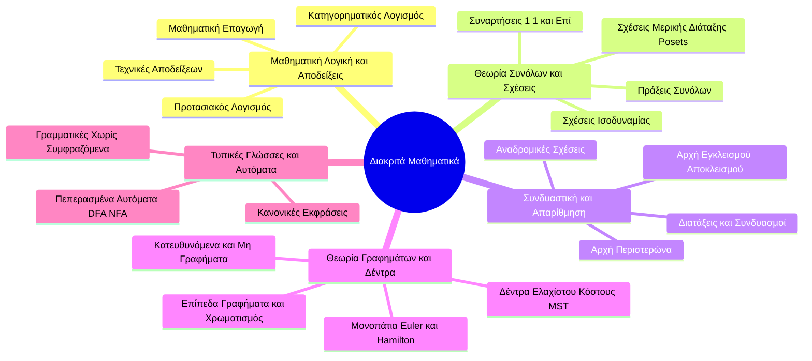

# Εννοιολογικός Χάρτης: Διακριτά Μαθηματικά

```mermaid
mindmap
  root((Διακριτά Μαθηματικά))
    Μαθηματική Λογική και Αποδείξεις
      Προτασιακός Λογισμός
      Κατηγορηματικός Λογισμός
      Μαθηματική Επαγωγή
      Τεχνικές Αποδείξεων
    Θεωρία Συνόλων και Σχέσεις
      Πράξεις Συνόλων
      Σχέσεις Ισοδυναμίας
      Σχέσεις Μερικής Διάταξης Posets
      Συναρτήσεις 1 1 και Επί
    Συνδυαστική και Απαρίθμηση
      Διατάξεις και Συνδυασμοί
      Αρχή Περιστερώνα
      Αρχή Εγκλεισμού Αποκλεισμού
      Αναδρομικές Σχέσεις
    Θεωρία Γραφημάτων και Δέντρα
      Κατευθυνόμενα και Μη Γραφήματα
      Μονοπάτια Euler και Hamilton
      Επίπεδα Γραφήματα και Χρωματισμός
      Δέντρα Ελαχίστου Κόστους MST
    Τυπικές Γλώσσες και Αυτόματα
      Κανονικές Εκφράσεις
      Πεπερασμένα Αυτόματα DFA NFA
      Γραμματικές Χωρίς Συμφραζόμενα
```

