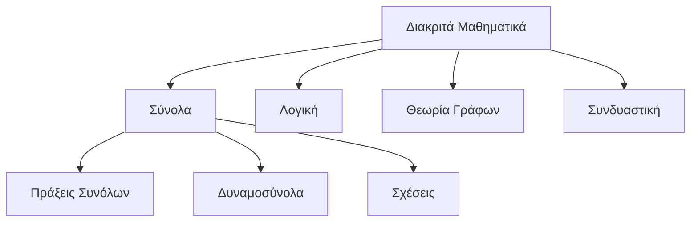

# Διακριτά Μαθηματικά: Σύνολα & Θεμέλια

## Επισκόπηση

Τα **Διακριτά Μαθηματικά** μελετούν απαριθμήσιμες, διακριτές μαθηματικές δομές—τη ψηφιακή ραχοκοκαλιά της επιστήμης υπολογιστών.

---

## Βασικές Έννοιες

### Θεμελιώδη Στοιχεία Συνόλων

| Έννοια | Συμβολισμός | Παράδειγμα |
|---------|----------|---------|
| **Μορφή Αναγραφής** | `{a, b, c}` | $V = \{a, e, i, o, u\}$ |
| **Περιγραφική Μορφή** | `{x \| συνθήκη}` | $E = \{x \mid x \text{ άρτιος, } x > 0\}$ |
| **Πληθικότητα (Πληθικός Αριθμός)** | `\|A\|` | $\|\{1,2,3\}\| = 3$ |
| **Κενό Σύνολο** | `∅` | $\|\emptyset\| = 0$ |

### Σχέσεις Συνόλων

$$A \subseteq B \iff \forall x(x \in A \rightarrow x \in B)$$

- **Υποσύνολο**: $A \subseteq B$ (μπορεί να είναι και ίσα)
- **Γνήσιο Υποσύνολο**: $A \subset B$ (αυστηρά μικρότερο)
- **Βασικός Κανόνας**: $\emptyset \subseteq$ κάθε σύνολο

### Πράξεις Συνόλων

| Πράξη | Σύμβολο | Ορισμός | Οπτικοποίηση |
|-----------|--------|------------|--------|
| **Ένωση** | $A \cup B$ | Στοιχεία στο A ή στο B | $\{1,2\} \cup \{2,3\} = \{1,2,3\}$ |
| **Τομή** | $A \cap B$ | Στοιχεία και στο A και στο B | $\{1,2\} \cap \{2,3\} = \{2\}$ |
| **Διαφορά** | $A - B$ | Στοιχεία στο A αλλά όχι στο B | $\{1,2\} - \{2,3\} = \{1\}$ |
| **Συμπλήρωμα** | $A'$ | Στοιχεία εκτός του A | Αν $U=\{1,2,3\}$, $A'=\{3\}$ |

---

## Δυναμοσύνολα (Power Sets)

$$|P(A)| = 2^{|A|}$$

**Δυναμοσύνολο**: Το σύνολο όλων των υποσυνόλων του A.

### Γρήγορη Αναφορά

| Μέγεθος Συνόλου | Μέγεθος Δυναμοσυνόλου | Παράδειγμα |
|----------|---------------|---------|
| 0 | 1 | $P(\emptyset) = \{\emptyset\}$ |
| 1 | 2 | $P(\{a\}) = \{\emptyset, \{a\}\}$ |
| 2 | 4 | $P(\{a,b\}) = \{\emptyset, \{a\}, \{b\}, \{a,b\}\}$ |
| n | $2^n$ | ... |

---

## Ασκήσεις & Λύσεις

### Ομάδα Ασκήσεων Α: Βασικές Πράξεις

**Ε1:** Δίνεται το $S = \{1, 2, 3\}$, ταξινομήστε καθένα ως υποσύνολο/γνήσιο υποσύνολο:
- $A = \{1, 3\}$
- $B = \{1, 2, 3\}$ 
- $C = \{1, 4\}$
- $D = \emptyset$

**Λύσεις:**
- $A \subset S$  (γνήσιο υποσύνολο)
- $B \subseteq S$  (υποσύνολο, όχι γνήσιο)
- $C \not\subseteq S$  (4 ∉ S)
- $D \subset S$  (γνήσιο υποσύνολο)

### Ομάδα Ασκήσεων Β: Δυναμοσύνολα

**Ε2:** Βρείτε το $P(\{a, b, c\})$

**Λύση:** 
$$P(\{a,b,c\}) = \{\emptyset, \{a\}, \{b\}, \{c\}, \{a,b\}, \{a,c\}, \{b,c\}, \{a,b,c\}\}$$
Μέγεθος: $2^3 = 8$ στοιχεία

**Ε3:** Γράμματα στη λέξη "ALGEBRA" → $|P(M)|$;

**Λύση:**
- Μοναδικά γράμματα: $M = \{A, L, G, E, B, R\}$
- $|M| = 6$
- $|P(M)| = 2^6 = 64$

### Ομάδα Ασκήσεων Γ: Προχωρημένες Σχέσεις

**Ε4:** Δίνεται το $A = \{s, t\}$, αξιολογήστε:
- $A \subseteq P(A)$;
- $A \in P(A)$;

**Ανάλυση:**
$P(A) = \{\emptyset, \{s\}, \{t\}, \{s,t\}\}$

- $A \subseteq P(A)$: **Ψευδές** (τα στοιχεία $s,t \notin P(A)$)
- $A \in P(A)$: **Αληθές** (το $\{s,t\}$ είναι στοιχείο του $P(A)$)

**Ε5:** $C = \{0,1\}$, $D = \{x,y,z\}$ → $|P(C × D)|$;

**Λύση:**
- $|C × D| = 2 × 3 = 6$
- $|P(C × D)| = 2^6 = 64$

---

## Βασικά Συμπεράσματα

- **Στοιχείο vs Υποσύνολο**: $\in$ vs $\subseteq$
- **Αύξηση Δυναμοσυνόλου**: Εκθετική ($2^n$)
- **Κανόνας Κενού Συνόλου**: Το $\emptyset$ είναι υποσύνολο των πάντων
- **Καρτεσιανά Γινόμενα**: $|A × B| = |A| × |B|$
