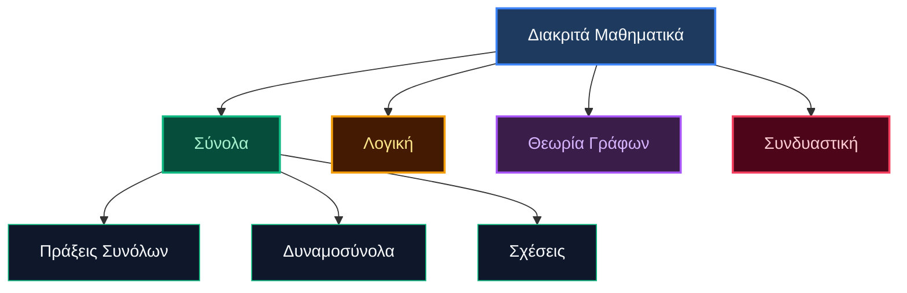

# Διακριτά Μαθηματικά: Σύνολα & Θεμέλια

## Επισκόπηση

Τα **Διακριτά Μαθηματικά** μελετούν απαριθμήσιμες, διακριτές μαθηματικές δομές—τη ψηφιακή ραχοκοκαλιά της επιστήμης υπολογιστών.

---

## Βασικές Έννοιες

### Θεμελιώδη Στοιχεία Συνόλων

| Έννοια | Συμβολισμός | Παράδειγμα |
|---------|----------|---------|
| **Μορφή Αναγραφής** | `{a, b, c}` | $V = \{a, e, i, o, u\}$ |
| **Περιγραφική Μορφή** | `{x \| συνθήκη}` | $E = \{x \mid x \text{ άρτιος, } x > 0\}$ |
| **Πληθικότητα (Πληθικός Αριθμός)** | `\|A\|` | $\|\{1,2,3\}\| = 3$ |
| **Κενό Σύνολο** | `∅` | $\|\emptyset\| = 0$ |

### Σχέσεις Συνόλων

#### Τυπικός Ορισμός Υποσυνόλου
$$A \subseteq B \iff \forall x (x \in A \rightarrow x \in B)$$

*Επεξήγηση συμβόλων:*
- **$\forall$ (Καθολικός ποσοδείκτης)**: Διαβάζεται «για κάθε» ή «για όλα τα».
- **$\rightarrow$ (Συνεπαγωγή)**: Διαβάζεται «αν ... τότε ...».
- **Μετάφραση ορισμού**: *«Το $A$ είναι υποσύνολο του $B$ αν και μόνο αν για κάθε στοιχείο $x$, αν το $x$ ανήκει στο $A$, τότε υποχρεωτικά ανήκει και στο $B$».*

#### Διακρίσεις & Κατεύθυνση Συμβόλων
- **Υποσύνολο ($A \subseteq B$)**: Κάθε στοιχείο του $A$ ανήκει και στο $B$. Τα σύνολα επιτρέπεται να έχουν ακριβώς τα ίδια στοιχεία ($A = B$). Κάθε σύνολο είναι υποσύνολο του εαυτού του ($A \subseteq A$).
- **Υπερσύνολο ($B \supseteq A$)**: Ισοδύναμος τρόπος γραφής του $A \subseteq B$. Το σύμβολο μπορεί να στραφεί προς την άλλη κατεύθυνση, δείχνοντας ότι το $B$ περιέχει το $A$.
- **Γνήσιο Υποσύνολο ($A \subset B$ ή $A \subsetneq B$)**: Όλα τα στοιχεία του $A$ ανήκουν στο $B$, **αλλά** το $B$ περιέχει τουλάχιστον ένα επιπλέον στοιχείο που δεν ανήκει στο $A$ (δηλαδή $A \neq B$, άρα αποκλείεται να είναι ίσα).
- **Βασικός Κανόνας**: Το κενό σύνολο είναι υποσύνολο κάθε συνόλου ($\emptyset \subseteq A$ για οποιοδήποτε σύνολο $A$).

### Πράξεις Συνόλων

| Πράξη | Σύμβολο | Ορισμός | Οπτικοποίηση |
|-----------|--------|------------|--------|
| **Ένωση** | $A \cup B$ | Στοιχεία στο A ή στο B | $\{1,2\} \cup \{2,3\} = \{1,2,3\}$ |
| **Τομή** | $A \cap B$ | Στοιχεία και στο A και στο B | $\{1,2\} \cap \{2,3\} = \{2\}$ |
| **Διαφορά** | $A - B$ | Στοιχεία στο A αλλά όχι στο B | $\{1,2\} - \{2,3\} = \{1\}$ |
| **Συμπλήρωμα** | $A'$ | Στοιχεία εκτός του A | Αν $U=\{1,2,3\}$ και $A=\{1,2\}$, τότε $A'=\{3\}$ |

---

## Δυναμοσύνολα (Power Sets)

$$|P(A)| = 2^{|A|}$$

**Δυναμοσύνολο**: Το σύνολο όλων των υποσυνόλων του A.

### Γρήγορη Αναφορά

| Μέγεθος Συνόλου | Μέγεθος Δυναμοσυνόλου | Παράδειγμα |
|----------|---------------|---------|
| 0 | 1 | $P(\emptyset) = \{\emptyset\}$ |
| 1 | 2 | $P(\{a\}) = \{\emptyset, \{a\}\}$ |
| 2 | 4 | $P(\{a,b\}) = \{\emptyset, \{a\}, \{b\}, \{a,b\}\}$ |
| n | $2^n$ | ... |

---

## Ασκήσεις & Αναλυτικές Λύσεις

### Ομάδα Ασκήσεων Α: Βασικές Πράξεις & Σχέσεις

**Ε1:** Δίνεται το σύνολο $S = \{1, 2, 3\}$. Ταξινομήστε καθένα από τα παρακάτω σύνολα ως υποσύνολο ($\subseteq$), γνήσιο υποσύνολο ($\subset$) ή μη υποσύνολο ($\not\subseteq$) του $S$, αιτιολογώντας με πλήρη βήματα:
- $A = \{1, 3\}$
- $B = \{1, 2, 3\}$ 
- $C = \{1, 4\}$
- $D = \emptyset$

**Αναλυτικές Λύσεις:**
- **Για το $A = \{1, 3\}$**:
  - Βήμα 1: Ελέγχουμε κάθε στοιχείο του $A$: $1 \in S$ και $3 \in S$. Άρα $A \subseteq S$.
  - Βήμα 2: Ελέγχουμε αν υπάρχει στοιχείο στο $S$ που δεν ανήκει στο $A$: $2 \in S$ αλλά $2 \notin A$. Επομένως $A \neq S$.
  - **Συμπέρασμα**: $A \subset S$ (**γνήσιο υποσύνολο**).
- **Για το $B = \{1, 2, 3\}$**:
  - Βήμα 1: Όλα τα στοιχεία του $B$ ($1, 2, 3$) ανήκουν στο $S$, άρα $B \subseteq S$.
  - Βήμα 2: Επειδή $B = S$, δεν υπάρχει κανένα στοιχείο του $S$ εκτός του $B$.
  - **Συμπέρασμα**: $B \subseteq S$ (**υποσύνολο, όχι γνήσιο**).
- **Για το $C = \{1, 4\}$**:
  - Βήμα 1: Ελέγχουμε τα στοιχεία του $C$: το $1 \in S$, όμως το $4 \notin S$.
  - **Συμπέρασμα**: $C \not\subseteq S$ (**δεν είναι υποσύνολο**, λόγω του στοιχείου 4).
- **Για το $D = \emptyset$**:
  - Βήμα 1: Το κενό σύνολο είναι εξ ορισμού υποσύνολο κάθε συνόλου, άρα $\emptyset \subseteq S$.
  - Βήμα 2: Επειδή $S \neq \emptyset$, το $S$ περιέχει στοιχεία που δεν έχει το $D$.
  - **Συμπέρασμα**: $D \subset S$ (**γνήσιο υποσύνολο**).

---

### Ομάδα Ασκήσεων Β: Δυναμοσύνολα

**Ε2:** Βρείτε το δυναμοσύνολο $P(\{a, b, c\})$ καταγράφοντας όλα τα υποσύνολα ανά μέγεθος.

**Λύση**:
- Βήμα 1 (Υπολογισμός πλήθους): Το σύνολο έχει $n = 3$ στοιχεία, άρα το δυναμοσύνολο περιέχει $|P(S)| = 2^3 = 8$ υποσύνολα.
- Βήμα 2 (Κατηγοριοποίηση ανά μέγεθος):
  - Υποσύνολα με 0 στοιχεία: $\emptyset$ (1 υποσύνολο)
  - Υποσύνολα με 1 στοιχείο: $\{a\}, \{b\}, \{c\}$ (3 υποσύνολα)
  - Υποσύνολα με 2 στοιχεία: $\{a,b\}, \{a,c\}, \{b,c\}$ (3 υποσύνολα)
  - Υποσύνολα με 3 στοιχεία: $\{a,b,c\}$ (1 υποσύνολο)
- Βήμα 3 (Τελική Καταγραφή):
  $$P(\{a,b,c\}) = \{\emptyset, \{a\}, \{b\}, \{c\}, \{a,b\}, \{a,c\}, \{b,c\}, \{a,b,c\}\}$$

**Ε3:** Πόσα στοιχεία έχει το δυναμοσύνολο των γραμμάτων της λέξης "ALGEBRA";

**Λύση**:
- Βήμα 1 (Εύρεση μοναδικών στοιχείων): Στα σύνολα δεν μετράμε διπλότυπα στοιχεία. Τα γράμματα της λέξης είναι $A, L, G, E, B, R, A$. Το γράμμα $A$ εμφανίζεται δύο φορές, άρα το σύνολο είναι:
  $$M = \{A, L, G, E, B, R\}$$
- Βήμα 2 (Πληθικότητα του $M$):
  $$|M| = 6$$
- Βήμα 3 (Υπολογισμός μεγέθους δυναμοσυνόλου):
  $$|P(M)| = 2^{|M|} = 2^6 = 64 \text{ στοιχεία}$$

---

### Ομάδα Ασκήσεων Γ: Προχωρημένες Σχέσεις & Γινόμενα

**Ε4:** Δίνεται το σύνολο $A = \{s, t\}$. Αξιολογήστε αν είναι αληθείς ή ψευδείς οι παρακάτω προτάσεις, αιτιολογώντας πλήρως:
1. $A \subseteq P(A)$
2. $A \in P(A)$

**Λύση**:
- Βήμα 1: Κατασκευάζουμε το δυναμοσύνολο $P(A)$:
  $$P(A) = \{\emptyset, \{s\}, \{t\}, \{s, t\}\}$$
- Βήμα 2 (Αξιολόγηση του $A \subseteq P(A)$):
  - Για να ισχύει $A \subseteq P(A)$, πρέπει κάθε στοιχείο του $A$ να ανήκει στο $P(A)$ (δηλαδή $s \in P(A)$ και $t \in P(A)$).
  - Όμως τα στοιχεία του $P(A)$ είναι σύνολα ($\emptyset, \{s\}, \{t\}, \{s, t\}$) και όχι μεμονωμένα γράμματα ($s \notin P(A)$, $t \notin P(A)$).
  - **Αποτέλεσμα**: **Ψευδές**.
- Βήμα 3 (Αξιολόγηση του $A \in P(A)$):
  - Εξετάζουμε αν το ίδιο το σύνολο $A = \{s, t\}$ είναι στοιχείο της συλλογής $P(A)$.
  - Πράγματι, το $\{s, t\}$ εμφανίζεται ρητά ως στοιχείο του $P(A)$.
  - **Αποτέλεσμα**: **Αληθές**.

**Ε5:** Έστω $C = \{0, 1\}$ και $D = \{x, y, z\}$. Υπολογίστε τον πληθικό αριθμό του δυναμοσυνόλου του καρτεσιανού γινομένου, δηλαδή $|P(C \times D)|$.

**Λύση**:
- Βήμα 1 (Πληθικότητα συνόλων):
  $$|C| = 2, \quad |D| = 3$$
- Βήμα 2 (Πληθικότητα καρτεσιανού γινομένου):
  $$|C \times D| = |C| \cdot |D| = 2 \cdot 3 = 6$$
- Βήμα 3 (Υπολογισμός δυναμοσυνόλου):
  $$|P(C \times D)| = 2^{|C \times D|} = 2^6 = 64$$

---

## Βασικά Συμπεράσματα

- **Στοιχείο vs Υποσύνολο**: $\in$ vs $\subseteq$
- **Αύξηση Δυναμοσυνόλου**: Εκθετική ($2^n$)
- **Κανόνας Κενού Συνόλου**: Το $\emptyset$ είναι υποσύνολο των πάντων
- **Καρτεσιανά Γινόμενα**: $|A × B| = |A| × |B|$
