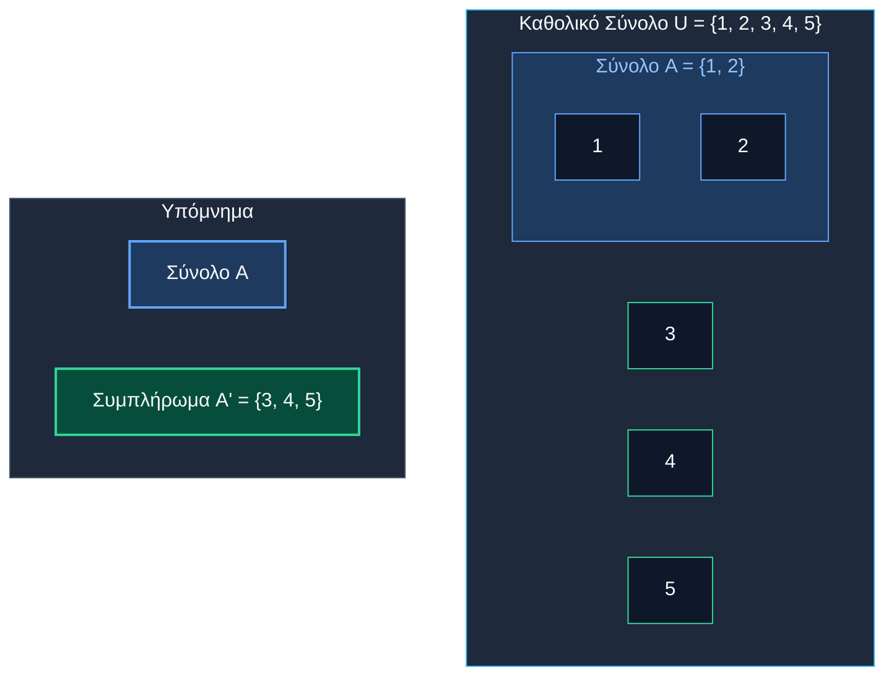
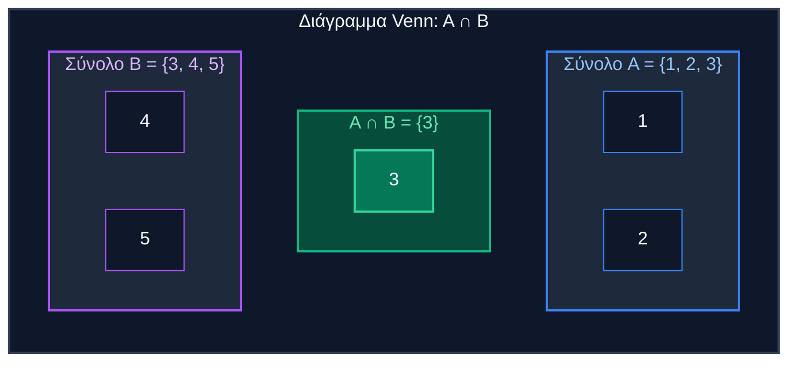
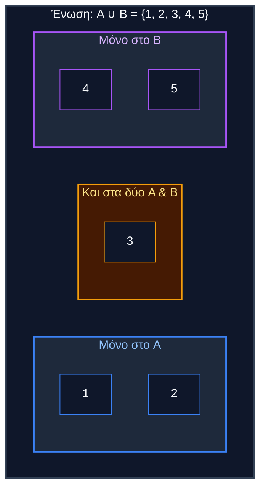
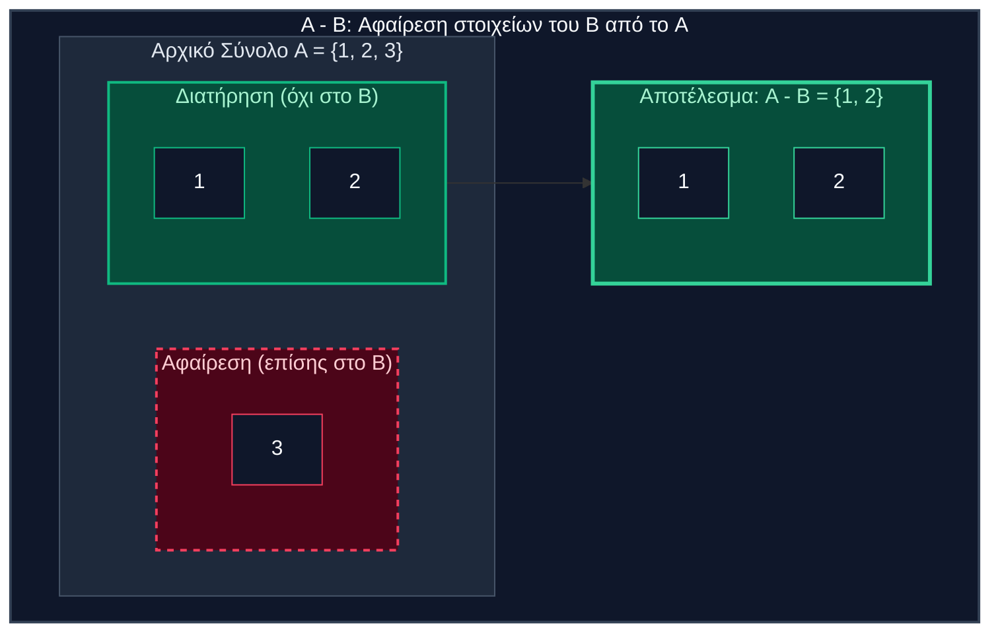
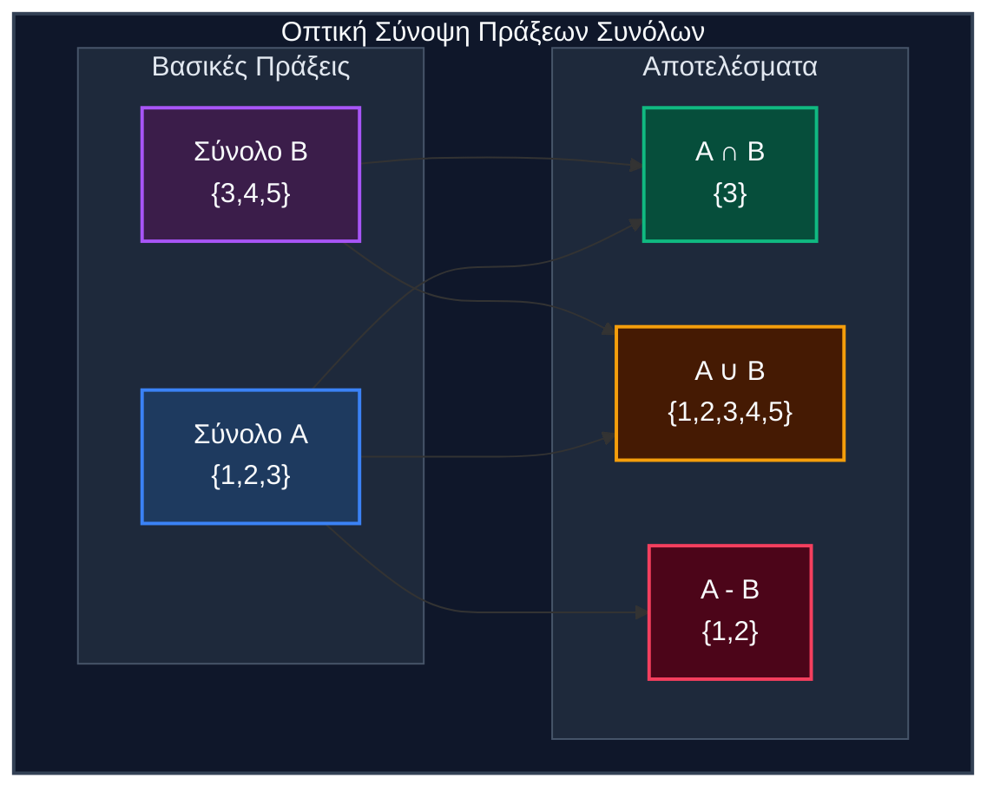
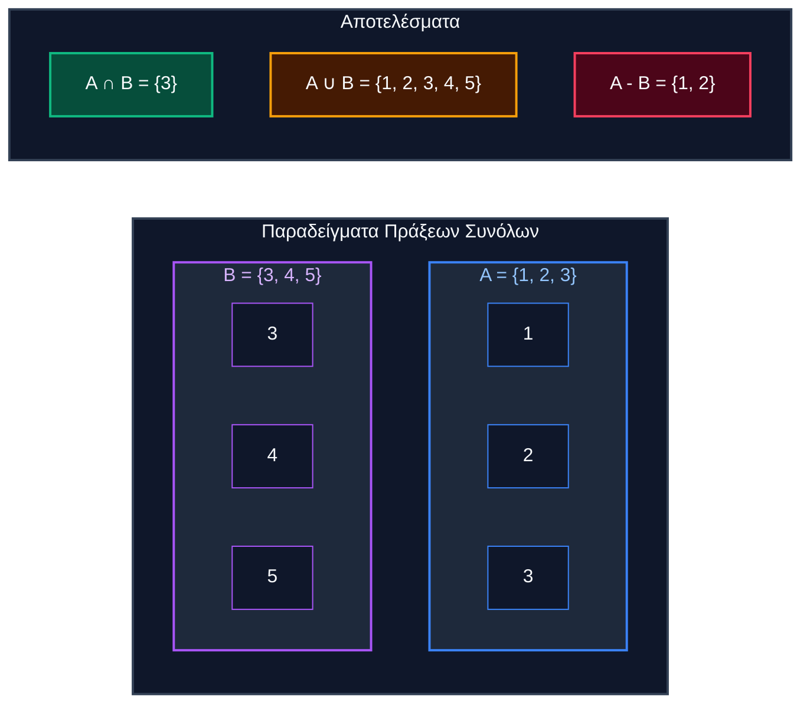

# Πράξεις Συνόλων & Διαγράμματα Venn

## Βασικές Έννοιες

### 1. Καθολικό Σύνολο (U)
- **Ορισμός**: Περιέχει όλα τα πιθανά στοιχεία για ένα συγκεκριμένο πλαίσιο
- **Συμβολισμός**: $U$ ή Σύμπαν (Universe)
- **Παράδειγμα**: $U = \{1, 2, 3, 4, 5\}$ (θετικοί ακέραιοι ≤ 5)

### 2. Συμπλήρωμα ($A^c$ ή $\overline{A}$)
- **Ορισμός**: Όλα τα στοιχεία στο $U$ που ΔΕΝ ανήκουν στο σύνολο $A$
- **Τύπος**: $\overline{A} = \{x \in U : x \notin A\}$
- **Παράδειγμα**: Αν $U = \{1, 2, 3, 4, 5\}$ και $A = \{1, 2\}$, τότε $\overline{A} = \{3, 4, 5\}$

### 1+2:

### 3. Τομή ($A \cap B$)
- **Ορισμός**: Κοινά στοιχεία και στα δύο σύνολα
- **Τύπος**: $A \cap B = \{x : x \in A \text{ ΚΑΙ } x \in B\}$
- **Παράδειγμα**: $\{1, 2, 3\} \cap \{3, 4, 5\} = \{3\}$

### 4. Ένωση ($A \cup B$)
- **Ορισμός**: Όλα τα στοιχεία από οποιοδήποτε σύνολο (ή και από τα δύο)
- **Τύπος**: $A \cup B = \{x : x \in A \text{ Ή } x \in B\}$
- **Παράδειγμα**: $\{1, 2, 3\} \cup \{3, 4, 5\} = \{1, 2, 3, 4, 5\}$

### 5. Διαφορά ($A - B$ ή $A \setminus B$)
- **Ορισμός**: Στοιχεία στο $A$ αλλά όχι στο $B$
- **Τύπος**: $A - B = \{x : x \in A \text{ ΚΑΙ } x \notin B\}$
- **Παράδειγμα**: $\{1, 2, 3\} - \{3, 4, 5\} = \{1, 2\}$

## Οπτικές Αναπαραστάσεις

## Ασκήσεις Εμπέδωσης

**Δίνονται:**
- $A = \{1, 3, 5, 7, 9\}$ (περιττοί αριθμοί < 10)
- $B = \{4, 8, 12, 16\}$ (πολλαπλάσια του 4)
- $C = \{1, 4, 9, 16\}$ (τέλεια τετράγωνα)
- $U = \{1, 2, 3, ..., 20\}$

**Υπολογίστε:**

1. $A \cup B$
2. $C \cap B$ 
3. $C - B$
4. $\emptyset \cap B$
5. $\overline{A}$ (συμπλήρωμα του A)
6. $(A \cup C) \cap B$
7. $A - (B \cup C)$

**Λεπτομέρειες**
1. **$A \cup B = \{1, 3, 4, 5, 7, 8, 9, 12, 16\}$**
   - Όλα τα μοναδικά στοιχεία και από τα δύο σύνολα

2. **$C \cap B = \{4, 16\}$**
   - Κοινά στοιχεία και στο C και στο B

3. **$C - B = \{1, 9\}$**
   - Στοιχεία στο C αλλά όχι στο B

4. **$\emptyset \cap B = \emptyset$**
   - Τομή κενού συνόλου με οποιοδήποτε σύνολο = κενό σύνολο

5. **$\overline{A} = \{2, 4, 6, 8, 10, 11, 12, 13, 14, 15, 16, 17, 18, 19, 20\}$**
   - Όλα τα στοιχεία στο U που δεν ανήκουν στο A

6. **$(A \cup C) \cap B = \{4, 16\}$**
   - Πρώτα: $A \cup C = \{1, 3, 4, 5, 7, 9, 16\}$
   - Μετά τομή με το B

7. **$A - (B \cup C) = \{3, 5, 7\}$**
   - Πρώτα: $B \cup C = \{1, 4, 8, 9, 12, 16\}$
   - Στοιχεία στο A αλλά όχι στο $(B \cup C)$

## Βασικές Ιδιότητες

| Ιδιότητα     | Τύπος                                                | Περιγραφή                                       |
| ------------ | ------------------------------------------------------ | ------------------------------------------------- |
| Αντιμεταθετική  | $A \cup B = B \cup A$                                  | Η σειρά δεν έχει σημασία                              |
| Προσεταιριστική  | $(A \cup B) \cup C = A \cup (B \cup C)$                | Η ομαδοποίηση δεν έχει σημασία                           |
| Επιμεριστική | $A \cap (B \cup C) = (A \cap B) \cup (A \cap C)$       | Η τομή επιμερίζεται ως προς την ένωση               |
| De Morgan  | $\overline{A \cup B} = \overline{A} \cap \overline{B}$ | Συμπλήρωμα ένωσης = τομή συμπληρωμάτων |