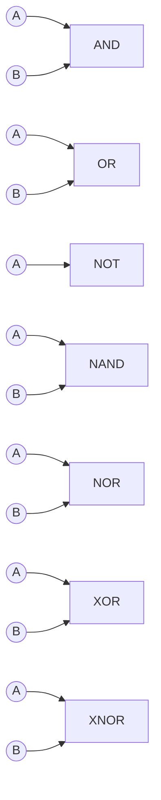
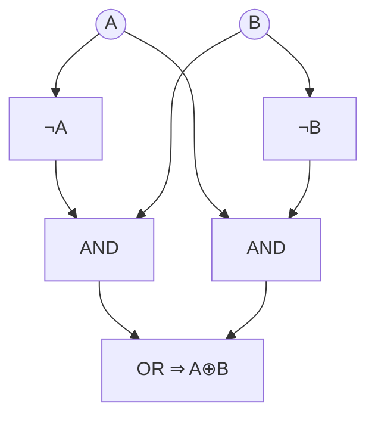
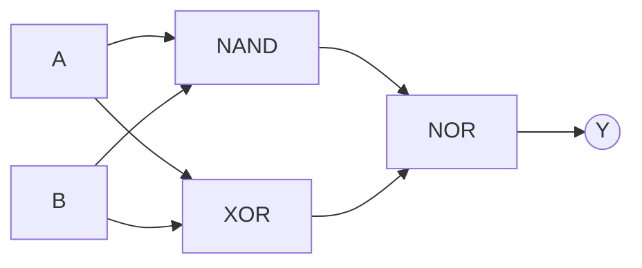
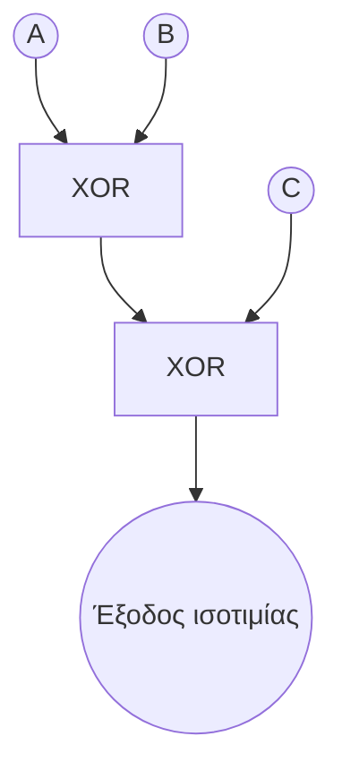

## Μέρος 1 Θεωρία Λογικών Πυλών  

### **1. Οι επτά βασικές πύλες**  
| Πύλη | Σύμβολο Boolean | Λεκτικός κανόνας (2 εισόδων) | Κανόνας πίνακα αληθείας |  
|---|---|---|---|  
| AND | $$Y=A\cdot B$$ | “1 μόνο αν και οι δύο είσοδοι είναι 1” | 11 → 1, αλλιώς 0 |  
| OR  | $$Y=A+B$$ | “1 αν τουλάχιστον μία είσοδος είναι 1” | 00 → 0, αλλιώς 1 |  
| NOT | $$Y=\overline{A}$$ | “Αντιστρέφει τη μία και μοναδική είσοδό της” | 0 → 1 |  
| NAND| $$Y=\overline{A\cdot B}$$ | “AND ακολουθούμενη από NOT” | 11 → 0, αλλιώς 1 |  
| NOR | $$Y=\overline{A+B}$$ | “OR ακολουθούμενη από NOT” | 00 → 1, αλλιώς 0 |  
| XOR | $$Y=A\oplus B$$ | “1 όταν οι είσοδοι διαφέρουν” | 00/11 → 0, 01/10 → 1 |  
| XNOR| $$Y=\overline{A\oplus B}$$ | “1 όταν οι είσοδοι ταυτίζονται” | 00/11 → 1, 01/10 → 0 |  

### **2. Οπτικός οδηγός αναφοράς**

### **3. Εστίαση στην πύλη XOR**

* Μορφή Boolean (2 εισόδων): $$A\oplus B=\overline{A}B+A\overline{B}$$.  
* Άποψη ισοτιμίας (parity): για *n* εισόδους, η XOR βγάζει 1 αν και μόνο αν το πλήθος των 1 είναι περιττό.  
* Βασικές ιδιότητες  
  - Αντιμεταθετική $$A\oplus B=B\oplus A$$  
  - Προσεταιριστική $$(A\oplus B)\oplus C=A\oplus(B\oplus C)$$  
  - Ταυτοτική $$A\oplus 0=A$$  
  - Αυτο-αντίστροφη $$A\oplus A=0$$  
* Υλοποίηση σε επίπεδο πυλών (OR + AND + NOT):

* Εφαρμογές: ημιαθροιστές, ελεγκτές ισοτιμίας, κρυπτογραφική ανάμειξη.

---

## Μέρος 2 Ασκήσεις από το βίντεο  

> *Δοκιμάστε πρώτα κάθε άσκηση μόνοι σας και μετά κάντε κλικ στο “Λύση”.*

### **Άσκηση 1 – Συμπλήρωση του μεγάλου πίνακα αληθείας**

Συμπληρώστε τις εξόδους που λείπουν για κάθε πύλη όταν $$A=1,\;B=0$$.

| Πύλη | Αναμενόμενη έξοδος | Η απάντησή σας |
|------|-----------------|-------------|
| AND  |                 |             |
| OR   |                 |             |
| NAND |                 |             |
| NOR  |                 |             |
| XOR  |                 |             |
| XNOR |                 |             |

Λύση

| Πύλη | Έξοδος |
|------|--------|
| AND  | 0 |
| OR   | 1 |
| NAND | 1 |
| NOR  | 0 |
| XOR  | 1 |
| XNOR | 0 |
(Προκύπτει απευθείας από τους κανόνες του Μέρους 1.)  

---

### **Άσκηση 2 – Αξιολόγηση κυκλώματος**

Αξιολογήστε το $$Y=((A\;\text{NAND}\;B)\;\text{NOR}\;(A\oplus B))$$.

Δίνονται είσοδοι $$A=1,\;B=1$$.

Λύση

1. $$A\;\text{NAND}\;B = \overline{1\cdot1}=0$$.  
2. $$A\oplus B = 0$$.  
3. $$0\;\text{NOR}\;0=\overline{0+0}=1$$.  
Άρα $$Y=1$$.

---

### **Άσκηση 3 – Απόδειξη προσεταιριστικότητας της XOR**

Αποδείξτε ότι $$(A\oplus B)\oplus C = A\oplus(B\oplus C)$$ με πίνακα αληθείας.

| A | B | C | $$A\oplus B$$ | LHS | $$B\oplus C$$ | RHS |
|---|---|---|--------------|-----|--------------|-----|
| 0 | 0 | 0 |              |     |              |     |
| 0 | 0 | 1 |              |     |              |     |
| 0 | 1 | 0 |              |     |              |     |
| 0 | 1 | 1 |              |     |              |     |
| 1 | 0 | 0 |              |     |              |     |
| 1 | 0 | 1 |              |     |              |     |
| 1 | 1 | 0 |              |     |              |     |
| 1 | 1 | 1 |              |     |              |     |

Λύση

Συμπληρώνοντας τον πίνακα με $$A\oplus B$$ κλπ. φαίνεται ότι οι στήλες LHS και RHS είναι πανομοιότυπες και για τις 8 γραμμές, επιβεβαιώνοντας την προσεταιριστικότητα (χρησιμοποιεί τον κανόνα της XOR από την Ενότητα 3).

---

### **Άσκηση 4 – Κατασκευή ελεγκτή ισοτιμίας 3 εισόδων**

Σχεδιάστε ένα κύκλωμα που βγάζει 1 όταν ένας περιττός αριθμός από τις εισόδους $$A,B,C$$ είναι 1.  
*(Υπόδειξη: συνδέστε σε σειρά δύο πύλες XOR.)*

**Διάγραμμα λύσης**

Επειδή η XOR είναι προσεταιριστική και σηματοδοτεί "περιττό πλήθος μονάδων", $P=A\oplus B \oplus C$.  

---

### **Άσκηση 5 – Συμμετρική διαφορά & XOR**

Έστω σύνολα $A,B$. Δείξτε ότι το ψηφίο-χαρακτηριστική του $A\triangle B$ είναι ίσο με $A\oplus B$.

**Λύση**

Για κάθε στοιχείο του καθολικού συνόλου, το ζεύγος συμμετοχής του $$(a,b)$$ αντιστοιχίζεται σε  
$$A\triangle B =1$$ αν το ζεύγος είναι (1,0) ή (0,1)· αυτός είναι ακριβώς ο πίνακας αληθείας της XOR 2 εισόδων.

---
