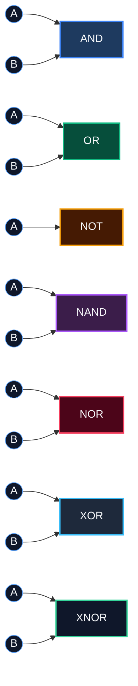
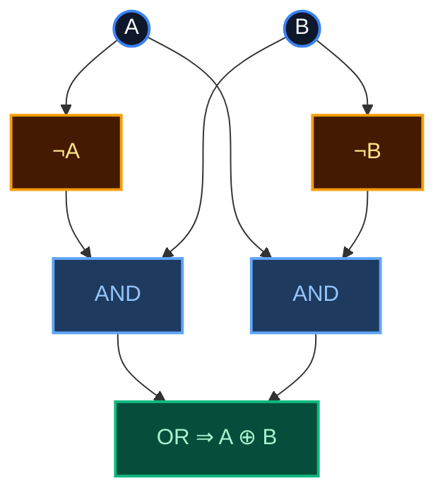
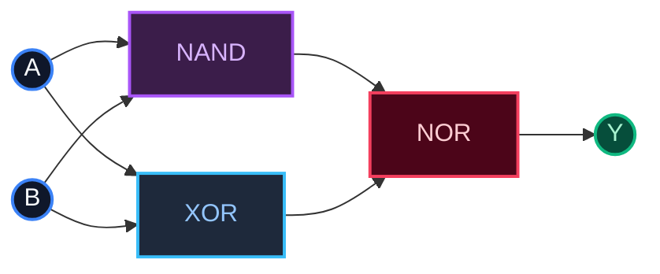
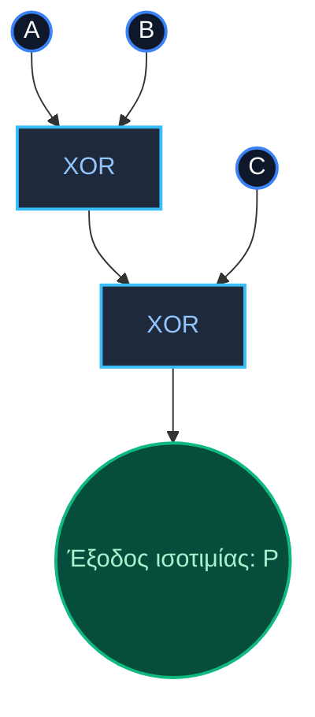

## Μέρος 1 Θεωρία Λογικών Πυλών  

### **1. Οι επτά βασικές πύλες**  

| Πύλη | Σύμβολο Boolean | Λεκτικός κανόνας (2 εισόδων) | Κανόνας πίνακα αληθείας |  
|---|---|---|---|  
| AND | $$Y=A\cdot B$$ | “1 μόνο αν και οι δύο είσοδοι είναι 1” | 11 → 1, αλλιώς 0 |  
| OR  | $$Y=A+B$$ | “1 αν τουλάχιστον μία είσοδος είναι 1” | 00 → 0, αλλιώς 1 |  
| NOT | $$Y=\overline{A}$$ | “Αντιστρέφει τη μία και μοναδική είσοδό της” | 0 → 1, 1 → 0 |  
| NAND| $$Y=\overline{A\cdot B}$$ | “AND ακολουθούμενη από NOT” | 11 → 0, αλλιώς 1 |  
| NOR | $$Y=\overline{A+B}$$ | “OR ακολουθούμενη από NOT” | 00 → 1, αλλιώς 0 |  
| XOR | $$Y=A\oplus B$$ | “1 όταν οι είσοδοι διαφέρουν” | 00/11 → 0, 01/10 → 1 |  
| XNOR| $$Y=\overline{A\oplus B}$$ | “1 όταν οι είσοδοι ταυτίζονται” | 00/11 → 1, 01/10 → 0 |  

---

### **Αναλυτικοί Πίνακες Αληθείας ανά Πύλη**

#### **Πύλη NOT (Αντιστροφέας - Inverter)**
- **Έκφραση Boolean**: $$Y = \overline{A}$$ ή $$Y = \neg A$$
- **Κανόνας**: Η έξοδος είναι το αντίστροφο της εισόδου.

| $A$ | $Y = \overline{A}$ |
|:---:|:---:|
| 0 | 1 |
| 1 | 0 |

#### **Πύλη AND (Λογικός Πολλαπλασιασμός / Σύζευξη)**
- **Έκφραση Boolean**: $$Y = A \cdot B$$
- **Κανόνας**: Η έξοδος είναι 1 μόνο όταν και οι δύο είσοδοι είναι 1.

| $A$ | $B$ | $Y = A \cdot B$ |
|:---:|:---:|:---:|
| 0 | 0 | 0 |
| 0 | 1 | 0 |
| 1 | 0 | 0 |
| 1 | 1 | 1 |

#### **Πύλη OR (Λογική Πρόσθεση / Διάζευξη)**
- **Έκφραση Boolean**: $$Y = A + B$$
- **Κανόνας**: Η έξοδος είναι 1 αν τουλάχιστον μία είσοδος είναι 1.

| $A$ | $B$ | $Y = A + B$ |
|:---:|:---:|:---:|
| 0 | 0 | 0 |
| 0 | 1 | 1 |
| 1 | 0 | 1 |
| 1 | 1 | 1 |

#### **Πύλη NAND (Όχι-ΚΑΙ / Άρνηση Σύζευξης)**
- **Έκφραση Boolean**: $$Y = \overline{A \cdot B}$$
- **Κανόνας**: Η έξοδος είναι 0 μόνο όταν και οι δύο είσοδοι είναι 1 (αντίστροφη της AND).

| $A$ | $B$ | $Y = \overline{A \cdot B}$ |
|:---:|:---:|:---:|
| 0 | 0 | 1 |
| 0 | 1 | 1 |
| 1 | 0 | 1 |
| 1 | 1 | 0 |

#### **Πύλη NOR (Όχι-Ή / Άρνηση Διάζευξης)**
- **Έκφραση Boolean**: $$Y = \overline{A + B}$$
- **Κανόνας**: Η έξοδος είναι 1 μόνο όταν και οι δύο είσοδοι είναι 0 (αντίστροφη της OR).

| $A$ | $B$ | $Y = \overline{A + B}$ |
|:---:|:---:|:---:|
| 0 | 0 | 1 |
| 0 | 1 | 0 |
| 1 | 0 | 0 |
| 1 | 1 | 0 |

#### **Πύλη XOR (Αποκλειστικό Ή - Exclusive OR)**
- **Έκφραση Boolean**: $$Y = A \oplus B = \overline{A}B + A\overline{B}$$
- **Κανόνας**: Η έξοδος είναι 1 όταν οι είσοδοι διαφέρουν μεταξύ τους.

| $A$ | $B$ | $Y = A \oplus B$ |
|:---:|:---:|:---:|
| 0 | 0 | 0 |
| 0 | 1 | 1 |
| 1 | 0 | 1 |
| 1 | 1 | 0 |

#### **Πύλη XNOR (Αποκλειστικό Όχι-Ή / Ισοδυναμία - Exclusive NOR)**
- **Έκφραση Boolean**: $$Y = \overline{A \oplus B} = AB + \overline{A}\,\overline{B}$$
- **Κανόνας**: Η έξοδος είναι 1 όταν οι δύο είσοδοι είναι ίδιες (ταυτίζονται).

| $A$ | $B$ | $Y = \overline{A \oplus B}$ |
|:---:|:---:|:---:|
| 0 | 0 | 1 |
| 0 | 1 | 0 |
| 1 | 0 | 0 |
| 1 | 1 | 1 |

---

### **Συγκεντρωτικός Πίνακας Απομνημόνευσης (2 Εισόδων)**

Ο παρακάτω πίνακας συγκεντρώνει όλες τις δυαδικές πράξεις για άμεση αντιπαραβολή και εύκολη απομνημόνευση:

| $A$ | $B$ | AND ($A \cdot B$) | OR ($A + B$) | NAND ($\overline{A \cdot B}$) | NOR ($\overline{A + B}$) | XOR ($A \oplus B$) | XNOR ($\overline{A \oplus B}$) |
|:---:|:---:|:---:|:---:|:---:|:---:|:---:|:---:|
| **0** | **0** | 0 | 0 | 1 | 1 | 0 | 1 |
| **0** | **1** | 0 | 1 | 1 | 0 | 1 | 0 |
| **1** | **0** | 0 | 1 | 1 | 0 | 1 | 0 |
| **1** | **1** | 1 | 1 | 0 | 0 | 0 | 1 |

---

### **2. Οπτικός οδηγός αναφοράς**

### **3. Εστίαση στην πύλη XOR**

* Μορφή Boolean (2 εισόδων): $$A\oplus B=\overline{A}B+A\overline{B}$$.  
* Άποψη ισοτιμίας (parity): για *n* εισόδους, η XOR βγάζει 1 αν και μόνο αν το πλήθος των 1 είναι περιττό.  
* Βασικές ιδιότητες  
  - Αντιμεταθετική: $$A\oplus B=B\oplus A$$  
  - Προσεταιριστική: $$(A\oplus B)\oplus C=A\oplus(B\oplus C)$$  
  - Ταυτοτική: $$A\oplus 0=A$$  
  - Αυτο-αντίστροφη: $$A\oplus A=0$$  
* Υλοποίηση σε επίπεδο πυλών (OR + AND + NOT):

* Εφαρμογές: ημιαθροιστές, ελεγκτές ισοτιμίας, κρυπτογραφική ανάμειξη.

---

## Μέρος 2 Ασκήσεις & Αναλυτικές Λύσεις

### **Άσκηση 1 – Συμπλήρωση τιμών εξόδου πυλών**

**Εκφώνηση**:  
Υπολογίστε την έξοδο για κάθε πύλη όταν οι είσοδοι είναι $$A=1$$ και $$B=0$$.

**Αναλυτικά Βήματα & Λύση**:

1. **AND ($A \cdot B$)**:
   - Υπολογισμός: $$1 \cdot 0 = 0$$
   - Αιτιολόγηση: Η AND απαιτεί όλες οι είσοδοι να είναι 1. Εδώ η είσοδος $B=0$, άρα έξοδος = **0**.

2. **OR ($A + B$)**:
   - Υπολογισμός: $$1 + 0 = 1$$
   - Αιτιολόγηση: Η OR απαιτεί τουλάχιστον μία είσοδος να είναι 1. Εδώ η είσοδος $A=1$, άρα έξοδος = **1**.

3. **NAND ($\overline{A \cdot B}$)**:
   - Υπολογισμός: $$\overline{1 \cdot 0} = \overline{0} = 1$$
   - Αιτιολόγηση: Είναι η άρνηση της AND ($1 \cdot 0 = 0 \implies \overline{0} = 1$), άρα έξοδος = **1**.

4. **NOR ($\overline{A + B}$)**:
   - Υπολογισμός: $$\overline{1 + 0} = \overline{1} = 0$$
   - Αιτιολόγηση: Είναι η άρνηση της OR ($1 + 0 = 1 \implies \overline{1} = 0$), άρα έξοδος = **0**.

5. **XOR ($A \oplus B$)**:
   - Υπολογισμός: $$1 \oplus 0 = 1$$
   - Αιτιολόγηση: Οι είσοδοι διαφέρουν ($A \neq B$), επομένως η XOR παράγει **1**.

6. **XNOR ($\overline{A \oplus B}$)**:
   - Υπολογισμός: $$\overline{1 \oplus 0} = \overline{1} = 0$$
   - Αιτιολόγηση: Οι είσοδοι δεν είναι ίδιες ($A \neq B$), άρα η έξοδος ισοδυναμίας είναι **0**.

**Συνοπτικός Πίνακας Αποτελεσμάτων για $A=1, B=0$**:

| Πύλη | Έκφραση Boolean | Υπολογισμός | Τελική Έξοδος |
|:---|:---|:---|:---:|
| **AND**  | $$A \cdot B$$           | $$1 \cdot 0$$                   | **0** |
| **OR**   | $$A + B$$               | $$1 + 0$$                       | **1** |
| **NAND** | $$\overline{A \cdot B}$$ | $$\overline{1 \cdot 0} = \overline{0}$$ | **1** |
| **NOR**  | $$\overline{A + B}$$     | $$\overline{1 + 0} = \overline{1}$$     | **0** |
| **XOR**  | $$A \oplus B$$          | $$1 \oplus 0$$                  | **1** |
| **XNOR** | $$\overline{A \oplus B}$$ | $$\overline{1 \oplus 0} = \overline{1}$$ | **0** |

---

### **Άσκηση 2 – Αξιολόγηση συνδυαστικού κυκλώματος**

**Εκφώνηση**:  
Αξιολογήστε την έξοδο $$Y$$ του κυκλώματος:
$$Y = ((A\;\text{NAND}\;B)\;\text{NOR}\;(A\oplus B))$$
όταν οι είσοδοι είναι $$A=1$$ και $$B=1$$.

**Αναλυτικά Βήματα Επίλυσης**:

- **Βήμα 1 (Υπολογισμός εξόδου της πύλης NAND)**:
  Οι είσοδοι είναι $A=1$ και $B=1$.
  $$\text{Out}_{N1} = A \text{ NAND } B = \overline{1 \cdot 1} = \overline{1} = 0$$

- **Βήμα 2 (Υπολογισμός εξόδου της πύλης XOR)**:
  Οι είσοδοι είναι $A=1$ και $B=1$.
  $$\text{Out}_{X1} = A \oplus B = 1 \oplus 1 = 0$$
  *(Επειδή και οι δύο είσοδοι είναι ίδιες, η έξοδος της XOR είναι 0).*

- **Βήμα 3 (Υπολογισμός εξόδου της πύλης NOR)**:
  Οι είσοδοι στην πύλη NOR ($N_2$) είναι τα αποτελέσματα των δύο προηγούμενων σταδίων:
  $$\text{In}_1 = \text{Out}_{N1} = 0, \quad \text{In}_2 = \text{Out}_{X1} = 0$$
  Εφαρμόζουμε τον κανόνα της πύλης NOR:
  $$Y = \text{Out}_{N1} \text{ NOR } \text{Out}_{X1} = \overline{0 + 0} = \overline{0} = 1$$

**Τελικό Συμπέρασμα**:
$$Y = 1$$

---

### **Άσκηση 3 – Απόδειξη προσεταιριστικότητας της XOR**

**Εκφώνηση**:  
Αποδείξτε αναλυτικά ότι η πύλη XOR είναι προσεταιριστική:
$$(A\oplus B)\oplus C = A\oplus(B\oplus C)$$
κατασκευάζοντας τον πλήρη πίνακα αληθείας 8 γραμμών.

**Αναλυτικός Πίνακας Αληθείας**:

| Γραμμή | $A$ | $B$ | $C$ | $A\oplus B$ | $\text{LHS} = (A\oplus B)\oplus C$ | $B\oplus C$ | $\text{RHS} = A\oplus(B\oplus C)$ | Επαλήθευση $\text{LHS} = \text{RHS}$ |
|:---:|:---:|:---:|:---:|:---:|:---:|:---:|:---:|:---:|
| **1** | 0 | 0 | 0 | 0 | **0** | 0 | **0** | $0 = 0$ |
| **2** | 0 | 0 | 1 | 0 | **1** | 1 | **1** | $1 = 1$ |
| **3** | 0 | 1 | 0 | 1 | **1** | 1 | **1** | $1 = 1$ |
| **4** | 0 | 1 | 1 | 1 | **0** | 0 | **0** | $0 = 0$ |
| **5** | 1 | 0 | 0 | 1 | **1** | 0 | **1** | $1 = 1$ |
| **6** | 1 | 0 | 1 | 1 | **0** | 1 | **0** | $0 = 0$ |
| **7** | 1 | 1 | 0 | 0 | **0** | 1 | **0** | $0 = 0$ |
| **8** | 1 | 1 | 1 | 0 | **1** | 0 | **1** | $1 = 1$ |

**Αναλυτική Επεξήγηση Βημάτων**:
1. **Υπολογισμός της στήλης $A \oplus B$**: Εφαρμόζουμε τον κανόνα XOR στις μεταβλητές $A$ και $B$. Παράγει 1 μόνο όταν ένα από τα δύο είναι 1 (γραμμές 3, 4, 5, 6).
2. **Υπολογισμός του αριστερού μέλους ($\text{LHS}$)**: Παίρνουμε το αποτέλεσμα $(A \oplus B)$ και εκτελούμε XOR με το $C$.
   - Γραμμή 1: $0 \oplus 0 = 0$
   - Γραμμή 2: $0 \oplus 1 = 1$
   - Γραμμή 3: $1 \oplus 0 = 1$
   - Γραμμή 4: $1 \oplus 1 = 0$
   - Γραμμή 5: $1 \oplus 0 = 1$
   - Γραμμή 6: $1 \oplus 1 = 0$
   - Γραμμή 7: $0 \oplus 0 = 0$
   - Γραμμή 8: $0 \oplus 1 = 1$
3. **Υπολογισμός της στήλης $B \oplus C$**: Εφαρμόζουμε τον κανόνα XOR στις μεταβλητές $B$ και $C$.
4. **Υπολογισμός του δεξιού μέλους ($\text{RHS}$)**: Εκτελούμε XOR μεταξύ του $A$ και του $(B \oplus C)$.
5. **Σύγκριση Στηλών**: Παρατηρούμε ότι για όλες τις 8 πιθανές εισόδους, οι τιμές της στήλης $\text{LHS}$ ταυτίζονται πλήρως με τις τιμές της στήλης $\text{RHS}$.
6. **Ερμηνεία Ισοτιμίας (Parity)**: Και οι δύο εκφράσεις παράγουν 1 αν και μόνο αν το πλήθος των άσσων στο $(A, B, C)$ είναι περιττό (1 ή 3 άσσοι). Αυτό επιβεβαιώνει οριστικά ότι:
   $$(A\oplus B)\oplus C = A\oplus(B\oplus C)$$

---

### **Άσκηση 4 – Κατασκευή ελεγκτή ισοτιμίας 3 εισόδων**

**Εκφώνηση**:  
Σχεδιάστε ένα λογικό κύκλωμα με τρεις εισόδους $$A, B, C$$ το οποίο παράγει έξοδο 1 όταν περιττός αριθμός εισόδων έχει τιμή 1.

**Αναλυτικά Βήματα Επίλυσης**:
1. **Ανάλυση Συνάρτησης Ισοτιμίας**:
   - Η έξοδος $P$ πρέπει να είναι 1 στις περιπτώσεις όπου το πλήθος των 1 είναι περιττό (δηλαδή ακριβώς 1 είσοδος είναι 1 ή και οι 3 είσοδοι είναι 1).
   - Αυτή είναι ακριβώς η ιδιότητα της πράξης XOR πολλαπλών μεταβλητών.
2. **Σύνθεση με Πύλες 2 Εισόδων**:
   - Συνδέουμε πρώτα τα $A$ και $B$ σε μία πύλη XOR: $X_1 = A \oplus B$.
   - Το αποτέλεσμα $X_1$ συνδέεται σε δεύτερη πύλη XOR μαζί με την τρίτη είσοδο $C$:
     $$P = X_1 \oplus C = (A \oplus B) \oplus C$$
   - Λόγω της προσεταιριστικότητας που αποδείξαμε στην Άσκηση 3, η σειρά ομαδοποίησης δεν μεταβάλλει το αποτέλεσμα: $P = A \oplus B \oplus C$.

**Διάγραμμα Κυκλώματος**:

---

### **Άσκηση 5 – Σχέση συμμετρικής διαφοράς συνόλων και πύλης XOR**

**Εκφώνηση**:  
Έστω δύο σύνολα $A, B \subseteq U$. Αποδείξτε ότι η χαρακτηριστική συνάρτηση της συμμετρικής διαφοράς $\chi_{A\triangle B}$ ικανοποιεί:
$$\chi_{A\triangle B}(x) = \chi_A(x) \oplus \chi_B(x), \quad \forall x \in U$$

**Αναλυτικά Βήματα Απόδειξης**:
1. **Ορισμός Χαρακτηριστικής Συνάρτησης**:
   Για κάθε σύνολο $S \subseteq U$:
   $$\chi_S(x) = \begin{cases} 1, & x \in S \\ 0, & x \notin S \end{cases}$$

2. **Ορισμός Συμμετρικής Διαφοράς**:
   $$A \triangle B = (A \setminus B) \cup (B \setminus A)$$
   Δηλαδή, ένα στοιχείο $x$ ανήκει στο $A \triangle B$ αν και μόνο αν ανήκει είτε αποκλειστικά στο $A$ είτε αποκλειστικά στο $B$.

3. **Εξέταση Όλων των Περιπτώσεων για ένα Τυχαίο Στοιχείο $x \in U$**:
   - **Περίπτωση 1 ($x \notin A$ και $x \notin B$)**:
     $\chi_A(x) = 0$, $\chi_B(x) = 0$.
     Το $x \notin A \triangle B \implies \chi_{A\triangle B}(x) = 0$.
     Υπολογισμός XOR: $0 \oplus 0 = 0$. (Ισχύει)
   - **Περίπτωση 2 ($x \in A$ και $x \notin B$)**:
     $\chi_A(x) = 1$, $\chi_B(x) = 0$.
     Το $x \in A \triangle B \implies \chi_{A\triangle B}(x) = 1$.
     Υπολογισμός XOR: $1 \oplus 0 = 1$. (Ισχύει)
   - **Περίπτωση 3 ($x \notin A$ και $x \in B$)**:
     $\chi_A(x) = 0$, $\chi_B(x) = 1$.
     Το $x \in A \triangle B \implies \chi_{A\triangle B}(x) = 1$.
     Υπολογισμός XOR: $0 \oplus 1 = 1$. (Ισχύει)
   - **Περίπτωση 4 ($x \in A$ και $x \in B$)**:
     $\chi_A(x) = 1$, $\chi_B(x) = 1$.
     Το $x \in A \cap B$, άρα $x \notin A \triangle B \implies \chi_{A\triangle B}(x) = 0$.
     Υπολογισμός XOR: $1 \oplus 1 = 0$. (Ισχύει)

4. **Πίνακας Αντιστοίχισης**:

| $x \in A$ | $x \in B$ | $\chi_A(x)$ | $\chi_B(x)$ | $x \in A \triangle B$ | $\chi_{A \triangle B}(x)$ | $\chi_A(x) \oplus \chi_B(x)$ |
|:---:|:---:|:---:|:---:|:---:|:---:|:---:|
| Όχι | Όχι | 0 | 0 | Όχι | **0** | **0** |
| Όχι | Ναι | 0 | 1 | Ναι | **1** | **1** |
| Ναι | Όχι | 1 | 0 | Ναι | **1** | **1** |
| Ναι | Ναι | 1 | 1 | Όχι | **0** | **0** |

5. **Συμπέρασμα**: Σε όλες τις περιπτώσεις $\chi_{A\triangle B}(x) = \chi_A(x) \oplus \chi_B(x)$, οπότε η πρόταση αποδείχθηκε.
