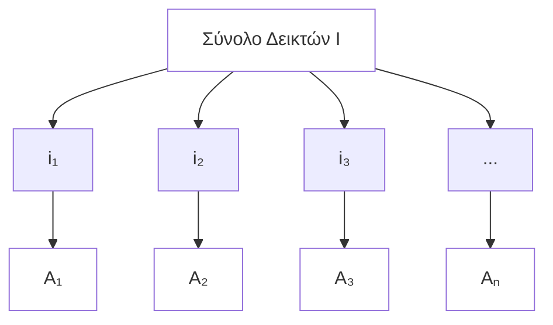

# Δεικτοδοτημένα Σύνολα & Αρχή της Καλής Διάταξης

## Μέρος 1: Θεωρία

### **Δεικτοδοτημένα Σύνολα**

**Ορισμός**: Ένα δεικτοδοτημένο σύνολο είναι μια συλλογή συνόλων $\{A_i\}_{i \in I}$ όπου κάθε σύνολο $A_i$ σχετίζεται με έναν δείκτη $i$ από ένα σύνολο δεικτών $I$.

**Συμβολισμός**:
- Σύνολο δεικτών: $I = \{i_1, i_2, i_3, ...\}$
- Δεικτοδοτημένη οικογένεια: $\{A_i : i \in I\}$ ή $\{A_i\}_{i \in I}$

### **Πράξεις σε Δεικτοδοτημένα Σύνολα**

**Ένωση**: $$\bigcup_{i \in I} A_i = \{x : x \in A_i \text{ για κάποιο } i \in I\}$$

**Τομή**: $$\bigcap_{i \in I} A_i = \{x : x \in A_i \text{ για όλα τα } i \in I\}$$

### **Αρχή της Καλής Διάταξης**

**Διατύπωση**: Κάθε μη κενό υποσύνολο των θετικών ακεραίων έχει ένα ελάχιστο στοιχείο.

**Τυπικός Ορισμός**: Αν $S \subseteq \mathbb{Z}^+$ και $S \neq \emptyset$, τότε: $$\exists m \in S$$ τέτοιο ώστε $m \leq s$ για όλα τα $s \in S$.

**Βασικές Ιδιότητες**:
- Το $\mathbb{N}$ είναι καλά διατεταγμένο
- Το $\mathbb{Z}$ ΔΕΝ είναι καλά διατεταγμένο
- Το $\mathbb{Q}^+$ ΔΕΝ είναι καλά διατεταγμένο

### **Εφαρμογές & Ισοδυναμίες**

Η Αρχή της Καλής Διάταξης είναι ισοδύναμη με:
- **Μαθηματική Επαγωγή**
- **Ισχυρή Επαγωγή** 
- **Αξίωμα της Επιλογής** (σε συγκεκριμένα πλαίσια)

## Μέρος 2: Ασκήσεις & Λύσεις

### **Άσκηση 1**: Πράξεις Δεικτοδοτημένων Συνόλων

Δίνονται τα δεικτοδοτημένα σύνολα $A_n = \{1, 2, ..., n\}$ για $n \in \mathbb{N}$, βρείτε:

**a)** $$\bigcup_{n=1}^{\infty} A_n$$
**b)** $$\bigcap_{n=1}^{\infty} A_n$$

**Λύση**

**a)** $$\bigcup_{n=1}^{\infty} A_n = \mathbb{N}$$
- Κάθε θετικός ακέραιος εμφανίζεται σε κάποιο $A_n$

**b)** $$\bigcap_{n=1}^{\infty} A_n = \{1\}$$  
- Μόνο το 1 εμφανίζεται σε όλα τα σύνολα $A_n$

### **Άσκηση 2**: Εφαρμογή της Καλής Διάταξης

Αποδείξτε ότι κάθε ακέραιος $n \geq 8$ μπορεί να γραφεί ως $n = 3a + 5b$ όπου $a, b \in \mathbb{N} \cup \{0\}$.

**Λύση**

**Με Ισχυρή Επαγωγή**:
- **Βασικές περιπτώσεις**: 
  - $n = 8 = 3(1) + 5(1)$ 
  - $n = 9 = 3(3) + 5(0)$   
  - $n = 10 = 3(0) + 5(2)$ 

- **Επαγωγικό βήμα**: Για $n \geq 11$, υποθέτουμε ότι ισχύει για όλα τα $k < n$
  - Αφού $n-3 \geq 8$, από την υπόθεση: $n-3 = 3a + 5b$
  - Επομένως: $n = 3(a+1) + 5b$ 

### **Άσκηση 3**: Κατασκευή Αντιπαραδείγματος

Δείξτε ότι το $\mathbb{Q}^+$ δεν είναι καλά διατεταγμένο βρισκόντας ένα υποσύνολο χωρίς ελάχιστο.

**Λύση**

Θεωρούμε το $S = \{r \in \mathbb{Q}^+ : r > 1\}$

Για κάθε $r \in S$, έχουμε $1 < \frac{r+1}{2} < r$, άρα $\frac{r+1}{2} \in S$ και $\frac{r+1}{2} < r$.

Επομένως, το $S$ δεν έχει ελάχιστο στοιχείο, αποδεικνύοντας ότι το $\mathbb{Q}^+$ δεν είναι καλά διατεταγμένο.

### **Άσκηση 4**: Κατασκευή Συνόλου Δεικτών

Έστω $B_i = [i, i+1)$ για $i \in \mathbb{Z}$. Προσδιορίστε τα:

**a)** $$\bigcup_{i \in \mathbb{Z}} B_i$$
**b)** $$\bigcap_{i \in \mathbb{Z}} B_i$$

**Λύση**

**a)** $$\bigcup_{i \in \mathbb{Z}} B_i = \mathbb{R}$$
- Κάθε πραγματικός αριθμός ανήκει σε κάποιο διάστημα $[i, i+1)$

**b)** $$\bigcap_{i \in \mathbb{Z}} B_i = \emptyset$$
- Κανένας πραγματικός αριθμός δεν ανήκει σε όλα τα διαστήματα ταυτόχρονα

### **Άσκηση 5**: Απόδειξη με την Αρχή της Καλής Διάταξης

Χρησιμοποιήστε την Αρχή της Καλής Διάταξης για να αποδείξετε: Αν $a, b \in \mathbb{Z}^+$ με $\gcd(a,b) = 1$, τότε $\gcd(a^n, b^n) = 1$ για όλα τα $n \in \mathbb{N}$.

**Λύση**

**Απόδειξη με απαγωγή σε άτοπο**:
Υποθέτουμε ότι υπάρχει τουλάχιστον ένα $n \in \mathbb{N}$ για το οποίο $\gcd(a^n, b^n) > 1$.
Ορίζουμε το μη κενό σύνολο:
$$S = \{n \in \mathbb{N} : \gcd(a^n, b^n) > 1\} \neq \emptyset$$

1. Από την **Αρχή της Καλής Διάταξης**, το $S$ περιέχει ένα **ελάχιστο στοιχείο**, έστω $m = \min(S)$.
2. Επειδή για $n=1$ δίνεται $\gcd(a, b) = 1$, το $1 \notin S$, άρα αναγκαστικά $m > 1$ (επομένως $m - 1 \ge 1$).
3. Αφού $m \in S$, υπάρχει πρώτος αριθμός $p$ τέτοιος ώστε $p \mid \gcd(a^m, b^m)$. Άρα $p \mid a^m$ και $p \mid b^m$.
4. Από τη βασική ιδιότητα των πρώτων αριθμών ($p \mid x \cdot y \implies p \mid x$ ή $p \mid y$), έχουμε ότι $p \mid a$ και $p \mid b$.
5. Συνεπώς:
   $$p \mid a \implies p \mid a^{m-1} \quad \text{και} \quad p \mid b \implies p \mid b^{m-1}$$
   που σημαίνει ότι ο $p$ είναι κοινός διαιρέτης των $a^{m-1}$ και $b^{m-1}$, δηλαδή $\gcd(a^{m-1}, b^{m-1}) \geq p > 1$.
6. Αυτό σημαίνει ότι $m - 1 \in S$. Όμως $m - 1 < m$, πράγμα που έρχεται σε **αντίφαση με την υπόθεση ότι το $m$ είναι το ελάχιστο στοιχείο του $S$**.
7. Άρα το σύνολο $S$ είναι αναγκαστικά κενό ($S = \emptyset$), αποδεικνύοντας ότι $\gcd(a^n, b^n) = 1$ για όλα τα $n \in \mathbb{N}$.
