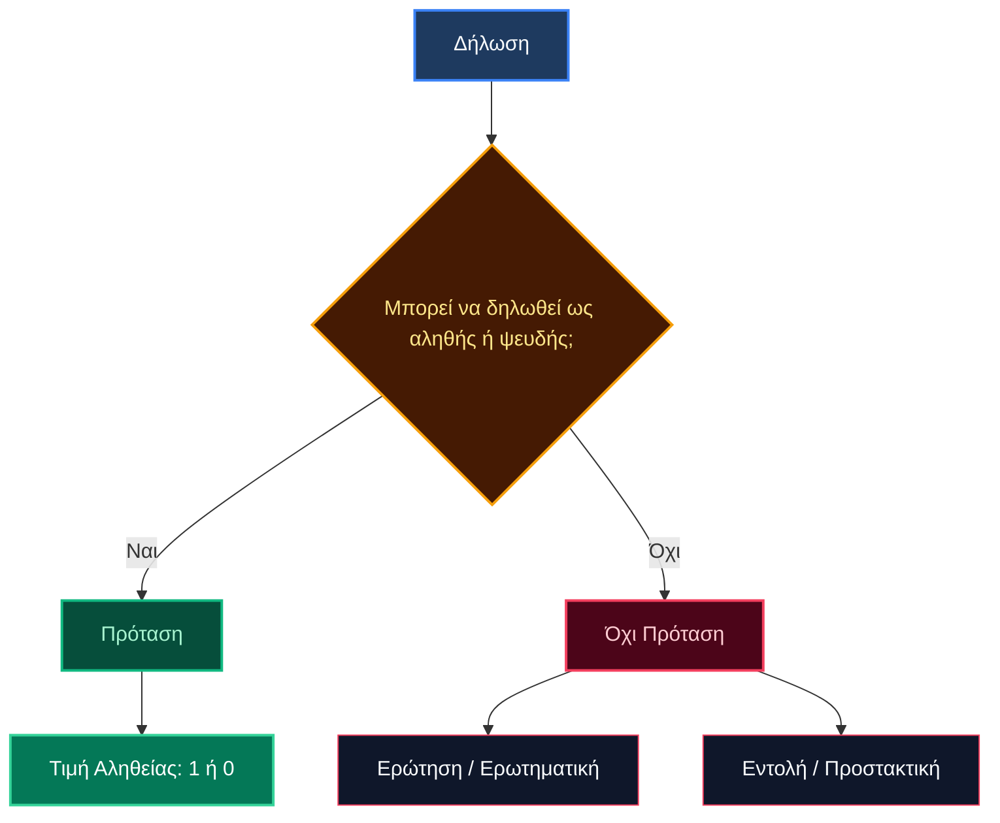
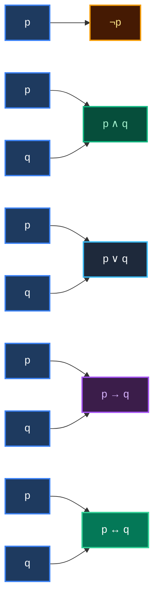
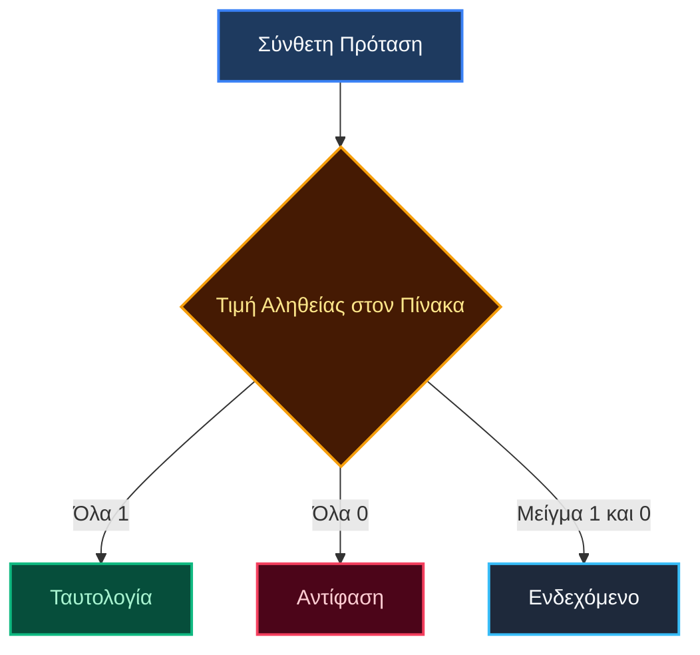
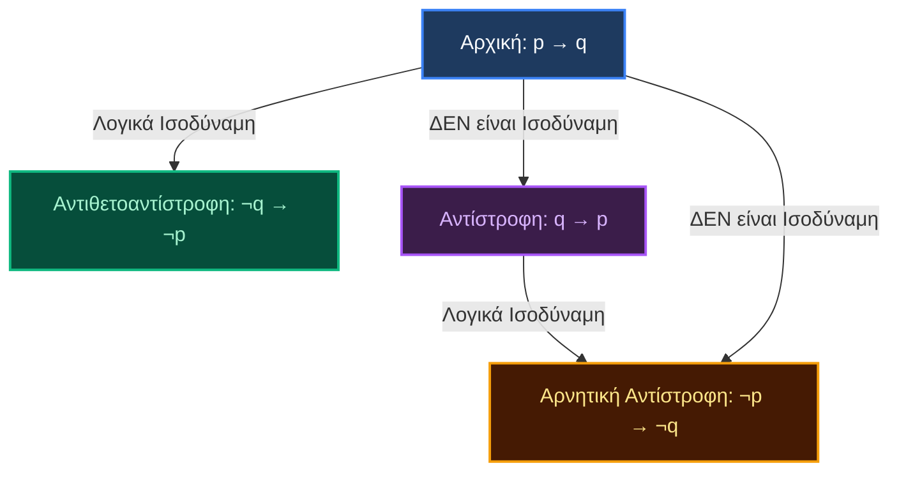
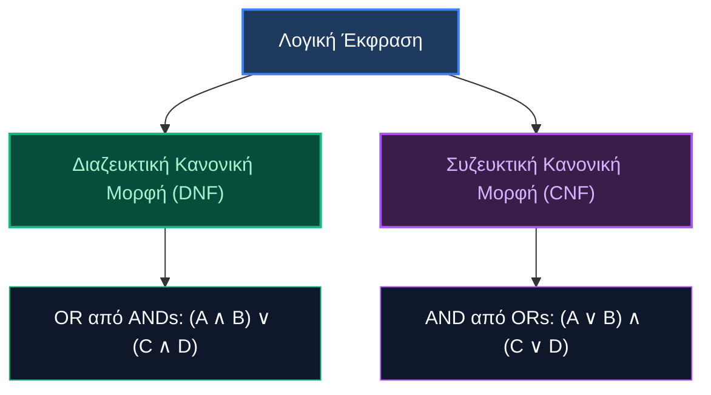

# Προτασιακή Λογική: Πλήρεις Σημειώσεις Μελέτης

## 1. Προτάσεις

### Ορισμός και Χαρακτηριστικά
Μια **πρόταση** είναι κάθε δήλωση που μπορεί να χαρακτηριστεί είτε ως αληθής είτε ως ψευδής, αλλά όχι και τα δύο ταυτόχρονα. Δεν χρειάζεται να γνωρίζετε αν είναι πράγματι αληθής ή ψευδής - μόνο ότι μπορεί να λάβει μία από αυτές τις δύο τιμές.

### Παραδείγματα Έγκυρων Προτάσεων
- "Το αποτέλεσμα της πρόσθεσης δύο ρητών αριθμών είναι ρητός" (αληθής πρόταση)
- "Ο δυαδικός αριθμός 0 χρησιμοποιείται για την αναπαράσταση του ψευδούς στη λογική" (αληθής πρόταση)

### Τι ΔΕΝ είναι Προτάσεις
- **Ερωτήσεις (Ερωτηματικές)**: "Είναι αυτό πρόταση;" - δεν μπορεί να είναι αληθής ή ψευδής
- **Εντολές (Προστακτικές)**: "Πάρε αυτό από μένα και τρέξε" - δεν μπορεί να είναι αληθής ή ψευδής

### Αναπαράσταση Τιμής Αληθείας
Στα διακριτά μαθηματικά, χρησιμοποιούμε δυαδική αναπαράσταση αντί για τη συμβολισμό Α/Ψ:
- **1** αντιπροσωπεύει το Αληθές
- **0** αντιπροσωπεύει το Ψευδές

## 2. Λογικοί Σύνδεσμοι

### Επισκόπηση Βασικών Συνδέσμων
Οι λογικοί σύνδεσμοι είναι τελεστές που συνδυάζουν προτάσεις για να σχηματίσουν σύνθετες δηλώσεις. Εδώ είναι οι πέντε θεμελιώδεις σύνδεσμοι:

| Σύμβολο | Εναλλακτικό | Όνομα | Περιγραφή |
|--------|-------------|------|-------------|
| ¬ | ~, ! | Άρνηση (NOT) | Αντιστρέφει την τιμή αληθείας |
| ∧ | &, · | Σύζευξη (AND) | Αληθής μόνο όταν και οι δύο είναι αληθείς |
| ∨ | + | Διάζευξη (OR) | Αληθής όταν τουλάχιστον μία είναι αληθής |
| → | ⊃ | Συνεπαγωγή (IF-THEN) | Ψευδής μόνο όταν η υπόθεση είναι αληθής και το συμπέρασμα ψευδές |
| ↔ | ≡ | Ισοδυναμία (IFF) | Αληθής όταν και οι δύο έχουν την ίδια τιμή αληθείας |

### Λεπτομερείς Εξηγήσεις Συνδέσμων

#### Άρνηση (¬)
- **Μαθηματικός τύπος**: Τιμή του ¬p = 1 - τιμή του p
- **Παράδειγμα**: Αν το "το γρασίδι είναι πράσινο" είναι αληθές, τότε το "το γρασίδι δεν είναι πράσινο" είναι ψευδές

#### Σύζευξη (∧)
- **Μαθηματικός τύπος**: Τιμή του p ∧ q = min(τιμή του p, τιμή του q)
- **Αγγλικοί/Ελληνικοί ισοδύναμοι όροι**: και, αλλά, αν και, παρόλο που, ωστόσο, επιπλέον
- **Συνθήκη αληθείας**: Αληθής μόνο όταν και οι δύο προτάσεις είναι αληθείς

#### Διάζευξη (∨)
- **Μαθηματικός τύπος**: Τιμή του p ∨ q = max(τιμή του p, τιμή του q)
- **Αγγλικοί/Ελληνικοί ισοδύναμοι όροι**: ή, εκτός αν
- **Συνθήκη αληθείας**: Αληθής όταν τουλάχιστον μία πρόταση είναι αληθής

#### Συνεπαγωγή (→)
- **Μαθηματικός τύπος**: Αληθής αν και μόνο αν τιμή του p ≤ τιμή του q
- **Δομή**: Αν p (υπόθεση/ηγούμενο) τότε q (συμπέρασμα/επόμενο)
- **Βασική παρατήρηση**: Ψευδής μόνο όταν η υπόθεση είναι αληθής και το συμπέρασμα ψευδές

#### Ισοδυναμία (↔)
- **Δομή**: p αν και μόνο αν q
- **Σημασία**: Συνδυάζει και τις δύο κατευθύνσεις (p → q και q → p)
- **Συνθήκη αληθείας**: Αληθής όταν και οι δύο προτάσεις έχουν την ίδια τιμή αληθείας

## 3. Καλά Σχηματισμένοι Τύποι (WFFs)

### Ορισμός και Κανόνες
Ένας **καλά σχηματισμένος τύπος** (WFF) είναι μια συντακτικά ορθή λογική έκφραση που ακολουθεί συγκεκριμένους κανόνες κατασκευής.

### Κανόνες Έγκυρης Κατασκευής
1. Κάθε μεμονωμένη πρόταση (p, q, r) είναι WFF
2. Αν το A είναι WFF, τότε το ¬A είναι WFF
3. Αν τα A και B είναι WFFs, τότε τα (A ∧ B), (A ∨ B), (A → B), και (A ↔ B) είναι WFFs

### Άκυρες Κατασκευές
- Δύο προτάσεις χωρίς συνδέσμους: "p q" 
- Σύνδεσμοι χωρίς κατάλληλους τελεστέους: "p ∧ ∨ q" 
- Αιωρούμενοι σύνδεσμοι: "p ∧" 

## 4. Πίνακες Αληθείας

### Ορισμός και Σκοπός
Ένας **πίνακας αληθείας** είναι ένας μαθηματικός πίνακας που χρησιμοποιείται στη λογική για να προσδιορίσει εάν μια σύνθετη πρόταση είναι αληθής ή ψευδής για όλους τους πιθανούς συνδυασμούς τιμών αληθείας των μεταβλητών της.

### Υπολογισμός Αριθμού Γραμμών
Για μια έκφραση με $n$ προτασιακές μεταβλητές, ο πίνακας αληθείας απαιτεί $2^n$ γραμμές:
- 1 μεταβλητή: $2^1 = 2$ γραμμές
- 2 μεταβλητές: $2^2 = 4$ γραμμές
- 3 μεταβλητές: $2^3 = 8$ γραμμές
- 4 μεταβλητές: $2^4 = 16$ γραμμές

### Βασικοί Πίνακες Αληθείας (Δυαδική Αναπαράσταση)

#### Πίνακας Αληθείας Άρνησης
| p | ¬p |
|---|----|
| 1 | 0  |
| 0 | 1  |

#### Πίνακες Αληθείας Δυαδικών Συνδέσμων
| p | q | p ∧ q | p ∨ q | p → q | p ↔ q |
|---|---|-------|-------|-------|-------|
| 1 | 1 |   1   |   1   |   1   |   1   |
| 1 | 0 |   0   |   1   |   0   |   0   |
| 0 | 1 |   0   |   1   |   1   |   0   |
| 0 | 0 |   0   |   0   |   1   |   1   |

### Βήμα προς Βήμα Κατασκευή Πίνακα Αληθείας
Για την αξιολόγηση της σύνθετης έκφρασης: $(p \lor q) \land \neg(p \land q)$

| p | q | p ∨ q | p ∧ q | ¬(p ∧ q) | (p ∨ q) ∧ ¬(p ∧ q) |
|---|---|-------|-------|----------|-------------------|
| 1 | 1 |   1   |   1   |    0     |         0         |
| 1 | 0 |   1   |   0   |    1     |         1         |
| 0 | 1 |   1   |   0   |    1     |         1         |
| 0 | 0 |   0   |   0   |    1     |         0         |

## 5. Ταυτολογίες, Αντιφάσεις και Ενδεχόμενα

### Ταυτολογία
Μια **ταυτολογία** είναι μια σύνθετη πρόταση που είναι **πάντα αληθής** (τιμή 1), ανεξάρτητα από τις τιμές αληθείας των προτασιακών μεταβλητών της.

#### Κλασικό Παράδειγμα: $p \lor \neg p$ (Νόμος του Αποκλειόμενου Τρίτου)
| p | ¬p | p ∨ ¬p |
|---|----|--------|
| 1 | 0  |   1    |
| 0 | 1  |   1    |

### Αντίφαση
Μια **αντίφαση** είναι μια σύνθετη πρόταση που είναι **πάντα ψευδής** (τιμή 0), ανεξάρτητα από τις τιμές αληθείας των προτασιακών μεταβλητών της.

#### Κλασικό Παράδειγμα: $p \land \neg p$ (Νόμος της Μη Αντίφασης)
| p | ¬p | p ∧ ¬p |
|---|----|--------|
| 1 | 0  |   0    |
| 0 | 1  |   0    |

### Ενδεχόμενο (Contingency)
Ένα **ενδεχόμενο** είναι μια σύνθετη πρόταση που δεν είναι ούτε ταυτολογία ούτε αντίφαση - είναι αληθής για ορισμένους συνδυασμούς τιμών αληθείας και ψευδής για άλλους.

#### Παράδειγμα: $p \to q$
Είναι αληθής στις περισσότερες περιπτώσεις, αλλά ψευδής όταν $p=1$ και $q=0$.

## 6. Λογική Ισοδυναμία

### Ορισμός
Δύο λογικές εκφράσεις $A$ και $B$ είναι **λογικά ισοδύναμες** (συμβολίζεται $A \equiv B$ ή $A \iff B$) αν έχουν την ίδια ακριβώς τιμή αληθείας υπό όλες τις πιθανές ερμηνείες.

### Θεμελιώδεις Λογικές Ισοδυναμίες

#### Νόμοι De Morgan
- $\neg(p \land q) \equiv \neg p \lor \neg q$
- $\neg(p \lor q) \equiv \neg p \land \neg q$

#### Νόμοι Συνεπαγωγής
- $p \to q \equiv \neg p \lor q$
- $p \to q \equiv \neg q \to \neg p$ (Αντιθετοαντίστροφος)

#### Νόμοι Ισοδυναμίας
- $p \leftrightarrow q \equiv (p \to q) \land (q \to p)$
- $p \leftrightarrow q \equiv (p \land q) \lor (\neg p \land \neg q)$

#### Διπλή Άρνηση
- $\neg(\neg p) \equiv p$

#### Επιμεριστικοί Νόμοι
- $p \land (q \lor r) \equiv (p \land q) \lor (p \land r)$
- $p \lor (q \land r) \equiv (p \lor q) \land (p \lor r)$

### Απόδειξη Ισοδυναμίας με Πίνακα Αληθείας: $p \to q \equiv \neg p \lor q$

| p | q | p → q | ¬p | ¬p ∨ q |
|---|---|-------|----|--------|
| 1 | 1 |   1   | 0  |   1    |
| 1 | 0 |   0   | 0  |   0    |
| 0 | 1 |   1   | 1  |   1    |
| 0 | 0 |   1   | 1  |   1    |

*Αφού οι στήλες $p \to q$ και $\neg p \lor q$ είναι πανομοιότυπες, οι εκφράσεις είναι λογικά ισοδύναμες.*

## 7. Παραλλαγές της Συνεπαγωγής

Για μια δοσμένη συνεπαγωγή $p \to q$:

### Αντίστροφη (Converse)
- **Μορφή**: $q \to p$
- **Σημαντικό σημείο**: ΔΕΝ είναι λογικά ισοδύναμη με την αρχική συνεπαγωγή

### Αντιθετοαντίστροφη (Contrapositive)
- **Μορφή**: $\neg q \to \neg p$
- **Σημαντικό σημείο**: ΕΙΝΑΙ λογικά ισοδύναμη με την αρχική συνεπαγωγή ($p \to q \equiv \neg q \to \neg p$)

### Αρνητική Αντίστροφη (Inverse)
- **Μορφή**: $\neg p \to \neg q$
- **Σημαντικό σημείο**: ΔΕΝ είναι λογικά ισοδύναμη με την αρχική συνεπαγωγή, αλλά ΕΙΝΑΙ ισοδύναμη με την αντίστροφη

### Σύγκριση με Πίνακα Αληθείας

| p | q | Αρχική ($p \to q$) | Αντίστροφη ($q \to p$) | Αντιθετοαντίστροφη ($\neg q \to \neg p$) | Αρνητική Αντίστροφη ($\neg p \to \neg q$) |
|---|---|-------------------|-------------------|-----------------------------------|-----------------------------------|
| 1 | 1 |         1         |         1         |                 1                 |                 1                 |
| 1 | 0 |         0         |         1         |                 0                 |                 1                 |
| 0 | 1 |         1         |         0         |                 1                 |                 0                 |
| 0 | 0 |         1         |         1         |                 1                 |                 1                 |

## 8. Προτασιακά Επιχειρήματα και Κανόνες Συμπερασμού

### Ορισμός Επιχειρήματος
Ένα **επιχείρημα** είναι μια σειρά δηλώσεων που καταλήγει σε ένα συμπέρασμα. Έχει τη μορφή:
$$P_1, P_2, \dots, P_n \vdash C$$
όπου $P_1, P_2, \dots, P_n$ είναι **υποθέσεις (προκείμενες)** και $C$ είναι το **συμπέρασμα**.

### Έγκυρα vs Άκυρα Επιχειρήματα
- **Έγκυρο Επιχείρημα**: Αν όλες οι υποθέσεις είναι αληθείς, το συμπέρασμα ΠΡΕΠΕΙ να είναι αληθές.
- **Μαθηματικός Ορισμός Εγκυρότητας**: Το επιχείρημα είναι έγκυρο αν και μόνο αν η συνεπαγωγή $(P_1 \land P_2 \land \dots \land P_n) \to C$ είναι **ταυτολογία**.

### Βασικοί Κανόνες Συμπερασμού

#### Modus Ponens (Τρόπος του Τιθέναι)
- **Μορφή**: $p \to q, p \vdash q$
- **Δομή**:
  - Υπόθεση 1: Αν p τότε q
  - Υπόθεση 2: p
  - Συμπέρασμα: Άρα q

#### Modus Tollens (Τρόπος του Αίροντος)
- **Μορφή**: $p \to q, \neg q \vdash \neg p$
- **Δομή**:
  - Υπόθεση 1: Αν p τότε q
  - Υπόθεση 2: Όχι q
  - Συμπέρασμα: Άρα όχι p

#### Υποθετικός Συλλογισμός (Hypothetical Syllogism)
- **Μορφή**: $p \to q, q \to r \vdash p \to r$
- **Δομή**:
  - Υπόθεση 1: Αν p τότε q
  - Υπόθεση 2: Αν q τότε r
  - Συμπέρασμα: Άρα αν p τότε r

#### Διαζευκτικός Συλλογισμός (Disjunctive Syllogism)
- **Μορφή**: $p \lor q, \neg p \vdash q$
- **Δομή**:
  - Υπόθεση 1: p ή q
  - Υπόθεση 2: Όχι p
  - Συμπέρασμα: Άρα q

#### Απλοποίηση (Simplification)
- **Μορφή**: $p \land q \vdash p$

#### Πρόσθεση (Addition)
- **Μορφή**: $p \vdash p \lor q$

### Συνηθισμένες Λογικές Πλάνες (Άκυρα Επιχειρήματα)

#### Πλάνη της Επιβεβαίωσης του Επομένου (Fallacy of Affirming the Consequent)
- **Άκυρη Μορφή**: $p \to q, q \vdash p$
- **Σφάλμα**: Το ότι συνέβη το q δεν σημαίνει ότι το προκάλεσε το p.

#### Πλάνη της Άρνησης του Ηγουμένου (Fallacy of Denying the Antecedent)
- **Άκυρη Μορφή**: $p \to q, \neg p \vdash \neg q$
- **Σφάλμα**: Το ότι δεν συνέβη το p δεν σημαίνει ότι το q δεν μπορεί να συμβεί από άλλη αιτία.

## 9. Κανονικές Μορφές
 
### Διαζευκτική Κανονική Μορφή (DNF)
Η DNF είναι μια **διάζευξη συζεύξεων** (OR από ANDs). Έχει τη μορφή:
$$(m_1) \lor (m_2) \lor \dots \lor (m_k)$$
όπου κάθε $m_i$ είναι ένας **ελάχιστος όρος (minterm)** (μια σύζευξη μεταβλητών ή των αρνήσεων τους).
 
### Συζευκτική Κανονική Μορφή (CNF)
Η CNF είναι μια **σύζευξη διαζεύξεων** (AND από ORs). Έχει τη μορφή:
$$(M_1) \land (M_2) \land \dots \land (M_k)$$
όπου κάθε $M_i$ είναι ένας **μέγιστος όρος (maxterm)** (μια διάζευξη μεταβλητών ή των αρνήσεων τους).
 

## 10. Πλήρη Συστήματα Συνδέσμων

### Ορισμός
Ένα σύνολο λογικών συνδέσμων ονομάζεται **πλήρες** αν κάθε δυνατή συνάρτηση αληθείας μπορεί να εκφραστεί χρησιμοποιώντας μόνο τους συνδέσμους αυτού του συνόλου.

### Παραδείγματα Πλήρων Συστημάτων
- **Τυπικό Πλήρες Σύστημα**: $\{\neg, \land, \lor\}$
- **Ελάχιστα Πλήρη Συστήματα**:
  - $\{\neg, \land\}$
  - $\{\neg, \lor\}$
  - $\{\neg, \to\}$

### Μεμονωμένοι Πλήρεις Σύνδεσμοι (Universal Gates)

#### Πύλη NAND (Σύνδεσμος Sheffer Stroke: $|$)
- $p | q \equiv \neg(p \land q)$
- Μπορεί να εκφράσει όλους τους άλλους συνδέσμους:
  - $\neg p \equiv p | p$
  - $p \land q \equiv (p | q) | (p | q)$
  - $p \lor q \equiv (p | p) | (q | q)$

#### Πύλη NOR (Βέλος του Peirce: $\downarrow$)
- $p \downarrow q \equiv \neg(p \lor q)$
- Επίσης επαρκεί από μόνη της για την έκφραση όλων των λογικών συνδέσμων.

## 11. Πρακτικές Ασκήσεις και Λύσεις

### Άσκηση 1: Κατασκευή Πίνακα Αληθείας
**Πρόβλημα**: Κατασκευάστε τον πίνακα αληθείας για την πρόταση $(p \to q) \land (q \to p)$.

**Λύση**:

| p | q | p → q | q → p | (p → q) ∧ (q → p) |
|---|---|-------|-------|-------------------|
| 1 | 1 |   1   |   1   |         1         |
| 1 | 0 |   0   |   1   |         0         |
| 0 | 1 |   1   |   0   |         0         |
| 0 | 0 |   1   |   1   |         1         |

*Παρατήρηση: Αυτή η έκφραση είναι λογικά ισοδύναμη με την ισοδυναμία $p \leftrightarrow q$.*

### Άσκηση 2: Μετατροπή σε DNF
**Πρόβλημα**: Βρείτε τη DNF της έκφρασης $p \to q$.

**Λύση**:
1. Δημιουργούμε τον πίνακα αληθείας για το $p \to q$:
   - $p=1, q=1 \to 1$ (minterm: $p \land q$)
   - $p=1, q=0 \to 0$
   - $p=0, q=1 \to 1$ (minterm: $\neg p \land q$)
   - $p=0, q=0 \to 1$ (minterm: $\neg p \land \neg q$)

2. Παίρνουμε τη διάζευξη των minterms που δίνουν αποτέλεσμα 1:
   $$\text{DNF} = (p \land q) \lor (\neg p \land q) \lor (\neg p \land \neg q)$$

### Άσκηση 3: Έλεγχος Εγκυρότητας Επιχειρήματος
**Πρόβλημα**: Ελέγξτε αν το παρακάτω επιχείρημα είναι έγκυρο:
- Αν βρέχει, ο δρόμος είναι βρεγμένος.
- Ο δρόμος είναι βρεγμένος.
- Άρα, βρέχει.

**Λύση**:
1. Συμβολισμός:
   - $p$: Βρέχει
   - $q$: Ο δρόμος είναι βρεγμένος
2. Μορφή επιχειρήματος: $p \to q, q \vdash p$
3. Αυτό αποτελεί την **πλάνη της επιβεβαίωσης του επομένου**.
4. **Συμπέρασμα**: Το επιχείρημα είναι **ΑΚΥΡΟ**. Ο δρόμος μπορεί να είναι βρεγμένος για άλλο λόγο (π.χ. πλύσιμο δρόμου).