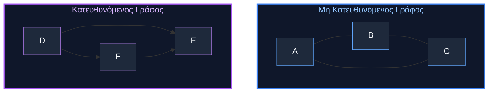
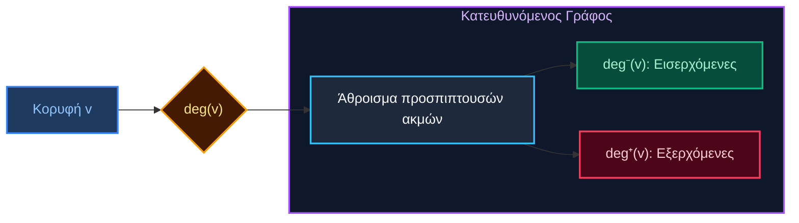
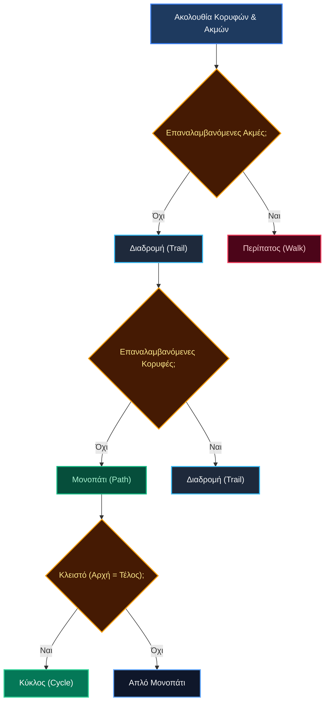
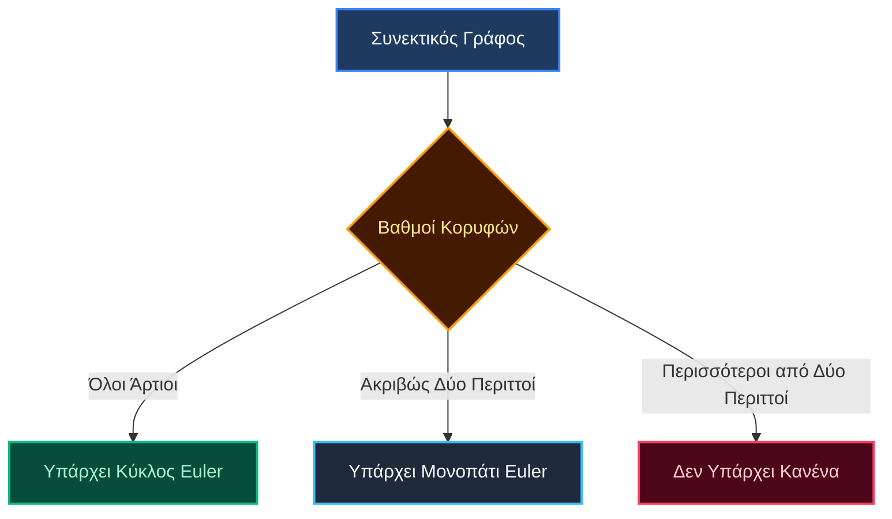
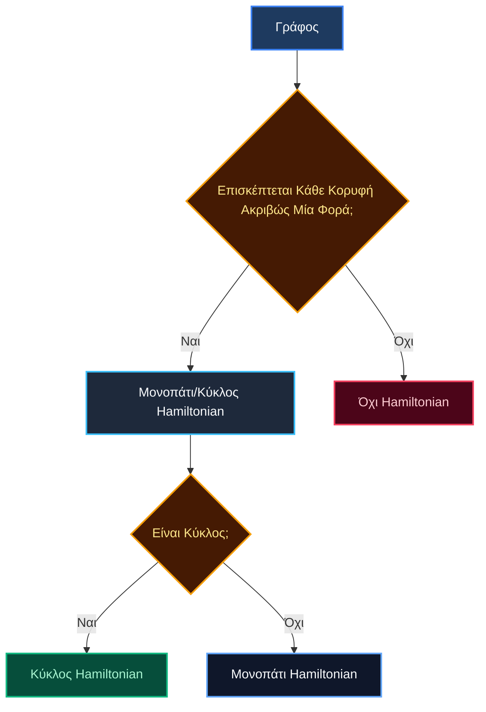
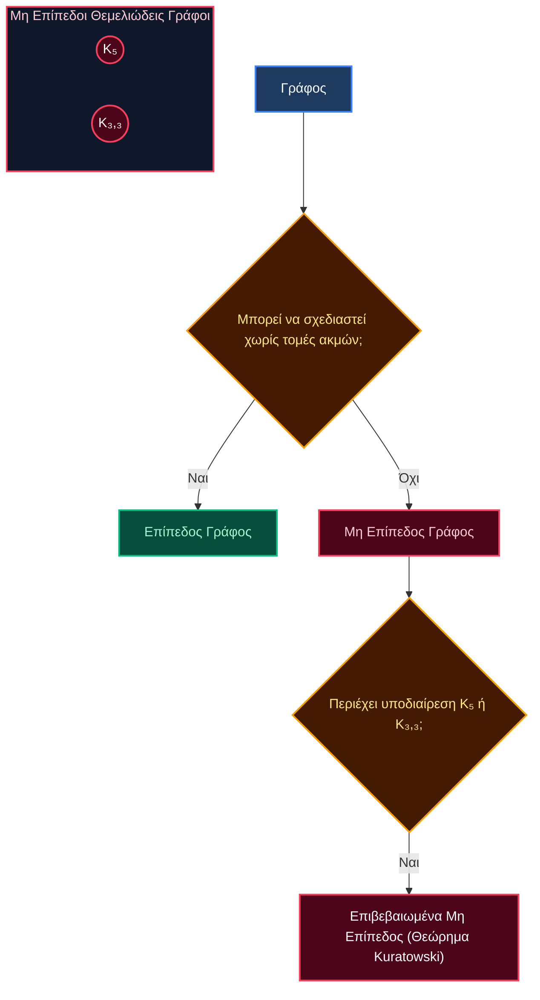
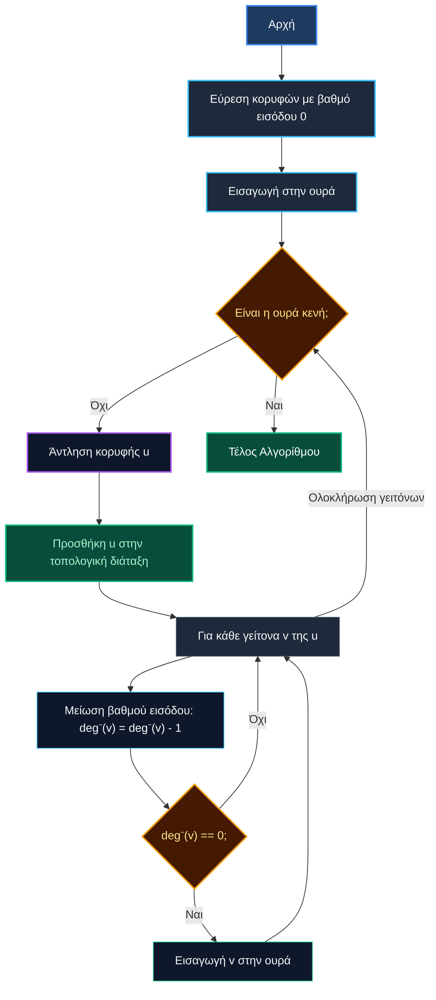

# Θεωρία Γράφων: Πλήρεις Σημειώσεις Μελέτης

## 1. Θεμελιώδεις Έννοιες των Γράφων

### Ορισμός του Γράφου
Ένας γράφος `G` είναι ένα ζεύγος `(V, E)` όπου:
- `V` είναι ένα σύνολο **κορυφών** (ή κόμβων).
- `E` είναι ένα σύνολο **ακμών** που συνδέουν ζεύγη κορυφών.

### Τύποι Γράφων

#### Μη Κατευθυνόμενοι Γράφοι
Οι ακμές είναι μη διατεταγμένα ζεύγη κορυφών `{u, v}`. Η ακμή `(u, v)` είναι πανομοιότυπη με την `(v, u)`. Χρησιμοποιούνται για τη μοντελοποίηση συμμετρικών σχέσεων.

#### Κατευθυνόμενοι Γράφοι (Διγράφους)
Οι ακμές είναι διατεταγμένα ζεύγη κορυφών `(u, v)`, αναπαριστώντας μια μονόδρομη σύνδεση από το `u` (την αρχή) στο `v` (το τέλος).

## 2. Ορολογία Γράφων

### Γειτνίαση, Γειτονιά και Βαθμός
- **Γειτονικές Κορυφές**: Δύο κορυφές είναι **γειτονικές** αν συνδέονται με μια ακμή.
- **Γειτονιά `N(v)`**: Το σύνολο όλων των κορυφών που είναι γειτονικές με μια κορυφή `v`.
- **Βαθμός `deg(v)`**: Το πλήθος των ακμών που προσπίπτουν σε μια κορυφή `v`. Σε έναν διγράφο, διακρίνουμε:
  - **Βαθμός εισόδου `deg⁻(v)`**: Πλήθος εισερχόμενων ακμών.
  - **Βαθμός εξόδου `deg⁺(v)`**: Πλήθος εξερχόμενων ακμών.
  - `deg(v) = deg⁻(v) + deg⁺(v)`

### Θεώρημα Χειραψιών (Handshaking Theorem)
Για οποιονδήποτε μη κατευθυνόμενο γράφο, το άθροισμα των βαθμών όλων των κορυφών ισούται με το διπλάσιο του αριθμού των ακμών.
$$ \sum_{v \in V} \deg(v) = 2|E| $$
Αυτό συνεπάγεται ότι το πλήθος των κορυφών με περιττό βαθμό πρέπει να είναι άρτιο.

## 3. Μονοπάτια, Διαδρομές και Περίπατοι (Paths, Trails, Walks)

- **Περίπατος (Walk)**: Μια ακολουθία κορυφών και ακμών `v₀, e₁, v₁, e₂, ..., eₖ, vₖ` όπου κάθε ακμή `eᵢ` συνδέει τις `vᵢ₋₁` και `vᵢ`. Ακμές και κορυφές μπορούν να επαναλαμβάνονται.
- **Διαδρομή (Trail)**: Ένας περίπατος στον οποίο καμία ακμή δεν επαναλαμβάνεται.
- **Μονοπάτι (Path)**: Μια διαδρομή στην οποία καμία κορυφή δεν επαναλαμβάνεται (εκτός ενδεχομένως από την αρχική και την τελική κορυφή).

## 4. Κύκλοι και Περιφέρειες (Cycles and Circuits)

- **Περιφέρεια (Circuit)**: Μια κλειστή διαδρομή (ξεκινά και τελειώνει στην ίδια κορυφή) στην οποία καμία ακμή δεν επαναλαμβάνεται.
- **Κύκλος (Cycle)**: Μια περιφέρεια στην οποία καμία ενδιάμεση κορυφή δεν επαναλαμβάνεται. Είναι ένα μονοπάτι που ξεκινά και τελειώνει στην ίδια κορυφή.

## 5. Μονοπάτια και Κύκλοι Euler

### Ορισμοί
- **Διαδρομή/Μονοπάτι Euler**: Μια διαδρομή που διέρχεται από κάθε ακμή του γράφου ακριβώς μία φορά.
- **Περιφέρεια/Κύκλος Euler**: Μια διαδρομή Euler που είναι κλειστή (ξεκινά και τελειώνει στην ίδια κορυφή).

### Θεώρημα Euler
Για έναν συνεκτικό, μη κατευθυνόμενο γράφο:
- Ένας **κύκλος Euler** υπάρχει αν και μόνο αν κάθε κορυφή έχει **άρτιο βαθμό**.
- Ένα **μονοπάτι Euler** υπάρχει αν και μόνο αν υπάρχουν **ακριβώς δύο κορυφές περιττού βαθμού**. Αυτές οι δύο κορυφές θα είναι τα σημεία αρχής και τέλους του μονοπατιού.

Το περίφημο **Πρόβλημα των Γεφυρών του Κένιγκσμπεργκ (Königsberg)** λύθηκε από τον Euler χρησιμοποιώντας αυτό το θεώρημα, σηματοδοτώντας τη γέννηση της θεωρίας γράφων. Η διάταξη της πόλης είχε τέσσερις περιοχές ξηράς που συνδέονταν με επτά γέφυρες, που μεταφράστηκαν σε έναν γράφο με τέσσερις κορυφές περιττού βαθμού (3, 3, 3, 5), επομένως δεν είχε ούτε κύκλο ούτε μονοπάτι Euler.

## 6. Μονοπάτια και Κύκλοι Hamiltonian

### Ορισμοί
- **Μονοπάτι Hamiltonian**: Ένα μονοπάτι που επισκέπτεται κάθε κορυφή του γράφου ακριβώς μία φορά.
- **Κύκλος Hamiltonian**: Ένα μονοπάτι Hamiltonian που είναι κύκλος (ξεκινά και τελειώνει στην ίδια κορυφή, σχηματίζοντας έναν βρόχο που διέρχεται από όλες τις κορυφές).

### Ιδιότητες
- Αντίθετα με τα μονοπάτια Euler, δεν υπάρχει απλή ικανή και αναγκαία συνθήκη για την ύπαρξη μονοπατιών/κύκλων Hamiltonian.
- Η εύρεση ενός κύκλου Hamiltonian είναι ένα **NP-πλήρες πρόβλημα**, που σημαίνει ότι είναι υπολογιστικά δύσκολο να επιλυθεί για μεγάλους γράφους.
- **Θεώρημα Dirac (Ικανή Συνθήκη)**: Αν ένας γράφος `G` με `n ≥ 3` κορυφές έχει ελάχιστο βαθμό `δ(G) ≥ n/2`, τότε ο `G` έχει κύκλο Hamiltonian.

## 7. Επίπεδοι Γράφοι (Planar Graphs)

### Ορισμός
Ένας γράφος είναι **επίπεδος** αν μπορεί να σχεδιαστεί σε ένα επίπεδο χωρίς να τέμνονται οι ακμές του. Μια τέτοια σχεδίαση ονομάζεται **επίπεδη αναπαράσταση**.

### Τύπος του Euler για Επίπεδους Γράφους
Για οποιονδήποτε συνεκτικό επίπεδο γράφο με `v` κορυφές, `e` ακμές και `f` έδρες/περιοχές (περιοχές που οριοθετούνται από ακμές, συμπεριλαμβανομένης της εξωτερικής μη φραγμένης περιοχής):
$$ v - e + f = 2 $$

### Θεώρημα Kuratowski
Ένας γράφος είναι μη επίπεδος αν και μόνο αν περιέχει έναν υπογράφο που είναι **υποδιαίρεση** του `K₅` (του πλήρους γράφου με 5 κορυφές) ή του `K₃,₃` (του πλήρους διμερούς γράφου με δύο σύνολα των 3 κορυφών).

## 8. Ισομορφισμός Γράφων

### Ορισμός
Δύο γράφοι `G₁ = (V₁, E₁)` και `G₂ = (V₂, E₂)` είναι **ισόμορφοι** αν υπάρχει μια αμφιμονοσήμαντη αντιστοίχιση (ένα προς ένα και επί) `f: V₁ → V₂` τέτοια ώστε οποιεσδήποτε δύο κορυφές `u` και `v` στο `V₁` να είναι γειτονικές αν και μόνο αν οι `f(u)` και `f(v)` είναι γειτονικές στο `G₂`.

Με απλά λόγια, δύο γράφοι είναι ισόμορφοι αν είναι δομικά πανομοιότυποι, ακόμη και αν σχεδιάζονται διαφορετικά.

### Αναλλοίωτα (Invariants)
Ιδιότητες που πρέπει να είναι ίδιες σε ισόμορφους γράφους:
- Ίδιος αριθμός κορυφών.
- Ίδιος αριθμός ακμών.
- Ίδια ακολουθία βαθμών (η λίστα των βαθμών όλων των κορυφών).

## 9. Τοπολογική Ταξινόμηση (Topological Sort)

### Ορισμός
Μια **τοπολογική ταξινόμηση** ή **τοπολογική διάταξη** ενός κατευθυνόμενου ακυκλικού γράφου (DAG - Directed Acyclic Graph) είναι μια γραμμική διάταξη των κορυφών του τέτοια ώστε για κάθε κατευθυνόμενη ακμή από την κορυφή `u` στην κορυφή `v`, η `u` να προηγείται της `v` στη διάταξη.

### Αλγόριθμος (Αλγόριθμος του Kahn)
1. Υπολογίστε τον βαθμό εισόδου για κάθε κορυφή.
2. Αρχικοποιήστε μια ουρά με όλες τις κορυφές που έχουν βαθμό εισόδου 0.
3. Όσο η ουρά δεν είναι κενή:
   a. Αφαιρέστε μια κορυφή `u` από την ουρά. Προσθέστε την `u` στην τοπολογική διάταξη.
   b. Για κάθε γείτονα `v` της `u`:
      i. Μειώστε τον βαθμό εισόδου της `v`.
      ii. Αν ο βαθμός εισόδου της `v` γίνει 0, εισάγετε την `v` στην ουρά.
4. Αν η τοπολογική διάταξη περιέχει όλες τις κορυφές, η ταξινόμηση είναι επιτυχής. Διαφορετικά, ο γράφος περιέχει κύκλο.

