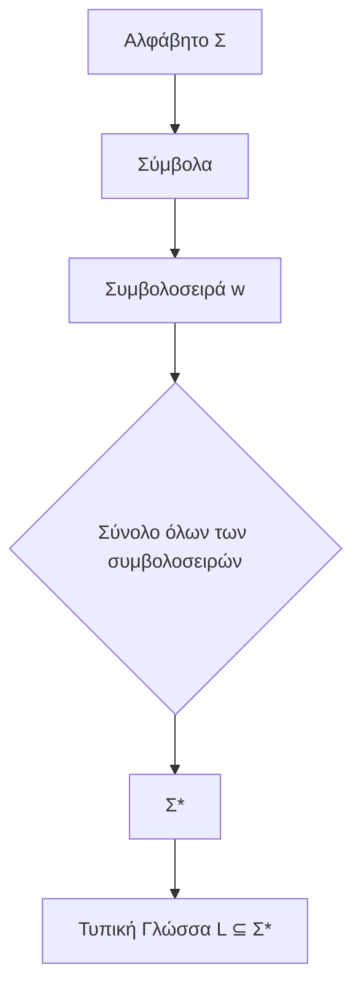
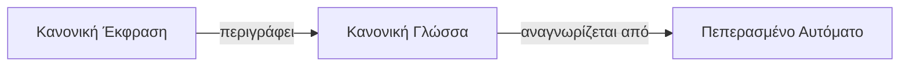
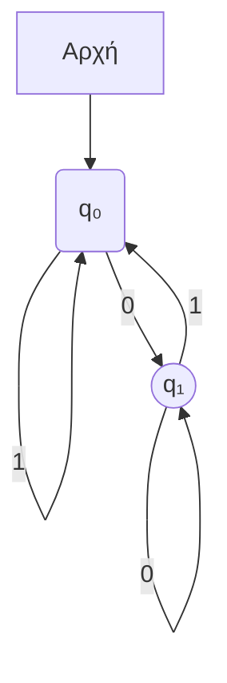
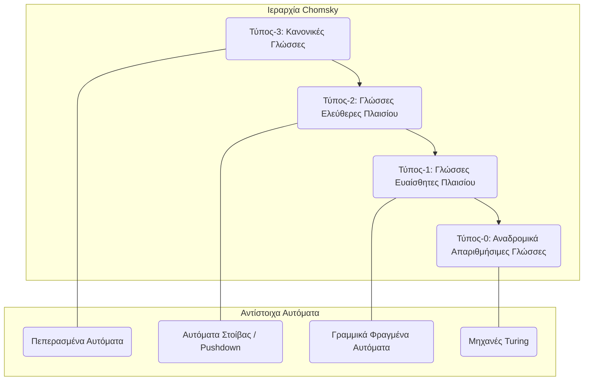

# Θεωρία Αυτομάτων και Τυπικές Γλώσσες: Πλήρεις Σημειώσεις Μελέτης

## 1. Τυπικές Γλώσσες

### Αλφάβητα, Συμβολοσειρές και Γλώσσες
- **Αλφάβητο (Σ)**: Ένα πεπερασμένο, μη κενό σύνολο συμβόλων. Για παράδειγμα, το `Σ = {0, 1}` είναι το δυαδικό αλφάβητο.
- **Συμβολοσειρά (ή Λέξη)**: Μια πεπερασμένη ακολουθία συμβόλων από ένα αλφάβητο. Το `ε` δηλώνει την **κενή συμβολοσειρά**, η οποία έχει μήκος 0.
- **Σ***: Το σύνολο όλων των πιθανών συμβολοσειρών που μπορούν να σχηματιστούν από το αλφάβητο `Σ`, συμπεριλαμβανομένης της κενής συμβολοσειράς.
- **Τυπική Γλώσσα (L)**: Οποιοδήποτε υποσύνολο του `Σ*`. Είναι ένα σύνολο συμβολοσειρών επιλεγμένων από το `Σ*`.

## 2. Κανονικές Εκφράσεις (Regex)

### Ορισμός
Μια **κανονική έκφραση** είναι μια ακολουθία χαρακτήρων που καθορίζει ένα μοτίβο αναζήτησης. Είναι ένα ισχυρό εργαλείο για την περιγραφή και το ταίριασμα συμβολοσειρών σε μια τυπική γλώσσα.

### Βασικοί Τελεστές
Έστω `R` και `S` κανονικές εκφράσεις. Οι θεμελιώδεις πράξεις είναι:
- **Παράθεση / Συνένωση (`RS`)**: Μια συμβολοσειρά που ταιριάζει με το `R` ακολουθούμενη από μια συμβολοσειρά που ταιριάζει με το `S`.
- **Ένωση / Εναλλαγή (`R | S` ή `R + S`)**: Ταιριάζει είτε με μια συμβολοσειρά που ταιριάζει με το `R` είτε με μια συμβολοσειρά που ταιριάζει με το `S`.
- **Αστέρι του Kleene (`R*`)**: Ταιριάζει με μηδέν ή περισσότερες εμφανίσεις συμβολοσειρών που ταιριάζουν με το `R`. Αυτό περιλαμβάνει πάντα την κενή συμβολοσειρά `ε`.
- **Συν του Kleene (`R+`)**: Ταιριάζει με μία ή περισσότερες εμφανίσεις συμβολοσειρών που ταιριάζουν με το `R`. Το `R+` είναι ισοδύναμο με το `RR*`.

### Προτεραιότητα Τελεστών
1. **Αστέρι/Συν του Kleene** (`*`, `+`)
2. **Παράθεση (Συνένωση)**
3. **Ένωση** (`|`)
Οι παρενθέσεις `()` μπορούν να χρησιμοποιηθούν για την αλλαγή της προκαθορισμένης προτεραιότητας.

### Παραδείγματα
- `1(0|1)*0`: Δυαδικές συμβολοσειρές που ξεκινούν με `1` και τελειώνουν με `0`.
- `(ha)+`: Περιγράφει τη γλώσσα `{ha, haha, hahaha, ...}`.
- `b(a|i|oa)rd`: Περιγράφει το σύνολο συμβολοσειρών `{bard, bird, board}`.

## 3. Κανονικές Γλώσσες

Μια γλώσσα ονομάζεται **κανονική γλώσσα** αν υπάρχει μια κανονική έκφραση που την περιγράφει. Οι κανονικές γλώσσες είναι η απλούστερη κλάση τυπικών γλωσσών και μπορούν να αναγνωριστούν από πεπερασμένα αυτόματα.

## 4. Πεπερασμένα Αυτόματα (FA)

### Έννοια
Ένα **πεπερασμένο αυτόματο** (ή μηχανή πεπερασμένων καταστάσεων) είναι ένα αφηρημένο υπολογιστικό μοντέλο. Είναι μια μηχανή που έχει έναν πεπερασμένο αριθμό καταστάσεων και μεταβάσεων μεταξύ αυτών των καταστάσεων με βάση μια συμβολοσειρά εισόδου. Είτε **αποδέχεται** είτε **απορρίπτει** την είσοδο.

### Ντετερμινιστικά Πεπερασμένα Αυτόματα (DFA)

Ένα DFA είναι μια 5-άδα `M = (Q, Σ, δ, q₀, F)` όπου:
- `Q`: Ένα πεπερασμένο σύνολο **καταστάσεων**.
- `Σ`: Ένα πεπερασμένο σύνολο συμβόλων εισόδου (το **αλφάβητο**).
- `δ`: Η **συνάρτηση μετάβασης**, `δ: Q × Σ → Q`. Για μια δεδομένη κατάσταση και σύμβολο, επιστρέφει μία μοναδική επόμενη κατάσταση.
- `q₀`: Η **αρχική κατάσταση** (`q₀ ∈ Q`).
- `F`: Ένα σύνολο **καταστάσεων αποδοχής (ή τελικών καταστάσεων)** (`F ⊆ Q`).

### Πώς Λειτουργεί ένα DFA
1. Η μηχανή ξεκινά στην αρχική κατάσταση `q₀`.
2. Διαβάζει τη συμβολοσειρά εισόδου ένα σύμβολο τη φορά, από αριστερά προς τα δεξιά.
3. Για κάθε σύμβολο, μεταβαίνει σε μια νέα κατάσταση χρησιμοποιώντας τη συνάρτηση μετάβασης `δ`.
4. Αφού διαβαστεί και το τελευταίο σύμβολο, αν η μηχανή βρίσκεται σε μια κατάσταση αποδοχής (`F`), η συμβολοσειρά **γίνεται αποδεκτή**. Διαφορετικά, **απορρίπτεται**.

Μια βασική ιδιότητα ενός DFA είναι ότι για οποιαδήποτε δεδομένη κατάσταση και σύμβολο εισόδου, υπάρχει **ακριβώς μία** κατάσταση στην οποία μπορεί να μεταβεί.

### Παράδειγμα DFA
Ας σχεδιάσουμε ένα DFA που αποδέχεται όλες τις δυαδικές συμβολοσειρές που τελειώνουν σε `0`.
- `Q = {q₀, q₁}`
- `Σ = {0, 1}`
- `q₀` είναι η αρχική κατάσταση.
- `F = {q₁}`
- Η `δ` ορίζεται ως:
  - `δ(q₀, 0) = q₁`
  - `δ(q₀, 1) = q₀`
  - `δ(q₁, 0) = q₁`
  - `δ(q₁, 1) = q₀`

Αυτό το DFA αποδέχεται συμβολοσειρές όπως `0`, `10`, `110`, `1010` αλλά απορρίπτει συμβολοσειρές όπως `1`, `101`, `111`.

## 5. Η Ιεραρχία Chomsky

Οι τυπικές γλώσσες ταξινομούνται σε μια ιεραρχία αυξανόμενης πολυπλοκότητας, γνωστή ως Ιεραρχία Chomsky. Οι κανονικές γλώσσες, αναγνωρίσιμες από πεπερασμένα αυτόματα, αποτελούν το απλούστερο και πιο θεμελιώδες επίπεδο αυτής της ιεραρχίας.

