# Mindmap: Electromagnetics and Telecommunications Architecture

## Conceptual Structure Overview

This taxonomy maps vector calculus operations, electrostatics, magnetostatics, electrodynamics, and wave propagation covered in Fundamentals of Electromagnetics.

```mermaid
graph TD
    Root["Fundamentals of Electromagnetics"] --> Calc["Vector Calculus"]
    Root --> StaticsE["Electrostatics"]
    Root --> StaticsM["Magnetostatics"]
    Root --> Dynamic["Electrodynamics"]
    Root --> Waves["EM Waves & Lines"]

    Calc --> Grad["Gradient, Divergence, Curl"]
    Calc --> Thms["Divergence & Stokes Theorems"]

    StaticsE --> Coulomb["Coulomb's Law & E-Field"]
    StaticsE --> GaussE["Gauss's Law (div D = rho)"]
    StaticsE --> Pot["Electric Potential & Laplace Eq"]
    StaticsE --> Cap["Capacitors & Dielectrics"]

    StaticsM --> Biot["Biot-Savart Law"]
    StaticsM --> Ampere["Ampere's Circuital Law"]
    StaticsM --> GaussM["div B = 0 (No Monopoles)"]
    StaticsM --> Force["Lorentz Force & Induction"]

    Dynamic --> Faraday["Faraday's Induction Law"]
    Dynamic --> Displace["Maxwell Displacement Current"]
    Dynamic --> FullMaxwell["Full Maxwell Equations"]

    Waves --> WaveEq["Helmholtz Wave Equation"]
    Waves --> TEM["Uniform Plane Waves (TEM)"]
    Waves --> Poynting["Poynting Vector & Power Flow"]
    Waves --> Medium["Lossless vs Lossy Media (Skin Depth)"]
    Waves --> Bound["Reflection, Refraction & Transmission Lines"]
```

## Physical Interdependencies
1. **Electrostatics & Magnetostatics** $\to$ Stationary limits ($\partial/\partial t = 0$) of Maxwell's equations.
2. **Displacement Current** $\to$ Couples time-varying electric fields to magnetic fields, predicting electromagnetic wave propagation.
3. **Poynting Vector** $\to$ Governs power transfer in antennas, optical fibers, and RF transmission waveguides.

