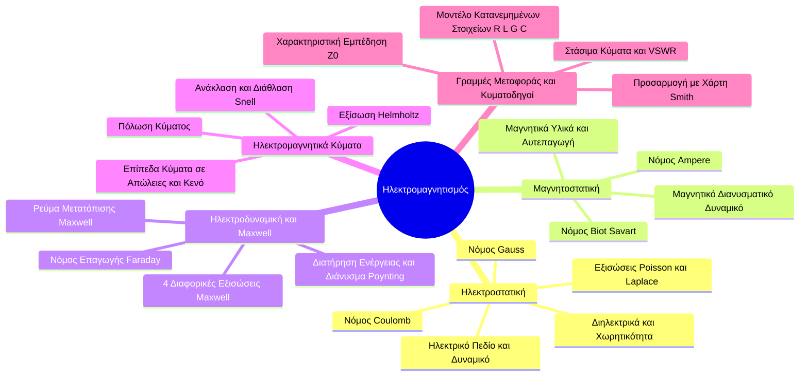

# Εννοιολογικός Χάρτης: Ηλεκτρομαγνητισμός και Γραμμές Μεταφοράς

```mermaid
mindmap
  root((Ηλεκτρομαγνητισμός))
    Ηλεκτροστατική
      Νόμος Coulomb
      Ηλεκτρικό Πεδίο και Δυναμικό
      Νόμος Gauss
      Εξισώσεις Poisson και Laplace
      Διηλεκτρικά και Χωρητικότητα
    Μαγνητοστατική
      Νόμος Biot Savart
      Νόμος Ampere
      Μαγνητικό Διανυσματικό Δυναμικό
      Μαγνητικά Υλικά και Αυτεπαγωγή
    Ηλεκτροδυναμική και Maxwell
      Νόμος Επαγωγής Faraday
      Ρεύμα Μετατόπισης Maxwell
      4 Διαφορικές Εξισώσεις Maxwell
      Διατήρηση Ενέργειας και Διάνυσμα Poynting
    Ηλεκτρομαγνητικά Κύματα
      Εξίσωση Helmholtz
      Επίπεδα Κύματα σε Απώλειες και Κενό
      Πόλωση Κύματος
      Ανάκλαση και Διάθλαση Snell
    Γραμμές Μεταφοράς και Κυματοδηγοί
      Μοντέλο Κατανεμημένων Στοιχείων R L G C
      Χαρακτηριστική Εμπέδηση Z0
      Στάσιμα Κύματα και VSWR
      Προσαρμογή με Χάρτη Smith
```

