# Mindmap: Computer Networking and Protocols Architecture

## Conceptual Structure Overview

This taxonomy maps the layered network architectures, addressing schemes, transport mechanisms, and packet capture tools covered in Networking.

```mermaid
graph TD
    Root["Computer Networking"] --> Models["Architectural Models"]
    Root --> Access["Link Layer & Addressing"]
    Root --> Network["Internet & IP Layer"]
    Root --> Transport["Transport Protocols"]
    Root --> App["Application Services"]
    Root --> Analysis["Packet Analysis Tools"]

    Models --> OSI["OSI 7-Layer Model"]
    Models --> TCPIP["TCP/IP 4-Layer Suite"]
    Models --> Encaps["Encapsulation & Headers"]

    Access --> Eth["Ethernet (IEEE 802.3)"]
    Access --> MAC["MAC Addresses & Framing"]
    Access --> ARP["ARP Protocols & Cache"]
    Access --> Switch["Switches & VLANs"]

    Network --> IPv4["IPv4 & IPv6 Datagrams"]
    Network --> CIDR["CIDR Subnetting & Masks"]
    Network --> VLSM["VLSM Variable Allocation"]
    Network --> Routing["Routing & Forwarding Tables"]
    Network --> Control["ICMP & IGMP"]

    Transport --> TCP["TCP Connection Oriented"]
    TCP --> Handshake["3-Way Handshake & Teardown"]
    TCP --> Sliding["Sliding Window Flow Control"]
    TCP --> Congest["Slow Start & Congestion Avoidance"]
    Transport --> UDP["UDP Datagrams"]

    App --> DNS["DNS (A, AAAA, MX, PTR)"]
    App --> HTTP["HTTP/1.1 & HTTPS"]
    App --> Sockets["BSD Sockets (Client/Server)"]

    Analysis --> Tcpdump["tcpdump & CLI Flags"]
    Analysis --> BPF["Berkeley Packet Filters"]
    Analysis --> Tshark["tshark & Wireshark PCAPs"]
```

## Cross-Layer Interactions
1. **Application Layer** relies on **Transport Layer (TCP/UDP)** for port multiplexing and session reliability.
2. **Transport Layer** depends on **Internet Layer (IP)** for multi-hop packet routing and datagram delivery.
3. **Internet Layer** maps logical IP addresses to physical link addresses using **ARP** at the **Network Access Layer**.

