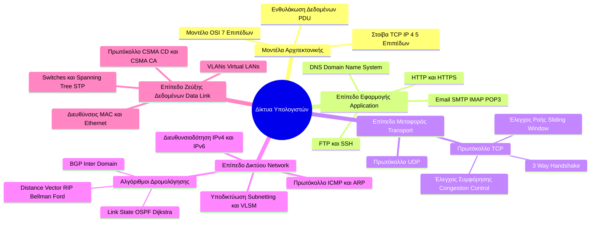

# Εννοιολογικός Χάρτης: Δίκτυα Υπολογιστών

```mermaid
mindmap
  root((Δίκτυα Υπολογιστών))
    Μοντέλα Αρχιτεκτονικής
      Μοντέλο OSI 7 Επιπέδων
      Στοίβα TCP IP 4 5 Επιπέδων
      Ενθυλάκωση Δεδομένων PDU
    Επίπεδο Εφαρμογής Application
      HTTP και HTTPS
      DNS Domain Name System
      FTP και SSH
      Email SMTP IMAP POP3
    Επίπεδο Μεταφοράς Transport
      Πρωτόκολλο TCP
        3 Way Handshake
        Έλεγχος Ροής Sliding Window
        Έλεγχος Συμφόρησης Congestion Control
      Πρωτόκολλο UDP
    Επίπεδο Δικτύου Network
      Διευθυνσιοδότηση IPv4 και IPv6
      Υποδικτύωση Subnetting και VLSM
      Πρωτόκολλο ICMP και ARP
      Αλγόριθμοι Δρομολόγησης
        Link State OSPF Dijkstra
        Distance Vector RIP Bellman Ford
        BGP Inter Domain
    Επίπεδο Ζεύξης Δεδομένων Data Link
      Διευθύνσεις MAC και Ethernet
      Πρωτόκολλο CSMA CD και CSMA CA
      Switches και Spanning Tree STP
      VLANs Virtual LANs
```

