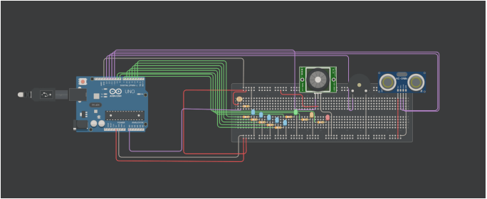
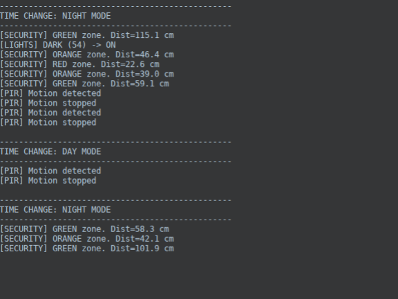

# Exercise 1 `Arduino`

- name: Nikolaos Panagopoulos
- am: 3323
- mail: int03323@uoi.gr




```cpp
/*
©Panagopoulos Nikolaos, 2025
All rights reserved.

Smart City System - Arduino Uno R3
*/

// ========== PIN DEFINITIONS ==========
const int LED1_PIN = 2;
const int LED2_PIN = 3;
const int LED3_PIN = 4;
const int LED4_PIN = 5;
const int LED5_PIN = 6;

const int RED_LED = 7;
const int ORANGE_LED = 8;
const int GREEN_LED = 9;

const int PIR_PIN = 10;
const int ECHO_PIN = 11;
const int TRIG_PIN = 12;
const int PIEZO_PIN = 13;
const int PHOTORESISTOR_PIN = A0;

// ========== CONSTANTS ==========
const int LIGHT_ON_THRESHOLD  = 930;
const int LIGHT_OFF_THRESHOLD = 960;

const unsigned long LIGHT_SAMPLE_MS = 2000;
const unsigned long FADE_DELAY_MS   = 5000;
const int FADE_STEP_DELAY_MS        = 10;

const int HC_MIN_CM = 2;
const int HC_MAX_CM = 400;
const unsigned long HC_MIN_PERIOD_MS = 60;
const unsigned long HC_ECHO_TIMEOUT_US = 30000UL;

const unsigned long TELEMETRY_MS = 500;

// Security sound only (NOT PIR sound)
const unsigned int SEC_ON_MS_CLOSE = 90;
const unsigned int SEC_OFF_MS_CLOSE = 90;

const unsigned int SEC_ON_MS_MED = 90;
const unsigned int SEC_OFF_MS_MED = 260;

const unsigned int SEC_ON_MS_FAR = 70;
const unsigned int SEC_OFF_MS_FAR = 900;

// ========== GLOBAL STATE ==========
unsigned long systemStartTime = 0;

unsigned long lastMotionTime = 0;
unsigned long lastLightSampleTime = 0;
unsigned long lastTelemetryTime = 0;

bool isNightTime = false;
bool streetLightsOn = false;
bool selfTestPassed = false;

// PIR state tracking (for print-on-change only)
bool pirWasActive = false;

// HC state
float lastUltrasonicCm = -1.0f;
bool ultrasonicValid = false;
int currentSecurityState = -1;

// Beeper state (SECURITY ONLY)
struct Beeper {
  bool on = false;
  unsigned long nextMs = 0;
  int freq = 0;
  unsigned int onMs = 0;
  unsigned int offMs = 0;
  bool active = false;
} beeper;

// ========== FORWARD DECLARATIONS ==========
void printHardwareConfig();
void detectNightTime();

void handleLightingSystem();
void handleSecuritySystem();
void handleSoundSystem();

void turnStreetLightsOn();
void turnStreetLightsOff(bool quiet);
void fadeStreetLightsOff();

void runSelfTest();
void waitForUserConfirmation();

enum USReadResult { US_TOO_SOON = 0, US_OK = 1, US_TIMEOUT = 2 };
USReadResult readUltrasonicCm(float &outCm);

void beeperStop();
void beeperSet(int freq, unsigned int onMs, unsigned int offMs);
void beeperUpdate();

// ========== SETUP ==========
void setup() {
  Serial.begin(9600);
  delay(500);

  pinMode(LED1_PIN, OUTPUT);
  pinMode(LED2_PIN, OUTPUT);
  pinMode(LED3_PIN, OUTPUT);
  pinMode(LED4_PIN, OUTPUT);
  pinMode(LED5_PIN, OUTPUT);

  pinMode(RED_LED, OUTPUT);
  pinMode(ORANGE_LED, OUTPUT);
  pinMode(GREEN_LED, OUTPUT);

  pinMode(PIR_PIN, INPUT);
  pinMode(TRIG_PIN, OUTPUT);
  pinMode(ECHO_PIN, INPUT);
  pinMode(PIEZO_PIN, OUTPUT);

  turnStreetLightsOff(true);
  digitalWrite(RED_LED, LOW);
  digitalWrite(ORANGE_LED, LOW);
  digitalWrite(GREEN_LED, LOW);
  noTone(PIEZO_PIN);

  printHardwareConfig();
  runSelfTest();

  systemStartTime = millis();
  lastLightSampleTime = millis();
  lastTelemetryTime = millis();
}

// ========== MAIN LOOP ==========
void loop() {
  if (!selfTestPassed) {
    static unsigned long lastBlink = 0;
    if (millis() - lastBlink > 500) {
      digitalWrite(RED_LED, digitalRead(RED_LED) ? LOW : HIGH);
      lastBlink = millis();
    }
    delay(50);
    return;
  }

  detectNightTime();

  handleLightingSystem();
  handleSecuritySystem();
  handleSoundSystem();

  delay(20);
}

// ========== HARDWARE CONFIG ==========
void printHardwareConfig() {
  Serial.println(F("=========================================="));
  Serial.println(F("SMART CITY - PIN CONFIG"));
  Serial.println(F("=========================================="));
  Serial.println(F("Street LEDs: D2..D6"));
  Serial.println(F("Alarm LEDs:  D7=RED, D8=ORANGE, D9=GREEN"));
  Serial.println(F("PIR:         D10"));
  Serial.println(F("HC-SR04:     ECHO=D11, TRIG=D12"));
  Serial.println(F("Piezo:       D13"));
  Serial.println(F("LDR:         A0"));
  Serial.println(F("==========================================\n"));
  delay(500);
}

// ========== SELF-TEST ==========
void runSelfTest() {
  Serial.println(F("\n+----------------------------------------+"));
  Serial.println(F("| SMART CITY SELF-TEST SUITE             |"));
  Serial.println(F("+----------------------------------------+\n"));

  // TEST 1: Alarm LEDs
  Serial.println(F("[TEST 1] Alarm LEDs"));
  digitalWrite(RED_LED, HIGH); delay(200); digitalWrite(RED_LED, LOW);
  digitalWrite(ORANGE_LED, HIGH); delay(200); digitalWrite(ORANGE_LED, LOW);
  digitalWrite(GREEN_LED, HIGH); delay(200); digitalWrite(GREEN_LED, LOW);
  Serial.println(F("OK"));

  // TEST 2: Street LEDs (individual)
  Serial.println(F("[TEST 2] Street LEDs"));
  const int leds[] = {LED1_PIN, LED2_PIN, LED3_PIN, LED4_PIN, LED5_PIN};
  for (int i = 0; i < 5; i++) {
    digitalWrite(leds[i], HIGH); delay(150);
    digitalWrite(leds[i], LOW);  delay(80);
  }
  Serial.println(F("OK"));

  // TEST 3: Piezo - SECURITY signature only (no PIR sound)
  Serial.println(F("[TEST 3] Piezo signature demo"));
  Serial.println(F("  A) Security CLOSE (high+fast)"));
  beeperSet(2200, 90, 90);
  unsigned long t0 = millis();
  while (millis() - t0 < 800) beeperUpdate();
  beeperStop();
  delay(300);

  Serial.println(F("  B) Security FAR (low+slow)"));
  beeperSet(420, 70, 900);
  t0 = millis();
  while (millis() - t0 < 1500) beeperUpdate();
  beeperStop();
  Serial.println(F("OK"));

  // TEST 4: Photoresistor basic sanity
  Serial.println(F("[TEST 4] Photoresistor"));
  int light = analogRead(PHOTORESISTOR_PIN);
  Serial.print(F("  Value=")); Serial.println(light);
  if (light <= 2 || light >= 1021) Serial.println(F("  WARNING: extreme value; check wiring/divider."));

  // TEST 5: Ultrasonic basic read (3 attempts, correct pacing)
  Serial.println(F("[TEST 5] HC-SR04"));
  bool gotUS = false;
  for (int i = 0; i < 3; i++) {
    float cm = -1;
    delay(100);
    USReadResult r = readUltrasonicCm(cm);
    if (r == US_OK) {
      Serial.print(F("  Distance=")); Serial.print(cm, 1); Serial.println(F(" cm"));
      gotUS = true;
      break;
    }
    Serial.println(F("  No echo (ok if no target / far / angle)."));
  }
  if (!gotUS) Serial.println(F("  NOTE: If you want to verify, place object ~20-100cm in front."));

  // TEST 6: PIR warm-up + motion verify
  Serial.println(F("[TEST 6] PIR warm-up (10s) then motion verify (10s)"));
  Serial.println(F("  Warm-up: keep still..."));
  unsigned long warm = millis();
  while (millis() - warm < 10000) {
    delay(50);
  }
  Serial.println(F("  Now wave hand (10s) ..."));
  bool pirSawHigh = false;
  unsigned long w = millis();
  while (millis() - w < 10000) {
    if (digitalRead(PIR_PIN) == HIGH) { pirSawHigh = true; break; }
    delay(50);
  }
  Serial.println(pirSawHigh ? F("  PIR motion detected: OK") : F("  PIR stayed LOW: WARNING (try again after full 60s warm-up)."));

  Serial.println(F("\nType 'Y' then ENTER to start..."));
  waitForUserConfirmation();
}

void waitForUserConfirmation() {
  while (true) {
    if (Serial.available()) {
      char c = Serial.read();
      if (c >= 'a' && c <= 'z') c = c - 32;
      if (c == 'Y' || c == 'F') {
        selfTestPassed = true;
        Serial.println(F("System Started.\n"));
        return;
      }
    }
    delay(50);
  }
}

// ========== NIGHT/DAY TIMER ==========
void detectNightTime() {
  unsigned long elapsed = millis() - systemStartTime;
  unsigned long cycle = elapsed % 60000UL;
  bool prev = isNightTime;
  isNightTime = (cycle < 30000UL);

  if (prev != isNightTime) {
    Serial.println(F("\n------------------------------------------------"));
    Serial.println(isNightTime ? F("TIME CHANGE: NIGHT MODE") : F("TIME CHANGE: DAY MODE"));
    Serial.println(F("------------------------------------------------"));
  }
}

// ========== STREET LIGHTING (LDR + PIR) ==========
void handleLightingSystem() {
  unsigned long now = millis();
  if (now - lastLightSampleTime < LIGHT_SAMPLE_MS) {
    // motion timeout still runs
    if (streetLightsOn && (now - lastMotionTime > FADE_DELAY_MS)) {
      int lightLevel = analogRead(PHOTORESISTOR_PIN);
      if (lightLevel > LIGHT_OFF_THRESHOLD) {
        Serial.println(F("[LIGHTS] No motion for 5s (bright) -> fading OFF"));
        fadeStreetLightsOff();
        streetLightsOn = false;
      } else {
        lastMotionTime = now;
      }
    }
    return;
  }
  lastLightSampleTime = now;

  int lightLevel = analogRead(PHOTORESISTOR_PIN);
  int pir = digitalRead(PIR_PIN);

  // Darkness override: lights ON
  if (lightLevel < LIGHT_ON_THRESHOLD) {
    if (!streetLightsOn) {
      Serial.print(F("[LIGHTS] DARK (")); Serial.print(lightLevel); Serial.println(F(") -> ON"));
      turnStreetLightsOn();
      streetLightsOn = true;
    }
    lastMotionTime = now; // prevent fade while dark
    
    // PIR state change print (even if dark)
    if (pir == HIGH && !pirWasActive) {
      Serial.println(F("[PIR] Motion detected"));
      pirWasActive = true;
    } else if (pir == LOW && pirWasActive) {
      Serial.println(F("[PIR] Motion stopped"));
      pirWasActive = false;
    }
    return;
  }

  // Bright: use PIR for energy saving
  if (pir == HIGH) {
    if (!streetLightsOn) {
      Serial.println(F("[LIGHTS] PIR motion (bright) -> ON"));
      turnStreetLightsOn();
      streetLightsOn = true;
    }
    lastMotionTime = now;
    
    // PIR state change print
    if (!pirWasActive) {
      Serial.println(F("[PIR] Motion detected"));
      pirWasActive = true;
    }
  } else {
    // PIR state change print (when motion stops)
    if (pirWasActive) {
      Serial.println(F("[PIR] Motion stopped"));
      pirWasActive = false;
    }
    
    if (streetLightsOn && (now - lastMotionTime > FADE_DELAY_MS)) {
      Serial.println(F("[LIGHTS] Bright + no motion -> fading OFF"));
      fadeStreetLightsOff();
      streetLightsOn = false;
    }
  }

  // Telemetry (low spam, state info only)
  if (now - lastTelemetryTime > TELEMETRY_MS) {
    Serial.print(F("[STATUS] Light: "));
    Serial.print(lightLevel);
    Serial.print(F(" | PIR: "));
    Serial.print(pir);
    Serial.print(F(" | StreetLights: "));
    Serial.print(streetLightsOn ? F("ON") : F("OFF"));
    Serial.print(F(" | Night: "));
    Serial.println(isNightTime ? F("YES") : F("NO"));
    lastTelemetryTime = now;
  }
}

// ========== SECURITY (ULTRASONIC, NIGHT ONLY) ==========
void handleSecuritySystem() {
  if (!isNightTime) {
    // Day: disable alarm indicators
    if (currentSecurityState != -1) {
      digitalWrite(RED_LED, LOW);
      digitalWrite(ORANGE_LED, LOW);
      digitalWrite(GREEN_LED, LOW);
      currentSecurityState = -1;
    }
    ultrasonicValid = false;
    lastUltrasonicCm = -1.0f;
    return;
  }

  float cm = -1.0f;
  USReadResult us = readUltrasonicCm(cm);

  if (us == US_OK) {
    lastUltrasonicCm = cm;
    ultrasonicValid = true;
  } else if (us == US_TIMEOUT) {
    ultrasonicValid = false;
  }

  if (!ultrasonicValid) {
    if (currentSecurityState != -1) {
      digitalWrite(RED_LED, LOW);
      digitalWrite(ORANGE_LED, LOW);
      digitalWrite(GREEN_LED, LOW);
      currentSecurityState = -1;
    }
    return;
  }

  // LEDs and state
  if (lastUltrasonicCm <= 25.0f) {
    if (currentSecurityState != 2) {
      Serial.print(F("[SECURITY] RED zone. Dist=")); Serial.print(lastUltrasonicCm, 1); Serial.println(F(" cm"));
      currentSecurityState = 2;
    }
    digitalWrite(RED_LED, HIGH);
    digitalWrite(ORANGE_LED, LOW);
    digitalWrite(GREEN_LED, LOW);
  } else if (lastUltrasonicCm <= 50.0f) {
    if (currentSecurityState != 1) {
      Serial.print(F("[SECURITY] ORANGE zone. Dist=")); Serial.print(lastUltrasonicCm, 1); Serial.println(F(" cm"));
      currentSecurityState = 1;
    }
    digitalWrite(RED_LED, LOW);
    digitalWrite(ORANGE_LED, HIGH);
    digitalWrite(GREEN_LED, LOW);
  } else {
    if (currentSecurityState != 0) {
      Serial.print(F("[SECURITY] GREEN zone. Dist=")); Serial.print(lastUltrasonicCm, 1); Serial.println(F(" cm"));
      currentSecurityState = 0;
    }
    digitalWrite(RED_LED, LOW);
    digitalWrite(ORANGE_LED, LOW);
    digitalWrite(GREEN_LED, HIGH);
  }
}

// ========== SOUND ROUTING (SECURITY ONLY, NO PIR SOUND) ==========
void handleSoundSystem() {
  // Only SECURITY sound (distance-based, night-only)
  bool securitySound = (isNightTime && ultrasonicValid);

  if (securitySound) {
    float d = lastUltrasonicCm;

    if (d <= 25.0f) {
      beeperSet(2200, SEC_ON_MS_CLOSE, SEC_OFF_MS_CLOSE);
    } else if (d <= 50.0f) {
      beeperSet(1100, SEC_ON_MS_MED, SEC_OFF_MS_MED);
    } else {
      // far: low freq + long silence
      beeperSet(420, SEC_ON_MS_FAR, SEC_OFF_MS_FAR);
    }

    beeperUpdate();
    return;
  }

  // No security sound = stop all beeping
  beeperStop();
}

// ========== BEEPER CORE ==========
void beeperStop() {
  if (beeper.active) {
    noTone(PIEZO_PIN);
    beeper.active = false;
    beeper.on = false;
  }
}

void beeperSet(int freq, unsigned int onMs, unsigned int offMs) {
  // avoid resetting schedule unless pattern actually changes
  if (beeper.active && beeper.freq == freq && beeper.onMs == onMs && beeper.offMs == offMs) return;

  beeper.freq = freq;
  beeper.onMs = onMs;
  beeper.offMs = offMs;
  beeper.active = true;
  beeper.on = false;
  beeper.nextMs = 0; // force immediate start
}

void beeperUpdate() {
  if (!beeper.active) return;

  unsigned long now = millis();
  if (beeper.nextMs != 0 && now < beeper.nextMs) return;

  if (beeper.on) {
    noTone(PIEZO_PIN);
    beeper.on = false;
    beeper.nextMs = now + beeper.offMs;
  } else {
    tone(PIEZO_PIN, beeper.freq);
    beeper.on = true;
    beeper.nextMs = now + beeper.onMs;
  }
}

// ========== STREET LIGHT ACTUATORS ==========
void turnStreetLightsOn() {
  digitalWrite(LED1_PIN, HIGH);
  analogWrite(LED2_PIN, 255);
  digitalWrite(LED3_PIN, HIGH);
  analogWrite(LED4_PIN, 255);
  analogWrite(LED5_PIN, 255);
}

void turnStreetLightsOff(bool quiet) {
  digitalWrite(LED1_PIN, LOW);
  analogWrite(LED2_PIN, 0);
  digitalWrite(LED3_PIN, LOW);
  analogWrite(LED4_PIN, 0);
  analogWrite(LED5_PIN, 0);

  if (!quiet) Serial.println(F("[LIGHTS] OFF"));
}

void fadeStreetLightsOff() {
  for (int i = 255; i >= 0; i--) {
    analogWrite(LED2_PIN, i);
    analogWrite(LED4_PIN, i);
    analogWrite(LED5_PIN, i);
    delay(FADE_STEP_DELAY_MS);
  }
  digitalWrite(LED1_PIN, LOW);
  digitalWrite(LED3_PIN, LOW);
}

// ========== HC-SR04 READ ==========
USReadResult readUltrasonicCm(float &outCm) {
  static unsigned long lastPingMs = 0;

  if (millis() - lastPingMs < HC_MIN_PERIOD_MS) return US_TOO_SOON;
  lastPingMs = millis();

  digitalWrite(TRIG_PIN, LOW);
  delayMicroseconds(2);
  digitalWrite(TRIG_PIN, HIGH);
  delayMicroseconds(10);
  digitalWrite(TRIG_PIN, LOW);

  unsigned long duration = pulseIn(ECHO_PIN, HIGH, HC_ECHO_TIMEOUT_US);
  if (duration == 0) return US_TIMEOUT;

  outCm = (float)duration / 58.0f;
  return US_OK;
}
```


# Αυτοματισμός Έξυπνης Πόλης - Επεξήγηση Κώδικα

## Σκοπός Συστήματος
Προσαρμοστικός φωτισμός δρόμου (LDR + PIR) + σύστημα ασφαλείας μόνο κατά τη νύχτα (υπέρηχοι + piezo).

## Pins & Σταθερές
*   **LED Δρόμου:** `D2`–`D6` (LED1/3=digital, LED2/4/5=PWM)
*   **LED Συναγερμού:** `D7`–`D9` (ΚΟΚΚΙΝΟ, ΠΟΡΤΟΚΑΛΙ, ΠΡΑΣΙΝΟ)
*   **Αισθητήρες:** `D10`=PIR, `A0`=LDR, `D11`=ECHO, `D12`=TRIG, `D13`=PIEZO

| Παράμετρος | Τιμή | Περιγραφή |
| :--- | :--- | :--- |
| **Όρια LDR** | ON `<930`, OFF `>960` | Ζώνη υστέρησης `930`–`960`: καμία ρητή διατήρηση κατάστασης· μεταπίπτει στη λογική "φωτεινής λειτουργίας" αν δεν πληρούται το όριο |
| **Δειγματοληψία** | `2000ms` | Διάστημα λογικής ελέγχου φωτισμού |
| **Χρονικό Όριο Κίνησης** | `5000ms` | Μόνο σε φωτεινή λειτουργία· επαναφέρεται αν ανιχνευθεί κίνηση ή αν η επαναανάγνωση του LDR δείξει σκοτάδι μεταξύ των δειγμάτων |
| **Διάρκεια Fade** | `2.56s` | 256 βήματα × 10ms (μόνο PWM LEDs· τα digital pins γίνονται LOW μετά την ολοκλήρωση του fade) |
| **Τηλεμετρία** | `500ms` | Μόνο σε φωτεινή λειτουργία (καταστέλλεται σε σκοτεινή λειτουργία μέσω πρόωρης επιστροφής/early return) |
| **Υπέρηχοι** | `60ms` ελάχ. διάστημα | 30ms timeout, `cm = duration/58` |
| **Ημέρα/Νύχτα** | `60s` κύκλος | 30s ΝΥΧΤΑ, 30s ΗΜΕΡΑ (βάσει χρονοδιακόπτη, όχι LDR) |

**Μοτίβα Ήχου Ασφαλείας:**
*   **ΚΟΝΤΑ (≤25cm):** 2200Hz, 90ms ON / 90ms OFF
*   **ΜΕΣΑΙΑ (≤50cm):** 1100Hz, 90ms ON / 260ms OFF
*   **ΜΑΚΡΙΑ (>50cm):** 420Hz, 70ms ON / 900ms OFF

## Ακολουθία Αρχικοποίησης
1.  **`setup()`**: Serial 9600, ρύθμιση pins, όλοι οι ενεργοποιητές OFF.
2.  **`runSelfTest()`**:
  *   **[TEST 1]** Τα LED συναγερμού αναβοσβήνουν (200ms το καθένα).
  *   **[TEST 2]** Ακολουθία LED δρόμου (150ms on, 80ms off).
  *   **[TEST 3]** Piezo: Μοτίβο ΚΟΝΤΑ (2200Hz ~800ms) + Μοτίβο ΜΑΚΡΙΑ (420Hz ~1500ms).
  *   **[TEST 4]** Φωτοαντίσταση: ανάγνωση, προειδοποίηση αν `<2` ή `>1021`.
  *   **[TEST 5]** HC-SR04: 3 προσπάθειες, εκτύπωση απόστασης ή οδηγιών.
  *   **[TEST 6]** PIR: 10s προθέρμανση + 10s επαλήθευση κίνησης.

3.  **`waitForUserConfirmation()`**:
  *   Προτροπή "Type 'Y' then ENTER...".
  *   Θέτει `selfTestPassed = true` με 'Y' ή 'F' (δεν διακρίνει πεζά/κεφαλαία).
> **Σημείωση:** Μέχρι την επιβεβαίωση, η `loop()` αναβοσβήνει το ΚΟΚΚΙΝΟ LED κάθε 500ms (ένδειξη αποτυχίας self-test).

## Κύριος Βρόχος (Main Loop - κύκλος βάσης 20ms)
1.  `detectNightTime()` → Ενημέρωση ημέρας/νύχτας βάσει χρονοδιακόπτη 60s.
2.  `handleLightingSystem()` → LDR + PIR + timeout → φώτα δρόμου + τηλεμετρία.
3.  `handleSecuritySystem()` → Υπέρηχοι → LED απειλής (μόνο νύχτα).
4.  `handleSoundSystem()` → Δρομολόγηση ήχου σε beeps ασφαλείας (μόνο νύχτα).
5.  `delay(20)`

## Λογική Φωτισμού Δρόμου

### Δειγματοληψία & Συμπεριφορά Μεταξύ Δειγμάτων
- Η πλήρης λογική LDR + PIR τρέχει κάθε 2s.
- **Μεταξύ των δειγμάτων** (εντός των 2s): 
  - Αν τα φώτα είναι ON και το χρονικό όριο κίνησης (5s) έχει λήξει:
    - Γίνεται **επαναανάγνωση** του LDR
    - Αν `lightLevel > 960` (φωτεινά): το fade ενεργοποιείται άμεσα (δεν περιμένει το επόμενο δείγμα των 2s)
    - Αν `lightLevel < 930` (σκοτεινά): το `lastMotionTime` επαναφέρεται (επεκτείνει το timeout, τα φώτα παραμένουν ON χωρίς fade)

### Σκοτεινή Λειτουργία (LDR < 930)
*   Ανάβει τα φώτα **ON**, επαναφέρει συνεχώς το `lastMotionTime` (αποτρέπει το fade όσο είναι σκοτεινά).
*   Καταγράφει **μόνο τις αλλαγές κατάστασης** του PIR (εκτυπώνει μόνο όταν ανιχνευθεί/σταματήσει η κίνηση, όχι συνεχόμενα).
*   **Πρόωρη επιστροφή (Early return)** αποτρέπει την εκτύπωση τηλεμετρίας (καταστέλλεται σε σκοτεινή λειτουργία).

### Φωτεινή Λειτουργία (LDR > 960)
*   **PIR HIGH:** φώτα **ON**, ενημέρωση `lastMotionTime`.
*   **PIR LOW + 5s timeout:** fade **OFF** (2.56s PWM fade στα LED2/4/5, μετά τα LED1/3 γίνονται LOW αφού ολοκληρωθεί το fade).
*   Η τηλεμετρία εκτυπώνει κάθε 500ms: `[STATUS] Light: XXX | PIR: 0/1 | StreetLights: ON/OFF | Night: YES/NO`

### Ζώνη Υστέρησης (930–960)
*   Δεν υπάρχει κώδικας ρητής διατήρησης κατάστασης.
*   Αν το LDR είναι στη ζώνη, μεταπίπτει στη λογική φωτεινής λειτουργίας (έλεγχος βάσει PIR).
*   Η πραγματική κατάσταση εξαρτάται από τον προηγούμενο κύκλο και την είσοδο PIR.

### Ενεργοποιητές (Actuators)
*   `turnStreetLightsOn()`: LED1/3=`HIGH`, LED2/4/5=`PWM 255`.
*   `turnStreetLightsOff()`: Όλα σε `LOW`/`0`.
*   `fadeStreetLightsOff()`: PWM 255→0 (βήματα 10ms), **μετά** τα LED1/3 γίνονται LOW (παραμένουν HIGH κατά τη διάρκεια του fade, μεταβαίνουν σε LOW μετά).

### Παρακολούθηση Κατάστασης
Η σημαία `pirWasActive` αποτρέπει τον καταιγισμό μηνυμάτων (εκτυπώνει μόνο σε αλλαγή κατάστασης).

## Σύστημα Ασφαλείας (Μόνο Νύχτα)

### Λειτουργία Ημέρας
*   Καθαρίζει τα LED (RED/ORANGE/GREEN=`LOW`).
*   Επαναφέρει: `currentSecurityState=-1`, `ultrasonicValid=false`, `lastUltrasonicCm=-1.0f`.

### Λειτουργία Νύχτας
*   Διαβάζει απόσταση υπερήχων κάθε 60ms κατ' ελάχιστο.
*   **Αν είναι έγκυρη:**
    *   **≤25cm (ΚΟΚΚΙΝΟ):** Red=`HIGH`, Άλλα=`LOW`.
    *   **≤50cm (ΠΟΡΤΟΚΑΛΙ):** Orange=`HIGH`, Άλλα=`LOW`.
    *   **>50cm (ΠΡΑΣΙΝΟ):** Green=`HIGH`, Άλλα=`LOW`.
*   Η σημαία κατάστασης αποτρέπει τα πλεονάζοντα μηνύματα ζώνης.

### Συνάρτηση `readUltrasonicCm()`
*   Επιβάλλει ελάχιστο διάστημα 60ms (επιστρέφει `US_TOO_SOON` αν κληθεί νωρίτερα).
*   Στέλνει παλμό trigger 10µs.
*   Μετρά την ηχώ (echo) με timeout 30ms.
*   Μετατρέπει: `cm = duration / 58.0`.
*   Επιστρέφει: `US_OK`, `US_TIMEOUT`, ή `US_TOO_SOON`.

## Σύστημα Ήχου (Μόνο Ασφάλεια, Όχι Ήχος PIR)

### Ενεργοποίηση
Ενεργό όταν: `isNightTime && ultrasonicValid`

### Μοτίβα βάσει Απόστασης
*   **≤25cm:** `beeperSet(2200, 90, 90)` → γρήγορο υψίσυχνο.
*   **≤50cm:** `beeperSet(1100, 90, 260)` → μέτριο μεσαίου τόνου.
*   **>50cm:** `beeperSet(420, 70, 900)` → αργό χαμηλόσυχνο.

### Μηχανή Κατάστασης χωρίς καθυστερήσεις (Non-blocking)
*   `beeperSet()`: Αποθηκεύει το μοτίβο, επιστρέφει αν είναι αμετάβλητο (αποφεύγει την επαναφορά).
*   `beeperUpdate()`: Εναλλάσσει τον τόνο ON/OFF βάσει χρονοπρογραμματισμού `millis()` (σε κάθε loop).
*   `beeperStop()`: Σιγάζει το piezo, καθαρίζει την ενεργή κατάσταση.
*   Όταν οι συνθήκες ασφαλείας γίνουν ανενεργές (λειτουργία ημέρας ή άκυροι υπέρηχοι), καλείται η `beeperStop()`.
> **Ο PIR δεν ενεργοποιεί ήχο — συμβαίνουν μόνο beeps ασφαλείας βάσει απόστασης.**

## Περίληψη Συμπεριφοράς

### LDR < 930 (Σκοτεινή Λειτουργία)
*   Φώτα **ON** (συνεχόμενα).
*   Οι έλεγχοι timeout κίνησης και timeout μεταξύ δειγμάτων παρακάμπτονται (τα φώτα μένουν ON).
*   Καταγράφονται οι αλλαγές PIR (μόνο αλλαγή κατάστασης, όχι τηλεμετρία).
*   Ασφάλεια: μόνο νύχτα (υπέρηχοι → LED + beep).

### LDR > 960 (Φωτεινή Λειτουργία)
*   Φώτα **ON** μόνο αν ο PIR ανιχνεύσει κίνηση.
*   5s αφού σταματήσει η κίνηση: fade **OFF** (2.56s PWM fade, τα digital pins μεταβαίνουν σε LOW μετά το fade).
*   Επαναανάγνωση LDR μεταξύ δειγμάτων: αν είναι φωτεινά + timeout, το fade ενεργοποιείται άμεσα· αν είναι σκοτεινά, το timeout επεκτείνεται.
*   Ασφάλεια: μόνο νύχτα (υπέρηχοι → LED + beep).
*   Τηλεμετρία: εκτυπώνει κάθε 500ms.

### LDR 930–960 (Ζώνη Υστέρησης)
*   Καμία ρητή διατήρηση κατάστασης.
*   Μεταπίπτει στη λογική φωτεινής λειτουργίας (έλεγχος βάσει PIR).
*   Η πραγματική συμπεριφορά εξαρτάται από την είσοδο PIR και την προηγούμενη κατάσταση.

## Βασικά Χαρακτηριστικά
*   Η παρακολούθηση κατάστασης αποτρέπει τον καταιγισμό μηνυμάτων στη σειριακή (`pirWasActive`, `currentSecurityState`).
*   Το σκοτάδι υπερισχύει της κίνησης (πάντα ON όταν είναι σκοτεινά).
*   Η φωτεινότητα ενεργοποιεί την εξοικονόμηση ενέργειας (ενεργοποίηση με κίνηση και timeout).
*   Η επαναανάγνωση LDR μεταξύ δειγμάτων επιτρέπει την ενεργοποίηση fade στα μέσα του κύκλου αν η φωτεινότητα αλλάξει γρήγορα (ή επέκταση timeout αν σκοτεινιάσει).
*   Το non-blocking beeper επιτρέπει ταυτόχρονη δειγματοληψία (polling).
*   Το PWM fade είναι ομαλό στα analog pins· τα digital pins παραμένουν HIGH κατά το fade, και μεταβαίνουν σε LOW μετά.
*   Ο ήχος ασφαλείας βασίζεται **μόνο στην απόσταση** — ο PIR δεν έχει έξοδο ήχου.
*   Η τηλεμετρία καταστέλλεται σε σκοτεινή λειτουργία (η πρόωρη επιστροφή αποτρέπει την εκτύπωση).

---





```text 
Link:https://www.tinkercad.com/things/a246u1b2zNH-arduinosmartcity/editel?returnTo=https%3A%2F%2Fwww.tinkercad.com%2Fdashboard&sharecode=LFLeKxDGN4VjWKyT2J1BwgdaADciarSWCEpZ773U0hA
```