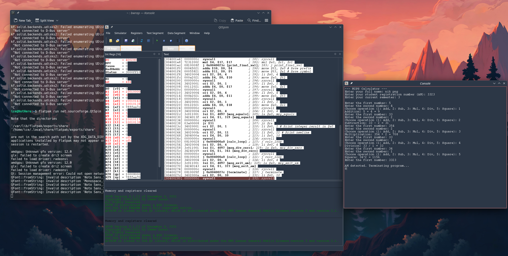

# MIPS Assembly 
## Exercise 2


1.Αναφέρετε και περιγράψτε το “προγραμματιστικό μπλοκ” (σύνολο εντολών) που απαιτείται για την αποστολή μηνυμάτων στην κονσόλα (προς ενημέρωση του χρήστη)​

2.Αναφέρετε και περιγράψτε το “προγραμματιστικό μπλοκ” που απαιτείται για την εισαγωγή δεδομένων από το πληκτρολόγιο (χρήστη)​

3.Μόλις ανακτηθούν τα δεδομένα από το πληκτρολόγιο, που αποθηκεύονται;​

4.Όταν θέλουμε να εμφανίσουμε δεδομένα, που θα πρέπει να τοποθετηθούν;
### Απαντήσεις

1. **Εκτύπωση μηνύματος:**
    Χρησιμοποιείται ο κωδικός κλήσης συστήματος `4` στον καταχωρητή `$v0` και η διεύθυνση του μηνύματος στον `$a0`.
    ```mips
    li $v0, 4       # Κωδικός για print string
    la $a0, label   # Φόρτωση διεύθυνσης μηνύματος
    syscall         # Εκτέλεση
    ```

2. **Εισαγωγή δεδομένων:**
    Για ακέραιο, χρησιμοποιείται ο κωδικός `5` στον `$v0`.
    ```mips
    li $v0, 5       # Κωδικός για read integer
    syscall         # Εκτέλεση
    ```

3. **Αποθήκευση δεδομένων:**
    *   Οι **ακέραιοι** αποθηκεύονται στον καταχωρητή `$v0`.
    *   Οι **συμβολοσειρές (strings)** αποθηκεύονται στη μνήμη, στη διεύθυνση που είχε προκαθοριστεί στον καταχωρητή `$a0`.

4. **Τοποθέτηση δεδομένων για εμφάνιση:**
    Τα δεδομένα πρέπει να μεταφερθούν στον καταχωρητή **`$a0`** (για ακεραίους/συμβολοσειρές) ή στον **`$f12`** (για αριθμούς κινητής υποδιαστολής) πριν την κλήση `syscall`.

---

## Τεκμηρίωση Προγράμματος Αριθμομηχανής (MIPS Calculator)

### Περιγραφή
Το πρόγραμμα υλοποιεί μια αριθμομηχανή σε γλώσσα assembly MIPS, σχεδιασμένη να εκτελείται στον προσομοιωτή QtSpim. Επιτρέπει στον χρήστη να εκτελεί βασικές αριθμητικές πράξεις και διαθέτει μηχανισμό τερματισμού βάσει του Αριθμού Μητρώου (ΑΜ) του φοιτητή.

### Λειτουργίες
1.  **Εισαγωγή Στοιχείων**: Κατά την εκκίνηση, το πρόγραμμα ζητά το ονοματεπώνυμο, τον ΑΜ και το εξάμηνο του χρήστη.
2.  **Ροή Προγράμματος**: Ο χρήστης εισάγει πρώτα τους δύο αριθμούς και στη συνέχεια επιλέγει την επιθυμητή πράξη.
3.  **Αριθμητικές Πράξεις**:
    *   **Πρόσθεση (1)**: Υπολογίζει το a + b.
    *   **Αφαίρεση (2)**: Υπολογίζει το a - b.
    *   **Πολλαπλασιασμός (3)**: Υπολογίζει το a * b.
    *   **Διαίρεση (4)**: Υπολογίζει το a / b (με έλεγχο για διαίρεση με το μηδέν).
    *   **Τετράγωνο (5)**: Υπολογίζει το τετράγωνο του πρώτου αριθμού (a^2).

### Μηχανισμός Τερματισμού
Το πρόγραμμα επαναλαμβάνεται συνεχώς (loop) μέχρι ο χρήστης να εισάγει τον **ΑΜ** του σε οποιοδήποτε από τα δύο πεδία εισαγωγής αριθμών.

### Τεχνικές Λεπτομέρειες
*   **Καταχωρητές**:
    *   `$s0`: Αποθήκευση του ΑΜ για τον έλεγχο τερματισμού.
    *   `$s1, $s2`: Αποθήκευση των δύο αριθμών εισόδου.
    *   `$t0`: Επιλογή πράξης.
*   **Δομή**: Το πρόγραμμα χρησιμοποιεί υπορουτίνες (όπως η `print_binary_header`) για τη βελτιστοποίηση της εκτύπωσης των αποτελεσμάτων και τη μείωση του μεγέθους του κώδικα.
*   **Ασφάλεια**: Πραγματοποιείται έλεγχος πριν από τη διαίρεση για την αποφυγή σφαλμάτων συστήματος σε περίπτωση μηδενικού διαιρέτη.



### Αυτοματοποιημένη εκτέλεση/tests
```shell
chmod u+x run_tests.sh
./run_tests.sh
```
```shell
Running MIPS Calculator Tests...
SPIM Version 8.0 of January 8, 2010
Copyright 1990-2010, James R. Larus.
All Rights Reserved.
See the file README for a full copyright notice.
Loaded: /usr/lib/spim/exceptions.s
--- MIPS Calculator ---
Enter your full name: Enter your student registration number (AM): Enter your current semester: 
Enter the first number: Enter the second number: Choose operation (1: Add, 2: Sub, 3: Mul, 4: Div, 5: Square): Addition: 10 + 5 = 15
Enter the first number: Enter the second number: Choose operation (1: Add, 2: Sub, 3: Mul, 4: Div, 5: Square): Subtraction: 20 - 10 = 10
Enter the first number: Enter the second number: Choose operation (1: Add, 2: Sub, 3: Mul, 4: Div, 5: Square): Multiplication: 5 * 4 = 20
Enter the first number: Enter the second number: Choose operation (1: Add, 2: Sub, 3: Mul, 4: Div, 5: Square): Division: 100 / 10 = 10
Enter the first number: Enter the second number: Choose operation (1: Add, 2: Sub, 3: Mul, 4: Div, 5: Square): Square: 8^2 = 64
Enter the first number: 
AM detected. Terminating program...
Tests completed and temporary files cleaned up.
```

### Χειροκίνητη εκτέλεση
```shell
spim -file calculator_spec.asm
```

```shell
--- MIPS Calculator ---
Enter your full name: Nikolaos Panagopoulos
Enter your student registration number (AM): 3323
Enter your current semester: 3

Enter the first number: 33
Enter the second number: 2
Choose operation (1: Add, 2: Sub, 3: Mul, 4: Div, 5: Square): 1
Addition: 33 + 2 = 35

Enter the first number: 44
Enter the second number: 1
Choose operation (1: Add, 2: Sub, 3: Mul, 4: Div, 5: Square): 2
Subtraction: 44 - 1 = 43

Enter the first number: 10
Enter the second number: 5
Choose operation (1: Add, 2: Sub, 3: Mul, 4: Div, 5: Square): 3
Multiplication: 10 * 5 = 50

Enter the first number: 40
Enter the second number: 8
Choose operation (1: Add, 2: Sub, 3: Mul, 4: Div, 5: Square): 4
Division: 40 / 8 = 5

Enter the first number: 8
Enter the second number: 0
Choose operation (1: Add, 2: Sub, 3: Mul, 4: Div, 5: Square): 5
Square: 8^2 = 64

Enter the first number: 3323
AM detected. Terminating program...
```

