# Κεφάλαιο 18: Υπολογιστές Πολλαπλών Πυρήνων - Smart Notes

---

## 1.0 Ζητήματα Απόδοσης Υλικού

### 1.1 Εκθετική Αύξηση Απόδοσης Μικροεπεξεργαστών

**i. Παράγοντες Βελτίωσης:**
- Βελτίωση στην οργάνωση αρχιτεκτονικής
- Αύξηση συχνότητας λειτουργίας

**ii. Τεχνικές Ενίσχυσης Παράλληλου Επεξεργαστή:**
- **Διασωλήνωση (Pipelining)**: Ταχύτερη επεξεργασία εντολών
- **Υπερβαθμωτή Αρχιτεκτονική (Superscalar)**: Αποδοτικότερη εκτέλεση πολλαπλών εντολών
- **Ταυτόχρονη Πολυνημάτωση (Simultaneous Multithreading - SMT)**: Καλύτερη αξιοποίηση πόρων

### 1.2 Νόμος του Moore

**i. Ιστορική Εξέλιξη Τεχνολογίας Κατασκευής:**

| Περίοδος | Μέγεθος Τεχνολογίας |
|----------|---------------------|
| 1971 | 10 μm |
| 1984 | 1 μm |
| 1990 | 600 nm |
| 2001 | 130 nm |
| 2005 | 65 nm |
| 2012 | 22 nm |
| 2018 | 7 nm |
| 2020 | 5 nm |
| 2023 | ~3 nm (M3 Apple) |
| 2024 | ~2 nm |

**ii. Σημασία:**
- Συνεχής μείωση μεγέθους τρανζίστορ επιτρέπει υψηλότερη πυκνότητα
- Αύξηση απόδοσης και μείωση κόστους

> [!INFO] **Οι Ορισμοί:**
>
> **MOSFET (Metal-Oxide-Semiconductor Field-Effect Transistor)**:
> - Βασικό στοιχείο μικροεπεξεργαστών και μνημών
> - Λειτουργεί ως διακόπτης ή ενισχυτής ηλεκτρικών σημάτων
> - Ο αριθμός MOSFETs = δείκτης υπολογιστικής ισχύος
>
> **Wafer Scale Engine (WSE)**:
> - Ολόκληρη η επιφάνεια ενός wafer πυριτίου χρησιμοποιείται για ένα chip
> - Εκατομμύρια πυρήνες, τεράστια μνήμη
> - Εφαρμογές: AI, Machine Learning, HPC
> - Παράδειγμα: Cerebras WSE-2 (2600 δισεκ. τρανζίστορ, 840,000 AI-πυρήνες)

### 1.3 Εξέλιξη Μικροεπεξεργαστών και Τεχνολογιών IC

| Έτος | Στοιχείο | Ονομασία | MOSFETs (δισεκ.) |
|------|---------|----------|-----------------|
| 2019 | IC Chip | Samsung V-NAND | 2000 |
| 2020 | GPU | AMD Instinct MI250X | 59 |
| 2020 | ML Processor | Colossus Mk2 GC200 | 59.4 |
| 2020 | IC Chip | Wafer Scale Engine 2 | 2600 |
| 2021 | Microprocessor | Apple M1 Max | 57 |

### 1.4 Κανόνας του Pollack

> [!INFO] **Θεώρημα Απόδοσης:**
>
> Η αύξηση απόδοσης ενός επεξεργαστή είναι περίπου ανάλογη με την τετραγωνική ρίζα της αύξησης πολυπλοκότητας:
>
> $$ \text{Απόδοση} \propto \sqrt{\text{Πολυπλοκότητα}} $$
>
> **Παράδειγμα**: Διπλασιασμός λογικών κυκλωμάτων πυρήνα → Αύξηση απόδοσης ~40%

**i. Προκλήσεις Σχεδίασης:**
- Αυξημένη δυσκολία κατασκευής
- Πολυπλοκότητα αποσφαλμάτωσης
- Περιορισμοί επέκτασης

### 1.5 Αύξηση Πολυπλοκότητας και Κατανάλωση Ενέργειας

**i. Πρόβλημα Ισχύος:**
- Κατανάλωση ενέργειας αυξάνεται εκθετικά με πυκνότητα τρανζίστορ
- Συχνότητα ρολογιού επιδεινώνει το πρόβλημα
- Πάνω από 20 δισεκ. τρανζίστορ σε σύγχρονα chips

**ii. Λύση: Πολλαπλοί Πυρήνες**
- Αντιμετώπιση υπερθέρμανσης
- Αύξηση απόδοσης
- Αποτελεσματική διαχείριση κρυφής μνήμης

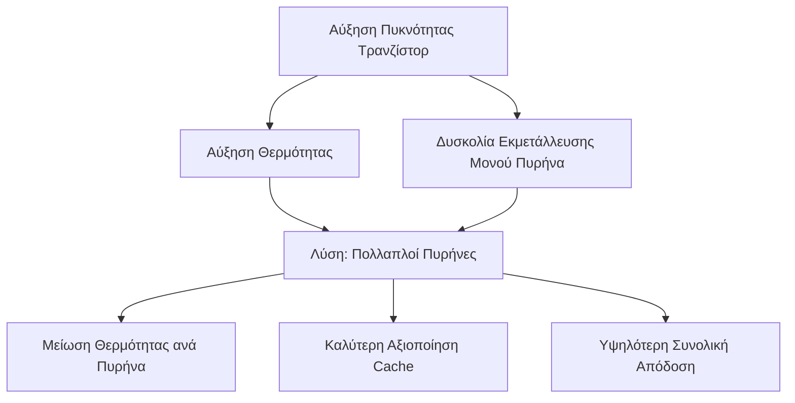

---

## 2.0 Θέματα Απόδοσης Λογισμικού

### 2.1 Νόμος του Amdahl

**i. Μαθηματική Διατύπωση:**

$$
S = \frac{1}{(1-f) + \frac{f}{N}}
$$

Όπου:
- $ S $: Αύξηση ταχύτητας (speedup)
- $ f $: Ποσοστό παράλληλου κώδικα
- $ (1-f) $: Ποσοστό σειριακού κώδικα
- $ N $: Αριθμός επεξεργαστών

**ii. Πρακτικό Παράδειγμα:**
- 10% σειριακός κώδικας σε σύστημα 8 επεξεργαστών
- Επίτευξη: Μόλις 4.7× απόδοση (όχι 8×)

> [!WARNING] **Κρίσιμη Παρατήρηση:**
>
> Ακόμα και μικρό ποσοστό σειριακού κώδικα περιορίζει σημαντικά την απόδοση παράλληλων συστημάτων.

**iii. Επιπλέον Επιβαρύνσεις Λογισμικού:**
- Επικοινωνία μεταξύ επεξεργαστών
- Κατανομή εργασίας στους πυρήνες
- Διατήρηση συνοχής κρυφής μνήμης

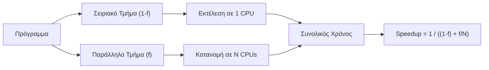

### 2.2 Επιτάχυνση με Σειριακά Τμήματα

| Αρ. Επεξεργαστών | 0% Σειριακό | 2% Σειριακό | 5% Σειριακό | 10% Σειριακό |
|------------------|-------------|-------------|-------------|--------------|
| 1 | 1.0× | 1.0× | 1.0× | 1.0× |
| 2 | 2.0× | 1.96× | 1.90× | 1.82× |
| 4 | 4.0× | 3.77× | 3.48× | 3.08× |
| 8 | 8.0× | 6.90× | 5.93× | 4.71× |

### 2.3 Επίδραση Overhead

**i. Επιβαρύνσεις συστήματος** (5%, 10%, 15%, 20%):
- Μείωση πραγματικής επίδοσης
- Καθυστερήσεις επικοινωνίας
- Συγχρονισμός νημάτων

**ii. Παρατήρηση από Benchmarks:**
- Single-threaded performance ανεξάρτητη από αριθμό πυρήνων
- Παράδειγμα: Intel i7-7700K (4/8) ≈ Ryzen Threadripper 1950X (16/32) σε μονονηματικά workloads

---

## 3.0 Παράγοντες Διαμόρφωσης Πολυπύρηνων Επεξεργαστών

### 3.1 Βασικοί Παράγοντες Σχεδίασης

**i. Αριθμός Επεξεργαστών:**
- Πλήθος πυρήνων στο chip

**ii. Επίπεδα Κρυφής Μνήμης:**
- L1, L2, L3 cache
- Ιεραρχία για βελτίωση ταχύτητας πρόσβασης

**iii. Ποσότητα Κοινόχρηστης Κρυφής Μνήμης:**
- Μέγεθος shared cache μεταξύ πυρήνων

**iv. Υποστήριξη Simultaneous Multithreading:**
- Ταυτόχρονη εκτέλεση πολλαπλών νημάτων ανά πυρήνα

**v. Τύποι Πυρήνων:**
- **Ομοιογενείς (Homogeneous)**: Ίδιοι πυρήνες
- **Ετερογενείς (Heterogeneous)**: Διαφορετικοί πυρήνες για εξειδικευμένες λειτουργίες

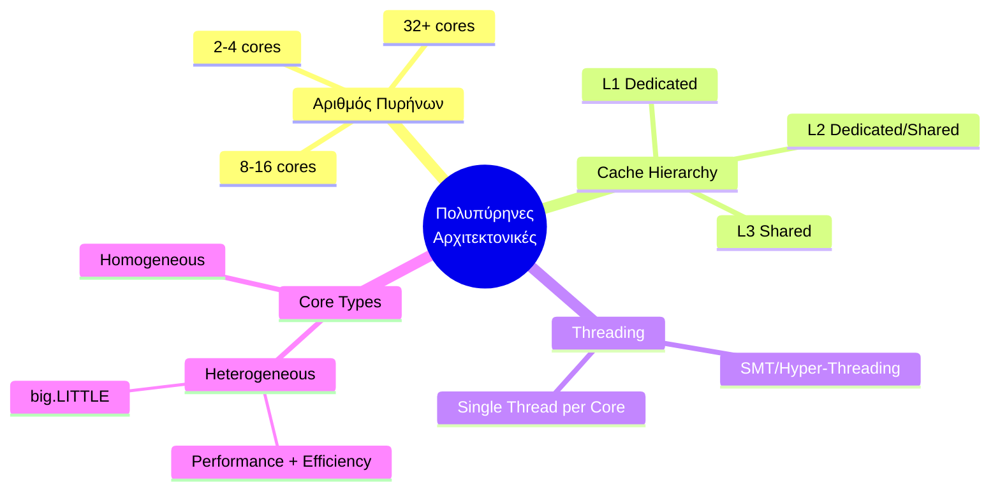

---

## 4.0 Οργάνωση Κρυφής Μνήμης

### 4.1 Τύποι Διαμόρφωσης Cache

**i. Δεσμευμένη Κρυφή Μνήμη Επιπέδου 1 (L1):**
- Κάθε πυρήνας: Αποκλειστική L1
- Διαχωρισμός: L1-D (Data), L1-I (Instruction)
- Πρόσβαση στην κύρια μνήμη μέσω I/O

**ii. Δεσμευμένη Κρυφή Μνήμη Επιπέδου 2 (L2):**
- Κάθε πυρήνας: Αποκλειστική L1 + Δεσμευμένη L2
- Μεγαλύτερη χωρητικότητα ανά πυρήνα

**iii. Κοινόχρηστη Κρυφή Μνήμη Επιπέδου 2:**
- Πυρήνες μοιράζονται κοινή L2
- Μείωση αντιγραφής δεδομένων μεταξύ πυρήνων

**iv. Κοινόχρηστη Κρυφή Μνήμη Επιπέδου 3 (L3):**
- L1, L2: Δεσμευμένα ανά πυρήνα
- L3: Κοινόχρηστη για όλους τους πυρήνες
- Ενδιάμεσος χώρος πριν την κύρια μνήμη

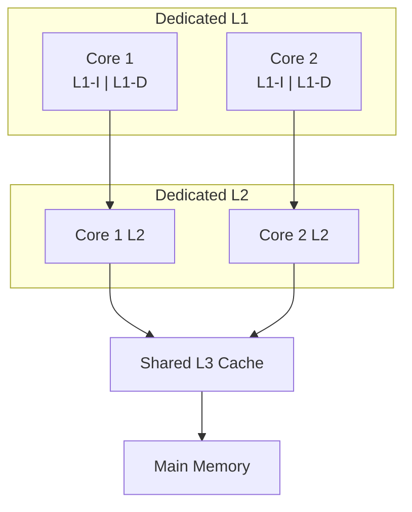

### 4.2 Πλεονεκτήματα Κοινόχρηστης Cache

**i. Μειωμένοι Ρυθμοί Αστοχίας:**
- Συνολική μείωση miss rate

**ii. Κοινή Αποθήκευση Δεδομένων:**
- Δεδομένα που χρησιμοποιούνται από πολλούς πυρήνες αποθηκεύονται μία φορά
- Εξοικονόμηση πόρων

**iii. Δυναμική Κατανομή Μνήμης:**
- Αλγόριθμοι αντικατάστασης προσαρμόζουν την κατανομή
- Νήματα με χαμηλή τοπικότητα αποκτούν περισσότερο χώρο

**iv. Αποτελεσματική Επικοινωνία:**
- Επικοινωνία μέσω shared cache
- Εξάλειψη ανάγκης για εξωτερικά δίκτυα

---

## 5.0 Αρχιτεκτονικές Ετερογενών Συστημάτων

### 5.1 Πολλαπλοί Πυρήνες CPU/GPU

**i. Χαρακτηριστικά GPU:**
- Υποστήριξη χιλιάδων παράλληλων νημάτων
- Κατάλληλες για εφαρμογές μεγάλων δεδομένων (διανύσματα, πίνακες)
- Αρχική χρήση: Βελτίωση απόδοσης γραφικών
- Σύγχρονη χρήση: Επαναληπτικές πράξεις σε δομημένα δεδομένα

**ii. Τεχνολογίες:**
- **CUDA**: Πλατφόρμα παράλληλης επεξεργασίας (NVIDIA)
- **GPGPU**: General-Purpose computing on GPUs

> [!INFO] **Ιδεατή Μνήμη (Virtual Memory)**:
>
> Μηχανισμός διαχείρισης που παρέχει:
> - Εντύπωση μεγάλου συνεχούς χώρου μνήμης
> - Ανεξαρτησία από φυσική RAM
> - Τεχνικές: Σελιδοποίηση (paging), Τμηματοποίηση (segmentation)
> - Αποφυγή συγκρούσεων, διαχείριση μεγαλύτερων datasets

### 5.2 Αρχιτεκτονική Heterogeneous Systems

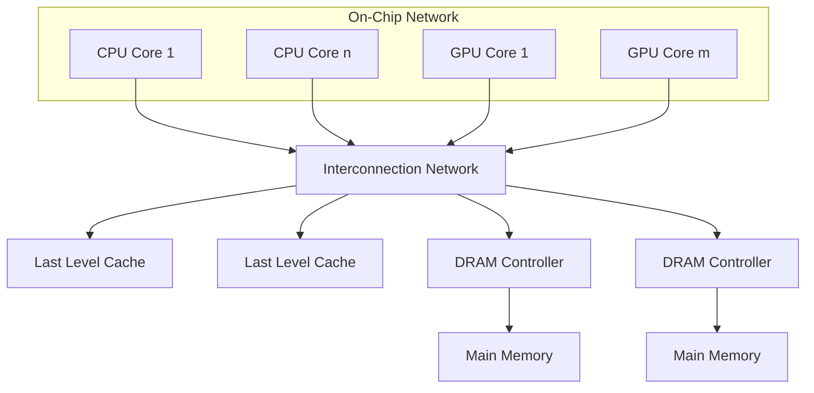

**i. Κοινή Ιδεατή Μνήμη:**
- Προσβάσιμη από CPU και GPU
- Σελίδες μεταφέρονται στη φυσική μνήμη όταν απαιτείται

**ii. Πολιτική Συνοχής:**
- Διατήρηση ενημερωμένων δεδομένων σε CPU/GPU caches

**iii. Ενιαία Διεπαφή Προγραμματισμού:**
- Αξιοποίηση σειριακής ισχύος CPU
- Αξιοποίηση παράλληλης ισχύος GPU

### 5.3 Σύγκριση Απόδοσης CPU/GPU

**Παράδειγμα: AMD A10 5800K**

| Παράμετρος | CPU | GPU |
|------------|-----|-----|
| Συχνότητα ρολογιού | 3.8 GHz | 0.8 GHz |
| Πυρήνες | 4 | 384 |
| FLOPS/πυρήνα/κύκλο | 8 | 2 |
| **GFLOPS** | **121.6** | **614.4** |

**i. Συμπεράσματα:**
- GPU: Χαμηλότερη συχνότητα, αλλά περισσότεροι πυρήνες
- GPU: 5× υψηλότερη συνολική απόδοση σε παράλληλες εργασίες
- CPU: Ευέλικτη για σειριακές διεργασίες
- GPU: Ενδεικνυόμενη για γραφικά, ML, επιστημονικούς υπολογισμούς

---

## 6.0 Αρχιτεκτονική ARM

### 6.1 Εισαγωγή στην ARM

**i. Advanced RISC Machine:**
- Αρχικά: Acorn RISC Machine
- Βάση: Αρχιτεκτονική RISC (Reduced Instruction Set Computing)
- Κατασκευή: Πολλοί κατασκευαστές μέσω αδειών ARM Holdings

**ii. Διάδοση:**
- Έως 2017: >100 δισεκ. ARM επεξεργαστές παραγόμενοι
- Πιο διαδεδομένη αρχιτεκτονική συνόλου εντολών

> [!INFO] **RISC (Reduced Instruction Set Computing)**:
>
> **Βασικά Χαρακτηριστικά:**
> - Μικρό και βελτιστοποιημένο σύνολο εντολών
> - Κάθε εντολή εκτελείται σε ~1 κύκλο ρολογιού
> - Ομοιομορφία εντολών (σταθερό μήκος/δομή)
> - Εστίαση στο λογισμικό (compiler)
> - Αποδοτική χρήση καταχωρητών
>
> **Σύγχρονες Αρχιτεκτονικές:** ARM, MIPS, RISC-V

### 6.2 Αρχιτεκτονική big.LITTLE

**i. Έννοια:**
- Συνδυασμός πυρήνων υψηλής απόδοσης (big) και χαμηλής κατανάλωσης (LITTLE)
- Παρόμοιες αρχιτεκτονικές ISA, διαφορετικά χαρακτηριστικά

**ii. Στόχοι:**
- Ισορροπία μεταξύ απόδοσης και ενεργειακής αποδοτικότητας
- Κυρίως για smartphones, tablets

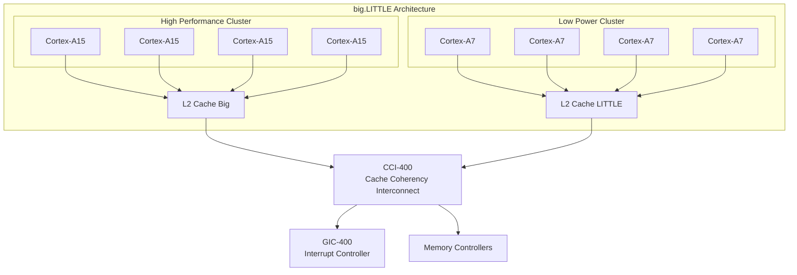

### 6.3 Σύγκριση Απόδοσης Cortex-A7 vs A15

| Χαρακτηριστικό | Cortex-A7 | Cortex-A15 |
|----------------|-----------|------------|
| Απόδοση ανά MHz | 1× | ~2× |
| Ενεργειακή Αποδοτικότητα | 3× καλύτερη | 1× |
| Διασωλήνωση | 8-10 στάδια | 15-24 στάδια |
| Εκτέλεση | In-order | Out-of-order |
| Εντολές/κύκλο | 2 (5 execution units) | 3 (8 execution units) |
| Ουρά εντολών | Ενιαία | Ξεχωριστή ανά unit |

**i. Cortex-A15:**
- Διπλάσια απόδοση ανά MHz
- Υψηλότερη κατανάλωση

**ii. Cortex-A7:**
- Τρεις φορές πιο αποδοτικός ενεργειακά για ίδιο φορτίο
- 4 σημεία λειτουργίας ισχύος + idle mode

### 6.4 Λειτουργικά Μοντέλα big.LITTLE

#### 6.4.1 Clustered Switching

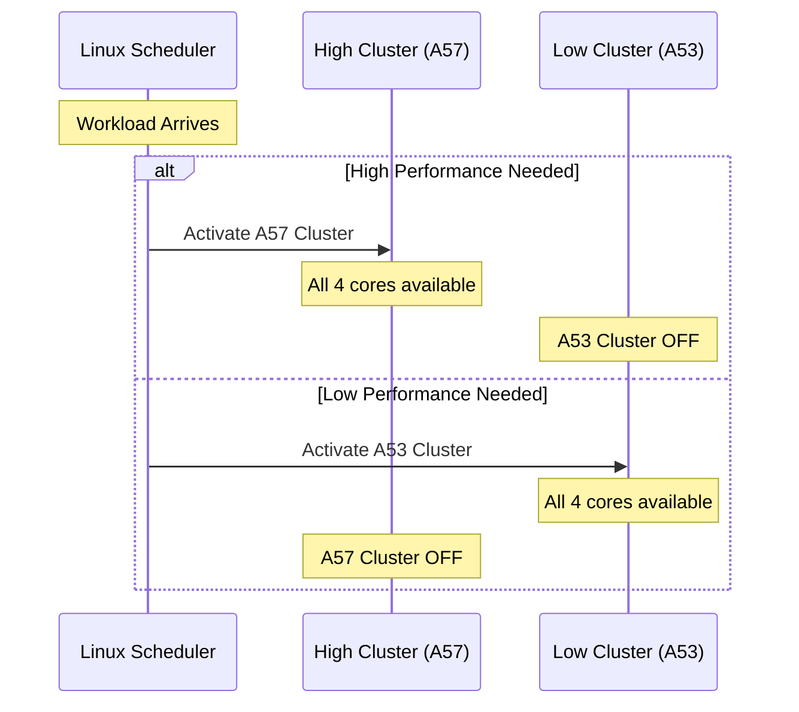

**i. Χαρακτηριστικά:**
- Επιλογή **μίας συστάδας** τη φορά
- High Cluster: Αν χρειάζεται ≥1 πυρήνας υψηλής απόδοσης
- Low Cluster: Διαφορετικά

#### 6.4.2 In-Kernel Switcher

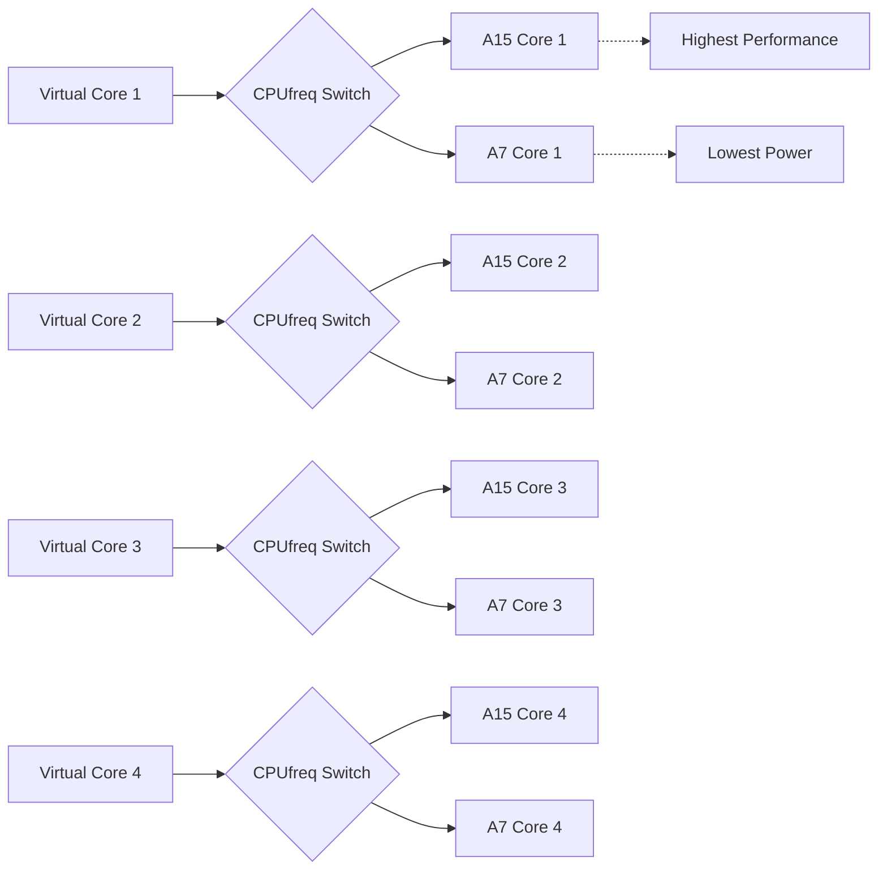

**i. Χαρακτηριστικά:**
- 4 SMP εικονικοί πυρήνες
- CPUfreq switch ανά εικονικό πυρήνα
- Εναλλαγή μεταξύ A15/A7 δυναμικά

#### 6.4.3 Heterogeneous Multi-Processing (HMP)

**i. Χαρακτηριστικά:**
- **Όλοι οι 8 πυρήνες** (4× A15 + 4× A7) ταυτόχρονα ενεργοί
- Linux Scheduler: 8 μη-συμμετρικοί πυρήνες
- Δρομολόγηση σε big ή LITTLE ανάλογα με workload

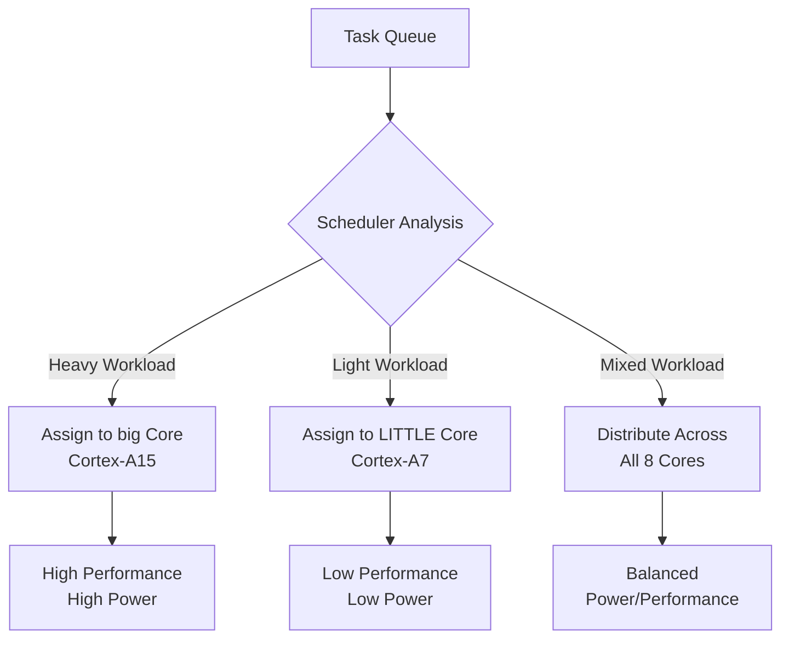

### 6.5 ARM DynamIQ

**i. Εισαγωγή:**
- Πυρήνες: Cortex-A75, Cortex-A55
- Ενισχυμένη υποστήριξη AI/ML

**ii. Βελτιώσεις:**
- **>50× AI performance boost** στην CPU (3-5 έτη)
- **10× ταχύτερη απόκριση** σε επιταχυντές
- Dedicated processor instructions για AI
- Καλυτερη πρόσβαση σε acceleration

### 6.6 ARM Cortex-X1

| Χαρακτηριστικό | Τιμή |
|----------------|------|
| Ημερομηνία Κυκλοφορίας | 2020 |
| Σχεδιαστής | ARM Ltd. |
| Max Clock Rate | 3.0 GHz (phones), 3.3 GHz (tablets/laptops) |
| Address Width | 40-bit |
| L1 Cache | 128 KiB (64 KiB I-cache + 64 KiB D-cache) ανά πυρήνα |
| L2 Cache | 512–1024 KiB ανά πυρήνα |
| L3 Cache | 512 KiB – 8 MiB (optional) |

**i. Χαρακτηριστικά:**
- Υπερκλιμάκωση εκτός σειράς
- Λήψη 5 εντολών ανά κύκλο
- Παράθυρο 224 καταχωρητών
- SIMD units: 4×128b

---

## 7.0 Apple M1 Pro/Max

### 7.1 Προδιαγραφές

| Χαρακτηριστικό | M1 Pro | M1 Max |
|----------------|--------|--------|
| Ημερομηνία | 18 Οκτωβρίου 2021 | 18 Οκτωβρίου 2021 |
| Εφαρμογή | MacBook Pro | MacBook Pro |
| Τεχνολογία | 5 nm | 5 nm |
| Μικροαρχιτεκτονική | Firestorm + Icestorm | Firestorm + Icestorm |
| Σετ Εντολών | ARMv8.4-A | ARMv8.4-A |
| Τρανζίστορ | 33.7 δισεκ. | 57 δισεκ. |
| CPU Cores | 8 ή 10 (6-8 perf + 2 efficiency) | 10 (8 perf + 2 efficiency) |
| GPU Cores | Έως 16 | Έως 32 |
| Neural Engine | 16 πυρήνες, 600 δισεκ. ops/sec | 16 πυρήνες, 600 δισεκ. ops/sec |

**i. GPU Δομή:**
- Κάθε πυρήνας GPU: 16 execution units
- Κάθε execution unit: 8 ALUs

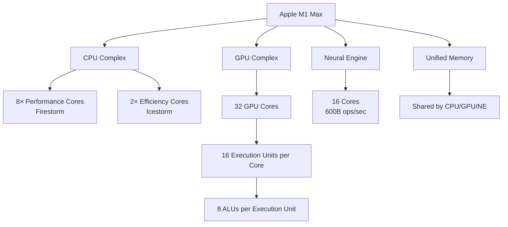

---

## 8.0 Σύγκριση CPU και GPU

### 8.1 Δομικές Διαφορές

| Χαρακτηριστικό | CPU | GPU |
|----------------|-----|-----|
| Αριθμός Πυρήνων | Λίγοι ισχυροί (4-64) | Πολλοί απλοί (>1000) |
| Κρυφή Μνήμη | Μεγάλη ανά πυρήνα | Μικρή ανά πυρήνα |
| Εκτέλεση | Out-of-order | In-order (SIMD) |
| Branch Prediction | Εξελιγμένη | Βασική |
| Παραλληλία | Thread-level | Massive data parallelism |

**i. CPU:**
- Λίγοι ισχυροί πυρήνες
- Μεγάλη κρυφή μνήμη
- Πρόβλεψη διακλαδώσεων
- Εκτέλεση εντολών εκτός σειράς

**ii. GPU:**
- Πολλοί μικροί, απλοί πυρήνες
- In-order execution
- **SIMD** (Single Instruction Multiple Data): Παράλληλη επεξεργασία δεδομένων κινητής υποδιαστολής
- Σύγχρονες υλοποιήσεις: >1000 πυρήνες
  - NVIDIA Tesla V100: 5,120 CUDA cores
  - NVIDIA H100: 18,176 cores

### 8.2 Εξέλιξη Απόδοσης GPU vs CPU

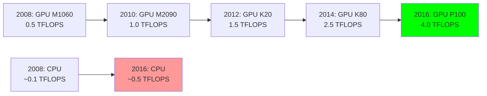

**i. Σύγχρονες Επιδόσεις:**
- NVIDIA Tesla V100: 7.5 TFLOPS (double precision), 15 TFLOPS (single precision)
- NVIDIA H100 (2022): 33.5 TFLOPS (double precision)

> [!INFO] **TFLOPS (Tera Floating Point Operations Per Second)**:
>
> Μονάδα μέτρησης απόδοσης:
> - 1 TFLOPS = 1 τρισεκατομμύριο πράξεις κινητής υποδιαστολής/δευτερόλεπτο
> - Κρίσιμο για επιστημονικούς υπολογισμούς, προσομοιώσεις, AI
>
> **Single Precision (FP32 - 32 bits):**
> - 1 bit: πρόσημο
> - 8 bits: εκθέτης
> - 23 bits: κλασματικό μέρος
> - Ακρίβεια: ~7 δεκαδικά ψηφία
> - Χρήση: ML, γραφικά
>
> **Double Precision (FP64 - 64 bits):**
> - 1 bit: πρόσημο
> - 11 bits: εκθέτης
> - 52 bits: κλασματικό μέρος
> - Ακρίβεια: ~15 δεκαδικά ψηφία
> - Χρήση: Επιστημονικές προσομοιώσεις, χρηματοοικονομικά μοντέλα

---

## 9.0 Αρχιτεκτονική NVIDIA Fermi

### 9.1 Εισαγωγή

**i. Σημασία:**
- Πρώτη GPU αρχιτεκτονική για γραφικά **και** GPGPU
- Έτος κυκλοφορίας: ~2010

**ii. Βασικά Χαρακτηριστικά:**
- **64-bit διευθυνσιοδότηση μνήμης**: Διαχείριση μεγαλύτερων όγκων δεδομένων
- **Unified Memory**: Ευκολότερη συνεργασία CPU-GPU
- **CUDA βελτιώσεις**: Ανάλυση δεδομένων, εκπαίδευση νευρωνικών δικτύων
- **DirectX 11**: Δυναμικός φωτισμός, σκιές, πολύπλοκα εφέ
- Θεμέλια για GeForce GTX σειρά

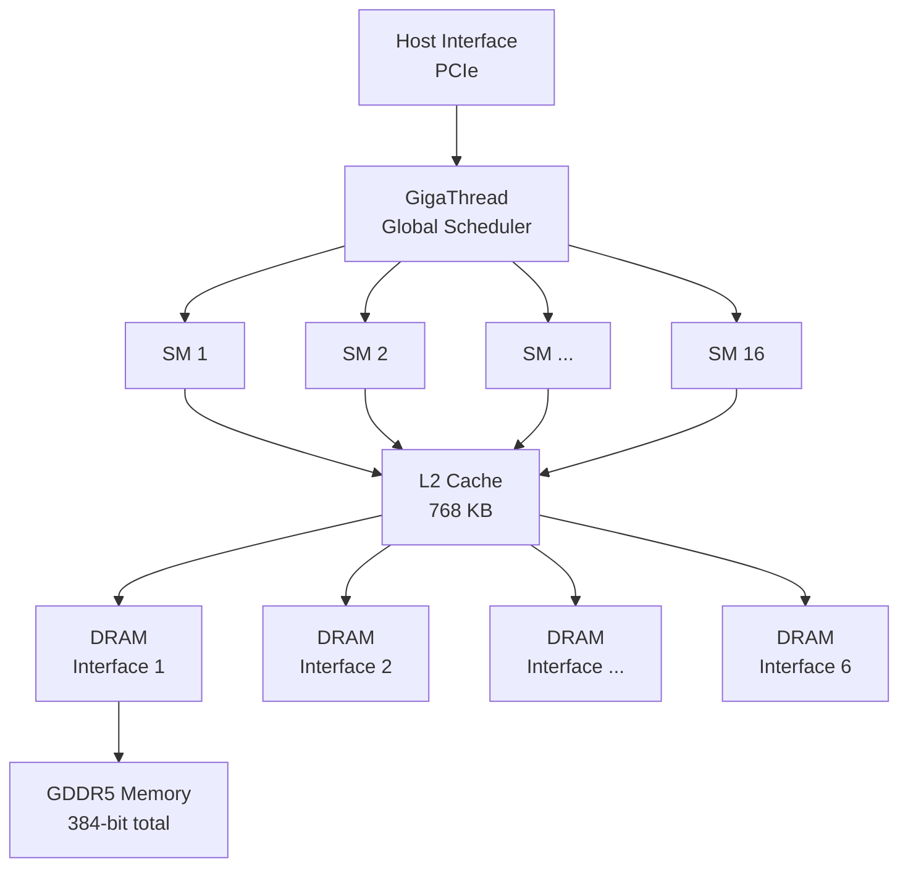

### 9.2 Δομή Streaming Multiprocessor (SM)

**i. Περιεχόμενα ανά SM:**
- 2 στήλες × 32 πυρήνες CUDA = **64 CUDA cores**
- 16 μονάδες Load/Store (LD/ST)
- 4 Special Function Units (SFU)

**ii. Αρχείο Καταχωρητών:**
- 32K × 32-bit registers

**iii. Δρομολογητής Νημάτων:**
- Διπλός SIMD thread scheduler
- Διάσπαση νημάτων σε δέσμες 32 νημάτων (warps)
- Κάθε νήμα: Δικό του instruction counter + register set

**iv. Μονάδες Ειδικών Λειτουργιών (SFU):**
- Πράξεις: sin, cos, αντίστροφοι, τετραγωνική ρίζα
- Απόδοση: 1 κύκλος ρολογιού (8 κύκλοι για 32 παράλληλα νήματα)

**v. Shared Memory/L1 Cache:**
- 64 KB κοινόχρηστη ανά SM

> [!INFO] **Streaming Multiprocessors (SMs)**:
>
> Βασικές υπολογιστικές μονάδες GPU:
> - Πυρήνες υψηλής παράλληλης επεξεργασίας
> - Εκτέλεση μεγάλου αριθμού νημάτων ταυτόχρονα
>
> **Χαρακτηριστικά:**
> 1. **Πολλαπλή παράλληλη επεξεργασία**: Δεκάδες-εκατοντάδες νήματα
> 2. **Εξειδικευμένες μονάδες**: FP, LD/ST, SFU
> 3. **Τοπική κρυφή μνήμη**: Μείωση καθυστέρησης πρόσβασης
> 4. **Ευελιξία**: Γραφικά και GPGPU

### 9.3 Fermi Architecture Overview

| Στοιχείο | Προδιαγραφή |
|----------|-------------|
| Αριθμός SM | 16 |
| CUDA Cores ανά SM | 32 (2 στήλες × 16) |
| Συνολικοί CUDA Cores | 512 |
| LD/ST Units ανά SM | 16 |
| SFU ανά SM | 4 |
| L2 Cache | 768 KB (κοινόχρηστο) |
| Memory Interfaces | 6 × 64-bit = 384-bit |
| Memory Type | GDDR5 |

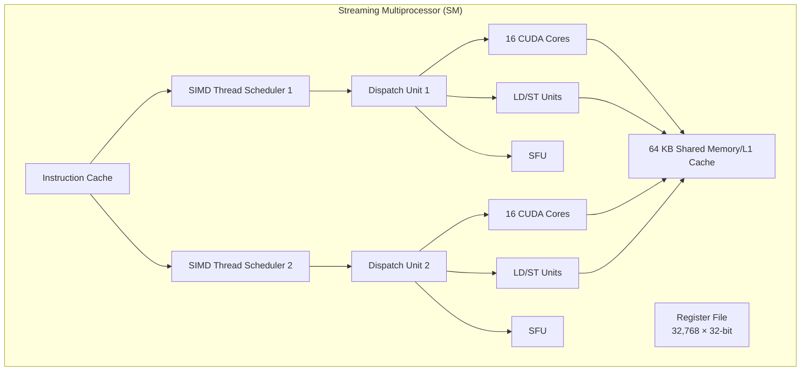

### 9.4 Parallel Processing Characteristics

**i. GigaThread Scheduler:**
- Διανομή thread blocks στους 16 SMs
- Κάθε SM: Δικός του local thread scheduler

**ii. Latency Hiding:**
- Πολλά νήματα συγκαλύπτουν καθυστερήσεις μνήμης
- Λεπτή νημάτωση (fine-grained threading)

**iii. CUDA Core Cooperation:**
- Πυρήνες συνεργάζονται ανά δύο για FP64 operations

### 9.5 Εξέλιξη Αρχιτεκτονικών NVIDIA

| Αρχιτεκτονική | FP32 Units/SM | FP64 Units/SM | Ειδικά Χαρακτηριστικά |
|---------------|---------------|---------------|-----------------------|
| **Tesla** | 8 | - | Πρώτη CUDA αρχιτεκτονική |
| **Fermi** | 32 | 16 | 64-bit addressing, Unified Memory |
| **Kepler** | 192 | 64 | Υψηλότερη παραλληλία |
| **Maxwell** | 128 | 4 | Ενεργειακή αποδοτικότητα |
| **Pascal** | 64 | 32 | FP16 support (2×FP16 per FP32 core) |
| **Volta/Turing** | 64 | 32 | **Tensor Cores** για AI |

**i. Volta & Turing Innovations:**
- **Tensor Cores**: Αφιερωμένες μονάδες AI/ML
- Ανάλυση προβλημάτων σε υπερυπολογιστές
- Επεξεργασία σε consumer GPUs

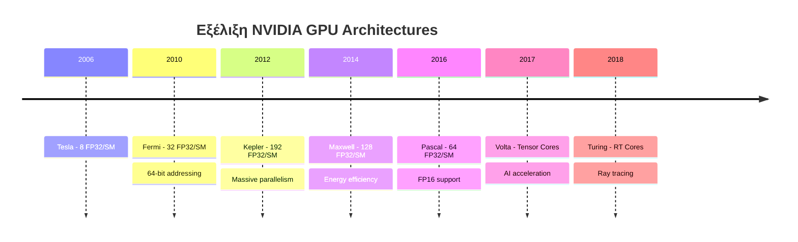

---

## 10.0 Συμπεράσματα και Τάσεις

### 10.1 Βασικές Αρχές Πολυπύρηνης Σχεδίασης

**i. Hardware Constraints:**
- Κανόνας Pollack: $ \text{Performance} \propto \sqrt{\text{Complexity}} $
- Power density αυξάνεται εκθετικά
- Λύση: Πολλαπλοί απλούστεροι πυρήνες

**ii. Software Constraints:**
- Νόμος Amdahl περιορίζει speedup
- Σειριακός κώδικας = bottleneck
- Overhead επικοινωνίας και συγχρονισμού

**iii. Memory Hierarchy:**
- L1: Dedicated, ταχύτερη
- L2: Dedicated ή Shared
- L3: Shared, μεγαλύτερη χωρητικότητα

### 10.2 Heterogeneous Computing

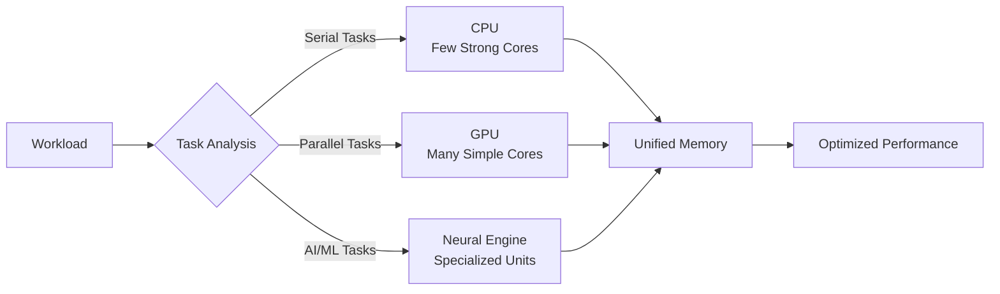

**i. CPU Strengths:**
- Σειριακή απόδοση
- Branch prediction
- Out-of-order execution

**ii. GPU Strengths:**
- Massive parallelism (SIMD)
- Throughput optimization
- Floating-point operations

**iii. Specialized Accelerators:**
- Tensor Cores: AI/ML
- Neural Engines: On-device inference
- RT Cores: Ray tracing

### 10.3 Μελλοντικές Τάσεις

**i. Process Technology:**
- Από 10 μm (1971) → 2 nm (2024)
- Moore's Law συνεχίζει (με αργότερο ρυθμό)

**ii. Architectural Innovations:**
- ARM DynamIQ: >50× AI boost σε 3-5 έτη
- Wafer-scale chips: 2600 δισεκ. τρανζίστορ
- 3D stacking technologies

**iii. Software Adaptation:**
- Παραλληλοποίηση αλγορίθμων
- Heterogeneous programming models (CUDA, OpenCL)
- AI-driven workload optimization

---

## Παράρτημα: Βασικοί Τύποι

### Α.1 Νόμος του Amdahl

$$
S = \frac{1}{(1-f) + \frac{f}{N}}
$$

- $ S $: Speedup
- $ f $: Παράλληλο τμήμα προγράμματος
- $ N $: Αριθμός επεξεργαστών

### Α.2 Κανόνας Pollack

$$
\text{Performance} \propto \sqrt{\text{Complexity}}
$$

Διπλασιασμός πολυπλοκότητας → ~40% αύξηση απόδοσης

### Α.3 Υπολογισμός GFLOPS

$$
\text{GFLOPS} = \text{Cores} \times \text{Clock (GHz)} \times \frac{\text{FLOPS}}{\text{Core/Cycle}}
$$

**Παράδειγμα (AMD A10 GPU):**
$$
\text{GFLOPS} = 384 \times 0.8 \times 2 = 614.4 \text{ GFLOPS}
$$

---

## Αναφορές και Πηγές

- Πανεπιστήμιο Ιωαννίνων - Τμήμα Πληροφορικής & Τηλεπικοινωνιών
- Διδάσκων: Αλέξανδρος Μπανταλούκας-Αρτζμάντ (k.arjmand@uoi.gr)
- Επιμέλεια: Κωνσταντίνος Σακκάς (ksakkas@uoi.gr)
- Κεφάλαιο 18: Αρχιτεκτονική Υπολογιστών (3ο Εξάμηνο)