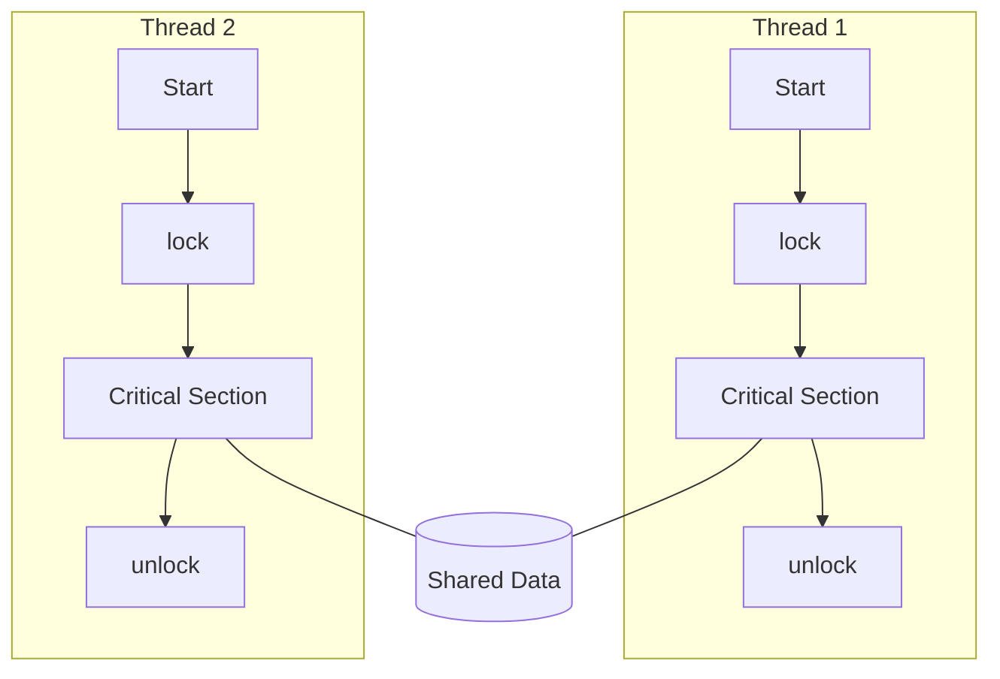

# Κεφάλαιο 17: Παράλληλη Επεξεργασία (Parallel Processing)

## 1.0 Θεμελιώδεις Έννοιες Απόδοσης σε Παράλληλα Συστήματα

### 1.1 Χρόνοι Εκτέλεσης και Κόστη

> [!INFO]
> Η βασική ιδέα της παράλληλης επεξεργασίας (Parallel Processing) είναι ότι ένα πρόβλημα με συνολικό έργο $W$ μπορεί να διαμοιραστεί σε πολλούς επεξεργαστές ώστε ο **χρόνος εκτέλεσης** να μειωθεί. Ωστόσο, η πραγματική απόδοση εξαρτάται από:
> 
> - τον σειριακό χρόνο $T_s$ (serial time)
> - τον παράλληλο χρόνο $T_p$ (parallel time)
> - το **κόστος υπερκεφαλής** (parallel overhead) $T_O$ (επικοινωνία, συγχρονισμός, ανισοκατανομή φορτίου).

Ο συνολικός πόρος (processor-time product) σε ένα σύστημα με $p$ επεξεργαστές είναι:

$$
p \cdot T_p = T_s + T_O
$$

**Legenda:**
- $p$: αριθμός επεξεργαστών (processors)
- $T_s$: χρόνος σειριακής εκτέλεσης
- $T_p$: χρόνος παράλληλης εκτέλεσης
- $T_O$: κόστος υπερκεφαλής (overhead: επικοινωνία, συγχρονισμός, ανισορροπία φορτίου)

### 1.2 Speedup (Επιτάχυνση) και Efficiency (Αποδοτικότητα)

$$
S(p) = \frac{T_s}{T_p}
$$

**Legenda:**
- $S(p)$: speedup με $p$ επεξεργαστές
- $T_s$: σειριακός χρόνος
- $T_p$: παράλληλος χρόνος

Η **αποδοτικότητα (Efficiency)** ορίζεται ως:

$$
E(p) = \frac{S(p)}{p}
$$

**Legenda:**
- $E(p)$: αποδοτικότητα ανά επεξεργαστή
- $S(p)$: speedup
- $p$: αριθμός επεξεργαστών

Μία τιμή $E(p) \approx 1$ (ή 100%) σημαίνει σχεδόν ιδανικό παραλληλισμό.

### 1.3 Νόμος του Amdahl (Amdahl's Law)

> [!INFO]
> Ο νόμος του Amdahl μοντελοποιεί το **μέγιστο δυνατό speedup** όταν μόνο ένα ποσοστό του κώδικα μπορεί να παραλληλοποιηθεί.

Έστω ότι:
- κλάσμα σειριακού κώδικα: $1-P$
- κλάσμα πλήρως παραλληλίσιμου κώδικα: $P$

Τότε το speedup με $N$ επεξεργαστές είναι:

$$
S(N) = \frac{1}{(1-P) + \frac{P}{N}}
$$

**Legenda:**
- $P$: ποσοστό προγράμματος που μπορεί να εκτελεστεί παράλληλα ($0 \le P \le 1$)
- $N$: αριθμός επεξεργαστών
- $1-P$: σειριακό μέρος προγράμματος

Μέγιστο θεωρητικό speedup όταν $N \to \infty$:

$$
S_{\max} = \frac{1}{1-P}
$$

**Ερμηνεία:** ακόμη και αν αυξηθούν απεριόριστα οι επεξεργαστές, η αύξηση απόδοσης περιορίζεται από το **μη παραλληλίσιμο** μέρος.

### 1.4 Νόμος του Gustafson (Gustafson's Law)

> [!INFO]
> Ο νόμος του Gustafson αντιμετωπίζει την αδυναμία του Amdahl: στην πράξη η **διάσταση του προβλήματος** αυξάνεται όταν υπάρχουν περισσότεροι επεξεργαστές.

Αν $s$ είναι το σειριακό κλάσμα (σε χρόνο) σε ένα σύστημα με $N$ επεξεργαστές και $p = 1-s$ το παράλληλο κλάσμα, τότε το **scaled speedup** είναι:

$$
S_G(N) = s + p \cdot N = 1 + (N-1)\cdot p
$$

**Legenda:**
- $S_G(N)$: scaled speedup κατά Gustafson
- $N$: αριθμός επεξεργαστών
- $s$: σειριακό κλάσμα σε παράλληλη εκτέλεση
- $p$: παράλληλο κλάσμα, $p = 1-s$

## 2.0 MIPS και IPC σε Παράλληλα Συστήματα

### 2.1 Ορισμός MIPS

$$
\text{MIPS} = \frac{f \cdot IPC}{10^6}
$$

**Legenda:**
- $\text{MIPS}$: Million Instructions Per Second
- $f$: συχνότητα ρολογιού σε Hz
- $IPC$: Instructions Per Cycle (εντολές ανά κύκλο)

Σε πολυπύρηνα/πολυεπεξεργαστικά συστήματα, ο συνολικός ρυθμός MIPS προσεγγίζεται (ιδανικά) από το άθροισμα των MIPS όλων των πυρήνων, υπό την προϋπόθεση ότι δεν υπάρχουν σημαντικά bottlenecks μνήμης ή διαύλου.

## 3.0 Ταξινόμηση Flynn (Flynn's Taxonomy)

### 3.1 Βασικά Συστατικά Αρχιτεκτονικής

| Συστατικό | Ονομασία | Λειτουργία |
|-----------|----------|------------|
| **CU** | Control Unit (Μονάδα Ελέγχου) | Διαχείριση ροής εντολών |
| **PU** | Processing Unit (Μονάδα Επεξεργασίας) | Εκτέλεση εντολών |
| **MU** | Memory Unit (Μονάδα Μνήμης) | Αποθήκευση δεδομένων |
| **LM** | Local Memory (Τοπική Μνήμη) | Μνήμη ανά επεξεργαστή |

### 3.2 Κατηγορίες Αρχιτεκτονικών Flynn

| Τύπος | Πλήρης Ονομασία | Χαρακτηριστικά | Παραδείγματα |
|-------|-----------------|----------------|--------------|
| **SISD** | Single Instruction, Single Data | 1 ροή εντολών, 1 ροή δεδομένων | Παραδοσιακοί μονοεπεξεργαστές |
| **SIMD** | Single Instruction, Multiple Data | 1 ροή εντολών, πολλές ροές δεδομένων | GPUs, Vector Processors |
| **MISD** | Multiple Instruction, Single Data | Πολλές ροές εντολών, 1 ροή δεδομένων | Σπάνιο, θεωρητικό |
| **MIMD** | Multiple Instruction, Multiple Data | Πολλές ροές εντολών, πολλές ροές δεδομένων | SMP, NUMA, Clusters |

> [!INFO]
> ```mermaid
> flowchart TB
>     START[Αρχιτεκτονική Υπολογιστών]
>     START --> IS{Ροές Εντολών}
>     IS -->|Μία| SINGLE_I[Single Instruction]
>     IS -->|Πολλές| MULTI_I[Multiple Instructions]
>     
>     SINGLE_I --> DS1{Ροές Δεδομένων}
>     DS1 -->|Μία| SISD[SISD\nΠαραδοσιακός Επεξεργαστής]
>     DS1 -->|Πολλές| SIMD[SIMD\nGPUs, Vector Processors]
>     
>     MULTI_I --> DS2{Ροές Δεδομένων}
>     DS2 -->|Μία| MISD[MISD\nΘεωρητικό]
>     DS2 -->|Πολλές| MIMD[MIMD\nSMP, NUMA, Clusters]
> ```

## 4.0 SISD και SIMD σε Σύγκριση

| Ιδιότητα | SISD | SIMD |
|----------|------|------|
| Ροές Εντολών | Μία | Μία |
| Ροές Δεδομένων | Μία | Πολλές |
| Παραλληλισμός | Σειριακός | Δεδομένων (Data Parallelism) |
| Τυπικά Παραδείγματα | Κλασικοί CPUs | GPUs, Vector Units |
| Καταλληλότητα | Γενικού σκοπού | Μαζικές πράξεις σε arrays/vectors |

> [!INFO]
> ```mermaid
> flowchart LR
>     subgraph SISD[SISD]
>         CU1[CU]
>         PU1[PU]
>         MEM1[Μνήμη]
>         CU1 --> PU1
>         PU1 <--> MEM1
>     end
> 
>     subgraph SIMD[SIMD]
>         CU2[Κοινή CU]
>         PUA[PU 1]
>         PUB[PU 2]
>         PUC[PU 3]
>         PUN[PU N]
>         LMA[LM 1]
>         LMB[LM 2]
>         LMC[LM 3]
>         LMN[LM N]
>         CU2 --> PUA
>         CU2 --> PUB
>         CU2 --> PUC
>         CU2 --> PUN
>         PUA <--> LMA
>         PUB <--> LMB
>         PUC <--> LMC
>         PUN <--> LMN
>     end
> ```

## 5.0 MIMD: SMP, NUMA και Clusters

### 5.1 Σύγκριση SMP, NUMA, Clusters

| Ιδιότητα | SMP | NUMA | Clusters |
|----------|-----|------|----------|
| Μνήμη | Κοινή (Shared) UMA | Κατανεμημένη, CC-NUMA | Ιδιωτική ανά κόμβο |
| Χρόνος Πρόσβασης | Ομοιόμορφος | Μη ομοιόμορφος | Δικτυακός (message passing) |
| Κλιμάκωση | 2–8 CPUs | 16–1024 CPUs | Πρακτικά απεριόριστη |
| Προγραμματιστικό Μοντέλο | Shared Memory | Shared Memory με locality | Message Passing (MPI) |
| Συνέπεια Cache | MESI/MOESI | Directory-based CC-NUMA | Τοπική, ρητή επικοινωνία |

> [!INFO]
> ```mermaid
> flowchart TB
>     subgraph SMP[SMP - UMA]
>         P1[CPU1 + Cache]
>         P2[CPU2 + Cache]
>         PN[CPU N + Cache]
>         BUS[System Bus]
>         MEM[Shared Memory]
>         P1 <--> BUS
>         P2 <--> BUS
>         PN <--> BUS
>         BUS <--> MEM
>     end
> 
>     subgraph NUMA[NUMA]
>         subgraph N1[Node 1]
>             C1[CPU1..k]
>             M1[Local Mem 1]
>             C1 <--> M1
>         end
>         subgraph N2[Node 2]
>             C2[CPU1..k]
>             M2[Local Mem 2]
>             C2 <--> M2
>         end
>         IC[Interconnect]
>         N1 <--> IC
>         N2 <--> IC
>     end
> 
>     subgraph CL[Cluster]
>         NODE1[Node 1: CPU+Mem]
>         NODE2[Node 2: CPU+Mem]
>         NODE3[Node 3: CPU+Mem]
>         NET[High-speed Network]
>         NODE1 <--> NET
>         NODE2 <--> NET
>         NODE3 <--> NET
>     end
> ```

## 6.0 Συνοχή Κρυφής Μνήμης (Cache Coherence)

### 6.1 Πρωτόκολλο MESI και MOESI

| Κατάσταση | Πρωτόκολλο | Σημασία | Χαρακτηριστικά |
|-----------|------------|---------|----------------|
| **M** | MESI/MOESI | Modified | Μοναδικό αντίγραφο, διαφέρει από μνήμη, απαιτεί write-back |
| **E** | MESI/MOESI | Exclusive | Μοναδικό αντίγραφο, ίδιο με μνήμη |
| **S** | MESI/MOESI | Shared | Πολλαπλά αντίγραφα, ίδιο με μνήμη |
| **I** | MESI/MOESI | Invalid | Άκυρα δεδομένα |
| **O** | MOESI | Owned | Τροποποιημένα δεδομένα, μπορεί να υπάρχουν shared καθαρές κόπιες |


 ```mermaid
  stateDiagram-v2
    direction LR
    
    state "Invalid (I)" as I
    state "Shared (S)" as S
    state "Exclusive (E)" as E
    state "Modified (M)" as M

    [*] --> I
    
    %% Read Transitions
    I --> E: Read miss (no other cache)
    I --> S: Read miss (others have copy)
    
    %% Local Write / Upgrade
    E --> M: Local Write
    S --> M: Local Write + Invalidate
    
    %% Remote Bus Hits
    E --> S: Other core reads
    M --> S: Other core reads (WB)
    
    %% Invalidation Transitions
    E --> I: Other core writes
    S --> I: Other core writes
    M --> I: Other core writes (WB)
    
    %% Evictions
    M --> [*]: Eviction (WB)
    E --> [*]: Eviction
    S --> [*]: Eviction


```

### 6.2 Write-Invalidate vs Write-Update

| Πολιτική | Λειτουργία | Πλεονεκτήματα | Μειονεκτήματα |
|----------|-----------|---------------|----------------|
| Write-Invalidate | Ο συγγραφέας κάνει invalidate τα άλλα caches | Λιγότερα writes στο bus | Περισσότερα cache misses σε αναγνώσεις μετά το write |
| Write-Update | Ο συγγραφέας στέλνει νέα δεδομένα σε όλους | Γρήγορη ορατότητα νέων τιμών | Μεγάλο traffic στο bus |

Οι σύγχρονες SMP/CC-NUMA υλοποιούν κυρίως **write-invalidate** πρωτόκολλα (MESI/MOESI) με write-back caches.

## 7.0 False Sharing και Τοπικότητα (Locality)

> [!INFO]
> ```mermaid
> flowchart TB
>     subgraph CL[Cache Line 64B]
>         A[Var A - Thread 1]
>         PAD[...]
>         B[Var B - Thread 2]
>     end
> 
>     T1[Thread 1] --> A
>     T2[Thread 2] --> B
>     A -.->|Invalidate| C2[Cache Core 2]
>     B -.->|Invalidate| C1[Cache Core 1]
> ```

| Φαινόμενο | Περιγραφή | Επίπτωση | Αντιμετώπιση |
|-----------|-----------|----------|--------------|
| True Sharing | Πολλοί πυρήνες γράφουν/διαβάζουν την ίδια μεταβλητή | Συχνές invalidations, serialization | Μείωση πρόσβασης σε κοινά δεδομένα |
| False Sharing | Διαφορετικές μεταβλητές στην ίδια cache line | Περιττές invalidations, χαμηλό throughput | Padding δομών, στοίχιση σε cache line |

Σε NUMA, η τοποθέτηση δεδομένων κοντά στα threads (thread/data affinity) μειώνει το κόστος διασύνδεσης και τον αριθμό coherence μηνυμάτων.

## 8.0 Multithreading και TLP (Thread-Level Parallelism)

### 8.1 Τύποι Multithreading

| Τεχνική | Ονομασία | Ιδέα | Χαρακτηριστικά |
|---------|----------|------|----------------|
| Fine-Grained | Fine-Grained Multithreading | Εναλλαγή thread κάθε κύκλο | Κρύβει latency, απαιτεί πολλά threads |
| Coarse-Grained | Coarse-Grained Multithreading | Εναλλαγή σε μεγάλα stalls (π.χ. cache miss) | Απλούστερο hardware, λιγότερη εκμετάλλευση πόρων |
| SMT | Simultaneous Multithreading | Πολλαπλά threads στον ίδιο κύκλο | Υψηλή αξιοποίηση pipelines, αυξημένη πολυπλοκότητα |

> [!INFO]
> ```mermaid
> flowchart TB
>     MT[Multithreading]
>     MT --> FG[Fine-Grained]
>     MT --> CG[Coarse-Grained]
>     MT --> SMT[Simultaneous MT]
>     FG --> FG_DESC[Switch κάθε κύκλο]
>     CG --> CG_DESC[Switch σε μεγάλα stalls]
>     SMT --> SMT_DESC[Πολλαπλά threads ταυτόχρονα]
> ```

## 9.0 Συγχρονισμός: Locks, Semaphores, Barriers, Atomics

### 9.1 Σύγκριση Βασικών Primitive

| Primitive  | Ιδιότητα              | Τυπική Χρήση                      | Παρατηρήσεις                         |
| ---------- | --------------------- | --------------------------------- | ------------------------------------ |
| Mutex/Lock | Mutual Exclusion      | Προστασία critical sections       | Spin ή blocking locks                |
| Semaphore  | Counter-based sync    | Producer-Consumer, resource pools | Binary ή counting                    |
| Barrier    | Ομαδικός συγχρονισμός | Parallel loops, BSP supersteps    | Όλες οι διεργασίες πρέπει να φτάσουν |
| Atomic Ops | Αδιαίρετες πράξεις    | Lock-free δομές                   | CAS, test-and-set, LL/SC             |
|            |                       |                                   |                                      |

> [!INFO]


### 9.2 Spin Locks vs Blocking Locks

| Τύπος Lock | Λειτουργία | Πλεονεκτήματα | Μειονεκτήματα |
|------------|-----------|---------------|----------------|
| Spin Lock | Busy-waiting με atomic ops | Πολύ γρήγορο για μικρά critical sections | Σπατάλη CPU, κακό σε high contention |
| Blocking Lock | Thread μπλοκάρει στο OS | Καλύτερο για μεγάλα critical sections | Overhead context switch |

### 9.3 Atomic Operations

Συνηθισμένα atomic primitives:

- **Test-and-Set (TAS)**
- **Compare-and-Swap (CAS)**
- **Load-Linked/Store-Conditional (LL/SC)**

Παράδειγμα ιδεατού spinlock με CAS:

```c
while (CAS(&lock, 0, 1) != 0) {
    // spin
}
// critical section
lock = 0;
```

## 10.0 Μοντέλα Συνέπειας Μνήμης (Memory Consistency Models)

### 10.1 Sequential Consistency (SC)

> [!INFO]
> Η Sequential Consistency απαιτεί όλες οι προσπελάσεις μνήμης να εμφανίζονται σαν να εκτελούνται σε κάποια κοινή συνολική σειρά, συμβατή με τη σειρά προγράμματος κάθε επεξεργαστή.

- Εύκολο στο reasoning
- Περιορίζει reorderings και performance

### 10.2 Release Consistency (RC)

Χωρίζει τις προσπελάσεις σε **acquire** και **release**.

Κανόνες:
- Πριν από κάθε πρόσβαση σε shared μνήμη πρέπει να έχει ολοκληρωθεί κάθε προηγούμενο **acquire** του ίδιου επεξεργαστή.
- Πριν από ένα **release** πρέπει να έχουν ολοκληρωθεί όλες οι προηγούμενες αναγνώσεις/εγγραφές.

Πρακτικά:
- `lock()` = acquire
- `unlock()` = release

Το RC επιτρέπει περισσότερα reorderings (άρα υψηλότερη απόδοση) αρκεί ο κώδικας να είναι σωστά συγχρονισμένος.

## 11.0 Interconnection Networks σε Παράλληλα Συστήματα

### 11.1 Σύγκριση Βασικών Δικτύων

| Δίκτυο | Κόστος (Switches/Links) | Διάμετρος | Blocking | Σχόλια |
|--------|-------------------------|----------|----------|--------|
| Bus | O(1) | 1 | Πολύ υψηλό | Φθηνό, bottleneck |
| Crossbar | O(N^2) | 1 | Non-blocking | Πολύ ακριβό για μεγάλα N |
| Omega (MIN) | O(N log N) | O(log N) | Blocking | Καλή κλιμάκωση |

> [!INFO]
> ```mermaid
> flowchart LR
>     subgraph BUS[Bus]
>         C1[CPU1]
>         C2[CPU2]
>         CN[CPU N]
>         B[Shared Bus]
>         M[Memory]
>         C1 --> B
>         C2 --> B
>         CN --> B
>         B --> M
>     end
> 
>     subgraph CROSS[Crossbar]
>         IN1[Input 1]
>         IN2[Input 2]
>         OUT1[Output 1]
>         OUT2[Output 2]
>         SW11[(SE)]
>         SW12[(SE)]
>         SW21[(SE)]
>         SW22[(SE)]
>         IN1 --> SW11 --> OUT1
>         IN1 --> SW12 --> OUT2
>         IN2 --> SW21 --> OUT1
>         IN2 --> SW22 --> OUT2
>     end
> ```

### 11.2 Omega Network (Παράδειγμα MIN)

Για $N$ εισόδους/εξόδους:
- Απαιτούνται $\log_2 N$ στάδια
- Κάθε στάδιο έχει $N/2$ 2×2 switches

> [!INFO]
> ```mermaid
> flowchart TB
>     subgraph ST1[Stage 1]
>         S10[(S)]
>         S11[(S)]
>     end
>     subgraph ST2[Stage 2]
>         S20[(S)]
>         S21[(S)]
>     end
> 
>     IN0[In0] --> S10
>     IN1[In1] --> S10
>     IN2[In2] --> S11
>     IN3[In3] --> S11
> 
>     S10 --> S20
>     S10 --> S21
>     S11 --> S20
>     S11 --> S21
> 
>     S20 --> OUT0[Out0]
>     S20 --> OUT1[Out1]
>     S21 --> OUT2[Out2]
>     S21 --> OUT3[Out3]
> ```

## 12.0 BSP (Bulk-Synchronous Parallel) Μοντέλο

> [!INFO]
> Το BSP είναι ένα **bridging model** ανάμεσα σε hardware και parallel programming: περιγράφει προγράμματα ως ακολουθία από supersteps (τοπικός υπολογισμός + επικοινωνία + barrier).

### 12.1 Κόστος BSP

Για κάθε superstep:

$$
T = w + g h + l
$$

**Legenda:**
- $w$: μέγιστη ποσότητα τοπικού υπολογισμού (flops) ανά επεξεργαστή
- $h$: μέγιστος αριθμός λέξεων που στέλνονται/λαμβάνονται (h-relation)
- $g$: χρόνος ανά λέξη (inverse bandwidth)
- $l$: latency/barrier κόστος

Συνολικό κόστος BSP για $N$ supersteps:

$$
T_{\text{BSP}} = \sum_{i=1}^{N} \left( w_i + g h_i + l \right)
$$

**Legenda:**
- $w_i$: τοπικός υπολογισμός στο superstep $i$
- $h_i$: επικοινωνία στο superstep $i$
- $N$: πλήθος supersteps

## 13.0 Εξισορρόπηση Φόρτου (Load Balancing) και Work Stealing

### 13.1 Στατικό vs Δυναμικό Scheduling

| Τεχνική | Ιδέα | Πλεονεκτήματα | Μειονεκτήματα |
|---------|-----|---------------|----------------|
| Static Scheduling | Κατανομή εργασίας εκ των προτέρων | Χαμηλό overhead | Κακή προσαρμογή σε ανισόρροπο φορτίο |
| Dynamic Scheduling | Ανάθεση εργασίας κατά την εκτέλεση | Καλύτερη προσαρμογή | Overhead scheduling |
| Work Stealing | Idle επεξεργαστές κλέβουν δουλειά | Καλή κλιμάκωση, τοπικότητα | Πολυπλοκότητα υλοποίησης |

> [!INFO]
> ```mermaid
> flowchart TB
>     P1[Processor 1] --> D1[Deque 1]
>     P2[Processor 2] --> D2[Deque 2]
>     P3[Processor 3] --> D3[Deque 3]
> 
>     P1 -->|Steal| D2
>     P3 -->|Steal| D1
> ```

Στο work stealing κάθε επεξεργαστής δουλεύει τοπικά (stack-like) ενώ οι κλέφτες τραβούν tasks από την «κορυφή» ξένων ουρών, ελαχιστοποιώντας migration και βελτιώνοντας locality.

## 14.0 Σύνοψη Αρχιτεκτονικών Παράλληλης Επεξεργασίας

| Αρχιτεκτονική | Μνήμη | Μοντέλο Προγρ. | Κλιμάκωση | Τύπος Παραλληλισμού |
|---------------|-------|----------------|-----------|----------------------|
| SISD | Κεντρική | Σειριακό | - | Instruction level (ILP) |
| SIMD | Κοινή/Τοπική | Data parallel | Μέτρια | Data-level parallelism |
| SMP | Shared UMA | Shared memory | Περιορισμένη | Thread-level parallelism |
| NUMA/CC-NUMA | Κατανεμημένη | Shared memory + locality | Υψηλή | TLP + Data locality |
| Clusters | Distributed | Message passing | Πολύ υψηλή | Task / data parallelism |

## 15.0 Τεχνικοί Όροι και Ακρωνύμια

| Ακρωνύμιο | Πλήρης Ονομασία | Ελληνική Μετάφραση |
|-----------|-----------------|-------------------|
| ALU | Arithmetic Logic Unit | Αριθμητική Λογική Μονάδα |
| BSP | Bulk-Synchronous Parallel | Μαζικά Συγχρονισμένο Παράλληλο Μοντέλο |
| CC-NUMA | Cache Coherent NUMA | NUMA με Συνοχή Κρυφής Μνήμης |
| CAS | Compare-and-Swap | Σύγκριση και Αντικατάσταση |
| CU | Control Unit | Μονάδα Ελέγχου |
| GPU | Graphics Processing Unit | Μονάδα Επεξεργασίας Γραφικών |
| IPC | Instructions Per Cycle | Εντολές Ανά Κύκλο |
| LL/SC | Load-Linked/Store-Conditional | Φόρτωση-Σύνδεση / Αποθήκευση-Υπό-Όρο |
| MESI | Modified, Exclusive, Shared, Invalid | Πρωτόκολλο Συνοχής Cache |
| MOESI | MESI + Owned | Πρωτόκολλο Συνοχής με Owned |
| MIMD | Multiple Instruction, Multiple Data | Πολλαπλές Εντολές, Πολλαπλά Δεδομένα |
| MIPS | Million Instructions Per Second | Εκατομμύρια Εντολές Ανά Δευτερόλεπτο |
| NUMA | Non-Uniform Memory Access | Μη Ομοιόμορφη Πρόσβαση Μνήμης |
| PU | Processing Unit | Μονάδα Επεξεργασίας |
| SC | Sequential Consistency | Σειριακή Συνέπεια |
| SIMD | Single Instruction, Multiple Data | Μονή Εντολή, Πολλαπλά Δεδομένα |
| SISD | Single Instruction, Single Data | Μονή Εντολή, Μονό Δεδομένο |
| SMT | Simultaneous Multithreading | Ταυτόχρονη Πολυνηματική Επεξεργασία |
| SMP | Symmetric Multiprocessing | Συμμετρική Πολυεπεξεργασία |
| TLP | Thread-Level Parallelism | Παραλληλισμός σε Επίπεδο Νήματος |
| VLIW | Very Long Instruction Word | Πολύ Μεγάλη Λέξη Εντολής |
