# Διαδικασία Σχεδίασης Επεξεργαστών - Smart Notes

**Course:** Αρχιτεκτονική Υπολογιστών  
**Institution:** Πανεπιστήμιο Ιωαννίνων - Τμήμα Πληροφορικής & Τηλεπικοινωνιών  
**Semester:** 3ο Εξάμηνο  
**Instructor:** Αλέξανδρος Μπανταλούκας-Αρτζμάντ MSc, PhD

---

## 1.0 Επεξεργαστής (CPU) - Θεμελιώδεις Έννοιες

### 1.1 Ορισμός και Λειτουργία

Η CPU (Central Processing Unit) αποτελεί την κεντρική μονάδα επεξεργασίας που ακολουθεί ένα προκαθορισμένο σύνολο οδηγιών για την εκτέλεση συγκεκριμένων λειτουργιών επί δεδομένων εισόδου. Οι οδηγίες αυτές αποτελούν τη βάση κάθε υπολογιστικής διεργασίας.

**Βασικές Δυνατότητες:**
- i. Ανάγνωση τιμής από μνήμη
- ii. Εκτέλεση αριθμητικών πράξεων (πρόσθεση, αφαίρεση κ.λπ.)
- iii. Αποθήκευση αποτελεσμάτων σε διαφορετική θέση μνήμης
- iv. Εκτέλεση σύνθετων λειτουργιών με όρους (conditional operations)
- v. Εκτέλεση προγραμμάτων (λειτουργικά συστήματα, εφαρμογές)

### 1.2 Γλώσσες Προγραμματισμού και Μετάφραση

> [!INFO] **Περιορισμός Κατανόησης**
> Οι επεξεργαστές κατανοούν **μόνο δυαδικό κώδικα** (1 και 0). Προγράμματα γραμμένα σε γλώσσες υψηλού επιπέδου (C++, Java, Python) δεν είναι άμεσα εκτελέσιμα.

**Διαδικασία Μετάφρασης:**

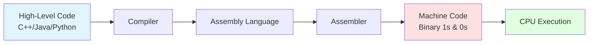

---

## 2.0 Instruction Set Architecture (ISA)

### 2.1 Ορισμός ISA

Το **ISA** (Instruction Set Architecture) αποτελεί το σύνολο των εντολών που μία CPU έχει σχεδιαστεί να κατανοεί και να εκτελεί. Λειτουργεί ως η διεπαφή μεταξύ λογισμικού και υλικού.

**Κύρια ISA:**
- i. **x86** (Intel, AMD - Desktop/Server)
- ii. **MIPS** (Embedded Systems)
- iii. **ARM** (Mobile Devices, IoT)
- iv. **RISC-V** (Open-Source, Research)
- v. **PowerPC** (Legacy Systems)

### 2.2 Κατηγοριοποίηση ISA

| Κατηγορία | Χαρακτηριστικά | Παραδείγματα |
|-----------|----------------|--------------|
| **Σταθερού Μήκους** | Κάθε εντολή έχει προκαθορισμένο αριθμό bits | RISC-V, ARM, MIPS |
| **Μεταβλητού Μήκους** | Διαφορετικό μήκος εντολών, μεγαλύτερη ευελιξία | x86, x86-64 |

### 2.3 Παράδειγμα: RISC-V Encoding

> [!INFO] **RISC-V Instruction Format**
> Κάθε εντολή RISC-V είναι **32-bit** (σταθερού μήκους).

**Δομή Εντολής:**
```
[31-25] [24-20] [19-15] [14-12] [11-7] [6-0]
  funct7   rs2     rs1    funct3   rd   opcode
```

- **opcode (7-bit):** Καθορίζει τον τύπο της εντολής
- **rd, rs1, rs2:** Υποδεικνύουν καταχωρητές
- **funct3, funct7:** Προσδιορίζουν την ακριβή λειτουργία

**Μετάφραση Assembly σε Binary:**

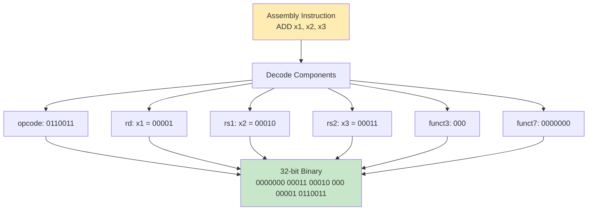

---

## 3.0 Βήματα Εκτέλεσης Εντολής (Instruction Cycle)

### 3.1 Τετραφασικός Κύκλος Εντολής

**Φάση 1: Fetch (Ανάκτηση)**
- i. Η CPU ανακτά την εντολή από τη μνήμη
- ii. Χρησιμοποιεί το Program Counter (PC) για τη διεύθυνση

**Φάση 2: Decode (Αποκωδικοποίηση)**
- i. Αναγνωρίζει τον τύπο εντολής
- ii. Κατηγοριοποίηση: αριθμητική, διακλάδωση, μνήμης

**Φάση 3: Execute (Εκτέλεση)**
- i. Ανάκτηση τελεστέων από καταχωρητές ή μνήμη
- ii. Εκτέλεση πράξης από την ALU

**Φάση 4: Write-Back (Εγγραφή Αποτελέσματος)**
- i. Αποθήκευση αποτελέσματος σε καταχωρητή
- ii. Ή εγγραφή στη μνήμη

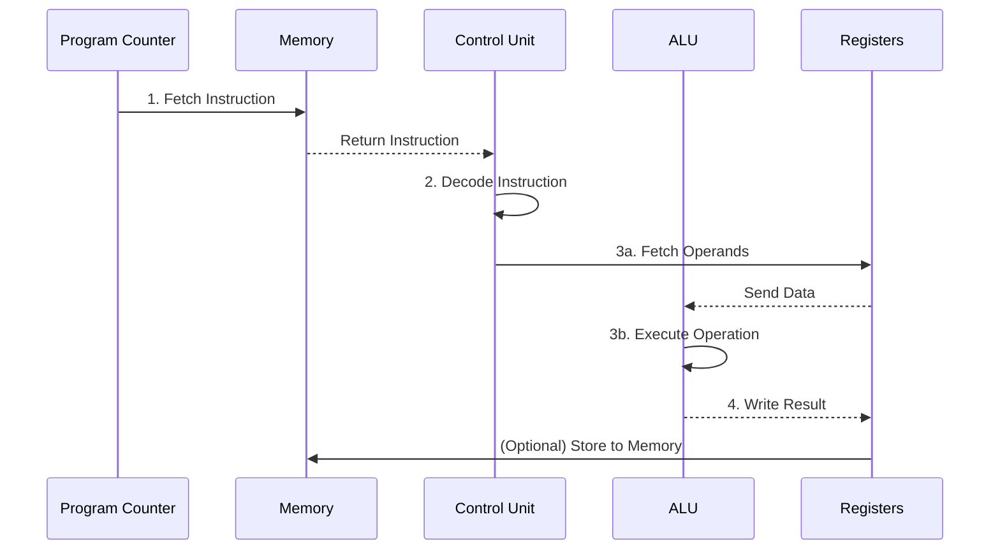

> [!INFO] **64-bit Επεξεργαστές**
> Οι σύγχρονοι επεξεργαστές είναι 64-bit, επιτρέποντας διαχείριση τιμών δεδομένων και διευθύνσεων **έως 64 bits** ($2^{64}$ διευθύνσεις μνήμης).

---

## 4.0 Διασωλήνωση (Pipelining)

### 4.1 Έννοια και Στόχος

**Ορισμός:** Τεχνική που χωρίζει τα βασικά στάδια εκτέλεσης εντολής σε **20+ μικρότερα βήματα** για βελτίωση απόδοσης.

**Αναλογία:** Όπως ένας σωλήνας χρειάζεται χρόνο να γεμίσει με υγρό, έτσι και ο επεξεργαστής χρειάζεται χρόνο να γεμίσει το pipeline με δεδομένα. Μετά το γέμισμα, επιτυγχάνεται **συνεχής και σταθερή ροή** επεξεργασίας.

### 4.2 Παράδειγμα 5-Stage Pipeline

```mermaid
gantt
    title CPU Pipeline - 5 Stages Execution
    dateFormat X
    axisFormat %L
    
    section Instruction 1
    Fetch    :a1, 0, 1
    Decode   :a2, 1, 1
    Execute  :a3, 2, 1
    Memory   :a4, 3, 1
    WriteBack:a5, 4, 1
    
    section Instruction 2
    Fetch    :b1, 1, 1
    Decode   :b2, 2, 1
    Execute  :b3, 3, 1
    Memory   :b4, 4, 1
    WriteBack:b5, 5, 1
    
    section Instruction 3
    Fetch    :c1, 2, 1
    Decode   :c2, 3, 1
    Execute  :c3, 4, 1
    Memory   :c4, 5, 1
    WriteBack:c5, 6, 1
    
    section Instruction 4
    Fetch    :d1, 3, 1
    Decode   :d2, 4, 1
    Execute  :d3, 5, 1
    Memory   :d4, 6, 1
    WriteBack:d5, 7, 1
```

**Πλεονεκτήματα:**
- i. Παράλληλη εκτέλεση πολλαπλών εντολών
- ii. Βελτίωση throughput (εντολές/δευτερόλεπτο)
- iii. Αποδοτικότερη χρήση hardware resources

---

## 5.0 Υπερκλιμακωτή Αρχιτεκτονική (Superscalar)

### 5.1 Ορισμός και Χαρακτηριστικά

**Superscalar Architecture:** Αρχιτεκτονική που επιτρέπει την **ταυτόχρονη εκτέλεση πολλαπλών εντολών** σε κάθε χρονική στιγμή, αξιοποιώντας όλα τα στάδια της διασωλήνωσης.

**Μηχανισμός:**
- i. Ανίχνευση ανεξάρτητων εντολών
- ii. Προγραμματισμός ταυτόχρονης εκτέλεσης
- iii. Αποφυγή data hazards και dependencies

### 5.2 Simultaneous Multithreading (SMT)

**Τεχνολογία:** Κοινή εφαρμογή υπερκλιμακωτής αρχιτεκτονικής που επιτρέπει σε **έναν φυσικό πυρήνα** να εκτελεί **πολλαπλά threads** ταυτόχρονα.

**Παράδειγμα - Intel Hyper-Threading:**
- 1 φυσικός πυρήνας = 2 λογικοί πυρήνες
- Επεξεργαστής 8 πυρήνων → 16 threads

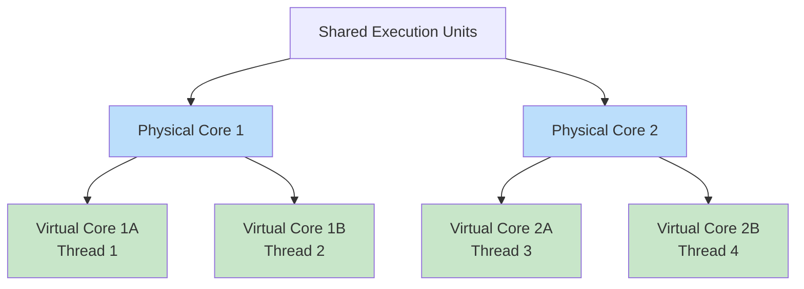

---

## 6.0 Ιεραρχία Μνήμης

### 6.1 Δομή Πυραμίδας Μνήμης

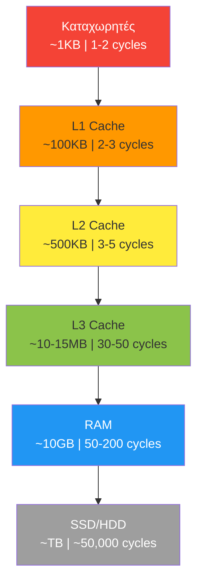

### 6.2 Αρχές Ιεραρχίας

**Καθώς "κατεβαίνουμε" την ιεραρχία:**

| Χαρακτηριστικό | Τάση |
|----------------|------|
| **Κόστος ανά bit** | ↓ Μειώνεται |
| **Χωρητικότητα** | ↑ Αυξάνεται |
| **Χρόνος προσπέλασης** | ↑ Μεγαλώνει |
| **Συχνότητα προσπέλασης** | ↓ Μειώνεται |

**Αιτιολόγηση Κόστους:**
- i. **Ανώτερες μνήμες (Cache):** Χρησιμοποιούν ~6 transistors/bit → υψηλό κόστος
- ii. **Κατώτερες μνήμες (HDD/SSD):** Απλούστερη αρχιτεκτονική → χαμηλό κόστος

### 6.3 Κρυφή Μνήμη (Cache) - Αρχιτεκτονική

**Τυπική Διάταξη σε Multi-Core CPU:**

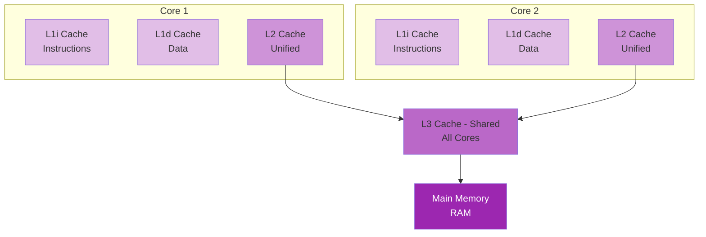

**Χαρακτηριστικά:**
- i. **L1 Cache:** Διαχωρισμός σε Instruction (L1i) και Data (L1d) cache
- ii. **L2 Cache:** Μία ανά πυρήνα, μεγαλύτερη χωρητικότητα
- iii. **L3 Cache:** Κοινόχρηστη μεταξύ **όλων των πυρήνων**

### 6.4 Cache Access Pattern

**Διαδικασία Αναζήτησης Δεδομένων:**

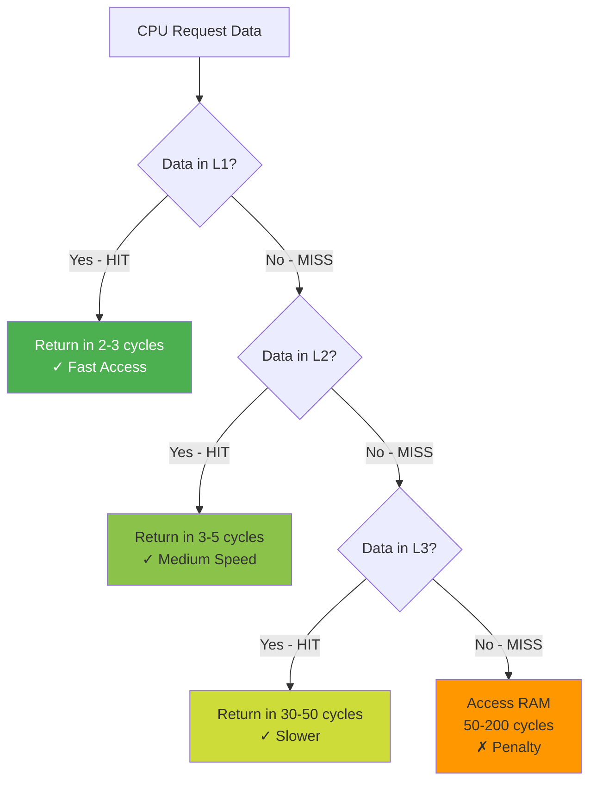

### 6.5 Σημασία της Cache

**Ρόλος:**
- i. Αποθήκευση **συχνά χρησιμοποιούμενων** εντολών και δεδομένων
- ii. Ελαχιστοποίηση προσβάσεων στη βραδύτερη RAM
- iii. Κρίσιμη για απόδοση - **χωρίς cache η απόδοση καταρρέει**

**Temporal Locality:** Δεδομένα που χρησιμοποιήθηκαν πρόσφατα πιθανόν να ξαναχρησιμοποιηθούν.

**Spatial Locality:** Δεδομένα κοντινά στη μνήμη πιθανόν να χρειαστούν σύντομα.

### 6.6 Memory Latency Analysis

> [!INFO] **Πειραματικά Δεδομένα (Sandra 2013 SP3)**

**Βασικά Ευρήματα:**
- i. **0-256KB:** Χαμηλό latency (~5-10 cycles) - Δεδομένα στην L1/L2
- ii. **256KB-16MB:** Μεσαίο latency (~30-50 cycles) - L3 Cache
- iii. **16MB+:** Απότομη αύξηση (~100+ cycles) - RAM access

**Συμπέρασμα:** Η cache εξασφαλίζει σταθερά χαμηλό latency έως το όριο χωρητικότητάς της.

---

## 7.0 Σύγκριση Cache σε Σύγχρονους Επεξεργαστές

### 7.1 Πίνακας Σύγκρισης Intel Core (2017-2018)

| Spec | i7-7820X | i7-8700K | i9-9900K | i7-9700K |
|------|----------|----------|----------|----------|
| **Release Date** | June 2017 | Oct 2017 | Oct 2018 | Oct 2018 |
| **Cores/Threads** | 8/16 | 6/12 | **8/16** | 8/8 |
| **Base Freq** | 3.6 GHz | 3.5 GHz | 3.6 GHz | 3.6 GHz |
| **Max Boost** | 4.3 GHz | 4.7 GHz | **5.0 GHz** | 4.9 GHz |
| **L2 Cache** | **8 MB** | 1.5 MB | 2 MB | 2 MB |
| **L3 Cache** | 11 MB | 12 MB | **16 MB** | 12 MB |
| **Memory Config** | **Quad-Channel** | Dual-Channel | Dual-Channel | Dual-Channel |
| **Max Memory** | DDR4-2666 | DDR4-2666 | DDR4-2666 | DDR4-2666 |
| **TDP** | 140W | 95W | 95W | 95W |
| **MSRP** | $600 | $360 | $500 | $374 |

**Βασικές Παρατηρήσεις:**
- i. **i9-9900K:** Κορυφαία απόδοση (5.0 GHz boost, 16 MB L3)
- ii. **i7-7820X:** Μέγιστη L2 cache (8 MB), Quad-Channel μνήμη
- iii. **Hyper-Threading:** Οι i7-7820X, i7-8700K, i9-9900K υποστηρίζουν SMT

---

## 8.0 Πρόβλεψη Διακλάδωσης (Branch Prediction)

### 8.1 Πρόβλημα Διακλαδώσεων

**Σενάριο:**
```c
if (condition) {
    // Path A
} else {
    // Path B
}
```

**Πρόκληση:** Σε pipelined CPU, η επόμενη εντολή πρέπει να φορτωθεί **πριν** υπολογιστεί η συνθήκη. Ποιο μονοπάτι να διαλέξει;

### 8.2 Κερδοσκοπική Εκτέλεση (Speculative Execution)

**Μηχανισμός:**
- i. Η CPU **προβλέπει** την πιθανότερη διαδρομή
- ii. Ξεκινά εκτέλεση εντολών από το προβλεπόμενο μονοπάτι
- iii. **Αν σωστό:** Κέρδος απόδοσης, συνέχεια εκτέλεσης
- iv. **Αν λάθος:** Pipeline flush, επανεκκίνηση από σωστό μονοπάτι

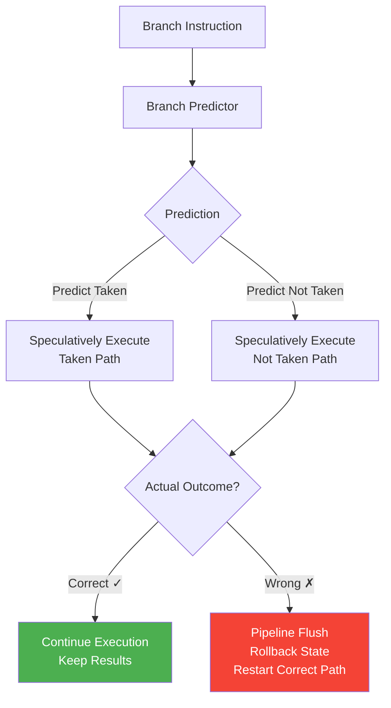

### 8.3 Machine Learning στην Πρόβλεψη

**Αλγόριθμοι Πρόβλεψης:**
- i. Παρακολούθηση ιστορικού διακλαδώσεων
- ii. **Μάθηση μοτίβων** συμπεριφοράς
- iii. Προσαρμογή βάσει αποτελεσμάτων

**Απόδοση:** Σύγχρονοι επεξεργαστές επιτυγχάνουν **>90% ακρίβεια** στην πρόβλεψη διακλαδώσεων.

---

## 9.0 CISC vs RISC Architectures

### 9.1 Φιλοσοφία Σχεδίασης

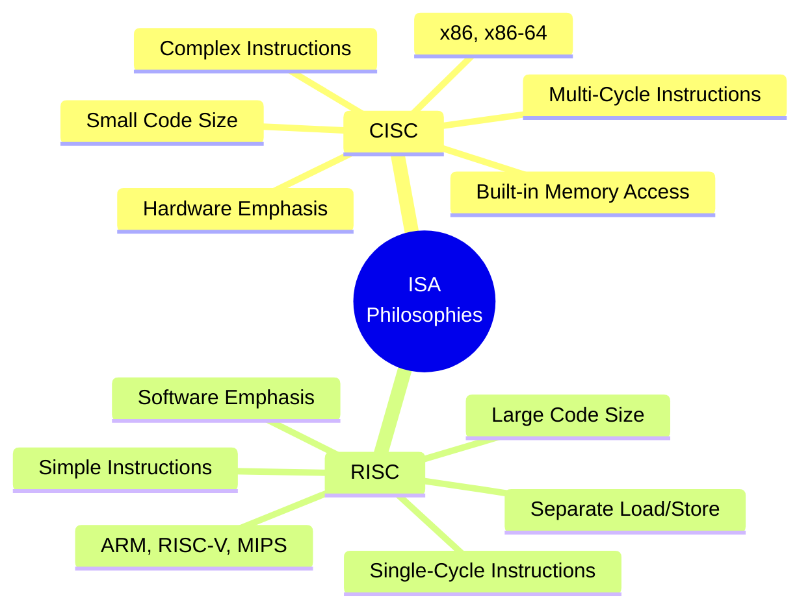

### 9.2 Πίνακας Σύγκρισης

| Κριτήριο | CISC | RISC |
|----------|------|------|
| **Έμφαση** | Υλικό (Hardware) | Λογισμικό (Software) |
| **Πολυπλοκότητα Εντολών** | Πολλαπλών κύκλων, πολύπλοκες | Ενός κύκλου, απλές |
| **Memory Access** | Ενσωματωμένο σε εντολές (LOAD+ADD) | Ξεχωριστά LOAD/STORE |
| **Μέγεθος Κώδικα** | Μικρό | Μεγάλο |
| **Κύκλοι/Εντολή** | Υψηλό | Χαμηλό |
| **Καταχωρητές** | Περιορισμένοι | Πολλοί (για ταχύτητα) |
| **Χρήση Transistors** | Υλοποίηση πολύπλοκων εντολών | Περισσότεροι καταχωρητές |
| **Παραδείγματα** | Intel x86, AMD64 | ARM, RISC-V, MIPS, PowerPC |

### 9.3 Σύγχρονες Τάσεις

**Σύγκλιση Αρχιτεκτονικών:**
- i. Σύγχρονοι x86 επεξεργαστές χρησιμοποιούν **μικροεντολές (μ-ops)** RISC-like εσωτερικά
- ii. ARM επεξεργαστές ενσωματώνουν πολύπλοκες εντολές (π.χ. NEON SIMD)
- iii. Υβριδικές προσεγγίσεις για βέλτιστη απόδοση

---

## 10.0 Εσωτερική Δομή CPU

### 10.1 Βασικά Συστατικά

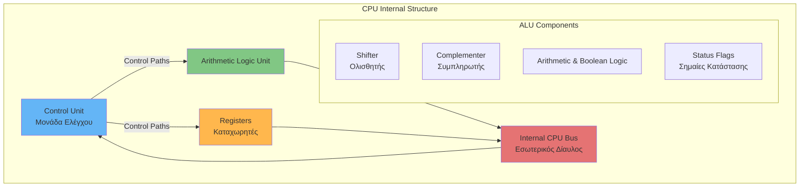

### 10.2 Λεπτομέρειες Μονάδων

**i. Arithmetic Logic Unit (ALU)**
- Αριθμητικές πράξεις: $+, -, \times, \div$
- Λογικές πράξεις: AND, OR, XOR, NOT
- Bit operations: Shift, Rotate
- Σημαίες: Zero, Carry, Overflow, Negative

**ii. Καταχωρητές (Registers)**
- General Purpose Registers (GPR)
- Special Purpose: PC, SP, Status Register
- Προσωρινή αποθήκευση δεδομένων

**iii. Μονάδα Ελέγχου (Control Unit)**
- Συντονισμός λειτουργίας όλων των μονάδων
- Δημιουργία control signals
- Timing και sequencing

---

## 11.0 Σύγχρονη Αρχιτεκτονική Πλατφόρμας

### 11.1 AMD Ryzen Threadripper X399

**Χαρακτηριστικά Πλατφόρμας:**

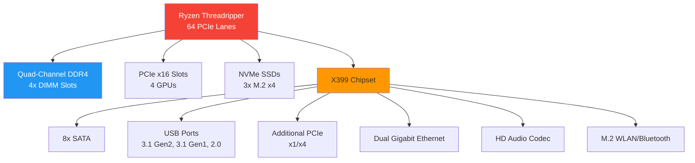

**Πλεονεκτήματα "No Dark" Φιλοσοφίας:**
- **No Dark Lanes:** Όλα τα PCIe lanes ενεργά
- **No Dark Channels:** Πλήρης χρήση Quad-Channel μνήμης
- **No Dark Ports:** Όλες οι θύρες λειτουργικές ταυτόχρονα

### 11.2 AMD Ryzen Mobile Processors (2020)

**Τεχνολογία 7nm "Zen 2":**

| Μοντέλο | Cores/Threads | Cache | TDP | GPU | Use Case |
|---------|---------------|-------|-----|-----|----------|
| Ryzen 7 4800H | 8C/16T | 12 MB | 45W | Radeon 7 (1600MHz) | Gaming/Creation |
| Ryzen 5 4600H | 6C/12T | 11 MB | 45W | Radeon 6 (1500MHz) | Gaming |
| Ryzen 7 4800U | 8C/16T | 12 MB | **15W** | Radeon 8 (1750MHz) | **Ultrathin** |
| Ryzen 5 4600U | 6C/12T | 11 MB | 15W | Radeon 6 (1500MHz) | Mainstream |
| Ryzen 3 4300U | 4C/4T | 6 MB | 15W | Radeon 5 (1400MHz) | Entry-level |
| Athlon Gold 3150U | 2C/4T | 5 MB | 15W | Radeon 3 (1000MHz) | Budget |

**Βασικά Χαρακτηριστικά:**
- i. Υποστήριξη Wi-Fi 6 & Bluetooth 5
- ii. 4K HDR display compatibility
- iii. 7nm process → Χαμηλή κατανάλωση ισχύος

---

## 12.0 Κατασκευή CPU (Manufacturing Process)

### 12.1 Διαδικασία Παραγωγής

**Βήμα 1: Εξαγωγή Πυριτίου από Άμμο**

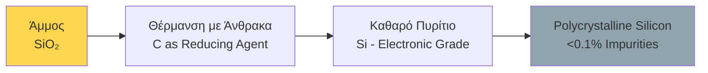

**Χημική Αντίδραση:**
$$
\text{SiO}_2 + 2\text{C} \xrightarrow{\Delta} \text{Si} + 2\text{CO}
$$

**Βήμα 2: Δημιουργία Monocrystalline Ingot**

- i. Το πολυκρυσταλλικό πυρίτιο τήκεται
- ii. Σχηματισμός κυλινδρικού πλινθίου (boule/ingot)
- iii. Καθαρότητα >99.9%
- iv. Μονοκρυσταλλική δομή για ομοιόμορφες ηλεκτρικές ιδιότητες

**Βήμα 3: Τεμαχισμός σε Wafers**

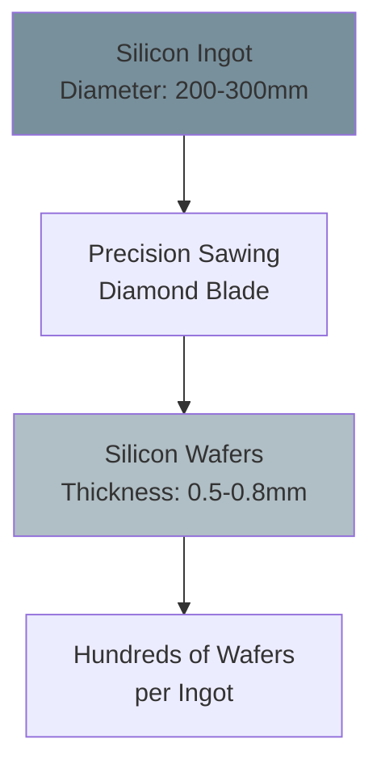

**Βήμα 4: Chemical-Mechanical Polishing (CMP)**

**Στόχος:** Επιφάνεια ποιότητας καθρέφτη

- i. **Εξομάλυνση:** Αφαίρεση ανωμαλιών από κοπή
- ii. **Απολύμανση:** Αφαίρεση σωματιδίων
- iii. **Βελτίωση ποιότητας:** Ετοιμότητα για φωτολιθογραφία

**Βήμα 5: Photolithography - Έκθεση σε UV**

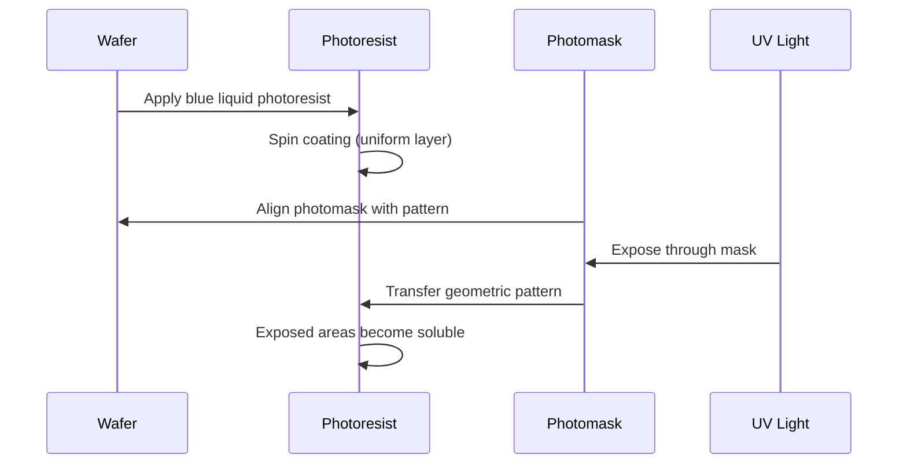

**Βήμα 6: Πλύση και Χάραξη (Etching)**

- i. **Πλύση:** Χημικός διαλύτης αφαιρεί εκτεθειμένο photoresist
- ii. **Χάραξη:** Αφαίρεση υποστρώματος σύμφωνα με το μοτίβο
- iii. **Επανάληψη:** 20-30+ στάδια για πολλαπλά στρώματα

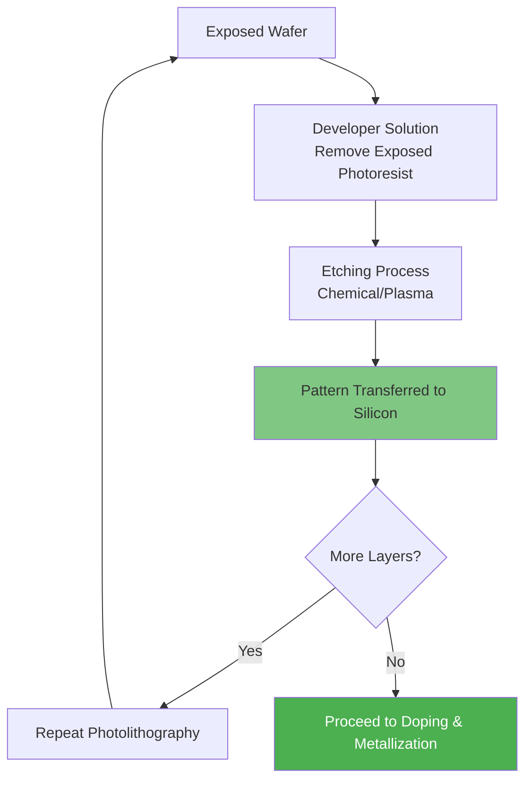

### 12.2 Τελικά Στάδια

**Doping:** Προσθήκη ακαθαρσιών (π.χ. Phosphorus, Boron) για δημιουργία p-n junctions

**Metallization:** Δημιουργία διασυνδέσεων με χαλκό/αλουμίνιο

**Testing & Dicing:**
- i. Ηλεκτρικός έλεγχος κάθε chip στο wafer
- ii. Κοπή σε μεμονωμένα dies
- iii. Packaging (τοποθέτηση σε substrate, heat spreader)

---

## 13.0 Βασικοί Τύποι και Μετρικές Απόδοσης

### 13.1 Απόδοση Pipeline

**Speedup Factor:**
$$
S = \frac{T_{\text{sequential}}}{T_{\text{pipelined}}} = \frac{n \times k}{k + (n-1)}
$$

Όπου:
- $n$ = αριθμός εντολών
- $k$ = αριθμός σταδίων pipeline

**Για μεγάλο $n$:**
$$
S_{\max} \approx k
$$

### 13.2 Cache Performance

**Average Memory Access Time (AMAT):**
$$
\text{AMAT} = T_{\text{cache}} + (\text{Miss Rate} \times T_{\text{miss penalty}})
$$

**Παράδειγμα:**
- $T_{\text{L1}} = 3$ cycles, Miss Rate = 5%, $T_{\text{RAM}} = 100$ cycles

$$
\text{AMAT} = 3 + (0.05 \times 100) = 8 \text{ cycles}
$$

### 13.3 Branch Prediction Accuracy

**Effective CPI (Cycles Per Instruction):**
$$
\text{CPI}_{\text{eff}} = \text{CPI}_{\text{ideal}} + (\text{Branch Freq} \times \text{Mispredict Rate} \times \text{Penalty})
$$

**Παράδειγμα:**
- Ideal CPI = 1, 20% branches, 10% mispredicts, Penalty = 10 cycles

$$
\text{CPI}_{\text{eff}} = 1 + (0.2 \times 0.1 \times 10) = 1.2
$$

---

## 14.0 Βασικοί Ορισμοί - Γλωσσάριο

| Όρος | Ορισμός |
|------|---------|
| **ISA** | Instruction Set Architecture - Σύνολο εντολών που κατανοεί μία CPU |
| **Pipeline** | Τεχνική διαίρεσης εκτέλεσης εντολής σε στάδια για παράλληλη επεξεργασία |
| **Cache Hit** | Εύρεση ζητούμενων δεδομένων στην cache μνήμη |
| **Cache Miss** | Αποτυχία εύρεσης δεδομένων στην cache, απαιτείται πρόσβαση σε χαμηλότερο επίπεδο |
| **Latency** | Χρόνος που απαιτείται για την προσπέλαση δεδομένων (σε cycles) |
| **Throughput** | Αριθμός εντολών που ολοκληρώνονται ανά μονάδα χρόνου |
| **Superscalar** | Αρχιτεκτονική που εκτελεί >1 εντολές ανά κύκλο ρολογιού |
| **SMT** | Simultaneous Multithreading - Πολλαπλά threads σε έναν φυσικό πυρήνα |
| **Speculative Execution** | Εκτέλεση εντολών με βάση πρόβλεψη, πριν την επιβεβαίωση |
| **Photolithography** | Τεχνική μεταφοράς μοτίβων σε wafer με χρήση UV φωτός |
| **Wafer** | Λεπτή φέτα πυριτίου όπου κατασκευάζονται τα chips |
| **CMP** | Chemical-Mechanical Polishing - Στίλβωση wafer |

---

## 15.0 Βασικές Αρχές Σχεδιασμού

### 15.1 Memory Hierarchy Design Principles

**i. Locality Principles**
- **Temporal Locality:** Πρόσφατα χρησιμοποιημένα δεδομένα θα ξαναχρησιμοποιηθούν
- **Spatial Locality:** Δεδομένα σε γειτονικές διευθύνσεις πιθανόν να χρειαστούν

**ii. Inclusion Property**
```
L1 ⊆ L2 ⊆ L3 ⊆ RAM
```
Τα δεδομένα σε υψηλότερο επίπεδο συνήθως υπάρχουν και σε χαμηλότερο.

### 15.2 Pipeline Design Principles

**i. Balance Pipeline Stages**
- Ίσος χρόνος εκτέλεσης ανά στάδιο
- Αποφυγή bottlenecks

**ii. Hazard Management**
- **Data Hazards:** Forwarding, stalls
- **Control Hazards:** Branch prediction
- **Structural Hazards:** Resource duplication

### 15.3 Amdahl's Law

**Όριο Επιτάχυνσης:**
$$
S_{\text{overall}} = \frac{1}{(1-P) + \frac{P}{S}}
$$

Όπου:
- $P$ = Ποσοστό κώδικα που βελτιώνεται
- $S$ = Speedup του βελτιωμένου τμήματος

**Συμπέρασμα:** Βελτιώσεις σε σπάνιες περιπτώσεις έχουν μικρή συνολική επίδραση.

---

## 16.0 Αναφορές & Πόροι

### 16.1 Εκπαιδευτικά Βίντεο

**CPU Manufacturing:**
- Branch Education: "How It's Made - CPU"
- "How are Microchips Made, CPU Manufacturing Process Steps"

**CPU Operation:**
- Branch Education: "The Engineering that Runs the Digital World, How do CPUs Work?"

### 16.2 Συμπληρωματική Μελέτη

**Θεματικές Περιοχές:**
- i. Out-of-Order Execution
- ii. Tomasulo's Algorithm
- iii. Cache Coherence Protocols (MESI, MOESI)
- iv. Virtual Memory & TLB
- v. SIMD/Vector Processing
- vi. GPU Architecture Fundamentals

---

## 📚 Τέλος Smart Notes

> **Σημείωση:** Αυτές οι σημειώσεις συνθέτουν το περιεχόμενο της 8ης διάλεξης για τη Διαδικασία Σχεδίασης Επεξεργαστών. Για βαθύτερη κατανόηση, συμβουλευτείτε τα εκπαιδευτικά βίντεο και πραγματοποιήστε hands-on πειράματα με simulators (π.χ. RISC-V simulator, cache simulators).
