# 1.0 Παραλληλισμός σε επίπεδο εντολών (ILP) και Υπερβαθμωτοί Επεξεργαστές

## 1.1 Ιστορικό πλαίσιο και εξελίξεις

i. Μεγάλες εξελίξεις στην αρχιτεκτονική Η/Υ  
- Οικογένειες υπολογιστών: IBM System/360 (1964), DEC PDP-8.  
- Διαχωρισμός αρχιτεκτονικής από υλοποίηση.  
- Μικροπρογραμματισμός μονάδας ελέγχου: πρόταση Wilkes (1951), υλοποίηση IBM S/360 (1964).  
- Εισαγωγή κρυφής μνήμης: IBM S/360 Model 85 (1969).  
- Solid-state RAM.  
- Μικροεπεξεργαστές: Intel 4004 (1971).  
- Διασωλήνωση: εισάγει παραλληλισμό στην προσκόμιση–εκτέλεση εντολών.  
- Πολυεπεξεργαστές.  
- Υπερβαθμωτές (superscalar) μηχανές: οι πρώτες εμπορικές υλοποιήσεις 1–2 χρόνια μετά την επινόηση του όρου (RISC 6–7 χρόνια μετά).

ii. Εμφάνιση υπερβαθμωτής προσέγγισης  
- Ο όρος «superscalar» εμφανίζεται το 1987.  
- Σχεδιάζεται για βελτίωση της απόδοσης με εκτέλεση πολλών εντολών ταυτόχρονα.  
- Στις περισσότερες εφαρμογές, οι πράξεις γίνονται σε βαθμωτές ποσότητες (scalar).  
- Η υπερβαθμωτή προσέγγιση είναι το επόμενο βήμα στους επεξεργαστές υψηλής απόδοσης (σε RISC και CISC).

iii. Ορισμός βαθμωτών ποσοτήτων  
- Βαθμωτές ποσότητες: φυσικά μεγέθη που καθορίζονται πλήρως από ένα μέτρο και μία μονάδα μέτρησης, χωρίς κατεύθυνση.

***

# 2.0 Υπερβαθμωτός Επεξεργαστής – Βασική Ιδέα

## 2.1 Ορισμός και χαρακτηριστικά

i. Βασικά χαρακτηριστικά υπερβαθμωτού επεξεργαστή  
- Χρήση πολλαπλών ανεξάρτητων σωληνώσεων εντολών (multiple instruction pipelines).  
- Πολλαπλές λειτουργικές μονάδες (ALU, FPU, load/store κ.λπ.).  
- Νέο επίπεδο παραλληλισμού: ταυτόχρονη επεξεργασία πολλών εντολών ανά κύκλο.  
- Τυποποιημένη μέθοδος υλοποίησης μικροεπεξεργαστών υψηλής απόδοσης.  
- Εφαρμόζεται σε RISC και CISC αρχιτεκτονικές.

ii. Γιατί υπερβαθμωτός;  
- Πολλές εντολές επεξεργάζονται σύνθετες ποσότητες δεδομένων.  
- Η επιτάχυνση της εκτέλεσης αυτών των εντολών βελτιώνει σημαντικά την απόδοση.  
- Ο παραλληλισμός σε επίπεδο εντολής (ILP) είναι ο μέσος αριθμός εντολών που μπορούν να εκτελούνται ταυτόχρονα.

***

> [!INFO]
> **Ροή δεδομένων σε υπερβαθμωτή οργάνωση εντολών**

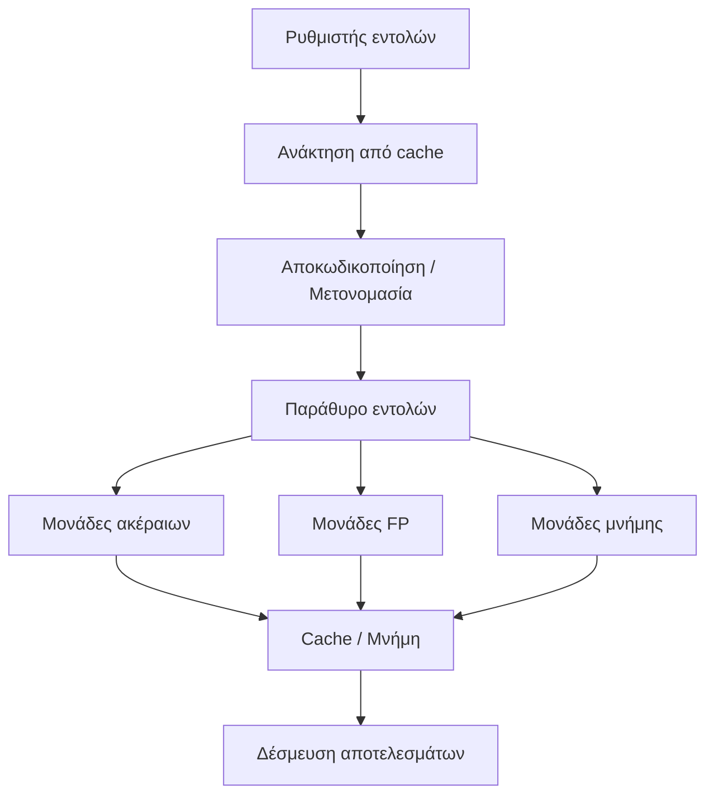

***

# 3.0 Βαθμωτή vs Υπερβαθμωτή Οργάνωση

## 3.1 Συγκριτική Δομή

| Χαρακτηριστικό                     | Βαθμωτή Οργάνωση (Scalar)                                      | Υπερβαθμωτή Οργάνωση (Superscalar)                            |
|-----------------------------------|----------------------------------------------------------------|----------------------------------------------------------------|
| Αριθμός εντολών/κύκλο             | Τυπικά 1                                                       | >1 (2, 3, 4, …)                                                |
| Λειτουργικές μονάδες ακέραιων     | 1 μονάδα με διασωλήνωση                                       | Πολλαπλές μονάδες με διασωλήνωση                              |
| Λειτουργικές μονάδες FPU          | 1 μονάδα με διασωλήνωση                                       | Πολλαπλές μονάδες με διασωλήνωση                              |
| Αρχείο καταχωρητών                | Ένα ανά τύπο πράξεων (int, FP)                                | Πολλαπλά αρχεία, συχνά διευρυμένα με δυναμικούς καταχωρητές   |
| Παραλληλία εκτέλεσης              | Περιορισμένη (μια εντολή κάθε φορά ανά μονάδα)                | Ταυτόχρονη εκτέλεση πολλών εντολών                           |
| Πολυπλοκότητα λογικού             | Χαμηλή                                                         | Υψηλή (πρόβλεψη, μετονομασία, αναδιάταξη)                     |
| Απόδοση σε ILP                    | Περιορισμένη                                                   | Υψηλή, εκμεταλλεύεται ILP και παραλληλισμό μηχανής           |

***

> [!INFO]
> **Σύγκριση βαθμωτής και υπερβαθμωτής οργάνωσης**

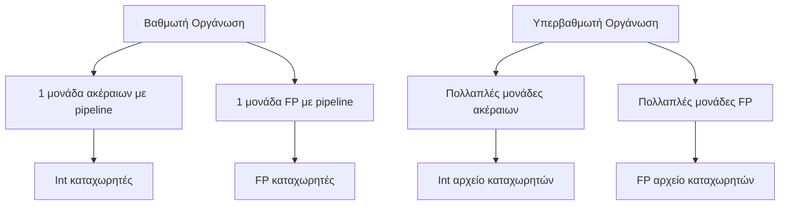

***

# 4.0 Διασωλήνωση, Υπερ-διασωλήνωση και Superscalar

## 4.1 Βασικά στάδια διασωλήνωσης

i. Τυπική διασωλήνωση 4 σταδίων  
1. Ανάκληση εντολής.  
2. Αποκωδικοποίηση λειτουργίας.  
3. Εκτέλεση λειτουργίας.  
4. Εγγραφή αποτελέσματος.

ii. Υπερ-διασωλήνωση  
- Πολλαπλά στάδια διασωλήνωσης εκτελούνται ανά κύκλο.  
- Πολλές εντολές προσκομίζονται ταυτόχρονα, αλλά κάθε στιγμή μία βρίσκεται στο στάδιο εκτέλεσης.

iii. Superscalar vs Υπερ-διασωλήνωση  
- Υπερ-διασωλήνωση: αυξάνει το βάθος της διασωλήνωσης (περισσότερα στάδια).  
- Superscalar: αυξάνει το πλάτος (πολλαπλές εντολές ταυτόχρονα σε κάθε στάδιο).

***

> [!INFO]
> **Σύγκριση απλής διασωλήνωσης, υπερ-διασωλήνωσης και superscalar**

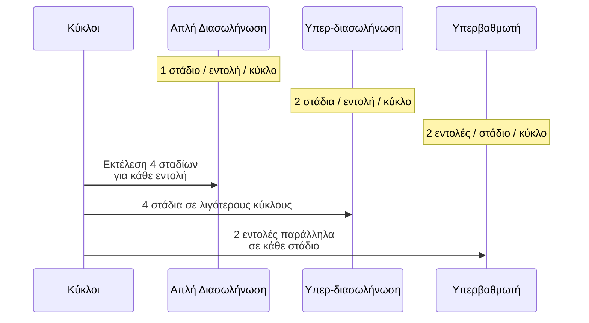

***

# 5.0 Περιορισμοί Παραλληλισμού σε Υπερβαθμωτούς

## 5.1 Είδη εξαρτήσεων

i. Πραγματικές εξαρτήσεις δεδομένων (RAW – Read After Write)  
Παράδειγμα:  
- ADD r1, r2   (r1 := r1 + r2)  
- MOVE r3, r1  (r3 := r1)

Η δεύτερη εντολή χρειάζεται το αποτέλεσμα της πρώτης. Δεν μπορεί να εκτελεστεί πριν ολοκληρωθεί η ADD. Αν η εξάρτηση περιλαμβάνει φόρτωση από μνήμη, η καθυστέρηση αυξάνεται (ιδίως σε αστοχία cache).

ii. Εξαρτήσεις διαδικασιών  
- Όταν η σειρά εκτέλεσης πρέπει να διατηρηθεί για ορθότητα (π.χ. διακλαδώσεις, μεταβλητού μήκους εντολές).  
- Η ανάγκη αποκωδικοποίησης για προσδιορισμό προσβάσεων μνήμης μπορεί να εμποδίσει ταυτόχρονη ανάκληση εντολών.

iii. Διαμάχες πόρων (resource conflicts)  
- Πολλαπλές εντολές διεκδικούν τον ίδιο πόρο:  
  - Μνήμη ή cache.  
  - Λειτουργικές μονάδες (ALU, FPU).  
- Λύση: αύξηση πόρων (πολλαπλές μονάδες).

iv. Εξαρτήσεις εξόδων (WAW – Write After Write)  
Παράδειγμα:  
- R3 := R3 + R5  (I1)  
- R4 := R3 + 1   (I2)  
- R3 := R5 + 1   (I3)  
- R7 := R3 + R4  (I4)

Η I2 εξαρτάται από I1, ενώ I3 και I4 εξαρτώνται επίσης από I1. Αν I3 ολοκληρωθεί πριν την I1, η τιμή του R3 μπορεί να αλλοιωθεί (write-write hazard).

v. Αντιεξαρτήσεις (WAR – Write After Read)  
Το ίδιο παράδειγμα:  
- I2 χρησιμοποιεί R3 (ανάγνωση).  
- I3 γράφει στο R3.  
Η I3 δεν μπορεί να ολοκληρωθεί πριν ξεκινήσει η I2, επειδή θα κατέστρεφε τιμή που χρειάζεται η I2 (read πριν write).

***

> [!INFO]
> **Επίδραση εξαρτήσεων σε υπερβαθμωτή μηχανή βαθμού 2**

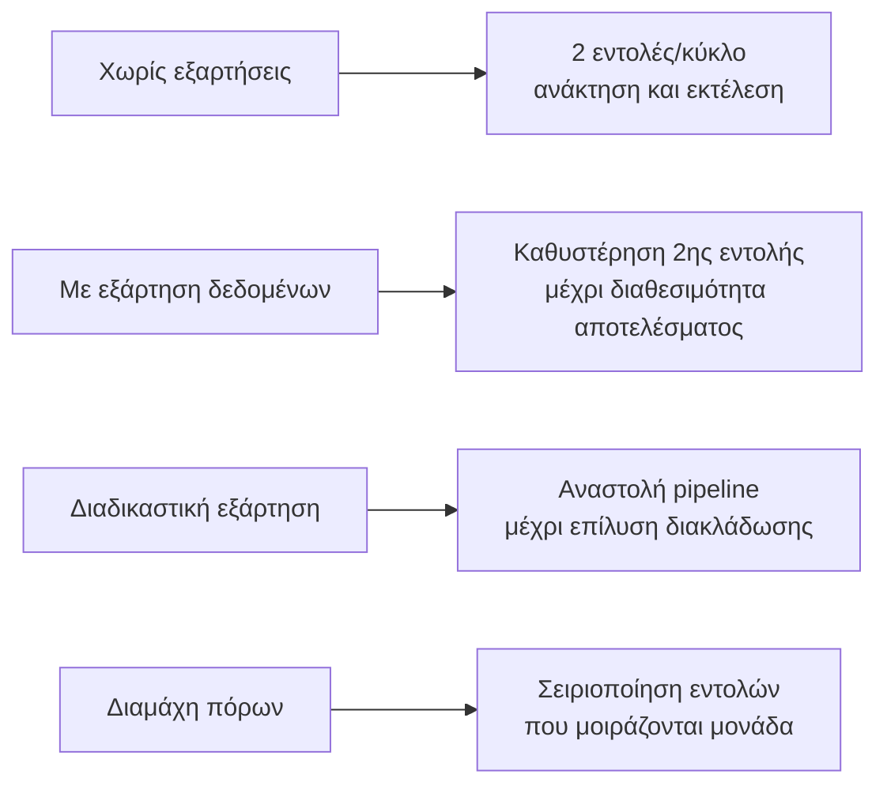

***

## 5.2 Σχεδιαστικά ζητήματα

i. Παραλληλισμός σε επίπεδο εντολής  
- Αριθμός ανεξάρτητων εντολών που μπορούν να εκτελούνται με χρονική επικάλυψη.  
- Περιορίζεται από εξαρτήσεις δεδομένων και διαδικασιών.

ii. Παραλληλισμός μηχανής  
- Δυνατότητα του επεξεργαστή να αξιοποιεί ILP.  
- Εξαρτάται από:  
  - Αριθμό παράλληλων pipelines.  
  - Αποτελεσματικότητα μηχανισμών ανίχνευσης ανεξάρτητων εντολών.

iii. Λανθάνων χρόνος λειτουργίας  
- Χρόνος μέχρι τα αποτελέσματα μιας εντολής να είναι διαθέσιμα στις επόμενες.  
- Καθορίζει καθυστερήσεις λόγω εξαρτήσεων.

***

# 6.0 Πολιτικές Έκδοσης και Ολοκλήρωσης Εντολών

## 6.1 Ορισμοί

i. Σειρά εκτέλεσης (in-order / out-of-order)  
- Βήματα: προσκόμιση – εκτέλεση – ενημέρωση καταχωρητών/μνήμης.  
- Μια εντολή «εκδίδεται» όταν μετακινείται από αποκωδικοποίηση στο πρώτο στάδιο εκτέλεσης.  
- Ο επεξεργαστής εξετάζει επόμενες εντολές για να βελτιώσει την απόδοση.

***

## 6.2 Έκδοση με σειρά – Ολοκλήρωση με σειρά

i. Χαρακτηριστικά  
- Εντολές εκδίδονται και ολοκληρώνονται διαδοχικά.  
- Διατηρείται η σειρά προγράμματος.  
- Απλή αλλά λιγότερο αποδοτική.  
- Συχνές αναστολές λόγω συγκρούσεων και εξαρτήσεων.

ii. Συμπεριφορά σε παράδειγμα  
- I1 απαιτεί 2 κύκλους εκτέλεσης.  
- I3 και I4 ανταγωνίζονται για την ίδια λειτουργική μονάδα.  
- I5 εξαρτάται από αποτέλεσμα της I4 και καθυστερεί.  
- I5 και I6 ανταγωνίζονται επίσης για την ίδια μονάδα.  
- Η ολοκλήρωση παραμένει αυστηρά σειριακή.

***

## 6.3 Έκδοση με σειρά – Ολοκλήρωση εκτός σειράς

i. Χαρακτηριστικά  
- Πολλαπλές εντολές εκτελούνται ταυτόχρονα (μέχρι τον μέγιστο βαθμό παραλληλισμού).  
- Η ολοκλήρωση μπορεί να γίνει με διαφορετική σειρά από την προσκόμιση.  
- Απαιτεί πολύ πιο σύνθετα λογικά κυκλώματα.  
- Σε διακοπές, πρέπει να διασφαλίζεται η ορθότητα της κατάστασης.

ii. Συμπεριφορά  
- I3 και I4 μπορούν να ολοκληρωθούν εκτός σειράς, ανάλογα με τη διαθεσιμότητα της λειτουργικής μονάδας.  
- I5 εξαρτάται από την I4 και εκτελείται μόνον όταν I4 ολοκληρωθεί.  
- Ι5 και Ι6 μοιράζονται λειτουργική μονάδα, ολοκλήρωση ίσως εκτός σειράς.

iii. Σχέση με RISC  
- Εφαρμόζεται ιδιαίτερα σε βαθμωτούς RISC επεξεργαστές.  
- Παράδειγμα: I2 ολοκληρώνεται πριν την I1, επιτρέποντας στην I3 να τελειώσει νωρίτερα και κερδίζοντας έναν κύκλο.

***

## 6.4 Έκδοση εκτός σειράς – Ολοκλήρωση εκτός σειράς

i. Δομή pipeline με παράθυρο εντολών  
- Αποσύνδεση σταδίων αποκωδικοποίησης και εκτέλεσης.  
- Παράθυρο εντολών (instruction window) χωρίζει τη διασωλήνωση σε:  
  - Στάδιο προσκόμισης (in-order).  
  - Στάδιο εκτέλεσης (out-of-order).  
- Ο επεξεργαστής συνεχίζει προσκόμιση/αποκωδικοποίηση όσο το παράθυρο δεν είναι πλήρες.

ii. Ροή σταδίων  
- Ανάκληση → Αποκωδικοποίηση → Μετονομασία → Μεταφορά → Έκδοση → Ανάγνωση καταχωρητή → Εκτέλεση → Πίσω εγγραφή.  
- Απομονωτής εντολών (issue buffer) και απομονωτής επαναδιάταξης (reorder buffer) για διαχείριση σειράς.

iii. Λειτουργία  
- Όταν μια λειτουργική μονάδα είναι διαθέσιμη, εκδίδεται «κατάλληλη» εντολή από το παράθυρο.  
- Μετά την αποκωδικοποίηση, εντολές εξετάζονται μπροστά (look-ahead) για ανεξαρτησία.  
- Αποτελέσματα εκτός σειράς αποθηκεύονται προσωρινά και δεσμεύονται (commit) με σειρά προγράμματος.

***

> [!INFO]
> **Pipeline με έκδοση/ολοκλήρωση εκτός σειράς**

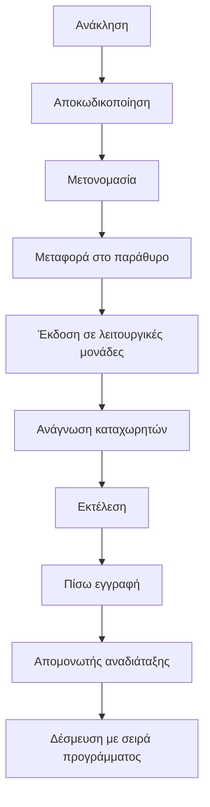

***

# 7.0 Μετονομασία Καταχωρητών

## 7.1 Σκοπός και αποτέλεσμα

i. Προβλήματα χωρίς μετονομασία  
- Εξαρτήσεις δεδομένων, εξόδων και αντιεξαρτήσεις προκαλούν stalls.  
- Στατική κατανομή λογικών καταχωρητών σε φυσικούς επιδεινώνει τις καθυστερήσεις.

ii. Ιδέα μετονομασίας  
- Δυναμική κατανομή φυσικών καταχωρητών από το υλικό.  
- Ουσιαστικά «διπλασιάζονται» οι διαθέσιμοι πόροι (καταχωρητές), αν το επιτρέπει η υλοποίηση.  
- Μειώνονται ψευδοεξαρτήσεις (WAW, WAR).

***

## 7.2 Παράδειγμα με/χωρίς μετονομασία

i. Αρχικό πρόγραμμα  
- R3 := R3 + R5  (I1)  
- R4 := R3 + 1   (I2)  
- R3 := R5 + 1   (I3)  
- R7 := R3 + R4  (I4)

Εδώ:  
- I2 εξαρτάται από αποτέλεσμα της I1 (RAW).  
- I3 γράφει στο R3 που χρησιμοποιείται από I2 (WAR).  
- I1 και I3 γράφουν στο R3 (WAW).

ii. Με μετονομασία καταχωρητών  
- R3b := R3a + R5a  (I1)  
- R4b := R3b + 1    (I2)  
- R3c := R5a + 1    (I3)  
- R7b := R3c + R4b  (I4)

Σημειώσεις:  
- Χωρίς δείκτη (R3) → λογικός καταχωρητής.  
- Με δείκτη (R3a, R3b, R3c) → δυναμικός φυσικός καταχωρητής.

***

> [!INFO]
> **Εννοιολογικό διάγραμμα μετονομασίας καταχωρητών**

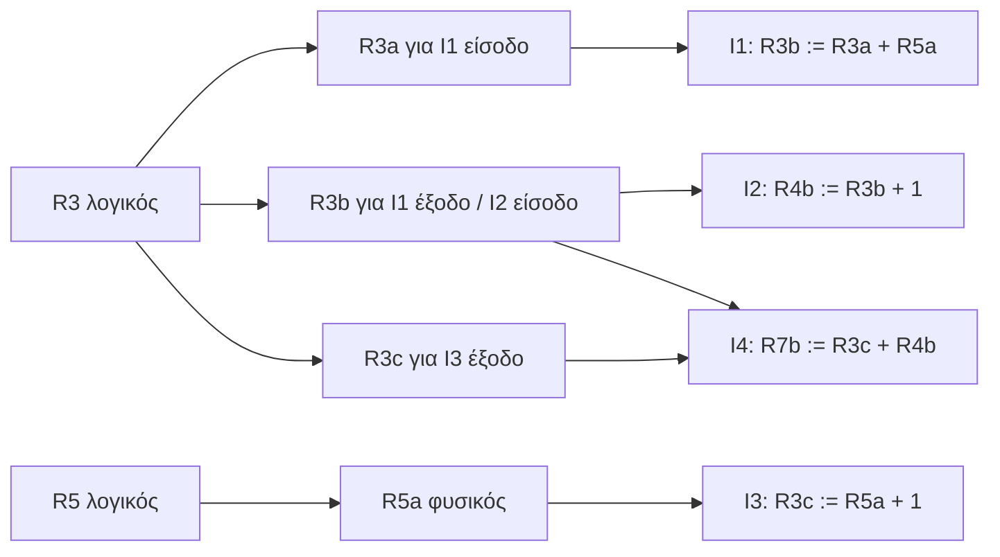

***

# 8.0 Παραλληλισμός Μηχανής και Απόδοση

## 8.1 Διπλασιασμός πόρων, παράθυρο εντολών και μετονομασία

i. Διπλασιασμός πόρων  
- Αύξηση αριθμού μονάδων load/store (ld/st).  
- Αύξηση αριθμού ALU.  
- Μόνος του δίνει μικρή βελτίωση αν δεν υπάρχει out-of-order & μετονομασία.

ii. Ρόλος παραθύρου εντολών  
- Όσο μεγαλύτερο το παράθυρο, τόσο περισσότερες ανεξάρτητες εντολές «φαίνονται».  
- Επιτρέπει εκμετάλλευση ILP μέσω δυναμικής επαναδιάταξης.

iii. Συνδυασμός τεχνικών  
- Έκδοση εκτός σειράς + μετονομασία καταχωρητών + πολλαπλές μονάδες ld/st και ALU → σημαντική αύξηση ταχύτητας.  

***

## 8.2 Θεωρητικές μελέτες αύξησης ταχύτητας

i. Μέτρο αύξησης  
- Ο κατακόρυφος άξονας: μέση αύξηση ταχύτητας υπερβαθμωτής σε σχέση με βαθμωτή μηχανή.  
- Ο οριζόντιος άξονας: μέγεθος παραθύρου (8, 16, 32).  
- Συγκρίνονται μορφές:  
  - Βαθμωτός με δυνατότητα έκδοσης εκτός σειράς.  
  - Μηχανή βάσης.  
  - + ld/st.  
  - + ALU.  
  - + και τα δύο.

ii. Συμπέρασμα  
- Χωρίς μετονομασία: η αύξηση ταχύτητας περιορίζεται.  
- Με μετονομασία: η αύξηση ταχύτητας βελτιώνεται σημαντικά, ειδικά με μεγάλο παράθυρο.

***

# 9.0 Πρόβλεψη Διακλαδώσεων σε Υπερβαθμωτούς

## 9.1 Τεχνικές πρόβλεψης

i. Καθυστερημένη διακλάδωση (RISC)  
- Χρησιμοποιήθηκε έντονα σε RISC βαθμωτούς επεξεργαστές.  
- Εκμεταλλεύεται «delay slots» μετά τη διακλάδωση.

ii. Δυναμική πρόβλεψη διακλαδώσεων  
- Σε υπερβαθμωτούς είναι απαραίτητη για συνεχή απασχόληση των πόρων.  
- Χρησιμοποιούνται μηχανισμοί όπως:  
  - Branch Target Buffer (BTB): αποθηκεύει διευθύνσεις στόχων.  
  - Πίνακες ιστορικού διακλαδώσεων.

***

> [!INFO]
> **Εννοιολογική απεικόνιση επεξεργασίας σε υπερβαθμωτή μηχανή**

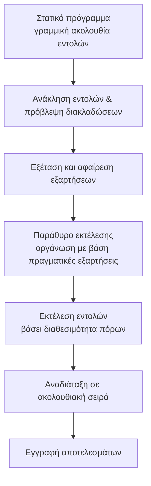

***

# 10.0 Μικροαρχιτεκτονικά Παραδείγματα x86

## 10.1 Pentium 4 – Δομή και βασικές έννοιες

### 10.1.1 Δομικά τμήματα Pentium 4

i. Cache και διαύλους  
- L1 cache δεδομένων: 8 KB.  
- L1 cache εντολών (ή Trace Cache για αποκωδικοποιημένες micro-ops).  
- L2 cache: 256 KB.  
- Δίαυλος συστήματος: 3.2 GB/s.

ii. Αρχείο καταχωρητών  
- Αρχείο καταχωρητών ακεραίων.  
- Αρχείο καταχωρητών FP (κινητής υποδιαστολής).

iii. Λειτουργικές μονάδες  
- Πολλαπλές ALUs για ακέραιες πράξεις.  
- FP μονάδες (Fadd, Fmul).  
- Μονάδες MMX/SIMD για πολυμέσα.  
- Μονάδες φόρτωσης/αποθήκευσης (AGU – Address Generation Unit).

iv. Out-of-order execution  
- Λογικά κυκλώματα για εκτέλεση εντολών εκτός σειράς, με δέσμευση στη σειρά.

***

> [!INFO]
> **Διάγραμμα δομικών τμημάτων Pentium 4 (εννοιολογικά)**

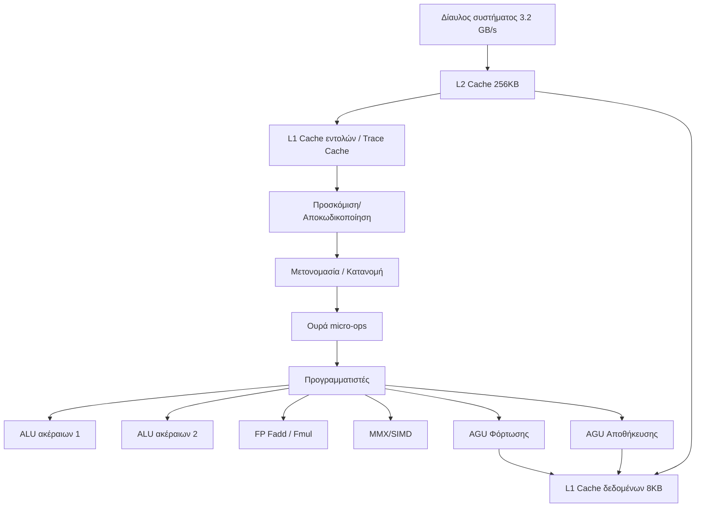

***

### 10.1.2 Λειτουργία Pentium 4 – CISC εξωτερικά, RISC εσωτερικά

i. Γενικός μηχανισμός  
- Εντολές x86 μεταβλητού μήκους (CISC) προσκομίζονται.  
- Μεταφράζονται σε μία ή περισσότερες εντολές RISC σταθερού μήκους (micro-ops).  
- Micro-ops εκτελούνται σε υπερβαθμωτό pipeline (out-of-order).  
- Αποτελέσματα δεσμεύονται στη σειρά ροής προγράμματος.

ii. Pipeline  
- Εσωτερικός αγωγός τουλάχιστον 20 σταδίων.  
- Ορισμένες micro-ops απαιτούν πολλαπλά στάδια εκτέλεσης.  
- Σχέση με κλασικό x86 pipeline (π.χ. 5 στάδια σε παλιά Pentium).

***

### 10.1.3 Pentium 4 – Στάδια αγωγού

i. Ενδεικτικά στάδια  
- TC Next IP: εντοπισμός επόμενης εντολής στην cache.  
- TC Fetch: ανάκτηση εντολής από Trace Cache.  
- Alloc: διανομή πόρων.  
- Rename: δυναμική μετονομασία καταχωρητών.  
- Que: ουρά micro-ops.  
- Sch: χρονοπρογραμματισμός micro-ops.  
- Disp: αποστολή σε μονάδες.  
- RF: ανάγνωση/εγγραφή καταχωρητών.  
- Ex: εκτέλεση.  
- Flags: διαχείριση σημαιών ALU.  
- Br Ck: έλεγχος διακλάδωσης.

***

> [!INFO]
> **Pipeline Pentium 4 – Ροή micro-ops**

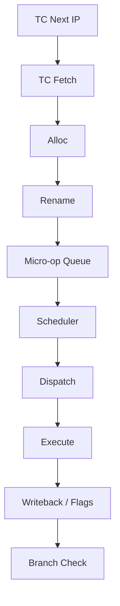

***

## 10.2 Intel Core i7 – Πολυπύρηνη αρχιτεκτονική

### 10.2.1 Βασικά δομικά στοιχεία

i. Πολυπύρηνη δομή  
- 4 πυρήνες με SMT (Simultaneous Multithreading): CPU-0, CPU-1, CPU-2, CPU-3.  
- Κάθε πυρήνας: παράλληλη εκτέλεση νημάτων (multi-threading).

ii. Ιδιωτικές κρυφές μνήμες  
- L1D (Data Cache) και L1I (Instruction Cache) ανά πυρήνα.  
- L2 cache ανά πυρήνα για ταχύτητα.

iii. Κοινόχρηστη L3 cache  
- Μοιράζεται από όλους τους πυρήνες.  
- Βελτιώνει επικοινωνία και μειώνει καθυστερήσεις μνήμης.

iv. Ελεγκτής μνήμης DDR3  
- Ενσωματωμένος memory controller για DDR3, γρήγορη ροή δεδομένων.

v. QPI (Quick Path Interconnect)  
- Ταχύς δίαυλος επικοινωνίας μεταξύ επεξεργαστών, μνήμης, περιφερειακών.

***

> [!INFO]
> **Ιεραρχία μνήμης σε Intel Core i7**

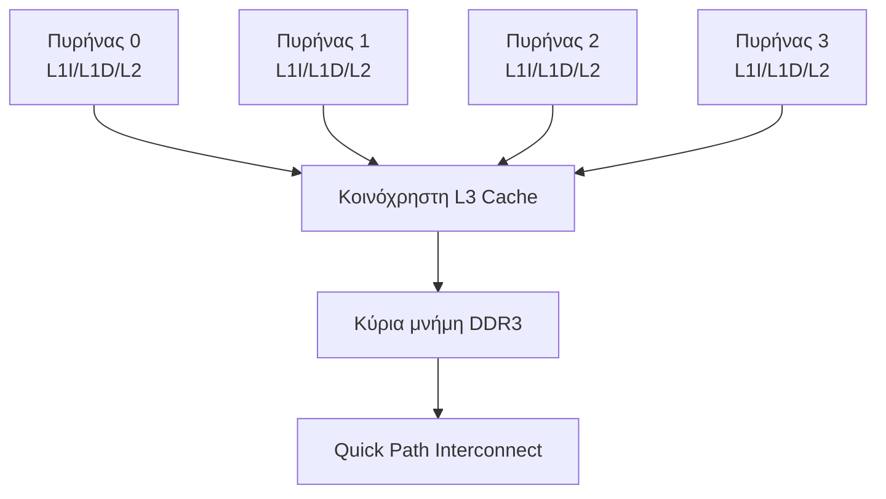

***

## 10.3 Μικροαρχιτεκτονική Intel Core

### 10.3.1 Στάδια και μονάδες

i. Front-end  
- Κρυφή μνήμη εντολών L1: γρήγορη ανάκληση.  
- Ανάκληση και προ-κωδικοποίηση εντολών.  
- Μονάδα πρόβλεψης διακλαδώσεων.  
- Ουρά εντολών.  
- ROM μικροκώδικα για σύνθετες CISC εντολές.

ii. Rename/Assign  
- Μετονομασία καταχωρητών.  
- Εκχώρηση πόρων και καταχωρητών.

iii. Εκτέλεση  
- Μονάδα υποδοχής αποτελεσμάτων (reorder buffer).  
- Χρονοπρογραμματιστής / σταθμός δέσμευσης.  
- Πολλαπλές θύρες προς λειτουργικές μονάδες:
  - Θύρα 0: Ακέραια ALU, Branch, MMX/SSE, FP move.  
  - Θύρα 1: Ακέραια ALU, FP add, MMX/SSE, FP move.  
  - Θύρα 2: Ακέραια ALU, FPMul, MMX/SSE, FP move.  
  - Θύρα 3–4: Μονάδες φόρτωσης/αποθήκευσης.  

iv. Μνήμη  
- Κρυφή μνήμη δεδομένων L1.  
- DTLB (Data TLB) για μετάφραση διευθύνσεων.  
- Κοινόχρηστη cache και FSB έως 10.7 Gbps.

***

> [!INFO]
> **Μικροαρχιτεκτονική Intel Core – ροή εντολών**

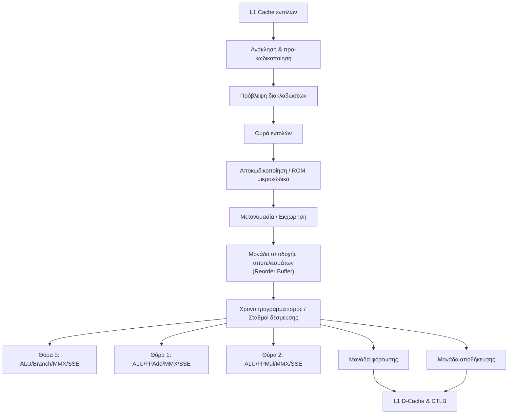

***

# 11.0 Σύνοψη Εννοιών ILP και Superscalar (Χωρίς Σύνοψη Κειμένου)

## 11.1 Λειτουργικές Σχέσεις και Σχέδιο Μελέτης

i. Λειτουργική σχέση ILP – Απόδοσης  
- Αν ο μέσος αριθμός εντολών ανά κύκλο είναι \( IPC \) και η συχνότητα ρολογιού είναι \( f \), τότε η απόδοση (ρυθμός εκτέλεσης εντολών) δίνεται από:  
  $$ \text{Ρυθμός Εκτέλεσης} = IPC \cdot f $$  

ii. Λανθάνων χρόνος και throughput  
- Αν ο λανθάνων χρόνος μίας λειτουργίας είναι \( L \) κύκλοι και η διασωλήνωση επιτρέπει ένα αποτέλεσμα κάθε κύκλο μετά το πλήρωμα, τότε:  
  $$ \text{Χρόνος Ολοκλήρωσης } N \text{ εντολών} \approx L + (N - 1) $$  

iii. Περιορισμοί από εξαρτήσεις  
- Για μια ακολουθία εντολών με ποσοστό εξαρτήσεων \( p \), ο ιδανικός μέγιστος παραλληλισμός μειώνεται:  
  $$ IPC_{\text{eff}} \leq (1 - p) \cdot IPC_{\text{θεωρητικό}} $$  

(οι εξισώσεις αποτυπώνουν λειτουργικές σχέσεις, όχι συγκεκριμένες μετρήσεις από το PDF, αλλά συνδέουν τις έννοιες ILP, λανθάνον χρόνου και παραλληλισμού).

***

# 12.0 Πίνακας Συγκριτικών Χαρακτηριστικών Pentium 4 – Intel Core – Intel Core i7

| Χαρακτηριστικό                    | Pentium 4                                          | Intel Core (μικροαρχιτεκτονική)               | Intel Core i7                            |
|-----------------------------------|----------------------------------------------------|-----------------------------------------------|------------------------------------------|
| Μοντέλο αρχιτεκτονικής           | CISC εξωτερικά, RISC micro-ops εσωτερικά          | Superscalar x86 με διασωλήνωση                | Πολυπύρηνη x86 με SMT                    |
| Pipelines                         | Μακρύς αγωγός (≥20 στάδια)                         | Πολλαπλές θύρες ALU/FP/MMX/SSE                | Πολλαπλοί πυρήνες, πολλαπλά pipelines    |
| ILP τεχνικές                      | Out-of-order, μετονομασία, BTB, Trace Cache        | Out-of-order, ROB, ισχυρή πρόβλεψη           | Όμοια + πολυπύρηνη και πολυνηματική ILP  |
| Cache ιεραρχία                    | L1 I/D, L2 256KB                                   | L1 I/D, L2, κοινόχρηστη cache                | L1 και L2 ανά πυρήνα, κοινή L3           |
| Διασύνδεση με μνήμη              | Δίαυλος συστήματος 3.2 GB/s                        | FSB έως 10.7 Gbps                             | QPI + ενσωματωμένος DDR3 controller      |
| SIMD υποστήριξη                   | MMX / SIMD                                         | MMX / SSE                                     | MMX / SSE / σύγχρονα SIMD extensions     |

***

Με αυτά τα δομημένα «έξυπνα» σημειώματα, το κεφάλαιο για παραλληλισμό σε επίπεδο εντολών και υπερβαθμωτούς επεξεργαστές αποτυπώνεται ως δίκτυο εννοιών, μηχανισμών και μικροαρχιτεκτονικών υλοποιήσεων (Pentium 4, Intel Core, Core i7), με έμφαση σε εξαρτήσεις, μετονομασία, πολιτικές έκδοσης και pipeline organization.