# Κορυφαίες Τάσεις Νέων Τεχνολογιών
## Αρχιτεκτονική Υπολογιστών - Διάλεξη 12

**Πανεπιστήμιο Ιωαννίνων**  
**Τμήμα Πληροφορικής & Τηλεπικοινωνιών**  
**Διδάσκων:** Αλέξανδρος Μπανταλούκας-Αρτζμάντ MSc, PhD  
**Επιμέλεια:** Κωνσταντίνος Σακκάς BSc, MSc

---

## 1.0 Τεχνητή Νοημοσύνη (Artificial Intelligence - AI)

### Θεωρητικός Ορισμός
Η **Τεχνητή Νοημοσύνη (AI)** αναφέρεται στην προσομοίωση ανθρώπινων νοητικών διαδικασιών από μηχανές, ειδικά από υπολογιστικά συστήματα.

### Βασικές Εφαρμογές
i. **Έμπειρα Συστήματα** (Expert Systems)  
ii. **Επεξεργασία Φυσικής Γλώσσας** (Natural Language Processing)  
iii. **Αναγνώριση Ομιλίας** (Speech Recognition)  
iv. **Μηχανική Όραση** (Machine Vision)

### Επαγγελματικές Θέσεις και Μισθολογικά Δεδομένα

| **Θέση** | **Μισθός (USD)** |
|---------|------------------|
| Chatbot Developer | $70,000 |
| Data Analyst | $75,000 |
| Image Processing Engineer | $85,000 |
| Business Intelligence Analyst | $90,000 |
| Recommender Systems Developer | $95,000 |
| AI Consultant | $100,000 |
| AI Product Manager | $110,000 |
| Data Engineer | $115,000 |
| Deep Learning Engineer | $120,000 |
| Computer Scientist | $120,000 |

### Αρχιτεκτονική Συστημάτων AI
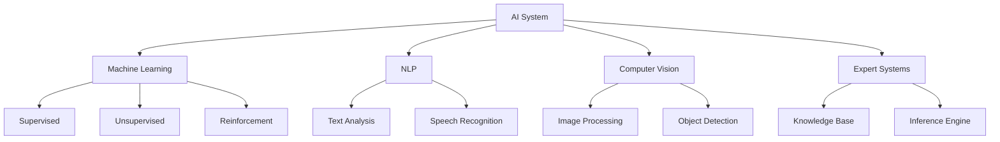

---

## 2.0 Robotic Process Automation (RPA)

### Θεωρητικός Ορισμός
Η **RPA** είναι μια τεχνολογία λογισμικού που διευκολύνει την κατασκευή, ανάπτυξη και διαχείριση ρομπότ λογισμικού, τα οποία μιμούνται τις ανθρώπινες ενέργειες σε ψηφιακά συστήματα.

### Βασικά Χαρακτηριστικά
i. Εκτέλεση εργασιών ταχύτερα από τους ανθρώπους  
ii. Μεγαλύτερη συνέπεια στην εκτέλεση  
iii. Λειτουργία χωρίς διαλλείματα  
iv. Μίμηση ανθρώπινων ψηφιακών ενεργειών

### Επαγγελματικές Θέσεις και Μισθολογικά Δεδομένα

| **Θέση** | **Μισθός (USD)** |
|---------|------------------|
| RPA Tester | $60,000 |
| RPA Support Engineer | $70,000 |
| RPA Trainer | $75,000 |
| RPA Consultant | $80,000 |
| RPA Business Analyst | $85,000 |
| RPA Developer | $90,000 |
| RPA Solution Designer | $100,000 |
| RPA Project Manager | $110,000 |
| RPA Architect | $120,000 |
| RPA Operations Manager | $130,000 |

### Κύκλος Ζωής RPA

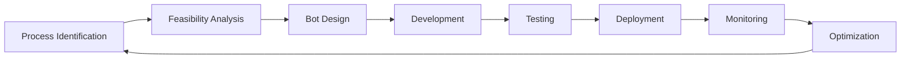

---

## 3.0 Edge Computing

### Θεωρητικός Ορισμός
Το **Edge Computing** είναι ένα αναδυόμενο υπολογιστικό μοντέλο που περιλαμβάνει δίκτυα και συσκευές κοντά στον χρήστη.

### Βασικά Χαρακτηριστικά
i. Επεξεργασία δεδομένων κοντά στο σημείο παραγωγής τους  
ii. Ταχύτερη επεξεργασία δεδομένων  
iii. Επεξεργασία μεγαλύτερου όγκου δεδομένων  
iv. Αποτελέσματα σε πραγματικό χρόνο (real-time)

### Επαγγελματικές Θέσεις και Μισθολογικά Δεδομένα

| **Θέση** | **Μισθός (USD)** |
|---------|------------------|
| Edge Computing Analyst | $85,000 |
| Edge Computing Systems Administrator | $95,000 |
| Edge Computing Developer | $105,000 |
| Edge Computing Engineer | $115,000 |
| Edge Computing Consultant | $125,000 |
| Edge Computing Project Manager | $130,000 |
| Edge Computing Security Specialist | $135,000 |
| Edge Computing Solution Architect | $145,000 |
| Edge Computing Operations Manager | $150,000 |

### Αρχιτεκτονική Edge Computing

> [!INFO]
> Το Edge Computing μειώνει την καθυστέρηση (latency) μεταφέροντας την επεξεργασία πιο κοντά στην πηγή των δεδομένων.

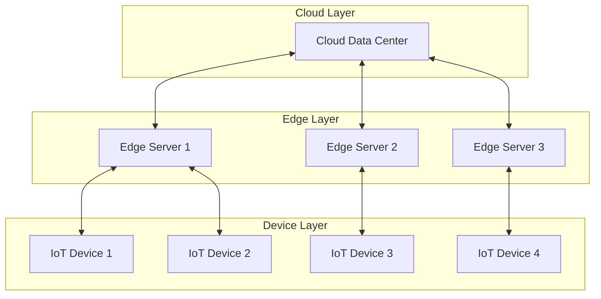

---

## 4.0 Quantum Computing

### Θεωρητικός Ορισμός
Η **Κβαντική Πληροφορική** είναι ένας διεπιστημονικός τομέας που συνδυάζει:
- Επιστήμη των Υπολογιστών
- Φυσική
- Μαθηματικά

### Βασικές Αρχές
i. Αξιοποιεί την **κβαντική μηχανική**  
ii. Ταχύτερη επίλυση σύνθετων προβλημάτων σε σχέση με κλασικούς υπολογιστές  
iii. Περιλαμβάνει έρευνα υλικού και ανάπτυξη εφαρμογών

### Επαγγελματικές Θέσεις και Μισθολογικά Δεδομένα

| **Θέση** | **Μισθός (USD)** |
|---------|------------------|
| Quantum Systems Administrator | $85,000 |
| Quantum Computing Engineer | $90,000 |
| Quantum Software Developer | $100,000 |
| Quantum Hardware Engineer | $110,000 |
| Quantum Applications Developer | $120,000 |
| Quantum Algorithm Researcher | $130,000 |
| Quantum Computing Architect | $140,000 |
| Quantum Cryptography Specialist | $150,000 |
| Quantum Computing Scientist | $160,000 |
| Quantum Information Theorist | $170,000 |

### Σύγκριση Κλασικού vs Κβαντικού Υπολογιστή

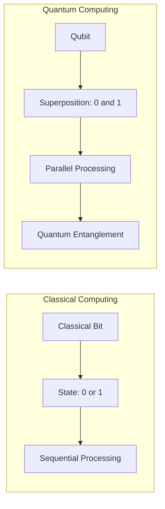

---

## 5.0 Εικονική και Επαυξημένη Πραγματικότητα (VR/AR → xR)

### Θεωρητικοί Ορισμοί

#### Virtual Reality (VR)
Η **Εικονική Πραγματικότητα** χρησιμοποιεί ένα σετ κεφαλής (headset) για να μεταφέρει τον χρήστη σε έναν υπολογιστικά δημιουργημένο κόσμο που μπορεί να εξερευνήσει.

#### Augmented Reality (AR)
Η **Επαυξημένη Πραγματικότητα** τοποθετεί ψηφιακές εικόνες στον πραγματικό κόσμο μέσω:
- Διαφανούς προσωπίδας (transparent visor)
- Smartphone

### Επαγγελματικές Θέσεις και Μισθολογικά Δεδομένα

| **Θέση** | **Μισθός (USD)** |
|---------|------------------|
| VR Artist | $55,000 |
| VR Animator | $60,000 |
| VR Sound Designer | $65,000 |
| VR UX Designer | $70,000 |
| VR UI Designer | $75,000 |
| VR Developer | $80,000 |
| VR Designer | $85,000 |
| VR Engineer | $90,000 |
| VR Project Manager | $100,000 |
| VR Marketing Manager | $110,000 |

### Διαφορές VR vs AR

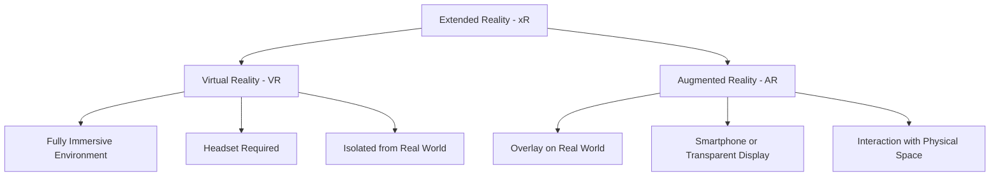

---

## 6.0 Blockchain

### Θεωρητικός Ορισμός
Το **Blockchain** είναι μια δομή δεδομένων στην οποία:
- Μπορείτε **μόνο να προσθέσετε** πληροφορίες
- **Χωρίς δυνατότητα διαγραφής ή τροποποίησης**
- Σχηματίζει μια αλληλουχία δεδομένων ή "**αλυσίδα**"

### Βασικά Χαρακτηριστικά
i. Υψηλή ασφάλεια (security)  
ii. Διαφάνεια συναλλαγών  
iii. Αποκεντρωμένο σύστημα  
iv. Αρχικά αναπτύχθηκε για κρυπτονομίσματα (Bitcoin)  
v. Εφαρμογές σε πολλούς τομείς πέρα από τα κρυπτονομίσματα

### Επαγγελματικές Θέσεις και Μισθολογικά Δεδομένα

| **Θέση** | **Μισθός (USD)** |
|---------|------------------|
| Blockchain Technical Writer | $65,000 |
| Blockchain Marketing Manager | $75,000 |
| Blockchain Quality Assurance Engineer | $80,000 |
| Blockchain Business Analyst | $85,000 |
| Blockchain Security Specialist | $90,000 |
| Blockchain Consultant | $95,000 |
| Blockchain Project Manager | $100,000 |
| Blockchain Engineer | $105,000 |
| Blockchain Developer | $110,000 |
| Blockchain Architect | $120,000 |

### Αρχιτεκτονική Blockchain

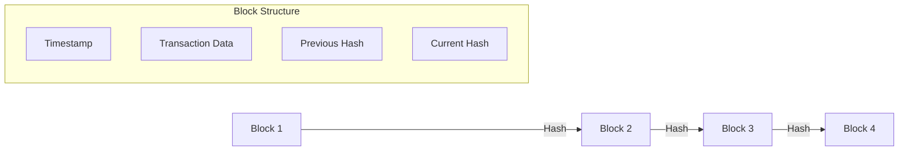

---

## 7.0 Internet of Things (IoT)

### Θεωρητικός Ορισμός
Το **Διαδίκτυο των Πραγμάτων (IoT)** αναφέρεται σε συσκευές εξοπλισμένες με:
- **Αισθητήρες** (sensors)
- Δυνατότητες **επεξεργασίας**
- **Λογισμικό**
- Άλλες τεχνολογίες

### Βασικά Χαρακτηριστικά
i. Σύνδεση μέσω Διαδικτύου ή άλλων δικτύων επικοινωνίας  
ii. Ανταλλαγή δεδομένων με άλλες συσκευές και συστήματα  
iii. Αυτοματοποίηση διαδικασιών  
iv. Real-time data collection και analysis

### Επαγγελματικές Θέσεις και Μισθολογικά Δεδομένα

| **Θέση** | **Μισθός (USD)** |
|---------|------------------|
| IoT Systems Administrator | $70,000 |
| IoT Business Analyst | $75,000 |
| IoT Data Analyst | $80,000 |
| IoT Security Specialist | $85,000 |
| IoT Consultant | $90,000 |
| IoT Project Manager | $95,000 |
| IoT Engineer | $100,000 |
| IoT Developer | $105,000 |
| IoT Product Manager | $115,000 |
| IoT Architect | $120,000 |

### Αρχιτεκτονική IoT

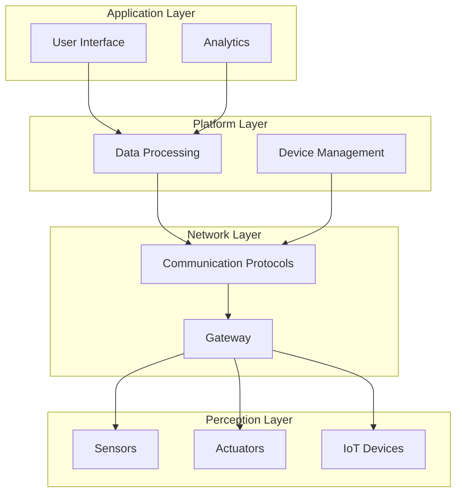

---

## 8.0 5G Technology

### Θεωρητικός Ορισμός
Η **Τεχνολογία 5G** έχει τη δυνατότητα να αλλάξει τον τρόπο με τον οποίο αντιλαμβανόμαστε τον ψηφιακό κόσμο.

### Εξέλιξη Τεχνολογιών Δικτύων
i. **3G**: Βελτίωσε την κινητή περιήγηση στο διαδίκτυο  
ii. **4G**: Επέτρεψε υπηρεσίες βασισμένες στα δεδομένα και streaming  
iii. **5G**: Ταχύτερη επικοινωνία, αυξημένο εύρος ζώνης, χαμηλότερη καθυστέρηση

### Επαγγελματικές Θέσεις και Μισθολογικά Δεδομένα

| **Θέση** | **Μισθός (USD)** |
|---------|------------------|
| 5G Operations Engineer | $85,000 |
| 5G Software Developer | $90,000 |
| 5G Testing and Validation Engineer | $90,000 |
| 5G Engineer | $90,000 |
| 5G Integration Engineer | $95,000 |
| 5G Radio Frequency (RF) Engineer | $95,000 |
| 5G Security Specialist | $100,000 |
| 5G Project Manager | $100,000 |
| 5G Network Architect | $110,000 |
| 5G Product Manager | $120,000 |

### Σύγκριση Γενεών Κινητής Τηλεφωνίας

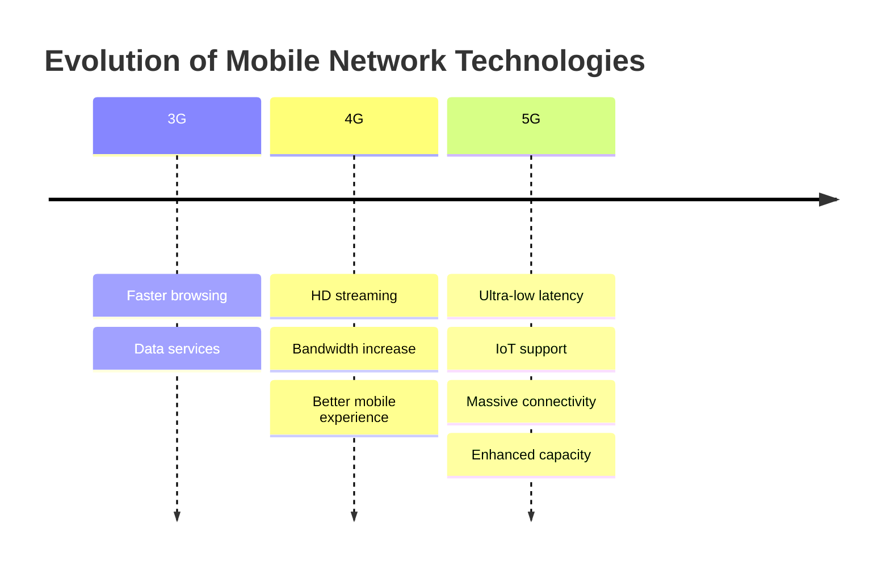

---

## 9.0 Cybersecurity

### Θεωρητικός Ορισμός
Ο πρωταρχικός στόχος της **Ασφάλειας στον Κυβερνοχώρο** είναι η προστασία:
- Συσκευών (smartphones, laptops, tablets, υπολογιστές)
- Υπηρεσιών στο διαδίκτυο και στον χώρο εργασίας
- Προσωπικών δεδομένων

### Βασικοί Άξονες Προστασίας
i. **Προστασία από κλοπή ή ζημία**  
ii. **Αποτροπή μη εξουσιοδοτημένης πρόσβασης**  
iii. Προστασία **τεράστιου όγκου προσωπικών δεδομένων**

### Επαγγελματικές Θέσεις και Μισθολογικά Δεδομένα

| **Θέση** | **Μισθός (USD)** |
|---------|------------------|
| Cryptographer | $75,000 |
| Information Security Analyst | $80,000 |
| Cybersecurity Analyst | $85,000 |
| Penetration Tester | $90,000 |
| Network Security Engineer | $95,000 |
| Cybersecurity Consultant | $100,000 |
| Cybersecurity Engineer | $105,000 |
| Security Architect | $115,000 |
| Incident Responder | $120,000 |
| Chief Information Security Officer (CISO) | $150,000 |

### Στρώματα Ασφάλειας Κυβερνοχώρου
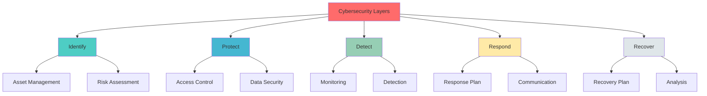

---

## 10.0 Full Stack Development

### Θεωρητικός Ορισμός
Η **Ανάπτυξη Πλήρους Στοίβας (Full Stack Development)** αναφέρεται στην ολοκληρωμένη ανάπτυξη λογισμικού που περιλαμβάνει:

#### Frontend
- **Διεπαφή Χρήστη** (User Interface)
- Client-side logic
- User experience

#### Backend
- **Επιχειρηματική Λογική** (Business Logic)
- **Ροές Εργασιών** (Workflows)
- Server-side processing
- Database management

### Επαγγελματικές Θέσεις και Μισθολογικά Δεδομένα

| **Θέση** | **Μισθός (USD)** |
|---------|------------------|
| Web Developer | $50,000 |
| JavaScript Developer | $60,000 |
| Back-End Developer | $65,000 |
| Front-End Developer | $70,000 |
| React Developer | $75,000 |
| Node.js Developer | $80,000 |
| Angular Developer | $85,000 |
| Full Stack Developer | $90,000 |
| Full Stack Engineer | $100,000 |
| Full Stack Architect | $110,000 |

### Αρχιτεκτονική Full Stack

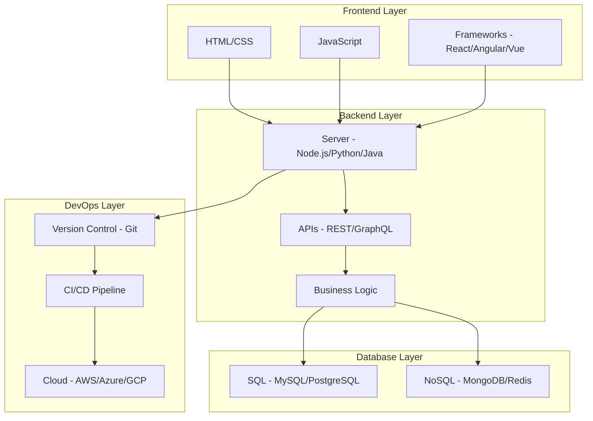

---

## 11.0 Computing Power

### Θεωρητικός Ορισμός
Η **Υπολογιστική Ισχύς (Computing Power)** αναφέρεται στην ικανότητα ενός υπολογιστή ή ενός συστήματος υπολογιστών να:
- Εκτελεί **πολύπλοκους υπολογισμούς**
- Επεξεργάζεται **δεδομένα**

### Μέτρηση Ταχύτητας Επεξεργασίας
Η ταχύτητα επεξεργασίας μετράται από τον **αριθμό υπολογισμών ή λειτουργιών ανά δευτερόλεπτο** που μπορεί να ολοκληρώσει το σύστημα.

### Επαγγελματικές Θέσεις και Μισθολογικά Δεδομένα

| **Θέση** | **Μισθός (USD)** |
|---------|------------------|
| Systems Administrator | $60,000 |
| Network Engineer | $70,000 |
| Data Engineer | $80,000 |
| Virtualization Engineer | $85,000 |
| IT Operations Manager | $95,000 |
| Cloud Computing Engineer | $100,000 |
| DevOps Engineer | $105,000 |
| Distributed Systems Engineer | $110,000 |
| Data Center Engineer | $115,000 |
| High Performance Computing (HPC) Engineer | $120,000 |

### Επίπεδα Υπολογιστικής Ισχύος

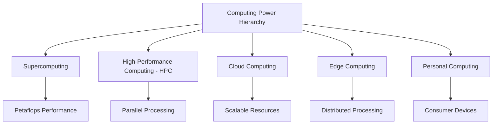

---

## 12.0 Datafication

### Θεωρητικός Ορισμός
Η **Μετατροπή σε Δεδομένα (Datafication)** στις επιχειρήσεις αναφέρεται στη διαδικασία μετατροπής των περισσότερων πτυχών μιας επιχείρησης σε **μετρήσιμα δεδομένα**.

### Βασικές Λειτουργίες
i. **Παρακολούθηση** (Monitoring)  
ii. **Έλεγχος** (Control)  
iii. **Ανάλυση** (Analysis)

### Στόχος
Μετατροπή οργανισμού σε επιχείρηση με γνώμονα τα δεδομένα (data-driven enterprise).

### Επαγγελματικές Θέσεις και Μισθολογικά Δεδομένα

| **Θέση** | **Μισθός (USD)** |
|---------|------------------|
| Data Analyst | $75,000 |
| Business Intelligence Analyst | $90,000 |
| Data Engineer | $115,000 |
| Database Administrator | $120,000 |
| Data Architect | $125,000 |
| Data Visualization Specialist | $130,000 |
| Big Data Engineer | $135,000 |
| Machine Learning Engineer | $140,000 |
| Artificial Intelligence (AI) Developer | $145,000 |
| Data Scientist | $150,000 |

### Κύκλος Datafication

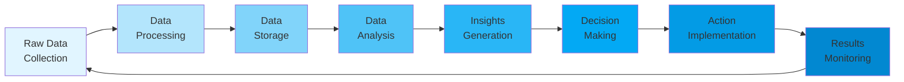

---

## 13.0 Digital Trust

### Θεωρητικός Ορισμός
Η **Ψηφιακή Εμπιστοσύνη (Digital Trust)** αναφέρεται στο επίπεδο εμπιστοσύνης που έχουν άτομα και επιχειρήσεις σε:
- **Ασφάλεια** (Security)
- **Ιδιωτικότητα** (Privacy)
- **Αξιοπιστία** (Reliability)

### Σημασία για Επιχειρήσεις
i. Ενίσχυση **αφοσίωσης πελατών** (customer loyalty)  
ii. Αύξηση **εσόδων** (revenue increase)  
iii. Βελτίωση φήμης επιχείρησης

### Τομείς Ασφάλειας (Security Segments)

| **Τομέας** | **Περιγραφή** |
|------------|---------------|
| Identity and Access Management | Διαχείριση ταυτοτήτων και πρόσβασης |
| Cloud Security | Ασφάλεια cloud περιβαλλόντων |
| Application Security | Ασφάλεια εφαρμογών |
| End-point Security | Ασφάλεια τερματικών συσκευών |
| Security Monitoring | Παρακολούθηση ασφάλειας |
| Data Security | Ασφάλεια δεδομένων |

### Επαγγελματικές Θέσεις και Μισθολογικά Δεδομένα

| **Θέση** | **Μισθός (USD)** |
|---------|------------------|
| Compliance Officer | $50,000 |
| Risk Management Analyst | $60,000 |
| Digital Privacy Consultant | $65,000 |
| Fraud Prevention Analyst | $70,000 |
| Identity and Access Management Specialist | $75,000 |
| Information Security Analyst | $80,000 |
| Penetration Tester | $85,000 |
| Trust and Safety Manager | $90,000 |
| Cybersecurity Analyst | $95,000 |
| Digital Forensic Investigator | $100,000 |

### Αρχιτεκτονική Digital Trust

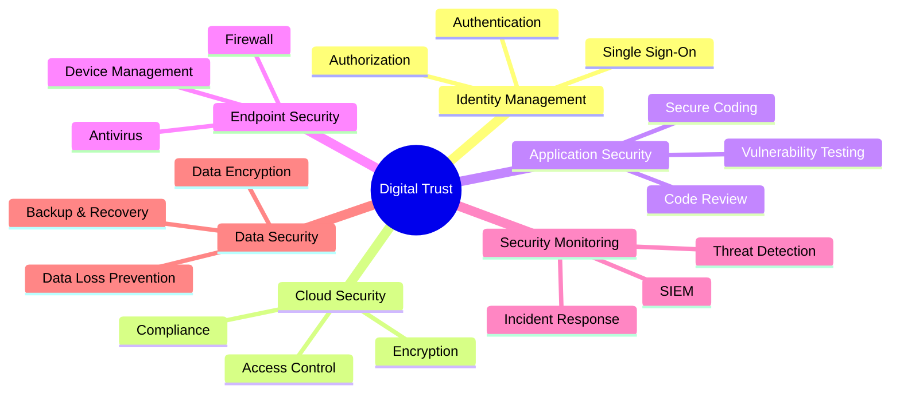

---

## 14.0 Internet of Behaviors (IoB)

### Θεωρητικός Ορισμός
Το **Internet of Behaviors (IoB)** αξιοποιεί δεδομένα που συλλέγονται από συσκευές χρηστών συνδεδεμένες στο διαδίκτυο.

### Βασικές Λειτουργίες
i. Συλλογή μεγάλων όγκων δεδομένων  
ii. **Ανάλυση** δεδομένων  
iii. **Παρακολούθηση** συμπεριφοράς  
iv. Κατανόηση **ανθρώπινης συμπεριφοράς**

### Ιεραρχία Γνώσης - IoB Framework

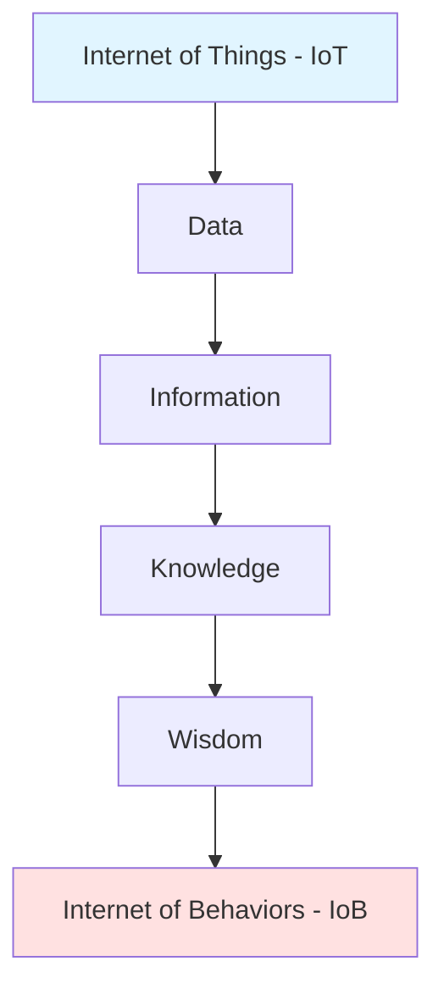

### Επαγγελματικές Θέσεις και Μισθολογικά Δεδομένα

| **Θέση** | **Μισθός (USD)** |
|---------|------------------|
| Behavior Analyst | $50,000 |
| Digital Marketing Analyst | $60,000 |
| Data Analyst | $75,000 |
| Software Developer | $80,000 |
| User Experience (UX) Designer | $85,000 |
| Data Scientist | $95,000 |
| Machine Learning Engineer | $100,000 |
| Artificial Intelligence (AI) Developer | $100,000 |
| Cybersecurity Analyst | $105,000 |
| Data Privacy Consultant | $110,000 |

### Εφαρμογές IoB

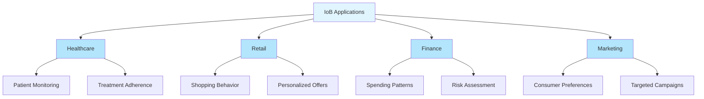

---

## 15.0 Predictive Analytics

### Θεωρητικός Ορισμός
Η **Προγνωστική Ανάλυση (Predictive Analytics)** είναι η διαδικασία αξιοποίησης δεδομένων για την **πρόβλεψη μελλοντικών αποτελεσμάτων**.

### Τεχνολογίες που Χρησιμοποιούνται
i. **Ανάλυση Δεδομένων** (Data Analysis)  
ii. **Μηχανική Μάθηση** (Machine Learning)  
iii. **Τεχνητή Νοημοσύνη** (AI)  
iv. **Στατιστικά Μοντέλα** (Statistical Models)

### Στόχος
Αναγνώριση μοτίβων που θα μπορούσαν να προβλέψουν **μελλοντική συμπεριφορά**.

### Επαγγελματικές Θέσεις και Μισθολογικά Δεδομένα

| **Θέση** | **Μισθός (USD)** |
|---------|------------------|
| Data Analyst | $42,000 |
| Business Intelligence Analyst | $51,000 |
| Marketing Analyst | $52,000 |
| Risk Analyst | $56,000 |
| Statistician | $62,000 |
| Predictive Modeler | $66,000 |
| Data Mining Engineer | $68,000 |
| Machine Learning Engineer | $70,000 |
| Quantitative Analyst | $71,000 |
| Data Scientist | $72,000 |

### Κύκλος Predictive Analytics

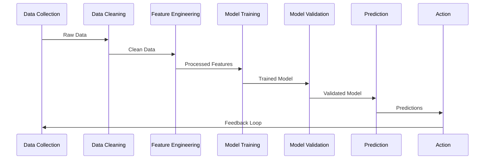

---

## 16.0 DevOps

### Θεωρητικός Ορισμός
Το **DevOps** αποτελεί ένα σύνολο μεθόδων και πρακτικών που στοχεύει στη βελτίωση της συνεργασίας και επικοινωνίας μεταξύ:
- **Ομάδων Ανάπτυξης Λογισμικού** (Software Developers)
- **IT Operators**

### Βασικά Χαρακτηριστικά
i. Χρήση εργαλείων **αυτοματοποίησης**  
ii. Διαδικασίες για **ενίσχυση αποτελεσματικότητας**  
iii. **Μείωση σφαλμάτων**  
iv. Παράδοση λογισμικού **υψηλής ποιότητας**

### Επαγγελματικές Θέσεις και Μισθολογικά Δεδομένα

| **Θέση** | **Μισθός (USD)** |
|---------|------------------|
| Configuration Manager | $70,000 |
| Automation Engineer | $75,000 |
| Release Manager | $80,000 |
| Security Engineer | $85,000 |
| Infrastructure Engineer | $90,000 |
| Software Engineer in Test (SET) | $95,000 |
| Cloud Engineer | $100,000 |
| Continuous Integration/Continuous Deployment (CI/CD) Engineer | $105,000 |
| Site Reliability Engineer (SRE) | $110,000 |
| DevOps Engineer | $115,000 |

### Κύκλος DevOps

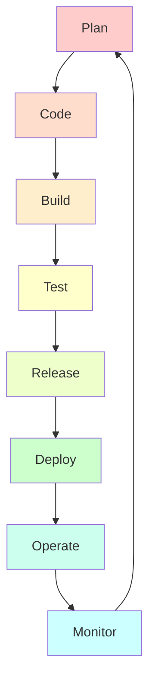

### Αρχές DevOps

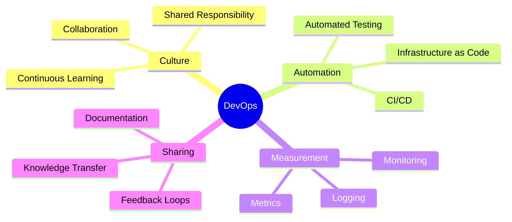

---

## 17.0 3D Printing

### Θεωρητικός Ορισμός
Η **Τρισδιάστατη Εκτύπωση (3D Printing)** έχει γίνει μια βασική τεχνολογία για τη δημιουργία **πρωτοτύπων**.

### Κύριοι Τομείς Εφαρμογής
i. **Βιομηχανία** (Industry)  
ii. **Βιοϊατρική** (Biomedical)

### Βασικά Χαρακτηριστικά
- Δημιουργία **πραγματικών αντικειμένων** από εκτυπωτή
- Additive manufacturing process
- Rapid prototyping capabilities

### Επαγγελματικές Θέσεις και Μισθολογικά Δεδομένα

| **Θέση** | **Μισθός (USD)** |
|---------|------------------|
| Additive Manufacturing Technician | $30,000 |
| Quality Control Specialist | $35,000 |
| 3D CAD Designer | $40,000 |
| Rapid Prototyping Engineer | $50,000 |
| Materials Engineer | $60,000 |
| Industrial Designer | $65,000 |
| Product Designer | $70,000 |
| 3D Printing Engineer | $80,000 |
| Robotics Engineer | $85,000 |
| Research and Development Engineer | $90,000 |

### Διαδικασία 3D Printing
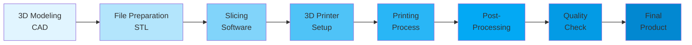

### Τεχνολογίες 3D Printing

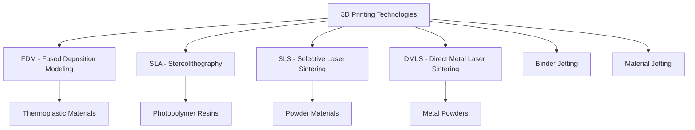

---

## 18.0 AI-as-a-Service (AIaaS)

### Θεωρητικός Ορισμός
Το **AI-as-a-Service** είναι μια βασισμένη στο σύννεφο (cloud-based) λύση που προσφέρει δυνατότητες **Τεχνητής Νοημοσύνης**.

### Μοντέλα Υπηρεσιών
i. **PaaS** - Platform as a Service  
ii. **IaaS** - Infrastructure as a Service  
iii. **SaaS** - Software as a Service

### Πλεονεκτήματα
- Πρόσβαση στην AI **χωρίς επένδυση** σε δαπανηρό υλικό
- Χωρίς συντήρηση εργαλείων
- Scalability
- Pay-as-you-go model

### Επαγγελματικές Θέσεις και Μισθολογικά Δεδομένα

| **Θέση** | **Μισθός (USD)** |
|---------|------------------|
| Data Analyst | $48,000 |
| Software Developer | $52,000 |
| DevOps Engineer | $74,000 |
| Cloud Computing Engineer | $90,000 |
| Big Data Engineer | $95,000 |
| AI Engineer | $100,000 |
| Machine Learning Engineer | $100,000 |
| Artificial Intelligence (AI) Developer | $105,000 |
| Project Manager | $110,000 |
| Data Scientist | $115,000 |

### AIaaS Αρχιτεκτονική

```mermaid
graph TB
    subgraph Client Layer
        A[Web App]
        B[Mobile App]
        C[Desktop App]
    end
    subgraph AIaaS Platform
        D[API Gateway]
        E[Authentication]
        F[AI Services]
    end
    subgraph AI Services
        G[NLP Service]
        H[Computer Vision]
        I[ML Models]
        J[Speech Recognition]
    end
    subgraph Infrastructure
        K[Cloud Storage]
        L[GPU Compute]
        M[Model Training]
    end
    
    A --> D
    B --> D
    C --> D
    D --> E
    E --> F
    F --> G
    F --> H
    F --> I
    F --> J
    G --> K
    H --> L
    I --> M
```

---

## 19.0 Genomics

### Θεωρητικός Ορισμός
Ο τομέας της **Γονιδιωματικής (Genomics)** χρησιμοποιεί τεχνολογία για:
- Μελέτη **DNA και γονιδίων**
- **Χαρτογράφηση** γονιδιώματος
- **Ποσοτικοποίηση** γονιδίων
- Ανίχνευση πιθανών **προβλημάτων υγείας**

### Κατηγορίες Ρόλων

#### Τεχνικοί Ρόλοι
i. Ανάλυση  
ii. Σχεδιασμός  
iii. Διάγνωση

#### Μη-Τεχνικοί Ρόλοι
i. Θεωρητική ανάλυση  
ii. Έρευνα

### Επαγγελματικές Θέσεις και Μισθολογικά Δεδομένα

| **Θέση** | **Μισθός (USD)** |
|---------|------------------|
| Data Analyst | $48,000 |
| Software Developer | $52,000 |
| DevOps Engineer | $74,000 |
| Cloud Computing Engineer | $90,000 |
| Big Data Engineer | $95,000 |
| AI Engineer | $100,000 |
| Machine Learning Engineer | $100,000 |
| Artificial Intelligence (AI) Developer | $105,000 |
| Project Manager | $110,000 |
| Data Scientist | $115,000 |

### Genomics Pipeline

```mermaid
flowchart LR
    A[DNA Sample Collection] --> B[DNA Sequencing]
    B --> C[Data Processing]
    C --> D[Sequence Alignment]
    D --> E[Variant Calling]
    E --> F[Annotation]
    F --> G[Interpretation]
    G --> H[Clinical Report]
```

### Εφαρμογές Genomics

```mermaid
mindmap
  root((Genomics Applications))
    Personalized Medicine
      Drug Response
      Disease Risk
      Treatment Plans
    Disease Research
      Cancer Genomics
      Rare Diseases
      Infectious Diseases
    Agriculture
      Crop Improvement
      Livestock Breeding
    Forensics
      Criminal Investigation
      Paternity Testing
```

---

## Συνοπτικός Πίνακας Μισθών ανά Τεχνολογία

| **Τεχνολογία** | **Ελάχιστος Μισθός** | **Μέγιστος Μισθός** | **Μέση Τιμή** |
|----------------|---------------------|---------------------|---------------|
| AI | $70,000 | $120,000 | $95,000 |
| RPA | $60,000 | $130,000 | $95,000 |
| Edge Computing | $85,000 | $150,000 | $117,500 |
| Quantum Computing | $85,000 | $170,000 | $127,500 |
| VR/AR | $55,000 | $110,000 | $82,500 |
| Blockchain | $65,000 | $120,000 | $92,500 |
| IoT | $70,000 | $120,000 | $95,000 |
| 5G Technology | $85,000 | $120,000 | $102,500 |
| Cybersecurity | $75,000 | $150,000 | $112,500 |
| Full Stack Development | $50,000 | $110,000 | $80,000 |
| Computing Power | $60,000 | $120,000 | $90,000 |
| Datafication | $75,000 | $150,000 | $112,500 |
| Digital Trust | $50,000 | $100,000 | $75,000 |
| Internet of Behaviors | $50,000 | $110,000 | $80,000 |
| Predictive Analytics | $42,000 | $72,000 | $57,000 |
| DevOps | $70,000 | $115,000 | $92,500 |
| 3D Printing | $30,000 | $90,000 | $60,000 |
| AI-as-a-Service | $48,000 | $115,000 | $81,500 |
| Genomics | $48,000 | $115,000 | $81,500 |

---

## Σύνοψη Τεχνολογικών Τάσεων

```mermaid
mindmap
  root((Technology Trends 2026))
    AI & ML
      Artificial Intelligence
      Machine Learning
      Deep Learning
      AIaaS
    Automation
      RPA
      DevOps
      Computing Power
    Data Science
      Datafication
      Predictive Analytics
      Genomics
      IoB
    Infrastructure
      Edge Computing
      5G Technology
      Cloud Computing
      Quantum Computing
    Security
      Cybersecurity
      Digital Trust
    Development
      Full Stack Development
      3D Printing
    Connectivity
      IoT
      Blockchain
    Immersive Tech
      VR/AR/xR
```

---

## Βιβλιογραφία και Πηγές

**Διδάσκων:** Αλέξανδρος Μπανταλούκας-Αρτζμάντ MSc, PhD  
**Email:** k.arjmand@uoi.gr

**Επιμέλεια:** Κωνσταντίνος Σακκάς BSc, MSc  
**Email:** ksakkas@uoi.gr

**Πανεπιστήμιο Ιωαννίνων**  
**Σχολή Πληροφορικής & Τηλεπικοινωνιών**  
**Τμήμα Πληροφορικής & Τηλεπικοινωνιών**  
**3ο Εξάμηνο - Αρχιτεκτονική Υπολογιστών**

---

**Ημερομηνία Δημιουργίας:** Ιανουάριος 2026  
**Έκδοση:** 1.0