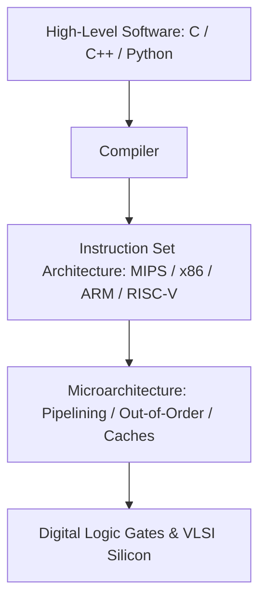

# Lecture 01: Instruction Set Architectures and MIPS Assembly

This lecture introduces the principles of Instruction Set Architectures (ISA), contrasts RISC and CISC design paradigms, and details the 32-bit MIPS architecture, register conventions, instruction bitfields, addressing modes, and calling conventions.

---

## 1. The Role of the Instruction Set Architecture

The **Instruction Set Architecture (ISA)** defines the boundary and interface contract between software and underlying hardware. It encapsulates the programmer-visible state of the processor: available registers, supported data types, memory addressing models, and machine instructions.



### 1.1 RISC vs. CISC Architectural Philosophy

| Characteristic | CISC (Complex Instruction Set Computer) | RISC (Reduced Instruction Set Computer) |
|:---|:---|:---|
| Typical Architectures | x86, x86-64, VAX, Motorola 68000 | MIPS, ARM, RISC-V, SPARC |
| Instruction Length | Variable (1 to 15 bytes in x86) | Fixed (strictly 32 bits / 4 bytes in MIPS32) |
| Memory Operands | ALU instructions can operate directly on RAM | **Load-Store Architecture:** ALU operates strictly on registers |
| Instruction Count | Fewer instructions per program | More instructions per program |
| Cycles Per Instruction (CPI) | High and variable across instructions | Approaching 1.0 cycle per instruction |
| Hardware Complexity | Microcoded execution, complex decode units | Hardwired control logic, optimized for pipelining |

---

## 2. The MIPS32 Register Architecture

MIPS32 provides thirty-two 32-bit general-purpose registers named `$0` through `$31`, each designated with standardized software conventions.

### 2.1 Register File Conventions

| Register Number | Symbolic Name | Software Role / Convention | Preserved Across Calls? |
|:---|:---|:---|:---|
| `$0` | `$zero` | Constant value 0 (writes are discarded) | N/A (Hardwired) |
| `$1` | `$at` | Assembler Temporary (reserved for pseudoinstructions) | No |
| `$2 - $3` | `$v0 - $v1` | Function return values & syscall service codes | No |
| `$4 - $7` | `$a0 - $a3` | Function argument values passed into subroutines | No |
| `$8 - $15` | `$t0 - $t7` | Temporary registers (caller-saved) | No |
| `$16 - $23` | `$s0 - $s7` | Saved registers (callee must preserve across calls) | **Yes** |
| `$24 - $25` | `$t8 - $t9` | Additional temporary registers (caller-saved) | No |
| `$26 - $27` | `$k0 - $k1` | Reserved for OS kernel exception/trap handlers | No |
| `$28` | `$gp` | Global Pointer (points to static global variables) | **Yes** |
| `$29` | `$sp` | Stack Pointer (descends toward lower memory) | **Yes** |
| `$30` | `$fp` | Frame Pointer (anchors activation frame) | **Yes** |
| `$31` | `$ra` | Return Address (saved by `jal`, read by `jr $ra`) | **Yes** |

In addition to general-purpose registers, the CPU contains:
- `PC` (Program Counter): Holds the byte address of the instruction being fetched.
- `HI` and `LO`: 32-bit registers dedicated to holding 64-bit multiplication products and division quotient/remainder pairs.

---

## 3. MIPS Instruction Formats

Every MIPS instruction is encoded in exactly 32 bits, divided into three orthogonal format types:

```
R-Type:  |  opcode (6)  |  rs (5)  |  rt (5)  |  rd (5)  |  shamt (5)  |  funct (6)  |
I-Type:  |  opcode (6)  |  rs (5)  |  rt (5)  |       immediate / offset (16)       |
J-Type:  |  opcode (6)  |                  jump target address (26)                  |
```

### 3.1 R-Type (Register Format)
Used for arithmetic, logical, and shift operations operating entirely on registers.
- `opcode` (bits 31-26): Always `000000` for core R-type ALU instructions.
- `rs` (bits 25-21): First source operand register.
- `rt` (bits 20-16): Second source operand register.
- `rd` (bits 15-11): Destination register storing operation result.
- `shamt` (bits 10-6): Shift amount for bitwise shift instructions (`sll`, `srl`, `sra`). Set to 0 otherwise.
- `funct` (bits 5-0): Selects specific ALU operation (`add = 0x20`, `sub = 0x22`, `and = 0x24`, `or = 0x25`, `slt = 0x2A`).

*Example:* `add $s0, $t1, $t2`
- `rs = $t1 (9)`, `rt = $t2 (10)`, `rd = $s0 (16)`, `shamt = 0`, `funct = 0x20 (32)`.

### 3.2 I-Type (Immediate & Data Transfer Format)
Used for arithmetic with constants (`addi`), memory access (`lw`, `sw`), and conditional branching (`beq`, `bne`).
- `opcode` (bits 31-26): Identifies instruction (`lw = 0x23`, `sw = 0x2B`, `addi = 0x08`, `beq = 0x04`).
- `rs` (bits 25-21): Base address register (for memory) or first operand (for branch).
- `rt` (bits 20-16): Destination register for loads/ALU, or source register for stores.
- `immediate` (bits 15-0): 16-bit signed two's complement integer (range: $[-32,768, +32,767]$).

### 3.3 J-Type (Jump Format)
Used for unconditional jumps (`j`) and jump-and-link procedure calls (`jal`).
- `opcode` (bits 31-26): Opcode (`j = 0x02`, `jal = 0x03`).
- `address` (bits 25-0): 26-bit target word address.

---

## 4. Addressing Modes and Memory Model

MIPS uses **byte addressing** with **Big-Endian** byte ordering (most significant byte placed at lowest memory address). 32-bit words must be aligned to memory addresses that are integer multiples of 4 (i.e., addresses where the least significant two bits are `00`).

### 4.1 The Five Addressing Modes

1. **Register Addressing:** Operand resides in a register.
   $$\text{add } \$s1, \$s2, \$s3 \implies \text{Reg}[s1] \leftarrow \text{Reg}[s2] + \text{Reg}[s3]$$
2. **Base-Displacement (Base) Addressing:** Memory address computed as register base plus sign-extended 16-bit offset.
   $$\text{lw } \$t0, 16(\$sp) \implies \text{Addr} = \text{Reg}[\$sp] + \text{SignExt}(16)$$
3. **Immediate Addressing:** Operand is a constant embedded within instruction bits.
   $$\text{addi } \$t0, \$t0, 1 \implies \text{Reg}[t0] \leftarrow \text{Reg}[t0] + \text{SignExt}(1)$$
4. **PC-Relative Addressing:** Target address calculated relative to `PC + 4`. Used for conditional branches.
   $$\text{Target} = (PC + 4) + (\text{SignExt}(\text{immediate}) \ll 2)$$
   Allows branching $\pm 32,768$ words ($\pm 128\text{ KB}$) around the current branch.
5. **Pseudodirect Addressing:** Jump target constructed by concatenating top 4 bits of `PC + 4` with 26-bit field shifted left by 2:
   $$\text{Target} = (PC + 4)_{31..28} \,||\, (\text{target\_address}_{25..0} \ll 2)$$
   Enables jumping anywhere within a contiguous $256\text{ MB}$ memory boundary.

---

## 5. Subroutine Calling Conventions & Activation Records

When calling a function via `jal procedure_label`:
1. Hardware automatically sets:
   $$\$ra \leftarrow PC + 4$$
   $$PC \leftarrow \text{Target Address}$$
2. If the procedure is a **non-leaf** function (calls further subroutines) or alters `$s0-$s7`, it must allocate an **Activation Record** on the stack:

```mips
# Subroutine Prologue
subu $sp, $sp, 16       # Allocate 16 bytes on stack
sw   $ra, 12($sp)       # Preserve return address
sw   $fp, 8($sp)        # Preserve caller's frame pointer
sw   $s0, 4($sp)        # Preserve callee-saved register
addu $fp, $sp, 16       # Establish new frame pointer

# Subroutine Body
# ... computational logic using $s0, passing args in $a0-$a3 ...

# Subroutine Epilogue
lw   $s0, 4($sp)        # Restore callee-saved register
lw   $fp, 8($sp)        # Restore caller's frame pointer
lw   $ra, 12($sp)       # Restore return address
addu $sp, $sp, 16       # Deallocate stack frame
jr   $ra                # Return to caller
```

