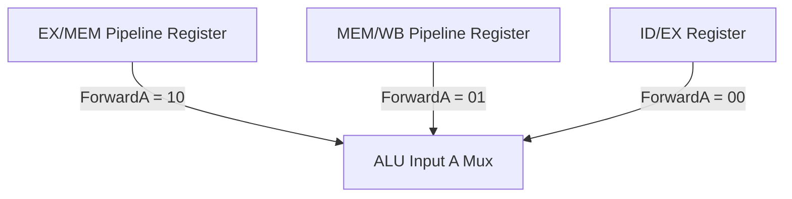

# Lecture 02: Processor Datapath Design and Pipelining

This lecture covers the hardware construction of single-cycle and pipelined CPU datapaths, control unit logic synthesis, critical path timing, pipeline interlocks, and forwarding unit hazard resolution.

---

## 1. Single-Cycle Datapath Synthesis

In a single-cycle implementation, every instruction executes in exactly one clock cycle. The clock cycle duration is constrained by the slowest instruction's critical path.


### 1.1 Control Unit Signal Decoding
The control unit examines the 6-bit `opcode` (and 6-bit `funct` for R-type instructions) to generate single-cycle control signals:

| Signal | Description | R-Type | `lw` | `sw` | `beq` |
|:---|:---|:---:|:---:|:---:|:---:|
| `RegDst` | Selects write register destination: `0 = rt`, `1 = rd` | 1 | 0 | X | X |
| `ALUSrc` | Selects second ALU operand: `0 = Reg[rt]`, `1 = SignExt(imm)` | 0 | 1 | 1 | 0 |
| `MemtoReg` | Selects write-back value: `0 = ALU result`, `1 = Memory data` | 0 | 1 | X | X |
| `RegWrite` | Enables writing to destination register in Register File | 1 | 1 | 0 | 0 |
| `MemRead` | Enables reading from Data Memory | 0 | 1 | 0 | 0 |
| `MemWrite` | Enables writing to Data Memory | 0 | 0 | 1 | 0 |
| `Branch` | Asserted for conditional branch evaluation | 0 | 0 | 0 | 1 |
| `ALUOp` | 2-bit code determining ALU operation | `10` (funct) | `00` (add) | `00` (add) | `01` (sub) |

### 1.2 Critical Path Timing Analysis
Let component delays be:
- Instruction Memory fetch: $t_{\text{IM}} = 250\text{ ps}$
- Register File read/write: $t_{\text{RF}} = 150\text{ ps}$
- ALU operation: $t_{\text{ALU}} = 200\text{ ps}$
- Data Memory access: $t_{\text{DM}} = 250\text{ ps}$
- Multiplexers and logic gates: $t_{\text{Mux}} = 25\text{ ps}$

The critical path occurs for the load word (`lw`) instruction:
$$
T_{\text{cycle}} = t_{\text{IM}} + t_{\text{RF}} + t_{\text{ALU}} + t_{\text{DM}} + t_{\text{Mux}} = 250 + 150 + 200 + 250 + 25 = 875\text{ ps}
$$
$$
f_{\max} = \frac{1}{T_{\text{cycle}}} = \frac{1}{875 \times 10^{-12}\text{ s}} \approx 1.143\text{ GHz}
$$

---

## 2. The Classic 5-Stage RISC Pipeline

Pipelining overlaps the execution of multiple instructions across five distinct hardware stages:


### 2.1 Stage Breakdown and Pipeline Registers
Adjacent stages are decoupled by edge-triggered **Pipeline Registers**:
1. **IF (Instruction Fetch):** Read instruction from I-Cache using `PC`; compute $PC + 4$.
   *Register: `IF/ID`* (Stores fetched 32-bit instruction and $PC + 4$).
2. **ID (Instruction Decode / Register Read):** Read registers `rs` and `rt`; sign-extend 16-bit immediate.
   *Register: `ID/EX`* (Stores operand values, sign-extended immediate, register numbers, and control signals).
3. **EX (Execute / Address Calculation):** ALU computes arithmetic result or memory effective address.
   *Register: `EX/MEM`* (Stores ALU result, write-data, target register, zero flag, and control signals).
4. **MEM (Memory Access):** Read or write data from/to D-Cache if instruction is `lw` or `sw`.
   *Register: `MEM/WB`* (Stores memory read data, ALU result, target register, and write-back controls).
5. **WB (Write Back):** Write selected result back to Register File.

---

## 3. Pipeline Hazards and Resolutions

Hazards prevent the next instruction in the instruction stream from executing during its designated clock cycle.

### 3.1 Structural Hazards
Occur when two instructions require the same hardware resource simultaneously.
- *Issue:* If instruction fetch and data memory access share a unified memory bus.
- *Solution:* Modern processors implement the **Harvard Architecture**, separating L1 cache into independent Instruction Cache (I-Cache) and Data Cache (D-Cache).

### 3.2 Data Hazards (Read-After-Write / RAW)
Occur when an instruction requires an operand generated by a preceding instruction that has not yet completed write-back.

```mips
add $s0, $t1, $t2   # Writes $s0 in WB (Cycle 5)
sub $t3, $s0, $t4   # Reads $s0 in ID (Cycle 3) -> Stale value!
```

#### Hardware Forwarding (Bypassing)
Rather than waiting for the WB stage to write to the register file, intermediate values are forwarded directly from pipeline registers to the ALU inputs:
- **EX-to-EX Forwarding:** From `EX/MEM` register to EX stage ALU input.
- **MEM-to-EX Forwarding:** From `MEM/WB` register to EX stage ALU input.



#### Forwarding Unit Logic Equations
For ALU input operand A:
```cpp
// 1. EX Hazard (Highest Priority)
if (EX_MEM.RegWrite && (EX_MEM.RegisterRd != 0) && (EX_MEM.RegisterRd == ID_EX.RegisterRs)) {
    ForwardA = 0b10; // Forward from EX/MEM ALU output
}
// 2. MEM Hazard
else if (MEM_WB.RegWrite && (MEM_WB.RegisterRd != 0) && (MEM_WB.RegisterRd == ID_EX.RegisterRs)) {
    ForwardA = 0b01; // Forward from MEM/WB result
}
else {
    ForwardA = 0b00; // No forwarding; use register file value
}
```

#### The Load-Use Interlock Hazard
When an instruction immediately follows a load word (`lw`) that provides its operand, forwarding alone cannot prevent a stall because data from memory is unavailable until the end of the MEM stage.

```mips
lw  $s0, 0($t1)    # Data arrives at end of Cycle 4 (MEM)
add $t2, $s0, $t3  # Needs data at start of Cycle 3 (EX) -> Impossible backward in time!
```

**Hazard Detection Unit Condition:**
```cpp
if (ID_EX.MemRead && 
   ((ID_EX.RegisterRt == IF_ID.RegisterRs) || (ID_EX.RegisterRt == IF_ID.RegisterRt))) {
    // 1. Stall the pipeline by freezing PC write and IF/ID write
    PC_Write = 0;
    IF_ID_Write = 0;
    // 2. Inject bubble (clear control signals in ID/EX to zero: no-op)
    ID_EX_Control_Zero = 1;
}
```
Inserting one stall bubble delays the dependent instruction by one cycle, allowing data to be forwarded from `MEM/WB` to `EX`.

---

## 4. Control Hazards (Branching Penalties)

When a conditional branch (`beq`, `bne`) is evaluated, the hardware does not know which instruction to fetch next until the branch outcome and target address are computed.

### 4.1 Branch Resolution in ID Stage
By placing an equality comparator and target adder inside the ID stage:
- Branch outcome determined during Cycle 2 instead of Cycle 4.
- Reduces branch misprediction penalty from 3 cycles to **1 cycle**.

### 4.2 Delayed Branching
The MIPS architecture defines a **Branch Delay Slot**: the instruction immediately following a jump or branch is always fetched and executed regardless of whether the branch is taken. Compilers schedule independent instructions into this delay slot to achieve 0-cycle branch penalty.

