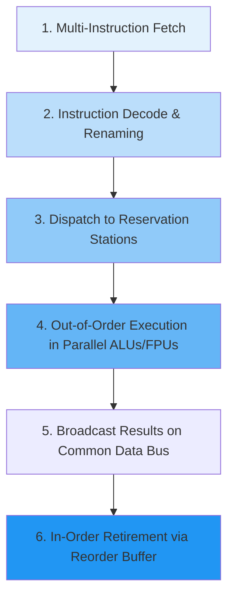
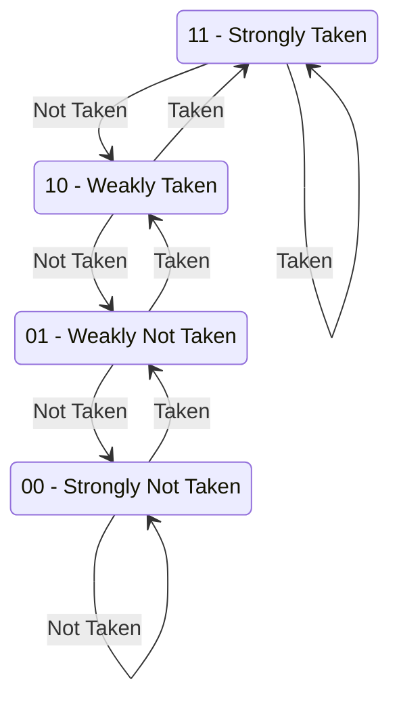

# Lecture 04: Parallelism, Multicore, and Superscalar Execution

This lecture examines the taxonomies of parallel computation, instruction-level parallelism (ILP), superscalar out-of-order execution, branch prediction, multicore architectures, cache coherence via the MESI protocol, and theoretical scaling laws.

---

## 1. Flynn's Taxonomy of Computer Architectures

Michael J. Flynn classified computer systems across two orthogonal dimensions: the number of concurrent instruction streams and data streams.

| Classification | Full Name | Architectural Description | Representative Examples |
|:---|:---|:---|:---|
| **SISD** | Single Instruction, Single Data | Classical uniprocessor executing sequential scalar instructions | Early x86 (8086), classic MIPS R2000 |
| **SIMD** | Single Instruction, Multiple Data | Single instruction applied synchronously across multiple data vectors | GPUs, Intel AVX-512, ARM Neon |
| **MISD** | Multiple Instruction, Single Data | Multiple instructions execute on a single redundant data stream | Fault-tolerant flight computers |
| **MIMD** | Multiple Instruction, Multiple Data | Multiple autonomous cores executing independent instruction streams on separate data | Modern multicore CPUs, high-performance clusters |

---

## 2. Instruction-Level Parallelism (ILP) and Superscalar Execution

Pipelining achieves an ideal CPI (Cycles Per Instruction) of 1.0. To achieve $\text{CPI} < 1.0$ ($\text{IPC} > 1.0$), a processor must issue and execute multiple instructions per cycle.

### 2.1 Superscalar Pipeline Pipeline Stages

### 2.2 Eliminating False Data Dependencies (Register Renaming)
Data hazards fall into three categories:
1. **RAW (Read-After-Write):** True data dependency (cannot be eliminated by renaming).
2. **WAR (Write-After-Read):** Anti-dependency (an instruction writes to a register before an earlier instruction reads it).
3. **WAW (Write-After-Write):** Output dependency (two instructions write to the same register out of order).

*Solution:* **Register Renaming** maps architectural registers (`$s0`, `$t0`) to a larger pool of physical registers, completely removing WAR and WAW hazards.

### 2.3 Tomasulo's Algorithm and the Reorder Buffer (ROB)
- **Reservation Stations:** Distributed queues at functional unit inputs holding instructions until all source operands are produced.
- **Common Data Bus (CDB):** Broadcasts computational results directly to all awaiting reservation stations and the register file simultaneously.
- **Reorder Buffer (ROB):** Records instruction completion status in speculative order but commits architectural register state strictly in program order, guaranteeing **precise exceptions** and correct speculative execution recovery.

---

## 3. Dynamic Branch Prediction: 2-Bit Saturating Counter

Pipelined and superscalar processors suffer significant latency penalties on branch mispredictions. A 2-bit saturating counter state machine prevents transient loop termination iterations from flipping prediction state prematurely:

- States `11` and `10` predict: **TAKEN**.
- States `01` and `00` predict: **NOT TAKEN**.
- Requires two consecutive mispredictions to reverse the prediction decision.

---

## 4. Multicore Processors and Cache Coherence

Modern CPUs integrate multiple processor cores on a single silicon die. Each core possesses private L1/L2 caches and shares a unified L3 cache and system DRAM.

### 4.1 The Cache Coherence Problem
If Core 1 and Core 2 both cache memory address `0x1000` with value 42, and Core 1 modifies its local copy to 99:
- Without synchronization, Core 2 reads stale value 42 from its private cache.

### 4.2 The MESI Protocol (Illinois Protocol)
Every cache line maintains two state bits tracking four distinct states:

| State | Line Present in Other Caches? | Memory is Up-to-Date? | Description |
|:---|:---:|:---:|:---|
| **M (Modified)** | No (Exclusive to this cache) | No (Dirty) | Line has been modified locally; memory is stale. |
| **E (Exclusive)** | No (Exclusive to this cache) | Yes (Clean) | Line is identical to main memory; no other cache holds it. |
| **S (Shared)** | Yes (May exist in other caches) | Yes (Clean) | Line is identical to main memory; read-only access. |
| **I (Invalid)** | N/A | N/A | Line contains no valid data; must be refetched on read. |

#### State Transitions on Snooping Bus:
1. **Local Read on Invalid (Miss):** Issues `BusRd`. If another cache holds line in `E` or `S`, enters `S`. If no other cache holds line, enters `E`.
2. **Local Write on Shared:** Issues `BusInval` (or `BusRdX`). All other caches invalidate their local copy ($S \to I$). Local state transitions to `M`.
3. **Snooped BusRd while in Modified:** Core must intervene, supply data to bus, write back to memory, and transition $M \to S$.

---

## 5. Theoretical Limits: Amdahl's Law and Gustafson's Law

### 5.1 Amdahl's Law (Fixed Workload Size)
Let $f$ be the fraction of a program's execution time that can be parallelized across $P$ processors, with $1 - f$ being strictly serial:
$$
\text{Speedup}(P) = \frac{T_{\text{serial}}}{T_{\text{parallel}}} = \frac{1}{(1 - f) + \frac{f}{P}}
$$
As processor count $P \to \infty$:
$$
\lim_{P \to \infty} \text{Speedup}(P) = \frac{1}{1 - f}
$$

*Example:* If a program is $90\%$ parallel ($f = 0.90$), maximum achievable speedup even with infinite processors is:
$$
\text{Speedup}_{\max} = \frac{1}{1 - 0.90} = \frac{1}{0.10} = 10\times
$$

### 5.2 Gustafson's Law (Scaled Workload Size)
When problem size scales with available computing resources:
$$
\text{Speedup}_{\text{scaled}}(P) = P - (1 - f)(P - 1) = (1 - f) + f \cdot P
$$
Demonstrates that massive parallelism remains practical when dataset volumes expand proportionally with processor counts.

