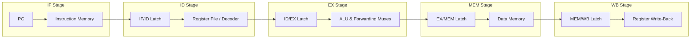

# Project 01: Cycle-Accurate 5-Stage Pipelined Processor Datapath Simulator

## Project Overview

Design and implement a cycle-accurate, software-based architectural simulator in modern C++ modeling the classic 5-stage MIPS RISC pipelined microprocessor datapath. The simulator executes raw binary machine code, models inter-stage pipeline latches, implements dynamic data forwarding and load-use stall detection, and outputs cycle-by-cycle architectural state dumps and performance metrics.

---

## 1. Supported Instruction Subset

The simulator must decode and execute the following 11 core MIPS32 instructions:

| Instruction | Format | Opcode | Funct | Semantics |
|:---|:---:|:---:|:---:|:---|
| `add rd, rs, rt` | R | `0x00` | `0x20` | $\text{Reg}[rd] \leftarrow \text{Reg}[rs] + \text{Reg}[rt]$ |
| `sub rd, rs, rt` | R | `0x00` | `0x22` | $\text{Reg}[rd] \leftarrow \text{Reg}[rs] - \text{Reg}[rt]$ |
| `and rd, rs, rt` | R | `0x00` | `0x24` | $\text{Reg}[rd] \leftarrow \text{Reg}[rs] \ \& \ \text{Reg}[rt]$ |
| `or rd, rs, rt` | R | `0x00` | `0x25` | $\text{Reg}[rd] \leftarrow \text{Reg}[rs] \ \| \ \text{Reg}[rt]$ |
| `slt rd, rs, rt` | R | `0x00` | `0x2A` | $\text{Reg}[rd] \leftarrow (\text{Reg}[rs] < \text{Reg}[rt]) \ ? \ 1 : 0$ |
| `addi rt, rs, imm` | I | `0x08` | — | $\text{Reg}[rt] \leftarrow \text{Reg}[rs] + \text{SignExt}(imm)$ |
| `lw rt, offset(rs)`| I | `0x23` | — | $\text{Reg}[rt] \leftarrow \text{Mem}[\text{Reg}[rs] + \text{SignExt}(offset)]$ |
| `sw rt, offset(rs)`| I | `0x2B` | — | $\text{Mem}[\text{Reg}[rs] + \text{SignExt}(offset)] \leftarrow \text{Reg}[rt]$ |
| `beq rs, rt, label`| I | `0x04` | — | $\text{if } (\text{Reg}[rs] == \text{Reg}[rt]) \ PC \leftarrow PC + 4 + (imm \ll 2)$ |
| `bne rs, rt, label`| I | `0x05` | — | $\text{if } (\text{Reg}[rs] \ne \text{Reg}[rt]) \ PC \leftarrow PC + 4 + (imm \ll 2)$ |
| `j target` | J | `0x02` | — | $PC \leftarrow (PC + 4)_{31..28} \,\|\, (target \ll 2)$ |

---

## 2. Hardware Architecture & Pipeline Latches

The simulator maintains state across clock ticks using discrete structs representing inter-stage pipeline registers.



### 2.1 Pipeline Latch Structures

```cpp
struct IF_ID_Latch {
    uint32_t pc_plus_4 = 0;
    uint32_t instruction = 0;
    bool is_valid = false;
};

struct ID_EX_Latch {
    uint32_t pc_plus_4 = 0;
    uint32_t read_data1 = 0;
    uint32_t read_data2 = 0;
    int32_t  sign_ext_imm = 0;
    uint8_t  rs = 0;
    uint8_t  rt = 0;
    uint8_t  rd = 0;
    
    // Control Signals
    bool reg_dst = false;
    bool alu_src = false;
    uint8_t alu_op = 0;
    bool mem_read = false;
    bool mem_write = false;
    bool reg_write = false;
    bool mem_to_reg = false;
    bool is_valid = false;
};

struct EX_MEM_Latch {
    uint32_t alu_result = 0;
    uint32_t write_data = 0;
    uint8_t  write_reg = 0;
    
    // Control Signals
    bool mem_read = false;
    bool mem_write = false;
    bool reg_write = false;
    bool mem_to_reg = false;
    bool is_valid = false;
};

struct MEM_WB_Latch {
    uint32_t read_data = 0;
    uint32_t alu_result = 0;
    uint8_t  write_reg = 0;
    
    // Control Signals
    bool reg_write = false;
    bool mem_to_reg = false;
    bool is_valid = false;
};
```

---

## 3. Hazard Detection and Forwarding Specification

### 3.1 Forwarding Unit (Bypassing)
The forwarding unit evaluates dependencies and controls ALU input multiplexers:
- **EX Hazard (Priority 1):**
  If `EX_MEM.reg_write` and `EX_MEM.write_reg != 0` and `EX_MEM.write_reg == ID_EX.rs`, forward `EX_MEM.alu_result` to ALU Input A.
- **MEM Hazard (Priority 2):**
  If `MEM_WB.reg_write` and `MEM_WB.write_reg != 0` and `MEM_WB.write_reg == ID_EX.rs`, forward write-back value to ALU Input A (only if not already forwarded by EX hazard).
- Equivalent logic applies to register `rt` (ALU Input B).

### 3.2 Load-Use Hazard Interlock Unit
Evaluated during the ID stage:
```cpp
if (ID_EX.mem_read && ((ID_EX.rt == IF_ID_rs) || (ID_EX.rt == IF_ID_rt))) {
    // 1. Freeze PC update (re-fetch same instruction)
    // 2. Freeze IF/ID latch (re-decode same instruction)
    // 3. Clear ID/EX control signals (inject NOP bubble into EX)
}
```

---

## 4. Input and Output Formats

### 4.1 Input Format (Hex Machine Code)
The simulator accepts a text file containing 32-bit hexadecimal machine words (one per line):
```
0x2008000A   # addi $t0, $zero, 10
0x20090014   # addi $t1, $zero, 20
0x01095020   # add  $t2, $t0, $t1
0xAC0A0000   # sw   $t2, 0($zero)
```

### 4.2 Output State Trace
At each clock tick, the simulator displays:
1. Current Cycle number.
2. Program Counter (`PC`).
3. State of non-zero general registers (`$0` to `$31`).
4. Pipeline occupancy status: instruction mnemonic residing in each stage (IF, ID, EX, MEM, WB).
5. Cumulative metrics upon termination: Total Execution Cycles, Instructions Retired, and CPI.

---

## 5. Project Milestones & Implementation Schedule

| Milestone | Deliverable Description | Target Criteria |
|:---|:---|:---|
| **Milestone 1** | Binary Instruction Decoder & Single-Cycle Core | Correctly disassembles and executes all 11 instructions sequentially. |
| **Milestone 2** | 5-Stage Pipelined Latch Pipeline Baseline | Instructions propagate through latches without hazard handling (verified with NOP padding). |
| **Milestone 3** | Full Forwarding Unit & Load-Use Interlock | Resolves RAW hazards via bypassing; inserts single stall bubble on load-use dependencies. |
| **Milestone 4** | Branch Handling & Final Performance Profiler | Implements early branch resolution in ID stage; outputs CPI and hazard statistics. |

---

## 6. Grading Rubric

| Assessment Dimension | Evaluation Criteria | Weight |
|:---|:---|:---:|
| **Instruction Decoding & Execution Correctness** | Accurate execution of all arithmetic, memory, and control flow instructions. | 25% |
| **Pipelined Latch State Accuracy** | Correct propagation of synchronous data and control signals across all 5 stages. | 25% |
| **Data Hazard Forwarding & Stalling** | Correct EX/MEM forwarding prioritization and accurate load-use stall insertion. | 25% |
| **Control Flow & Branch Hazards** | Proper pipeline flushing on taken branches without corrupted register commits. | 15% |
| **Performance Reporting & Code Quality** | Accurate CPI accounting, modular C++ design, and thorough test cases. | 10% |

