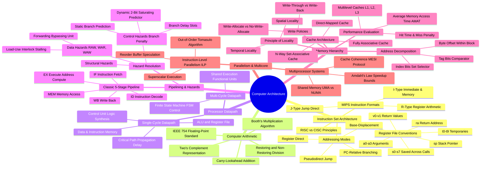

# Mindmap: Computer Architecture & Organization

This conceptual mindmap charts the taxonomy of modern computer architecture, instruction set design, CPU pipelining, memory hierarchies, and parallel processing systems.

