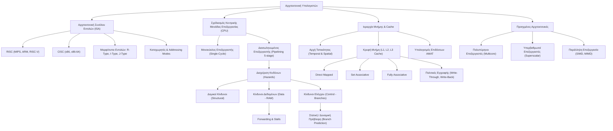

# Εννοιολογικός Χάρτης: Αρχιτεκτονική και Οργάνωση Υπολογιστών

## Διάγραμμα Αρχιτεκτονικής Υπολογιστών

```mermaid
graph TD
    CA["Αρχιτεκτονική Υπολογιστών"]
    
    CA --> ISA["Αρχιτεκτονική Συνόλου Εντολών (ISA)"]
    ISA --> RISC["RISC (MIPS, ARM, RISC-V)"]
    ISA --> CISC["CISC (x86, x86-64)"]
    ISA --> Formats["Μορφότυπα Εντολών: R-Type, I-Type, J-Type"]
    ISA --> Regs["Καταχωρητές & Addressing Modes"]

    CA --> CPU["Σχεδιασμός Κεντρικής Μονάδας Επεξεργασίας (CPU)"]
    CPU --> SC["Μονοκύκλος Επεξεργαστής (Single-Cycle)"]
    CPU --> PL["Διασωληνωμένος Επεξεργαστής (Pipelining 5-stage)"]
    PL --> Haz["Διαχείριση Κινδύνων (Hazards)"]
    Haz --> HazD["Δομικοί Κίνδυνοι (Structural)"]
    Haz --> HazData["Κίνδυνοι Δεδομένων (Data - RAW)"]
    HazData --> Fwd["Forwarding & Stalls"]
    Haz --> HazCtrl["Κίνδυνοι Ελέγχου (Control - Branches)"]
    HazCtrl --> Pred["Στατική / Δυναμική Πρόβλεψη (Branch Prediction)"]

    CA --> Mem["Ιεραρχία Μνήμης & Cache"]
    Mem --> Loc["Αρχή Τοπικότητας (Temporal & Spatial)"]
    Mem --> Cache["Κρυφή Μνήμη (L1, L2, L3 Cache)"]
    Cache --> DM["Direct Mapped"]
    Cache --> SA["Set Associative"]
    Cache --> FA["Fully Associative"]
    Cache --> WP["Πολιτικές Εγγραφής (Write-Through, Write-Back)"]
    Mem --> AMAT["Υπολογισμός Επιδόσεων AMAT"]

    CA --> Adv["Προηγμένες Αρχιτεκτονικές"]
    Adv --> Multi["Πολυπύρηνοι Επεξεργαστές (Multicore)"]
    Adv --> Super["Υπερβαθμωτοί Επεξεργαστές (Superscalar)"]
    Adv --> Par["Παράλληλη Επεξεργασία (SIMD, MIMD)"]
```

