# Chapter 18: Multicore Computers - Smart Notes

---

## 1.0 Hardware Performance Issues

### 1.1 Exponential Performance Growth of Microprocessors

**i. Improvement Factors:**
- Architecture organization improvements
- Operating frequency increases

**ii. Parallel Processor Enhancement Techniques:**
- **Pipelining**: Faster instruction processing
- **Superscalar Architecture**: More efficient multiple instruction execution
- **Simultaneous Multithreading (SMT)**: Better resource utilization

### 1.2 Moore's Law

**i. Historical Technology Manufacturing Evolution:**

| Period | Technology Size |
|----------|---------------------|
| 1971 | 10 μm |
| 1984 | 1 μm |
| 1990 | 600 nm |
| 2001 | 130 nm |
| 2005 | 65 nm |
| 2012 | 22 nm |
| 2018 | 7 nm |
| 2020 | 5 nm |
| 2023 | ~3 nm (Apple M3) |
| 2024 | ~2 nm |

**ii. Significance:**
- Continuous transistor size reduction enables higher density
- Performance increase and cost reduction

> [!INFO] **Definitions:**
>
> **MOSFET (Metal-Oxide-Semiconductor Field-Effect Transistor)**:
> - Fundamental component of microprocessors and memory
> - Functions as a switch or amplifier of electrical signals
> - Number of MOSFETs = computational power indicator
>
> **Wafer Scale Engine (WSE)**:
> - Entire surface of a silicon wafer used for one chip
> - Millions of cores, massive memory
> - Applications: AI, Machine Learning, HPC
> - Example: Cerebras WSE-2 (2.6 trillion transistors, 840,000 AI-cores)

### 1.3 Microprocessor and IC Technology Evolution

| Year | Component | Name | MOSFETs (billions) |
|------|---------|----------|-----------------|
| 2019 | IC Chip | Samsung V-NAND | 2000 |
| 2020 | GPU | AMD Instinct MI250X | 59 |
| 2020 | ML Processor | Colossus Mk2 GC200 | 59.4 |
| 2020 | IC Chip | Wafer Scale Engine 2 | 2600 |
| 2021 | Microprocessor | Apple M1 Max | 57 |

### 1.4 Pollack's Rule

> [!INFO] **Performance Theorem:**
>
> Processor performance increase is approximately proportional to the square root of complexity increase:
>
> $$ \text{Performance} \propto \sqrt{\text{Complexity}} $$
>
> **Example**: Doubling core logic circuits → ~40% performance increase

**i. Design Challenges:**
- Increased manufacturing difficulty
- Debugging complexity
- Scaling limitations

### 1.5 Complexity Increase and Power Consumption

**i. Power Problem:**
- Power consumption increases exponentially with transistor density
- Clock frequency worsens the problem
- Over 20 billion transistors in modern chips

**ii. Solution: Multiple Cores**
- Heat management
- Performance increase
- Efficient cache management

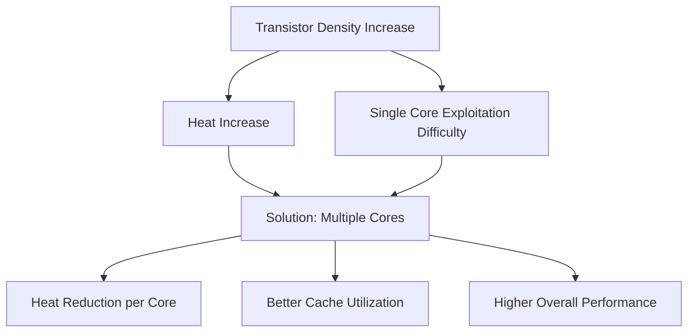

---

## 2.0 Software Performance Issues

### 2.1 Amdahl's Law

**i. Mathematical Formulation:**

$$
S = \frac{1}{(1-f) + \frac{f}{N}}
$$

Where:
- $ S $: Speedup
- $ f $: Parallel code percentage
- $ (1-f) $: Serial code percentage
- $ N $: Number of processors

**ii. Practical Example:**
- 10% serial code in an 8-processor system
- Achievement: Only 4.7× speedup (not 8×)

> [!WARNING] **Critical Observation:**
>
> Even a small percentage of serial code significantly limits parallel system performance.

**iii. Additional Software Overheads:**
- Communication between processors
- Workload distribution across cores
- Cache coherence maintenance

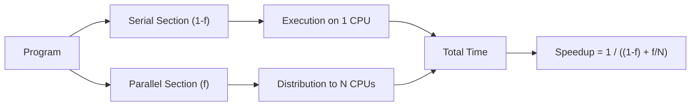

### 2.2 Speedup with Serial Sections

| Number of Processors | 0% Serial | 2% Serial | 5% Serial | 10% Serial |
|------------------|-------------|-------------|-------------|--------------|
| 1 | 1.0× | 1.0× | 1.0× | 1.0× |
| 2 | 2.0× | 1.96× | 1.90× | 1.82× |
| 4 | 4.0× | 3.77× | 3.48× | 3.08× |
| 8 | 8.0× | 6.90× | 5.93× | 4.71× |

### 2.3 Overhead Impact

**i. System overheads** (5%, 10%, 15%, 20%):
- Reduced actual performance
- Communication delays
- Thread synchronization

**ii. Observation from Benchmarks:**
- Single-threaded performance independent of core count
- Example: Intel i7-7700K (4/8) ≈ Ryzen Threadripper 1950X (16/32) in single-threaded workloads

---

## 3.0 Multicore Processor Configuration Factors

### 3.1 Basic Design Factors

**i. Number of Processors:**
- Number of cores on chip

**ii. Cache Levels:**
- L1, L2, L3 cache
- Hierarchy for access speed improvement

**iii. Shared Cache Amount:**
- Shared cache size between cores

**iv. Simultaneous Multithreading Support:**
- Concurrent execution of multiple threads per core

**v. Core Types:**
- **Homogeneous**: Identical cores
- **Heterogeneous**: Different cores for specialized functions

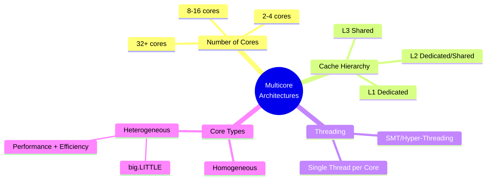

---

## 4.0 Cache Organization

### 4.1 Cache Configuration Types

**i. Level 1 Dedicated Cache:**
- Per core: Exclusive L1
- Split: L1-D (Data), L1-I (Instruction)
- Access to main memory via I/O

**ii. Level 2 Dedicated Cache:**
- Per core: Exclusive L1 + Dedicated L2
- Larger capacity per core

**iii. Shared Level 2 Cache:**
- Cores share common L2
- Reduced data replication between cores

**iv. Shared Level 3 Cache (L3):**
- L1, L2: Dedicated per core
- L3: Shared by all cores
- Intermediate space before main memory

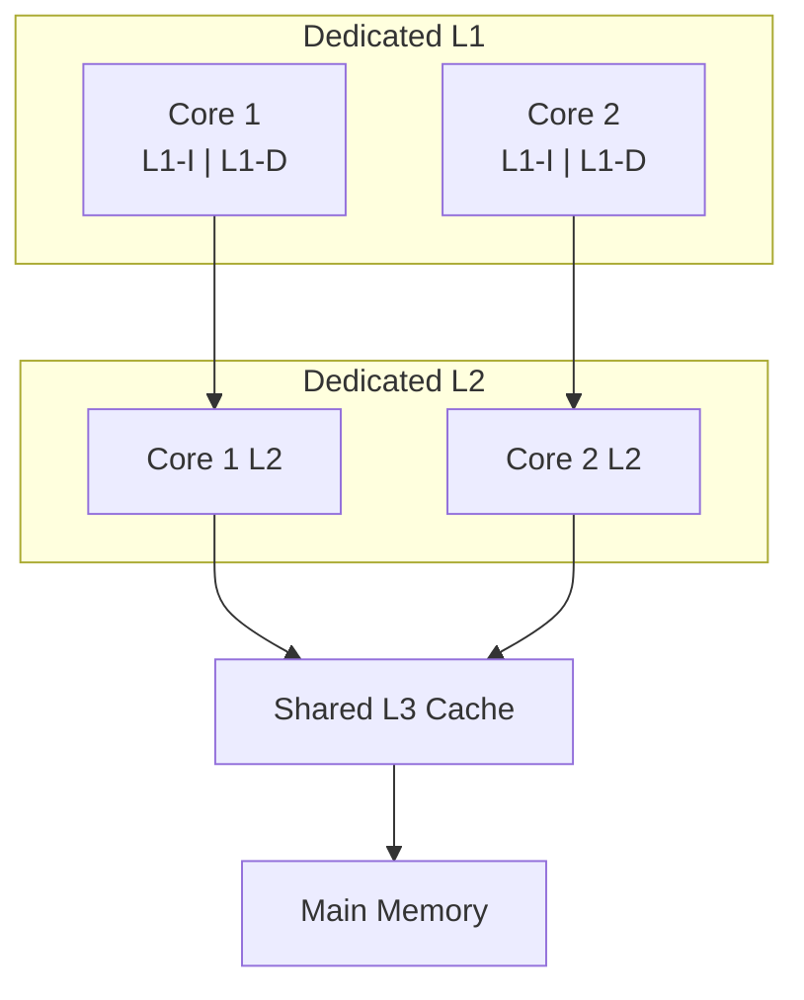

### 4.2 Shared Cache Advantages

**i. Reduced Miss Rates:**
- Overall miss rate reduction

**ii. Common Data Storage:**
- Data used by multiple cores stored once
- Resource savings

**iii. Dynamic Memory Allocation:**
- Replacement algorithms adjust allocation
- Threads with low locality gain more space

**iv. Efficient Communication:**
- Communication through shared cache
- Elimination of need for external networks

---

## 5.0 Heterogeneous System Architectures

### 5.1 CPU/GPU Multiple Cores

**i. GPU Characteristics:**
- Support for thousands of parallel threads
- Suitable for large data applications (vectors, matrices)
- Initial use: Graphics performance improvement
- Modern use: Repetitive operations on structured data

**ii. Technologies:**
- **CUDA**: Parallel processing platform (NVIDIA)
- **GPGPU**: General-Purpose computing on GPUs

> [!INFO] **Virtual Memory**:
>
> Management mechanism providing:
> - Impression of large contiguous memory space
> - Independence from physical RAM
> - Techniques: Paging, Segmentation
> - Conflict avoidance, larger dataset management

### 5.2 Heterogeneous Systems Architecture

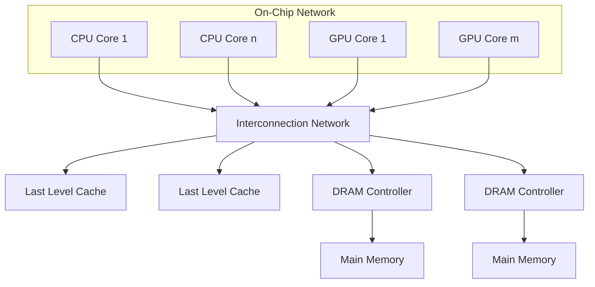

**i. Shared Virtual Memory:**
- Accessible by CPU and GPU
- Pages transferred to physical memory when needed

**ii. Coherence Policy:**
- Maintaining up-to-date data in CPU/GPU caches

**iii. Unified Programming Interface:**
- CPU serial power utilization
- GPU parallel power utilization

### 5.3 CPU/GPU Performance Comparison

**Example: AMD A10 5800K**

| Parameter | CPU | GPU |
|------------|-----|-----|
| Clock frequency | 3.8 GHz | 0.8 GHz |
| Cores | 4 | 384 |
| FLOPS/core/cycle | 8 | 2 |
| **GFLOPS** | **121.6** | **614.4** |

**i. Conclusions:**
- GPU: Lower frequency, but more cores
- GPU: 5× higher overall performance in parallel tasks
- CPU: Flexible for serial processes
- GPU: Recommended for graphics, ML, scientific computing

---

## 6.0 ARM Architecture

### 6.1 Introduction to ARM

**i. Advanced RISC Machine:**
- Originally: Acorn RISC Machine
- Basis: RISC Architecture (Reduced Instruction Set Computing)
- Manufacturing: Multiple manufacturers via ARM Holdings licenses

**ii. Proliferation:**
- Up to 2017: >100 billion ARM processors produced
- Most widely used instruction set architecture

> [!INFO] **RISC (Reduced Instruction Set Computing)**:
>
> **Key Characteristics:**
> - Small and optimized instruction set
> - Each instruction executes in ~1 clock cycle
> - Instruction uniformity (fixed length/structure)
> - Focus on software (compiler)
> - Efficient register usage
>
> **Modern Architectures:** ARM, MIPS, RISC-V

### 6.2 big.LITTLE Architecture

**i. Concept:**
- Combination of high-performance (big) and low-power (LITTLE) cores
- Similar ISA architectures, different characteristics

**ii. Goals:**
- Balance between performance and energy efficiency
- Primarily for smartphones, tablets

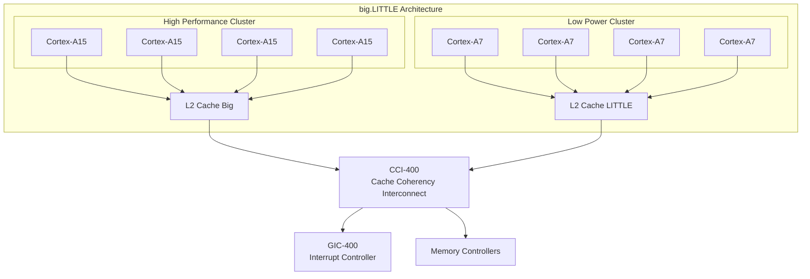

### 6.3 Cortex-A7 vs A15 Performance Comparison

| Characteristic | Cortex-A7 | Cortex-A15 |
|----------------|-----------|------------|
| Performance per MHz | 1× | ~2× |
| Energy Efficiency | 3× better | 1× |
| Pipelining | 8-10 stages | 15-24 stages |
| Execution | In-order | Out-of-order |
| Instructions/cycle | 2 (5 execution units) | 3 (8 execution units) |
| Instruction queue | Unified | Separate per unit |

**i. Cortex-A15:**
- Double performance per MHz
- Higher power consumption

**ii. Cortex-A7:**
- Three times more energy efficient for same load
- 4 power operating points + idle mode

### 6.4 big.LITTLE Operating Models

#### 6.4.1 Clustered Switching

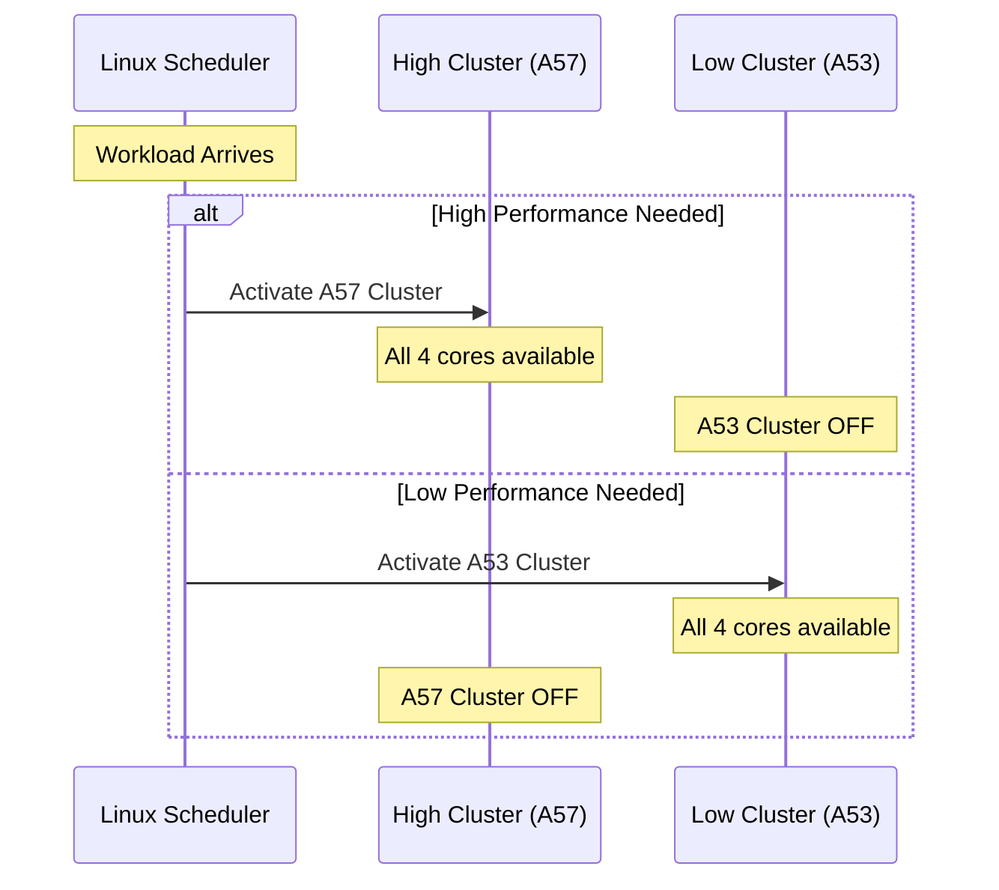

**i. Characteristics:**
- Select **one cluster** at a time
- High Cluster: When ≥1 high-performance core is needed
- Low Cluster: Otherwise

#### 6.4.2 In-Kernel Switcher

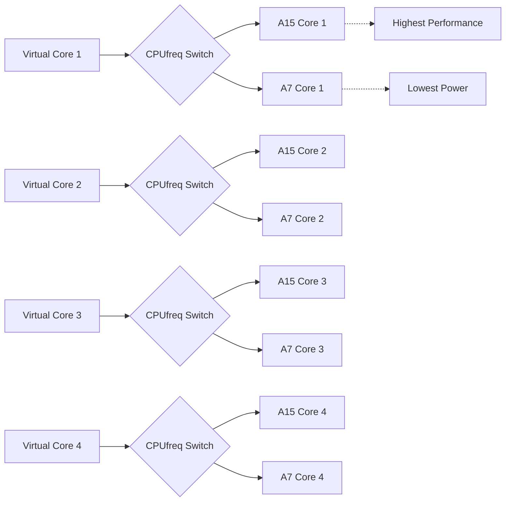

**i. Characteristics:**
- 4 SMP virtual cores
- CPUfreq switch per virtual core
- Dynamic switching between A15/A7

#### 6.4.3 Heterogeneous Multi-Processing (HMP)

**i. Characteristics:**
- **All 8 cores** (4× A15 + 4× A7) simultaneously active
- Linux Scheduler: 8 asymmetric cores
- Routing to big or LITTLE based on workload

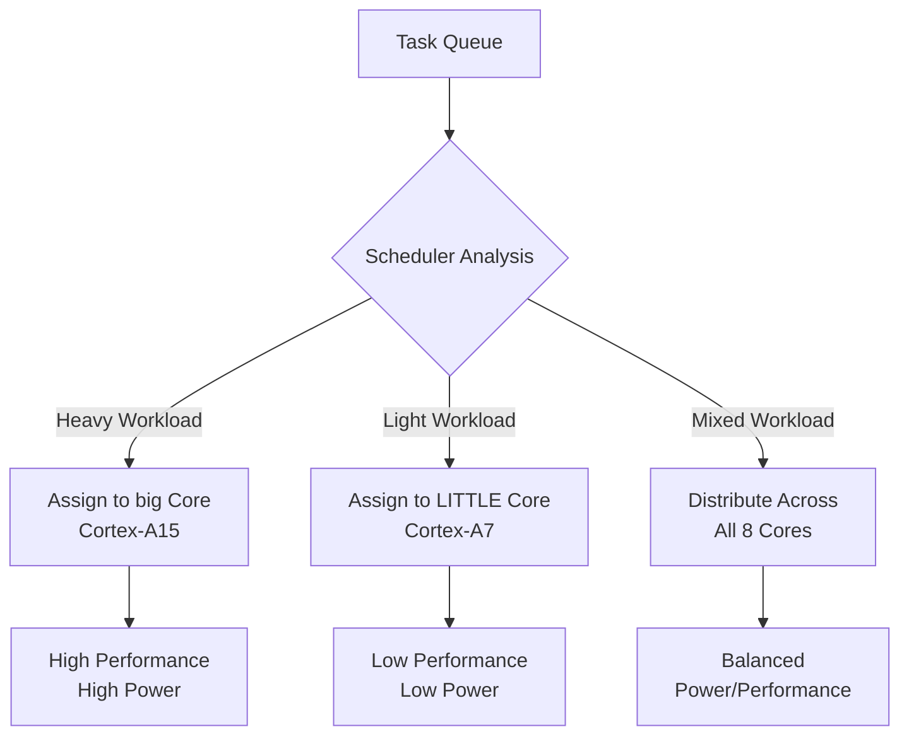

### 6.5 ARM DynamIQ

**i. Introduction:**
- Cores: Cortex-A75, Cortex-A55
- Enhanced AI/ML support

**ii. Improvements:**
- **>50× AI performance boost** on CPU (3-5 years)
- **10× faster response** on accelerators
- Dedicated processor instructions for AI
- Better acceleration access

### 6.6 ARM Cortex-X1

| Characteristic | Value |
|----------------|------|
| Release Date | 2020 |
| Designer | ARM Ltd. |
| Max Clock Rate | 3.0 GHz (phones), 3.3 GHz (tablets/laptops) |
| Address Width | 40-bit |
| L1 Cache | 128 KiB (64 KiB I-cache + 64 KiB D-cache) per core |
| L2 Cache | 512–1024 KiB per core |
| L3 Cache | 512 KiB – 8 MiB (optional) |

**i. Characteristics:**
- Out-of-order superscaling
- 5 instruction fetch per cycle
- 224-register window
- SIMD units: 4×128b

---

## 7.0 Apple M1 Pro/Max

### 7.1 Specifications

| Characteristic | M1 Pro | M1 Max |
|----------------|--------|--------|
| Date | October 18, 2021 | October 18, 2021 |
| Application | MacBook Pro | MacBook Pro |
| Technology | 5 nm | 5 nm |
| Microarchitecture | Firestorm + Icestorm | Firestorm + Icestorm |
| Instruction Set | ARMv8.4-A | ARMv8.4-A |
| Transistors | 33.7 billion | 57 billion |
| CPU Cores | 8 or 10 (6-8 perf + 2 efficiency) | 10 (8 perf + 2 efficiency) |
| GPU Cores | Up to 16 | Up to 32 |
| Neural Engine | 16 cores, 600 billion ops/sec | 16 cores, 600 billion ops/sec |

**i. GPU Structure:**
- Each GPU core: 16 execution units
- Each execution unit: 8 ALUs

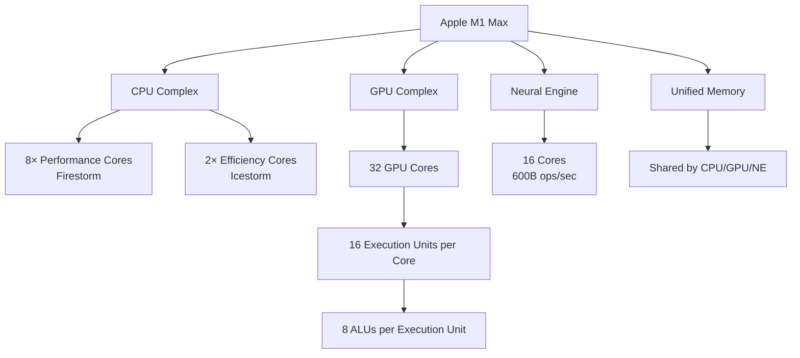

---

## 8.0 CPU and GPU Comparison

### 8.1 Structural Differences

| Characteristic | CPU | GPU |
|----------------|-----|-----|
| Number of Cores | Few powerful (4-64) | Many simple (>1000) |
| Cache | Large per core | Small per core |
| Execution | Out-of-order | In-order (SIMD) |
| Branch Prediction | Advanced | Basic |
| Parallelism | Thread-level | Massive data parallelism |

**i. CPU:**
- Few powerful cores
- Large cache
- Branch prediction
- Out-of-order instruction execution

**ii. GPU:**
- Many small, simple cores
- In-order execution
- **SIMD** (Single Instruction Multiple Data): Parallel floating-point data processing
- Modern implementations: >1000 cores
  - NVIDIA Tesla V100: 5,120 CUDA cores
  - NVIDIA H100: 18,176 cores

### 8.2 GPU vs CPU Performance Evolution

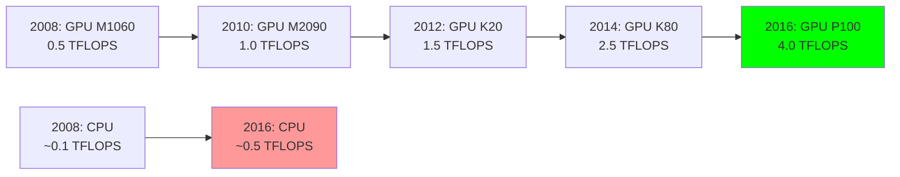

**i. Modern Performance:**
- NVIDIA Tesla V100: 7.5 TFLOPS (double precision), 15 TFLOPS (single precision)
- NVIDIA H100 (2022): 33.5 TFLOPS (double precision)

> [!INFO] **TFLOPS (Tera Floating Point Operations Per Second)**:
>
> Performance measurement unit:
> - 1 TFLOPS = 1 trillion floating-point operations/second
> - Critical for scientific computing, simulations, AI
>
> **Single Precision (FP32 - 32 bits):**
> - 1 bit: sign
> - 8 bits: exponent
> - 23 bits: fractional part
> - Precision: ~7 decimal digits
> - Use: ML, graphics
>
> **Double Precision (FP64 - 64 bits):**
> - 1 bit: sign
> - 11 bits: exponent
> - 52 bits: fractional part
> - Precision: ~15 decimal digits
> - Use: Scientific simulations, financial models

---

## 9.0 NVIDIA Fermi Architecture

### 9.1 Introduction

**i. Significance:**
- First GPU architecture for graphics **and** GPGPU
- Release year: ~2010

**ii. Key Features:**
- **64-bit memory addressing**: Handling larger data volumes
- **Unified Memory**: Easier CPU-GPU cooperation
- **CUDA improvements**: Data analysis, neural network training
- **DirectX 11**: Dynamic lighting, shadows, complex effects
- Foundation for GeForce GTX series

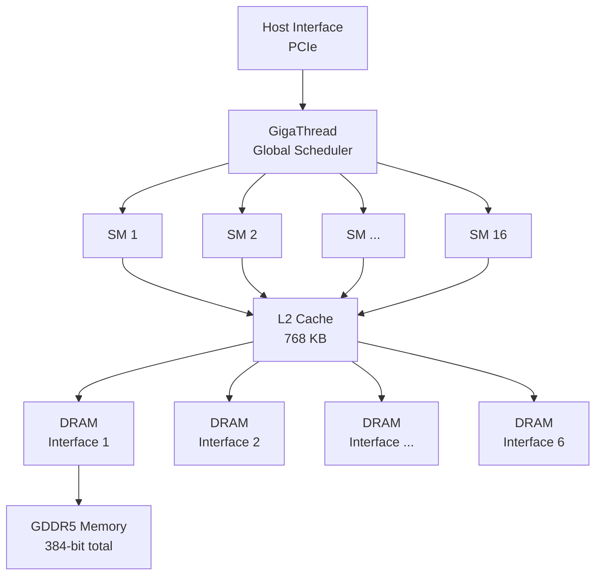

### 9.2 Streaming Multiprocessor (SM) Structure

**i. Contents per SM:**
- 2 columns × 32 CUDA cores = **64 CUDA cores**
- 16 Load/Store units (LD/ST)
- 4 Special Function Units (SFU)

**ii. Register File:**
- 32K × 32-bit registers

**iii. Thread Scheduler:**
- Dual SIMD thread scheduler
- Thread splitting into 32-thread bundles (warps)
- Each thread: Own instruction counter + register set

**iv. Special Function Units (SFU):**
- Operations: sin, cos, reciprocals, square root
- Performance: 1 clock cycle (8 cycles for 32 parallel threads)

**v. Shared Memory/L1 Cache:**
- 64 KB shared per SM

> [!INFO] **Streaming Multiprocessors (SMs)**:
>
> GPU basic computational units:
> - High parallelism processing cores
> - Execution of large number of threads simultaneously
>
> **Characteristics:**
> 1. **Multiple parallel processing**: Tens-hundreds of threads
> 2. **Specialized units**: FP, LD/ST, SFU
> 3. **Local cache**: Access latency reduction
> 4. **Flexibility**: Graphics and GPGPU

### 9.3 Fermi Architecture Overview

| Component | Specification |
|----------|-------------|
| SM Count | 16 |
| CUDA Cores per SM | 32 (2 columns × 16) |
| Total CUDA Cores | 512 |
| LD/ST Units per SM | 16 |
| SFU per SM | 4 |
| L2 Cache | 768 KB (shared) |
| Memory Interfaces | 6 × 64-bit = 384-bit |
| Memory Type | GDDR5 |

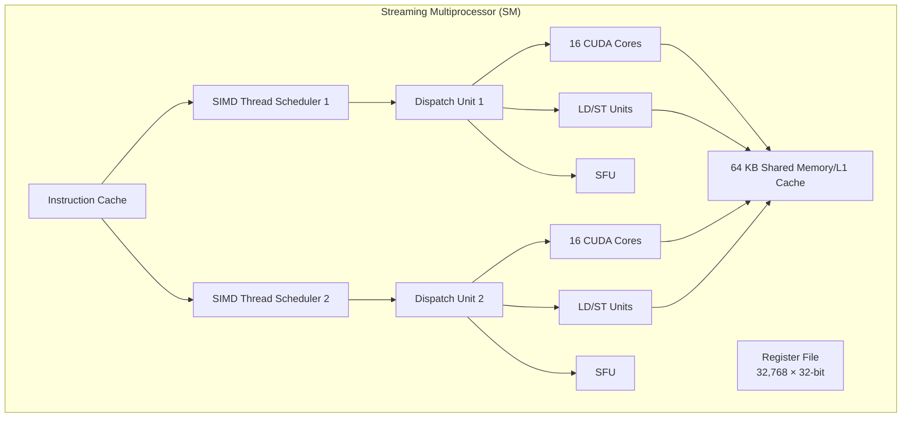

### 9.4 Parallel Processing Characteristics

**i. GigaThread Scheduler:**
- Thread block distribution to 16 SMs
- Each SM: Own local thread scheduler

**ii. Latency Hiding:**
- Many threads mask memory latencies
- Fine-grained threading

**iii. CUDA Core Cooperation:**
- Cores work in pairs for FP64 operations

### 9.5 NVIDIA Architecture Evolution

| Architecture | FP32 Units/SM | FP64 Units/SM | Special Features |
|---------------|---------------|---------------|-----------------------|
| **Tesla** | 8 | - | First CUDA architecture |
| **Fermi** | 32 | 16 | 64-bit addressing, Unified Memory |
| **Kepler** | 192 | 64 | Higher parallelism |
| **Maxwell** | 128 | 4 | Energy efficiency |
| **Pascal** | 64 | 32 | FP16 support (2×FP16 per FP32 core) |
| **Volta/Turing** | 64 | 32 | **Tensor Cores** for AI |

**i. Volta & Turing Innovations:**
- **Tensor Cores**: Dedicated AI/ML units
- Supercomputer problem solving
- Consumer GPU processing

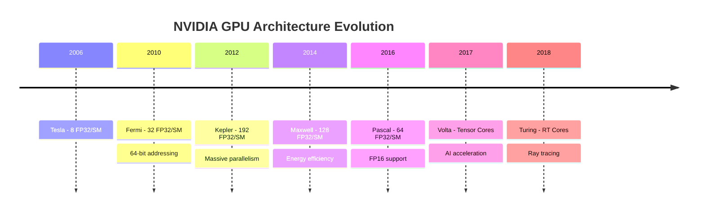

---

## 10.0 Conclusions and Trends

### 10.1 Basic Multicore Design Principles

**i. Hardware Constraints:**
- Pollack's Rule: $ \text{Performance} \propto \sqrt{\text{Complexity}} $
- Power density increases exponentially
- Solution: Multiple simpler cores

**ii. Software Constraints:**
- Amdahl's Law limits speedup
- Serial code = bottleneck
- Communication and synchronization overhead

**iii. Memory Hierarchy:**
- L1: Dedicated, fastest
- L2: Dedicated or Shared
- L3: Shared, larger capacity

### 10.2 Heterogeneous Computing

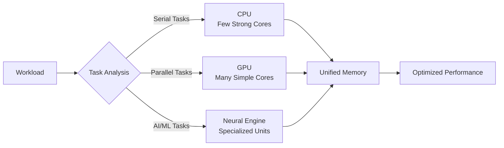

**i. CPU Strengths:**
- Serial performance
- Branch prediction
- Out-of-order execution

**ii. GPU Strengths:**
- Massive parallelism (SIMD)
- Throughput optimization
- Floating-point operations

**iii. Specialized Accelerators:**
- Tensor Cores: AI/ML
- Neural Engines: On-device inference
- RT Cores: Ray tracing

### 10.3 Future Trends

**i. Process Technology:**
- From 10 μm (1971) → 2 nm (2024)
- Moore's Law continues (at slower pace)

**ii. Architectural Innovations:**
- ARM DynamIQ: >50× AI boost in 3-5 years
- Wafer-scale chips: 2.6 trillion transistors
- 3D stacking technologies

**iii. Software Adaptation:**
- Algorithm parallelization
- Heterogeneous programming models (CUDA, OpenCL)
- AI-driven workload optimization

---

## Appendix: Key Formulas

### A.1 Amdahl's Law

$$
S = \frac{1}{(1-f) + \frac{f}{N}}
$$

- $ S $: Speedup
- $ f $: Parallel program fraction
- $ N $: Number of processors

### A.2 Pollack's Rule

$$
\text{Performance} \propto \sqrt{\text{Complexity}}
$$

Doubling complexity → ~40% performance increase

### A.3 GFLOPS Calculation

$$
\text{GFLOPS} = \text{Cores} \times \text{Clock (GHz)} \times \frac{\text{FLOPS}}{\text{Core/Cycle}}
$$

**Example (AMD A10 GPU):**
$$
\text{GFLOPS} = 384 \times 0.8 \times 2 = 614.4 \text{ GFLOPS}
$$

---

## References and Sources

- University of Ioannina - Department of Informatics & Telecommunications
- Instructor: Alexandros Bantaloukas-Arjmand (k.arjmand@uoi.gr)
- Editor: Konstantinos Sakkas (ksakkas@uoi.gr)
- Chapter 18: Computer Architecture (3rd Semester)