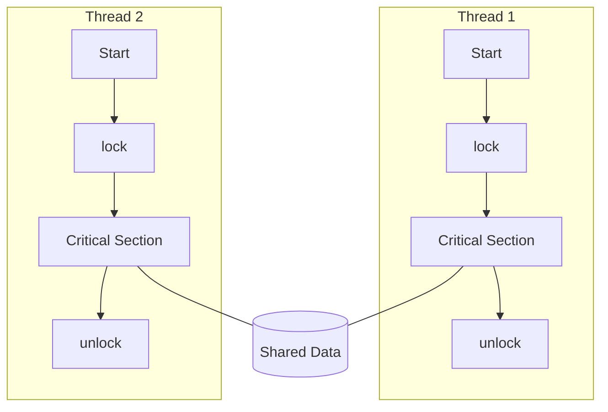

# Chapter 17: Parallel Processing

## 1.0 Fundamental Performance Concepts in Parallel Systems

### 1.1 Execution Times and Costs

> [!INFO]
> The core idea of parallel processing is that a problem with total work $W$ can be distributed across multiple processors to reduce **execution time**. However, actual performance depends on:
> 
> - serial time $T_s$
> - parallel time $T_p$
> - **parallel overhead** $T_O$ (communication, synchronization, load imbalance).

The total resource (processor-time product) in a system with $p$ processors is:

$$
p \cdot T_p = T_s + T_O
$$

**Legend:**
- $p$: number of processors
- $T_s$: serial execution time
- $T_p$: parallel execution time
- $T_O$: parallel overhead (communication, synchronization, load imbalance)

### 1.2 Speedup and Efficiency

$$
S(p) = \frac{T_s}{T_p}
$$

**Legend:**
- $S(p)$: speedup with $p$ processors
- $T_s$: serial time
- $T_p$: parallel time

**Efficiency** is defined as:

$$
E(p) = \frac{S(p)}{p}
$$

**Legend:**
- $E(p)$: efficiency per processor
- $S(p)$: speedup
- $p$: number of processors

A value $E(p) \approx 1$ (or 100%) indicates near-ideal parallelism.

### 1.3 Amdahl's Law

> [!INFO]
> Amdahl's Law models the **maximum possible speedup** when only a fraction of the code can be parallelized.

Let:
- fraction of serial code: $1-P$
- fraction of fully parallelizable code: $P$

Then the speedup with $N$ processors is:

$$
S(N) = \frac{1}{(1-P) + \frac{P}{N}}
$$

**Legend:**
- $P$: fraction of the program that can execute in parallel ($0 \le P \le 1$)
- $N$: number of processors
- $1-P$: serial portion of the program

Maximum theoretical speedup as $N \to \infty$:

$$
S_{\max} = \frac{1}{1-P}
$$

**Interpretation:** Even if processors are increased indefinitely, performance gain is limited by the **non-parallelizable** portion.

### 1.4 Gustafson's Law

> [!INFO]
> Gustafson's Law addresses Amdahl's limitation: in practice, the **problem scale** increases when more processors are available.

If $s$ is the serial fraction (in time) in a system with $N$ processors and $p = 1-s$ the parallel fraction, then the **scaled speedup** is:

$$
S_G(N) = s + p \cdot N = 1 + (N-1)\cdot p
$$

**Legend:**
- $S_G(N)$: scaled speedup according to Gustafson
- $N$: number of processors
- $s$: serial fraction in parallel execution
- $p$: parallel fraction, $p = 1-s$

## 2.0 MIPS and IPC in Parallel Systems

### 2.1 MIPS Definition

$$
\text{MIPS} = \frac{f \cdot IPC}{10^6}
$$

**Legend:**
- $\text{MIPS}$: Million Instructions Per Second
- $f$: clock frequency in Hz
- $IPC$: Instructions Per Cycle

In multi-core/multi-processor systems, the total MIPS rate is approached (ideally) by summing the MIPS of all cores, provided there are no significant memory or bus bottlenecks.

## 3.0 Flynn's Taxonomy

### 3.1 Basic Architectural Components

| Component | Name | Function |
|-----------|------|----------|
| **CU** | Control Unit | Instruction flow management |
| **PU** | Processing Unit | Instruction execution |
| **MU** | Memory Unit | Data storage |
| **LM** | Local Memory | Per-processor memory |

### 3.2 Flynn Architecture Categories

| Type | Full Name | Characteristics | Examples |
|------|-----------|-----------------|----------|
| **SISD** | Single Instruction, Single Data | 1 instruction stream, 1 data stream | Traditional single processors |
| **SIMD** | Single Instruction, Multiple Data | 1 instruction stream, multiple data streams | GPUs, Vector Processors |
| **MISD** | Multiple Instruction, Single Data | Multiple instruction streams, 1 data stream | Rare, theoretical |
| **MIMD** | Multiple Instruction, Multiple Data | Multiple instruction streams, multiple data streams | SMP, NUMA, Clusters |

> [!INFO]
> ```mermaid
> flowchart TB
>     START[Computer Architecture]
>     START --> IS{Instruction Streams}
>     IS -->|One| SINGLE_I[Single Instruction]
>     IS -->|Multiple| MULTI_I[Multiple Instructions]
>     
>     SINGLE_I --> DS1{Data Streams}
>     DS1 -->|One| SISD[SISD\nTraditional Processor]
>     DS1 -->|Multiple| SIMD[SIMD\nGPUs, Vector Processors]
>     
>     MULTI_I --> DS2{Data Streams}
>     DS2 -->|One| MISD[MISD\nTheoretical]
>     DS2 -->|Multiple| MIMD[MIMD\nSMP, NUMA, Clusters]
> ```

## 4.0 SISD vs SIMD Comparison

| Property | SISD | SIMD |
|----------|------|------|
| Instruction Streams | One | One |
| Data Streams | One | Multiple |
| Parallelism | Serial | Data Parallelism |
| Typical Examples | Classical CPUs | GPUs, Vector Units |
| Suitability | General-purpose | Bulk operations on arrays/vectors |

> [!INFO]
> ```mermaid
> flowchart LR
>     subgraph SISD[SISD]
>         CU1[CU]
>         PU1[PU]
>         MEM1[Memory]
>         CU1 --> PU1
>         PU1 <--> MEM1
>     end
> 
>     subgraph SIMD[SIMD]
>         CU2[Shared CU]
>         PUA[PU 1]
>         PUB[PU 2]
>         PUC[PU 3]
>         PUN[PU N]
>         LMA[LM 1]
>         LMB[LM 2]
>         LMC[LM 3]
>         LMN[LM N]
>         CU2 --> PUA
>         CU2 --> PUB
>         CU2 --> PUC
>         CU2 --> PUN
>         PUA <--> LMA
>         PUB <--> LMB
>         PUC <--> LMC
>         PUN <--> LMN
>     end
> ```

## 5.0 MIMD: SMP, NUMA and Clusters

### 5.1 SMP, NUMA, Clusters Comparison

| Property | SMP | NUMA | Clusters |
|----------|-----|------|----------|
| Memory | Shared UMA | Distributed, CC-NUMA | Private per node |
| Access Time | Uniform | Non-uniform | Network (message passing) |
| Scalability | 2–8 CPUs | 16–1024 CPUs | Practically unlimited |
| Programming Model | Shared Memory | Shared Memory with locality | Message Passing (MPI) |
| Cache Coherence | MESI/MOESI | Directory-based CC-NUMA | Local, explicit communication |

> [!INFO]
> ```mermaid
> flowchart TB
>     subgraph SMP[SMP - UMA]
>         P1[CPU1 + Cache]
>         P2[CPU2 + Cache]
>         PN[CPU N + Cache]
>         BUS[System Bus]
>         MEM[Shared Memory]
>         P1 <--> BUS
>         P2 <--> BUS
>         PN <--> BUS
>         BUS <--> MEM
>     end
> 
>     subgraph NUMA[NUMA]
>         subgraph N1[Node 1]
>             C1[CPU1..k]
>             M1[Local Mem 1]
>             C1 <--> M1
>         end
>         subgraph N2[Node 2]
>             C2[CPU1..k]
>             M2[Local Mem 2]
>             C2 <--> M2
>         end
>         IC[Interconnect]
>         N1 <--> IC
>         N2 <--> IC
>     end
> 
>     subgraph CL[Cluster]
>         NODE1[Node 1: CPU+Mem]
>         NODE2[Node 2: CPU+Mem]
>         NODE3[Node 3: CPU+Mem]
>         NET[High-speed Network]
>         NODE1 <--> NET
>         NODE2 <--> NET
>         NODE3 <--> NET
>     end
> ```

## 6.0 Cache Coherence

### 6.1 MESI and MOESI Protocols

| State | Protocol | Meaning | Characteristics |
|-------|----------|---------|-----------------|
| **M** | MESI/MOESI | Modified | Unique copy, differs from memory, requires write-back |
| **E** | MESI/MOESI | Exclusive | Unique copy, matches memory |
| **S** | MESI/MOESI | Shared | Multiple copies, matches memory |
| **I** | MESI/MOESI | Invalid | Invalid data |
| **O** | MOESI | Owned | Modified data, shared clean copies may exist |


 ```mermaid
  stateDiagram-v2
    direction LR
    
    state "Invalid (I)" as I
    state "Shared (S)" as S
    state "Exclusive (E)" as E
    state "Modified (M)" as M

    [*] --> I
    
    %% Read Transitions
    I --> E: Read miss (no other cache)
    I --> S: Read miss (others have copy)
    
    %% Local Write / Upgrade
    E --> M: Local Write
    S --> M: Local Write + Invalidate
    
    %% Remote Bus Hits
    E --> S: Other core reads
    M --> S: Other core reads (WB)
    
    %% Invalidation Transitions
    E --> I: Other core writes
    S --> I: Other core writes
    M --> I: Other core writes (WB)
    
    %% Evictions
    M --> [*]: Eviction (WB)
    E --> [*]: Eviction
    S --> [*]: Eviction


```

### 6.2 Write-Invalidate vs Write-Update

| Policy | Operation | Advantages | Disadvantages |
|--------|-----------|------------|---------------|
| Write-Invalidate | Writer invalidates other caches | Fewer bus writes | More cache misses on reads after write |
| Write-Update | Writer sends new data to all | Fast visibility of new values | High bus traffic |

Modern SMP/CC-NUMA systems primarily implement **write-invalidate** protocols (MESI/MOESI) with write-back caches.

## 7.0 False Sharing and Locality

> [!INFO]
> ```mermaid
> flowchart TB
>     subgraph CL[Cache Line 64B]
>         A[Var A - Thread 1]
>         PAD[...]
>         B[Var B - Thread 2]
>     end
> 
>     T1[Thread 1] --> A
>     T2[Thread 2] --> B
>     A -.->|Invalidate| C2[Cache Core 2]
>     B -.->|Invalidate| C1[Cache Core 1]
> ```

| Phenomenon | Description | Impact | Mitigation |
|------------|-------------|--------|------------|
| True Sharing | Multiple cores write/read the same variable | Frequent invalidations, serialization | Reduce access to shared data |
| False Sharing | Different variables on the same cache line | Unnecessary invalidations, low throughput | Structure padding, cache line alignment |

In NUMA, placing data near threads (thread/data affinity) reduces interconnect cost and the number of coherence messages.

## 8.0 Multithreading and TLP (Thread-Level Parallelism)

### 8.1 Multithreading Types

| Technique | Name | Idea | Characteristics |
|-----------|------|------|-----------------|
| Fine-Grained | Fine-Grained Multithreading | Switch thread every cycle | Hides latency, requires many threads |
| Coarse-Grained | Coarse-Grained Multithreading | Switch on large stalls (e.g. cache miss) | Simpler hardware, less resource utilization |
| SMT | Simultaneous Multithreading | Multiple threads in the same cycle | High pipeline utilization, increased complexity |

> [!INFO]
> ```mermaid
> flowchart TB
>     MT[Multithreading]
>     MT --> FG[Fine-Grained]
>     MT --> CG[Coarse-Grained]
>     MT --> SMT[Simultaneous MT]
>     FG --> FG_DESC[Switch every cycle]
>     CG --> CG_DESC[Switch on large stalls]
>     SMT --> SMT_DESC[Multiple threads simultaneously]
> ```

## 9.0 Synchronization: Locks, Semaphores, Barriers, Atomics

### 9.1 Basic Primitives Comparison

| Primitive  | Property              | Typical Use                      | Notes                         |
| ---------- | --------------------- | -------------------------------- | ----------------------------- |
| Mutex/Lock | Mutual Exclusion      | Critical section protection      | Spin or blocking locks        |
| Semaphore  | Counter-based sync    | Producer-Consumer, resource pools | Binary or counting            |
| Barrier    | Group synchronization | Parallel loops, BSP supersteps    | All processes must arrive     |
| Atomic Ops | Indivisible operations | Lock-free structures             | CAS, test-and-set, LL/SC     |

> [!INFO]


### 9.2 Spin Locks vs Blocking Locks

| Lock Type | Operation | Advantages | Disadvantages |
|-----------|-----------|------------|---------------|
| Spin Lock | Busy-waiting with atomic ops | Very fast for small critical sections | CPU waste, poor under high contention |
| Blocking Lock | Thread blocks at OS | Better for large critical sections | Context switch overhead |

### 9.3 Atomic Operations

Common atomic primitives:

- **Test-and-Set (TAS)**
- **Compare-and-Swap (CAS)**
- **Load-Linked/Store-Conditional (LL/SC)**

Example of an idealized spinlock using CAS:

```c
while (CAS(&lock, 0, 1) != 0) {
    // spin
}
// critical section
lock = 0;
```

## 10.0 Memory Consistency Models

### 10.1 Sequential Consistency (SC)

> [!INFO]
> Sequential Consistency requires all memory accesses to appear as if executed in some global total order, consistent with each processor's program order.

- Easy to reason about
- Limits reorderings and performance

### 10.2 Release Consistency (RC)

Divides accesses into **acquire** and **release**.

Rules:
- Before any shared memory access, every previous **acquire** by the same processor must have completed.
- Before a **release**, all previous reads/writes must have completed.

In practice:
- `lock()` = acquire
- `unlock()` = release

RC allows more reorderings (thus higher performance) provided the code is properly synchronized.

## 11.0 Interconnection Networks in Parallel Systems

### 11.1 Basic Networks Comparison

| Network | Cost (Switches/Links) | Diameter | Blocking | Notes |
|---------|----------------------|----------|----------|-------|
| Bus | O(1) | 1 | Very high | Cheap, bottleneck |
| Crossbar | O(N^2) | 1 | Non-blocking | Very expensive for large N |
| Omega (MIN) | O(N log N) | O(log N) | Blocking | Good scalability |

> [!INFO]
> ```mermaid
> flowchart LR
>     subgraph BUS[Bus]
>         C1[CPU1]
>         C2[CPU2]
>         CN[CPU N]
>         B[Shared Bus]
>         M[Memory]
>         C1 --> B
>         C2 --> B
>         CN --> B
>         B --> M
>     end
> 
>     subgraph CROSS[Crossbar]
>         IN1[Input 1]
>         IN2[Input 2]
>         OUT1[Output 1]
>         OUT2[Output 2]
>         SW11[(SE)]
>         SW12[(SE)]
>         SW21[(SE)]
>         SW22[(SE)]
>         IN1 --> SW11 --> OUT1
>         IN1 --> SW12 --> OUT2
>         IN2 --> SW21 --> OUT1
>         IN2 --> SW22 --> OUT2
>     end
> ```

### 11.2 Omega Network (MIN Example)

For $N$ inputs/outputs:
- $\log_2 N$ stages are required
- Each stage has $N/2$ 2×2 switches

> [!INFO]
> ```mermaid
> flowchart TB
>     subgraph ST1[Stage 1]
>         S10[(S)]
>         S11[(S)]
>     end
>     subgraph ST2[Stage 2]
>         S20[(S)]
>         S21[(S)]
>     end
> 
>     IN0[In0] --> S10
>     IN1[In1] --> S10
>     IN2[In2] --> S11
>     IN3[In3] --> S11
> 
>     S10 --> S20
>     S10 --> S21
>     S11 --> S20
>     S11 --> S21
> 
>     S20 --> OUT0[Out0]
>     S20 --> OUT1[Out1]
>     S21 --> OUT2[Out2]
>     S21 --> OUT3[Out3]
> ```

## 12.0 BSP (Bulk-Synchronous Parallel) Model

> [!INFO]
> BSP is a **bridging model** between hardware and parallel programming: it describes programs as a sequence of supersteps (local computation + communication + barrier).

### 12.1 BSP Cost

For each superstep:

$$
T = w + g h + l
$$

**Legend:**
- $w$: maximum amount of local computation (flops) per processor
- $h$: maximum number of words sent/received (h-relation)
- $g$: time per word (inverse bandwidth)
- $l$: latency/barrier cost

Total BSP cost for $N$ supersteps:

$$
T_{\text{BSP}} = \sum_{i=1}^{N} \left( w_i + g h_i + l \right)
$$

**Legend:**
- $w_i$: local computation at superstep $i$
- $h_i$: communication at superstep $i$
- $N$: number of supersteps

## 13.0 Load Balancing and Work Stealing

### 13.1 Static vs Dynamic Scheduling

| Technique | Idea | Advantages | Disadvantages |
|-----------|------|------------|---------------|
| Static Scheduling | Pre-assigned work distribution | Low overhead | Poor adaptation to imbalanced load |
| Dynamic Scheduling | Work assignment during execution | Better adaptation | Scheduling overhead |
| Work Stealing | Idle processors steal work | Good scalability, locality | Implementation complexity |

> [!INFO]
> ```mermaid
> flowchart TB
>     P1[Processor 1] --> D1[Deque 1]
>     P2[Processor 2] --> D2[Deque 2]
>     P3[Processor 3] --> D3[Deque 3]
> 
>     P1 -->|Steal| D2
>     P3 -->|Steal| D1
> ```

In work stealing each processor works locally (stack-like) while stealers pull tasks from the "top" of foreign queues, minimizing migration and improving locality.

## 14.0 Parallel Processing Architectures Summary

| Architecture | Memory | Programming Model | Scalability | Parallelism Type |
|--------------|--------|-------------------|-------------|------------------|
| SISD | Central | Serial | - | Instruction level (ILP) |
| SIMD | Shared/Local | Data parallel | Moderate | Data-level parallelism |
| SMP | Shared UMA | Shared memory | Limited | Thread-level parallelism |
| NUMA/CC-NUMA | Distributed | Shared memory + locality | High | TLP + Data locality |
| Clusters | Distributed | Message passing | Very high | Task / data parallelism |

## 15.0 Technical Terms and Acronyms

| Acronym | Full Name | Greek Translation |
|---------|-----------|-------------------|
| ALU | Arithmetic Logic Unit | Arithmetic Logic Unit |
| BSP | Bulk-Synchronous Parallel | Bulk-Synchronous Parallel Model |
| CC-NUMA | Cache Coherent NUMA | NUMA with Cache Coherence |
| CAS | Compare-and-Swap | Compare-and-Swap |
| CU | Control Unit | Control Unit |
| GPU | Graphics Processing Unit | Graphics Processing Unit |
| IPC | Instructions Per Cycle | Instructions Per Cycle |
| LL/SC | Load-Linked/Store-Conditional | Load-Linked / Store-Conditional |
| MESI | Modified, Exclusive, Shared, Invalid | Cache Coherence Protocol |
| MOESI | MESI + Owned | Coherence Protocol with Owned |
| MIMD | Multiple Instruction, Multiple Data | Multiple Instructions, Multiple Data |
| MIPS | Million Instructions Per Second | Million Instructions Per Second |
| NUMA | Non-Uniform Memory Access | Non-Uniform Memory Access |
| PU | Processing Unit | Processing Unit |
| SC | Sequential Consistency | Sequential Consistency |
| SIMD | Single Instruction, Multiple Data | Single Instruction, Multiple Data |
| SISD | Single Instruction, Single Data | Single Instruction, Single Data |
| SMT | Simultaneous Multithreading | Simultaneous Multithreading |
| SMP | Symmetric Multiprocessing | Symmetric Multiprocessing |
| TLP | Thread-Level Parallelism | Thread-Level Parallelism |
| VLIW | Very Long Instruction Word | Very Long Instruction Word |