# Processor Design Process - Smart Notes

**Course:** Computer Architecture  
**Institution:** University of Ioannina - Department of Computer Science & Telecommunications  
**Semester:** 3rd Semester  
**Instructor:** Alexandros Bantaloukas-Artzimant MSc, PhD

---

## 1.0 Processor (CPU) - Fundamental Concepts

### 1.1 Definition and Operation

The CPU (Central Processing Unit) is the central processing unit that follows a predetermined set of instructions to execute specific functions on input data. These instructions form the basis of every computational process.

**Core Capabilities:**
- i. Reading values from memory
- ii. Executing arithmetic operations (addition, subtraction, etc.)
- iii. Storing results to different memory locations
- iv. Executing complex conditional operations
- v. Executing programs (operating systems, applications)

### 1.2 Programming Languages and Translation

> [!INFO] **Understanding Limitation**
> Processors understand **only binary code** (1s and 0s). Programs written in high-level languages (C++, Java, Python) are not directly executable.

**Translation Process:**

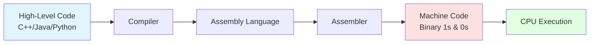

---

## 2.0 Instruction Set Architecture (ISA)

### 2.1 ISA Definition

The **ISA** (Instruction Set Architecture) is the set of instructions that a CPU is designed to understand and execute. It serves as the interface between software and hardware.

**Major ISAs:**
- i. **x86** (Intel, AMD - Desktop/Server)
- ii. **MIPS** (Embedded Systems)
- iii. **ARM** (Mobile Devices, IoT)
- iv. **RISC-V** (Open-Source, Research)
- v. **PowerPC** (Legacy Systems)

### 2.2 ISA Classification

| Category | Characteristics | Examples |
|----------|-----------------|----------|
| **Fixed-Length** | Each instruction has a predetermined number of bits | RISC-V, ARM, MIPS |
| **Variable-Length** | Different instruction lengths, greater flexibility | x86, x86-64 |

### 2.3 Example: RISC-V Encoding

> [!INFO] **RISC-V Instruction Format**
> Each RISC-V instruction is **32-bit** (fixed-length).

**Instruction Structure:**
```
[31-25] [24-20] [19-15] [14-12] [11-7] [6-0]
  funct7   rs2     rs1    funct3   rd   opcode
```

- **opcode (7-bit):** Specifies the instruction type
- **rd, rs1, rs2:** Indicate registers
- **funct3, funct7:** Determine the exact operation

**Assembly to Binary Translation:**

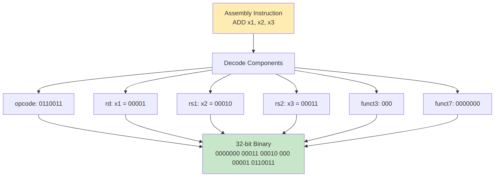

---

## 3.0 Instruction Cycle Steps

### 3.1 Four-Phase Instruction Cycle

**Phase 1: Fetch**
- i. CPU fetches the instruction from memory
- ii. Uses the Program Counter (PC) for the address

**Phase 2: Decode**
- i. Identifies the instruction type
- ii. Classification: arithmetic, branch, memory

**Phase 3: Execute**
- i. Retrieves operands from registers or memory
- ii. Executes the operation from the ALU

**Phase 4: Write-Back**
- i. Stores the result in a register
- ii. Or writes to memory

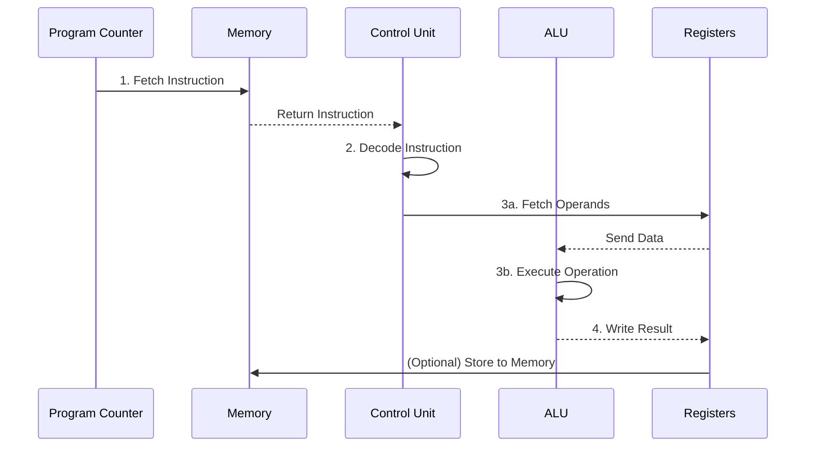

> [!INFO] **64-bit Processors**
> Modern processors are 64-bit, enabling handling of data values and addresses **up to 64 bits** ($2^{64}$ memory addresses).

---

## 4.0 Pipelining

### 4.1 Concept and Goal

**Definition:** Technique that divides the main instruction execution stages into **20+ smaller steps** to improve performance.

**Analogy:** Just as a pipe needs time to fill with liquid, the processor needs time to fill the pipeline with data. After filling, **continuous and steady processing flow** is achieved.

### 4.2 5-Stage Pipeline Example

```mermaid
gantt
    title CPU Pipeline - 5 Stages Execution
    dateFormat X
    axisFormat %L
    
    section Instruction 1
    Fetch    :a1, 0, 1
    Decode   :a2, 1, 1
    Execute  :a3, 2, 1
    Memory   :a4, 3, 1
    WriteBack:a5, 4, 1
    
    section Instruction 2
    Fetch    :b1, 1, 1
    Decode   :b2, 2, 1
    Execute  :b3, 3, 1
    Memory   :b4, 4, 1
    WriteBack:b5, 5, 1
    
    section Instruction 3
    Fetch    :c1, 2, 1
    Decode   :c2, 3, 1
    Execute  :c3, 4, 1
    Memory   :c4, 5, 1
    WriteBack:c5, 6, 1
    
    section Instruction 4
    Fetch    :d1, 3, 1
    Decode   :d2, 4, 1
    Execute  :d3, 5, 1
    Memory   :d4, 6, 1
    WriteBack:d5, 7, 1
```

**Advantages:**
- i. Parallel execution of multiple instructions
- ii. Improved throughput (instructions/second)
- iii. More efficient use of hardware resources

---

## 5.0 Superscalar Architecture

### 5.1 Definition and Characteristics

**Superscalar Architecture:** Architecture that allows **simultaneous execution of multiple instructions** at each point in time, utilizing all pipeline stages.

**Mechanism:**
- i. Detection of independent instructions
- ii. Scheduling of simultaneous execution
- iii. Avoidance of data hazards and dependencies

### 5.2 Simultaneous Multithreading (SMT)

**Technology:** Common application of superscalar architecture that allows a **single physical core** to execute **multiple threads** simultaneously.

**Example - Intel Hyper-Threading:**
- 1 physical core = 2 logical cores
- 8-core processor → 16 threads

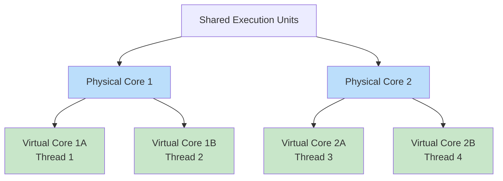

---

## 6.0 Memory Hierarchy

### 6.1 Memory Pyramid Structure

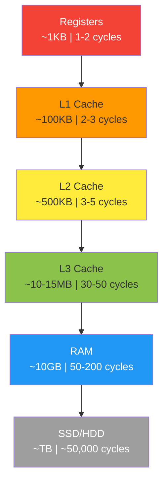

### 6.2 Hierarchy Principles

**As we "move down" the hierarchy:**

| Characteristic | Trend |
|----------------|-------|
| **Cost per bit** | ↓ Decreases |
| **Capacity** | ↑ Increases |
| **Access time** | ↑ Increases |
| **Access frequency** | ↓ Decreases |

**Cost Justification:**
- i. **Higher memories (Cache):** Use ~6 transistors/bit → high cost
- ii. **Lower memories (HDD/SSD):** Simpler architecture → low cost

### 6.3 Cache - Architecture

**Typical Layout in Multi-Core CPU:**

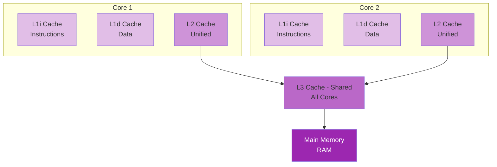

**Characteristics:**
- i. **L1 Cache:** Split into Instruction (L1i) and Data (L1d) cache
- ii. **L2 Cache:** One per core, larger capacity
- iii. **L3 Cache:** Shared among **all cores**

### 6.4 Cache Access Pattern

**Data Search Process:**

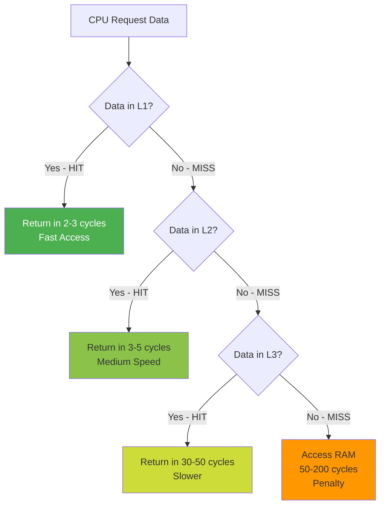

### 6.5 Importance of Cache

**Role:**
- i. Storing **frequently used** instructions and data
- ii. Minimizing accesses to the slower RAM
- iii. Critical for performance - **without cache, performance collapses**

**Temporal Locality:** Data recently used is likely to be used again.

**Spatial Locality:** Data near the current address is likely to be needed soon.

### 6.6 Memory Latency Analysis

> [!INFO] **Experimental Data (Sandra 2013 SP3)**

**Key Findings:**
- i. **0-256KB:** Low latency (~5-10 cycles) - Data in L1/L2
- ii. **256KB-16MB:** Medium latency (~30-50 cycles) - L3 Cache
- iii. **16MB+:** Sharp increase (~100+ cycles) - RAM access

**Conclusion:** Cache ensures consistently low latency up to its capacity limit.

---

## 7.0 Cache Comparison in Modern Processors

### 7.1 Intel Core Comparison Table (2017-2018)

| Spec | i7-7820X | i7-8700K | i9-9900K | i7-9700K |
|------|----------|----------|----------|----------|
| **Release Date** | June 2017 | Oct 2017 | Oct 2018 | Oct 2018 |
| **Cores/Threads** | 8/16 | 6/12 | **8/16** | 8/8 |
| **Base Freq** | 3.6 GHz | 3.5 GHz | 3.6 GHz | 3.6 GHz |
| **Max Boost** | 4.3 GHz | 4.7 GHz | **5.0 GHz** | 4.9 GHz |
| **L2 Cache** | **8 MB** | 1.5 MB | 2 MB | 2 MB |
| **L3 Cache** | 11 MB | 12 MB | **16 MB** | 12 MB |
| **Memory Config** | **Quad-Channel** | Dual-Channel | Dual-Channel | Dual-Channel |
| **Max Memory** | DDR4-2666 | DDR4-2666 | DDR4-2666 | DDR4-2666 |
| **TDP** | 140W | 95W | 95W | 95W |
| **MSRP** | $600 | $360 | $500 | $374 |

**Key Observations:**
- i. **i9-9900K:** Top performance (5.0 GHz boost, 16 MB L3)
- ii. **i7-7820X:** Maximum L2 cache (8 MB), Quad-Channel memory
- iii. **Hyper-Threading:** i7-7820X, i7-8700K, i9-9900K support SMT

---

## 8.0 Branch Prediction

### 8.1 Branch Problem

**Scenario:**
```c
if (condition) {
    // Path A
} else {
    // Path B
}
```

**Challenge:** In a pipelined CPU, the next instruction must be fetched **before** the condition is computed. Which path to choose?

### 8.2 Speculative Execution

**Mechanism:**
- i. CPU **predicts** the most likely path
- ii. Begins executing instructions from the predicted path
- iii. **If correct:** Performance gain, continue execution
- iv. **If wrong:** Pipeline flush, restart from correct path

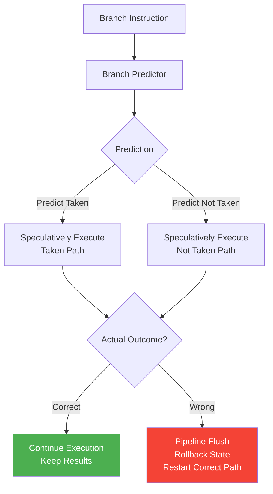

### 8.3 Machine Learning in Prediction

**Prediction Algorithms:**
- i. Monitoring branch history
- ii. **Pattern learning** of behavior
- iii. Adaptation based on results

**Performance:** Modern processors achieve **>90% accuracy** in branch prediction.

---

## 9.0 CISC vs RISC Architectures

### 9.1 Design Philosophy

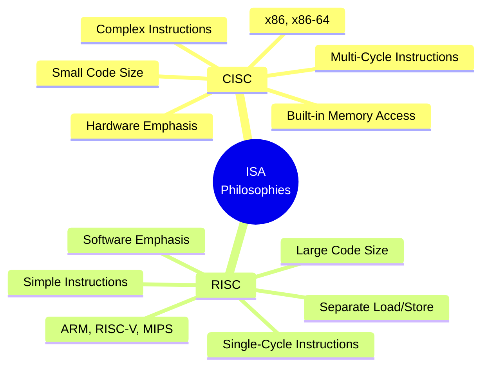

### 9.2 Comparison Table

| Criterion | CISC | RISC |
|-----------|------|------|
| **Emphasis** | Hardware | Software |
| **Instruction Complexity** | Multi-cycle, complex | Single-cycle, simple |
| **Memory Access** | Embedded in instructions (LOAD+ADD) | Separate LOAD/STORE |
| **Code Size** | Small | Large |
| **Cycles/Instruction** | High | Low |
| **Registers** | Limited | Many (for speed) |
| **Transistor Usage** | Implementing complex instructions | More registers |
| **Examples** | Intel x86, AMD64 | ARM, RISC-V, MIPS, PowerPC |

### 9.3 Modern Trends

**Architectural Convergence:**
- i. Modern x86 processors use **micro-ops (u-ops)** RISC-like internally
- ii. ARM processors incorporate complex instructions (e.g. NEON SIMD)
- iii. Hybrid approaches for optimal performance

---

## 10.0 CPU Internal Structure

### 10.1 Basic Components

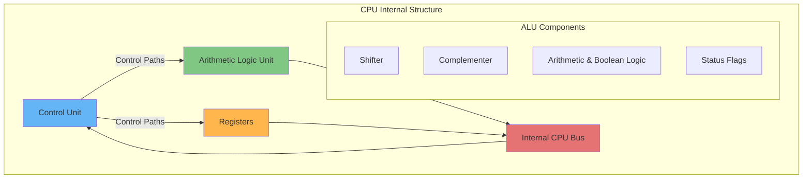

### 10.2 Unit Details

**i. Arithmetic Logic Unit (ALU)**
- Arithmetic operations: $+, -, \times, \div$
- Logical operations: AND, OR, XOR, NOT
- Bit operations: Shift, Rotate
- Flags: Zero, Carry, Overflow, Negative

**ii. Registers**
- General Purpose Registers (GPR)
- Special Purpose: PC, SP, Status Register
- Temporary data storage

**iii. Control Unit**
- Coordination of all unit operations
- Control signal generation
- Timing and sequencing

---

## 11.0 Modern Platform Architecture

### 11.1 AMD Ryzen Threadripper X399

**Platform Characteristics:**

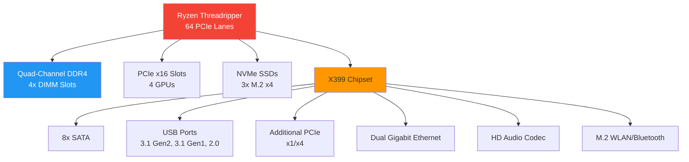

**"No Dark" Philosophy Advantages:**
- **No Dark Lanes:** All PCIe lanes active
- **No Dark Channels:** Full use of Quad-Channel memory
- **No Dark Ports:** All ports functional simultaneously

### 11.2 AMD Ryzen Mobile Processors (2020)

**7nm "Zen 2" Technology:**

| Model | Cores/Threads | Cache | TDP | GPU | Use Case |
|-------|---------------|-------|-----|-----|----------|
| Ryzen 7 4800H | 8C/16T | 12 MB | 45W | Radeon 7 (1600MHz) | Gaming/Creation |
| Ryzen 5 4600H | 6C/12T | 11 MB | 45W | Radeon 6 (1500MHz) | Gaming |
| Ryzen 7 4800U | 8C/16T | 12 MB | **15W** | Radeon 8 (1750MHz) | **Ultrathin** |
| Ryzen 5 4600U | 6C/12T | 11 MB | 15W | Radeon 6 (1500MHz) | Mainstream |
| Ryzen 3 4300U | 4C/4T | 6 MB | 15W | Radeon 5 (1400MHz) | Entry-level |
| Athlon Gold 3150U | 2C/4T | 5 MB | 15W | Radeon 3 (1000MHz) | Budget |

**Key Features:**
- i. Wi-Fi 6 & Bluetooth 5 support
- ii. 4K HDR display compatibility
- iii. 7nm process → Low power consumption

---

## 12.0 CPU Manufacturing Process

### 12.1 Production Process

**Step 1: Silicon Extraction from Sand**

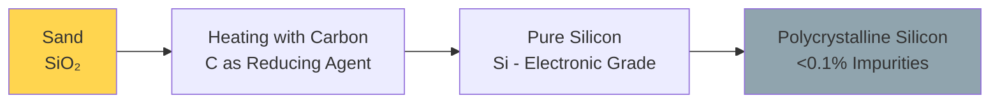

**Chemical Reaction:**
$$
\text{SiO}_2 + 2\text{C} \xrightarrow{\Delta} \text{Si} + 2\text{CO}
$$

**Step 2: Creating Monocrystalline Ingot**

- i. Polycrystalline silicon is melted
- ii. Cylindrical ingot formation (boule/ingot)
- iii. Purity >99.9%
- iv. Monocrystalline structure for uniform electrical properties

**Step 3: Slicing into Wafers**

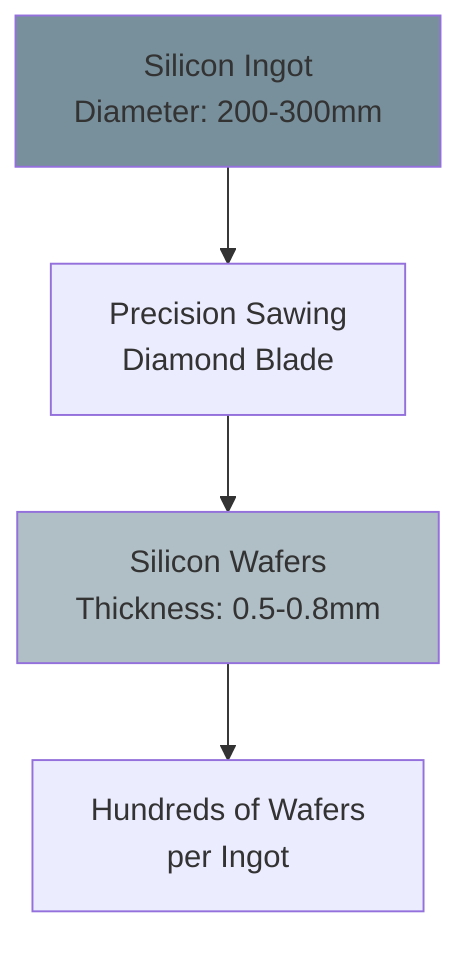

**Step 4: Chemical-Mechanical Polishing (CMP)**

**Goal:** Mirror-quality surface

- i. **Smoothing:** Removing irregularities from cutting
- ii. **Cleaning:** Removing particles
- iii. **Quality improvement:** Readiness for photolithography

**Step 5: Photolithography - UV Exposure**

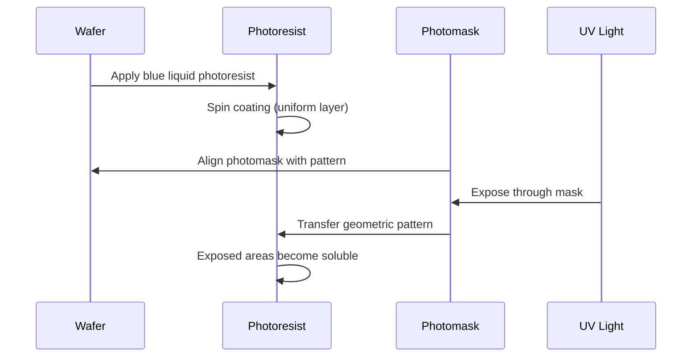

**Step 6: Washing and Etching**

- i. **Washing:** Chemical solvent removes exposed photoresist
- ii. **Etching:** Substrate removal according to pattern
- iii. **Repetition:** 20-30+ stages for multiple layers

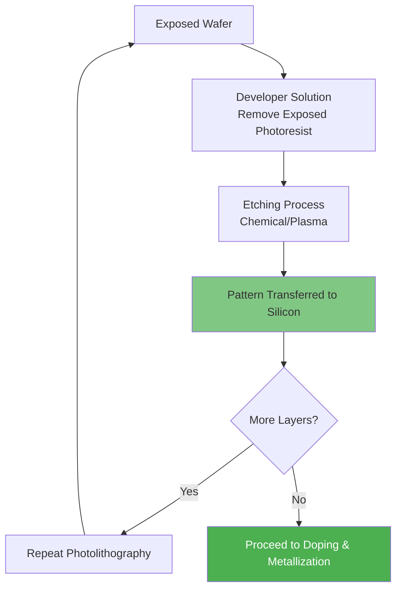

### 12.2 Final Stages

**Doping:** Adding impurities (e.g. Phosphorus, Boron) to create p-n junctions

**Metallization:** Creating interconnections with copper/aluminum

**Testing & Dicing:**
- i. Electrical testing of each chip on wafer
- ii. Cutting into individual dies
- iii. Packaging (placement on substrate, heat spreader)

---

## 13.0 Key Types and Performance Metrics

### 13.1 Pipeline Performance

**Speedup Factor:**
$$
S = \frac{T_{\text{sequential}}}{T_{\text{pipelined}}} = \frac{n \times k}{k + (n-1)}
$$

Where:
- $n$ = number of instructions
- $k$ = number of pipeline stages

**For large $n$:**
$$
S_{\max} \approx k
$$

### 13.2 Cache Performance

**Average Memory Access Time (AMAT):**
$$
\text{AMAT} = T_{\text{cache}} + (\text{Miss Rate} \times T_{\text{miss penalty}})
$$

**Example:**
- $T_{\text{L1}} = 3$ cycles, Miss Rate = 5%, $T_{\text{RAM}} = 100$ cycles

$$
\text{AMAT} = 3 + (0.05 \times 100) = 8 \text{ cycles}
$$

### 13.3 Branch Prediction Accuracy

**Effective CPI (Cycles Per Instruction):**
$$
\text{CPI}_{\text{eff}} = \text{CPI}_{\text{ideal}} + (\text{Branch Freq} \times \text{Mispredict Rate} \times \text{Penalty})
$$

**Example:**
- Ideal CPI = 1, 20% branches, 10% mispredicts, Penalty = 10 cycles

$$
\text{CPI}_{\text{eff}} = 1 + (0.2 \times 0.1 \times 10) = 1.2
$$

---

## 14.0 Key Definitions - Glossary

| Term | Definition |
|------|------------|
| **ISA** | Instruction Set Architecture - Set of instructions understood by a CPU |
| **Pipeline** | Technique of dividing instruction execution into stages for parallel processing |
| **Cache Hit** | Finding requested data in cache memory |
| **Cache Miss** | Failure to find data in cache, requires access to lower level |
| **Latency** | Time required to access data (in cycles) |
| **Throughput** | Number of instructions completed per unit time |
| **Superscalar** | Architecture that executes >1 instructions per clock cycle |
| **SMT** | Simultaneous Multithreading - Multiple threads on a single physical core |
| **Speculative Execution** | Executing instructions based on prediction, before confirmation |
| **Photolithography** | Technique of transferring patterns to wafer using UV light |
| **Wafer** | Thin silicon disc where chips are manufactured |
| **CMP** | Chemical-Mechanical Polishing - Wafer polishing |

---

## 15.0 Core Design Principles

### 15.1 Memory Hierarchy Design Principles

**i. Locality Principles**
- **Temporal Locality:** Recently used data will be used again
- **Spatial Locality:** Data in adjacent addresses is likely needed

**ii. Inclusion Property**
```
L1 ⊆ L2 ⊆ L3 ⊆ RAM
```
Data at a higher level typically also exists at a lower level.

### 15.2 Pipeline Design Principles

**i. Balance Pipeline Stages**
- Equal execution time per stage
- Avoid bottlenecks

**ii. Hazard Management**
- **Data Hazards:** Forwarding, stalls
- **Control Hazards:** Branch prediction
- **Structural Hazards:** Resource duplication

### 15.3 Amdahl's Law

**Speedup Limit:**
$$
S_{\text{overall}} = \frac{1}{(1-P) + \frac{P}{S}}
$$

Where:
- $P$ = Fraction of code improved
- $S$ = Speedup of the improved section

**Conclusion:** Improvements in rare cases have minimal overall impact.

---

## 16.0 References & Resources

### 16.1 Educational Videos

**CPU Manufacturing:**
- Branch Education: "How It's Made - CPU"
- "How are Microchips Made, CPU Manufacturing Process Steps"

**CPU Operation:**
- Branch Education: "The Engineering that Runs the Digital World, How do CPUs Work?"

### 16.2 Supplementary Study

**Topics:**
- i. Out-of-Order Execution
- ii. Tomasulo's Algorithm
- iii. Cache Coherence Protocols (MESI, MOESI)
- iv. Virtual Memory & TLB
- v. SIMD/Vector Processing
- vi. GPU Architecture Fundamentals

---

## End of Smart Notes

> **Note:** These notes compile the content of the 8th lecture on the Processor Design Process. For deeper understanding, consult the educational videos and perform hands-on experiments with simulators (e.g. RISC-V simulator, cache simulators).