# 1.0 Instruction-Level Parallelism (ILP) and Superscalar Processors

## 1.1 Historical Context and Developments

i. Major developments in computer architecture  
- Computer families: IBM System/360 (1964), DEC PDP-8.  
- Separation of architecture from implementation.  
- Control unit microprogramming: Wilkes proposal (1951), IBM S/360 implementation (1964).  
- Introduction of cache memory: IBM S/360 Model 85 (1969).  
- Solid-state RAM.  
- Microprocessors: Intel 4004 (1971).  
- Pipelining: introduces parallelism in instruction fetch–execute.  
- Multiprocessors.  
- Superscalar machines: first commercial implementations 1–2 years after the term was coined (RISC 6–7 years later).

ii. Emergence of the superscalar approach  
- The term "superscalar" appears in 1987.  
- Designed to improve performance by executing multiple instructions simultaneously.  
- In most applications, operations are performed on scalar quantities.  
- The superscalar approach is the next step in high-performance processors (in both RISC and CISC).

iii. Definition of scalar quantities  
- Scalar quantities: physical magnitudes fully determined by a measure and a unit of measurement, without direction.

***

# 2.0 Superscalar Processor – Basic Idea

## 2.1 Definition and Characteristics

i. Basic characteristics of a superscalar processor  
- Use of multiple independent instruction pipelines.  
- Multiple functional units (ALU, FPU, load/store, etc.).  
- New level of parallelism: simultaneous processing of multiple instructions per cycle.  
- Standard method for implementing high-performance microprocessors.  
- Applied to both RISC and CISC architectures.

ii. Why superscalar?  
- Many instructions process complex data quantities.  
- Accelerating the execution of these instructions significantly improves performance.  
- Instruction-level parallelism (ILP) is the average number of instructions that can be executed simultaneously.

***

> [!INFO]
> **Data flow in a superscalar instruction organization**

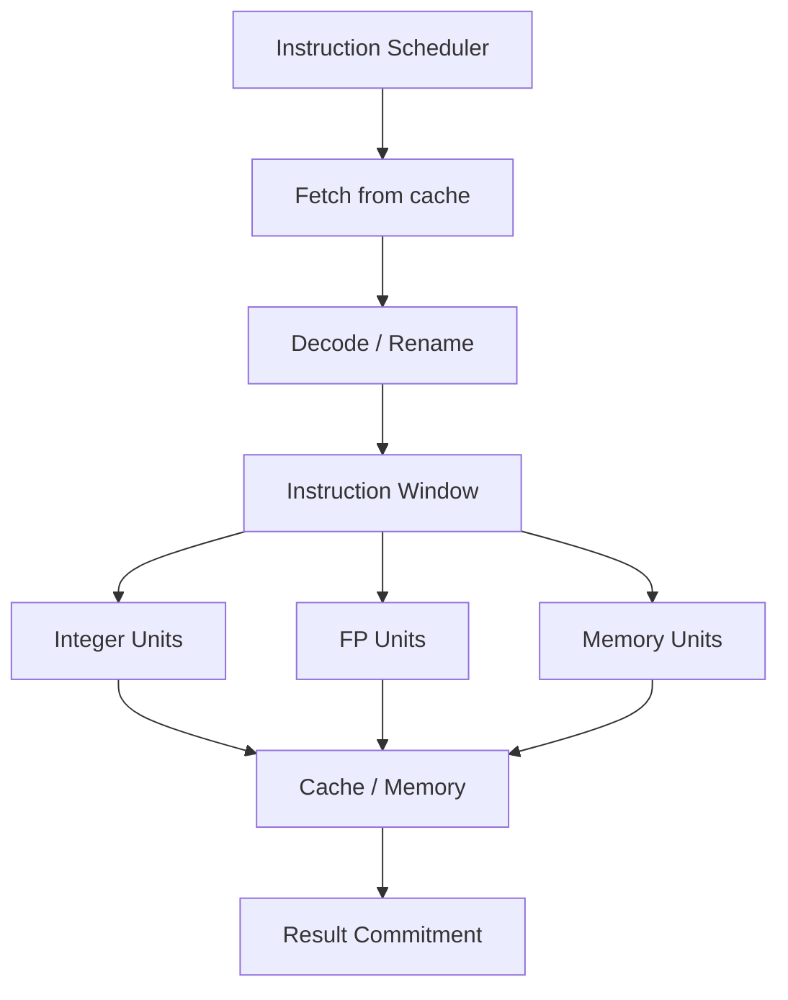

***

# 3.0 Scalar vs Superscalar Organization

## 3.1 Comparative Structure

| Characteristic                    | Scalar Organization                                          | Superscalar Organization                                        |
|-----------------------------------|--------------------------------------------------------------|-----------------------------------------------------------------|
| Instructions/cycle                | Typically 1                                                  | >1 (2, 3, 4, ...)                                               |
| Integer functional units          | 1 unit with pipelining                                       | Multiple units with pipelining                                   |
| FP functional units               | 1 unit with pipelining                                       | Multiple units with pipelining                                   |
| Register file                     | One per operation type (int, FP)                             | Multiple files, often extended with dynamic registers            |
| Execution parallelism             | Limited (one instruction at a time per unit)                 | Simultaneous execution of multiple instructions                  |
| Logic complexity                  | Low                                                          | High (prediction, renaming, reordering)                          |
| ILP performance                   | Limited                                                      | High, exploits ILP and machine parallelism                       |

***

> [!INFO]
> **Comparison of scalar and superscalar organization**

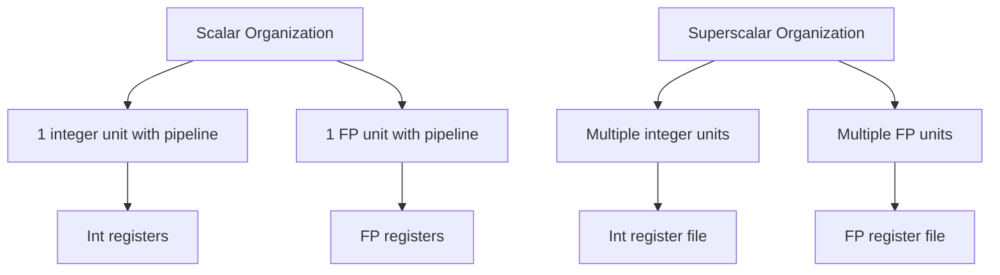

***

# 4.0 Pipelining, Superpipelining and Superscalar

## 4.1 Basic pipelining stages

i. Typical 4-stage pipelining  
1. Instruction fetch.  
2. Operation decode.  
3. Operation execution.  
4. Result write-back.

ii. Superpipelining  
- Multiple pipeline stages execute per cycle.  
- Many instructions are fetched simultaneously, but at any moment one is in the execution stage.

iii. Superscalar vs Superpipelining  
- Superpipelining: increases pipeline depth (more stages).  
- Superscalar: increases width (multiple instructions simultaneously at each stage).

***

> [!INFO]
> **Comparison of simple pipelining, superpipelining and superscalar**

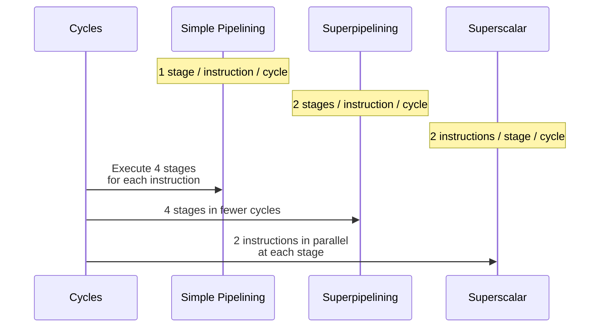

***

# 5.0 Parallelism Limitations in Superscalar Processors

## 5.1 Types of Dependencies

i. True data dependencies (RAW – Read After Write)  
Example:  
- ADD r1, r2   (r1 := r1 + r2)  
- MOVE r3, r1  (r3 := r1)

The second instruction needs the result of the first. It cannot execute until the ADD completes. If the dependency involves a memory load, the delay increases (especially on cache misses).

ii. Procedural dependencies  
- When execution order must be maintained for correctness (e.g. branches, variable-length instructions).  
- The need for decode to determine memory accesses can prevent simultaneous instruction fetching.

iii. Resource conflicts  
- Multiple instructions contend for the same resource:  
  - Memory or cache.  
  - Functional units (ALU, FPU).  
- Solution: increase resources (multiple units).

iv. Output dependencies (WAW – Write After Write)  
Example:  
- R3 := R3 + R5  (I1)  
- R4 := R3 + 1   (I2)  
- R3 := R5 + 1   (I3)  
- R7 := R3 + R4  (I4)

I2 depends on I1, while I3 and I4 also depend on I1. If I3 completes before I1, the value of R3 may be corrupted (write-write hazard).

v. Anti-dependencies (WAR – Write After Read)  
Same example:  
- I2 uses R3 (read).  
- I3 writes to R3.  
I3 cannot complete before I2 starts, because it would destroy the value I2 needs (read before write).

***

> [!INFO]
> **Impact of dependencies on a degree-2 superscalar machine**

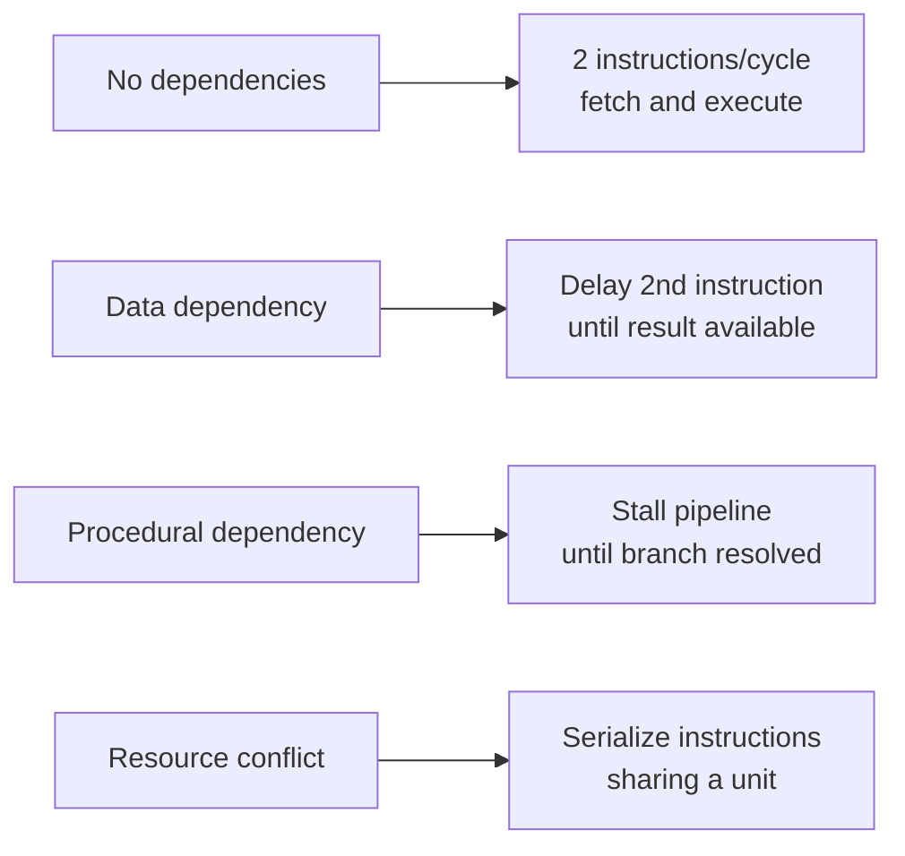

***

## 5.2 Design Issues

i. Instruction-level parallelism  
- Number of independent instructions that can execute with temporal overlap.  
- Limited by data and procedural dependencies.

ii. Machine parallelism  
- Processor's ability to exploit ILP.  
- Depends on:  
  - Number of parallel pipelines.  
  - Effectiveness of independent instruction detection mechanisms.

iii. Latency  
- Time until results of one instruction are available to subsequent ones.  
- Determines delays due to dependencies.

***

# 6.0 Instruction Issue and Completion Policies

## 6.1 Definitions

i. Execution order (in-order / out-of-order)  
- Steps: fetch – execute – register/memory update.  
- An instruction is "issued" when it moves from decode to the first execution stage.  
- The processor examines subsequent instructions to improve performance.

***

## 6.2 In-order issue – In-order completion

i. Characteristics  
- Instructions are issued and completed sequentially.  
- Program order is maintained.  
- Simple but less efficient.  
- Frequent stalls due to conflicts and dependencies.

ii. Behavior in example  
- I1 requires 2 execution cycles.  
- I3 and I4 compete for the same functional unit.  
- I5 depends on I4's result and stalls.  
- I5 and I6 also compete for the same unit.  
- Completion remains strictly serial.

***

## 6.3 In-order issue – Out-of-order completion

i. Characteristics  
- Multiple instructions execute simultaneously (up to the maximum degree of parallelism).  
- Completion may occur in a different order than fetching.  
- Requires much more complex logic circuits.  
- On interrupts, program state correctness must be ensured.

ii. Behavior  
- I3 and I4 may complete out-of-order, depending on functional unit availability.  
- I5 depends on I4 and executes only when I4 completes.  
- I5 and I6 share a functional unit, completion possibly out-of-order.

iii. Relationship with RISC  
- Applied particularly to scalar RISC processors.  
- Example: I2 completes before I1, allowing I3 to finish earlier and gaining one cycle.

***

## 6.4 Out-of-order issue – Out-of-order completion

i. Pipeline structure with instruction window  
- Decoupling of decode and execution stages.  
- Instruction window divides pipelining into:  
  - Issue stage (in-order).  
  - Execution stage (out-of-order).  
- Processor continues fetching/decoding as long as the window is not full.

ii. Stage flow  
- Fetch → Decode → Rename → Transfer → Issue → Register Read → Execute → Write-back.  
- Issue buffer and reorder buffer manage ordering.

iii. Operation  
- When a functional unit is available, a "suitable" instruction is issued from the window.  
- After decode, instructions are examined ahead (look-ahead) for independence.  
- Out-of-order results are stored temporarily and committed in program order.

***

> [!INFO]
> **Pipeline with out-of-order issue/completion**

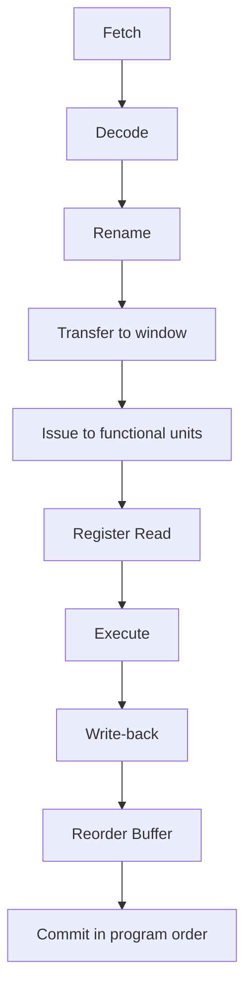

***

# 7.0 Register Renaming

## 7.1 Purpose and Result

i. Problems without renaming  
- Data, output dependencies and anti-dependencies cause stalls.  
- Static allocation of logical registers to physical registers exacerbates delays.

ii. Renaming idea  
- Dynamic allocation of physical registers by hardware.  
- Essentially "doubles" available resources (registers), if implementation allows.  
- Reduces false dependencies (WAW, WAR).

***

## 7.2 Example with/without renaming

i. Original program  
- R3 := R3 + R5  (I1)  
- R4 := R3 + 1   (I2)  
- R3 := R5 + 1   (I3)  
- R7 := R3 + R4  (I4)

Here:  
- I2 depends on I1's result (RAW).  
- I3 writes to R3 which is used by I2 (WAR).  
- I1 and I3 both write to R3 (WAW).

ii. With register renaming  
- R3b := R3a + R5a  (I1)  
- R4b := R3b + 1    (I2)  
- R3c := R5a + 1    (I3)  
- R7b := R3c + R4b  (I4)

Notes:  
- Without index (R3) → logical register.  
- With index (R3a, R3b, R3c) → dynamic physical register.

***

> [!INFO]
> **Conceptual diagram of register renaming**

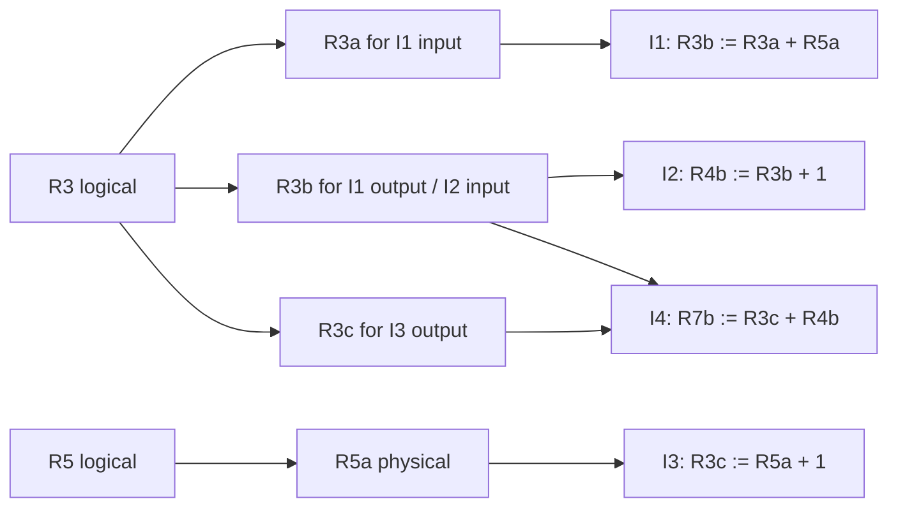

***

# 8.0 Machine Parallelism and Performance

## 8.1 Resource doubling, instruction window and renaming

i. Resource doubling  
- Increasing the number of load/store (ld/st) units.  
- Increasing the number of ALUs.  
- Alone gives small improvement if no out-of-order & renaming.

ii. Role of instruction window  
- The larger the window, the more independent instructions are "visible".  
- Enables ILP exploitation through dynamic reordering.

iii. Combining techniques  
- Out-of-order issue + register renaming + multiple ld/st and ALU units → significant speed increase.  

***

## 8.2 Theoretical speedup studies

i. Speedup measure  
- Vertical axis: average speedup of superscalar vs scalar machine.  
- Horizontal axis: window size (8, 16, 32).  
- Compared configurations:  
  - Scalar with out-of-order issue capability.  
  - Base machine.  
  - + ld/st.  
  - + ALU.  
  - + both.

ii. Conclusion  
- Without renaming: speedup is limited.  
- With renaming: speedup improves significantly, especially with large window.

***

# 9.0 Branch Prediction in Superscalar Processors

## 9.1 Prediction techniques

i. Delayed branching (RISC)  
- Heavily used in RISC scalar processors.  
- Exploits "delay slots" after the branch.

ii. Dynamic branch prediction  
- In superscalar processors, essential for keeping resources continuously busy.  
- Mechanisms used include:  
  - Branch Target Buffer (BTB): stores target addresses.  
  - Branch history tables.

***

> [!INFO]
> **Conceptual representation of processing in a superscalar machine**

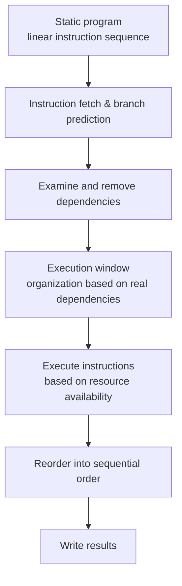

***

# 10.0 x86 Microarchitectural Examples

## 10.1 Pentium 4 – Structure and basic concepts

### 10.1.1 Structural components of Pentium 4

i. Cache and buses  
- L1 data cache: 8 KB.  
- L1 instruction cache (or Trace Cache for decoded micro-ops).  
- L2 cache: 256 KB.  
- System bus: 3.2 GB/s.

ii. Register file  
- Integer register file.  
- Floating-point register file.

iii. Functional units  
- Multiple ALUs for integer operations.  
- FP units (Fadd, Fmul).  
- MMX/SIMD units for multimedia.  
- Load/store units (AGU – Address Generation Unit).

iv. Out-of-order execution  
- Logic circuits for executing instructions out of order, with commitment in order.

***

> [!INFO]
> **Structural components diagram of Pentium 4 (conceptual)**

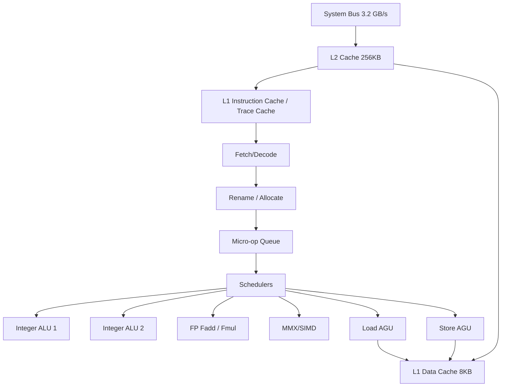

***

### 10.1.2 Pentium 4 Operation – CISC externally, RISC internally

i. General mechanism  
- Variable-length x86 instructions (CISC) are fetched.  
- Translated into one or more fixed-length RISC instructions (micro-ops).  
- Micro-ops execute in a superscalar pipeline (out-of-order).  
- Results are committed in program flow order.

ii. Pipeline  
- Internal conduit of at least 20 stages.  
- Some micro-ops require multiple execution stages.  
- Relationship with classic x86 pipeline (e.g. 5 stages in old Pentium).

***

### 10.1.3 Pentium 4 – Pipeline stages

i. Indicative stages  
- TC Next IP: locate next instruction in cache.  
- TC Fetch: fetch instruction from Trace Cache.  
- Alloc: resource allocation.  
- Rename: dynamic register renaming.  
- Que: micro-op queue.  
- Sch: micro-op scheduling.  
- Disp: dispatch to units.  
- RF: register read/write.  
- Ex: execute.  
- Flags: ALU flag management.  
- Br Ck: branch check.

***

> [!INFO]
> **Pentium 4 Pipeline – micro-op flow**

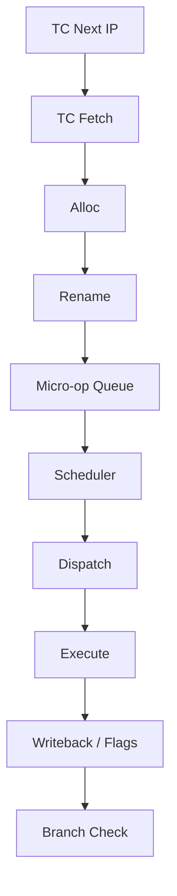

***

## 10.2 Intel Core i7 – Multi-core architecture

### 10.2.1 Basic structural elements

i. Multi-core structure  
- 4 cores with SMT (Simultaneous Multithreading): CPU-0, CPU-1, CPU-2, CPU-3.  
- Each core: parallel thread execution (multi-threading).

ii. Private caches  
- L1D (Data Cache) and L1I (Instruction Cache) per core.  
- L2 cache per core for speed.

iii. Shared L3 cache  
- Shared by all cores.  
- Improves communication and reduces memory latencies.

iv. DDR3 memory controller  
- Integrated memory controller for DDR3, fast data flow.

v. QPI (Quick Path Interconnect)  
- Fast bus for communication between processors, memory, peripherals.

***

> [!INFO]
> **Memory hierarchy in Intel Core i7**

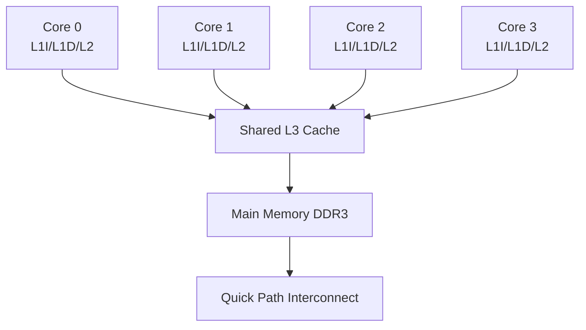

***

## 10.3 Intel Core Microarchitecture

### 10.3.1 Stages and units

i. Front-end  
- L1 instruction cache: fast fetch.  
- Instruction fetch and pre-decode.  
- Branch prediction unit.  
- Instruction queue.  
- ROM microcode for complex CISC instructions.

ii. Rename/Assign  
- Register renaming.  
- Resource and register allocation.

iii. Execution  
- Reorder buffer (result acceptance unit).  
- Scheduler / commitment station.  
- Multiple ports to functional units:
  - Port 0: Integer ALU, Branch, MMX/SSE, FP move.  
  - Port 1: Integer ALU, FP add, MMX/SSE, FP move.  
  - Port 2: Integer ALU, FPMul, MMX/SSE, FP move.  
  - Port 3–4: Load/store units.  

iv. Memory  
- L1 data cache.  
- DTLB (Data TLB) for address translation.  
- Shared cache and FSB up to 10.7 Gbps.

***

> [!INFO]
> **Intel Core Microarchitecture – instruction flow**

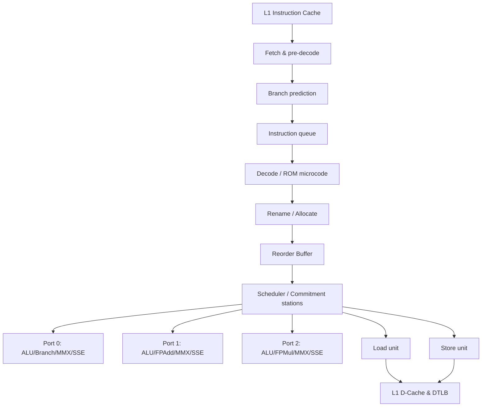

***

# 11.0 Summary of ILP and Superscalar Concepts

## 11.1 Functional Relationships and Study Design

i. Functional ILP – Performance relationship  
- If the average number of instructions per cycle is \( IPC \) and clock frequency is \( f \), then performance (instruction execution rate) is:  
  $$ \text{Execution Rate} = IPC \cdot f $$  

ii. Latency and throughput  
- If the latency of one operation is \( L \) cycles and pipelining allows one result per cycle after filling, then:  
  $$ \text{Completion Time for } N \text{ instructions} \approx L + (N - 1) $$  

iii. Dependency limitations  
- For an instruction sequence with dependency percentage \( p \), ideal maximum parallelism decreases:  
  $$ IPC_{\text{eff}} \leq (1 - p) \cdot IPC_{\text{theoretical}} $$  

(equations capture functional relationships, not specific measurements from the PDF, but connect ILP, latency and parallelism concepts).

***

# 12.0 Comparative Characteristics Table – Pentium 4 – Intel Core – Intel Core i7

| Characteristic                    | Pentium 4                                          | Intel Core (microarchitecture)                      | Intel Core i7                            |
|-----------------------------------|----------------------------------------------------|-----------------------------------------------------|------------------------------------------|
| Architecture model                | CISC externally, RISC micro-ops internally          | Superscalar x86 with pipelining                      | Multi-core x86 with SMT                  |
| Pipelines                         | Long conduit (≥20 stages)                           | Multiple ALU/FP/MMX/SSE ports                        | Multiple cores, multiple pipelines       |
| ILP techniques                    | Out-of-order, renaming, BTB, Trace Cache            | Out-of-order, ROB, strong prediction                 | Similar + multi-core and multithreaded ILP |
| Cache hierarchy                   | L1 I/D, L2 256KB                                    | L1 I/D, L2, shared cache                            | L1 and L2 per core, shared L3            |
| Memory interconnection            | System bus 3.2 GB/s                                 | FSB up to 10.7 Gbps                                 | QPI + integrated DDR3 controller         |
| SIMD support                      | MMX / SIMD                                          | MMX / SSE                                            | MMX / SSE / modern SIMD extensions       |

***

With these structured "smart notes," the chapter on instruction-level parallelism and superscalar processors is captured as a network of concepts, mechanisms and microarchitectural implementations (Pentium 4, Intel Core, Core i7), with emphasis on dependencies, renaming, issue policies and pipeline organization.