# Leading Emerging Technology Trends
## Computer Architecture - Lecture 12

**University of Ioannina**  
**Department of Computer Science & Telecommunications**  
**Instructor:** Alexandros Bantaloukas-Artzimant MSc, PhD  
**Editor:** Konstantinos Sakkas BSc, MSc

---

## 1.0 Artificial Intelligence (AI)

### Theoretical Definition
**Artificial Intelligence (AI)** refers to the simulation of human cognitive processes by machines, especially computer systems.

### Basic Applications
i. **Expert Systems**  
ii. **Natural Language Processing**  
iii. **Speech Recognition**  
iv. **Machine Vision**

### Career Positions and Salary Data

| **Position** | **Salary (USD)** |
|-------------|------------------|
| Chatbot Developer | $70,000 |
| Data Analyst | $75,000 |
| Image Processing Engineer | $85,000 |
| Business Intelligence Analyst | $90,000 |
| Recommender Systems Developer | $95,000 |
| AI Consultant | $100,000 |
| AI Product Manager | $110,000 |
| Data Engineer | $115,000 |
| Deep Learning Engineer | $120,000 |
| Computer Scientist | $120,000 |

### AI System Architecture
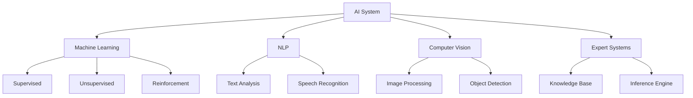

---

## 2.0 Robotic Process Automation (RPA)

### Theoretical Definition
**RPA** is a software technology that facilitates the construction, development and management of software robots that mimic human actions in digital systems.

### Basic Characteristics
i. Executes tasks faster than humans  
ii. Greater consistency in execution  
iii. Operates without breaks  
iv. Mimics human digital actions

### Career Positions and Salary Data

| **Position** | **Salary (USD)** |
|-------------|------------------|
| RPA Tester | $60,000 |
| RPA Support Engineer | $70,000 |
| RPA Trainer | $75,000 |
| RPA Consultant | $80,000 |
| RPA Business Analyst | $85,000 |
| RPA Developer | $90,000 |
| RPA Solution Designer | $100,000 |
| RPA Project Manager | $110,000 |
| RPA Architect | $120,000 |
| RPA Operations Manager | $130,000 |

### RPA Lifecycle

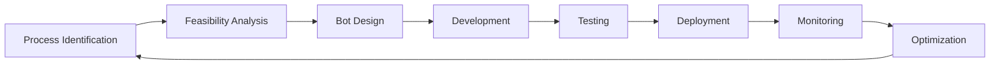

---

## 3.0 Edge Computing

### Theoretical Definition
**Edge Computing** is an emerging computing model that involves networks and devices close to the user.

### Basic Characteristics
i. Data processing near the point of data generation  
ii. Faster data processing  
iii. Processing of larger data volumes  
iv. Real-time results

### Career Positions and Salary Data

| **Position** | **Salary (USD)** |
|-------------|------------------|
| Edge Computing Analyst | $85,000 |
| Edge Computing Systems Administrator | $95,000 |
| Edge Computing Developer | $105,000 |
| Edge Computing Engineer | $115,000 |
| Edge Computing Consultant | $125,000 |
| Edge Computing Project Manager | $130,000 |
| Edge Computing Security Specialist | $135,000 |
| Edge Computing Solution Architect | $145,000 |
| Edge Computing Operations Manager | $150,000 |

### Edge Computing Architecture

> [!INFO]
> Edge Computing reduces latency by moving processing closer to the data source.

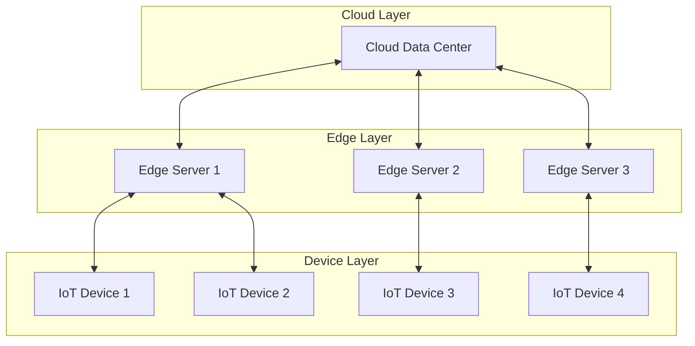

---

## 4.0 Quantum Computing

### Theoretical Definition
**Quantum Computing** is an interdisciplinary field that combines:
- Computer Science
- Physics
- Mathematics

### Basic Principles
i. Exploits **quantum mechanics**  
ii. Faster solution of complex problems compared to classical computers  
iii. Includes hardware research and application development

### Career Positions and Salary Data

| **Position** | **Salary (USD)** |
|-------------|------------------|
| Quantum Systems Administrator | $85,000 |
| Quantum Computing Engineer | $90,000 |
| Quantum Software Developer | $100,000 |
| Quantum Hardware Engineer | $110,000 |
| Quantum Applications Developer | $120,000 |
| Quantum Algorithm Researcher | $130,000 |
| Quantum Computing Architect | $140,000 |
| Quantum Cryptography Specialist | $150,000 |
| Quantum Computing Scientist | $160,000 |
| Quantum Information Theorist | $170,000 |

### Classical vs Quantum Computer Comparison

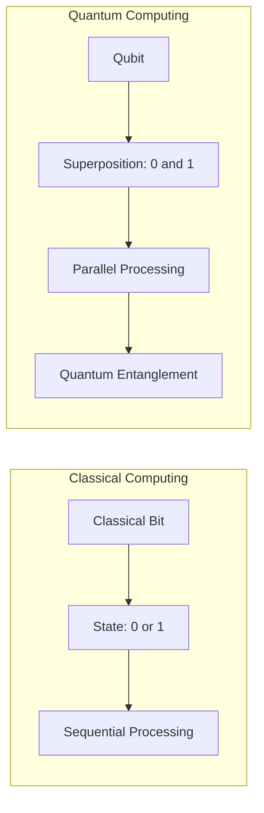

---

## 5.0 Virtual and Augmented Reality (VR/AR -> xR)

### Theoretical Definitions

#### Virtual Reality (VR)
**Virtual Reality** uses a headset to transport the user into a computationally created world that can be explored.

#### Augmented Reality (AR)
**Augmented Reality** places digital images in the real world through:
- Transparent visor
- Smartphone

### Career Positions and Salary Data

| **Position** | **Salary (USD)** |
|-------------|------------------|
| VR Artist | $55,000 |
| VR Animator | $60,000 |
| VR Sound Designer | $65,000 |
| VR UX Designer | $70,000 |
| VR UI Designer | $75,000 |
| VR Developer | $80,000 |
| VR Designer | $85,000 |
| VR Engineer | $90,000 |
| VR Project Manager | $100,000 |
| VR Marketing Manager | $110,000 |

### VR vs AR Differences

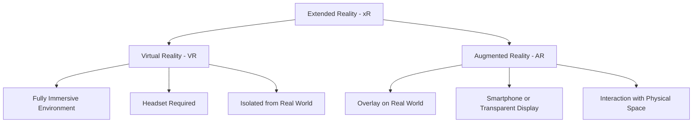

---

## 6.0 Blockchain

### Theoretical Definition
**Blockchain** is a data structure in which:
- You can **only add** information
- **Without ability to delete or modify**
- Forms a data sequence or "**chain**"

### Basic Characteristics
i. High security  
ii. Transaction transparency  
iii. Decentralized system  
iv. Originally developed for cryptocurrencies (Bitcoin)  
v. Applications in many sectors beyond cryptocurrencies

### Career Positions and Salary Data

| **Position** | **Salary (USD)** |
|-------------|------------------|
| Blockchain Technical Writer | $65,000 |
| Blockchain Marketing Manager | $75,000 |
| Blockchain Quality Assurance Engineer | $80,000 |
| Blockchain Business Analyst | $85,000 |
| Blockchain Security Specialist | $90,000 |
| Blockchain Consultant | $95,000 |
| Blockchain Project Manager | $100,000 |
| Blockchain Engineer | $105,000 |
| Blockchain Developer | $110,000 |
| Blockchain Architect | $120,000 |

### Blockchain Architecture

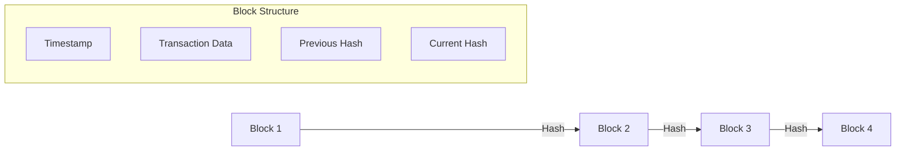

---

## 7.0 Internet of Things (IoT)

### Theoretical Definition
The **Internet of Things (IoT)** refers to devices equipped with:
- **Sensors**
- Processing **capabilities**
- **Software**
- Other technologies

### Basic Characteristics
i. Connection via the Internet or other communication networks  
ii. Data exchange with other devices and systems  
iii. Process automation  
iv. Real-time data collection and analysis

### Career Positions and Salary Data

| **Position** | **Salary (USD)** |
|-------------|------------------|
| IoT Systems Administrator | $70,000 |
| IoT Business Analyst | $75,000 |
| IoT Data Analyst | $80,000 |
| IoT Security Specialist | $85,000 |
| IoT Consultant | $90,000 |
| IoT Project Manager | $95,000 |
| IoT Engineer | $100,000 |
| IoT Developer | $105,000 |
| IoT Product Manager | $115,000 |
| IoT Architect | $120,000 |

### IoT Architecture

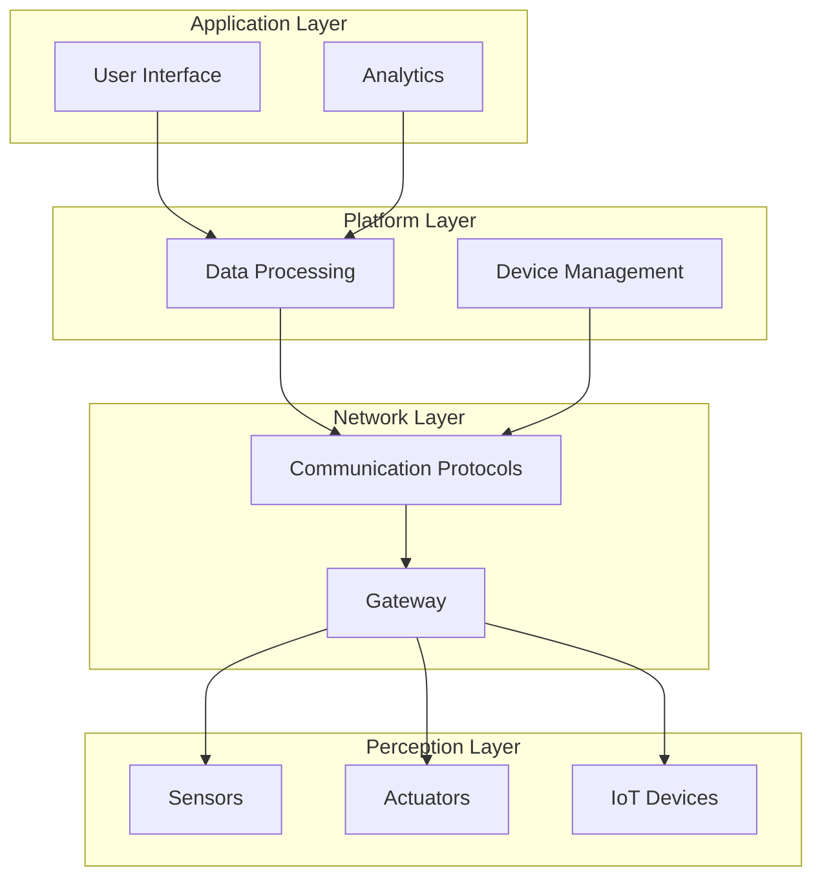

---

## 8.0 5G Technology

### Theoretical Definition
**5G Technology** has the potential to change the way we perceive the digital world.

### Network Technology Evolution
i. **3G**: Improved mobile internet browsing  
ii. **4G**: Enabled data-based services and streaming  
iii. **5G**: Faster communication, increased bandwidth, lower latency

### Career Positions and Salary Data

| **Position** | **Salary (USD)** |
|-------------|------------------|
| 5G Operations Engineer | $85,000 |
| 5G Software Developer | $90,000 |
| 5G Testing and Validation Engineer | $90,000 |
| 5G Engineer | $90,000 |
| 5G Integration Engineer | $95,000 |
| 5G Radio Frequency (RF) Engineer | $95,000 |
| 5G Security Specialist | $100,000 |
| 5G Project Manager | $100,000 |
| 5G Network Architect | $110,000 |
| 5G Product Manager | $120,000 |

### Mobile Generation Comparison

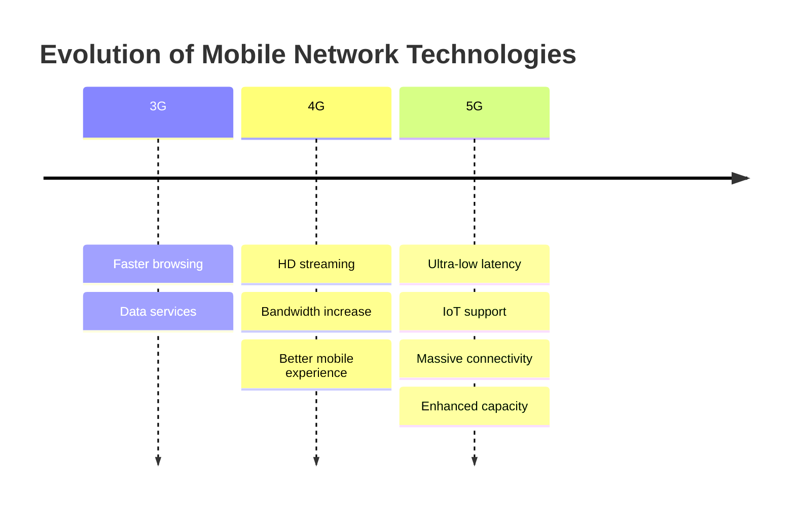

---

## 9.0 Cybersecurity

### Theoretical Definition
The primary goal of **Cybersecurity** is the protection of:
- Devices (smartphones, laptops, tablets, computers)
- Internet and workplace services
- Personal data

### Key Protection Axes
i. **Protection from theft or damage**  
ii. **Prevention of unauthorized access**  
iii. Protection of **massive volumes of personal data**

### Career Positions and Salary Data

| **Position** | **Salary (USD)** |
|-------------|------------------|
| Cryptographer | $75,000 |
| Information Security Analyst | $80,000 |
| Cybersecurity Analyst | $85,000 |
| Penetration Tester | $90,000 |
| Network Security Engineer | $95,000 |
| Cybersecurity Consultant | $100,000 |
| Cybersecurity Engineer | $105,000 |
| Security Architect | $115,000 |
| Incident Responder | $120,000 |
| Chief Information Security Officer (CISO) | $150,000 |

### Cybersecurity Layers
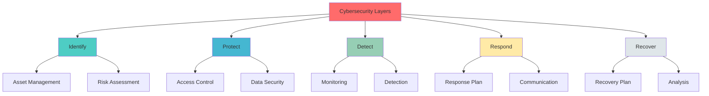

---

## 10.0 Full Stack Development

### Theoretical Definition
**Full Stack Development** refers to the comprehensive software development that includes:

#### Frontend
- **User Interface**
- Client-side logic
- User experience

#### Backend
- **Business Logic**
- **Workflows**
- Server-side processing
- Database management

### Career Positions and Salary Data

| **Position** | **Salary (USD)** |
|-------------|------------------|
| Web Developer | $50,000 |
| JavaScript Developer | $60,000 |
| Back-End Developer | $65,000 |
| Front-End Developer | $70,000 |
| React Developer | $75,000 |
| Node.js Developer | $80,000 |
| Angular Developer | $85,000 |
| Full Stack Developer | $90,000 |
| Full Stack Engineer | $100,000 |
| Full Stack Architect | $110,000 |

### Full Stack Architecture

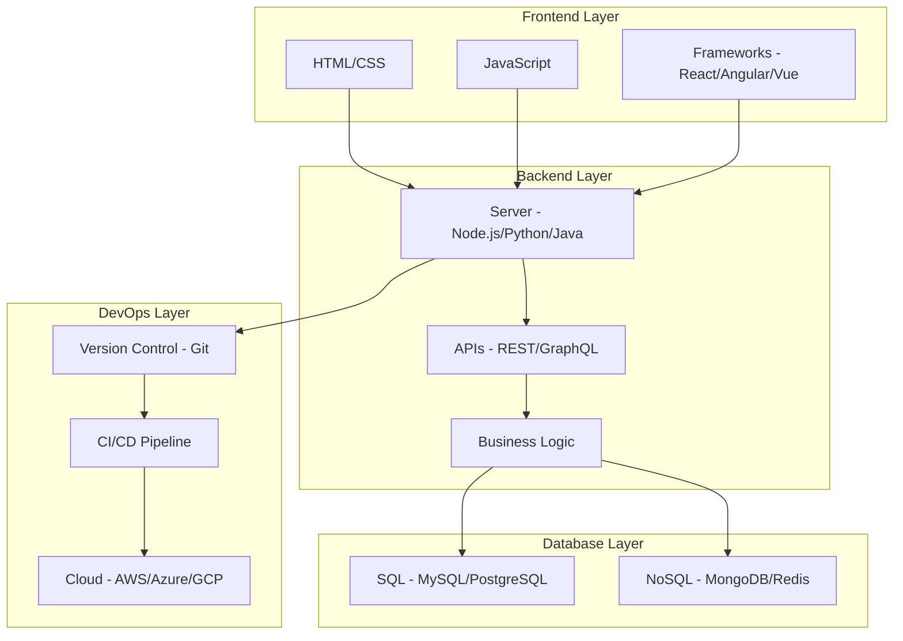

---

## 11.0 Computing Power

### Theoretical Definition
**Computing Power** refers to the ability of a computer or computer system to:
- Execute **complex computations**
- Process **data**

### Processing Speed Measurement
Processing speed is measured by the **number of computations or operations per second** the system can complete.

### Career Positions and Salary Data

| **Position** | **Salary (USD)** |
|-------------|------------------|
| Systems Administrator | $60,000 |
| Network Engineer | $70,000 |
| Data Engineer | $80,000 |
| Virtualization Engineer | $85,000 |
| IT Operations Manager | $95,000 |
| Cloud Computing Engineer | $100,000 |
| DevOps Engineer | $105,000 |
| Distributed Systems Engineer | $110,000 |
| Data Center Engineer | $115,000 |
| High Performance Computing (HPC) Engineer | $120,000 |

### Computing Power Levels

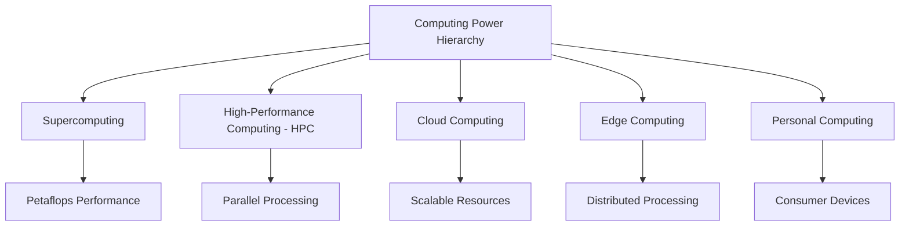

---

## 12.0 Datafication

### Theoretical Definition
**Datafication** in businesses refers to the process of converting most aspects of a business into **measurable data**.

### Basic Functions
i. **Monitoring**  
ii. **Control**  
iii. **Analysis**

### Goal
Transforming an organization into a data-driven enterprise.

### Career Positions and Salary Data

| **Position** | **Salary (USD)** |
|-------------|------------------|
| Data Analyst | $75,000 |
| Business Intelligence Analyst | $90,000 |
| Data Engineer | $115,000 |
| Database Administrator | $120,000 |
| Data Architect | $125,000 |
| Data Visualization Specialist | $130,000 |
| Big Data Engineer | $135,000 |
| Machine Learning Engineer | $140,000 |
| Artificial Intelligence (AI) Developer | $145,000 |
| Data Scientist | $150,000 |

### Datafication Cycle

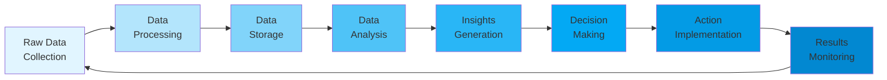

---

## 13.0 Digital Trust

### Theoretical Definition
**Digital Trust** refers to the level of trust that individuals and businesses have in:
- **Security**
- **Privacy**
- **Reliability**

### Importance for Businesses
i. Enhancing **customer loyalty**  
ii. Increasing **revenue**  
iii. Improving business reputation

### Security Segments

| **Segment** | **Description** |
|------------|-----------------|
| Identity and Access Management | Identity and access management |
| Cloud Security | Cloud environment security |
| Application Security | Application security |
| End-point Security | Endpoint device security |
| Security Monitoring | Security monitoring |
| Data Security | Data security |

### Career Positions and Salary Data

| **Position** | **Salary (USD)** |
|-------------|------------------|
| Compliance Officer | $50,000 |
| Risk Management Analyst | $60,000 |
| Digital Privacy Consultant | $65,000 |
| Fraud Prevention Analyst | $70,000 |
| Identity and Access Management Specialist | $75,000 |
| Information Security Analyst | $80,000 |
| Penetration Tester | $85,000 |
| Trust and Safety Manager | $90,000 |
| Cybersecurity Analyst | $95,000 |
| Digital Forensic Investigator | $100,000 |

### Digital Trust Architecture

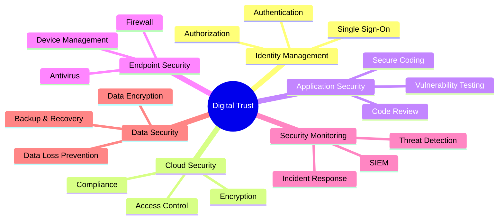

---

## 14.0 Internet of Behaviors (IoB)

### Theoretical Definition
The **Internet of Behaviors (IoB)** utilizes data collected from user devices connected to the internet.

### Basic Functions
i. Collection of large data volumes  
ii. Data **analysis**  
iii. Behavior **monitoring**  
iv. Understanding **human behavior**

### Knowledge Hierarchy - IoB Framework

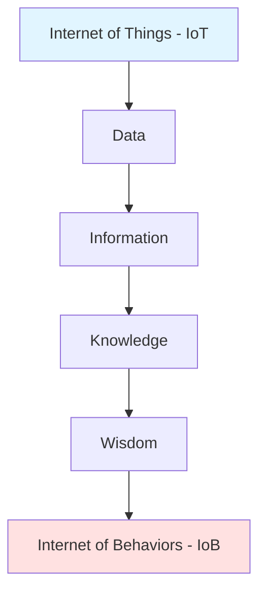

### Career Positions and Salary Data

| **Position** | **Salary (USD)** |
|-------------|------------------|
| Behavior Analyst | $50,000 |
| Digital Marketing Analyst | $60,000 |
| Data Analyst | $75,000 |
| Software Developer | $80,000 |
| User Experience (UX) Designer | $85,000 |
| Data Scientist | $95,000 |
| Machine Learning Engineer | $100,000 |
| Artificial Intelligence (AI) Developer | $100,000 |
| Cybersecurity Analyst | $105,000 |
| Data Privacy Consultant | $110,000 |

### IoB Applications

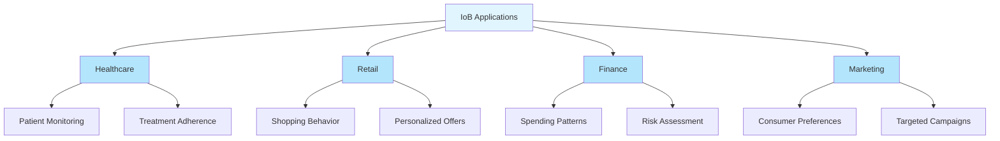

---

## 15.0 Predictive Analytics

### Theoretical Definition
**Predictive Analytics** is the process of utilizing data to **predict future outcomes**.

### Technologies Used
i. **Data Analysis**  
ii. **Machine Learning**  
iii. **AI**  
iv. **Statistical Models**

### Goal
Identify patterns that could predict **future behavior**.

### Career Positions and Salary Data

| **Position** | **Salary (USD)** |
|-------------|------------------|
| Data Analyst | $42,000 |
| Business Intelligence Analyst | $51,000 |
| Marketing Analyst | $52,000 |
| Risk Analyst | $56,000 |
| Statistician | $62,000 |
| Predictive Modeler | $66,000 |
| Data Mining Engineer | $68,000 |
| Machine Learning Engineer | $70,000 |
| Quantitative Analyst | $71,000 |
| Data Scientist | $72,000 |

### Predictive Analytics Cycle

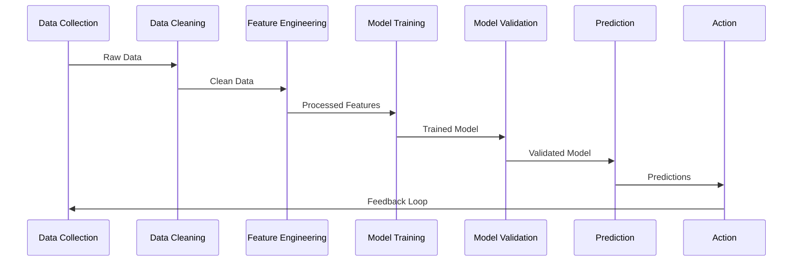

---

## 16.0 DevOps

### Theoretical Definition
**DevOps** is a set of methods and practices aimed at improving collaboration and communication between:
- **Software Development Teams**
- **IT Operators**

### Basic Characteristics
i. Use of **automation** tools  
ii. Processes to **enhance efficiency**  
iii. **Reducing errors**  
iv. Delivering **high-quality** software

### Career Positions and Salary Data

| **Position** | **Salary (USD)** |
|-------------|------------------|
| Configuration Manager | $70,000 |
| Automation Engineer | $75,000 |
| Release Manager | $80,000 |
| Security Engineer | $85,000 |
| Infrastructure Engineer | $90,000 |
| Software Engineer in Test (SET) | $95,000 |
| Cloud Engineer | $100,000 |
| Continuous Integration/Continuous Deployment (CI/CD) Engineer | $105,000 |
| Site Reliability Engineer (SRE) | $110,000 |
| DevOps Engineer | $115,000 |

### DevOps Cycle

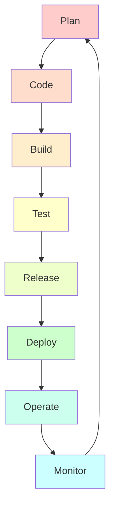

### DevOps Principles

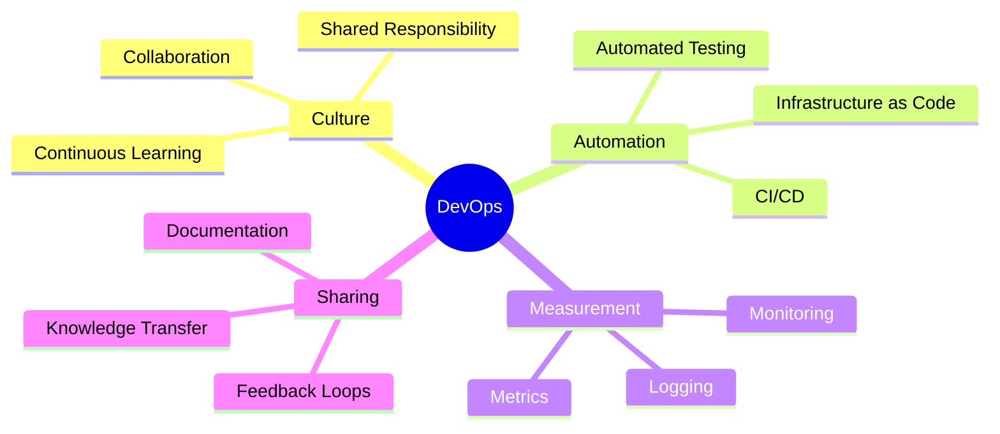

---

## 17.0 3D Printing

### Theoretical Definition
**3D Printing** has become a fundamental technology for creating **prototypes**.

### Main Application Areas
i. **Industry**  
ii. **Biomedical**

### Basic Characteristics
- Creation of **real objects** from a printer
- Additive manufacturing process
- Rapid prototyping capabilities

### Career Positions and Salary Data

| **Position** | **Salary (USD)** |
|-------------|------------------|
| Additive Manufacturing Technician | $30,000 |
| Quality Control Specialist | $35,000 |
| 3D CAD Designer | $40,000 |
| Rapid Prototyping Engineer | $50,000 |
| Materials Engineer | $60,000 |
| Industrial Designer | $65,000 |
| Product Designer | $70,000 |
| 3D Printing Engineer | $80,000 |
| Robotics Engineer | $85,000 |
| Research and Development Engineer | $90,000 |

### 3D Printing Process
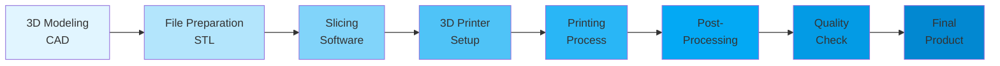

### 3D Printing Technologies

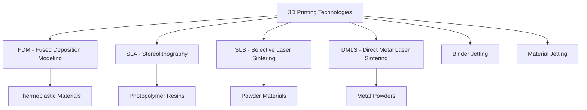

---

## 18.0 AI-as-a-Service (AIaaS)

### Theoretical Definition
**AI-as-a-Service** is a cloud-based solution that offers **Artificial Intelligence** capabilities.

### Service Models
i. **PaaS** - Platform as a Service  
ii. **IaaS** - Infrastructure as a Service  
iii. **SaaS** - Software as a Service

### Advantages
- Access to AI **without investment** in expensive hardware
- No tool maintenance
- Scalability
- Pay-as-you-go model

### Career Positions and Salary Data

| **Position** | **Salary (USD)** |
|-------------|------------------|
| Data Analyst | $48,000 |
| Software Developer | $52,000 |
| DevOps Engineer | $74,000 |
| Cloud Computing Engineer | $90,000 |
| Big Data Engineer | $95,000 |
| AI Engineer | $100,000 |
| Machine Learning Engineer | $100,000 |
| Artificial Intelligence (AI) Developer | $105,000 |
| Project Manager | $110,000 |
| Data Scientist | $115,000 |

### AIaaS Architecture

```mermaid
graph TB
    subgraph Client Layer
        A[Web App]
        B[Mobile App]
        C[Desktop App]
    end
    subgraph AIaaS Platform
        D[API Gateway]
        E[Authentication]
        F[AI Services]
    end
    subgraph AI Services
        G[NLP Service]
        H[Computer Vision]
        I[ML Models]
        J[Speech Recognition]
    end
    subgraph Infrastructure
        K[Cloud Storage]
        L[GPU Compute]
        M[Model Training]
    end
    
    A --> D
    B --> D
    C --> D
    D --> E
    E --> F
    F --> G
    F --> H
    F --> I
    F --> J
    G --> K
    H --> L
    I --> M
```

---

## 19.0 Genomics

### Theoretical Definition
The field of **Genomics** uses technology for:
- Studying **DNA and genes**
- **Genome mapping**
- **Gene quantification**
- Detecting potential **health problems**

### Role Categories

#### Technical Roles
i. Analysis  
ii. Design  
iii. Diagnosis

#### Non-Technical Roles
i. Theoretical analysis  
ii. Research

### Career Positions and Salary Data

| **Position** | **Salary (USD)** |
|-------------|------------------|
| Data Analyst | $48,000 |
| Software Developer | $52,000 |
| DevOps Engineer | $74,000 |
| Cloud Computing Engineer | $90,000 |
| Big Data Engineer | $95,000 |
| AI Engineer | $100,000 |
| Machine Learning Engineer | $100,000 |
| Artificial Intelligence (AI) Developer | $105,000 |
| Project Manager | $110,000 |
| Data Scientist | $115,000 |

### Genomics Pipeline

```mermaid
flowchart LR
    A[DNA Sample Collection] --> B[DNA Sequencing]
    B --> C[Data Processing]
    C --> D[Sequence Alignment]
    D --> E[Variant Calling]
    E --> F[Annotation]
    F --> G[Interpretation]
    G --> H[Clinical Report]
```

### Genomics Applications

```mermaid
mindmap
  root((Genomics Applications))
    Personalized Medicine
      Drug Response
      Disease Risk
      Treatment Plans
    Disease Research
      Cancer Genomics
      Rare Diseases
      Infectious Diseases
    Agriculture
      Crop Improvement
      Livestock Breeding
    Forensics
      Criminal Investigation
      Paternity Testing
```

---

## Salary Summary Table by Technology

| **Technology** | **Minimum Salary** | **Maximum Salary** | **Average** |
|----------------|-------------------|-------------------|-------------|
| AI | $70,000 | $120,000 | $95,000 |
| RPA | $60,000 | $130,000 | $95,000 |
| Edge Computing | $85,000 | $150,000 | $117,500 |
| Quantum Computing | $85,000 | $170,000 | $127,500 |
| VR/AR | $55,000 | $110,000 | $82,500 |
| Blockchain | $65,000 | $120,000 | $92,500 |
| IoT | $70,000 | $120,000 | $95,000 |
| 5G Technology | $85,000 | $120,000 | $102,500 |
| Cybersecurity | $75,000 | $150,000 | $112,500 |
| Full Stack Development | $50,000 | $110,000 | $80,000 |
| Computing Power | $60,000 | $120,000 | $90,000 |
| Datafication | $75,000 | $150,000 | $112,500 |
| Digital Trust | $50,000 | $100,000 | $75,000 |
| Internet of Behaviors | $50,000 | $110,000 | $80,000 |
| Predictive Analytics | $42,000 | $72,000 | $57,000 |
| DevOps | $70,000 | $115,000 | $92,500 |
| 3D Printing | $30,000 | $90,000 | $60,000 |
| AI-as-a-Service | $48,000 | $115,000 | $81,500 |
| Genomics | $48,000 | $115,000 | $81,500 |

---

## Technology Trends Summary

```mermaid
mindmap
  root((Technology Trends 2026))
    AI & ML
      Artificial Intelligence
      Machine Learning
      Deep Learning
      AIaaS
    Automation
      RPA
      DevOps
      Computing Power
    Data Science
      Datafication
      Predictive Analytics
      Genomics
      IoB
    Infrastructure
      Edge Computing
      5G Technology
      Cloud Computing
      Quantum Computing
    Security
      Cybersecurity
      Digital Trust
    Development
      Full Stack Development
      3D Printing
    Connectivity
      IoT
      Blockchain
    Immersive Tech
      VR/AR/xR
```

---

## Bibliography and Sources

**Instructor:** Alexandros Bantaloukas-Artzimant MSc, PhD  
**Email:** k.arjmand@uoi.gr

**Editor:** Konstantinos Sakkas BSc, MSc  
**Email:** ksakkas@uoi.gr

**University of Ioannina**  
**School of Computer Science & Telecommunications**  
**Department of Computer Science & Telecommunications**  
**3rd Semester - Computer Architecture**

---

**Creation Date:** January 2026  
**Version:** 1.0