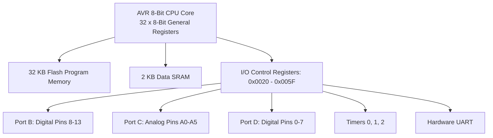

# Tutorial 02: Register-Level AVR Embedded Interfacing on ATmega328P

This tutorial details bare-metal, register-level embedded systems programming on the 8-bit AVR RISC ATmega328P microcontroller (Arduino Uno). Topics include direct GPIO port manipulation, hardware timer configuration, interrupt handling, and UART serial communication.

---

## 1. Microcontroller Architecture Overview

The ATmega328P is an 8-bit AVR RISC microcontroller featuring an enhanced Harvard architecture (independent program Flash and data SRAM buses).



### 1.1 Physical Memory Specifications
- **Program Memory:** 32 KB on-chip in-system reprogrammable Flash (organized as 16K x 16-bit words).
- **Data SRAM:** 2 KB internal SRAM for dynamic variable and stack allocation.
- **Clock Frequency:** Standard system oscillator at $f_{\text{osc}} = 16.0\text{ MHz}$ (clock period $T_{\text{clk}} = 62.5\text{ ns}$).

---

## 2. Direct GPIO Port Register Manipulation

Arduino pins are organized into three 8-bit hardware I/O ports: **Port B**, **Port C**, and **Port D**. Each port is controlled by three memory-mapped registers:

| Register | Name | Functional Operation |
|:---|:---|:---|
| **`DDRx`** | Data Direction Register | Configures pin mode: `0 = Input`, `1 = Output`. |
| **`PORTx`** | Port Output Data Register | Drives logic level when output (`1 = HIGH`, `0 = LOW`). Enables internal pull-up resistor when input (`1 = Pull-Up Enabled`). |
| **`PINx`** | Port Input Pins Address | Reads instantaneous electrical logic level present on physical pins. |

### 2.1 Hardware Pin Mapping

- **Port B (PB0 to PB5):** Maps to Arduino Digital Pins 8 to 13.
  - Pin 13 corresponds to `PB5` (on-board LED).
- **Port C (PC0 to PC5):** Maps to Arduino Analog Pins A0 to A5.
- **Port D (PD0 to PD7):** Maps to Arduino Digital Pins 0 to 7.
  - `PD0` is RX (UART Receive); `PD1` is TX (UART Transmit).
  - `PD2` is External Interrupt 0 (`INT0`); `PD3` is External Interrupt 1 (`INT1`).

### 2.2 Bitwise Manipulation Idioms
Direct register operations execute in a single CPU cycle using AVR assembly instructions `sbi` (Set Bit in I/O) and `cbi` (Clear Bit in I/O), contrasting with `digitalWrite()` which incurs roughly 50 clock cycles of abstraction overhead.

```cpp
#include <avr/io.h>
#include <util/delay.h>

// 1. Set bit (Configure PB5 as Output)
DDRB |= (1 << DDB5);

// 2. Drive HIGH (Turn on Pin 13 LED)
PORTB |= (1 << PORTB5);

// 3. Drive LOW (Turn off Pin 13 LED)
PORTB &= ~(1 << PORTB5);

// 4. Toggle bit in a single cycle
PORTB ^= (1 << PORTB5);

// 5. Read digital pin state (Check if PD2 is HIGH)
if (PIND & (1 << PIND2)) {
    // Pin PD2 is at logic level HIGH
}
```

---

## 3. Hardware Timers and Precision Interrupt Generation

The ATmega328P integrates three hardware timers:
- **Timer0:** 8-bit timer (used internally by Arduino for `millis()` and `delay()`).
- **Timer1:** 16-bit high-resolution timer.
- **Timer2:** 8-bit timer with asynchronous clocking capability.

### 3.1 Clear Timer on Compare Match (CTC) Mode
In CTC mode, the timer counts from 0 up to a compare value stored in `OCR1A`, resets to 0, and fires an interrupt.

#### Calculating the Compare Match Value ($OCR1A$):
To trigger an exact 1 Hz interrupt ($T = 1.0\text{ s}$) from a $16\text{ MHz}$ system clock with a prescaler of 1024:
$$
f_{\text{target}} = \frac{f_{\text{osc}}}{\text{Prescaler} \times (1 + OCR1A)}
$$
$$
1.0 = \frac{16 \times 10^6}{1024 \times (1 + OCR1A)}
$$
$$
1 + OCR1A = \frac{16 \times 10^6}{1024} = 15,625 \implies OCR1A = 15,624
$$

### 3.2 Complete 1 Hz Timer1 Interrupt Program

```cpp
#include <avr/io.h>
#include <avr/interrupt.h>

void initTimer1(void) {
    cli(); // Disable global interrupts during configuration

    // 1. Reset Timer/Counter Control Registers
    TCCR1A = 0;
    TCCR1B = 0;
    TCNT1  = 0; // Initialize counter value to 0

    // 2. Set compare match register for 1 Hz increments
    OCR1A = 15624;

    // 3. Enable CTC mode (WGM12 bit in TCCR1B)
    TCCR1B |= (1 << WGM12);

    // 4. Set CS12 and CS10 bits for 1024 prescaler
    TCCR1B |= (1 << CS12) | (1 << CS10);

    // 5. Enable timer compare interrupt
    TIMSK1 |= (1 << OCIE1A);

    sei(); // Enable global interrupts
}

// Interrupt Service Routine for Timer1 Compare Match A
ISR(TIMER1_COMPA_vect) {
    // Toggle on-board LED (PB5 / Pin 13) every 1 second
    PORTB ^= (1 << PORTB5);
}

int main(void) {
    // Set PB5 as output
    DDRB |= (1 << DDB5);

    initTimer1();

    while (1) {
        // Main loop is free for background tasks; LED toggles autonomously
    }

    return 0;
}
```

---

## 4. Hardware External Interrupts (`INT0` / `INT1`)

External interrupts provide immediate sub-microsecond response to external electrical events without polling.

### Configuration Registers:
- **`EICRA` (External Interrupt Control Register A):** Configures trigger condition for `INT0` (bits `ISC01`, `ISC00`):
  - `00`: Low level trigger.
  - `01`: Any logical change.
  - `10`: Falling edge trigger.
  - `11`: Rising edge trigger.
- **`EIMSK` (External Interrupt Mask Register):** Setting bit `INT0` enables the interrupt pin.

```cpp
void initExternalInterrupt(void) {
    cli();
    DDRD &= ~(1 << DDD2);       // PD2 (INT0) as input
    PORTD |= (1 << PORTD2);     // Enable internal pull-up resistor

    EICRA |= (1 << ISC01);      // Falling edge trigger on INT0
    EICRA &= ~(1 << ISC00);

    EIMSK |= (1 << INT0);       // Enable INT0 interrupt
    sei();
}

ISR(INT0_vect) {
    // Executes instantaneously when button on PD2 is pressed
    PORTB ^= (1 << PORTB5);
}
```

---

## 5. Bare-Metal UART Serial Communication

The Universal Synchronous/Asynchronous Receiver Transmitter (USART0) enables serial communication with external microcontrollers or PC terminals.

### 5.1 Baud Rate Calculation
For asynchronous normal speed mode ($U2X0 = 0$):
$$
UBRR0 = \left\lfloor \frac{f_{\text{osc}}}{16 \times \text{Baud}} \right\rfloor - 1
$$
For 9600 Baud at $16\text{ MHz}$:
$$
UBRR0 = \left\lfloor \frac{16 \times 10^6}{16 \times 9600} \right\rfloor - 1 = \left\lfloor 104.166 \right\rfloor - 1 = 103
$$

### 5.2 UART Driver Implementation

```cpp
#define BAUD 9600
#define MY_UBRR ((16000000UL / (16UL * BAUD)) - 1)

void uartInit(unsigned int ubrr) {
    // Set baud rate registers
    UBRR0H = (unsigned char)(ubrr >> 8);
    UBRR0L = (unsigned char)ubrr;

    // Enable receiver and transmitter
    UCSR0B = (1 << RXEN0) | (1 << TXEN0);

    // Frame format: 8 data bits, 1 stop bit, no parity (8N1)
    UCSR0C = (1 << UCSZ01) | (1 << UCSZ00);
}

void uartTransmit(unsigned char data) {
    // Wait until transmit buffer is ready (UDRE0 bit set)
    while (!(UCSR0A & (1 << UDRE0)));
    UDR0 = data; // Transmit byte
}

unsigned char uartReceive(void) {
    // Wait for incoming data (RXC0 bit set)
    while (!(UCSR0A & (1 << RXC0)));
    return UDR0; // Return received byte
}
```

---

## 6. Compilation via Arduino CLI

Compile and flash register-level AVR firmware directly from the Linux terminal:

```bash
# Compile code for Arduino Uno (ATmega328P)
arduino-cli compile --fqbn arduino:avr:uno sketch.ino

# Upload binary over serial port
arduino-cli upload -p /dev/ttyACM0 --fqbn arduino:avr:uno sketch.ino
```

