# Ισοζυγισμένα Δέντρα AVL: Εισαγωγή, Διαγραφή, Περιστροφές

## Περιεχόμενα
1. [Εισαγωγή στα Δέντρα AVL](#εισαγωγή-στα-δέντρα-avl)
2. [Συντελεστής Ισορροπίας](#συντελεστής-ισορροπίας)
3. [Περιστροφές (Rotations)](#περιστροφές-rotations)
4. [Εισαγωγή Στοιχείων](#εισαγωγή-στοιχείων)
5. [Διαγραφή Στοιχείων](#διαγραφή-στοιχείων)
6. [Πρακτικά Παραδείγματα](#πρακτικά-παραδείγματα)

---

## Εισαγωγή στα Δέντρα AVL

### Τι είναι Δέντρο AVL;

Ένα **δέντρο AVL** (Adelson-Velsky and Landis) είναι ένα **αυτο-ισορροπούμενο** δυαδικό δέντρο αναζήτησης όπου η διαφορά ύψους μεταξύ αριστερού και δεξιού υποδέντρου για κάθε κόμβο είναι το πολύ **1**.

### Γιατί AVL;

**Πρόβλημα BST**: Τα απλά δυαδικά δέντρα αναζήτησης μπορούν να εκφυλιστούν σε γραμμική λίστα.

**Λύση AVL**: Διατηρεί αυτόματα την ισορροπία, εγγυόμενο **O(log n)** για αναζήτηση, εισαγωγή και διαγραφή.

### Σύγκριση: BST vs AVL

**Μη Ισορροπημένο BST**:
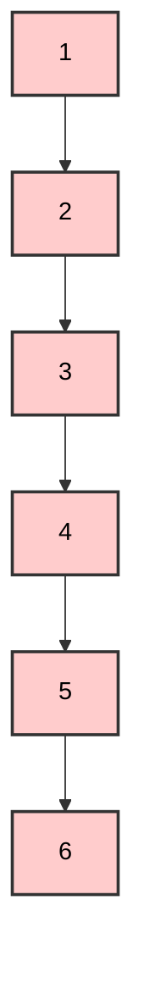
- Ύψος: **5** (χειρότερη περίπτωση)
- Πολυπλοκότητα: **O(n)**

**Ισορροπημένο AVL**:
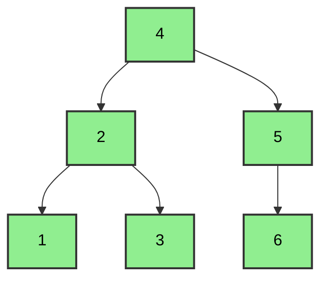
- Ύψος: **2** (βέλτιστη περίπτωση)
- Πολυπλοκότητα: **O(log n)**

---

## Συντελεστής Ισορροπίας

### Ορισμός

Ο **Συντελεστής Ισορροπίας (Balance Factor - BF)** για κάθε κόμβο υπολογίζεται:

**BF = Ύψος(Αριστερό Υποδέντρο) - Ύψος(Δεξί Υποδέντρο)**

### Κανόνας AVL

Για να είναι ένα δέντρο **ισορροπημένο AVL**, κάθε κόμβος πρέπει να έχει:

**BF ∈ {-1, 0, +1}**

### Παράδειγμα Υπολογισμού BF

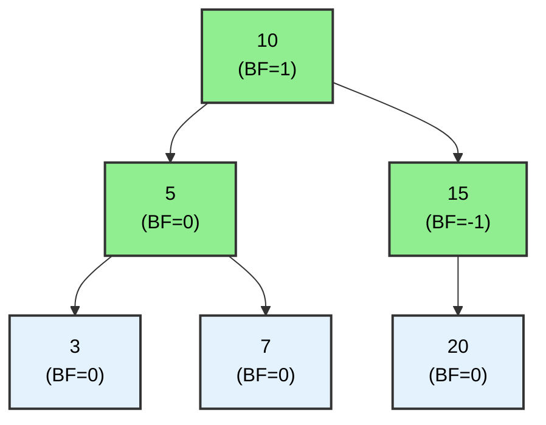

**Υπολογισμοί**:
- **Κόμβος 3**: BF = 0 - 0 = **0** (φύλλο)
- **Κόμβος 7**: BF = 0 - 0 = **0** (φύλλο)
- **Κόμβος 20**: BF = 0 - 0 = **0** (φύλλο)
- **Κόμβος 5**: BF = 1 - 1 = **0** (έχει δύο παιδιά ίδιου ύψους)
- **Κόμβος 15**: BF = 0 - 1 = **-1** (δεξί υποδέντρο ψηλότερο)
- **Κόμβος 10**: BF = 2 - 1 = **+1** (αριστερό υποδέντρο ψηλότερο)

 **Όλοι οι κόμβοι έχουν BF ∈ {-1, 0, +1}** → Ισορροπημένο AVL!

### Μη Ισορροπημένο Παράδειγμα

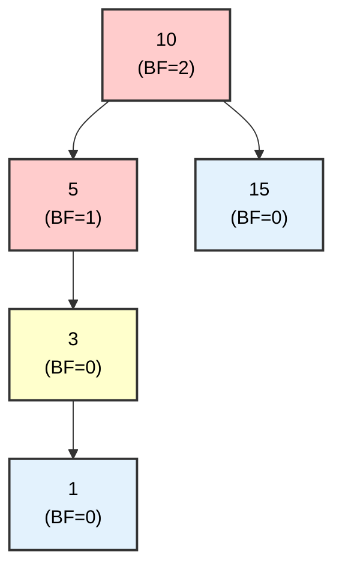

**Υπολογισμοί**:
- **Κόμβος 10**: BF = 3 - 1 = **+2**  (παραβίαση!)
- **Κόμβος 5**: BF = 2 - 0 = **+1** 
- **Κόμβος 3**: BF = 1 - 0 = **+1** 

 **Ο κόμβος 10 έχει BF = +2** → Χρειάζεται **επαναισορρόπηση**!

---

## Περιστροφές (Rotations)

Οι περιστροφές είναι οι **βασικές λειτουργίες** για την επαναισορρόπηση ενός AVL δέντρου. Υπάρχουν **4 τύποι**:

### 1. Δεξιά Περιστροφή (Right Rotation - RR)

**Πότε χρησιμοποιείται**: Όταν το **αριστερό-αριστερό** υποδέντρο προκαλεί μη ισορροπία.

**Περίπτωση**: BF(κόμβος) = **+2** και BF(αριστερό παιδί) = **+1**

#### Παράδειγμα:

**Πριν την Περιστροφή**:
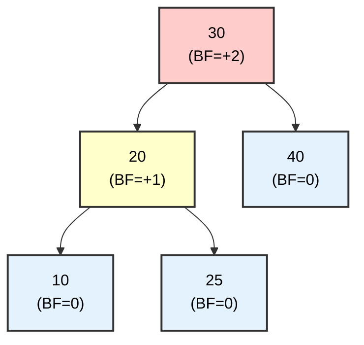

**Μετά τη Δεξιά Περιστροφή**:
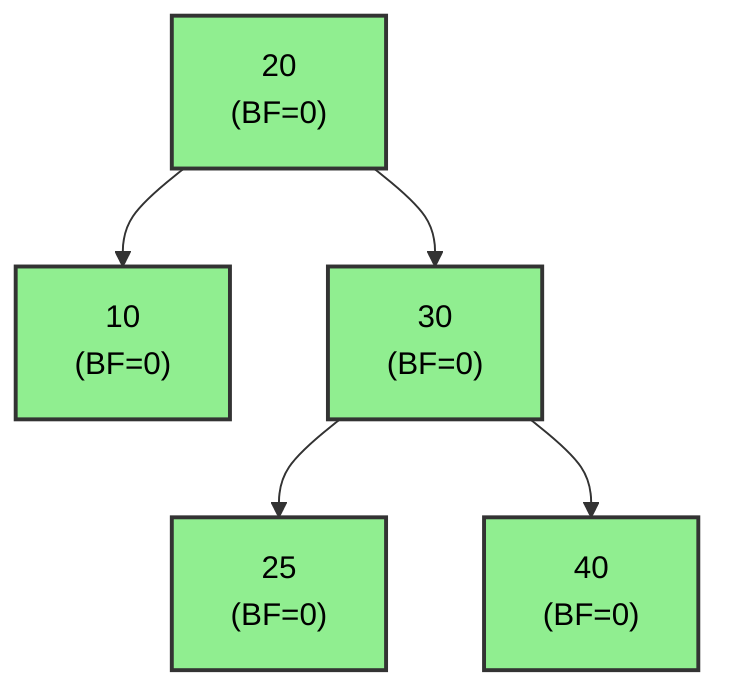

**Μηχανισμός**:
1. Ο κόμβος **20 ανεβαίνει** στη θέση του 30
2. Ο κόμβος **30 κατεβαίνει** ως δεξί παιδί του 20
3. Το **25 μεταφέρεται** ως αριστερό παιδί του 30

---

### 2. Αριστερή Περιστροφή (Left Rotation - LL)

**Πότε χρησιμοποιείται**: Όταν το **δεξί-δεξί** υποδέντρο προκαλεί μη ισορροπία.

**Περίπτωση**: BF(κόμβος) = **-2** και BF(δεξί παιδί) = **-1**

#### Παράδειγμα:

**Πριν την Περιστροφή**:
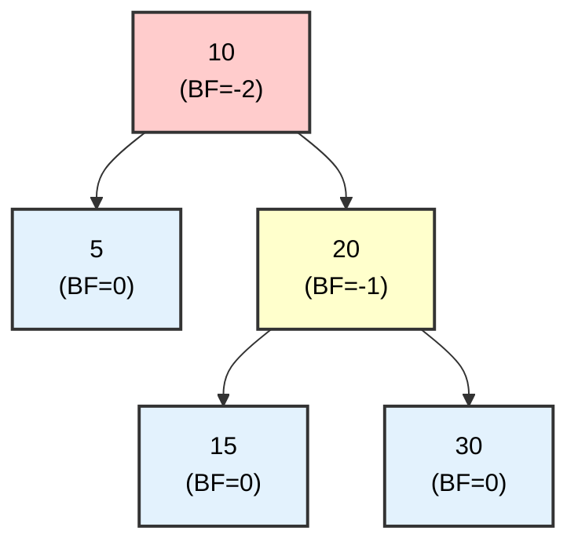

**Μετά την Αριστερή Περιστροφή**:
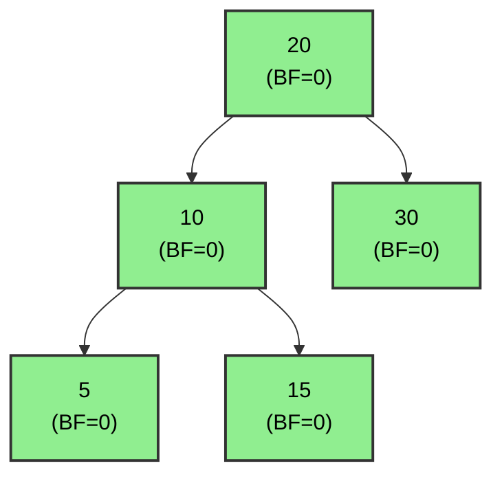

**Μηχανισμός**:
1. Ο κόμβος **20 ανεβαίνει** στη θέση του 10
2. Ο κόμβος **10 κατεβαίνει** ως αριστερό παιδί του 20
3. Το **15 μεταφέρεται** ως δεξί παιδί του 10

---

### 3. Αριστερή-Δεξιά Περιστροφή (Left-Right - LR)

**Πότε χρησιμοποιείται**: Όταν το **αριστερό-δεξί** υποδέντρο προκαλεί μη ισορροπία.

**Περίπτωση**: BF(κόμβος) = **+2** και BF(αριστερό παιδί) = **-1**

#### Παράδειγμα:

**Πριν την Περιστροφή**:
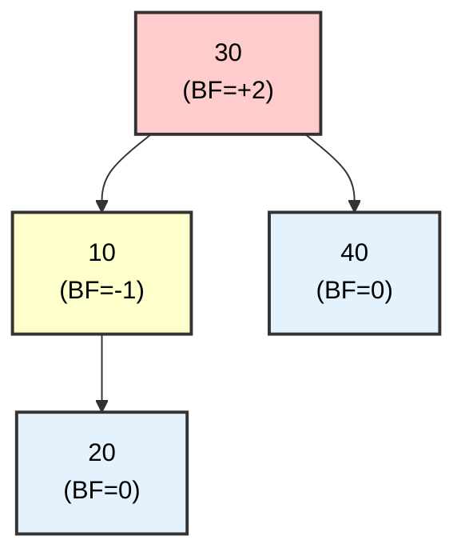

**Βήμα 1: Αριστερή Περιστροφή στο 10**:
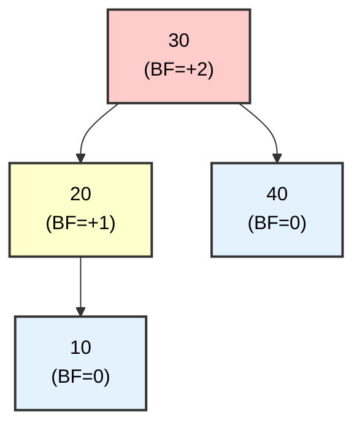

**Βήμα 2: Δεξιά Περιστροφή στο 30**:
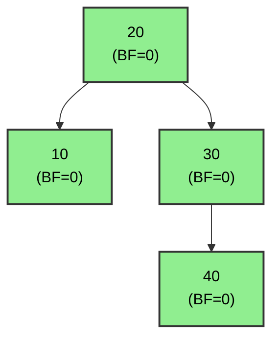

**Διαδικασία**: **Δύο περιστροφές**
1. Πρώτα **αριστερή** περιστροφή στο αριστερό παιδί
2. Μετά **δεξιά** περιστροφή στον κόμβο

---

### 4. Δεξιά-Αριστερή Περιστροφή (Right-Left - RL)

**Πότε χρησιμοποιείται**: Όταν το **δεξί-αριστερό** υποδέντρο προκαλεί μη ισορροπία.

**Περίπτωση**: BF(κόμβος) = **-2** και BF(δεξί παιδί) = **+1**

#### Παράδειγμα:

**Πριν την Περιστροφή**:
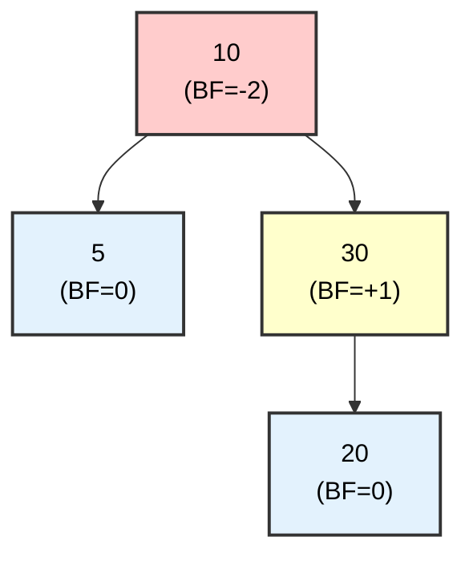

**Βήμα 1: Δεξιά Περιστροφή στο 30**:
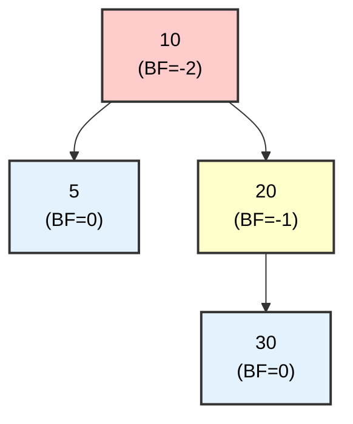

**Βήμα 2: Αριστερή Περιστροφή στο 10**:
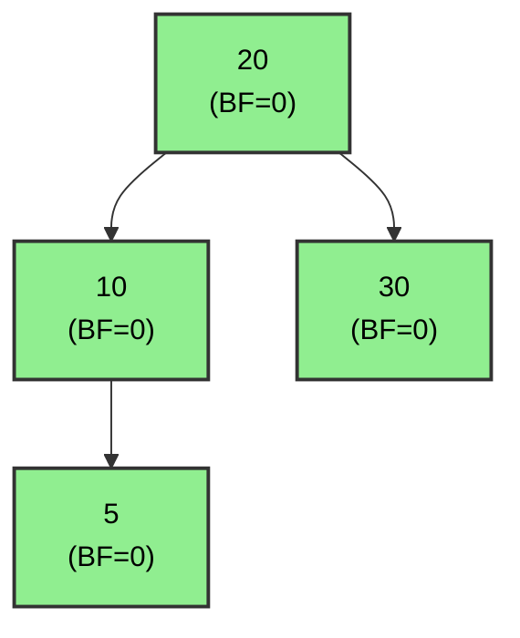

**Διαδικασία**: **Δύο περιστροφές**
1. Πρώτα **δεξιά** περιστροφή στο δεξί παιδί
2. Μετά **αριστερή** περιστροφή στον κόμβο

---

### Σύνοψη Περιστροφών

| Τύπος | Προϋπόθεση | Ενέργεια | Αριθμός Περιστροφών |
|-------|------------|----------|---------------------|
| **Right (RR)** | BF=+2, Αριστερό BF=+1 | Δεξιά περιστροφή | 1 |
| **Left (LL)** | BF=-2, Δεξί BF=-1 | Αριστερή περιστροφή | 1 |
| **Left-Right (LR)** | BF=+2, Αριστερό BF=-1 | Αριστερή + Δεξιά | 2 |
| **Right-Left (RL)** | BF=-2, Δεξί BF=+1 | Δεξιά + Αριστερή | 2 |

---

## Εισαγωγή Στοιχείων

Η εισαγωγή σε AVL δέντρο ακολουθεί τα εξής βήματα:
1. **Εισαγωγή** όπως σε απλό BST
2. **Επαναυπολογισμός** Balance Factor για όλους τους προγόνους
3. **Επαναισορρόπηση** αν κάποιος κόμβος έχει |BF| > 1

---

### Παράδειγμα 1: Απλή Εισαγωγή (Χωρίς Περιστροφή)

**Εισαγωγή ακολουθίας**: 10, 5, 15

#### Βήμα 1: Εισαγωγή 10
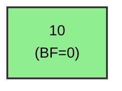

#### Βήμα 2: Εισαγωγή 5
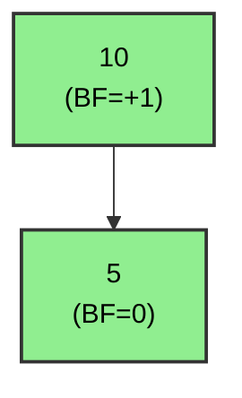

#### Βήμα 3: Εισαγωγή 15
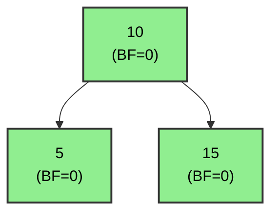

 Όλοι οι BF ∈ {-1, 0, +1} → **Καμία περιστροφή απαιτείται**!

---

### Παράδειγμα 2: Εισαγωγή με Δεξιά Περιστροφή

**Εισαγωγή ακολουθίας**: 30, 20, 10

#### Βήμα 1: Εισαγωγή 30
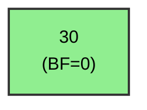

#### Βήμα 2: Εισαγωγή 20
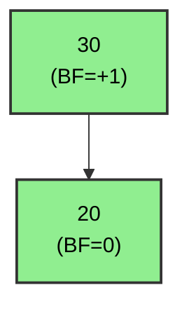

#### Βήμα 3: Εισαγωγή 10

**Πριν Επαναισορρόπηση**:
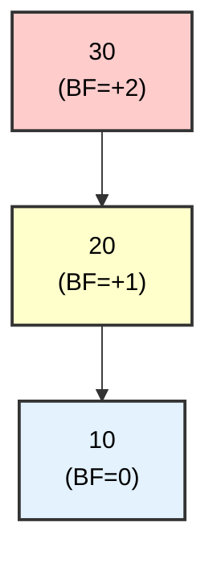

 **Μη ισορροπία**: BF(30) = +2 → Χρειάζεται **δεξιά περιστροφή**!

**Μετά Δεξιά Περιστροφή**:
```mermaid
graph TD
    A["20<br/>(BF=0)"] --> B["10<br/>(BF=0)"]
    A --> C["30<br/>(BF=0)"]
    
    style A fill:#90EE90,stroke:#333,stroke-width:2px,color:black
    style B fill:#90EE90,stroke:#333,stroke-width:2px,color:black
    style C fill:#90EE90,stroke:#333,stroke-width:2px,color:black
```

 **Ισορροπημένο**!

---

### Παράδειγμα 3: Εισαγωγή με Αριστερή-Δεξιά Περιστροφή

**Εισαγωγή ακολουθίας**: 30, 10, 20

#### Βήμα 1-2: Εισαγωγή 30, 10
```mermaid
graph TD
    A["30<br/>(BF=+1)"] --> B["10<br/>(BF=0)"]
    
    style A fill:#90EE90,stroke:#333,stroke-width:2px,color:black
    style B fill:#90EE90,stroke:#333,stroke-width:2px,color:black
```

#### Βήμα 3: Εισαγωγή 20

**Πριν Επαναισορρόπηση**:
```mermaid
graph TD
    A["30<br/>(BF=+2)"] --> B["10<br/>(BF=-1)"]
    B --> C["20<br/>(BF=0)"]
    
    style A fill:#ffcccc,stroke:#333,stroke-width:2px,color:black
    style B fill:#ffffcc,stroke:#333,stroke-width:2px,color:black
    style C fill:#e3f2fd,stroke:#333,stroke-width:2px,color:black
```

 **Μη ισορροπία**: BF(30) = +2, BF(10) = -1 → **Left-Right περιστροφή**!

**Βήμα 3.1: Αριστερή Περιστροφή στο 10**:
```mermaid
graph TD
    A["30<br/>(BF=+2)"] --> B["20<br/>(BF=+1)"]
    B --> C["10<br/>(BF=0)"]
    
    style A fill:#ffcccc,stroke:#333,stroke-width:2px,color:black
    style B fill:#ffffcc,stroke:#333,stroke-width:2px,color:black
    style C fill:#e3f2fd,stroke:#333,stroke-width:2px,color:black
```

**Βήμα 3.2: Δεξιά Περιστροφή στο 30**:
```mermaid
graph TD
    A["20<br/>(BF=0)"] --> B["10<br/>(BF=0)"]
    A --> C["30<br/>(BF=0)"]
    
    style A fill:#90EE90,stroke:#333,stroke-width:2px,color:black
    style B fill:#90EE90,stroke:#333,stroke-width:2px,color:black
    style C fill:#90EE90,stroke:#333,stroke-width:2px,color:black
```

 **Ισορροπημένο**!

---

### Παράδειγμα 4: Σύνθετη Εισαγωγή

**Εισαγωγή ακολουθίας**: 50, 25, 75, 10, 30, 60, 80, 5, 15

#### Τελικό Δέντρο (Μετά όλες τις εισαγωγές):

```mermaid
graph TD
    A["50<br/>(BF=0)"] --> B["25<br/>(BF=0)"]
    A --> C["75<br/>(BF=0)"]
    B --> D["10<br/>(BF=0)"]
    B --> E["30<br/>(BF=0)"]
    C --> F["60<br/>(BF=0)"]
    C --> G["80<br/>(BF=0)"]
    D --> H["5<br/>(BF=0)"]
    D --> I["15<br/>(BF=0)"]
    
    style A fill:#90EE90,stroke:#333,stroke-width:2px,color:black
    style B fill:#90EE90,stroke:#333,stroke-width:2px,color:black
    style C fill:#90EE90,stroke:#333,stroke-width:2px,color:black
    style D fill:#90EE90,stroke:#333,stroke-width:2px,color:black
    style E fill:#90EE90,stroke:#333,stroke-width:2px,color:black
    style F fill:#90EE90,stroke:#333,stroke-width:2px,color:black
    style G fill:#90EE90,stroke:#333,stroke-width:2px,color:black
    style H fill:#90EE90,stroke:#333,stroke-width:2px,color:black
    style I fill:#90EE90,stroke:#333,stroke-width:2px,color:black
```

**Χαρακτηριστικά**:
- Ύψος: **3**
- Όλοι οι BF = **0**
- Πλήρως ισορροπημένο AVL δέντρο

---

### Παράδειγμα 5: Εισαγωγή που Απαιτεί Πολλαπλές Περιστροφές

**Εισαγωγή**: 1, 2, 3, 4, 5, 6, 7

#### Διαδικασία:

**Μετά 1, 2, 3** (Αριστερή περιστροφή):
```mermaid
graph TD
    A["2<br/>(BF=0)"] --> B["1<br/>(BF=0)"]
    A --> C["3<br/>(BF=0)"]
    
    style A fill:#90EE90,stroke:#333,stroke-width:2px,color:black
    style B fill:#90EE90,stroke:#333,stroke-width:2px,color:black
    style C fill:#90EE90,stroke:#333,stroke-width:2px,color:black
```

**Μετά 4** (Αριστερή περιστροφή):
```mermaid
graph TD
    A["2<br/>(BF=-1)"] --> B["1<br/>(BF=0)"]
    A --> C["3<br/>(BF=-1)"]
    C --> D["4<br/>(BF=0)"]
    
    style A fill:#90EE90,stroke:#333,stroke-width:2px,color:black
    style B fill:#90EE90,stroke:#333,stroke-width:2px,color:black
    style C fill:#90EE90,stroke:#333,stroke-width:2px,color:black
    style D fill:#90EE90,stroke:#333,stroke-width:2px,color:black
```

**Μετά 5** (Αριστερή Περιστροφή, μετά αναδιάρθρωση):
```mermaid
graph TD
    A["2<br/>(BF=-1)"] --> B["1<br/>(BF=0)"]
    A --> C["4<br/>(BF=0)"]
    C --> D["3<br/>(BF=0)"]
    C --> E["5<br/>(BF=0)"]
    
    style A fill:#90EE90,stroke:#333,stroke-width:2px,color:black
    style B fill:#90EE90,stroke:#333,stroke-width:2px,color:black
    style C fill:#90EE90,stroke:#333,stroke-width:2px,color:black
    style D fill:#90EE90,stroke:#333,stroke-width:2px,color:black
    style E fill:#90EE90,stroke:#333,stroke-width:2px,color:black
```

**Τελικό (Μετά 6, 7)**:
```mermaid
graph TD
    A["4<br/>(BF=0)"] --> B["2<br/>(BF=0)"]
    A --> C["6<br/>(BF=0)"]
    B --> D["1<br/>(BF=0)"]
    B --> E["3<br/>(BF=0)"]
    C --> F["5<br/>(BF=0)"]
    C --> G["7<br/>(BF=0)"]
    
    style A fill:#90EE90,stroke:#333,stroke-width:2px,color:black
    style B fill:#90EE90,stroke:#333,stroke-width:2px,color:black
    style C fill:#90EE90,stroke:#333,stroke-width:2px,color:black
    style D fill:#90EE90,stroke:#333,stroke-width:2px,color:black
    style E fill:#90EE90,stroke:#333,stroke-width:2px,color:black
    style F fill:#90EE90,stroke:#333,stroke-width:2px,color:black
    style G fill:#90EE90,stroke:#333,stroke-width:2px,color:black
```

 **Σημείωση**: Η ίδια ακολουθία (1-7) σε απλό BST θα έδινε γραμμική λίστα!

---

## Διαγραφή Στοιχείων

Η διαγραφή σε AVL δέντρο:
1. **Διαγραφή** όπως σε απλό BST
2. **Επαναυπολογισμός** BF για όλους τους προγόνους
3. **Επαναισορρόπηση** όπου χρειάζεται (μπορεί να χρειαστούν πολλαπλές περιστροφές)

---

### Παράδειγμα 6: Διαγραφή Φύλλου

**Αρχικό Δέντρο**:
```mermaid
graph TD
    A["20<br/>(BF=0)"] --> B["10<br/>(BF=0)"]
    A --> C["30<br/>(BF=0)"]
    B --> D["5<br/>(BF=0)"]
    B --> E["15<br/>(BF=0)"]
    C --> F["25<br/>(BF=0)"]
    C --> G["35<br/>(BF=0)"]
    
    style A fill:#90EE90,stroke:#333,stroke-width:2px,color:black
    style B fill:#90EE90,stroke:#333,stroke-width:2px,color:black
    style C fill:#90EE90,stroke:#333,stroke-width:2px,color:black
    style D fill:#90EE90,stroke:#333,stroke-width:2px,color:black
    style E fill:#90EE90,stroke:#333,stroke-width:2px,color:black
    style F fill:#90EE90,stroke:#333,stroke-width:2px,color:black
    style G fill:#90EE90,stroke:#333,stroke-width:2px,color:black
```

**Διαγραφή του 5**:
```mermaid
graph TD
    A["20<br/>(BF=-1)"] --> B["10<br/>(BF=-1)"]
    A --> C["30<br/>(BF=0)"]
    B --> E["15<br/>(BF=0)"]
    C --> F["25<br/>(BF=0)"]
    C --> G["35<br/>(BF=0)"]
    
    style A fill:#90EE90,stroke:#333,stroke-width:2px,color:black
    style B fill:#90EE90,stroke:#333,stroke-width:2px,color:black
    style C fill:#90EE90,stroke:#333,stroke-width:2px,color:black
    style E fill:#90EE90,stroke:#333,stroke-width:2px,color:black
    style F fill:#90EE90,stroke:#333,stroke-width:2px,color:black
    style G fill:#90EE90,stroke:#333,stroke-width:2px,color:black
```

 Όλοι οι BF ∈ {-1, 0, +1} → **Καμία περιστροφή**!

---

### Παράδειγμα 7: Διαγραφή που Απαιτεί Περιστροφή

**Αρχικό Δέντρο**:
```mermaid
graph TD
    A["20<br/>(BF=0)"] --> B["10<br/>(BF=0)"]
    A --> C["30<br/>(BF=-1)"]
    B --> D["5<br/>(BF=0)"]
    C --> F["40<br/>(BF=0)"]
    
    style A fill:#90EE90,stroke:#333,stroke-width:2px,color:black
    style B fill:#90EE90,stroke:#333,stroke-width:2px,color:black
    style C fill:#90EE90,stroke:#333,stroke-width:2px,color:black
    style D fill:#90EE90,stroke:#333,stroke-width:2px,color:black
    A["20<br/>(BF=-1)"] --> B["10<br/>(BF=0)"]
    A --> C["30<br/>(BF=-1)"]
    C --> F["40<br/>(BF=0)"]
    
    style A fill:#90EE90,stroke:#333,stroke-width:2px,color:black
    style B fill:#90EE90,stroke:#333,stroke-width:2px,color:black
    style C fill:#90EE90,stroke:#333,stroke-width:2px,color:black
    style F fill:#90EE90,stroke:#333,stroke-width:2px,color:black
```

**Διαγραφή του 10**:

**Πριν Επαναισορρόπηση**:
```mermaid
graph TD
    A["20<br/>(BF=-2)"] --> C["30<br/>(BF=-1)"]
    C --> F["40<br/>(BF=0)"]
    
    style A fill:#ffcccc,stroke:#333,stroke-width:2px,color:black
    style C fill:#ffffcc,stroke:#333,stroke-width:2px,color:black
    style F fill:#e3f2fd,stroke:#333,stroke-width:2px,color:black
```

 **Μη ισορροπία**: BF(20) = -2 → **Αριστερή περιστροφή**!

**Μετά Αριστερή Περιστροφή**:
```mermaid
graph TD
    A["30<br/>(BF=0)"] --> B["20<br/>(BF=0)"]
    A --> C["40<br/>(BF=0)"]
    
    style A fill:#90EE90,stroke:#333,stroke-width:2px,color:black
    style B fill:#90EE90,stroke:#333,stroke-width:2px,color:black
    style C fill:#90EE90,stroke:#333,stroke-width:2px,color:black
```

 **Ισορροπημένο**!

---

### Παράδειγμα 8: Διαγραφή με Διπλή Περιστροφή

**Αρχικό Δέντρο**:
```mermaid
graph TD
    A["20<br/>(BF=-1)"] --> B["10<br/>(BF=0)"]
    A --> C["30<br/>(BF=+1)"]
    C --> E["25<br/>(BF=0)"]
    
    style A fill:#90EE90,stroke:#333,stroke-width:2px,color:black
    style B fill:#90EE90,stroke:#333,stroke-width:2px,color:black
    style C fill:#90EE90,stroke:#333,stroke-width:2px,color:black
    style E fill:#90EE90,stroke:#333,stroke-width:2px,color:black
```

**Διαγραφή του 10**:

**Πριν Επαναισορρόπηση**:
```mermaid
graph TD
    A["20<br/>(BF=-2)"] --> C["30<br/>(BF=+1)"]
    C --> E["25<br/>(BF=0)"]
    
    style A fill:#ffcccc,stroke:#333,stroke-width:2px,color:black
    style C fill:#ffffcc,stroke:#333,stroke-width:2px,color:black
    style E fill:#e3f2fd,stroke:#333,stroke-width:2px,color:black
```

 **Μη ισορροπία**: BF(20) = -2, BF(30) = +1 → **Right-Left περιστροφή**!

**Βήμα 1: Δεξιά Περιστροφή στο 30**:
```mermaid
graph TD
    A["20<br/>(BF=-2)"] --> C["25<br/>(BF=-1)"]
    C --> E["30<br/>(BF=0)"]
    
    style A fill:#ffcccc,stroke:#333,stroke-width:2px,color:black
    style C fill:#ffffcc,stroke:#333,stroke-width:2px,color:black
    style E fill:#e3f2fd,stroke:#333,stroke-width:2px,color:black
```

**Βήμα 2: Αριστερή Περιστροφή στο 20**:
```mermaid
graph TD
    A["25<br/>(BF=0)"] --> B["20<br/>(BF=0)"]
    A --> C["30<br/>(BF=0)"]
    
    style A fill:#90EE90,stroke:#333,stroke-width:2px,color:black
    style B fill:#90EE90,stroke:#333,stroke-width:2px,color:black
    style C fill:#90EE90,stroke:#333,stroke-width:2px,color:black
```

 **Ισορροπημένο**!

---

### Παράδειγμα 9: Διαγραφή Κόμβου με 2 Παιδιά

**Αρχικό Δέντρο**:
```mermaid
graph TD
    A["30<br/>(BF=0)"] --> B["20<br/>(BF=0)"]
    A --> C["40<br/>(BF=0)"]
    B --> D["10<br/>(BF=0)"]
    B --> E["25<br/>(BF=0)"]
    C --> F["35<br/>(BF=0)"]
    C --> G["50<br/>(BF=0)"]
    
    style A fill:#90EE90,stroke:#333,stroke-width:2px,color:black
    style B fill:#90EE90,stroke:#333,stroke-width:2px,color:black
    style C fill:#90EE90,stroke:#333,stroke-width:2px,color:black
    style D fill:#90EE90,stroke:#333,stroke-width:2px,color:black
    style E fill:#90EE90,stroke:#333,stroke-width:2px,color:black
    style F fill:#90EE90,stroke:#333,stroke-width:2px,color:black
    style G fill:#90EE90,stroke:#333,stroke-width:2px,color:black
```

**Διαγραφή του 20** (Αντικατάσταση με in-order successor: 25):

**Μετά Διαγραφή**:
```mermaid
graph TD
    A["30<br/>(BF=0)"] --> B["25<br/>(BF=+1)"]
    A --> C["40<br/>(BF=0)"]
    B --> D["10<br/>(BF=0)"]
    C --> F["35<br/>(BF=0)"]
    C --> G["50<br/>(BF=0)"]
    
    style A fill:#90EE90,stroke:#333,stroke-width:2px,color:black
    style B fill:#90EE90,stroke:#333,stroke-width:2px,color:black
    style C fill:#90EE90,stroke:#333,stroke-width:2px,color:black
    style D fill:#90EE90,stroke:#333,stroke-width:2px,color:black
    style F fill:#90EE90,stroke:#333,stroke-width:2px,color:black
    style G fill:#90EE90,stroke:#333,stroke-width:2px,color:black
```

 Όλοι οι BF ∈ {-1, 0, +1} → **Καμία περιστροφή**!

---

## Πρακτικά Παραδείγματα

### Παράδειγμα 10: Σύγκριση AVL vs BST για την ίδια Ακολουθία

**Εισαγωγή**: 10, 20, 30, 40, 50, 60

#### Απλό BST (Χωρίς Ισορρόπηση):
```mermaid
graph TD
    A[10] --> B[20]
    B --> C[30]
    C --> D[40]
    D --> E[50]
    E --> F[60]
    
    style A fill:#ffcccc,stroke:#333,stroke-width:2px,color:black
    style B fill:#ffcccc,stroke:#333,stroke-width:2px,color:black
    style C fill:#ffcccc,stroke:#333,stroke-width:2px,color:black
    style D fill:#ffcccc,stroke:#333,stroke-width:2px,color:black
    style E fill:#ffcccc,stroke:#333,stroke-width:2px,color:black
    style F fill:#ffcccc,stroke:#333,stroke-width:2px,color:black
```

- **Ύψος**: 5
- **Αναζήτηση 60**: 6 συγκρίσεις
- **Πολυπλοκότητα**: O(n)

#### AVL Δέντρο (Με Αυτόματη Ισορρόπηση):
```mermaid
graph TD
    A["40<br/>(BF=0)"] --> B["20<br/>(BF=0)"]
    A --> C["50<br/>(BF=-1)"]
    B --> D["10<br/>(BF=0)"]
    B --> E["30<br/>(BF=0)"]
    C --> F["60<br/>(BF=0)"]
    
    style A fill:#90EE90,stroke:#333,stroke-width:2px,color:black
    style B fill:#90EE90,stroke:#333,stroke-width:2px,color:black
    style C fill:#90EE90,stroke:#333,stroke-width:2px,color:black
    style D fill:#90EE90,stroke:#333,stroke-width:2px,color:black
    style E fill:#90EE90,stroke:#333,stroke-width:2px,color:black
    style F fill:#90EE90,stroke:#333,stroke-width:2px,color:black
```

- **Ύψος**: 2
- **Αναζήτηση 60**: 3 συγκρίσεις
- **Πολυπλοκότητα**: O(log n)

 **Απόδοση**: AVL είναι **2x ταχύτερο** σε αυτό το παράδειγμα!

---

### Παράδειγμα 11: Περιστροφές κατά την Εισαγωγή

**Εισαγωγή**: 3, 2, 1

#### Εξέλιξη:

**Μετά 3, 2**:
```mermaid
graph TD
    A["3<br/>(BF=+1)"] --> B["2<br/>(BF=0)"]
    
    style A fill:#90EE90,stroke:#333,stroke-width:2px,color:black
    style B fill:#90EE90,stroke:#333,stroke-width:2px,color:black
```

**Μετά 1 (Πριν Περιστροφή)**:
```mermaid
graph TD
    A["3<br/>(BF=+2)"] --> B["2<br/>(BF=+1)"]
    B --> C["1<br/>(BF=0)"]
    
    style A fill:#ffcccc,stroke:#333,stroke-width:2px,color:black
    style B fill:#ffffcc,stroke:#333,stroke-width:2px,color:black
    style C fill:#e3f2fd,stroke:#333,stroke-width:2px,color:black
```

**Μετά Δεξιά Περιστροφή**:
```mermaid
graph TD
    A["2<br/>(BF=0)"] --> B["1<br/>(BF=0)"]
    A --> C["3<br/>(BF=0)"]
    
    style A fill:#90EE90,stroke:#333,stroke-width:2px,color:black
    style B fill:#90EE90,stroke:#333,stroke-width:2px,color:black
    style C fill:#90EE90,stroke:#333,stroke-width:2px,color:black
```

---

### Παράδειγμα 12: Ολοκληρωμένη Διαδικασία

**Εισαγωγή**: 50, 30, 70, 20, 40, 60, 80, 10

#### Τελικό AVL Δέντρο:

```mermaid
graph TD
    A["50<br/>(BF=+1)"] --> B["30<br/>(BF=+1)"]
    A --> C["70<br/>(BF=0)"]
    B --> D["20<br/>(BF=+1)"]
    B --> E["40<br/>(BF=0)"]
    C --> F["60<br/>(BF=0)"]
    C --> G["80<br/>(BF=0)"]
    D --> H["10<br/>(BF=0)"]
    
    style A fill:#90EE90,stroke:#333,stroke-width:2px,color:black
    style B fill:#90EE90,stroke:#333,stroke-width:2px,color:black
    style C fill:#90EE90,stroke:#333,stroke-width:2px,color:black
    style D fill:#90EE90,stroke:#333,stroke-width:2px,color:black
    style E fill:#90EE90,stroke:#333,stroke-width:2px,color:black
    style F fill:#90EE90,stroke:#333,stroke-width:2px,color:black
    style G fill:#90EE90,stroke:#333,stroke-width:2px,color:black
    style H fill:#90EE90,stroke:#333,stroke-width:2px,color:black
```

**Χαρακτηριστικά**:
- **Ύψος**: 3
- **Αριθμός κόμβων**: 8
- **Ισορροπημένο**: Όλοι BF ∈ {-1, 0, +1} 

**Διαγραφή του 70 και Επαναισορρόπηση**:

```mermaid
graph TD
    A["50<br/>(BF=+1)"] --> B["30<br/>(BF=+1)"]
    A --> C["80<br/>(BF=+1)"]
    B --> D["20<br/>(BF=+1)"]
    B --> E["40<br/>(BF=0)"]
    C --> F["60<br/>(BF=0)"]
    D --> H["10<br/>(BF=0)"]
    
    style A fill:#90EE90,stroke:#333,stroke-width:2px,color:black
    style B fill:#90EE90,stroke:#333,stroke-width:2px,color:black
    style C fill:#90EE90,stroke:#333,stroke-width:2px,color:black
    style D fill:#90EE90,stroke:#333,stroke-width:2px,color:black
    style E fill:#90EE90,stroke:#333,stroke-width:2px,color:black
    style F fill:#90EE90,stroke:#333,stroke-width:2px,color:black
    style H fill:#90EE90,stroke:#333,stroke-width:2px,color:black
```

 **Παραμένει ισορροπημένο**!

---

## Σύνοψη

### Πλεονεκτήματα AVL

 **Εγγυημένη Απόδοση**: O(log n) για αναζήτηση, εισαγωγή, διαγραφή  
 **Αυτόματη Ισορρόπηση**: Δεν απαιτείται χειροκίνητη επαναδιάταξη  
 **Προβλέψιμη Συμπεριφορά**: Ποτέ δεν εκφυλίζεται σε λίστα

### Μειονεκτήματα AVL

 **Επιπλέον Μνήμη**: Χρειάζεται αποθήκευση BF για κάθε κόμβο  
 **Πολυπλοκότητα**: Περισσότερες περιστροφές από Red-Black trees  
 **Overhead Εισαγωγής**: Κάθε εισαγωγή μπορεί να απαιτήσει περιστροφές

### Πολυπλοκότητα Λειτουργιών

| Λειτουργία | Πολυπλοκότητα | Σημειώσεις |
|------------|---------------|------------|
| **Αναζήτηση** | O(log n) | Εγγυημένο |
| **Εισαγωγή** | O(log n) | Συν το κόστος περιστροφών |
| **Διαγραφή** | O(log n) | Μπορεί να χρειαστεί > 1 περιστροφή |
| **Εύρεση Min/Max** | O(log n) | Ύψος δέντρου |

### Σύγκριση με Άλλες Δομές

| Δομή | Μέση Αναζήτηση | Χειρότερη Αναζήτηση | Ισορρόπηση |
|------|----------------|---------------------|------------|
| **BST** | O(log n) | O(n) | Καμία |
| **AVL** | O(log n) | O(log n) | Αυστηρή |
| **Red-Black** | O(log n) | O(log n) | Χαλαρή |

### Κανόνες Balance Factor

| Τιμή BF | Κατάσταση | Ενέργεια |
|---------|-----------|----------|
| **0** | Ισορροπημένο | Καμία |
| **+1** | Αριστερό ψηλότερο | Καμία |
| **-1** | Δεξί ψηλότερο | Καμία |
| **+2** | Μη ισορροπία | Δεξιά ή LR περιστροφή |
| **-2** | Μη ισορροπία | Αριστερή ή RL περιστροφή |

### Τύποι Περιστροφών - Συνοπτικά

```mermaid
graph TD
    A["Μη Ισορροπία<br/>Ανιχνεύθηκε"] --> B{"BF = ?"}
    B -->|"+2"| C{"BF(Αριστερό) = ?"}
    B -->|"-2"| D{"BF(Δεξί) = ?"}
    C -->|"+1"| E["Right Rotation<br/>(RR)"]
    C -->|"-1"| F["Left-Right<br/>(LR)"]
    D -->|"-1"| G["Left Rotation<br/>(LL)"]
    D -->|"+1"| H["Right-Left<br/>(RL)"]
    
    style A fill:#ffcccc,stroke:#333,stroke-width:2px,color:black
    style E fill:#90EE90,stroke:#333,stroke-width:2px,color:black
    style F fill:#90EE90,stroke:#333,stroke-width:2px,color:black
    style G fill:#90EE90,stroke:#333,stroke-width:2px,color:black
    style H fill:#90EE90,stroke:#333,stroke-width:2px,color:black
```

---

## Βασικά Συμπεράσματα

1. **AVL ≠ BST**: Το AVL διατηρεί αυστηρή ισορροπία σε κάθε πράξη
2. **|BF| ≤ 1**: Ο θεμελιώδης κανόνας που εγγυάται O(log n)
3. **4 Τύποι Περιστροφών**: RR, LL, LR, RL καλύπτουν όλες τις περιπτώσεις
4. **Διπλές Περιστροφές**: LR και RL χρησιμοποιούνται όταν η μη ισορροπία είναι "ζιγκ-ζαγκ"
5. **Εισαγωγή vs Διαγραφή**: Η διαγραφή μπορεί να απαιτήσει περισσότερες περιστροφές
