# Δυαδικά Δέντρα: Διάσχιση, Εισαγωγή, Διαγραφή

## Περιεχόμενα
1. [Εισαγωγή στα Δυαδικά Δέντρα](#εισαγωγή-στα-δυαδικά-δέντρα)
2. [Διάσχιση (Traversal)](#διάσχιση-traversal)
3. [Εισαγωγή Στοιχείων](#εισαγωγή-στοιχείων)
4. [Διαγραφή Στοιχείων](#διαγραφή-στοιχείων)
5. [Πρακτικά Παραδείγματα](#πρακτικά-παραδείγματα)

---

## Εισαγωγή στα Δυαδικά Δέντρα

### Τι είναι Δυαδικό Δέντρο;
Ένα **δυαδικό δέντρο** είναι μια ιεραρχική δομή δεδομένων όπου κάθε κόμβος έχει **το πολύ δύο παιδιά**: αριστερό και δεξί.

### Βασική Ορολογία
- **Ρίζα (Root)**: Ο κορυφαίος κόμβος του δέντρου
- **Φύλλο (Leaf)**: Κόμβος χωρίς παιδιά
- **Εσωτερικός Κόμβος (Internal Node)**: Κόμβος με τουλάχιστον ένα παιδί
- **Γονέας (Parent)**: Κόμβος που έχει παιδιά
- **Ύψος (Height)**: Το μέγιστο μήκος διαδρομής από ρίζα σε φύλλο
- **Βάθος (Depth)**: Το μήκος διαδρομής από ρίζα σε συγκεκριμένο κόμβο
- **Επίπεδο (Level)**: Ομάδα κόμβων στο ίδιο βάθος

### Παράδειγμα Βασικού Δυαδικού Δέντρου

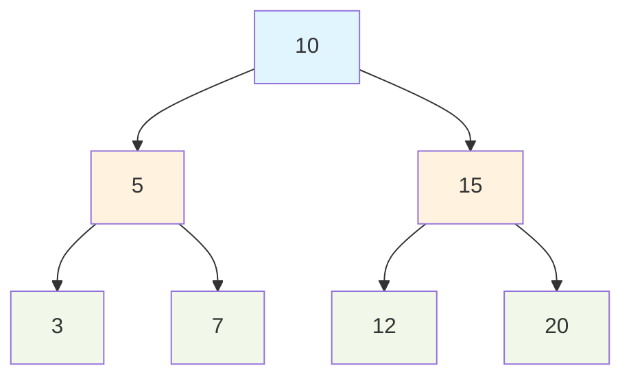

**Χαρακτηριστικά**:
- Ρίζα: 10
- Φύλλα: 3, 7, 12, 20
- Ύψος: 2
- Εσωτερικοί κόμβοι: 10, 5, 15

---

## Διάσχιση (Traversal)

Η διάσχιση είναι η συστηματική επίσκεψη όλων των κόμβων ενός δέντρου. Υπάρχουν **τέσσερις βασικές μέθοδοι**.

### 1. Προ-διάταξη (Pre-order): Ρίζα → Αριστερά → Δεξιά

**Αλγόριθμος**:
1. Επισκέπτομαι τη ρίζα
2. Διασχίζω το αριστερό υποδέντρο
3. Διασχίζω το δεξί υποδέντρο

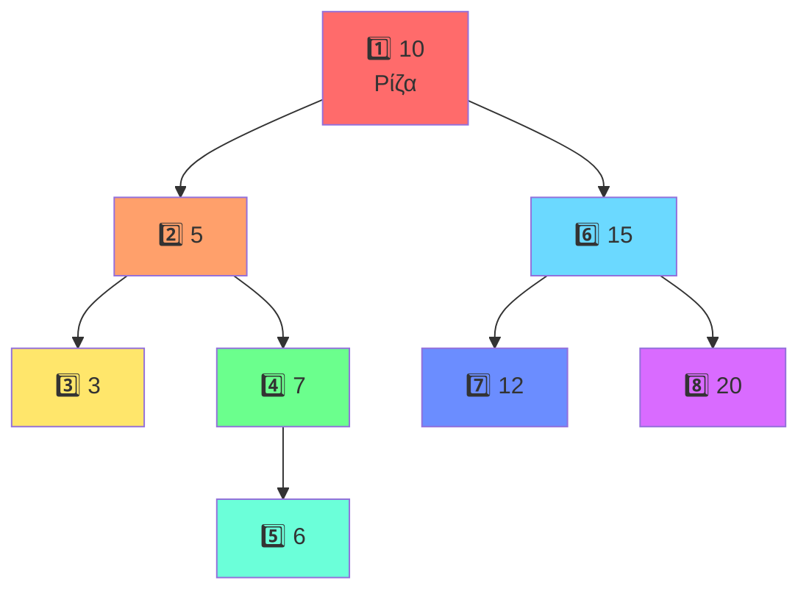

**Αποτέλεσμα Διάσχισης**: 10, 5, 3, 7, 6, 15, 12, 20

**Χρήση**: Δημιουργία αντιγράφου δέντρου, υπολογισμός παράστασης prefix

---

### 2. Εν-διάταξη (In-order): Αριστερά → Ρίζα → Δεξιά

**Αλγόριθμος**:
1. Διασχίζω το αριστερό υποδέντρο
2. Επισκέπτομαι τη ρίζα
3. Διασχίζω το δεξί υποδέντρο

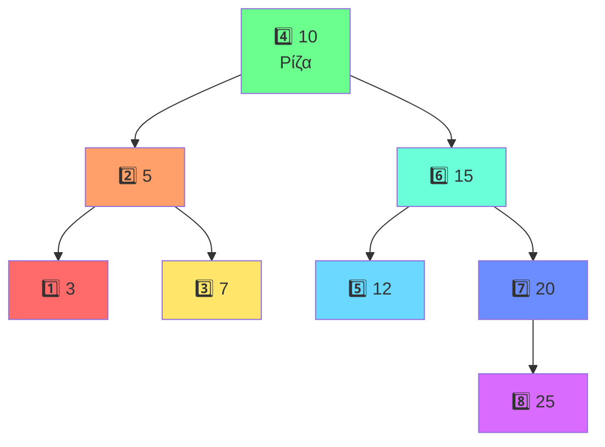

**Αποτέλεσμα Διάσχισης**: 3, 5, 7, 10, 12, 15, 20, 25

💡 **Σημαντικό**: Στα **Δυαδικά Δέντρα Αναζήτησης (BST)**, η in-order διάσχιση επιστρέφει τα στοιχεία σε **αύξουσα ταξινομημένη σειρά**!

**Χρήση**: Ταξινόμηση στοιχείων BST, υπολογισμός παράστασης infix

---

### 3. Μετα-διάταξη (Post-order): Αριστερά → Δεξιά → Ρίζα

**Αλγόριθμος**:
1. Διασχίζω το αριστερό υποδέντρο
2. Διασχίζω το δεξί υποδέντρο
3. Επισκέπτομαι τη ρίζα

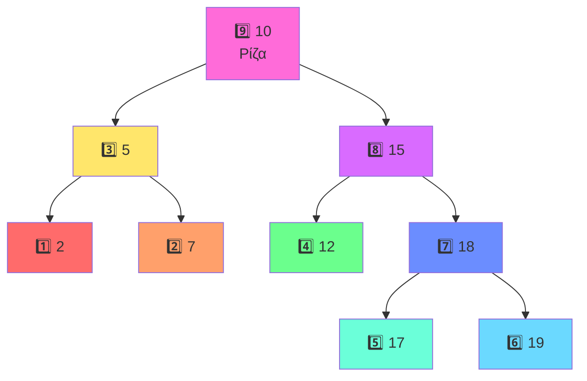

**Αποτέλεσμα Διάσχισης**: 2, 7, 5, 12, 17, 19, 18, 15, 10

**Χρήση**: Διαγραφή δέντρου, υπολογισμός παράστασης postfix

---

### 4. Κατά Επίπεδα (Level-order / BFS)

**Αλγόριθμος**:
Επισκεπτόμαστε όλους τους κόμβους **επίπεδο-προς-επίπεδο**, από αριστερά προς τα δεξιά.

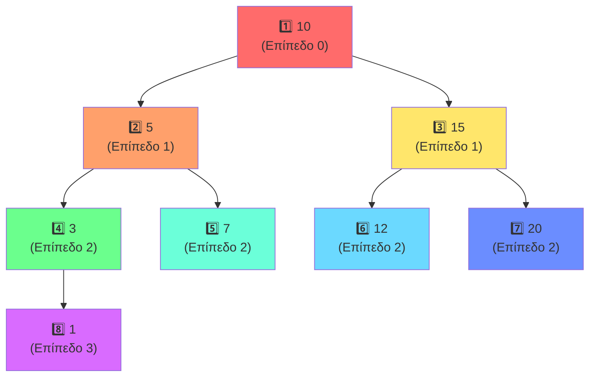

**Αποτέλεσμα Διάσχισης**: 10, 5, 15, 3, 7, 12, 20, 1

**Χρήση**: Εύρεση συντομότερης διαδρομής, εκτύπωση δέντρου κατά επίπεδα

---

### Σύγκριση Μεθόδων Διάσχισης

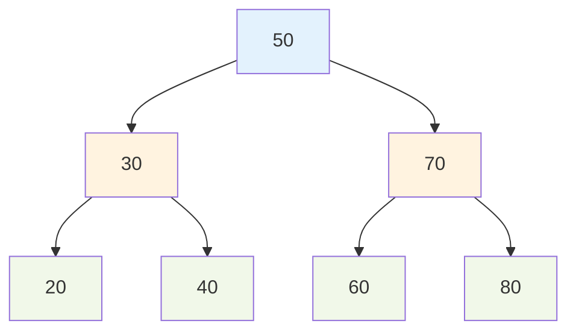

| Μέθοδος | Αποτέλεσμα | Χρήση |
|---------|------------|-------|
| **Pre-order** | 50, 30, 20, 40, 70, 60, 80 | Αντιγραφή δέντρου |
| **In-order** | 20, 30, 40, 50, 60, 70, 80 | Ταξινόμηση (BST) |
| **Post-order** | 20, 40, 30, 60, 80, 70, 50 | Διαγραφή δέντρου |
| **Level-order** | 50, 30, 70, 20, 40, 60, 80 | Αναζήτηση κατά πλάτος |

---

## Εισαγωγή Στοιχείων

### Δυαδικό Δέντρο Αναζήτησης (BST)

**Ιδιότητα BST**: Για κάθε κόμβο:
- Όλα τα στοιχεία στο **αριστερό** υποδέντρο είναι **μικρότερα**
- Όλα τα στοιχεία στο **δεξί** υποδέντρο είναι **μεγαλύτερα**

---

### Παράδειγμα 1: Εισαγωγή σε Κενό Δέντρο

**Εισαγωγή: 8**

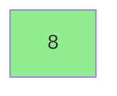

✅ Το πρώτο στοιχείο γίνεται αυτόματα η **ρίζα** του δέντρου.

---

### Παράδειγμα 2: Βηματική Εισαγωγή Πολλαπλών Στοιχείων

**Εισαγωγή Ακολουθίας**: 8, 3, 10, 1, 6, 14, 4

#### Βήμα 1: Εισαγωγή 8
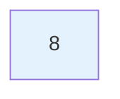

#### Βήμα 2: Εισαγωγή 3
- 3 < 8 → **αριστερά**

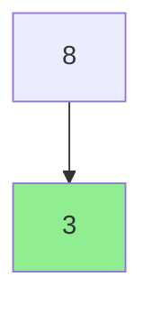

#### Βήμα 3: Εισαγωγή 10
- 10 > 8 → **δεξιά**

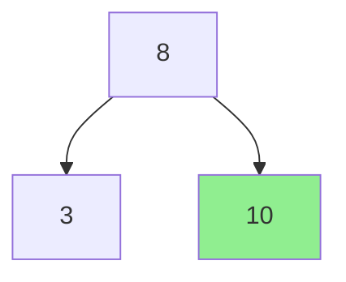

#### Βήμα 4: Εισαγωγή 1
- 1 < 8 → αριστερά
- 1 < 3 → **αριστερά**

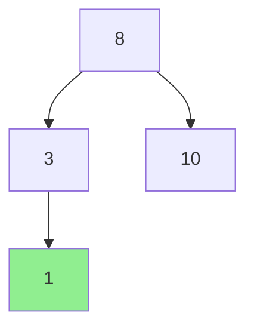

#### Βήμα 5: Εισαγωγή 6
- 6 < 8 → αριστερά
- 6 > 3 → **δεξιά**

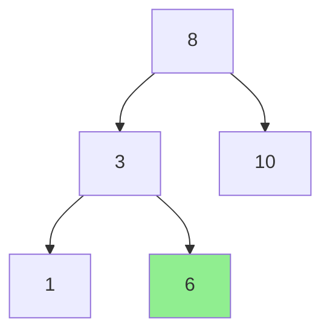

#### Βήμα 6: Εισαγωγή 14
- 14 > 8 → δεξιά
- 14 > 10 → **δεξιά**

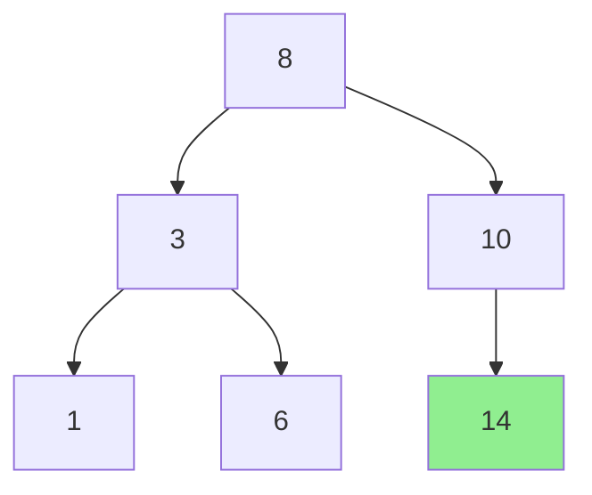

#### Βήμα 7: Εισαγωγή 4
- 4 < 8 → αριστερά
- 4 > 3 → δεξιά
- 4 < 6 → **αριστερά**

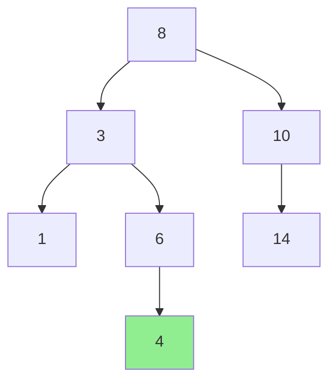

**Τελικό Δέντρο**:
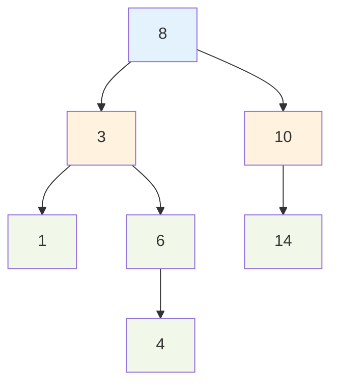

---

### Παράδειγμα 3: Διαφορετική Σειρά Εισαγωγής

**Εισαγωγή Ακολουθίας**: 15, 10, 20, 8, 12, 25, 6

#### Πλήρης Διαδικασία:

**Διαδρομές**:
- **15**: Ρίζα (κενό δέντρο)
- **10**: 10 < 15 → αριστερά
- **20**: 20 > 15 → δεξιά
- **8**: 8 < 15 → αριστερά, 8 < 10 → αριστερά
- **12**: 12 < 15 → αριστερά, 12 > 10 → δεξιά
- **25**: 25 > 15 → δεξιά, 25 > 20 → δεξιά
- **6**: 6 < 15 → αριστερά, 6 < 10 → αριστερά, 6 < 8 → αριστερά

**Τελικό Δέντρο**:
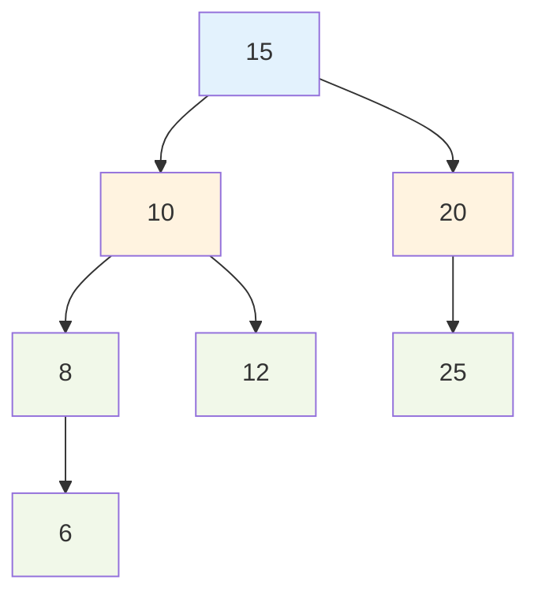

---

### Παράδειγμα 4: Περίπτωση Μη Ισορροπημένου Δέντρου

**Εισαγωγή Αυξητικής Ακολουθίας**: 1, 2, 3, 4, 5, 6

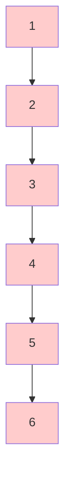

⚠️ **Πρόβλημα**: Το δέντρο εκφυλίζεται σε **γραμμική λίστα**!
- Ύψος = n-1 = 5
- Πολυπλοκότητα αναζήτησης: O(n)

---

## Διαγραφή Στοιχείων

Η διαγραφή έχει **τρεις περιπτώσεις** ανάλογα με τα παιδιά του κόμβου.

---

### Περίπτωση 1: Διαγραφή Φύλλου (0 Παιδιά)

**Κανόνας**: Απλά αφαιρούμε τον κόμβο.

**Παράδειγμα: Διαγραφή του 6**

**Πριν**:
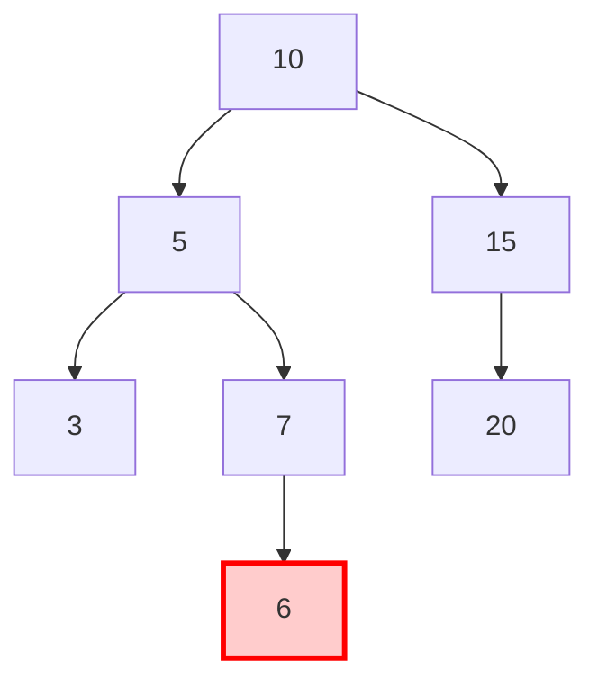

**Μετά**:
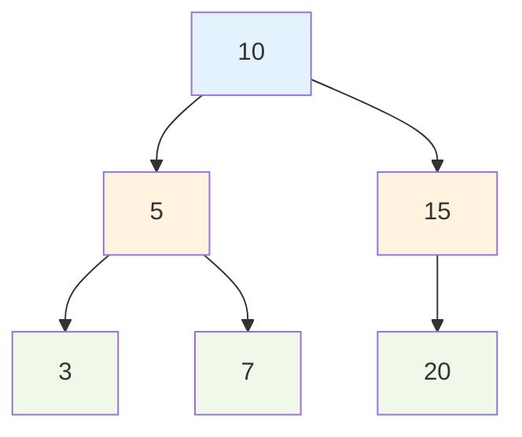

✅ **Απλή διαδικασία**: Διαγράφουμε με την κατάλληλη σύνδεση του γονέα.

---

### Περίπτωση 2: Διαγραφή Κόμβου με 1 Παιδί

**Κανόνας**: Ο κόμβος αντικαθίσταται από το μοναδικό του παιδί.

**Παράδειγμα: Διαγραφή του 5**

**Πριν**:
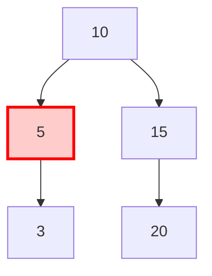

**Μετά**:
```mermaid
graph TD
    A[10] --> D[3]
    A --> C[15]
    C --> F[20]
    
    style A fill:#e3f2fd
    style D fill:#90EE90
    style C fill:#fff3e0
    style F fill:#f1f8e9
```

✅ Το **3 μετακινείται** στη θέση του 5.

---

### Παράδειγμα με Δεξί Παιδί

**Διαγραφή του 15**

**Πριν**:
```mermaid
graph TD
    A[10] --> B[5]
    A --> C[15]
    B --> D[3]
    B --> E[7]
    C --> F[20]
    
    style C fill:#ffcccc
    classDef deleteNode fill:#ffcccc,stroke:#ff0000,stroke-width:3px
    class C deleteNode
```

**Μετά**:
```mermaid
graph TD
    A[10] --> B[5]
    A --> F[20]
    B --> D[3]
    B --> E[7]
    
    style F fill:#90EE90
```

✅ Το **20 μετακινείται** στη θέση του 15.

---

### Περίπτωση 3: Διαγραφή Κόμβου με 2 Παιδιά

**Μέθοδος**: Βρίσκουμε:
- **In-order Successor** = Το μικρότερο στοιχείο στο **δεξί** υποδέντρο, ή
- **In-order Predecessor** = Το μεγαλύτερο στοιχείο στο **αριστερό** υποδέντρο

**Παράδειγμα 1: Διαγραφή του 10**

**Πριν**:
```mermaid
graph TD
    A[10] --> B[5]
    A --> C[15]
    B --> D[3]
    B --> E[7]
    C --> F[12]
    C --> G[20]
    
    style A fill:#ffcccc
    classDef deleteNode fill:#ffcccc,stroke:#ff0000,stroke-width:3px
    class A deleteNode
```

**Βήμα 1: Εύρεση In-order Successor**
- Πάμε **δεξιά** (15)
- Μετά πάμε όσο πιο **αριστερά** γίνεται → **12**

```mermaid
graph TD
    A[10] --> B[5]
    A --> C[15]
    B --> D[3]
    B --> E[7]
    C --> F[12]
    C --> G[20]
    
    style A fill:#ffcccc
    style F fill:#90EE90
    classDef deleteNode fill:#ffcccc,stroke:#ff0000,stroke-width:3px
    classDef successor fill:#90EE90,stroke:#00ff00,stroke-width:3px
    class A deleteNode
    class F successor
```

**Βήμα 2: Αντικατάσταση**

```mermaid
graph TD
    A[12] --> B[5]
    A --> C[15]
    B --> D[3]
    B --> E[7]
    C --> G[20]
    
    style A fill:#90EE90
```

✅ Το **12 αντικαθιστά** το 10!

---

### Παράδειγμα 2: Διαγραφή Ρίζας Περίπλοκου Δέντρου

**Διαγραφή του 50**

**Πριν**:
```mermaid
graph TD
    A[50] --> B[30]
    A --> C[70]
    B --> D[20]
    B --> E[40]
    C --> F[60]
    C --> G[80]
    E --> EA[35]
    E --> EB[45]
    F --> FA[55]
    F --> FB[65]
    
    style A fill:#ffcccc
    classDef deleteNode fill:#ffcccc,stroke:#ff0000,stroke-width:3px
    class A deleteNode
```

**Εύρεση In-order Successor**:
- Δεξί υποδέντρο: 70
- Πιο αριστερά: 60 → 55 ✅

**Μετά (Αντικατάσταση με 55)**:
```mermaid
graph TD
    A[55] --> B[30]
    A --> C[70]
    B --> D[20]
    B --> E[40]
    C --> F[60]
    C --> G[80]
    E --> EA[35]
    E --> EB[45]
    F --> FB[65]
    
    style A fill:#90EE90
```

---

### Παράδειγμα 3: Χρήση In-order Predecessor

**Διαγραφή του 20 (με predecessor)**

**Πριν**:
```mermaid
graph TD
    A[20] --> B[10]
    A --> C[30]
    B --> D[5]
    B --> E[15]
    E --> EA[12]
    E --> EB[18]
    
    style A fill:#ffcccc
```

**Εύρεση In-order Predecessor**:
- Αριστερό υποδέντρο: 10
- Πιο δεξιά: 15 → 18 ✅

**Μετά**:
```mermaid
graph TD
    A[18] --> B[10]
    A --> C[30]
    B --> D[5]
    B --> E[15]
    E --> EA[12]
    
    style A fill:#90EE90
```

---

## Πρακτικά Παραδείγματα

### Παράδειγμα 5: Πλήρης Κύκλος (Εισαγωγή → Διάσχιση → Διαγραφή)

**Εισαγωγή**: 50, 30, 70, 20, 40, 60, 80

**Δέντρο**:
```mermaid
graph TD
    A[50] --> B[30]
    A --> C[70]
    B --> D[20]
    B --> E[40]
    C --> F[60]
    C --> G[80]
    
    style A fill:#e3f2fd
    style B fill:#fff3e0
    style C fill:#fff3e0
    style D fill:#f1f8e9
    style E fill:#f1f8e9
    style F fill:#f1f8e9
    style G fill:#f1f8e9
```

**Διασχίσεις**:
- **Pre-order**: 50, 30, 20, 40, 70, 60, 80
- **In-order**: 20, 30, 40, 50, 60, 70, 80 ✅ (ταξινομημένη)
- **Post-order**: 20, 40, 30, 60, 80, 70, 50
- **Level-order**: 50, 30, 70, 20, 40, 60, 80

**Διαγραφή 30**:
```mermaid
graph TD
    A[50] --> B[40]
    A --> C[70]
    B --> D[20]
    C --> F[60]
    C --> G[80]
    
    style B fill:#90EE90
```

---

### Παράδειγμα 6: Αναζήτηση Στοιχείου

**Αναζήτηση του 65** στο δέντρο:

```mermaid
graph TD
    A[50] --> B[30]
    A --> C[70]
    B --> D[20]
    B --> E[40]
    C --> F[60]
    C --> G[80]
    F --> FA[55]
    F --> FB[65]
    
    style A fill:#ffffcc
    style C fill:#ffffcc
    style F fill:#ffffcc
    style FB fill:#90EE90
```

**Διαδρομή Αναζήτησης**:
1. Ξεκινάω από ρίζα: **50**
   - 65 > 50 → πάω **δεξιά**
2. Επισκέπτομαι: **70**
   - 65 < 70 → πάω **αριστερά**
3. Επισκέπτομαι: **60**
   - 65 > 60 → πάω **δεξιά**
4. Επισκέπτομαι: **65**
   - **Βρέθηκε!** ✅

**Συνολικές Συγκρίσεις**: 4

---

### Παράδειγμα 7: Ισορροπημένο vs Μη Ισορροπημένο

#### Μη Ισορροπημένο (Worst Case)

**Εισαγωγή**: 1, 2, 3, 4, 5

```mermaid
graph TD
    A[1] --> B[2]
    B --> C[3]
    C --> D[4]
    D --> E[5]
    
    style A fill:#ffcccc
    style B fill:#ffcccc
    style C fill:#ffcccc
    style D fill:#ffcccc
    style E fill:#ffcccc
```

- **Ύψος**: 4
- **Πολυπλοκότητα**: O(n)
- **Πρόβλημα**: Εκφυλισμένο δέντρο

#### Ισορροπημένο (Best Case)

**Εισαγωγή**: 3, 1, 5, 2, 4

```mermaid
graph TD
    A[3] --> B[1]
    A --> C[5]
    B --> D[2]
    C --> E[4]
    
    style A fill:#90EE90
    style B fill:#90EE90
    style C fill:#90EE90
    style D fill:#90EE90
    style E fill:#90EE90
```

- **Ύψος**: 2
- **Πολυπλοκότητα**: O(log n)
- **Βέλτιστο**: Ισορροπημένο δέντρο

---

### Παράδειγμα 8: Διαδοχικές Πράξεις

**Αρχικό Δέντρο**:
```mermaid
graph TD
    A[20] --> B[10]
    A --> C[30]
    B --> D[5]
    B --> E[15]
    C --> F[25]
    C --> G[35]
```

**1. Διαγραφή του 10**:
```mermaid
graph TD
    A[20] --> B[15]
    A --> C[30]
    B --> D[5]
    C --> F[25]
    C --> G[35]
    
    style B fill:#90EE90
```

**2. Εισαγωγή του 12**:
```mermaid
graph TD
    A[20] --> B[15]
    A --> C[30]
    B --> D[5]
    D --> E[12]
    C --> F[25]
    C --> G[35]
    
    style E fill:#90EE90
```

**3. Διαγραφή του 20**:
```mermaid
graph TD
    A[25] --> B[15]
    A --> C[30]
    B --> D[5]
    D --> E[12]
    C --> G[35]
    
    style A fill:#90EE90
```

---

### Παράδειγμα 9: Μεγάλο Δέντρο με Πολλαπλές Διαγραφές

**Αρχικό**:
```mermaid
graph TD
    A[40] --> B[20]
    A --> C[60]
    B --> D[10]
    B --> E[30]
    C --> F[50]
    C --> G[70]
    D --> H[5]
    D --> I[15]
    E --> J[25]
    E --> K[35]
    
    style A fill:#e3f2fd
```

**Διαγραφή: 20, 60, 10**

**Μετά Διαγραφή 20** (αντικατάσταση με 25):
```mermaid
graph TD
    A[40] --> B[25]
    A --> C[60]
    B --> D[10]
    B --> E[30]
    C --> F[50]
    C --> G[70]
    D --> H[5]
    D --> I[15]
    E --> K[35]
```

**Μετά Διαγραφή 60** (αντικατάσταση με 70):
```mermaid
graph TD
    A[40] --> B[25]
    A --> C[70]
    B --> D[10]
    B --> E[30]
    C --> F[50]
    D --> H[5]
    D --> I[15]
    E --> K[35]
```

**Μετά Διαγραφή 10** (αντικατάσταση με 15):
```mermaid
graph TD
    A[40] --> B[25]
    A --> C[70]
    B --> D[15]
    B --> E[30]
    C --> F[50]
    D --> H[5]
    E --> K[35]
    
    style A fill:#e3f2fd
```

---

## Σύνοψη

### Πολυπλοκότητα Λειτουργιών

| Λειτουργία | Μέση Περίπτωση | Χειρότερη Περίπτωση |
|------------|----------------|---------------------|
| **Αναζήτηση** | O(log n) | O(n) |
| **Εισαγωγή** | O(log n) | O(n) |
| **Διαγραφή** | O(log n) | O(n) |
| **Διάσχιση** | O(n) | O(n) |

### Βασικοί Κανόνες BST

 **Αριστερό υποδέντρο**: Όλες οι τιμές **< ρίζα**  
 **Δεξί υποδέντρο**: Όλες οι τιμές **> ρίζα**  
 **In-order διάσχιση**: Δίνει **ταξινομημένη σειρά**  
 **Ισορροπία**: Κρίσιμη για απόδοση **O(log n)**

### Μέθοδοι Διάσχισης - Χρήσεις

| Μέθοδος | Σειρά | Χρήση |
|---------|-------|-------|
| **Pre-order** | Root → Left → Right | Αντιγραφή δέντρου |
| **In-order** | Left → Root → Right | Ταξινόμηση |
| **Post-order** | Left → Right → Root | Διαγραφή δέντρου |
| **Level-order** | Επίπεδο-προς-επίπεδο | BFS, εκτύπωση |

### Περιπτώσεις Διαγραφής

| Παιδιά | Μέθοδος |
|--------|---------|
| **0** | Απλή αφαίρεση |
| **1** | Αντικατάσταση με το παιδί |
| **2** | In-order successor/predecessor |
