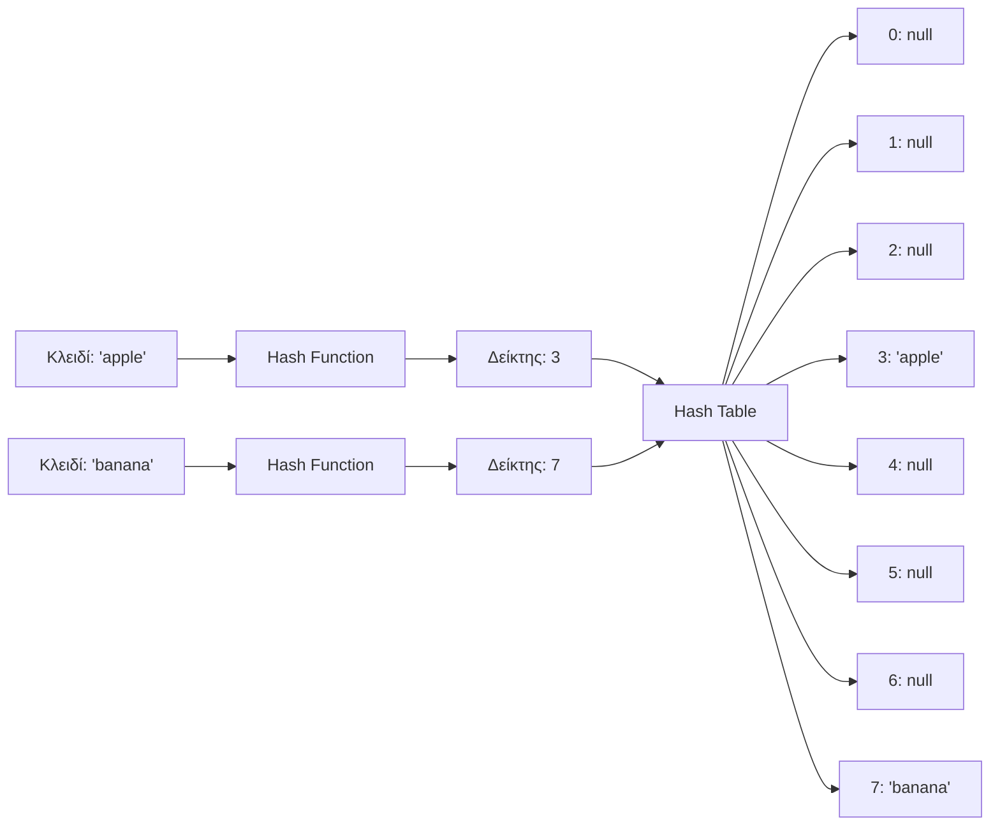
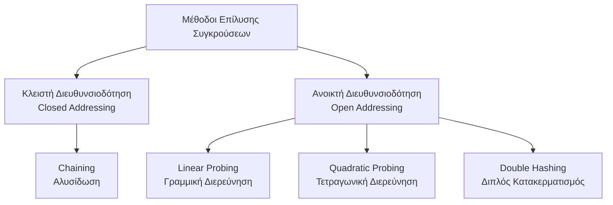
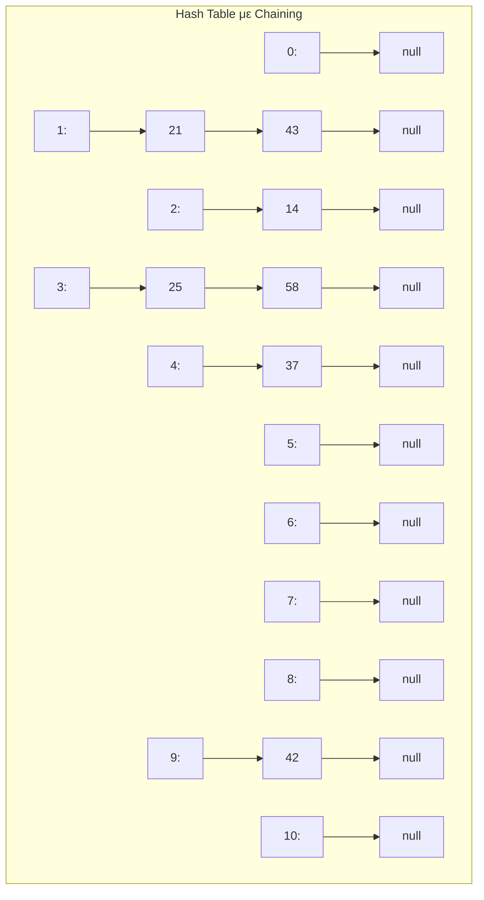
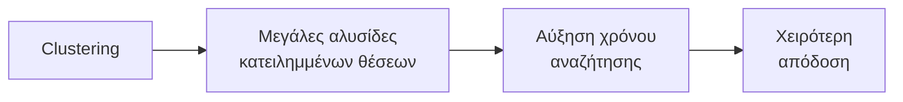
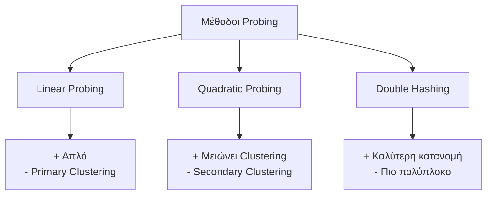

# Κατακερματισμός (Hashing)

## Περιεχόμενα
1. [Εισαγωγή](#εισαγωγή)
2. [Συναρτήσεις Κατακερματισμού](#συναρτήσεις-κατακερματισμού)
3. [Συγκρούσεις και Επίλυση](#συγκρούσεις-και-επίλυση)
4. [Ανοικτή Διευθυνσιοδότηση](#ανοικτή-διευθυνσιοδότηση)
5. [Κλειστή Διευθυνσιοδότηση](#κλειστή-διευθυνσιοδότηση)
6. [Πολυπλοκότητα](#πολυπλοκότητα)
7. [Παραδείγματα](#παραδείγματα)

---

## Εισαγωγή

Ο **κατακερματισμός (hashing)** είναι μια τεχνική για την αποθήκευση και ανάκτηση δεδομένων σε σταθερό χρόνο O(1) κατά μέσο όρο.

### Βασικές Έννοιες

- **Hash Table (Πίνακας Κατακερματισμού)**: Δομή δεδομένων που αποθηκεύει ζεύγη κλειδιού-τιμής
- **Hash Function (Συνάρτηση Κατακερματισμού)**: Μετατρέπει κλειδιά σε δείκτες πίνακα
- **Collision (Σύγκρουση)**: Όταν δύο κλειδιά αντιστοιχούν στον ίδιο δείκτη
- **Load Factor (Συντελεστής Φόρτωσης)**: α = n/m όπου n = αριθμός στοιχείων, m = μέγεθος πίνακα

### Οπτικοποίηση Hash Table



---

## Συναρτήσεις Κατακερματισμού

### 1. Μέθοδος Διαίρεσης (Division Method)

**Τύπος**: `h(k) = k mod m`

Όπου:
- `k` = κλειδί
- `m` = μέγεθος πίνακα (συνήθως πρώτος αριθμός)

**Παράδειγμα**:
```
m = 11 (μέγεθος πίνακα)

h(25) = 25 mod 11 = 3
h(37) = 37 mod 11 = 4
h(42) = 42 mod 11 = 9
h(58) = 58 mod 11 = 3  ← Σύγκρουση με 25!
```

### 2. Μέθοδος Πολλαπλασιασμού (Multiplication Method)

**Τύπος**: `h(k) = ⌊m × (k × A mod 1)⌋`

Όπου:
- `A` = σταθερά (0 < A < 1), συχνά A ≈ 0.6180339887 (χρυσή τομή)
- `k × A mod 1` = κλασματικό μέρος του k × A

**Παράδειγμα**:
```
m = 8, A = 0.618

h(123) = ⌊8 × (123 × 0.618 mod 1)⌋
       = ⌊8 × (76.014 mod 1)⌋
       = ⌊8 × 0.014⌋
       = ⌊0.112⌋ = 0
```

### 3. Universal Hashing

**Τύπος**: `h(k) = ((a × k + b) mod p) mod m`

Όπου:
- `p` = μεγάλος πρώτος αριθμός
- `a`, `b` = τυχαίες σταθερές

**Παράδειγμα**:
```
m = 10, p = 17, a = 3, b = 5

h(8) = ((3 × 8 + 5) mod 17) mod 10
     = ((24 + 5) mod 17) mod 10
     = (29 mod 17) mod 10
     = 12 mod 10 = 2
```

### 4. Hashing για Strings

**Πολυωνυμική Μέθοδος**:

`h(s) = (s[0] × p^(n-1) + s[1] × p^(n-2) + ... + s[n-1]) mod m`

**Παράδειγμα**:
```cpp
#include <string>

long long hashString(std::string s, int m = 101, int p = 31) {
    long long hash_value = 0;
    for (char c : s) {
        hash_value = (hash_value * p + c) % m;
    }
    return hash_value;
}

// Παράδειγμα
// h("cat") = (99×31² + 97×31 + 116) mod 101
//          = (95019 + 3007 + 116) mod 101
//          = 98142 mod 101 = 40
```

---

## Συγκρούσεις και Επίλυση

### Τι είναι Σύγκρουση;

Όταν `h(k₁) = h(k₂)` αλλά `k₁ ≠ k₂`

### Μέθοδοι Επίλυσης



---

## Κλειστή Διευθυνσιοδότηση (Chaining)

### Αρχή Λειτουργίας

Κάθε θέση του πίνακα περιέχει λίστα (linked list) με όλα τα στοιχεία που κατακερματίζονται εκεί.

### Οπτικοποίηση



### Παράδειγμα 1: Εισαγωγή Στοιχείων

**Δεδομένα**: Εισαγωγή των αριθμών [25, 37, 42, 58, 14, 21, 43] σε πίνακα μεγέθους m=11

```
Βήμα 1: h(25) = 25 mod 11 = 3
┌───┬────┐
│ 0 │    │
│ 1 │    │
│ 2 │    │
│ 3 │ 25 │
│ 4 │    │
└───┴────┘

Βήμα 2: h(37) = 37 mod 11 = 4
┌───┬────┐
│ 3 │ 25 │
│ 4 │ 37 │
└───┴────┘

Βήμα 3: h(42) = 42 mod 11 = 9
┌───┬────┐
│ 3 │ 25 │
│ 4 │ 37 │
│ 9 │ 42 │
└───┴────┘

Βήμα 4: h(58) = 58 mod 11 = 3 ← Σύγκρουση!
┌───┬─────────┐
│ 3 │ 25 → 58 │
│ 4 │ 37      │
│ 9 │ 42      │
└───┴─────────┘

Βήμα 5-7: Συνέχεια...
┌────┬──────────────┐
│ 1  │ 21 → 43      │
│ 2  │ 14           │
│ 3  │ 25 → 58      │
│ 4  │ 37           │
│ 9  │ 42           │
└────┴──────────────┘
```

### Υλοποίηση σε C++

```cpp
#include <iostream>
#include <vector>
#include <list>
#include <string>

template <typename K, typename V>
class HashTableChaining {
private:
    struct Node {
        K key;
        V value;
        Node(K k, V v) : key(k), value(v) {}
    };

    int size;
    std::vector<std::list<Node>> table;
    int count;

    int hashFunction(K key) {
        return (int)(key % size);
    }

public:
    HashTableChaining(int s = 11) : size(s), table(s), count(0) {}

    void insert(K key, V value) {
        int index = hashFunction(key);
        for (auto& node : table[index]) {
            if (node.key == key) {
                node.value = value;
                return;
            }
        }
        table[index].emplace_back(key, value);
        count++;
    }

    V* search(K key) {
        int index = hashFunction(key);
        for (auto& node : table[index]) {
            if (node.key == key) return &node.value;
        }
        return nullptr;
    }

    bool remove(K key) {
        int index = hashFunction(key);
        auto& chain = table[index];
        for (auto it = chain.begin(); it != chain.end(); ++it) {
            if (it->key == key) {
                chain.erase(it);
                count--;
                return true;
            }
        }
        return false;
    }

    void display() {
        for (int i = 0; i < size; ++i) {
            std::cout << i << ": ";
            for (const auto& node : table[i]) {
                std::cout << "(" << node.key << ", " << node.value << ") -> ";
            }
            std::cout << "nullptr" << std::endl;
        }
    }
};
```

### Παράδειγμα Χρήσης

```cpp
int main() {
    // Δημιουργία hash table
    HashTableChaining<int, std::string> ht(11);

    // Εισαγωγή στοιχείων
    std::vector<int> elements = {25, 37, 42, 58, 14, 21, 43};
    for (int num : elements) {
        ht.insert(num, "Τιμή_" + std::to_string(num));
    }

    // Εμφάνιση
    ht.display();

    // Αναζήτηση
    std::string* val = ht.search(58);
    if (val) std::cout << "\nΑναζήτηση 58: " << *val << std::endl;
    else std::cout << "\nΑναζήτηση 58: Δεν βρέθηκε" << std::endl;

    // Διαγραφή
    ht.remove(42);
    std::cout << "\nΜετά τη διαγραφή του 42:" << std::endl;
    ht.display();
    
    return 0;
}
```

**Έξοδος**:
```
0: None
1: (43, Τιμή_43) -> (21, Τιμή_21) -> None
2: (14, Τιμή_14) -> None
3: (58, Τιμή_58) -> (25, Τιμή_25) -> None
4: (37, Τιμή_37) -> None
5: None
6: None
7: None
8: None
9: (42, Τιμή_42) -> None
10: None

Αναζήτηση 58: Τιμή_58
Αναζήτηση 100: None

Μετά τη διαγραφή του 42:
9: None
```

---

## Ανοικτή Διευθυνσιοδότηση (Open Addressing)

### Αρχή Λειτουργίας

Όλα τα στοιχεία αποθηκεύονται **μέσα στον πίνακα**. Σε περίπτωση σύγκρουσης, αναζητούμε την επόμενη διαθέσιμη θέση.

### 1. Linear Probing (Γραμμική Διερεύνηση)

**Τύπος**: `h(k, i) = (h'(k) + i) mod m`

Όπου:
- `h'(k)` = αρχική συνάρτηση hash
- `i` = αριθμός προσπάθειας (0, 1, 2, ...)

### Παράδειγμα Linear Probing

**Δεδομένα**: Εισαγωγή [25, 37, 42, 58, 14, 26] σε πίνακα μεγέθους m=11

```
Βήμα 1: h(25, 0) = 25 mod 11 = 3
┌───┬────┐
│ 3 │ 25 │
└───┴────┘

Βήμα 2: h(37, 0) = 37 mod 11 = 4
┌───┬────┐
│ 3 │ 25 │
│ 4 │ 37 │
└───┴────┘

Βήμα 3: h(42, 0) = 42 mod 11 = 9
┌───┬────┐
│ 3 │ 25 │
│ 4 │ 37 │
│ 9 │ 42 │
└───┴────┘

Βήμα 4: h(58, 0) = 58 mod 11 = 3 ← Κατειλημμένο!
        h(58, 1) = (3 + 1) mod 11 = 4 ← Κατειλημμένο!
        h(58, 2) = (3 + 2) mod 11 = 5 ← Ελεύθερο!
┌───┬────┐
│ 3 │ 25 │
│ 4 │ 37 │
│ 5 │ 58 │
│ 9 │ 42 │
└───┴────┘

Βήμα 5: h(14, 0) = 14 mod 11 = 3 ← Κατειλημμένο!
        h(14, 1) = 4 ← Κατειλημμένο!
        h(14, 2) = 5 ← Κατειλημμένο!
        h(14, 3) = 6 ← Ελεύθερο!
┌───┬────┐
│ 3 │ 25 │
│ 4 │ 37 │
│ 5 │ 58 │
│ 6 │ 14 │
│ 9 │ 42 │
└───┴────┘

Βήμα 6: h(26, 0) = 26 mod 11 = 4 ← Κατειλημμένο!
        Συνεχίζουμε: 5, 6, 7 (Ελεύθερο!)
┌───┬────┐
│ 3 │ 25 │
│ 4 │ 37 │
│ 5 │ 58 │
│ 6 │ 14 │
│ 7 │ 26 │
│ 9 │ 42 │
└───┴────┘
```

### Πρόβλημα: Primary Clustering

Δημιουργούνται μεγάλες συνεχόμενες περιοχές κατειλημμένων θέσεων.



### Υλοποίηση Linear Probing

```cpp
#include <iostream>
#include <vector>
#include <string>
#include <optional>

template <typename K, typename V>
class HashTableLinearProbing {
private:
    struct Entry {
        K key;
        V value;
        bool occupied = false;
    };

    int size;
    std::vector<Entry> table;
    int count;

    int hashFunction(K key) {
        return (int)(key % size);
    }

public:
    HashTableLinearProbing(int s = 11) : size(s), table(s), count(0) {}

    void insert(K key, V value) {
        if (count >= size) throw std::runtime_error("Ο πίνακας είναι πλήρης!");

        int index = hashFunction(key);
        int i = 0;

        while (table[(index + i) % size].occupied) {
            if (table[(index + i) % size].key == key) {
                table[(index + i) % size].value = value;
                return;
            }
            i++;
            if (i >= size) break;
        }

        table[(index + i) % size] = {key, value, true};
        count++;
    }

    V* search(K key) {
        int index = hashFunction(key);
        int i = 0;

        while (table[(index + i) % size].occupied) {
            if (table[(index + i) % size].key == key) {
                return &table[(index + i) % size].value;
            }
            i++;
            if (i >= size) break;
        }
        return nullptr;
    }

    void display() {
        for (int i = 0; i < size; ++i) {
            if (table[i].occupied)
                std::cout << i << ": (" << table[i].key << ", " << table[i].value << ")" << std::endl;
            else
                std::cout << i << ": nullptr" << std::endl;
        }
    }
};
```

### 2. Quadratic Probing (Τετραγωνική Διερεύνηση)

**Τύπος**: `h(k, i) = (h'(k) + c₁×i + c₂×i²) mod m`

Συχνά χρησιμοποιούμε: `h(k, i) = (h'(k) + i²) mod m`

### Παράδειγμα Quadratic Probing

**Δεδομένα**: Εισαγωγή [25, 37, 58, 14] σε πίνακα m=11

```
h(25, 0) = (25 + 0²) mod 11 = 3
h(37, 0) = (37 + 0²) mod 11 = 4
h(58, 0) = (58 + 0²) mod 11 = 3 ← Σύγκρουση
h(58, 1) = (3 + 1²) mod 11 = 4 ← Σύγκρουση
h(58, 2) = (3 + 2²) mod 11 = 7 ← Ελεύθερο!
h(14, 0) = (14 + 0²) mod 11 = 3 ← Σύγκρουση
h(14, 1) = (3 + 1²) mod 11 = 4 ← Σύγκρουση
h(14, 2) = (3 + 2²) mod 11 = 7 ← Σύγκρουση
h(14, 3) = (3 + 3²) mod 11 = 1 ← Ελεύθερο!

Τελικός Πίνακας:
┌───┬────┐
│ 1 │ 14 │
│ 3 │ 25 │
│ 4 │ 37 │
│ 7 │ 58 │
└───┴────┘
```

### 3. Double Hashing (Διπλός Κατακερματισμός)

**Τύπος**: `h(k, i) = (h₁(k) + i × h₂(k)) mod m`

Όπου:
- `h₁(k) = k mod m` (πρωταρχική συνάρτηση)
- `h₂(k) = 1 + (k mod (m-1))` (δευτερεύουσα συνάρτηση)

### Παράδειγμα Double Hashing

**Δεδομένα**: m=11, Εισαγωγή [25, 37, 58]

```
h₁(25) = 25 mod 11 = 3
h₂(25) = 1 + (25 mod 10) = 1 + 5 = 6
→ Θέση 3

h₁(37) = 37 mod 11 = 4
h₂(37) = 1 + (37 mod 10) = 1 + 7 = 8
→ Θέση 4

h₁(58) = 58 mod 11 = 3 ← Σύγκρουση
h₂(58) = 1 + (58 mod 10) = 1 + 8 = 9
h(58, 0) = 3
h(58, 1) = (3 + 1×9) mod 11 = 12 mod 11 = 1 ← Ελεύθερο!

Τελικός Πίνακας:
┌───┬────┐
│ 1 │ 58 │
│ 3 │ 25 │
│ 4 │ 37 │
└───┴────┘
```

### Σύγκριση Μεθόδων



---

## Πολυπλοκότητα

### Chaining

| Λειτουργία | Μέση Περίπτωση | Χειρότερη Περίπτωση |
|------------|-----------------|---------------------|
| Εισαγωγή   | O(1)            | O(n)                |
| Αναζήτηση  | O(1 + α)        | O(n)                |
| Διαγραφή   | O(1 + α)        | O(n)                |

Όπου α = n/m (load factor)

### Open Addressing

| Λειτουργία | Μέση Περίπτωση | Χειρότερη Περίπτωση |
|------------|-----------------|---------------------|
| Εισαγωγή   | O(1/(1-α))      | O(n)                |
| Αναζήτηση  | O(1/(1-α))      | O(n)                |
| Διαγραφή   | O(1/(1-α))      | O(n)                |

**Σημείωση**: Για α < 0.7, η απόδοση παραμένει καλή.

### Ανάλυση Load Factor

```
α = 0.5:  Μέσος αριθμός προσπαθειών ≈ 1.5
α = 0.75: Μέσος αριθμός προσπαθειών ≈ 4
α = 0.9:  Μέσος αριθμός προσπαθειών ≈ 10
α ≥ 1:    Απαιτείται rehashing
```

---

## Παραδείγματα Εφαρμογών

### Παράδειγμα 1: Λεξικό Συχνότητας Λέξεων

```cpp
#include <iostream>
#include <string>
#include <unordered_map>
#include <sstream>
#include <algorithm>

std::unordered_map<std::string, int> wordFrequency(std::string text) {
    std::unordered_map<std::string, int> freq;
    std::stringstream ss(text);
    std::string word;
    
    while (ss >> word) {
        // Μετατροπή σε πεζά
        std::transform(word.begin(), word.end(), word.begin(), ::tolower);
        freq[word]++;
    }
    
    return freq;
}

// Χρήση
int main() {
    std::string text = "το βιβλίο είναι καλό το βιβλίο έχει πολλές σελίδες";
    auto result = wordFrequency(text);
    
    for (const auto& pair : result) {
        std::cout << pair.first << ": " << pair.second << std::endl;
    }
    return 0;
}
```

### Παράδειγμα 2: Έλεγχος Διπλότυπων

```cpp
#include <iostream>
#include <vector>
#include <unordered_set>

std::vector<int> findDuplicates(const std::vector<int>& arr) {
    std::unordered_set<int> seen;
    std::unordered_set<int> duplicates;
    
    for (int num : arr) {
        if (seen.count(num)) {
            duplicates.insert(num);
        } else {
            seen.insert(num);
        }
    }
    
    return std::vector<int>(duplicates.begin(), duplicates.end());
}

// Χρήση
int main() {
    std::vector<int> numbers = {1, 2, 3, 2, 4, 5, 3, 6, 7, 5};
    auto dups = findDuplicates(numbers);
    
    for (int n : dups) std::cout << n << " ";
    return 0;
}
```

### Παράδειγμα 3: Two Sum Problem

```cpp
#include <iostream>
#include <vector>
#include <unordered_map>

std::vector<int> twoSum(std::vector<int>& nums, int target) {
    std::unordered_map<int, int> seen;
    
    for (int i = 0; i < nums.size(); i++) {
        int complement = target - nums[i];
        if (seen.count(complement)) {
            return {seen[complement], i};
        }
        seen[nums[i]] = i;
    }
    return {};
}

// Χρήση
int main() {
    std::vector<int> nums = {2, 7, 11, 15};
    int target = 9;
    auto result = twoSum(nums, target);
    if (!result.empty())
        std::cout << "[" << result[0] << ", " << result[1] << "]" << std::endl;
    return 0;
}
```

**Βήμα προς Βήμα**:
```
nums = [2, 7, 11, 15], target = 9

Βήμα 1: num=2, complement=7
  seen = {2: 0}

Βήμα 2: num=7, complement=2
  2 υπάρχει στο seen!
  Επιστροφή: [0, 1]
```

### Παράδειγμα 4: Anagram Detection

```cpp
#include <iostream>
#include <string>
#include <unordered_map>

bool areAnagrams(std::string s1, std::string s2) {
    if (s1.length() != s2.length()) return false;
    
    std::unordered_map<char, int> char_count;
    
    for (char c : s1) char_count[c]++;
    
    for (char c : s2) {
        if (!char_count.count(c)) return false;
        char_count[c]--;
        if (char_count[c] < 0) return false;
    }
    
    for (auto const& [key, val] : char_count) {
        if (val != 0) return false;
    }
    return true;
}

// Χρήση
int main() {
    std::cout << std::boolalpha << areAnagrams("listen", "silent") << std::endl; // true
    std::cout << std::boolalpha << areAnagrams("hello", "world") << std::endl;  // false
    return 0;
}
```

---

## Πρακτική Άσκηση 1: Υλοποίηση Cache

Υλοποιήστε ένα σύστημα cache με LRU (Least Recently Used) eviction policy.

### Λύση

```cpp
#include <iostream>
#include <unordered_map>
#include <list>

class LRUCache {
private:
    struct Node {
        int key, value;
        Node(int k, int v) : key(k), value(v) {}
    };

    int capacity;
    std::list<Node> cacheList;
    std::unordered_map<int, std::list<Node>::iterator> cacheMap;

public:
    LRUCache(int cap) : capacity(cap) {}

    int get(int key) {
        if (cacheMap.find(key) == cacheMap.end()) return -1;
        
        // Μετακίνηση στην αρχή (πρόσφατο)
        cacheList.splice(cacheList.begin(), cacheList, cacheMap[key]);
        return cacheMap[key]->value;
    }

    void put(int key, int value) {
        if (cacheMap.find(key) != cacheMap.end()) {
            cacheList.splice(cacheList.begin(), cacheList, cacheMap[key]);
            cacheMap[key]->value = value;
            return;
        }

        if (cacheList.size() == capacity) {
            int lastKey = cacheList.back().key;
            cacheList.pop_back();
            cacheMap.erase(lastKey);
        }

        cacheList.emplace_front(key, value);
        cacheMap[key] = cacheList.begin();
    }
};

// Χρήση
int main() {
    LRUCache cache(2);
    cache.put(1, 1);
    cache.put(2, 2);
    std::cout << cache.get(1) << std::endl;    // 1
    cache.put(3, 3);                           // Αφαιρεί το 2
    std::cout << cache.get(2) << std::endl;    // -1
    return 0;
}
```

**Οπτικοποίηση**:
```
Capacity = 2

put(1, 1): [1]
put(2, 2): [2, 1]
get(1):    [1, 2] (το 1 μετακινείται μπροστά)
put(3, 3): [3, 1] (το 2 αφαιρείται - LRU)
```

---

## Πρακτική Άσκηση 2: Group Anagrams

Δίνεται λίστα λέξεων. Ομαδοποιήστε τα anagrams μαζί.

### Λύση

```cpp
#include <iostream>
#include <vector>
#include <string>
#include <unordered_map>
#include <algorithm>

std::vector<std::vector<std::string>> groupAnagrams(std::vector<std::string>& words) {
    std::unordered_map<std::string, std::vector<std::string>> groups;
    
    for (const std::string& word : words) {
        std::string sorted_word = word;
        std::sort(sorted_word.begin(), sorted_word.end());
        groups[sorted_word].push_back(word);
    }
    
    std::vector<std::vector<std::string>> result;
    for (auto const& [key, group] : groups) {
        result.push_back(group);
    }
    return result;
}

// Χρήση
int main() {
    std::vector<std::string> words = {"eat", "tea", "tan", "ate", "nat", "bat"};
    auto result = groupAnagrams(words);
    // Εκτύπωση αποτελεσμάτων...
    return 0;
}
```

**Βήμα προς Βήμα**:
```
words = ["eat", "tea", "tan", "ate", "nat", "bat"]

"eat" → sorted: "aet" → {"aet": ["eat"]}
"tea" → sorted: "aet" → {"aet": ["eat", "tea"]}
"tan" → sorted: "ant" → {"aet": [...], "ant": ["tan"]}
"ate" → sorted: "aet" → {"aet": ["eat", "tea", "ate"], ...}
"nat" → sorted: "ant" → {..., "ant": ["tan", "nat"]}
"bat" → sorted: "abt" → {..., "abt": ["bat"]}

Αποτέλεσμα: [["eat", "tea", "ate"], ["tan", "nat"], ["bat"]]
```

---

## Πρακτική Άσκηση 3: Longest Consecutive Sequence

Βρείτε το μήκος της μεγαλύτερης συνεχόμενης ακολουθίας αριθμών.

### Λύση

```cpp
#include <iostream>
#include <vector>
#include <unordered_set>
#include <algorithm>

int longestConsecutive(std::vector<int>& nums) {
    std::unordered_set<int> num_set(nums.begin(), nums.end());
    int max_length = 0;
    
    for (int num : num_set) {
        if (!num_set.count(num - 1)) {
            int current_num = num;
            int current_length = 1;
            
            while (num_set.count(current_num + 1)) {
                current_num++;
                current_length++;
            }
            max_length = std::max(max_length, current_length);
        }
    }
    return max_length;
}

// Χρήση
int main() {
    std::vector<int> nums = {100, 4, 200, 1, 3, 2};
    std::cout << longestConsecutive(nums) << std::endl; // 4
    return 0;
}
```

**Ανάλυση**:
```
nums = [100, 4, 200, 1, 3, 2]
num_set = {100, 4, 200, 1, 3, 2}

Έλεγχος 100: 99 δεν υπάρχει → Αρχή ακολουθίας
  100 → 101 δεν υπάρχει → Μήκος: 1

Έλεγχος 1: 0 δεν υπάρχει → Αρχή ακολουθίας
  1 → 2 → 3 → 4 → 5 δεν υπάρχει → Μήκος: 4 

Έλεγχος 2, 3, 4: 1, 2, 3 υπάρχουν → Όχι αρχή

Μέγιστο: 4
```

---

## Σύνοψη

### Πλεονεκτήματα Hash Tables

- O(1) μέση πολυπλοκότητα για εισαγωγή, αναζήτηση, διαγραφή
- Ευέλικτες και εύκολες στη χρήση
- Ιδανικές για γρήγορη αναζήτηση

### Μειονεκτήματα

- Χειρότερη περίπτωση: O(n)
- Δεν διατηρούν σειρά στοιχείων
- Απαιτούν επιπλέον μνήμη
- Συγκρούσεις μειώνουν απόδοση

### Πότε να Χρησιμοποιούμε

- Γρήγορη αναζήτηση στοιχείων
- Έλεγχος ύπαρξης
- Μέτρηση συχνοτήτων
- Cache implementations
- Ομαδοποίηση δεδομένων

### Σημαντικά Σημεία

1. **Καλή hash function**: Ομοιόμορφη κατανομή
2. **Load factor**: Διατήρηση α < 0.75
3. **Επιλογή μεθόδου**: Chaining vs Open Addressing
4. **Rehashing**: Όταν ο πίνακας γεμίζει


