# Σωροί (Heaps)

## Περιεχόμενα
1. [Εισαγωγή](#εισαγωγή)
2. [Ορισμός και Ιδιότητες](#ορισμός-και-ιδιότητες)
3. [Τύποι Σωρών](#τύποι-σωρών)
4. [Αναπαράσταση με Πίνακα](#αναπαράσταση-με-πίνακα)
5. [Βασικές Λειτουργίες](#βασικές-λειτουργίες)
6. [Παραδείγματα με Λύσεις](#παραδείγματα-με-λύσεις)
7. [Πολυπλοκότητα](#πολυπλοκότητα)

---

## Εισαγωγή

Ο **σωρός (heap)** είναι μια ειδική δενδρική δομή δεδομένων που ικανοποιεί την **ιδιότητα του σωρού**. Χρησιμοποιείται ευρέως σε αλγορίθμους ταξινόμησης (π.χ., Heap Sort) και σε ουρές προτεραιότητας (Priority Queues).

### Χαρακτηριστικά
- Είναι ένα **πλήρες δυαδικό δέντρο** (complete binary tree)
- Κάθε κόμβος ικανοποιεί μια συγκεκριμένη σχέση με τα παιδιά του
- Αποδοτική υλοποίηση με πίνακα

---

## Ορισμός και Ιδιότητες

### Πλήρες Δυαδικό Δέντρο
Ένα δυαδικό δέντρο είναι **πλήρες** όταν:
- Όλα τα επίπεδα είναι πλήρως γεμάτα, εκτός πιθανώς του τελευταίου
- Το τελευταίο επίπεδο γεμίζει από αριστερά προς τα δεξιά

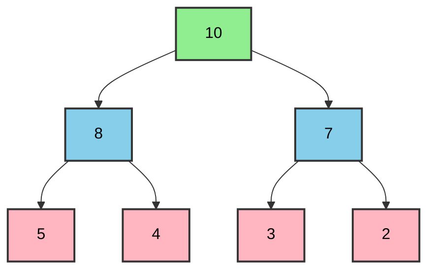

### Ιδιότητα Σωρού
Για κάθε κόμβο `i` (εκτός της ρίζας):
- **Max-Heap**: `parent(i) ≥ i`
- **Min-Heap**: `parent(i) ≤ i`

---

## Τύποι Σωρών

### 1. Max-Heap (Μέγιστος Σωρός)

Η τιμή κάθε κόμβου είναι **μεγαλύτερη ή ίση** από τις τιμές των παιδιών του.

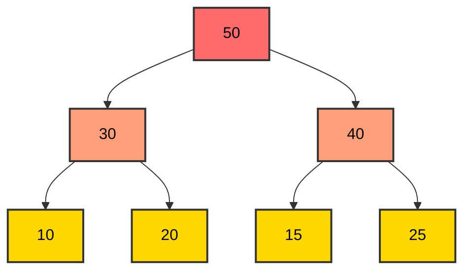

**Παρατηρήσεις:**
- Η ρίζα περιέχει το **μέγιστο** στοιχείο
- Για κάθε κόμβο: `parent ≥ left_child` και `parent ≥ right_child`

### 2. Min-Heap (Ελάχιστος Σωρός)

Η τιμή κάθε κόμβου είναι **μικρότερη ή ίση** από τις τιμές των παιδιών του.

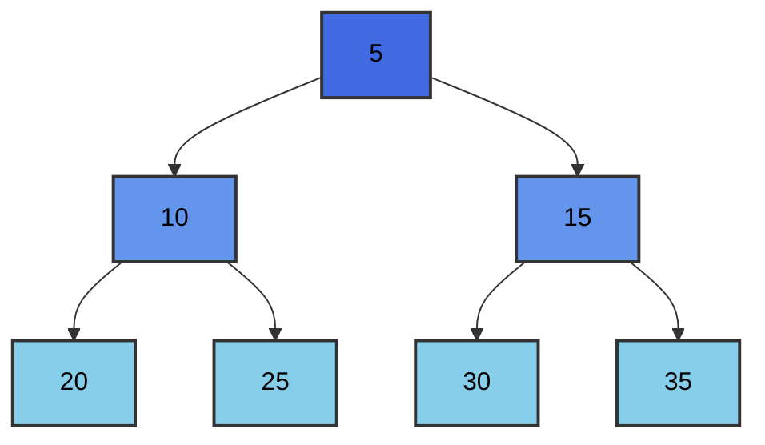

**Παρατηρήσεις:**
- Η ρίζα περιέχει το **ελάχιστο** στοιχείο
- Για κάθε κόμβο: `parent ≤ left_child` και `parent ≤ right_child`

---

## Αναπαράσταση με Πίνακα

### Αντιστοίχιση Δείκτη

Για έναν κόμβο στη θέση `i` (με βάση το 0):
- **Γονέας**: `parent(i) = ⌊(i-1)/2⌋`
- **Αριστερό παιδί**: `left(i) = 2i + 1`
- **Δεξί παιδί**: `right(i) = 2i + 2`

### Παράδειγμα Max-Heap

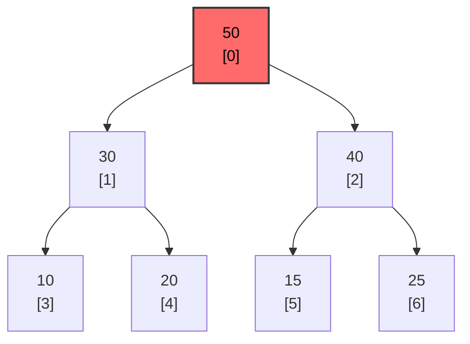

**Αναπαράσταση σε πίνακα:**
```
Index:  0   1   2   3   4   5   6
Value: [50, 30, 40, 10, 20, 15, 25]
```

**Επαλήθευση σχέσεων:**
- `parent(1) = ⌊(1-1)/2⌋ = 0` → 50 (Σωστό)
- `left(0) = 2×0 + 1 = 1` → 30 (Σωστό)
- `right(0) = 2×0 + 2 = 2` → 40 (Σωστό)

---

## Βασικές Λειτουργίες

### 1. Heapify (Αποκατάσταση Ιδιότητας)

Η διαδικασία **heapify** διορθώνει την ιδιότητα του σωρού για έναν υποσωρό.

#### Heapify-Down (Max-Heap)

```cpp
/**
 * Αποκαθιστά την ιδιότητα max-heap για τον κόμβο i.
 * 
 * Args:
 *     arr (std::vector<int>&): Ο πίνακας που αναπαριστά τον σωρό.
 *     n (int): Το μέγεθος του σωρού.
 *     i (int): Ο δείκτης του κόμβου προς επεξεργασία.
 */
void heapifyDown(std::vector<int>& arr, int n, int i) {
    int largest = i;  // Αρχικοποίηση του μεγαλύτερου ως ρίζα
    int left_child = 2 * i + 1;  // Αριστερό παιδί
    int right_child = 2 * i + 2;  // Δεξί παιδί
    
    // Έλεγχος αν το αριστερό παιδί υπάρχει και είναι μεγαλύτερο
    if (left_child < n && arr[left_child] > arr[largest]) {
        largest = left_child;
    }
    
    // Έλεγχος αν το δεξί παιδί υπάρχει και είναι μεγαλύτερο
    if (right_child < n && arr[right_child] > arr[largest]) {
        largest = right_child;
    }
    
    // Αν το μεγαλύτερο δεν είναι η ρίζα
    if (largest != i) {
        std::swap(arr[i], arr[largest]);  // Ανταλλαγή
        heapifyDown(arr, n, largest);  // Αναδρομική κλήση
    }
}
```

### 2. Εισαγωγή Στοιχείου (Insert)

Προσθήκη νέου στοιχείου στον σωρό και αποκατάσταση της ιδιότητας.

```cpp
/**
 * Εισάγει ένα νέο στοιχείο στον max-heap.
 * 
 * Args:
 *     heap (std::vector<int>&): Ο σωρός.
 *     value (int): Η τιμή προς εισαγωγή.
 */
void insertMaxHeap(std::vector<int>& heap, int value) {
    heap.push_back(value);  // Προσθήκη στο τέλος
    int i = heap.size() - 1;  // Δείκτης του νέου στοιχείου
    
    // Heapify-up: ανέβασμα του στοιχείου στη σωστή θέση
    while (i > 0) {
        int parent_index = (i - 1) / 2;
        if (heap[i] > heap[parent_index]) {
            std::swap(heap[i], heap[parent_index]);  // Ανταλλαγή
            i = parent_index;
        } else {
            break;
        }
    }
}
```

### 3. Διαγραφή Μέγιστου/Ελάχιστου (Extract)

Αφαίρεση της ρίζας (μέγιστο/ελάχιστο) και αποκατάσταση του σωρού.

```cpp
/**
 * Αφαιρεί και επιστρέφει το μέγιστο στοιχείο από τον max-heap.
 * 
 * Args:
 *     heap (std::vector<int>&): Ο σωρός.
 * 
 * Returns:
 *     int: Το μέγιστο στοιχείο.
 * 
 * Throws:
 *     std::runtime_error: Αν ο σωρός είναι κενός.
 */
int extractMax(std::vector<int>& heap) {
    if (heap.empty()) {
        throw std::runtime_error("Ο σωρός είναι κενός");
    }
    
    int max_val = heap[0];  // Αποθήκευση του μέγιστου
    
    if (heap.size() == 1) {
        heap.pop_back();
        return max_val;
    }
    
    heap[0] = heap.back();  // Μετακίνηση του τελευταίου στη ρίζα
    heap.pop_back();
    heapifyDown(heap, heap.size(), 0);  // Αποκατάσταση ιδιότητας
    
    return max_val;
}
```

### 4. Build Heap (Κατασκευή Σωρού)

Μετατροπή ενός μη δομημένου πίνακα σε σωρό.

```cpp
/**
 * Μετατρέπει έναν πίνακα σε max-heap.
 * 
 * Args:
 *     arr (std::vector<int>&): Ο πίνακας προς μετατροπή.
 */
void buildMaxHeap(std::vector<int>& arr) {
    int n = arr.size();
    // Ξεκινάμε από τον τελευταίο μη-φύλλο κόμβο
    for (int i = n / 2 - 1; i >= 0; i--) {
        heapifyDown(arr, n, i);
    }
}
```

---

## Παραδείγματα με Λύσεις

### Παράδειγμα 1: Δημιουργία Max-Heap

**Πρόβλημα:** Δημιούργησε max-heap από τον πίνακα `[4, 10, 3, 5, 1]`.

**Λύση Βήμα-Βήμα:**

**Αρχικό Δέντρο:**
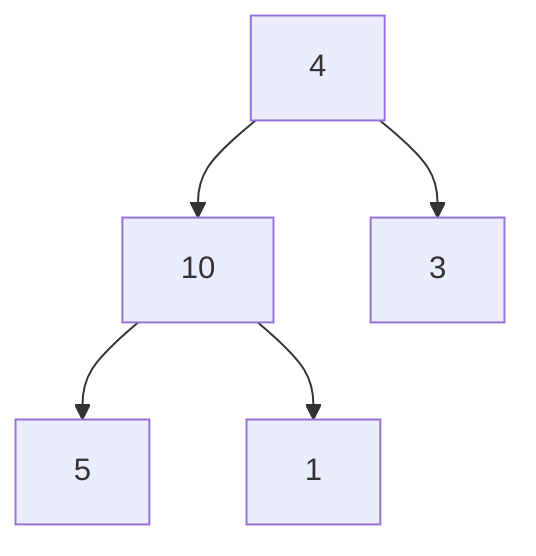

**Βήμα 1:** Heapify από τον κόμβο 1 (τιμή 10)
- `left(1) = 3` → τιμή 5
- `right(1) = 4` → τιμή 1
- `max(10, 5, 1) = 10` → Καμία αλλαγή

**Βήμα 2:** Heapify από τον κόμβο 0 (τιμή 4)
- `left(0) = 1` → τιμή 10
- `right(0) = 2` → τιμή 3
- `max(4, 10, 3) = 10` → Ανταλλαγή 4 ↔ 10

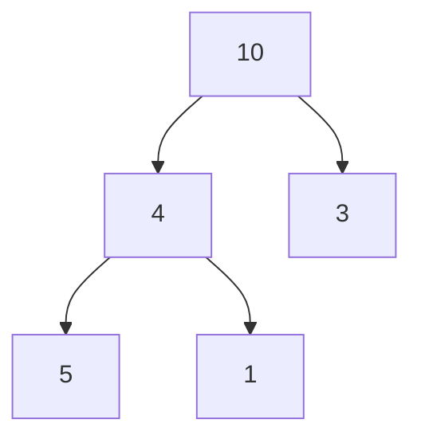

**Βήμα 3:** Heapify από τον κόμβο 1 (τιμή 4 μετά την ανταλλαγή)
- `left(1) = 3` → τιμή 5
- `right(1) = 4` → τιμή 1
- `max(4, 5, 1) = 5` → Ανταλλαγή 4 ↔ 5

**Τελικό Max-Heap:**
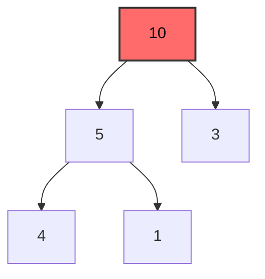

**Πίνακας:** `[10, 5, 3, 4, 1]`

---

### Παράδειγμα 2: Εισαγωγή Στοιχείου σε Max-Heap

**Πρόβλημα:** Εισήγαγε την τιμή `15` στον max-heap `[50, 30, 40, 10, 20, 15, 25]`.

**Αρχικός Σωρός:**
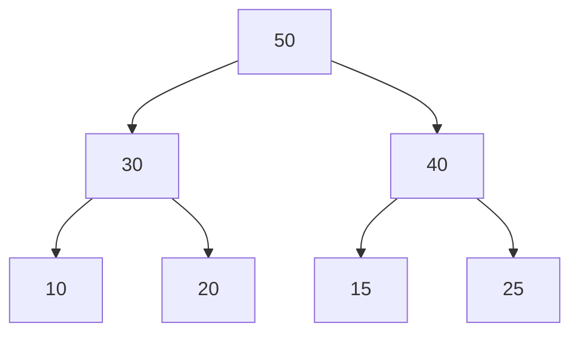

**Βήμα 1:** Προσθήκη του 15 στο τέλος
```
[50, 30, 40, 10, 20, 15, 25, 15]
```

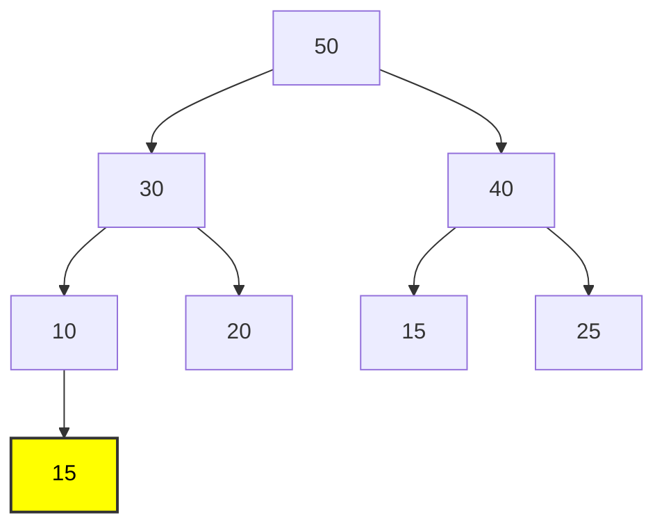

**Βήμα 2:** Heapify-up από θέση 7
- `parent(7) = 3` → τιμή 10
- `15 > 10` → Ανταλλαγή

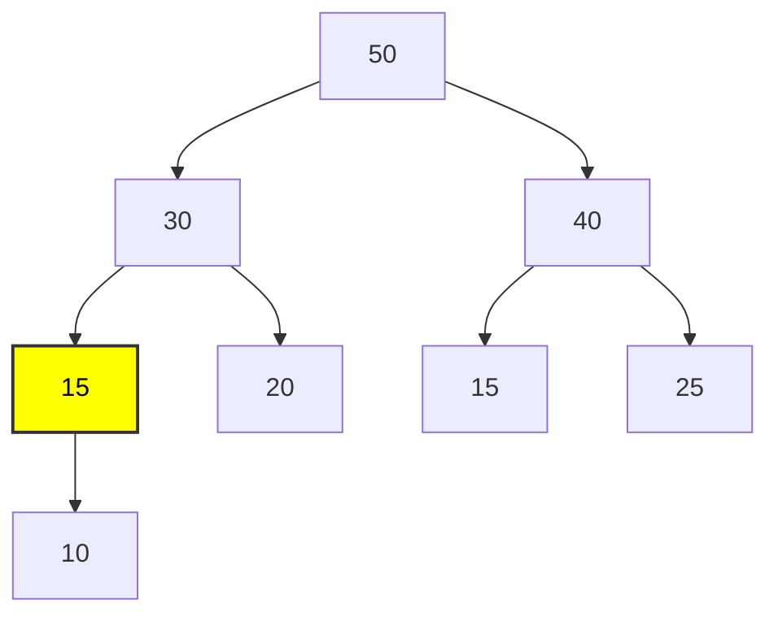

**Βήμα 3:** Heapify-up από θέση 3
- `parent(3) = 1` → τιμή 30
- `15 < 30` → Τέλος

**Τελικός Σωρός:** `[50, 30, 40, 15, 20, 15, 25, 10]`

---

### Παράδειγμα 3: Διαγραφή Μέγιστου από Max-Heap

**Πρόβλημα:** Διέγραψε το μέγιστο από τον σωρό `[50, 30, 40, 10, 20, 15, 25]`.

**Αρχικός Σωρός:**
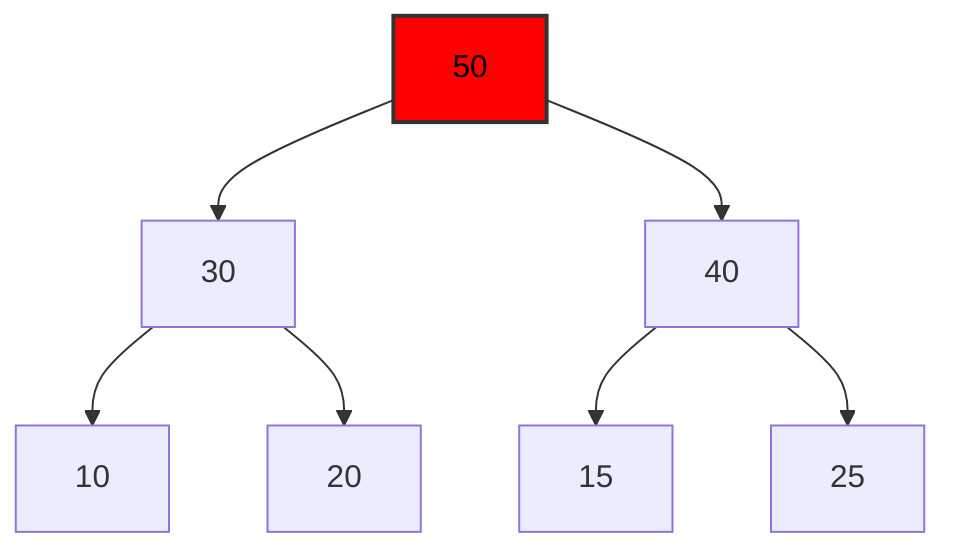

**Βήμα 1:** Αντικατάσταση ρίζας με τελευταίο στοιχείο
```
[25, 30, 40, 10, 20, 15]
```

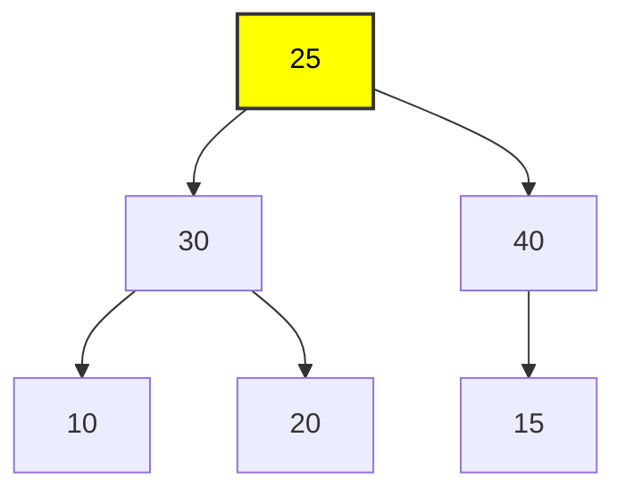

**Βήμα 2:** Heapify-down από ρίζα
- `left(0) = 1` → τιμή 30
- `right(0) = 2` → τιμή 40
- `max(25, 30, 40) = 40` → Ανταλλαγή 25 ↔ 40

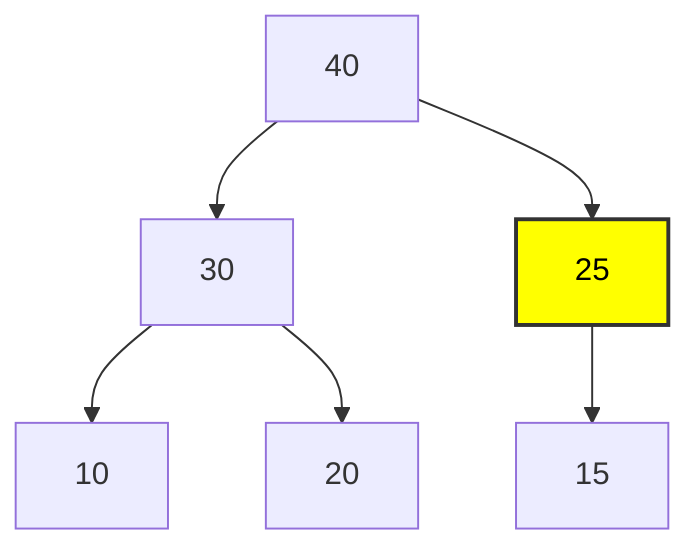

**Βήμα 3:** Heapify-down από θέση 2
- `left(2) = 5` → τιμή 15
- `right(2) = 6` → δεν υπάρχει
- `max(25, 15) = 25` → Τέλος

**Τελικός Σωρός:** `[40, 30, 25, 10, 20, 15]`

---

### Παράδειγμα 4: Δημιουργία Min-Heap

**Πρόβλημα:** Μετέτρεψε τον πίνακα `[20, 15, 8, 10, 5, 7, 6, 2, 9, 1]` σε min-heap.

**Λύση:**

**Βήμα 1:** Ξεκινάμε από τον τελευταίο μη-φύλλο (index = `n//2 - 1 = 4`)

**Αρχικό Δέντρο:**
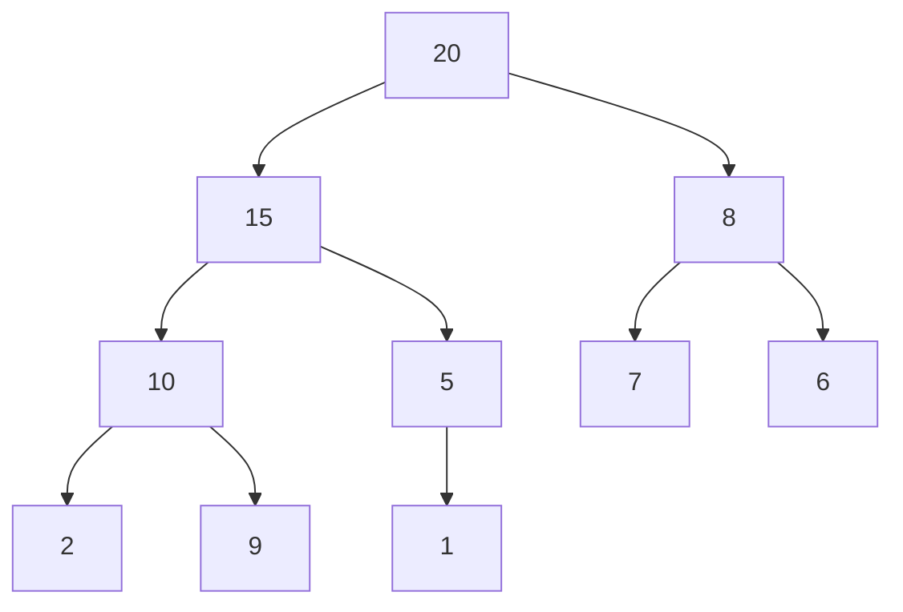

**Βήμα 2:** Heapify από index 4 (τιμή 5)
- `left(4) = 9` → τιμή 1
- `min(5, 1) = 1` → Ανταλλαγή 5 ↔ 1

**Βήμα 3:** Heapify από index 3 (τιμή 10)
- `left(3) = 7` → τιμή 2
- `right(3) = 8` → τιμή 9
- `min(10, 2, 9) = 2` → Ανταλλαγή 10 ↔ 2

**Βήμα 4:** Heapify από index 2 (τιμή 8)
- `left(2) = 5` → τιμή 7
- `right(2) = 6` → τιμή 6
- `min(8, 7, 6) = 6` → Ανταλλαγή 8 ↔ 6

**Βήμα 5:** Heapify από index 1 (τιμή 15)
- `left(1) = 3` → τιμή 2
- `right(1) = 4` → τιμή 1
- `min(15, 2, 1) = 1` → Ανταλλαγή 15 ↔ 1
- Συνεχίζουμε heapify στη θέση 4:
  - `left(4) = 9` → τιμή 5
  - `min(15, 5) = 5` → Ανταλλαγή 15 ↔ 5

**Βήμα 6:** Heapify από index 0 (τιμή 20)
- `left(0) = 1` → τιμή 1
- `right(0) = 2` → τιμή 6
- `min(20, 1, 6) = 1` → Ανταλλαγή 20 ↔ 1
- Συνεχίζουμε από θέση 1:
  - `left(1) = 3` → τιμή 2
  - `right(1) = 4` → τιμή 5
  - `min(20, 2, 5) = 2` → Ανταλλαγή 20 ↔ 2
- Συνεχίζουμε από θέση 3:
  - `left(3) = 7` → τιμή 10
  - `right(3) = 8` → τιμή 9
  - `min(20, 10, 9) = 9` → Ανταλλαγή 20 ↔ 9

**Τελικό Min-Heap:**
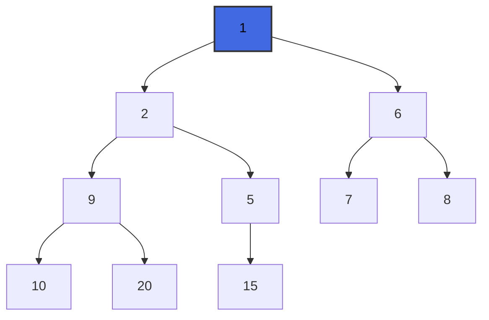

**Πίνακας:** `[1, 2, 6, 9, 5, 7, 8, 10, 20, 15]`

---

### Παράδειγμα 5: Heap Sort

**Πρόβλημα:** Ταξινόμησε τον πίνακα `[12, 11, 13, 5, 6, 7]` χρησιμοποιώντας Heap Sort.

**Αλγόριθμος:**
```cpp
/**
 * Ταξινομεί έναν πίνακα χρησιμοποιώντας Heap Sort.
 * 
 * Args:
 *     arr (std::vector<int>&): Ο πίνακας προς ταξινόμηση.
 */
void heapSort(std::vector<int>& arr) {
    int n = arr.size();
    
    // Βήμα 1: Δημιουργία max-heap
    buildMaxHeap(arr);
    
    // Βήμα 2: Εξαγωγή στοιχείων ένα-ένα
    for (int i = n - 1; i > 0; i--) {
        std::swap(arr[0], arr[i]);  // Ανταλλαγή ρίζας με τελευταίο
        heapifyDown(arr, i, 0);  // Heapify στον μειωμένο σωρό
    }
}
```

**Λύση Βήμα-Βήμα:**

**Βήμα 1:** Build Max-Heap
```
Αρχικός: [12, 11, 13, 5, 6, 7]
Max-Heap: [13, 11, 12, 5, 6, 7]
```

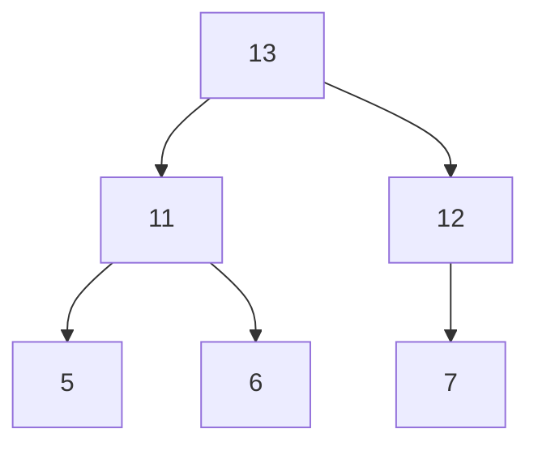

**Βήμα 2:** Ανταλλαγή 13 ↔ 7, Heapify
```
[7, 11, 12, 5, 6 | 13]
Heapify → [12, 11, 7, 5, 6 | 13]
```

**Βήμα 3:** Ανταλλαγή 12 ↔ 6, Heapify
```
[6, 11, 7, 5 | 12, 13]
Heapify → [11, 6, 7, 5 | 12, 13]
```

**Βήμα 4:** Ανταλλαγή 11 ↔ 5, Heapify
```
[5, 6, 7 | 11, 12, 13]
Heapify → [7, 6, 5 | 11, 12, 13]
```

**Βήμα 5:** Ανταλλαγή 7 ↔ 5, Heapify
```
[5, 6 | 7, 11, 12, 13]
Heapify → [6, 5 | 7, 11, 12, 13]
```

**Βήμα 6:** Ανταλλαγή 6 ↔ 5
```
[5 | 6, 7, 11, 12, 13]
```

**Τελικός Ταξινομημένος:** `[5, 6, 7, 11, 12, 13]`

---

## Πολυπλοκότητα

### Χρονική Πολυπλοκότητα

| Λειτουργία | Πολυπλοκότητα | Επεξήγηση |
|------------|---------------|-----------|
| Insert | O(log n) | Heapify-up στο ύψος του δέντρου |
| Extract Max/Min | O(log n) | Heapify-down στο ύψος του δέντρου |
| Heapify | O(log n) | Επεξεργασία ενός μονοπατιού |
| Build Heap | O(n) | Βελτιστοποιημένη κατασκευή |
| Heap Sort | O(n log n) | n εξαγωγές × O(log n) |
| Peek (Find Max/Min) | O(1) | Πρόσβαση στη ρίζα |

### Χωρική Πολυπλοκότητα

- **Αποθήκευση:** O(n) - Πίνακας n στοιχείων
- **Αναδρομή:** O(log n) - Βάθος αναδρομής για heapify

---

## Εφαρμογές Σωρών

### 1. Ουρά Προτεραιότητας (Priority Queue)
```cpp
/**
 * Ουρά προτεραιότητας με χρήση min-heap.
 * 
 * Παρέχει βασικές λειτουργίες διαχείρισης στοιχείων με βάση την προτεραιότητα.
 */
class PriorityQueue {
public:
    /**
     * Εισαγωγή στοιχείου με προτεραιότητα.
     * 
     * Args:
     *     priority (int): Η τιμή προτεραιότητας.
     *     item (std::string): Το αντικείμενο.
     */
    void push(int priority, std::string item) {
        heap_data.push_back({priority, item});
        heapifyUp(heap_data.size() - 1);
    }

    /**
     * Εξαγωγή στοιχείου με υψηλότερη προτεραιότητα (μικρότερη τιμή).
     * 
     * Returns:
     *     std::string: Το αντικείμενο με την ελάχιστη προτεραιότητα.
     */
    std::string pop() {
        if (heap_data.empty()) return "";
        
        if (heap_data.size() == 1) {
            std::string item = heap_data[0].item;
            heap_data.pop_back();
            return item;
        }

        std::string item = heap_data[0].item;
        heap_data[0] = heap_data.back();
        heap_data.pop_back();
        heapifyDown(0);
        
        return item;
    }

private:
    struct Node {
        int priority;
        std::string item;
    };
    std::vector<Node> heap_data;

    /**
     * Αποκατάσταση ιδιότητας σωρού προς τα πάνω.
     * 
     * Args:
     *     index (int): Ο δείκτης εκκίνησης.
     */
    void heapifyUp(int index) {
        int i = index;
        while (i > 0) {
            int p = (i - 1) / 2;
            if (heap_data[i].priority < heap_data[p].priority) {
                std::swap(heap_data[i], heap_data[p]);
                i = p;
            } else break;
        }
    }

    /**
     * Αποκατάσταση ιδιότητας σωρού προς τα κάτω.
     * 
     * Args:
     *     index (int): Ο δείκτης εκκίνησης.
     */
    void heapifyDown(int index) {
        int smallest = index;
        int left = 2 * index + 1;
        int right = 2 * index + 2;
        int n = heap_data.size();
        
        if (left < n && heap_data[left].priority < heap_data[smallest].priority)
            smallest = left;
        if (right < n && heap_data[right].priority < heap_data[smallest].priority)
            smallest = right;
        
        if (smallest != index) {
            std::swap(heap_data[index], heap_data[smallest]);
            heapifyDown(smallest);
        }
    }
};
```

### 2. Αλγόριθμος Dijkstra
Χρήση min-heap για αποδοτική εύρεση συντομότερων διαδρομών.

### 3. Median Maintenance
Χρήση δύο heaps (max-heap και min-heap) για εύρεση διάμεσου σε ροή δεδομένων.

---

## Ασκήσεις Εξάσκησης

### Άσκηση 1
Δημιούργησε max-heap από τον πίνακα `[3, 9, 2, 1, 4, 5]`.

<details>
<summary>Λύση</summary>

**Βήματα:**
1. Build από index 2: `[3, 9, 5, 1, 4, 2]`
2. Build από index 1: `[3, 9, 5, 1, 4, 2]` (καμία αλλαγή)
3. Build από index 0: `[9, 4, 5, 1, 3, 2]`

**Τελικό:** `[9, 4, 5, 1, 3, 2]`
</details>

### Άσκηση 2
Εισήγαγε το 8 στον min-heap `[1, 3, 2, 7, 5, 4, 6]`.

<details>
<summary>Λύση</summary>

1. Προσθήκη: `[1, 3, 2, 7, 5, 4, 6, 8]`
2. Parent(7) = 3, τιμή 7
3. 8 > 7, καμία αλλαγή

**Τελικό:** `[1, 3, 2, 7, 5, 4, 6, 8]`
</details>

### Άσκηση 3
Διέγραψε το ελάχιστο από τον min-heap `[2, 4, 3, 8, 5, 9, 7]`.

<details>
<summary>Λύση</summary>

1. Αφαίρεση 2, αντικατάσταση με 7: `[7, 4, 3, 8, 5, 9]`
2. Heapify: 7 > min(4,3), ανταλλαγή με 3: `[3, 4, 7, 8, 5, 9]`
3. Heapify: 7 < min(9), τέλος

**Τελικό:** `[3, 4, 7, 8, 5, 9]`
</details>

---

