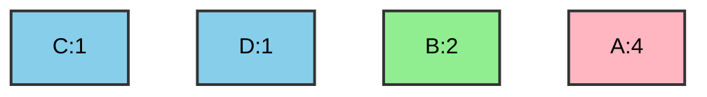
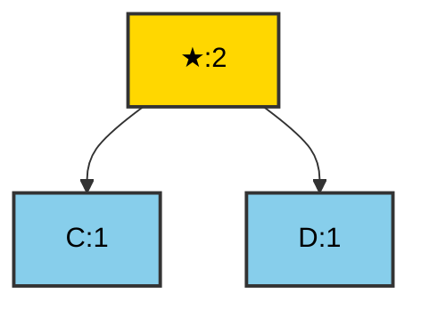
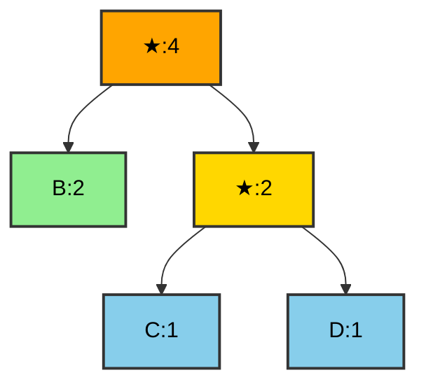
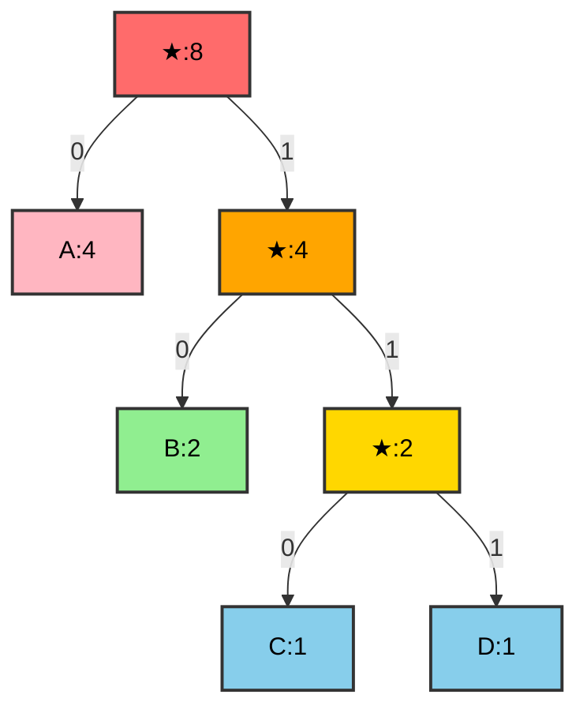
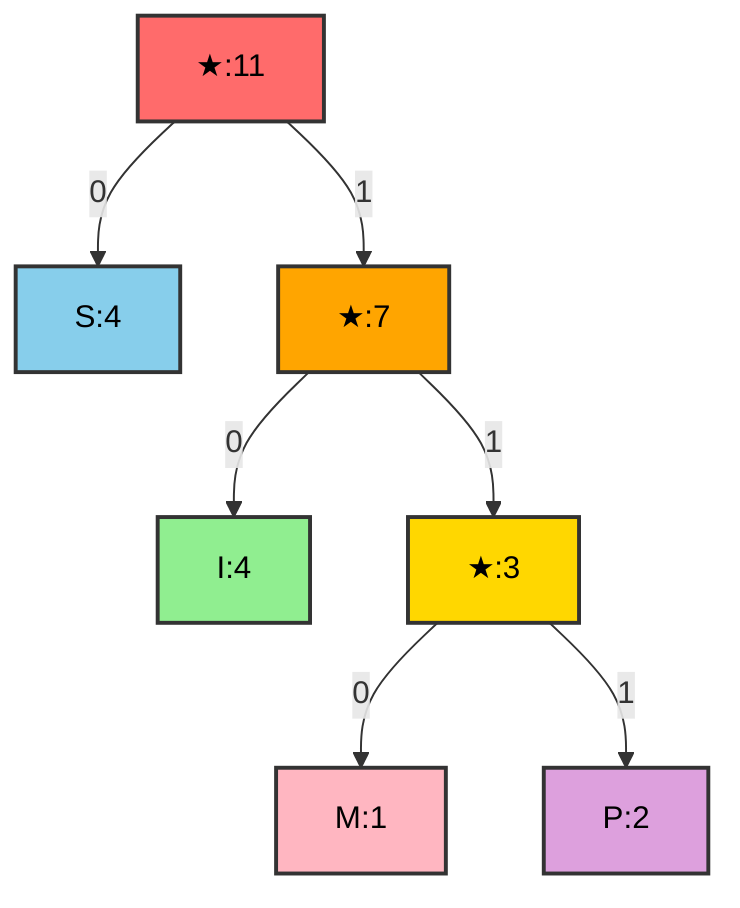
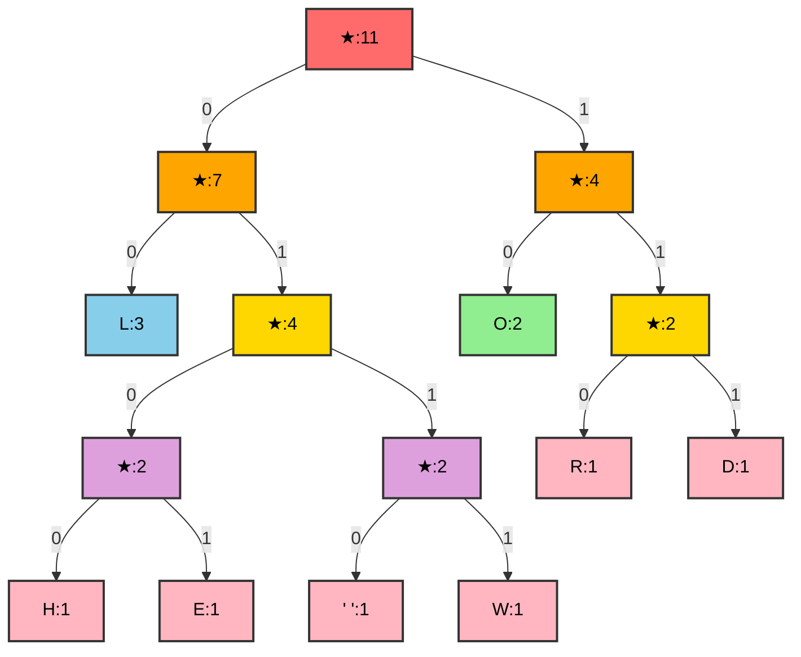
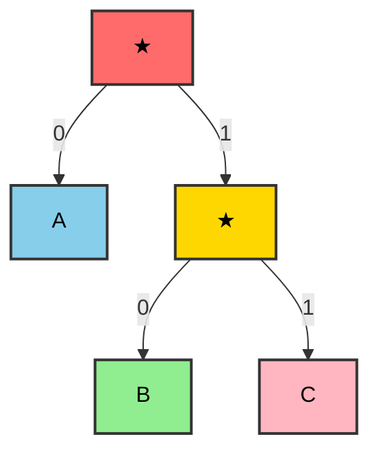

# Κωδικοποίηση Huffman (Huffman Coding)

## Περιεχόμενα
1. [Εισαγωγή](#εισαγωγή)
2. [Βασικές Έννοιες](#βασικές-έννοιες)
3. [Αλγόριθμος Huffman](#αλγόριθμος-huffman)
4. [Κατασκευή Δέντρου Huffman](#κατασκευή-δέντρου-huffman)
5. [Κωδικοποίηση και Αποκωδικοποίηση](#κωδικοποίηση-και-αποκωδικοποίηση)
6. [Υλοποίηση σε C++](#υλοποίηση-σε-c)
7. [Παραδείγματα με Λύσεις](#παραδείγματα-με-λύσεις)
8. [Πολυπλοκότητα](#πολυπλοκότητα)

---

## Εισαγωγή

Η **Κωδικοποίηση Huffman** είναι ένας **άπληστος αλγόριθμος** (greedy algorithm) που χρησιμοποιείται για τη **συμπίεση δεδομένων χωρίς απώλειες** (lossless data compression). Δημιουργήθηκε από τον David A. Huffman το 1952.

### Βασική Ιδέα
Χρησιμοποιεί **κώδικες μεταβλητού μήκους** για τα χαρακτήρες:
- Χαρακτήρες που εμφανίζονται **συχνά** → **μικρότεροι κώδικες**
- Χαρακτήρες που εμφανίζονται **σπάνια** → **μεγαλύτεροι κώδικες**

### Χαρακτηριστικά
- **Βέλτιστη κωδικοποίηση**: Επιτυγχάνει το ελάχιστο μέσο μήκος κώδικα
- **Κώδικες προθέματος** (prefix codes): Κανένας κώδικας δεν είναι πρόθεμα άλλου
- **Χωρίς απώλειες**: Πλήρης αποκατάσταση των αρχικών δεδομένων

---

## Βασικές Έννοιες

### 1. Fixed-Length vs Variable-Length Encoding

#### Fixed-Length Encoding (Σταθερού Μήκους)

Κάθε χαρακτήρας χρησιμοποιεί τον **ίδιο αριθμό bits**.

**Παράδειγμα:** Για 4 χαρακτήρες χρειαζόμαστε 2 bits ανά χαρακτήρα.

```
A → 00
B → 01
C → 10
D → 11
```

**Κείμενο:** `ABACABAD`  
**Κωδικοποίηση:** `00 01 00 10 00 01 00 11` = **16 bits**

#### Variable-Length Encoding (Μεταβλητού Μήκους)

Χαρακτήρες με **διαφορετικά μήκη** κώδικα.

```
A → 0
B → 10
C → 110
D → 111
```

**Κείμενο:** `ABACABAD`  
**Κωδικοποίηση:** `0 10 0 110 0 10 0 111` = **13 bits** (Εξοικονόμηση: 18.75%)

### 2. Κώδικες Προθέματος (Prefix Codes)

Ένας κώδικας είναι **prefix-free** όταν κανένας κώδικας **δεν αποτελεί πρόθεμα άλλου**.

**Καλός Κώδικας (Prefix-Free):**
```
A → 0
B → 10
C → 110
D → 111
```
 Μονοσήμαντη αποκωδικοποίηση

**Κακός Κώδικας (Όχι Prefix-Free):**
```
A → 0
B → 01
C → 10
D → 11
```
 Ασάφεια: `01` = `AB` ή `B`?

### 3. Δέντρο Huffman

Το δέντρο Huffman είναι ένα **δυαδικό δέντρο** όπου:
- **Φύλλα**: Περιέχουν τους χαρακτήρες
- **Δεξιά ακμή**: Bit `1`
- **Αριστερή ακμή**: Bit `0`
- **Μονοπάτι από ρίζα σε φύλλο**: Κώδικας του χαρακτήρα

---

## Αλγόριθμος Huffman

### Βήματα Κατασκευής

1. **Υπολογισμός Συχνοτήτων**
   - Μέτρηση εμφανίσεων κάθε χαρακτήρα

2. **Δημιουργία Min-Heap**
   - Κάθε κόμβος περιέχει χαρακτήρα και συχνότητα
   - Ταξινόμηση με βάση τη συχνότητα

3. **Κατασκευή Δέντρου**
   - Επαναληπτικά:
     - Εξαγωγή των 2 κόμβων με μικρότερη συχνότητα
     - Δημιουργία νέου κόμβου-γονέα
     - Συχνότητα γονέα = Άθροισμα συχνοτήτων παιδιών
     - Εισαγωγή γονέα στον σωρό
   - Τέλος όταν μείνει 1 κόμβος (ρίζα)

4. **Δημιουργία Πίνακα Κωδίκων**
   - Διάσχιση δέντρου για κάθε χαρακτήρα
   - Αποθήκευση κωδίκων

### Ψευδοκώδικας

```
function buildHuffmanTree(characters, frequencies):
    // Δημιουργία min-heap
    priority_queue = create_min_heap()
    
    for each character c with frequency f:
        node = create_node(c, f)
        priority_queue.insert(node)
    
    // Κατασκευή δέντρου
    while priority_queue.size() > 1:
        left = priority_queue.extract_min()
        right = priority_queue.extract_min()
        
        parent = create_node(null, left.freq + right.freq)
        parent.left = left
        parent.right = right
        
        priority_queue.insert(parent)
    
    return priority_queue.extract_min()  // Ρίζα
```

---

## Κατασκευή Δέντρου Huffman

### Παράδειγμα: Κείμενο "ABACABAD"

#### Βήμα 1: Υπολογισμός Συχνοτήτων

| Χαρακτήρας | Συχνότητα |
|------------|-----------|
| A | 4 |
| B | 2 |
| C | 1 |
| D | 1 |

#### Βήμα 2: Αρχικοποίηση Min-Heap



**Priority Queue:** `[C:1, D:1, B:2, A:4]`

#### Βήμα 3: Συγχώνευση C και D

Εξαγωγή `C:1` και `D:1`, δημιουργία γονέα με συχνότητα `2`.



**Priority Queue:** `[B:2, ★:2, A:4]`

#### Βήμα 4: Συγχώνευση B και ★:2

Εξαγωγή `B:2` και `★:2`, δημιουργία γονέα με συχνότητα `4`.



**Priority Queue:** `[A:4, ★:4]`

#### Βήμα 5: Συγχώνευση A και ★:4 (Τελικό Δέντρο)



#### Βήμα 6: Πίνακας Κωδίκων

Διάσχιση από ρίζα σε κάθε φύλλο:

| Χαρακτήρας | Μονοπάτι | Κώδικας |
|------------|----------|---------|
| A | Αριστερά | `0` |
| B | Δεξιά → Αριστερά | `10` |
| C | Δεξιά → Δεξιά → Αριστερά | `110` |
| D | Δεξιά → Δεξιά → Δεξιά | `111` |

---

## Κωδικοποίηση και Αποκωδικοποίηση

### Κωδικοποίηση (Encoding)

**Κείμενο:** `ABACABAD`

**Αντικατάσταση με κώδικες:**
```
A → 0
B → 10
A → 0
C → 110
A → 0
B → 10
A → 0
D → 111
```

**Συνένωση:** `0 10 0 110 0 10 0 111` = **01001100100111** (13 bits)

**Σύγκριση:**
- **Fixed-length (2 bits/char):** 16 bits
- **Huffman:** 13 bits
- **Εξοικονόμηση:** 18.75%

### Αποκωδικοποίηση (Decoding)

**Κωδικοποιημένο μήνυμα:** `01001100100111`

**Διαδικασία:**
1. Ξεκινάμε από τη ρίζα
2. Διαβάζουμε bit-by-bit:
   - `0` → Αριστερά
   - `1` → Δεξιά
3. Όταν φτάσουμε σε φύλλο → εκτύπωση χαρακτήρα, επιστροφή στη ρίζα

**Βήματα:**

| Bits | Μονοπάτι | Χαρακτήρας | Αποκωδικοποιημένο |
|------|----------|------------|-------------------|
| `0` | Αριστερά → A | A | A |
| `10` | Δεξιά → Αριστερά → B | B | AB |
| `0` | Αριστερά → A | A | ABA |
| `110` | Δεξιά → Δεξιά → Αριστερά → C | C | ABAC |
| `0` | Αριστερά → A | A | ABACA |
| `10` | Δεξιά → Αριστερά → B | B | ABACAB |
| `0` | Αριστερά → A | A | ABACABA |
| `111` | Δεξιά → Δεξιά → Δεξιά → D | D | ABACABAD |

**Αποτέλεσμα:** `ABACABAD` 

---

## Υλοποίηση σε C++

### Δομή Κόμβου

```cpp
/**
 * Κόμβος του δέντρου Huffman.
 * 
 * Περιέχει χαρακτήρα, συχνότητα και δείκτες προς τα παιδιά.
 */
struct HuffmanNode {
    char character;  // Ο χαρακτήρας (για φύλλα)
    int frequency;  // Η συχνότητα εμφάνισης
    HuffmanNode* left_child;  // Αριστερό παιδί
    HuffmanNode* right_child;  // Δεξί παιδί
    
    /**
     * Κατασκευαστής για κόμβο.
     * 
     * Args:
     *     c (char): Ο χαρακτήρας.
     *     freq (int): Η συχνότητα.
     */
    HuffmanNode(char c, int freq) : character(c), frequency(freq), 
                                      left_child(nullptr), right_child(nullptr) {}
};
```

### Comparator για Min-Heap

```cpp
/**
 * Συναρτητής σύγκρισης για την priority queue.
 * 
 * Συγκρίνει κόμβους με βάση τη συχνότητα για min-heap.
 */
struct CompareNodes {
    /**
     * Τελεστής σύγκρισης.
     * 
     * Args:
     *     left (HuffmanNode*): Ο πρώτος κόμβος.
     *     right (HuffmanNode*): Ο δεύτερος κόμβος.
     * 
     * Returns:
     *     bool: True αν ο αριστερός έχει μεγαλύτερη συχνότητα.
     */
    bool operator()(HuffmanNode* left, HuffmanNode* right) {
        return left->frequency > right->frequency;
    }
};
```

### Κατασκευή Δέντρου Huffman

```cpp
/**
 * Δημιουργεί το δέντρο Huffman από χαρακτήρες και συχνότητες.
 * 
 * Args:
 *     characters (std::vector<char>&): Οι χαρακτήρες.
 *     frequencies (std::vector<int>&): Οι συχνότητες.
 * 
 * Returns:
 *     HuffmanNode*: Η ρίζα του δέντρου Huffman.
 */
HuffmanNode* buildHuffmanTree(std::vector<char>& characters, 
                               std::vector<int>& frequencies) {
    // Δημιουργία priority queue (min-heap)
    std::priority_queue<HuffmanNode*, std::vector<HuffmanNode*>, 
                        CompareNodes> min_heap;
    
    // Εισαγωγή όλων των χαρακτήρων στον σωρό
    for (size_t i = 0; i < characters.size(); i++) {
        HuffmanNode* node = new HuffmanNode(characters[i], frequencies[i]);
        min_heap.push(node);
    }
    
    // Κατασκευή δέντρου
    while (min_heap.size() > 1) {
        // Εξαγωγή των δύο κόμβων με μικρότερη συχνότητα
        HuffmanNode* left = min_heap.top();
        min_heap.pop();
        
        HuffmanNode* right = min_heap.top();
        min_heap.pop();
        
        // Δημιουργία νέου εσωτερικού κόμβου
        HuffmanNode* parent = new HuffmanNode('\0', 
                                                left->frequency + right->frequency);
        parent->left_child = left;
        parent->right_child = right;
        
        // Προσθήκη στον σωρό
        min_heap.push(parent);
    }
    
    // Επιστροφή ρίζας
    return min_heap.top();
}
```

### Δημιουργία Πίνακα Κωδίκων

```cpp
/**
 * Δημιουργεί τον πίνακα κωδίκων Huffman.
 * 
 * Args:
 *     root (HuffmanNode*): Η ρίζα του δέντρου.
 *     code (std::string): Ο τρέχων κώδικας (αρχικά "").
 *     huffman_codes (std::map<char, std::string>&): Ο πίνακας κωδίκων.
 */
void generateCodes(HuffmanNode* root, std::string code, 
                   std::map<char, std::string>& huffman_codes) {
    if (root == nullptr) return;
    
    // Αν είναι φύλλο, αποθήκευση του κώδικα
    if (root->left_child == nullptr && root->right_child == nullptr) {
        huffman_codes[root->character] = code;
        return;
    }
    
    // Αναδρομή για αριστερό και δεξί υποδέντρο
    generateCodes(root->left_child, code + "0", huffman_codes);
    generateCodes(root->right_child, code + "1", huffman_codes);
}
```

### Κωδικοποίηση

```cpp
/**
 * Κωδικοποιεί ένα κείμενο χρησιμοποιώντας τους κώδικες Huffman.
 * 
 * Args:
 *     text (std::string): Το κείμενο προς κωδικοποίηση.
 *     huffman_codes (std::map<char, std::string>&): Οι κώδικες Huffman.
 * 
 * Returns:
 *     std::string: Το κωδικοποιημένο κείμενο.
 */
std::string encode(std::string text, std::map<char, std::string>& huffman_codes) {
    std::string encoded_text = "";
    
    for (char c : text) {
        encoded_text += huffman_codes[c];
    }
    
    return encoded_text;
}
```

### Αποκωδικοποίηση

```cpp
/**
 * Αποκωδικοποιεί ένα κωδικοποιημένο κείμενο.
 * 
 * Args:
 *     encoded_text (std::string): Το κωδικοποιημένο κείμενο.
 *     root (HuffmanNode*): Η ρίζα του δέντρου Huffman.
 * 
 * Returns:
 *     std::string: Το αποκωδικοποιημένο κείμενο.
 */
std::string decode(std::string encoded_text, HuffmanNode* root) {
    std::string decoded_text = "";
    HuffmanNode* current = root;
    
    for (char bit : encoded_text) {
        // Κίνηση στο δέντρο με βάση το bit
        if (bit == '0') {
            current = current->left_child;
        } else {
            current = current->right_child;
        }
        
        // Αν φτάσαμε σε φύλλο
        if (current->left_child == nullptr && current->right_child == nullptr) {
            decoded_text += current->character;
            current = root;  // Επιστροφή στη ρίζα
        }
    }
    
    return decoded_text;
}
```

---

## Παραδείγματα με Λύσεις

### Παράδειγμα 1: Κωδικοποίηση "MISSISSIPPI"

#### Βήμα 1: Υπολογισμός Συχνοτήτων

| Χαρακτήρας | Συχνότητα |
|------------|-----------|
| I | 4 |
| S | 4 |
| P | 2 |
| M | 1 |

**Priority Queue:** `[M:1, P:2, I:4, S:4]`

#### Βήμα 2: Κατασκευή Δέντρου

**Επανάληψη 1:** Συγχώνευση M:1 και P:2
```
★:3 (M+P)
Priority Queue: [★:3, I:4, S:4]
```

**Επανάληψη 2:** Συγχώνευση ★:3 και I:4
```
★:7 (MP+I)
Priority Queue: [S:4, ★:7]
```

**Επανάληψη 3:** Συγχώνευση S:4 και ★:7 (Τελικό)



#### Βήμα 3: Πίνακας Κωδίκων

| Χαρακτήρας | Κώδικας | Μήκος |
|------------|---------|-------|
| S | `0` | 1 |
| I | `10` | 2 |
| M | `110` | 3 |
| P | `111` | 3 |

#### Βήμα 4: Κωδικοποίηση

**Κείμενο:** `MISSISSIPPI`
```
M → 110
I → 10
S → 0
S → 0
I → 10
S → 0
S → 0
I → 10
P → 111
P → 111
I → 10
```

**Κωδικοποιημένο:** `110100010001011111110` = **110100010001011111110**

**Μήκη:**
- **Original (8 bits/char):** 11 × 8 = **88 bits**
- **Huffman:** **21 bits**
- **Εξοικονόμηση:** 76.1% !

---

### Παράδειγμα 2: Κείμενο "HELLO WORLD"

#### Βήμα 1: Συχνότητες

| Χαρακτήρας | Συχνότητα |
|------------|-----------|
| L | 3 |
| O | 2 |
| H | 1 |
| E | 1 |
| (space) | 1 |
| W | 1 |
| R | 1 |
| D | 1 |

#### Βήμα 2: Κατασκευή Δέντρου (Συνοπτικά)

**Συγχωνεύσεις:**
1. H:1 + E:1 → ★:2
2. (space):1 + W:1 → ★:2
3. R:1 + D:1 → ★:2
4. ★:2 (HE) + ★:2 (space+W) → ★:4
5. O:2 + ★:2 (RD) → ★:4
6. L:3 + ★:4 (HE+space+W) → ★:7
7. ★:4 (O+RD) + ★:7 → ★:11 (Ρίζα)



#### Βήμα 3: Κώδικες

| Χαρακτήρας | Κώδικας |
|------------|---------|
| L | `00` |
| H | `0100` |
| E | `0101` |
| (space) | `0110` |
| W | `0111` |
| O | `10` |
| R | `110` |
| D | `111` |

#### Βήμα 4: Κωδικοποίηση "HELLO WORLD"

```
H → 0100
E → 0101
L → 00
L → 00
O → 10
(space) → 0110
W → 0111
O → 10
R → 110
L → 00
D → 111
```

**Κωδικοποιημένο:** `01000101000010011001111011000111`

**Μήκος:** 35 bits (vs 88 bits για 8-bit ASCII)  
**Εξοικονόμηση:** 60.2%

---

### Παράδειγμα 3: Αποκωδικοποίηση

**Δέντρο:**


**Κώδικες:**
- A → `0`
- B → `10`
- C → `11`

**Κωδικοποιημένο μήνυμα:** `010110011`

**Αποκωδικοποίηση βήμα-βήμα:**

| Bits | Διαδρομή | Χαρακτήρας | Κείμενο |
|------|----------|------------|---------|
| `0` | Αριστερά → A (Σωστό) | A | A |
| `1` | Δεξιά... |  |  |
| `10` | ...Αριστερά → B (Σωστό) | B | AB |
| `1` | Δεξιά... |  |  |
| `11` | ...Δεξιά → C (Σωστό) | C | ABC |
| `0` | Αριστερά → A (Σωστό) | A | ABCA |
| `1` | Δεξιά... |  |  |
| `11` | ...Δεξιά → C (Σωστό) | C | ABCAC |

**Αποτέλεσμα:** `ABCAC` (Σωστό)

---

## Πολυπλοκότητα

### Χρονική Πολυπλοκότητα

| Λειτουργία | Πολυπλοκότητα | Επεξήγηση |
|------------|---------------|-----------|
| Υπολογισμός Συχνοτήτων | O(n) | Διάσχιση του κειμένου |
| Κατασκευή Heap | O(n log n) | n εισαγωγές σε heap |
| Κατασκευή Δέντρου | O(n log n) | n-1 εξαγωγές + εισαγωγές |
| Δημιουργία Κωδίκων | O(n) | Διάσχιση δέντρου |
| Κωδικοποίηση | O(m) | m = μήκος κειμένου |
| Αποκωδικοποίηση | O(m × h) | h = ύψος δέντρου |
| **Συνολική** | **O(n log n)** | n = αριθμός μοναδικών χαρακτήρων |

### Χωρική Πολυπλοκότητα

- **Δέντρο:** O(n) - n κόμβοι
- **Priority Queue:** O(n)
- **Πίνακας Κωδίκων:** O(n)
- **Συνολική:** O(n)

### Μέσο Μήκος Κώδικα

Το μέσο μήκος κώδικα υπολογίζεται ως:

```
L = Σ (p(i) × l(i))
```

Όπου:
- `p(i)` = Πιθανότητα χαρακτήρα i (συχνότητα / σύνολο)
- `l(i)` = Μήκος κώδικα χαρακτήρα i

**Παράδειγμα (ABACABAD):**
```
L = (4/8 × 1) + (2/8 × 2) + (1/8 × 3) + (1/8 × 3)
  = 0.5 + 0.5 + 0.375 + 0.375
  = 1.75 bits/character
```

---

## Πλεονεκτήματα και Μειονεκτήματα

### Πλεονεκτήματα

1. **Βέλτιστη Κωδικοποίηση**
   - Επιτυγχάνει το ελάχιστο μέσο μήκος κώδικα

2. **Χωρίς Απώλειες**
   - Πλήρης αποκατάσταση των αρχικών δεδομένων

3. **Prefix-Free Codes**
   - Μονοσήμαντη αποκωδικοποίηση

4. **Απλότητα**
   - Εύκολη υλοποίηση και κατανόηση

### Μειονεκτήματα

1. **Απαίτηση Δύο Διασχίσεων**
   - Μία για συχνότητες, μία για κωδικοποίηση

2. **Μεταφορά Δέντρου**
   - Χρειάζεται αποστολή του δέντρου ή των συχνοτήτων

3. **Μη Βέλτιστο για Μικρά Αρχεία**
   - Το overhead του δέντρου μπορεί να είναι μεγάλο

4. **Στατική Κωδικοποίηση**
   - Δεν προσαρμόζεται δυναμικά σε αλλαγές

---

## Εφαρμογές

### 1. Συμπίεση Αρχείων
- **ZIP, GZIP**: Χρήση παραλλαγών Huffman
- **JPEG**: Huffman για συμπίεση εικόνας
- **MP3**: Συμπίεση ήχου

### 2. Δικτυακή Επικοινωνία
- **HTTP/2**: Header compression με Huffman
- Μετάδοση δεδομένων με μειωμένο bandwidth

### 3. Κωδικοποίηση Fax
- Συμπίεση ασπρόμαυρων εικόνων

---

## Ασκήσεις Εξάσκησης

### Άσκηση 1
Δημιούργησε το δέντρο Huffman για το κείμενο **"BANANA"**.

<details>
<summary>Λύση</summary>

**Συχνότητες:**
- A: 3
- N: 2
- B: 1

**Δέντρο:**
```
     ★:6
    /    \
   A:3   ★:3
        /   \
       N:2  B:1
```

**Κώδικες:**
- A → `0`
- N → `10`
- B → `11`

**Κωδικοποίηση:** `11 0 10 0 10 0` = `1101001­00`
</details>

### Άσκηση 2
Αποκωδικοποίησε το μήνυμα `11010011000` χρησιμοποιώντας τους κώδικες:
- A → `0`
- B → `10`
- C → `11`

<details>
<summary>Λύση</summary>

**Διάσπαση:**
- `11` → C
- `0` → A
- `10` → B
- `0` → A
- `11` → C
- `0` → A
- `0` → A

**Αποτέλεσμα:** `CABACAA`
</details>

### Άσκηση 3
Υπολόγισε το μέσο μήκος κώδικα για το κείμενο **"AABBCC"** με τους κώδικες:
- A → `0`
- B → `10`
- C → `11`

<details>
<summary>Λύση</summary>

**Συχνότητες:**
- A: 2/6 = 1/3
- B: 2/6 = 1/3
- C: 2/6 = 1/3

**Μέσο μήκος:**
```
L = (1/3 × 1) + (1/3 × 2) + (1/3 × 2)
  = 1/3 + 2/3 + 2/3
  = 5/3
  ≈ 1.67 bits/character
```
</details>

---

## Σύγκριση με Άλλους Αλγορίθμους

| Αλγόριθμος | Τύπος | Ratio | Ταχύτητα |
|------------|-------|-------|----------|
| **Huffman** | Lossless | 2-8x | Γρήγορο |
| **LZW** | Lossless | 2-10x | Μέτριο |
| **Run-Length** | Lossless | 2-4x | Πολύ γρήγορο |
| **JPEG** | Lossy | 10-50x | Μέτριο |

---

