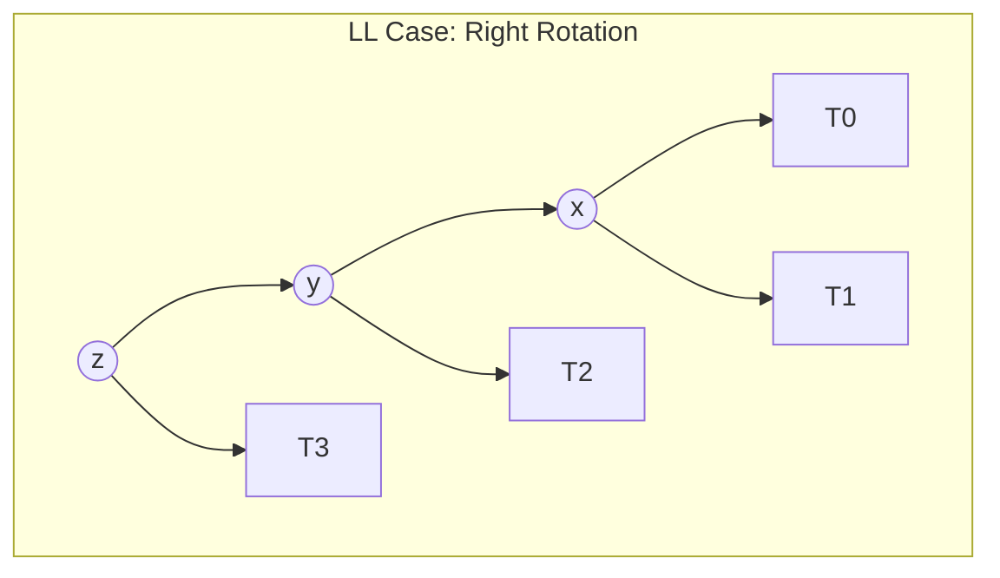

# Lecture 02: Trees, Binary Search Trees, and AVL Balancing

This lecture examines hierarchical tree architectures, binary search tree invariants, traversal orders, pathological degradation, and the mathematical proof and rotation mechanics of self-balancing AVL trees.

---

## 1. Tree Terminology and Traversals

A tree is an acyclic connected graph $T = (V, E)$ containing $|V| = n$ vertices and $|E| = n - 1$ edges.

### 1.1 Fundamental Metrics
- **Root:** The distinguished ancestor node with zero incoming parent edges.
- **Depth of Node $v$:** Number of edges traversed from the root to $v$. $\text{depth}(\text{root}) = 0$.
- **Height of Node $v$:** Maximum number of edges on a downward path from $v$ to any descendant leaf. Leaves possess height 0. Height of an empty subtree is defined as $-1$.
- **Tree Height:** Height of the root node.

### 1.2 Binary Tree Traversals

Given binary tree node $N$ with left child $L$ and right child $R$:
1. **Pre-Order ($N \to L \to R$):** Visits current node before child subtrees. Utilized for tree cloning and prefix serialization.
2. **In-Order ($L \to N \to R$):** Visits left subtree, current node, then right subtree. Produces sorted sequences on Binary Search Trees.
3. **Post-Order ($L \to R \to N$):** Visits children before parent. Utilized for bottom-up destruction (`delete` passes) and directory size calculations.
4. **Level-Order (Breadth-First):** Traverses nodes depth by depth using a FIFO queue.

```cpp
void inorderTraversal(Node* root) {
    if (!root) return;
    inorderTraversal(root->left);
    std::cout << root->key << " ";
    inorderTraversal(root->right);
}
```

---

## 2. Binary Search Trees (BST)

### 2.1 The BST Invariant
For any arbitrary node $x$ in tree $T$:
$$
\forall y \in \text{LeftSubtree}(x) \implies y.\text{key} < x.\text{key}
$$
$$
\forall z \in \text{RightSubtree}(x) \implies z.\text{key} > x.\text{key}
$$

### 2.2 BST Operations and Node Deletion
- **Search and Insert:** $O(h)$ where $h$ is current tree height.
- **Node Deletion (3 Structural Cases):**
  1. **Case 1 (Leaf Node):** Disconnect parent pointer and deallocate memory.
  2. **Case 2 (Single Child):** Splice child directly into the deleted node's parent pointer.
  3. **Case 3 (Two Children):**
     - Identify the **In-Order Successor** (minimum element in right subtree: descend left from right child).
     - Copy the successor's key into the target node.
     - Recursively delete the successor node from the right subtree (which falls into Case 1 or Case 2).

### 2.3 Pathological Worst-Case Degradation
Inserting sorted inputs ($[1, 2, 3, 4, 5, \dots]$) causes a standard BST to degrade into a skewed linear linked list of height $h = n - 1$. Search complexity deteriorates from average $O(\log n)$ to worst-case $O(n)$.

---

## 3. AVL Trees: Self-Balancing Height Invariant

Invented in 1962 by Georgy Adelson-Velsky and Evgenii Landis, the AVL tree maintains a strictly bounded height.

### 3.1 Balance Factor ($BF$)
For every node $v$:
$$
BF(v) = \text{height}(v.\text{left}) - \text{height}(v.\text{right})
$$
**The AVL Invariant:** For every node $v \in T$:
$$
BF(v) \in \{-1, 0, +1\}
$$

### 3.2 Proof of $O(\log n)$ Maximum Height
Let $N(h)$ be the minimum number of nodes required to form an AVL tree of height $h$.
- Base cases: $N(0) = 1$ (single root node), $N(1) = 2$ (root with one child).
- To minimize nodes for height $h$, one subtree must have height $h - 1$ and the other height $h - 2$:
  $$
  N(h) = N(h - 1) + N(h - 2) + 1
  $$
- Notice similarity to Fibonacci numbers $F_k = F_{k-1} + F_{k-2}$ with $F_1 = 1, F_2 = 1, F_3 = 2, F_4 = 3, \dots$:
  $$
  N(h) = F_{h+2} - 1
  $$
- Using Binet's formula with golden ratio $\phi = \frac{1 + \sqrt{5}}{2} \approx 1.618$:
  $$
  F_{h+2} \approx \frac{\phi^{h+2}}{\sqrt{5}} \implies n \ge N(h) > \frac{\phi^{h+2}}{\sqrt{5}} - 1
  $$
  $$
  h < \frac{\log_2 n}{\log_2 \phi} \approx 1.4404 \log_2 n
  $$
**Conclusion:** The maximum height of an AVL tree of $n$ elements is guaranteed to be strictly less than $1.44 \log_2 n$, ensuring guaranteed $O(\log n)$ worst-case search, insertion, and deletion.

---

## 4. AVL Tree Rotations

When an insertion or deletion causes $|BF(v)| \ge 2$, local pointer restructuring restores the invariant in $O(1)$ time.



### 4.1 Single Rotations
1. **Left-Left (LL) Imbalance ($BF(z) = +2, BF(y) = +1$):**
   Fixed via **Right Rotation** around $z$.
2. **Right-Right (RR) Imbalance ($BF(z) = -2, BF(y) = -1$):**
   Fixed via **Left Rotation** around $z$.

### 4.2 Double Rotations
1. **Left-Right (LR) Imbalance ($BF(z) = +2, BF(y) = -1$):**
   Fixed via Left Rotation on child $y$, followed by Right Rotation on node $z$.
2. **Right-Left (RL) Imbalance ($BF(z) = -2, BF(y) = +1$):**
   Fixed via Right Rotation on child $y$, followed by Left Rotation on node $z$.

### 4.3 C++ Implementation of Rotation Primitives

```cpp
struct AVLNode {
    int key;
    int height;
    AVLNode* left;
    AVLNode* right;
    AVLNode(int k) : key(k), height(0), left(nullptr), right(nullptr) {}
};

int getHeight(AVLNode* n) {
    return n ? n->height : -1;
}

int getBalanceFactor(AVLNode* n) {
    return n ? getHeight(n->left) - getHeight(n->right) : 0;
}

void updateHeight(AVLNode* n) {
    n->height = 1 + std::max(getHeight(n->left), getHeight(n->right));
}

AVLNode* rotateRight(AVLNode* y) {
    AVLNode* x = y->left;
    AVLNode* T2 = x->right;

    // Perform pointer rotation
    x->right = y;
    y->left = T2;

    // Update heights bottom-up
    updateHeight(y);
    updateHeight(x);

    return x; // New local root
}

AVLNode* rotateLeft(AVLNode* x) {
    AVLNode* y = x->right;
    AVLNode* T2 = y->left;

    // Perform pointer rotation
    y->left = x;
    x->right = T2;

    // Update heights bottom-up
    updateHeight(x);
    updateHeight(y);

    return y; // New local root
}
```

---

## 5. Comparative Performance Summary

| Metric | Unbalanced BST (Average) | Unbalanced BST (Worst-Case) | AVL Tree (Worst-Case) | Red-Black Tree (Worst-Case) |
|:---|:---|:---|:---|:---|
| Height Bound | $\approx 2 \ln n \approx 1.39 \log_2 n$ | $n - 1$ | $< 1.44 \log_2 n$ | $\le 2 \log_2(n + 1)$ |
| Search Time | $O(\log n)$ | $O(n)$ | $O(\log n)$ | $O(\log n)$ |
| Insertion Time | $O(\log n)$ | $O(n)$ | $O(\log n)$ | $O(\log n)$ |
| Deletion Time | $O(\log n)$ | $O(n)$ | $O(\log n)$ | $O(\log n)$ |
| Rotations per Insert | 0 | 0 | $\le 2$ (at most one single or double) | $\le 2$ |
| Rotations per Delete | 0 | 0 | $O(\log n)$ cascading | $\le 3$ |

