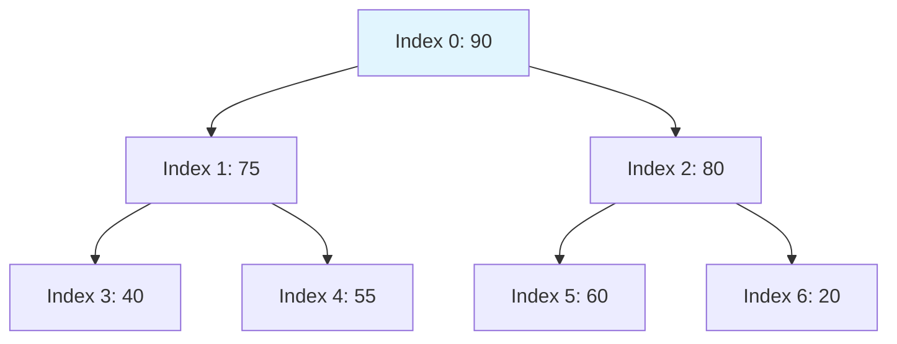

# Lecture 03: Heaps, Priority Queues, and Hashing

This lecture explores priority queue architectures, complete binary tree array mappings, Floyd's linear-time heap construction proof, hash function designs, load factor dynamics, and collision resolution via separate chaining and open addressing.

---

## 1. Priority Queues and Binary Heaps

A **Priority Queue** is an Abstract Data Type (ADT) supporting:
- `insert(key, priority)`: Enqueues an item with associated priority.
- `extractMax()` / `extractMin()`: Dequeues the element with maximum/minimum priority.
- `peek()`: Returns the top priority element without removal ($O(1)$).

### 1.1 The Binary Heap Invariants
A Binary Heap is realized as an array modeling a complete binary tree satisfying:
1. **Shape Property:** All levels are completely filled except possibly the bottom level, which is populated from left to right.
2. **Heap Order Property:**
   - **Max-Heap:** $\text{key}(\text{parent}) \ge \text{key}(\text{child})$ for all non-root nodes.
   - **Min-Heap:** $\text{key}(\text{parent}) \le \text{key}(\text{child})$ for all non-root nodes.

### 1.2 Array Index Mapping (0-Indexed)
For a node located at array index $i$:
$$
\text{parent}(i) = \left\lfloor \frac{i - 1}{2} \right\rfloor, \quad \text{left}(i) = 2i + 1, \quad \text{right}(i) = 2i + 2
$$
Leaves reside at indices $\lfloor n/2 \rfloor \le i < n$.



### 1.3 Core Heap Operations
- **`siftUp(i)`:** Triggered on insertion. Compares element with parent and swaps upward until heap order is restored ($O(\log n)$).
- **`siftDown(i)` (`maxHeapify`):** Triggered after replacing the root with the last leaf during `extractMax()`. Swaps element downward with its largest child ($O(\log n)$).

---

## 2. Floyd's Linear-Time Heap Construction (`buildHeap`)

Building an $n$-element heap by repeated $n$ insertions requires $O(n \log n)$ time. Robert Floyd's bottom-up algorithm constructs the heap in strictly linear $O(n)$ time by running `siftDown` in reverse index order from $\lfloor n/2 \rfloor - 1$ down to 0:

```cpp
void buildMaxHeap(std::vector<int>& arr) {
    int n = arr.size();
    for (int i = (n / 2) - 1; i >= 0; --i) {
        maxHeapify(arr, n, i);
    }
}
```

### Mathematical Proof of $O(n)$ Time Bound
1. A complete binary tree of height $h = \lfloor \log_2 n \rfloor$ has at most $\lceil \frac{n}{2^{k+1}} \rceil$ nodes at height $k$.
2. The cost of running `siftDown` on a node at height $k$ is $O(k)$ swaps.
3. Total operations $T(n)$:
   $$
   T(n) \le \sum_{k=0}^{\lfloor \log_2 n \rfloor} \left\lceil \frac{n}{2^{k+1}} \right\rceil O(k) \le c n \sum_{k=0}^{\infty} \frac{k}{2^{k+1}} = \frac{c n}{2} \sum_{k=0}^{\infty} \frac{k}{2^k}
   $$
4. Recall the infinite geometric series for $|x| < 1$:
   $$
   \sum_{k=0}^{\infty} x^k = \frac{1}{1 - x}
   $$
   Differentiating both sides with respect to $x$:
   $$
   \sum_{k=0}^{\infty} k x^{k-1} = \frac{1}{(1 - x)^2} \implies \sum_{k=0}^{\infty} k x^k = \frac{x}{(1 - x)^2}
   $$
   Evaluating at $x = \frac{1}{2}$:
   $$
   \sum_{k=0}^{\infty} \frac{k}{2^k} = \frac{1/2}{(1 - 1/2)^2} = \frac{1/2}{1/4} = 2
   $$
5. Substituting back:
   $$
   T(n) \le \frac{c n}{2} \times 2 = c n = O(n)
   $$

---

## 3. Hash Tables and Hash Functions

A **Hash Table** maps arbitrary keys $k \in \mathcal{U}$ into an integer table index $h(k) \in \{0, 1, \dots, m-1\}$.

### 3.1 Load Factor ($\alpha$)
For a table with $m$ slots holding $n$ stored elements:
$$
\alpha = \frac{n}{m}
$$

### 3.2 Common Hash Functions
1. **Division Method:**
   $$
   h(k) = k \pmod m
   $$
   *Criterion:* Select $m$ as a prime number not close to powers of 2 to avoid stride correlations.
2. **Multiplication Method (Knuth):**
   $$
   h(k) = \lfloor m (k A \pmod 1) \rfloor
   $$
   where $A = \frac{\sqrt{5} - 1}{2} \approx 0.6180339887$ (fractional golden ratio).

---

## 4. Collision Resolution Techniques

A collision occurs when distinct keys produce identical hash indices ($h(k_1) = h(k_2)$ for $k_1 \ne k_2$).

### 4.1 Separate Chaining
Each bucket maintains a linked list of collided key-value pairs.
- Insertion: $O(1)$ prepending to list head.
- Unsuccessful Search: $\Theta(1 + \alpha)$ under Simple Uniform Hashing assumption.
- Successful Search: $\Theta(1 + \alpha / 2)$.
- Advantage: Can store $n > m$ ($\alpha > 1$). Graceful degradation under load.

### 4.2 Open Addressing
All entries reside directly within table slots ($n \le m \implies \alpha \le 1$). Probe sequences dictate alternative slot exploration: $h(k, i)$ for probe iteration $i \in \{0, 1, \dots, m-1\}$.

1. **Linear Probing:**
   $$
   h(k, i) = (h'(k) + i) \pmod m
   $$
   - *Vulnerability:* **Primary Clustering** — long contiguous runs of occupied slots aggregate, causing subsequent insertions to take progressively longer.
2. **Quadratic Probing:**
   $$
   h(k, i) = (h'(k) + c_1 i + c_2 i^2) \pmod m
   $$
   - Eliminates primary clustering but exhibits **Secondary Clustering** (keys sharing identical initial hash share identical probe paths).
3. **Double Hashing:**
   $$
   h(k, i) = (h_1(k) + i \cdot h_2(k)) \pmod m
   $$
   - $h_2(k)$ must be relatively prime to table size $m$ ($\gcd(h_2(k), m) = 1$) to ensure the probe sequence traverses all $m$ slots.
   - Effectively mimics uniform permutation hashing without clustering artifacts.

### 4.3 Tombstone Deletion in Open Addressing
Deleting slot $k$ directly by setting it to `EMPTY` prematurely truncates subsequent search probe paths for collided elements. Deletions must place a special **Tombstone** (`DELETED`) sentinel:
- `search(k)`: Passes through `DELETED` slots continuing probe sequence.
- `insert(k)`: Can overwrite `DELETED` slots to reclaim capacity.

---

## 5. Performance Comparison Matrix

| Structure / Strategy | Search (Average) | Search (Worst) | Insert (Average) | Insert (Worst) | Delete |
|:---|:---|:---|:---|:---|:---|
| Binary Heap (Min/Max) | $O(n)$ | $O(n)$ | $O(\log n)$ (siftUp) | $O(\log n)$ | $O(\log n)$ (extract) |
| Hash Table: Chaining | $O(1)$ | $O(n)$ | $O(1)$ | $O(1)$ | $O(1)$ |
| Hash Table: Linear Probing | $O(1)$ | $O(n)$ | $O(1)$ | $O(n)$ | $O(1)$ with tombstones |
| Hash Table: Double Hashing | $O(1)$ | $O(n)$ | $O(1)$ | $O(n)$ | $O(1)$ with tombstones |

