# Balanced AVL Trees: Introduction, Deletion, Rotations

## Contents
1. [Introduction to AVL Trees](#introduction-to-avl-trees)
2. [Balance Factor](#balance-factor)
3. [Rotations](#rotations)
4. [Element Insertion](#element-insertion)
5. [Element Deletion](#element-deletion)
6. [Practical Examples](#practical-examples)

---

## Introduction to AVL Trees

### What is an AVL Tree?

An **AVL tree** (Adelson-Velsky and Landis) is a **self-balancing** binary search tree where the height difference between the left and right subtrees for each node is at most **1**.

### Why AVL?

**BST Problem**: Simple binary search trees can degenerate into a linear list.

**AVL Solution**: Automatically maintains balance, guaranteeing **O(log n)** for search, insertion, and deletion.

### Comparison: BST vs AVL

**Unbalanced BST**:
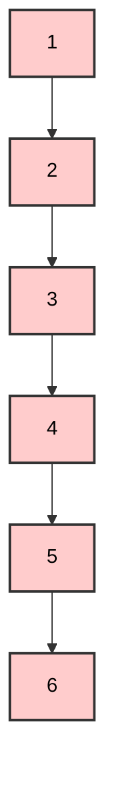
- Height: **5** (worst case)
- Complexity: **O(n)**

**Balanced AVL**:
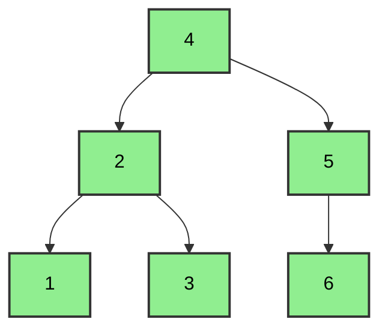
- Height: **2** (best case)
- Complexity: **O(log n)**

---

## Balance Factor

### Definition

The **Balance Factor (BF)** for each node is calculated as:

**BF = Height(Left Subtree) - Height(Right Subtree)**

### AVL Rule

For a tree to be **AVL balanced**, every node must have:

**BF ∈ {-1, 0, +1}**

### BF Calculation Example

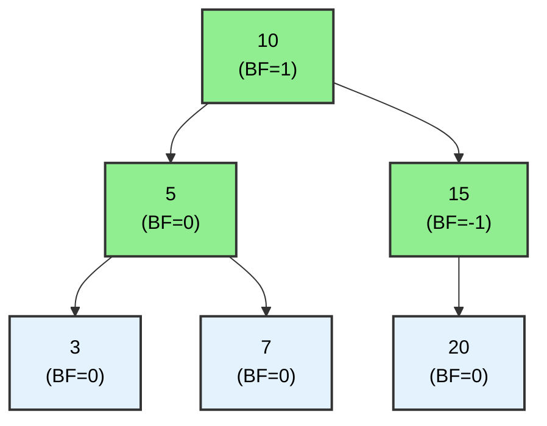

**Calculations**:
- **Node 3**: BF = 0 - 0 = **0** (leaf)
- **Node 7**: BF = 0 - 0 = **0** (leaf)
- **Node 20**: BF = 0 - 0 = **0** (leaf)
- **Node 5**: BF = 1 - 1 = **0** (has two children of equal height)
- **Node 15**: BF = 0 - 1 = **-1** (right subtree taller)
- **Node 10**: BF = 2 - 1 = **+1** (left subtree taller)

 **All nodes have BF ∈ {-1, 0, +1}** → Balanced AVL!

### Unbalanced Example

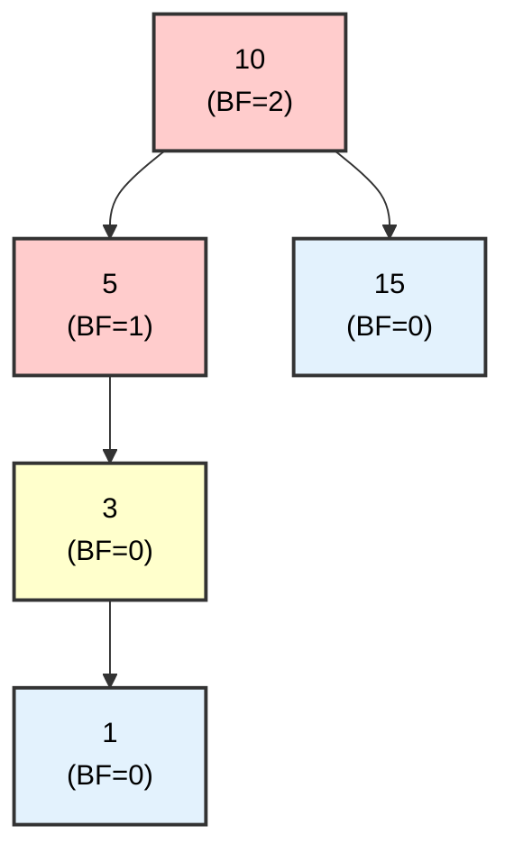

**Calculations**:
- **Node 10**: BF = 3 - 1 = **+2**  (violation!)
- **Node 5**: BF = 2 - 0 = **+1** 
- **Node 3**: BF = 1 - 0 = **+1** 

 **Node 10 has BF = +2** → **Rebalancing** needed!

---

## Rotations

Rotations are the **fundamental operations** for rebalancing an AVL tree. There are **4 types**:

### 1. Right Rotation (RR)

**When used**: When the **left-left** subtree causes imbalance.

**Case**: BF(node) = **+2** and BF(left child) = **+1**

#### Example:

**Before Rotation**:
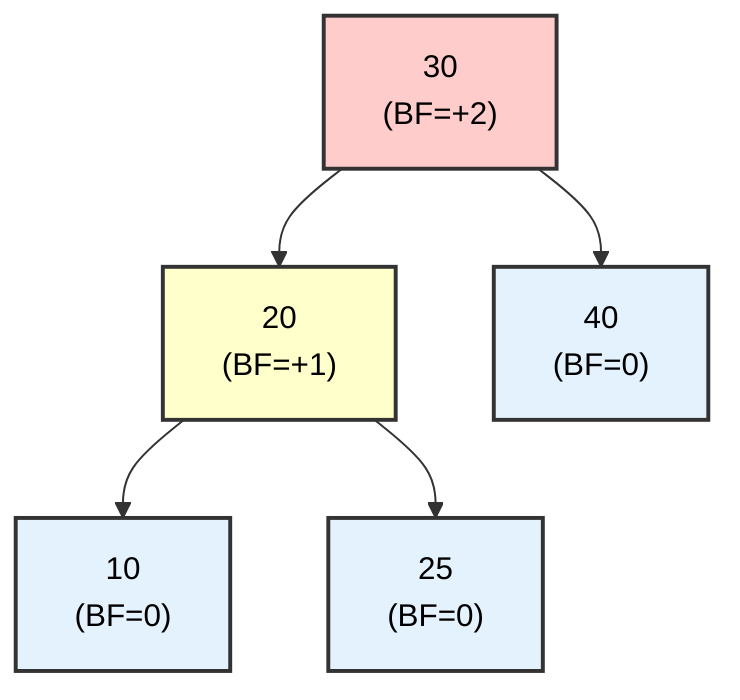

**After Right Rotation**:
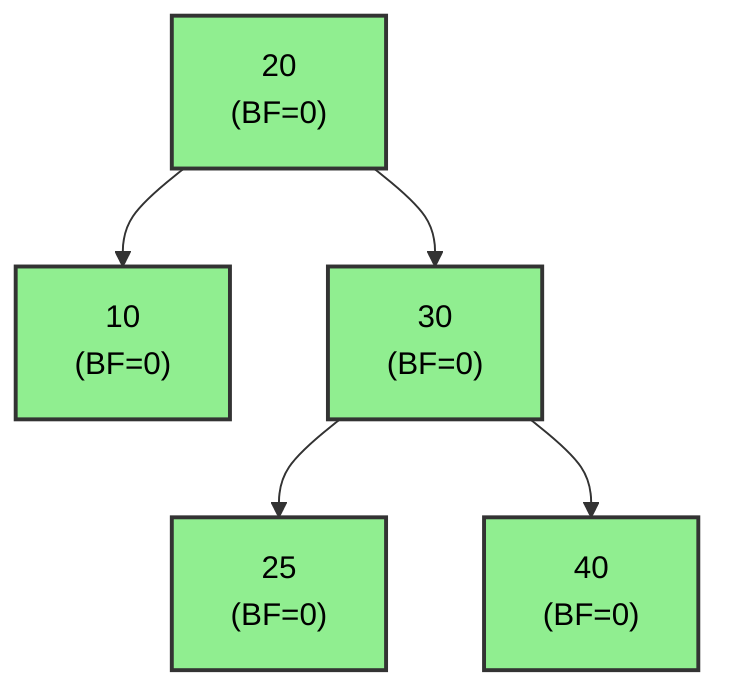

**Mechanism**:
1. Node **20 moves up** to the position of 30
2. Node **30 moves down** as the right child of 20
3. **25 is transferred** as the left child of 30

---

### 2. Left Rotation (LL)

**When used**: When the **right-right** subtree causes imbalance.

**Case**: BF(node) = **-2** and BF(right child) = **-1**

#### Example:

**Before Rotation**:
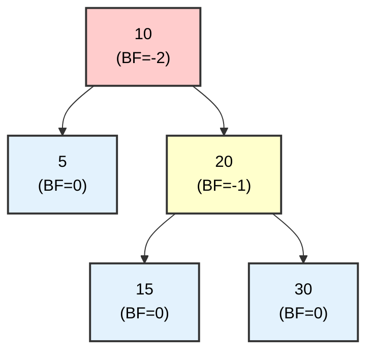

**After Left Rotation**:
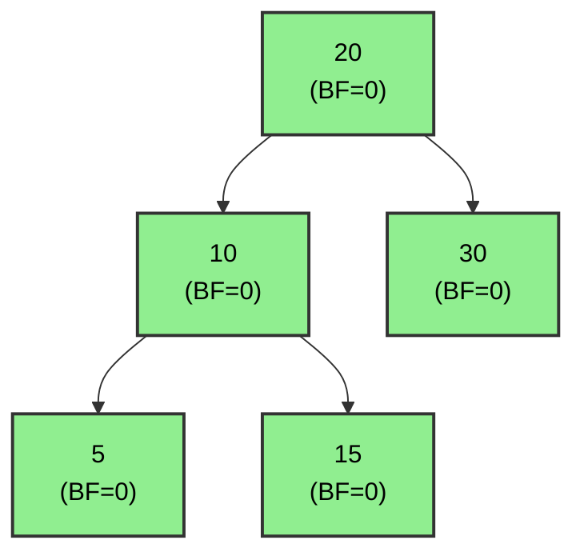

**Mechanism**:
1. Node **20 moves up** to the position of 10
2. Node **10 moves down** as the left child of 20
3. **15 is transferred** as the right child of 10

---

### 3. Left-Right Rotation (LR)

**When used**: When the **left-right** subtree causes imbalance.

**Case**: BF(node) = **+2** and BF(left child) = **-1**

#### Example:

**Before Rotation**:
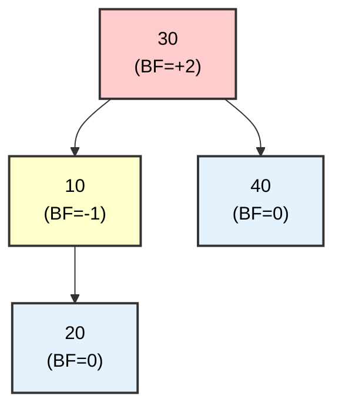

**Step 1: Left Rotation on 10**:
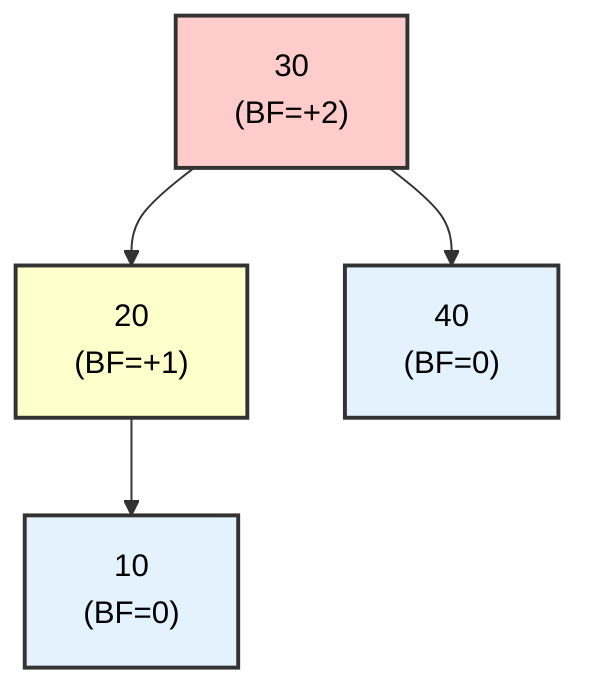

**Step 2: Right Rotation on 30**:
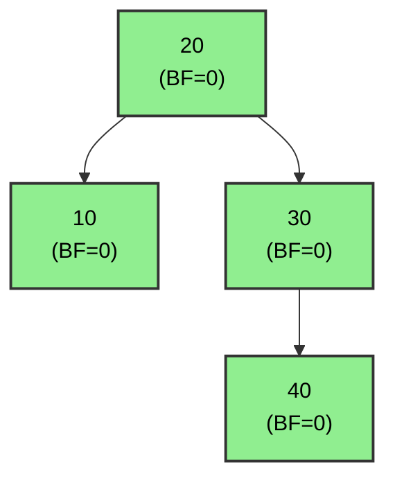

**Process**: **Two rotations**
1. First a **left** rotation on the left child
2. Then a **right** rotation on the node

---

### 4. Right-Left Rotation (RL)

**When used**: When the **right-left** subtree causes imbalance.

**Case**: BF(node) = **-2** and BF(right child) = **+1**

#### Example:

**Before Rotation**:
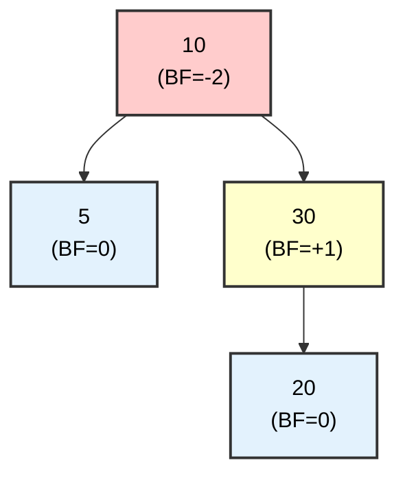

**Step 1: Right Rotation on 30**:
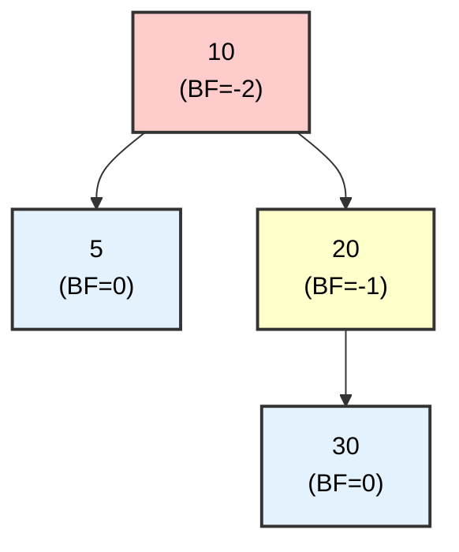

**Step 2: Left Rotation on 10**:
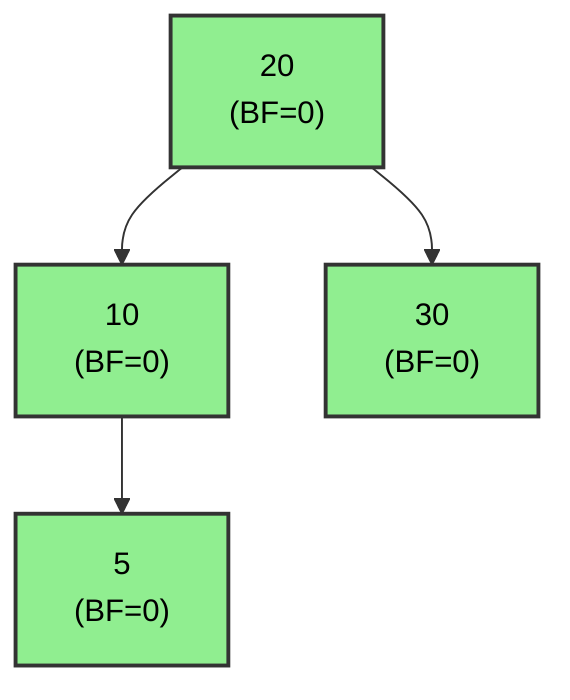

**Process**: **Two rotations**
1. First a **right** rotation on the right child
2. Then a **left** rotation on the node

---

### Rotation Summary

| Type | Prerequisite | Action | Number of Rotations |
|-------|------------|----------|---------------------|
| **Right (RR)** | BF=+2, Left BF=+1 | Right rotation | 1 |
| **Left (LL)** | BF=-2, Right BF=-1 | Left rotation | 1 |
| **Left-Right (LR)** | BF=+2, Left BF=-1 | Left + Right | 2 |
| **Right-Left (RL)** | BF=-2, Right BF=+1 | Right + Left | 2 |

---

## Element Insertion

Insertion into an AVL tree follows these steps:
1. **Insert** as in a simple BST
2. **Recalculate** Balance Factor for all ancestors
3. **Rebalance** if any node has |BF| > 1

---

### Example 1: Simple Insertion (Without Rotation)

**Insertion sequence**: 10, 5, 15

#### Step 1: Insert 10
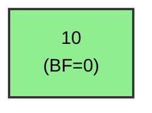

#### Step 2: Insert 5
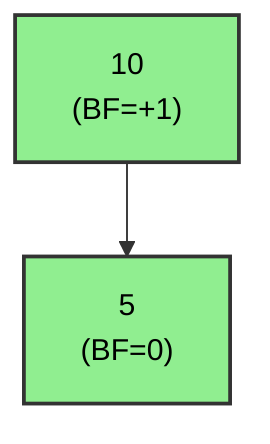

#### Step 3: Insert 15
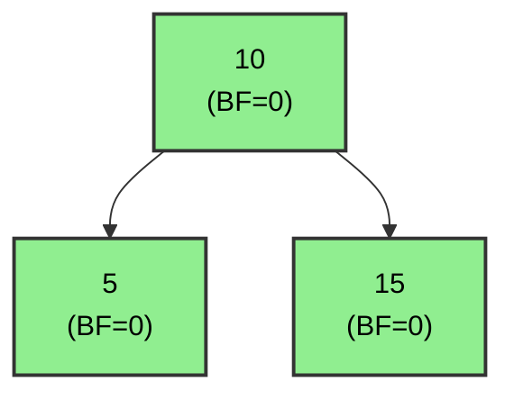

 All BF ∈ {-1, 0, +1} → **No rotation needed**!

---

### Example 2: Insertion with Right Rotation

**Insertion sequence**: 30, 20, 10

#### Step 1: Insert 30
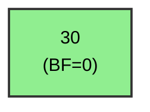

#### Step 2: Insert 20
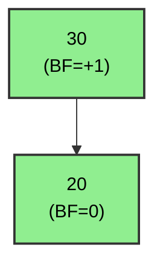

#### Step 3: Insert 10

**Before Rebalancing**:
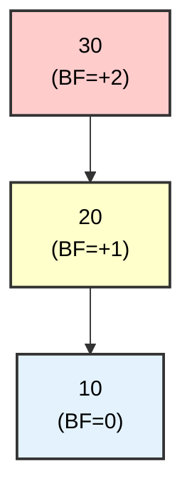

 **Imbalance**: BF(30) = +2 → **Right rotation** needed!

**After Right Rotation**:
```mermaid
graph TD
    A["20<br/>(BF=0)"] --> B["10<br/>(BF=0)"]
    A --> C["30<br/>(BF=0)"]
    
    style A fill:#90EE90,stroke:#333,stroke-width:2px,color:black
    style B fill:#90EE90,stroke:#333,stroke-width:2px,color:black
    style C fill:#90EE90,stroke:#333,stroke-width:2px,color:black
```

 **Balanced**!

---

### Example 3: Insertion with Left-Right Rotation

**Insertion sequence**: 30, 10, 20

#### Step 1-2: Insert 30, 10
```mermaid
graph TD
    A["30<br/>(BF=+1)"] --> B["10<br/>(BF=0)"]
    
    style A fill:#90EE90,stroke:#333,stroke-width:2px,color:black
    style B fill:#90EE90,stroke:#333,stroke-width:2px,color:black
```

#### Step 3: Insert 20

**Before Rebalancing**:
```mermaid
graph TD
    A["30<br/>(BF=+2)"] --> B["10<br/>(BF=-1)"]
    B --> C["20<br/>(BF=0)"]
    
    style A fill:#ffcccc,stroke:#333,stroke-width:2px,color:black
    style B fill:#ffffcc,stroke:#333,stroke-width:2px,color:black
    style C fill:#e3f2fd,stroke:#333,stroke-width:2px,color:black
```

 **Imbalance**: BF(30) = +2, BF(10) = -1 → **Left-Right rotation**!

**Step 3.1: Left Rotation on 10**:
```mermaid
graph TD
    A["30<br/>(BF=+2)"] --> B["20<br/>(BF=+1)"]
    B --> C["10<br/>(BF=0)"]
    
    style A fill:#ffcccc,stroke:#333,stroke-width:2px,color:black
    style B fill:#ffffcc,stroke:#333,stroke-width:2px,color:black
    style C fill:#e3f2fd,stroke:#333,stroke-width:2px,color:black
```

**Step 3.2: Right Rotation on 30**:
```mermaid
graph TD
    A["20<br/>(BF=0)"] --> B["10<br/>(BF=0)"]
    A --> C["30<br/>(BF=0)"]
    
    style A fill:#90EE90,stroke:#333,stroke-width:2px,color:black
    style B fill:#90EE90,stroke:#333,stroke-width:2px,color:black
    style C fill:#90EE90,stroke:#333,stroke-width:2px,color:black
```

 **Balanced**!

---

### Example 4: Complex Insertion

**Insertion sequence**: 50, 25, 75, 10, 30, 60, 80, 5, 15

#### Final Tree (After all insertions):

```mermaid
graph TD
    A["50<br/>(BF=0)"] --> B["25<br/>(BF=0)"]
    A --> C["75<br/>(BF=0)"]
    B --> D["10<br/>(BF=0)"]
    B --> E["30<br/>(BF=0)"]
    C --> F["60<br/>(BF=0)"]
    C --> G["80<br/>(BF=0)"]
    D --> H["5<br/>(BF=0)"]
    D --> I["15<br/>(BF=0)"]
    
    style A fill:#90EE90,stroke:#333,stroke-width:2px,color:black
    style B fill:#90EE90,stroke:#333,stroke-width:2px,color:black
    style C fill:#90EE90,stroke:#333,stroke-width:2px,color:black
    style D fill:#90EE90,stroke:#333,stroke-width:2px,color:black
    style E fill:#90EE90,stroke:#333,stroke-width:2px,color:black
    style F fill:#90EE90,stroke:#333,stroke-width:2px,color:black
    style G fill:#90EE90,stroke:#333,stroke-width:2px,color:black
    style H fill:#90EE90,stroke:#333,stroke-width:2px,color:black
    style I fill:#90EE90,stroke:#333,stroke-width:2px,color:black
```

**Characteristics**:
- Height: **3**
- All BF = **0**
- Fully balanced AVL tree

---

### Example 5: Insertion Requiring Multiple Rotations

**Insertion**: 1, 2, 3, 4, 5, 6, 7

#### Process:

**After 1, 2, 3** (Left rotation):
```mermaid
graph TD
    A["2<br/>(BF=0)"] --> B["1<br/>(BF=0)"]
    A --> C["3<br/>(BF=0)"]
    
    style A fill:#90EE90,stroke:#333,stroke-width:2px,color:black
    style B fill:#90EE90,stroke:#333,stroke-width:2px,color:black
    style C fill:#90EE90,stroke:#333,stroke-width:2px,color:black
```

**After 4** (Left rotation):
```mermaid
graph TD
    A["2<br/>(BF=-1)"] --> B["1<br/>(BF=0)"]
    A --> C["3<br/>(BF=-1)"]
    C --> D["4<br/>(BF=0)"]
    
    style A fill:#90EE90,stroke:#333,stroke-width:2px,color:black
    style B fill:#90EE90,stroke:#333,stroke-width:2px,color:black
    style C fill:#90EE90,stroke:#333,stroke-width:2px,color:black
    style D fill:#90EE90,stroke:#333,stroke-width:2px,color:black
```

**After 5** (Left Rotation, followed by restructuring):
```mermaid
graph TD
    A["2<br/>(BF=-1)"] --> B["1<br/>(BF=0)"]
    A --> C["4<br/>(BF=0)"]
    C --> D["3<br/>(BF=0)"]
    C --> E["5<br/>(BF=0)"]
    
    style A fill:#90EE90,stroke:#333,stroke-width:2px,color:black
    style B fill:#90EE90,stroke:#333,stroke-width:2px,color:black
    style C fill:#90EE90,stroke:#333,stroke-width:2px,color:black
    style D fill:#90EE90,stroke:#333,stroke-width:2px,color:black
    style E fill:#90EE90,stroke:#333,stroke-width:2px,color:black
```

**Final (After 6, 7)**:
```mermaid
graph TD
    A["4<br/>(BF=0)"] --> B["2<br/>(BF=0)"]
    A --> C["6<br/>(BF=0)"]
    B --> D["1<br/>(BF=0)"]
    B --> E["3<br/>(BF=0)"]
    C --> F["5<br/>(BF=0)"]
    C --> G["7<br/>(BF=0)"]
    
    style A fill:#90EE90,stroke:#333,stroke-width:2px,color:black
    style B fill:#90EE90,stroke:#333,stroke-width:2px,color:black
    style C fill:#90EE90,stroke:#333,stroke-width:2px,color:black
    style D fill:#90EE90,stroke:#333,stroke-width:2px,color:black
    style E fill:#90EE90,stroke:#333,stroke-width:2px,color:black
    style F fill:#90EE90,stroke:#333,stroke-width:2px,color:black
    style G fill:#90EE90,stroke:#333,stroke-width:2px,color:black
```

 **Note**: The same sequence (1-7) in a simple BST would produce a linear list!

---

## Element Deletion

Deletion from an AVL tree:
1. **Delete** as in a simple BST
2. **Recalculate** BF for all ancestors
3. **Rebalance** where needed (multiple rotations may be required)

---

### Example 6: Leaf Deletion

**Initial Tree**:
```mermaid
graph TD
    A["20<br/>(BF=0)"] --> B["10<br/>(BF=0)"]
    A --> C["30<br/>(BF=0)"]
    B --> D["5<br/>(BF=0)"]
    B --> E["15<br/>(BF=0)"]
    C --> F["25<br/>(BF=0)"]
    C --> G["35<br/>(BF=0)"]
    
    style A fill:#90EE90,stroke:#333,stroke-width:2px,color:black
    style B fill:#90EE90,stroke:#333,stroke-width:2px,color:black
    style C fill:#90EE90,stroke:#333,stroke-width:2px,color:black
    style D fill:#90EE90,stroke:#333,stroke-width:2px,color:black
    style E fill:#90EE90,stroke:#333,stroke-width:2px,color:black
    style F fill:#90EE90,stroke:#333,stroke-width:2px,color:black
    style G fill:#90EE90,stroke:#333,stroke-width:2px,color:black
```

**Deletion of 5**:
```mermaid
graph TD
    A["20<br/>(BF=-1)"] --> B["10<br/>(BF=-1)"]
    A --> C["30<br/>(BF=0)"]
    B --> E["15<br/>(BF=0)"]
    C --> F["25<br/>(BF=0)"]
    C --> G["35<br/>(BF=0)"]
    
    style A fill:#90EE90,stroke:#333,stroke-width:2px,color:black
    style B fill:#90EE90,stroke:#333,stroke-width:2px,color:black
    style C fill:#90EE90,stroke:#333,stroke-width:2px,color:black
    style E fill:#90EE90,stroke:#333,stroke-width:2px,color:black
    style F fill:#90EE90,stroke:#333,stroke-width:2px,color:black
    style G fill:#90EE90,stroke:#333,stroke-width:2px,color:black
```

 All BF ∈ {-1, 0, +1} → **No rotation**!

---

### Example 7: Deletion Requiring Rotation

**Initial Tree**:
```mermaid
graph TD
    A["20<br/>(BF=0)"] --> B["10<br/>(BF=0)"]
    A --> C["30<br/>(BF=-1)"]
    B --> D["5<br/>(BF=0)"]
    C --> F["40<br/>(BF=0)"]
    
    style A fill:#90EE90,stroke:#333,stroke-width:2px,color:black
    style B fill:#90EE90,stroke:#333,stroke-width:2px,color:black
    style C fill:#90EE90,stroke:#333,stroke-width:2px,color:black
    style D fill:#90EE90,stroke:#333,stroke-width:2px,color:black
    A["20<br/>(BF=-1)"] --> B["10<br/>(BF=0)"]
    A --> C["30<br/>(BF=-1)"]
    C --> F["40<br/>(BF=0)"]
    
    style A fill:#90EE90,stroke:#333,stroke-width:2px,color:black
    style B fill:#90EE90,stroke:#333,stroke-width:2px,color:black
    style C fill:#90EE90,stroke:#333,stroke-width:2px,color:black
    style F fill:#90EE90,stroke:#333,stroke-width:2px,color:black
```

**Deletion of 10**:

**Before Rebalancing**:
```mermaid
graph TD
    A["20<br/>(BF=-2)"] --> C["30<br/>(BF=-1)"]
    C --> F["40<br/>(BF=0)"]
    
    style A fill:#ffcccc,stroke:#333,stroke-width:2px,color:black
    style C fill:#ffffcc,stroke:#333,stroke-width:2px,color:black
    style F fill:#e3f2fd,stroke:#333,stroke-width:2px,color:black
```

 **Imbalance**: BF(20) = -2 → **Left rotation**!

**After Left Rotation**:
```mermaid
graph TD
    A["30<br/>(BF=0)"] --> B["20<br/>(BF=0)"]
    A --> C["40<br/>(BF=0)"]
    
    style A fill:#90EE90,stroke:#333,stroke-width:2px,color:black
    style B fill:#90EE90,stroke:#333,stroke-width:2px,color:black
    style C fill:#90EE90,stroke:#333,stroke-width:2px,color:black
```

 **Balanced**!

---

### Example 8: Deletion with Double Rotation

**Initial Tree**:
```mermaid
graph TD
    A["20<br/>(BF=-1)"] --> B["10<br/>(BF=0)"]
    A --> C["30<br/>(BF=+1)"]
    C --> E["25<br/>(BF=0)"]
    
    style A fill:#90EE90,stroke:#333,stroke-width:2px,color:black
    style B fill:#90EE90,stroke:#333,stroke-width:2px,color:black
    style C fill:#90EE90,stroke:#333,stroke-width:2px,color:black
    style E fill:#90EE90,stroke:#333,stroke-width:2px,color:black
```

**Deletion of 10**:

**Before Rebalancing**:
```mermaid
graph TD
    A["20<br/>(BF=-2)"] --> C["30<br/>(BF=+1)"]
    C --> E["25<br/>(BF=0)"]
    
    style A fill:#ffcccc,stroke:#333,stroke-width:2px,color:black
    style C fill:#ffffcc,stroke:#333,stroke-width:2px,color:black
    style E fill:#e3f2fd,stroke:#333,stroke-width:2px,color:black
```

 **Imbalance**: BF(20) = -2, BF(30) = +1 → **Right-Left rotation**!

**Step 1: Right Rotation on 30**:
```mermaid
graph TD
    A["20<br/>(BF=-2)"] --> C["25<br/>(BF=-1)"]
    C --> E["30<br/>(BF=0)"]
    
    style A fill:#ffcccc,stroke:#333,stroke-width:2px,color:black
    style C fill:#ffffcc,stroke:#333,stroke-width:2px,color:black
    style E fill:#e3f2fd,stroke:#333,stroke-width:2px,color:black
```

**Step 2: Left Rotation on 20**:
```mermaid
graph TD
    A["25<br/>(BF=0)"] --> B["20<br/>(BF=0)"]
    A --> C["30<br/>(BF=0)"]
    
    style A fill:#90EE90,stroke:#333,stroke-width:2px,color:black
    style B fill:#90EE90,stroke:#333,stroke-width:2px,color:black
    style C fill:#90EE90,stroke:#333,stroke-width:2px,color:black
```

 **Balanced**!

---

### Example 9: Deletion of Node with 2 Children

**Initial Tree**:
```mermaid
graph TD
    A["30<br/>(BF=0)"] --> B["20<br/>(BF=0)"]
    A --> C["40<br/>(BF=0)"]
    B --> D["10<br/>(BF=0)"]
    B --> E["25<br/>(BF=0)"]
    C --> F["35<br/>(BF=0)"]
    C --> G["50<br/>(BF=0)"]
    
    style A fill:#90EE90,stroke:#333,stroke-width:2px,color:black
    style B fill:#90EE90,stroke:#333,stroke-width:2px,color:black
    style C fill:#90EE90,stroke:#333,stroke-width:2px,color:black
    style D fill:#90EE90,stroke:#333,stroke-width:2px,color:black
    style E fill:#90EE90,stroke:#333,stroke-width:2px,color:black
    style F fill:#90EE90,stroke:#333,stroke-width:2px,color:black
    style G fill:#90EE90,stroke:#333,stroke-width:2px,color:black
```

**Deletion of 20** (Replacement with in-order successor: 25):

**After Deletion**:
```mermaid
graph TD
    A["30<br/>(BF=0)"] --> B["25<br/>(BF=+1)"]
    A --> C["40<br/>(BF=0)"]
    B --> D["10<br/>(BF=0)"]
    C --> F["35<br/>(BF=0)"]
    C --> G["50<br/>(BF=0)"]
    
    style A fill:#90EE90,stroke:#333,stroke-width:2px,color:black
    style B fill:#90EE90,stroke:#333,stroke-width:2px,color:black
    style C fill:#90EE90,stroke:#333,stroke-width:2px,color:black
    style D fill:#90EE90,stroke:#333,stroke-width:2px,color:black
    style F fill:#90EE90,stroke:#333,stroke-width:2px,color:black
    style G fill:#90EE90,stroke:#333,stroke-width:2px,color:black
```

 All BF ∈ {-1, 0, +1} → **No rotation**!

---

## Practical Examples

### Example 10: AVL vs BST Comparison for the Same Sequence

**Insertion**: 10, 20, 30, 40, 50, 60

#### Simple BST (Without Balancing):
```mermaid
graph TD
    A[10] --> B[20]
    B --> C[30]
    C --> D[40]
    D --> E[50]
    E --> F[60]
    
    style A fill:#ffcccc,stroke:#333,stroke-width:2px,color:black
    style B fill:#ffcccc,stroke:#333,stroke-width:2px,color:black
    style C fill:#ffcccc,stroke:#333,stroke-width:2px,color:black
    style D fill:#ffcccc,stroke:#333,stroke-width:2px,color:black
    style E fill:#ffcccc,stroke:#333,stroke-width:2px,color:black
    style F fill:#ffcccc,stroke:#333,stroke-width:2px,color:black
```

- **Height**: 5
- **Search 60**: 6 comparisons
- **Complexity**: O(n)

#### AVL Tree (With Automatic Balancing):
```mermaid
graph TD
    A["40<br/>(BF=0)"] --> B["20<br/>(BF=0)"]
    A --> C["50<br/>(BF=-1)"]
    B --> D["10<br/>(BF=0)"]
    B --> E["30<br/>(BF=0)"]
    C --> F["60<br/>(BF=0)"]
    
    style A fill:#90EE90,stroke:#333,stroke-width:2px,color:black
    style B fill:#90EE90,stroke:#333,stroke-width:2px,color:black
    style C fill:#90EE90,stroke:#333,stroke-width:2px,color:black
    style D fill:#90EE90,stroke:#333,stroke-width:2px,color:black
    style E fill:#90EE90,stroke:#333,stroke-width:2px,color:black
    style F fill:#90EE90,stroke:#333,stroke-width:2px,color:black
```

- **Height**: 2
- **Search 60**: 3 comparisons
- **Complexity**: O(log n)

 **Performance**: AVL is **2x faster** in this example!

---

### Example 11: Rotations During Insertion

**Insertion**: 3, 2, 1

#### Evolution:

**After 3, 2**:
```mermaid
graph TD
    A["3<br/>(BF=+1)"] --> B["2<br/>(BF=0)"]
    
    style A fill:#90EE90,stroke:#333,stroke-width:2px,color:black
    style B fill:#90EE90,stroke:#333,stroke-width:2px,color:black
```

**After 1 (Before Rotation)**:
```mermaid
graph TD
    A["3<br/>(BF=+2)"] --> B["2<br/>(BF=+1)"]
    B --> C["1<br/>(BF=0)"]
    
    style A fill:#ffcccc,stroke:#333,stroke-width:2px,color:black
    style B fill:#ffffcc,stroke:#333,stroke-width:2px,color:black
    style C fill:#e3f2fd,stroke:#333,stroke-width:2px,color:black
```

**After Right Rotation**:
```mermaid
graph TD
    A["2<br/>(BF=0)"] --> B["1<br/>(BF=0)"]
    A --> C["3<br/>(BF=0)"]
    
    style A fill:#90EE90,stroke:#333,stroke-width:2px,color:black
    style B fill:#90EE90,stroke:#333,stroke-width:2px,color:black
    style C fill:#90EE90,stroke:#333,stroke-width:2px,color:black
```

---

### Example 12: Complete Process

**Insertion**: 50, 30, 70, 20, 40, 60, 80, 10

#### Final AVL Tree:

```mermaid
graph TD
    A["50<br/>(BF=+1)"] --> B["30<br/>(BF=+1)"]
    A --> C["70<br/>(BF=0)"]
    B --> D["20<br/>(BF=+1)"]
    B --> E["40<br/>(BF=0)"]
    C --> F["60<br/>(BF=0)"]
    C --> G["80<br/>(BF=0)"]
    D --> H["10<br/>(BF=0)"]
    
    style A fill:#90EE90,stroke:#333,stroke-width:2px,color:black
    style B fill:#90EE90,stroke:#333,stroke-width:2px,color:black
    style C fill:#90EE90,stroke:#333,stroke-width:2px,color:black
    style D fill:#90EE90,stroke:#333,stroke-width:2px,color:black
    style E fill:#90EE90,stroke:#333,stroke-width:2px,color:black
    style F fill:#90EE90,stroke:#333,stroke-width:2px,color:black
    style G fill:#90EE90,stroke:#333,stroke-width:2px,color:black
    style H fill:#90EE90,stroke:#333,stroke-width:2px,color:black
```

**Characteristics**:
- **Height**: 3
- **Number of nodes**: 8
- **Balanced**: All BF ∈ {-1, 0, +1} 

**Deletion of 70 and Rebalancing**:

```mermaid
graph TD
    A["50<br/>(BF=+1)"] --> B["30<br/>(BF=+1)"]
    A --> C["80<br/>(BF=+1)"]
    B --> D["20<br/>(BF=+1)"]
    B --> E["40<br/>(BF=0)"]
    C --> F["60<br/>(BF=0)"]
    D --> H["10<br/>(BF=0)"]
    
    style A fill:#90EE90,stroke:#333,stroke-width:2px,color:black
    style B fill:#90EE90,stroke:#333,stroke-width:2px,color:black
    style C fill:#90EE90,stroke:#333,stroke-width:2px,color:black
    style D fill:#90EE90,stroke:#333,stroke-width:2px,color:black
    style E fill:#90EE90,stroke:#333,stroke-width:2px,color:black
    style F fill:#90EE90,stroke:#333,stroke-width:2px,color:black
    style H fill:#90EE90,stroke:#333,stroke-width:2px,color:black
```

 **Remains balanced**!

---

## Summary

### AVL Advantages

 **Guaranteed Performance**: O(log n) for search, insertion, deletion  
 **Automatic Balancing**: No manual restructuring required  
 **Predictable Behavior**: Never degenerates into a list

### AVL Disadvantages

 **Extra Memory**: Requires storage of BF for each node  
 **Complexity**: More rotations than Red-Black trees  
 **Insertion Overhead**: Each insertion may require rotations

### Operation Complexity

| Operation | Complexity | Notes |
|------------|---------------|------------|
| **Search** | O(log n) | Guaranteed |
| **Insertion** | O(log n) | Plus rotation cost |
| **Deletion** | O(log n) | May require > 1 rotation |
| **Find Min/Max** | O(log n) | Tree height |

### Comparison with Other Structures

| Structure | Average Search | Worst-case Search | Balancing |
|------|----------------|---------------------|------------|
| **BST** | O(log n) | O(n) | None |
| **AVL** | O(log n) | O(log n) | Strict |
| **Red-Black** | O(log n) | O(log n) | Relaxed |

### Balance Factor Rules

| BF Value | State | Action |
|---------|-----------|----------|
| **0** | Balanced | None |
| **+1** | Left taller | None |
| **-1** | Right taller | None |
| **+2** | Imbalance | Right or LR rotation |
| **-2** | Imbalance | Left or RL rotation |

### Rotation Types - Summary

```mermaid
graph TD
    A["Imbalance<br/>Detected"] --> B{"BF = ?"}
    B -->|"+2"| C{"BF(Left) = ?"}
    B -->|"-2"| D{"BF(Right) = ?"}
    C -->|"+1"| E["Right Rotation<br/>(RR)"]
    C -->|"-1"| F["Left-Right<br/>(LR)"]
    D -->|"-1"| G["Left Rotation<br/>(LL)"]
    D -->|"+1"| H["Right-Left<br/>(RL)"]
    
    style A fill:#ffcccc,stroke:#333,stroke-width:2px,color:black
    style E fill:#90EE90,stroke:#333,stroke-width:2px,color:black
    style F fill:#90EE90,stroke:#333,stroke-width:2px,color:black
    style G fill:#90EE90,stroke:#333,stroke-width:2px,color:black
    style H fill:#90EE90,stroke:#333,stroke-width:2px,color:black
```

---

## Key Takeaways

1. **AVL ≠ BST**: AVL maintains strict balance at every operation
2. **|BF| ≤ 1**: The fundamental rule that guarantees O(log n)
3. **4 Rotation Types**: RR, LL, LR, RL cover all cases
4. **Double Rotations**: LR and RL are used when imbalance is "zig-zag"
5. **Insertion vs Deletion**: Deletion may require more rotations
