# Binary Trees: Traversal, Insertion, Deletion

## Contents
1. [Introduction to Binary Trees](#introduction-to-binary-trees)
2. [Traversal (Traversal)](#traversal)
3. [Inserting Elements](#inserting-elements)
4. [Deleting Elements](#deleting-elements)
5. [Practical Examples](#practical-examples)

---

## Introduction to Binary Trees

### What is a Binary Tree?
A **binary tree** is a hierarchical data structure where each node has **at most two children**: left and right.

### Basic Terminology
- **Root**: The topmost node of the tree
- **Leaf**: A node without children
- **Internal Node**: A node with at least one child
- **Parent**: A node that has children
- **Height**: The maximum path length from root to leaf
- **Depth**: The path length from root to a specific node
- **Level**: A group of nodes at the same depth

### Example of a Basic Binary Tree

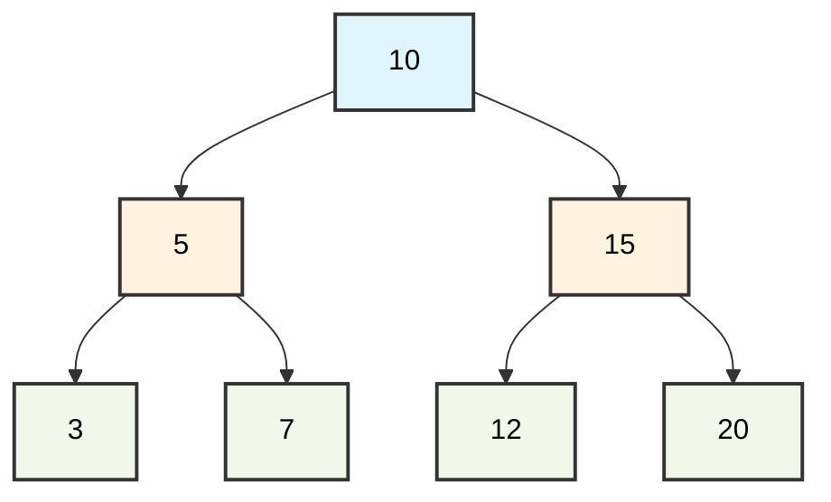

**Characteristics**:
- Root: 10
- Leaves: 3, 7, 12, 20
- Height: 2
- Internal nodes: 10, 5, 15

---

## Traversal

Traversal is the systematic visiting of all nodes of a tree. There are **four basic methods**.

### 1. Pre-order (Pre-order): Root -> Left -> Right

**Algorithm**:
1. Visit the root
2. Traverse the left subtree
3. Traverse the right subtree

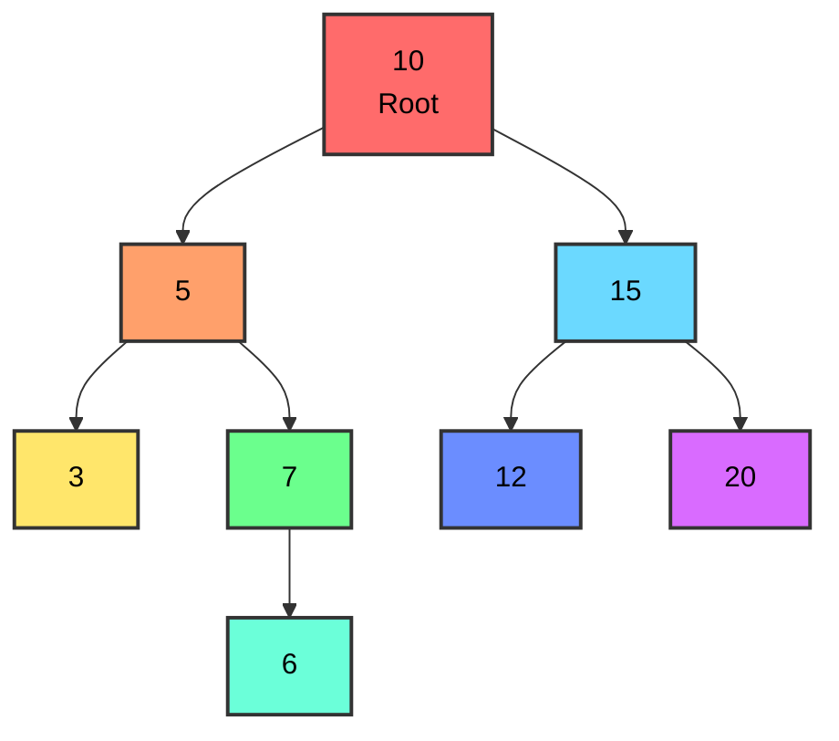

**Traversal Result**: 10, 5, 3, 7, 6, 15, 12, 20

**Use**: Creating a copy of a tree, computing prefix expressions

---

### 2. In-order (In-order): Left -> Root -> Right

**Algorithm**:
1. Traverse the left subtree
2. Visit the root
3. Traverse the right subtree

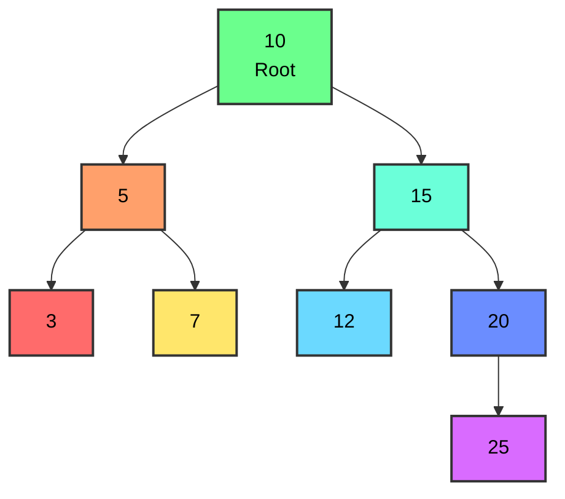

**Traversal Result**: 3, 5, 7, 10, 12, 15, 20, 25

 **Important**: In **Binary Search Trees (BST)**, in-order traversal returns elements in **ascending sorted order**!

**Use**: Sorting BST elements, computing infix expressions

---

### 3. Post-order (Post-order): Left -> Right -> Root

**Algorithm**:
1. Traverse the left subtree
2. Traverse the right subtree
3. Visit the root

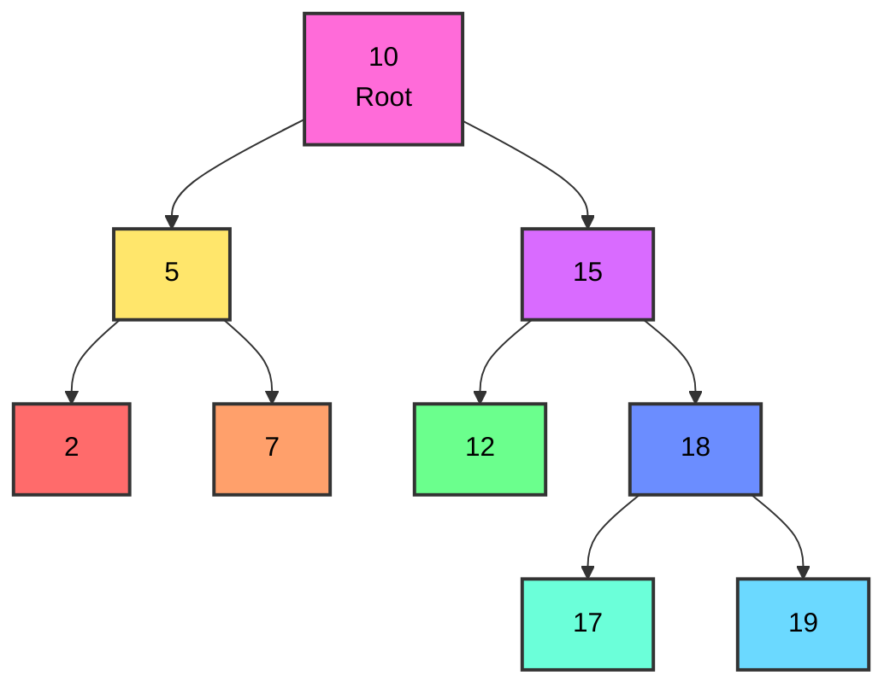

**Traversal Result**: 2, 7, 5, 12, 17, 19, 18, 15, 10

**Use**: Deleting a tree, computing postfix expressions

---

### 4. Level-order (Level-order / BFS)

**Algorithm**:
We visit all nodes **level-by-level**, from left to right.

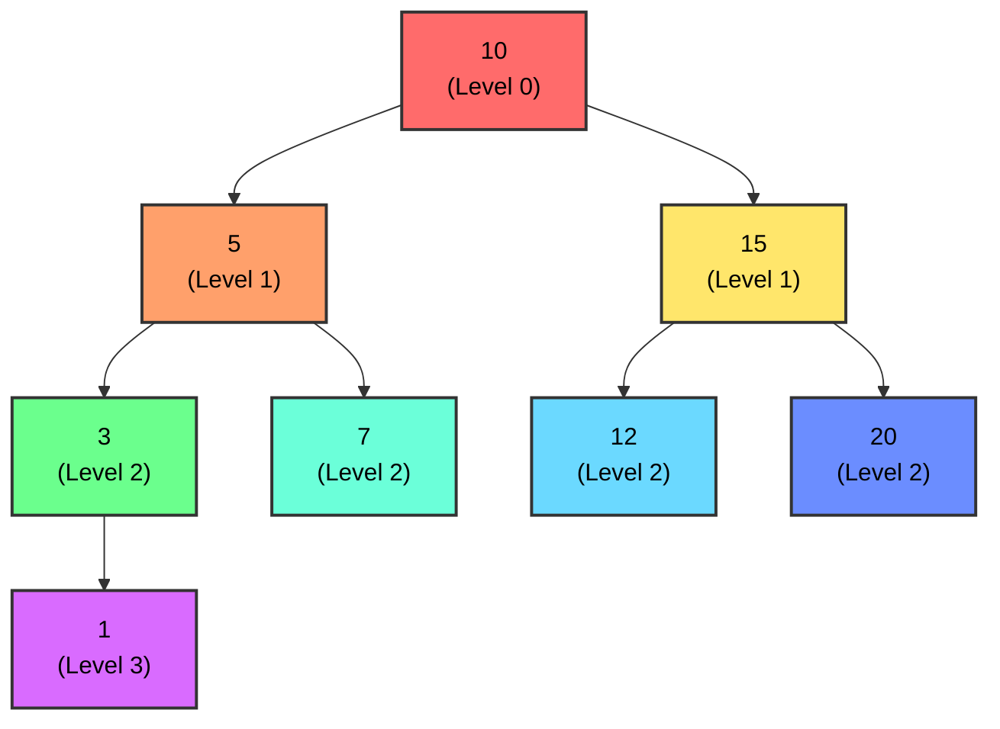

**Traversal Result**: 10, 5, 15, 3, 7, 12, 20, 1

**Use**: Finding shortest path, printing a tree by level

---

### Comparison of Traversal Methods

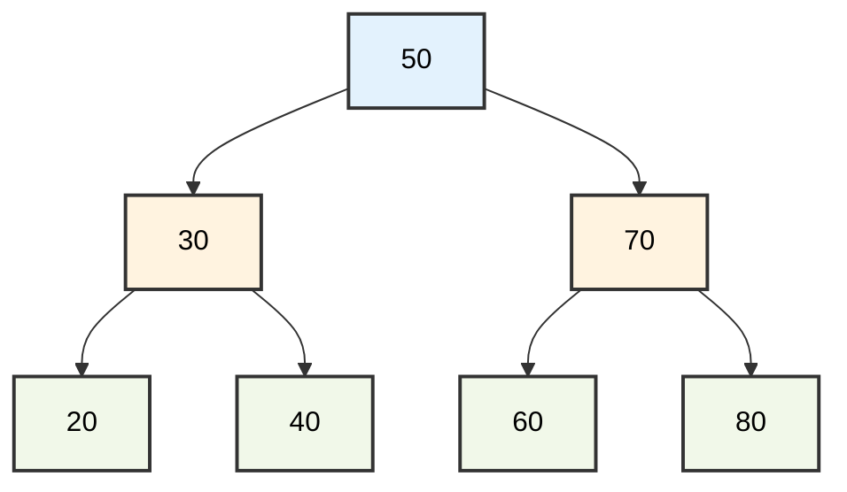

| Method | Result | Use |
|---------|------------|-------|
| **Pre-order** | 50, 30, 20, 40, 70, 60, 80 | Copying a tree |
| **In-order** | 20, 30, 40, 50, 60, 70, 80 | Sorting (BST) |
| **Post-order** | 20, 40, 30, 60, 80, 70, 50 | Deleting a tree |
| **Level-order** | 50, 30, 70, 20, 40, 60, 80 | Breadth-first search |

---

## Inserting Elements

### Binary Search Tree (BST)

**BST Property**: For each node:
- All elements in the **left** subtree are **smaller**
- All elements in the **right** subtree are **larger**

---

### Example 1: Insertion into an Empty Tree

**Insert: 8**

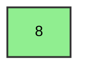

 The first element automatically becomes the **root** of the tree.

---

### Example 2: Step-by-step Insertion of Multiple Elements

**Insertion Sequence**: 8, 3, 10, 1, 6, 14, 4

#### Step 1: Insert 8
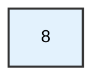

#### Step 2: Insert 3
- 3 < 8 -> **left**

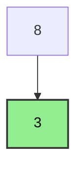

#### Step 3: Insert 10
- 10 > 8 -> **right**

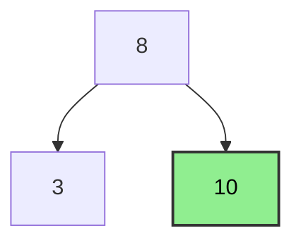

#### Step 4: Insert 1
- 1 < 8 -> left
- 1 < 3 -> **left**

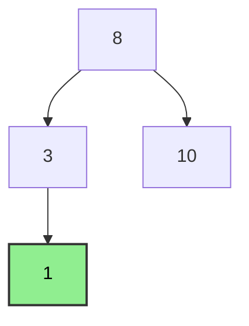

#### Step 5: Insert 6
- 6 < 8 -> left
- 6 > 3 -> **right**

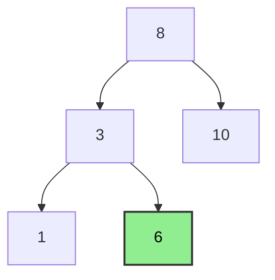

#### Step 6: Insert 14
- 14 > 8 -> right
- 14 > 10 -> **right**

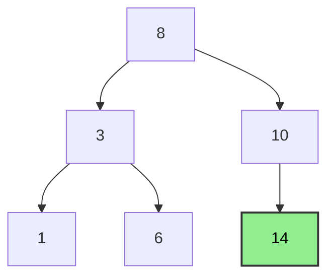

#### Step 7: Insert 4
- 4 < 8 -> left
- 4 > 3 -> right
- 4 < 6 -> **left**

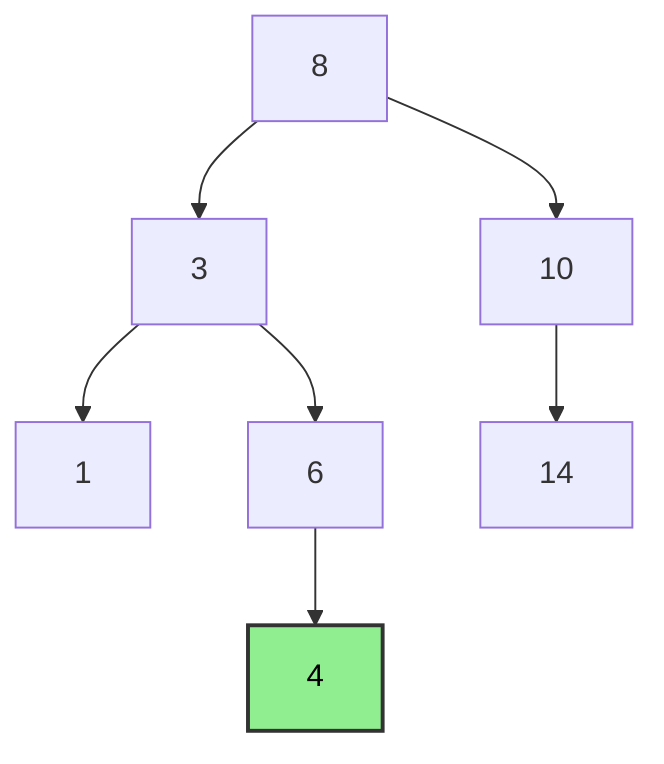

**Final Tree**:
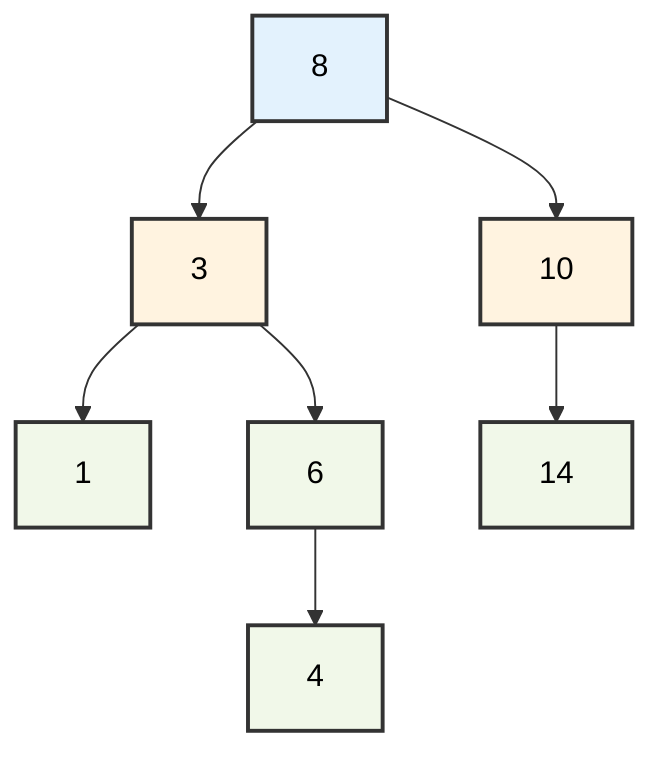

---

### Example 3: Different Insertion Order

**Insertion Sequence**: 15, 10, 20, 8, 12, 25, 6

#### Complete Process:

**Paths**:
- **15**: Root (empty tree)
- **10**: 10 < 15 -> left
- **20**: 20 > 15 -> right
- **8**: 8 < 15 -> left, 8 < 10 -> left
- **12**: 12 < 15 -> left, 12 > 10 -> right
- **25**: 25 > 15 -> right, 25 > 20 -> right
- **6**: 6 < 15 -> left, 6 < 10 -> left, 6 < 8 -> left

**Final Tree**:
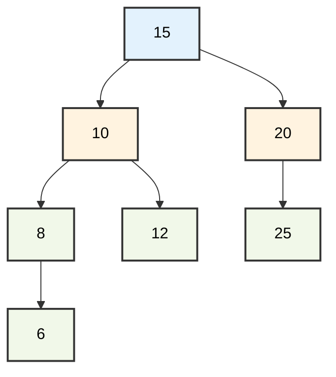

---

### Example 4: Unbalanced Tree Case

**Insertion of Ascending Sequence**: 1, 2, 3, 4, 5, 6

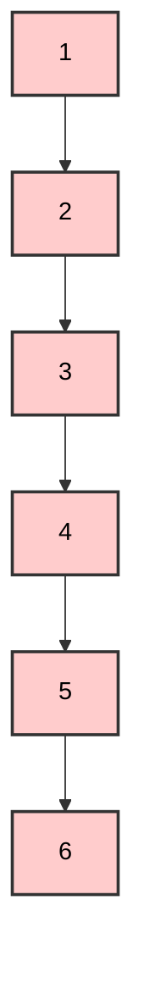

 **Problem**: The tree degenerates into a **linked list**!
- Height = n-1 = 5
- Search complexity: O(n)

---

## Deleting Elements

Deletion has **three cases** depending on the children of the node.

---

### Case 1: Deleting a Leaf (0 Children)

**Rule**: Simply remove the node.

**Example: Deleting 6**

**Before**:
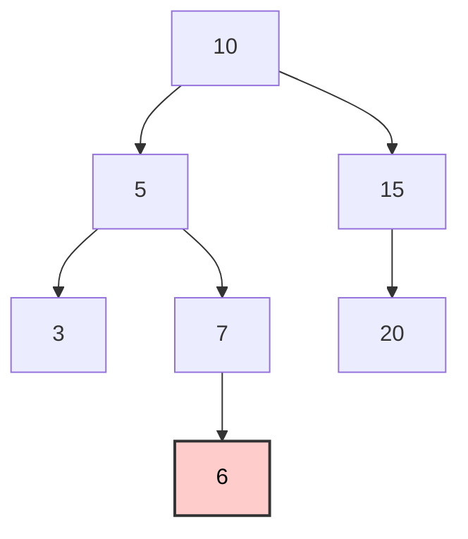

**After**:
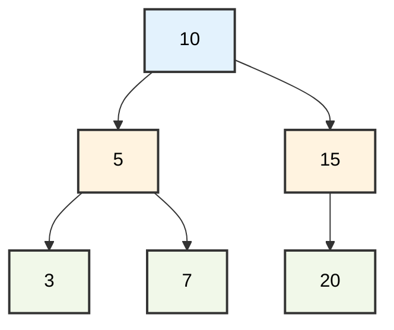

 **Simple process**: We delete with the appropriate parent connection.

---

### Case 2: Deleting a Node with 1 Child

**Rule**: The node is replaced by its single child.

**Example: Deleting 5**

**Before**:
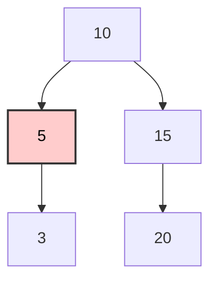

**After**:
```mermaid
graph TD
    A[10] --> D[3]
    A --> C[15]
    C --> F[20]
    
    style A fill:#e3f2fd,stroke:#333,stroke-width:2px,color:black
    style D fill:#90EE90,stroke:#333,stroke-width:2px,color:black
    style C fill:#fff3e0,stroke:#333,stroke-width:2px,color:black
    style F fill:#f1f8e9,stroke:#333,stroke-width:2px,color:black
```

 **3 moves** to the position of 5.

---

### Example with Right Child

**Deleting 15**

**Before**:
```mermaid
graph TD
    A[10] --> B[5]
    A --> C[15]
    B --> D[3]
    B --> E[7]
    C --> F[20]
    
    style C fill:#ffcccc,stroke:#333,stroke-width:2px,color:black
    classDef deleteNode fill:#ffcccc,stroke:#ff0000,stroke-width:3px
    class C deleteNode
```

**After**:
```mermaid
graph TD
    A[10] --> B[5]
    A --> F[20]
    B --> D[3]
    B --> E[7]
    
    style F fill:#90EE90,stroke:#333,stroke-width:2px,color:black
```

 **20 moves** to the position of 15.

---

### Case 3: Deleting a Node with 2 Children

**Method**: We find:
- **In-order Successor** = The smallest element in the **right** subtree, or
- **In-order Predecessor** = The largest element in the **left** subtree

**Example 1: Deleting 10**

**Before**:
```mermaid
graph TD
    A[10] --> B[5]
    A --> C[15]
    B --> D[3]
    B --> E[7]
    C --> F[12]
    C --> G[20]
    
    style A fill:#ffcccc,stroke:#333,stroke-width:2px,color:black
    classDef deleteNode fill:#ffcccc,stroke:#ff0000,stroke-width:3px
    class A deleteNode
```

**Step 1: Find In-order Successor**
- Go **right** (15)
- Then go as far **left** as possible -> **12**

```mermaid
graph TD
    A[10] --> B[5]
    A --> C[15]
    B --> D[3]
    B --> E[7]
    C --> F[12]
    C --> G[20]
    
    style A fill:#ffcccc,stroke:#333,stroke-width:2px,color:black
    style F fill:#90EE90,stroke:#333,stroke-width:2px,color:black
    classDef deleteNode fill:#ffcccc,stroke:#ff0000,stroke-width:3px
    classDef successor fill:#90EE90,stroke:#00ff00,stroke-width:3px
    class A deleteNode
    class F successor
```

**Step 2: Replacement**

```mermaid
graph TD
    A[12] --> B[5]
    A --> C[15]
    B --> D[3]
    B --> E[7]
    C --> G[20]
    
    style A fill:#90EE90,stroke:#333,stroke-width:2px,color:black
```

 **12 replaces** 10!

---

### Example 2: Deleting the Root of a Complex Tree

**Deleting 50**

**Before**:
```mermaid
graph TD
    A[50] --> B[30]
    A --> C[70]
    B --> D[20]
    B --> E[40]
    C --> F[60]
    C --> G[80]
    E --> EA[35]
    E --> EB[45]
    F --> FA[55]
    F --> FB[65]
    
    style A fill:#ffcccc,stroke:#333,stroke-width:2px,color:black
    classDef deleteNode fill:#ffcccc,stroke:#ff0000,stroke-width:3px
    class A deleteNode
```

**Finding In-order Successor**:
- Right subtree: 70
- Leftmost: 60 -> 55 

**After (Replaced with 55)**:
```mermaid
graph TD
    A[55] --> B[30]
    A --> C[70]
    B --> D[20]
    B --> E[40]
    C --> F[60]
    C --> G[80]
    E --> EA[35]
    E --> EB[45]
    F --> FB[65]
    
    style A fill:#90EE90,stroke:#333,stroke-width:2px,color:black
```

---

### Example 3: Using In-order Predecessor

**Deleting 20 (with predecessor)**

**Before**:
```mermaid
graph TD
    A[20] --> B[10]
    A --> C[30]
    B --> D[5]
    B --> E[15]
    E --> EA[12]
    E --> EB[18]
    
    style A fill:#ffcccc,stroke:#333,stroke-width:2px,color:black
```

**Finding In-order Predecessor**:
- Left subtree: 10
- Rightmost: 15 -> 18 

**After**:
```mermaid
graph TD
    A[18] --> B[10]
    A --> C[30]
    B --> D[5]
    B --> E[15]
    E --> EA[12]
    
    style A fill:#90EE90,stroke:#333,stroke-width:2px,color:black
```

---

## Practical Examples

### Example 5: Full Cycle (Insertion -> Traversal -> Deletion)

**Insertion**: 50, 30, 70, 20, 40, 60, 80

**Tree**:
```mermaid
graph TD
    A[50] --> B[30]
    A --> C[70]
    B --> D[20]
    B --> E[40]
    C --> F[60]
    C --> G[80]
    
    style A fill:#e3f2fd,stroke:#333,stroke-width:2px,color:black
    style B fill:#fff3e0,stroke:#333,stroke-width:2px,color:black
    style C fill:#fff3e0,stroke:#333,stroke-width:2px,color:black
    style D fill:#f1f8e9,stroke:#333,stroke-width:2px,color:black
    style E fill:#f1f8e9,stroke:#333,stroke-width:2px,color:black
    style F fill:#f1f8e9,stroke:#333,stroke-width:2px,color:black
    style G fill:#f1f8e9,stroke:#333,stroke-width:2px,color:black
```

**Traversals**:
- **Pre-order**: 50, 30, 20, 40, 70, 60, 80
- **In-order**: 20, 30, 40, 50, 60, 70, 80  (sorted)
- **Post-order**: 20, 40, 30, 60, 80, 70, 50
- **Level-order**: 50, 30, 70, 20, 40, 60, 80

**Delete 30**:
```mermaid
graph TD
    A[50] --> B[40]
    A --> C[70]
    B --> D[20]
    C --> F[60]
    C --> G[80]
    
    style B fill:#90EE90,stroke:#333,stroke-width:2px,color:black
```

---

### Example 6: Element Search

**Searching for 65** in the tree:

```mermaid
graph TD
    A[50] --> B[30]
    A --> C[70]
    B --> D[20]
    B --> E[40]
    C --> F[60]
    C --> G[80]
    F --> FA[55]
    F --> FB[65]
    
    style A fill:#ffffcc,stroke:#333,stroke-width:2px,color:black
    style C fill:#ffffcc,stroke:#333,stroke-width:2px,color:black
    style F fill:#ffffcc,stroke:#333,stroke-width:2px,color:black
    style FB fill:#90EE90,stroke:#333,stroke-width:2px,color:black
```

**Search Path**:
1. Start from root: **50**
   - 65 > 50 -> go **right**
2. Visit: **70**
   - 65 < 70 -> go **left**
3. Visit: **60**
   - 65 > 60 -> go **right**
4. Visit: **65**
   - **Found!** 

**Total Comparisons**: 4

---

### Example 7: Balanced vs Unbalanced

#### Unbalanced (Worst Case)

**Insertion**: 1, 2, 3, 4, 5

```mermaid
graph TD
    A[1] --> B[2]
    B --> C[3]
    C --> D[4]
    D --> E[5]
    
    style A fill:#ffcccc,stroke:#333,stroke-width:2px,color:black
    style B fill:#ffcccc,stroke:#333,stroke-width:2px,color:black
    style C fill:#ffcccc,stroke:#333,stroke-width:2px,color:black
    style D fill:#ffcccc,stroke:#333,stroke-width:2px,color:black
    style E fill:#ffcccc,stroke:#333,stroke-width:2px,color:black
```

- **Height**: 4
- **Complexity**: O(n)
- **Problem**: Degenerate tree

#### Balanced (Best Case)

**Insertion**: 3, 1, 5, 2, 4

```mermaid
graph TD
    A[3] --> B[1]
    A --> C[5]
    B --> D[2]
    C --> E[4]
    
    style A fill:#90EE90,stroke:#333,stroke-width:2px,color:black
    style B fill:#90EE90,stroke:#333,stroke-width:2px,color:black
    style C fill:#90EE90,stroke:#333,stroke-width:2px,color:black
    style D fill:#90EE90,stroke:#333,stroke-width:2px,color:black
    style E fill:#90EE90,stroke:#333,stroke-width:2px,color:black
```

- **Height**: 2
- **Complexity**: O(log n)
- **Optimal**: Balanced tree

---

### Example 8: Sequential Operations

**Initial Tree**:
```mermaid
graph TD
    A[20] --> B[10]
    A --> C[30]
    B --> D[5]
    B --> E[15]
    C --> F[25]
    C --> G[35]
```

**1. Delete 10**:
```mermaid
graph TD
    A[20] --> B[15]
    A --> C[30]
    B --> D[5]
    C --> F[25]
    C --> G[35]
    
    style B fill:#90EE90,stroke:#333,stroke-width:2px,color:black
```

**2. Insert 12**:
```mermaid
graph TD
    A[20] --> B[15]
    A --> C[30]
    B --> D[5]
    D --> E[12]
    C --> F[25]
    C --> G[35]
    
    style E fill:#90EE90,stroke:#333,stroke-width:2px,color:black
```

**3. Delete 20**:
```mermaid
graph TD
    A[25] --> B[15]
    A --> C[30]
    B --> D[5]
    D --> E[12]
    C --> G[35]
    
    style A fill:#90EE90,stroke:#333,stroke-width:2px,color:black
```

---

### Example 9: Large Tree with Multiple Deletions

**Initial**:
```mermaid
graph TD
    A[40] --> B[20]
    A --> C[60]
    B --> D[10]
    B --> E[30]
    C --> F[50]
    C --> G[70]
    D --> H[5]
    D --> I[15]
    E --> J[25]
    E --> K[35]
    
    style A fill:#e3f2fd,stroke:#333,stroke-width:2px,color:black
```

**Deletions: 20, 60, 10**

**After Deleting 20** (replaced with 25):
```mermaid
graph TD
    A[40] --> B[25]
    A --> C[60]
    B --> D[10]
    B --> E[30]
    C --> F[50]
    C --> G[70]
    D --> H[5]
    D --> I[15]
    E --> K[35]
```

**After Deleting 60** (replaced with 70):
```mermaid
graph TD
    A[40] --> B[25]
    A --> C[70]
    B --> D[10]
    B --> E[30]
    C --> F[50]
    D --> H[5]
    D --> I[15]
    E --> K[35]
```

**After Deleting 10** (replaced with 15):
```mermaid
graph TD
    A[40] --> B[25]
    A --> C[70]
    B --> D[15]
    B --> E[30]
    C --> F[50]
    D --> H[5]
    E --> K[35]
    
    style A fill:#e3f2fd,stroke:#333,stroke-width:2px,color:black
```

---

## Summary

### Operation Complexity

| Operation | Average Case | Worst Case |
|------------|----------------|---------------------|
| **Search** | O(log n) | O(n) |
| **Insertion** | O(log n) | O(n) |
| **Deletion** | O(log n) | O(n) |
| **Traversal** | O(n) | O(n) |

### Basic BST Rules

 **Left subtree**: All values **< root**  
 **Right subtree**: All values **> root**  
 **In-order traversal**: Gives **sorted order**  
 **Balance**: Critical for **O(log n)** performance

### Traversal Methods - Uses

| Method | Order | Use |
|---------|-------|-------|
| **Pre-order** | Root -> Left -> Right | Copying a tree |
| **In-order** | Left -> Root -> Right | Sorting |
| **Post-order** | Left -> Right -> Root | Deleting a tree |
| **Level-order** | Level-by-level | BFS, printing |

### Deletion Cases

| Children | Method |
|--------|---------|
| **0** | Simple removal |
| **1** | Replace with the child |
| **2** | In-order successor/predecessor |
