# Heaps

## Contents
1. [Introduction](#introduction)
2. [Definition and Properties](#definition-and-properties)
3. [Heap Types](#heap-types)
4. [Array Representation](#array-representation)
5. [Core Operations](#core-operations)
6. [Examples with Solutions](#examples-with-solutions)
7. [Complexity](#complexity)

---

## Introduction

A **heap** is a specialized tree-based data structure that satisfies the **heap property**. It is widely used in sorting algorithms (e.g., Heap Sort) and in priority queues.

### Characteristics
- It is a **complete binary tree**
- Every node satisfies a specific relationship with its children
- Efficient array-based implementation

---

## Definition and Properties

### Complete Binary Tree
A binary tree is **complete** when:
- All levels are fully filled, possibly except the last
- The last level fills from left to right

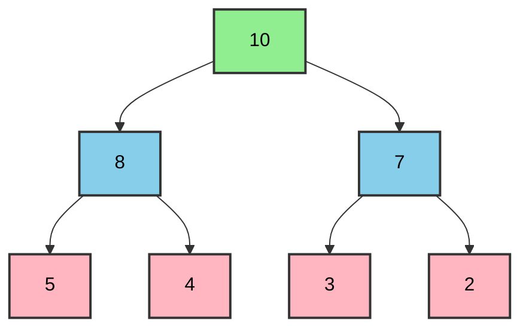

### Heap Property
For every node `i` (except the root):
- **Max-Heap**: `parent(i) ≥ i`
- **Min-Heap**: `parent(i) ≤ i`

---

## Heap Types

### 1. Max-Heap

The value of every node is **greater than or equal to** the values of its children.

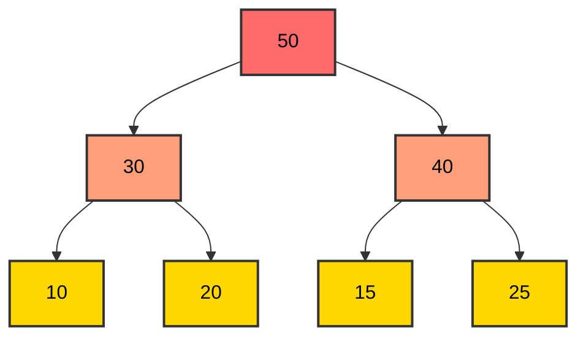

**Observations:**
- The root contains the **maximum** element
- For every node: `parent ≥ left_child` and `parent ≥ right_child`

### 2. Min-Heap

The value of every node is **less than or equal to** the values of its children.

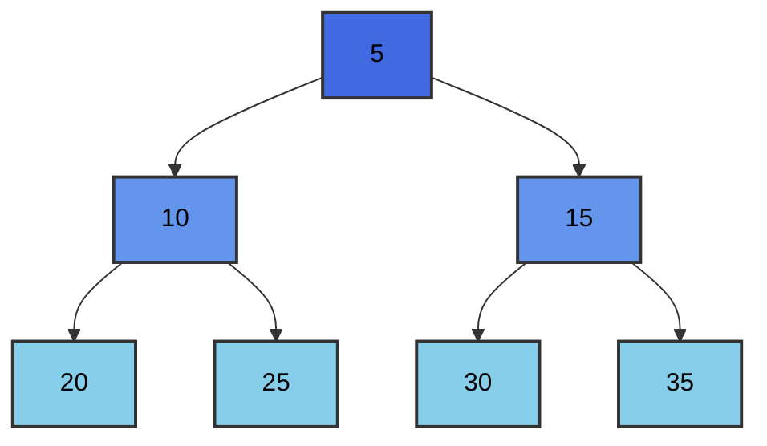

**Observations:**
- The root contains the **minimum** element
- For every node: `parent ≤ left_child` and `parent ≤ right_child`

---

## Array Representation

### Index Mapping

For a node at position `i` (0-based):
- **Parent**: `parent(i) = ⌊(i-1)/2⌋`
- **Left child**: `left(i) = 2i + 1`
- **Right child**: `right(i) = 2i + 2`

### Max-Heap Example

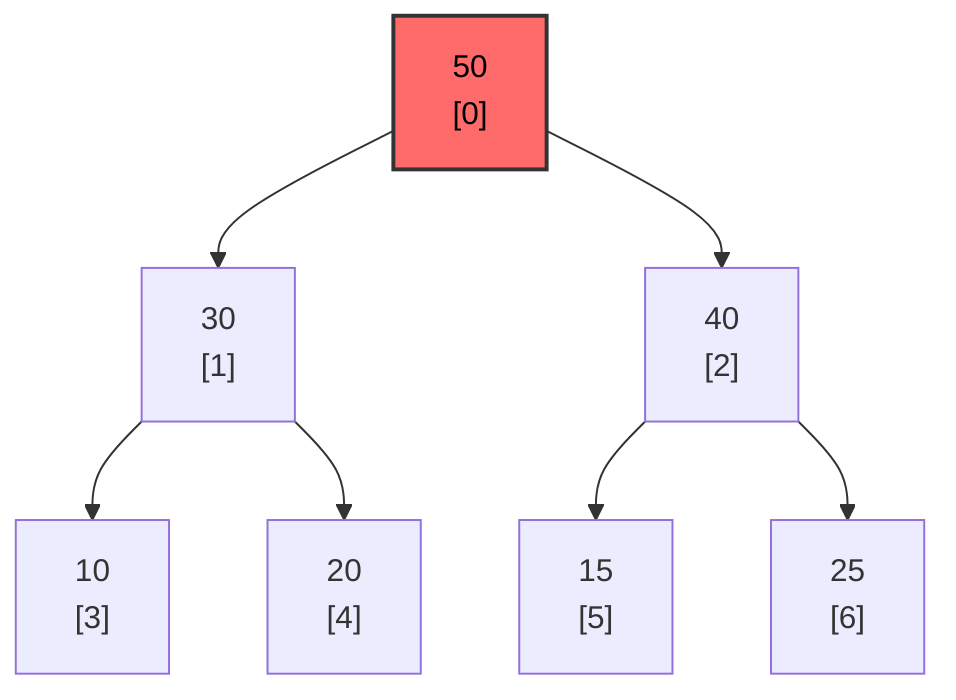

**Array representation:**
```
Index:  0   1   2   3   4   5   6
Value: [50, 30, 40, 10, 20, 15, 25]
```

**Relationship verification:**
- `parent(1) = ⌊(1-1)/2⌋ = 0` → 50 (Correct)
- `left(0) = 2×0 + 1 = 1` → 30 (Correct)
- `right(0) = 2×0 + 2 = 2` → 40 (Correct)

---

## Core Operations

### 1. Heapify (Property Restoration)

The **heapify** procedure fixes the heap property for a subtree.

#### Heapify-Down (Max-Heap)

```cpp
/**
 * Restores the max-heap property for node i.
 * 
 * Args:
 *     arr (std::vector<int>&): The array representing the heap.
 *     n (int): The size of the heap.
 *     i (int): The index of the node to process.
 */
void heapifyDown(std::vector<int>& arr, int n, int i) {
    int largest = i;  // Initialize largest as root
    int left_child = 2 * i + 1;  // Left child
    int right_child = 2 * i + 2;  // Right child
    
    // Check if left child exists and is greater
    if (left_child < n && arr[left_child] > arr[largest]) {
        largest = left_child;
    }
    
    // Check if right child exists and is greater
    if (right_child < n && arr[right_child] > arr[largest]) {
        largest = right_child;
    }
    
    // If the largest is not the root
    if (largest != i) {
        std::swap(arr[i], arr[largest]);  // Swap
        heapifyDown(arr, n, largest);  // Recursive call
    }
}
```

### 2. Element Insertion

Adding a new element to the heap and restoring the property.

```cpp
/**
 * Inserts a new element into the max-heap.
 * 
 * Args:
 *     heap (std::vector<int>&): The heap.
 *     value (int): The value to insert.
 */
void insertMaxHeap(std::vector<int>& heap, int value) {
    heap.push_back(value);  // Add to the end
    int i = heap.size() - 1;  // Index of the new element
    
    // Heapify-up: bubble the element up to its correct position
    while (i > 0) {
        int parent_index = (i - 1) / 2;
        if (heap[i] > heap[parent_index]) {
            std::swap(heap[i], heap[parent_index]);  // Swap
            i = parent_index;
        } else {
            break;
        }
    }
}
```

### 3. Maximum/Minimum Deletion (Extract)

Removing the root (maximum/minimum) and restoring the heap.

```cpp
/**
 * Removes and returns the maximum element from the max-heap.
 * 
 * Args:
 *     heap (std::vector<int>&): The heap.
 * 
 * Returns:
 *     int: The maximum element.
 * 
 * Throws:
 *     std::runtime_error: If the heap is empty.
 */
int extractMax(std::vector<int>& heap) {
    if (heap.empty()) {
        throw std::runtime_error("The heap is empty");
    }
    
    int max_val = heap[0];  // Store the maximum
    
    if (heap.size() == 1) {
        heap.pop_back();
        return max_val;
    }
    
    heap[0] = heap.back();  // Move the last element to the root
    heap.pop_back();
    heapifyDown(heap, heap.size(), 0);  // Restore the property
    
    return max_val;
}
```

### 4. Build Heap

Converting an unstructured array into a heap.

```cpp
/**
 * Converts an array into a max-heap.
 * 
 * Args:
 *     arr (std::vector<int>&): The array to convert.
 */
void buildMaxHeap(std::vector<int>& arr) {
    int n = arr.size();
    // Start from the last non-leaf node
    for (int i = n / 2 - 1; i >= 0; i--) {
        heapifyDown(arr, n, i);
    }
}
```

---

## Examples with Solutions

### Example 1: Creating a Max-Heap

**Problem:** Create a max-heap from the array `[4, 10, 3, 5, 1]`.

**Step-by-step Solution:**

**Initial Tree:**
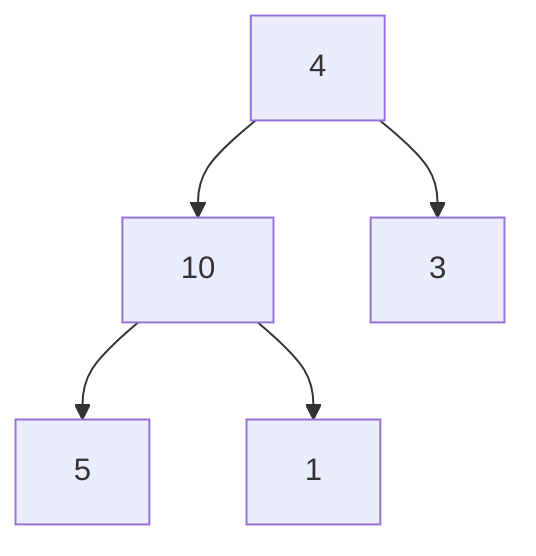

**Step 1:** Heapify from node 1 (value 10)
- `left(1) = 3` → value 5
- `right(1) = 4` → value 1
- `max(10, 5, 1) = 10` → No change

**Step 2:** Heapify from node 0 (value 4)
- `left(0) = 1` → value 10
- `right(0) = 2` → value 3
- `max(4, 10, 3) = 10` → Swap 4 and 10

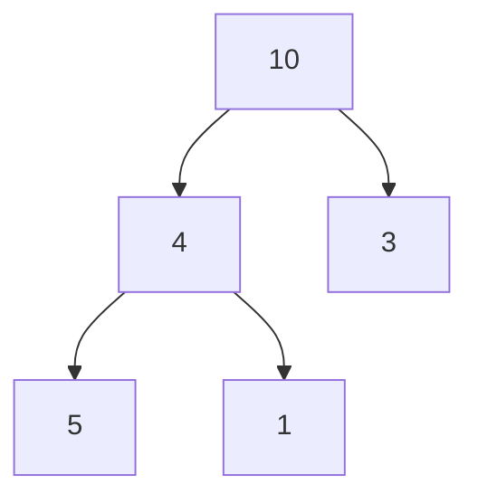

**Step 3:** Heapify from node 1 (value 4 after swap)
- `left(1) = 3` → value 5
- `right(1) = 4` → value 1
- `max(4, 5, 1) = 5` → Swap 4 and 5

**Final Max-Heap:**
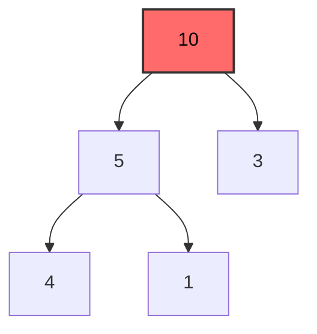

**Array:** `[10, 5, 3, 4, 1]`

---

### Example 2: Inserting an Element into a Max-Heap

**Problem:** Insert the value `15` into the max-heap `[50, 30, 40, 10, 20, 15, 25]`.

**Initial Heap:**
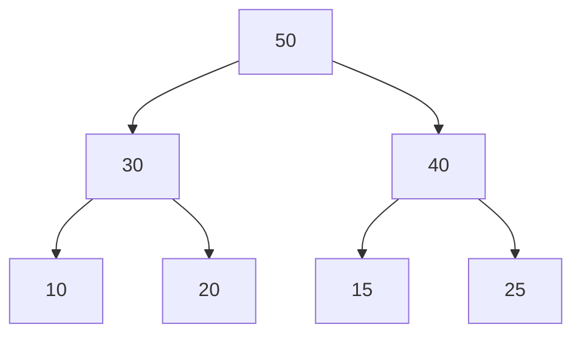

**Step 1:** Add 15 to the end
```
[50, 30, 40, 10, 20, 15, 25, 15]
```

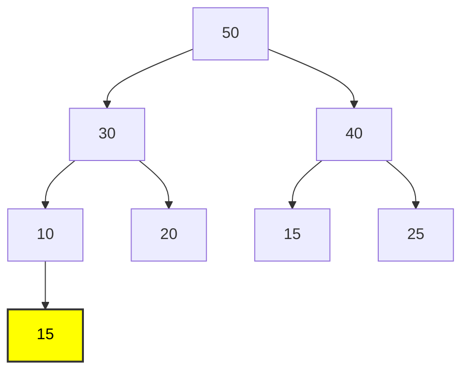

**Step 2:** Heapify-up from position 7
- `parent(7) = 3` → value 10
- `15 > 10` → Swap

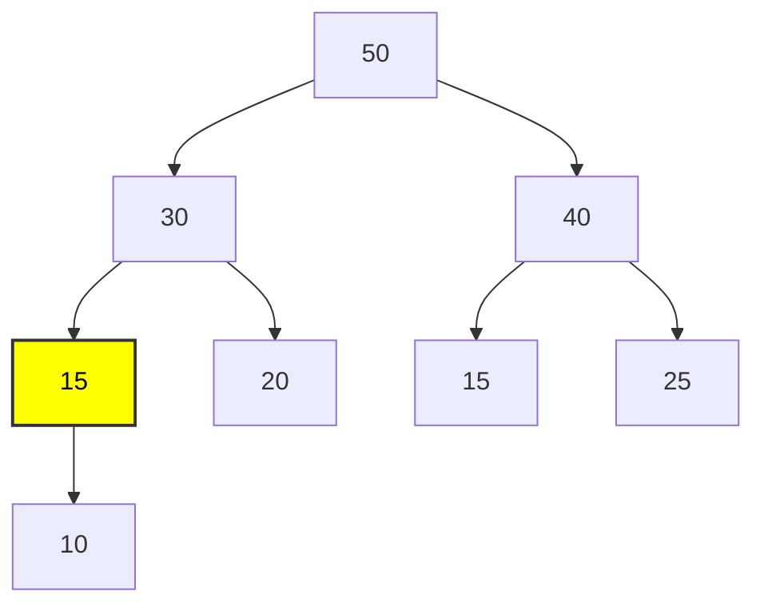

**Step 3:** Heapify-up from position 3
- `parent(3) = 1` → value 30
- `15 < 30` → End

**Final Heap:** `[50, 30, 40, 15, 20, 15, 25, 10]`

---

### Example 3: Deleting the Maximum from a Max-Heap

**Problem:** Delete the maximum from the heap `[50, 30, 40, 10, 20, 15, 25]`.

**Initial Heap:**
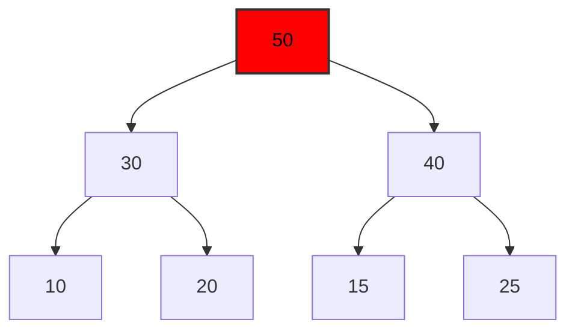

**Step 1:** Replace root with last element
```
[25, 30, 40, 10, 20, 15]
```

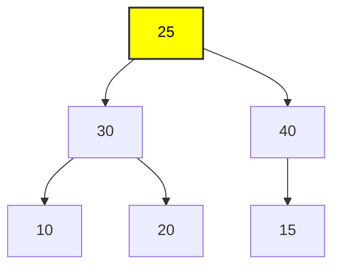

**Step 2:** Heapify-down from root
- `left(0) = 1` → value 30
- `right(0) = 2` → value 40
- `max(25, 30, 40) = 40` → Swap 25 and 40

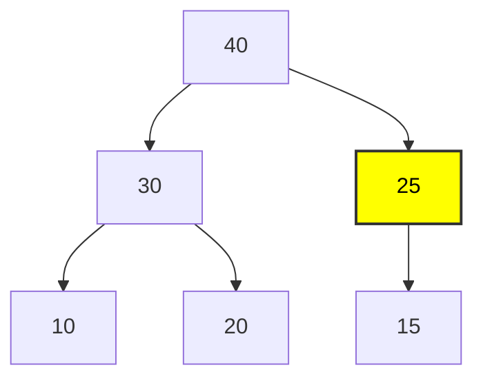

**Step 3:** Heapify-down from position 2
- `left(2) = 5` → value 15
- `right(2) = 6` → does not exist
- `max(25, 15) = 25` → End

**Final Heap:** `[40, 30, 25, 10, 20, 15]`

---

### Example 4: Creating a Min-Heap

**Problem:** Convert the array `[20, 15, 8, 10, 5, 7, 6, 2, 9, 1]` into a min-heap.

**Solution:**

**Step 1:** Start from the last non-leaf (index = `n//2 - 1 = 4`)

**Initial Tree:**
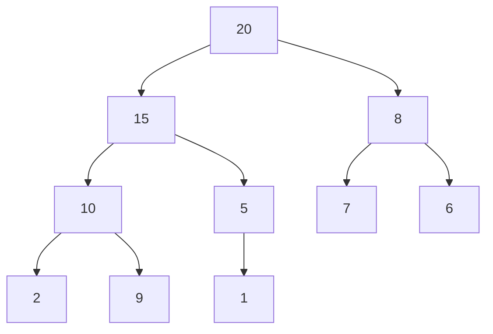

**Step 2:** Heapify from index 4 (value 5)
- `left(4) = 9` → value 1
- `min(5, 1) = 1` → Swap 5 and 1

**Step 3:** Heapify from index 3 (value 10)
- `left(3) = 7` → value 2
- `right(3) = 8` → value 9
- `min(10, 2, 9) = 2` → Swap 10 and 2

**Step 4:** Heapify from index 2 (value 8)
- `left(2) = 5` → value 7
- `right(2) = 6` → value 6
- `min(8, 7, 6) = 6` → Swap 8 and 6

**Step 5:** Heapify from index 1 (value 15)
- `left(1) = 3` → value 2
- `right(1) = 4` → value 1
- `min(15, 2, 1) = 1` → Swap 15 and 1
- Continue heapify at position 4:
  - `left(4) = 9` → value 5
  - `min(15, 5) = 5` → Swap 15 and 5

**Step 6:** Heapify from index 0 (value 20)
- `left(0) = 1` → value 1
- `right(0) = 2` → value 6
- `min(20, 1, 6) = 1` → Swap 20 and 1
- Continue from position 1:
  - `left(1) = 3` → value 2
  - `right(1) = 4` → value 5
  - `min(20, 2, 5) = 2` → Swap 20 and 2
- Continue from position 3:
  - `left(3) = 7` → value 10
  - `right(3) = 8` → value 9
  - `min(20, 10, 9) = 9` → Swap 20 and 9

**Final Min-Heap:**
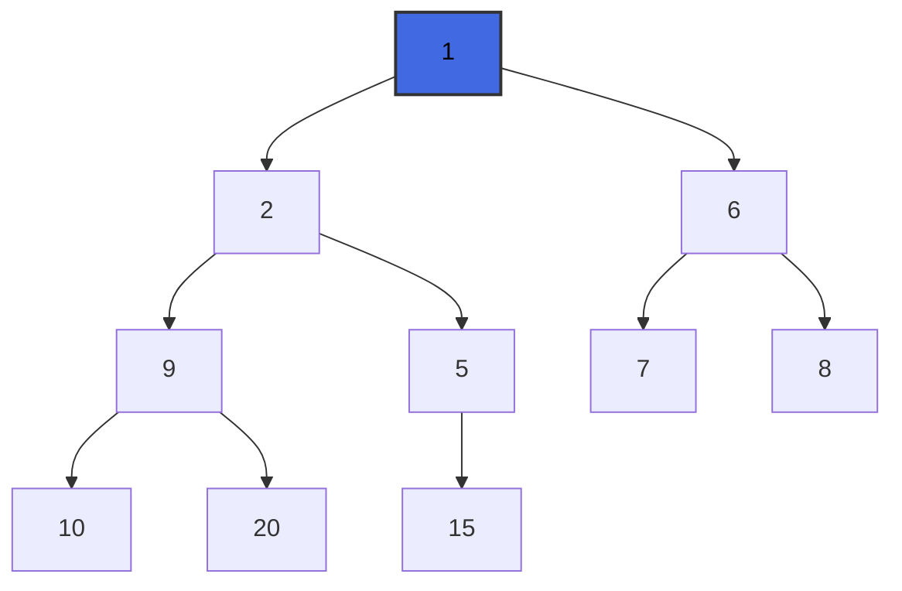

**Array:** `[1, 2, 6, 9, 5, 7, 8, 10, 20, 15]`

---

### Example 5: Heap Sort

**Problem:** Sort the array `[12, 11, 13, 5, 6, 7]` using Heap Sort.

**Algorithm:**
```cpp
/**
 * Sorts an array using Heap Sort.
 * 
 * Args:
 *     arr (std::vector<int>&): The array to sort.
 */
void heapSort(std::vector<int>& arr) {
    int n = arr.size();
    
    // Step 1: Build max-heap
    buildMaxHeap(arr);
    
    // Step 2: Extract elements one by one
    for (int i = n - 1; i > 0; i--) {
        std::swap(arr[0], arr[i]);  // Swap root with last
        heapifyDown(arr, i, 0);  // Heapify on the reduced heap
    }
}
```

**Step-by-step Solution:**

**Step 1:** Build Max-Heap
```
Initial: [12, 11, 13, 5, 6, 7]
Max-Heap: [13, 11, 12, 5, 6, 7]
```

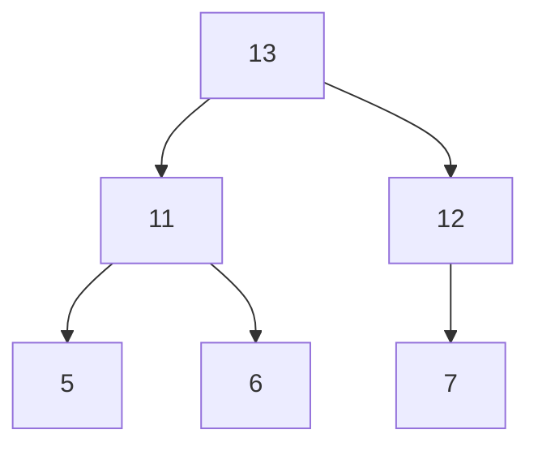

**Step 2:** Swap 13 and 7, Heapify
```
[7, 11, 12, 5, 6 | 13]
Heapify → [12, 11, 7, 5, 6 | 13]
```

**Step 3:** Swap 12 and 6, Heapify
```
[6, 11, 7, 5 | 12, 13]
Heapify → [11, 6, 7, 5 | 12, 13]
```

**Step 4:** Swap 11 and 5, Heapify
```
[5, 6, 7 | 11, 12, 13]
Heapify → [7, 6, 5 | 11, 12, 13]
```

**Step 5:** Swap 7 and 5, Heapify
```
[5, 6 | 7, 11, 12, 13]
Heapify → [6, 5 | 7, 11, 12, 13]
```

**Step 6:** Swap 6 and 5
```
[5 | 6, 7, 11, 12, 13]
```

**Final Sorted:** `[5, 6, 7, 11, 12, 13]`

---

## Complexity

### Time Complexity

| Operation | Complexity | Explanation |
|------------|---------------|-----------|
| Insert | O(log n) | Heapify-up up the height of the tree |
| Extract Max/Min | O(log n) | Heapify-down up the height of the tree |
| Heapify | O(log n) | Processing a single path |
| Build Heap | O(n) | Optimized construction |
| Heap Sort | O(n log n) | n extractions × O(log n) |
| Peek (Find Max/Min) | O(1) | Accessing the root |

### Space Complexity

- **Storage:** O(n) - Array of n elements
- **Recursion:** O(log n) - Recursion depth for heapify

---

## Heap Applications

### 1. Priority Queue
```cpp
/**
 * Priority queue using min-heap.
 * 
 * Provides basic element management operations based on priority.
 */
class PriorityQueue {
public:
    /**
     * Insert element with priority.
     * 
     * Args:
     *     priority (int): The priority value.
     *     item (std::string): The item.
     */
    void push(int priority, std::string item) {
        heap_data.push_back({priority, item});
        heapifyUp(heap_data.size() - 1);
    }

    /**
     * Extract element with highest priority (lowest value).
     * 
     * Returns:
     *     std::string: The item with the lowest priority.
     */
    std::string pop() {
        if (heap_data.empty()) return "";
        
        if (heap_data.size() == 1) {
            std::string item = heap_data[0].item;
            heap_data.pop_back();
            return item;
        }

        std::string item = heap_data[0].item;
        heap_data[0] = heap_data.back();
        heap_data.pop_back();
        heapifyDown(0);
        
        return item;
    }

private:
    struct Node {
        int priority;
        std::string item;
    };
    std::vector<Node> heap_data;

    /**
     * Restore heap property upward.
     * 
     * Args:
     *     index (int): The starting index.
     */
    void heapifyUp(int index) {
        int i = index;
        while (i > 0) {
            int p = (i - 1) / 2;
            if (heap_data[i].priority < heap_data[p].priority) {
                std::swap(heap_data[i], heap_data[p]);
                i = p;
            } else break;
        }
    }

    /**
     * Restore heap property downward.
     * 
     * Args:
     *     index (int): The starting index.
     */
    void heapifyDown(int index) {
        int smallest = index;
        int left = 2 * index + 1;
        int right = 2 * index + 2;
        int n = heap_data.size();
        
        if (left < n && heap_data[left].priority < heap_data[smallest].priority)
            smallest = left;
        if (right < n && heap_data[right].priority < heap_data[smallest].priority)
            smallest = right;
        
        if (smallest != index) {
            std::swap(heap_data[index], heap_data[smallest]);
            heapifyDown(smallest);
        }
    }
};
```

### 2. Dijkstra's Algorithm
Using min-heap to efficiently find shortest paths.

### 3. Median Maintenance
Using two heaps (max-heap and min-heap) to find the median in a data stream.

---

## Practice Exercises

### Exercise 1
Create a max-heap from the array `[3, 9, 2, 1, 4, 5]`.

<details>
<summary>Solution</summary>

**Steps:**
1. Build from index 2: `[3, 9, 5, 1, 4, 2]`
2. Build from index 1: `[3, 9, 5, 1, 4, 2]` (no change)
3. Build from index 0: `[9, 4, 5, 1, 3, 2]`

**Final:** `[9, 4, 5, 1, 3, 2]`
</details>

### Exercise 2
Insert 8 into the min-heap `[1, 3, 2, 7, 5, 4, 6]`.

<details>
<summary>Solution</summary>

1. Add: `[1, 3, 2, 7, 5, 4, 6, 8]`
2. Parent(7) = 3, value 7
3. 8 > 7, no change

**Final:** `[1, 3, 2, 7, 5, 4, 6, 8]`
</details>

### Exercise 3
Delete the minimum from the min-heap `[2, 4, 3, 8, 5, 9, 7]`.

<details>
<summary>Solution</summary>

1. Remove 2, replace with 7: `[7, 4, 3, 8, 5, 9]`
2. Heapify: 7 > min(4,3), swap with 3: `[3, 4, 7, 8, 5, 9]`
3. Heapify: 7 < min(9), end

**Final:** `[3, 4, 7, 8, 5, 9]`
</details>

---
